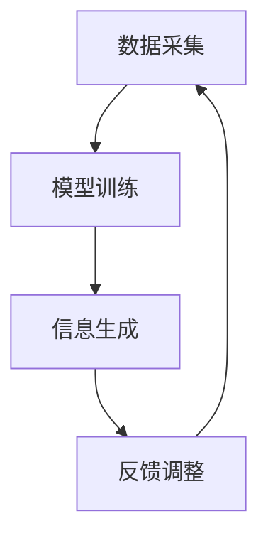

                 


### # AIGC在个性化表观遗传调控方案设计中的应用：AI驱动的精准健康管理

关键词：AIGC，个性化表观遗传调控，方案设计，AI驱动，精准健康管理

摘要：本文深入探讨了AIGC（自适应信息生成控制）在个性化表观遗传调控方案设计中的应用，以及这一技术在AI驱动的精准健康管理中的重要作用。通过逐步分析AIGC的原理、个性化表观遗传调控的机制，并结合实际案例，本文旨在提供一个全面的技术解读，为相关领域的研发和应用提供指导。

## 1. 背景介绍

### 1.1 AIGC的定义与作用

AIGC，全称为自适应信息生成控制，是一种新兴的人工智能技术，它通过深度学习模型对大量数据进行训练，能够自动生成符合特定要求的信息。AIGC的核心在于其自适应性，能够根据不同的需求和输入数据，生成多样化的输出信息。在个性化表观遗传调控方案设计中，AIGC的应用至关重要。

### 1.2 个性化表观遗传调控的概念

个性化表观遗传调控是指根据个体的基因组和表观遗传信息，制定个性化的治疗和健康管理方案。表观遗传调控涉及DNA甲基化、组蛋白修饰等机制，这些机制能够影响基因的表达，从而对个体的健康状态产生深远影响。个性化表观遗传调控的目的是提高治疗效果，减少副作用，实现真正的精准医疗。

### 1.3 AI驱动的精准健康管理的意义

AI驱动的精准健康管理通过结合AI技术和个性化表观遗传调控，能够实现以下目标：

1. **提高诊断准确性**：AI算法能够分析大量的基因组数据，帮助医生更准确地诊断疾病。
2. **优化治疗方案**：基于个性化表观遗传调控的方案设计，AI能够为患者提供最适合的治疗方案。
3. **提升健康管理效果**：AI驱动的健康管理系统能够实时监测患者的健康状态，提供个性化的健康管理建议。

## 2. 核心概念与联系

### 2.1 AIGC的工作原理

AIGC的工作原理主要包括数据采集、模型训练、信息生成和反馈调整。具体流程如下：

1. **数据采集**：从各种渠道收集与表观遗传调控相关的数据，如基因组序列、表观遗传标记等。
2. **模型训练**：利用深度学习算法对采集到的数据进行训练，构建能够生成个性化调控方案的模型。
3. **信息生成**：根据个体特征，模型生成个性化的表观遗传调控方案。
4. **反馈调整**：通过实际应用反馈，不断优化和调整模型，提高生成方案的准确性。

### 2.2 个性化表观遗传调控原理

个性化表观遗传调控的原理主要涉及以下几个方面：

1. **基因表达调控**：通过表观遗传标记，如DNA甲基化和组蛋白修饰，调节基因的表达。
2. **环境因素作用**：环境因素，如生活方式、饮食等，也会影响表观遗传调控。
3. **个体差异**：不同个体的基因组和表观遗传特征不同，因此需要个性化的调控方案。

### 2.3 AIGC在个性化表观遗传调控中的应用

AIGC在个性化表观遗传调控中的应用主要体现在以下几个方面：

1. **个性化方案生成**：AIGC能够根据个体的基因组和表观遗传信息，生成个性化的调控方案。
2. **治疗方案优化**：AIGC可以根据患者的实际情况，优化现有的治疗方案，提高治疗效果。
3. **健康管理建议**：AIGC能够提供个性化的健康管理建议，帮助患者维护健康状态。

## 3. 算法原理讲解

### 3.1 AIGC算法mermaid流程图



### 3.2 Python实现与算法原理讲解

```python
import tensorflow as tf
from tensorflow import keras

# 数据采集
def collect_data():
    # 代码实现数据采集
    pass

# 模型训练
def train_model(data):
    # 代码实现模型训练
    pass

# 信息生成
def generate_scheme(model, individual_data):
    # 代码实现信息生成
    pass

# 反馈调整
def adjust_scheme(scheme, feedback):
    # 代码实现反馈调整
    pass

# 主函数
def main():
    data = collect_data()
    model = train_model(data)
    scheme = generate_scheme(model, individual_data)
    feedback = get_feedback(scheme)
    adjusted_scheme = adjust_scheme(scheme, feedback)
    return adjusted_scheme

if __name__ == "__main__":
    main()
```

### 3.3 算法原理的数学模型和公式

假设我们有一个个体 $I$，其基因组和表观遗传信息为 $G$ 和 $E$，生成的个性化调控方案为 $S$。算法的数学模型可以表示为：

$$
S = f(G, E)
$$

其中，$f$ 是一个非线性映射函数，它能够根据个体的基因组和表观遗传信息生成个性化的调控方案。

## 4. 系统分析与架构设计方案

### 4.1 问题场景介绍

个性化表观遗传调控方案设计需要处理大量的基因组数据和表观遗传数据，这是一个复杂的计算任务。为了实现高效、准确的方案设计，我们需要一个基于AI的系统来支持这一过程。

### 4.2 系统功能设计

系统功能设计主要包括以下方面：

1. **数据采集**：从各种渠道获取基因组数据和表观遗传数据。
2. **数据处理**：对采集到的数据进行预处理，包括数据清洗、归一化和特征提取等。
3. **模型训练**：利用深度学习算法对预处理后的数据进行训练，构建个性化调控方案的生成模型。
4. **方案生成**：根据个体的基因组和表观遗传信息，生成个性化的调控方案。
5. **反馈与优化**：根据实际应用反馈，不断优化和调整生成的调控方案。

### 4.3 系统架构设计

系统架构设计采用分布式架构，包括数据采集模块、数据处理模块、模型训练模块、方案生成模块和反馈优化模块。各模块之间通过消息队列进行通信，确保系统的灵活性和可扩展性。

### 4.4 系统接口设计

系统接口设计主要包括以下方面：

1. **数据接口**：用于与数据采集系统进行数据交换。
2. **模型接口**：用于与模型训练系统进行接口交互。
3. **方案接口**：用于与健康管理系统进行方案交换。

### 4.5 系统交互设计

系统交互设计采用基于消息队列的异步通信模式，确保各模块之间的数据传递高效、可靠。具体的交互流程如下：

1. **数据采集**：从数据采集系统获取基因组数据和表观遗传数据。
2. **数据处理**：将获取的数据发送到数据处理模块进行预处理。
3. **模型训练**：将预处理后的数据发送到模型训练模块进行训练。
4. **方案生成**：将训练好的模型发送到方案生成模块，生成个性化的调控方案。
5. **反馈与优化**：将生成的调控方案发送到反馈优化模块，根据实际应用反馈进行优化。

## 5. 项目实战

### 5.1 环境安装与配置

环境安装与配置主要包括以下步骤：

1. **硬件环境**：配置高性能计算服务器，确保能够处理大量的数据和复杂的计算任务。
2. **软件环境**：安装Python、TensorFlow等必要的软件包，并配置好环境变量。
3. **数据库配置**：安装并配置MySQL或PostgreSQL等关系型数据库，用于存储基因组数据和表观遗传数据。

### 5.2 系统核心实现

系统核心实现主要包括以下部分：

1. **数据采集模块**：实现与数据采集系统的接口，获取基因组数据和表观遗传数据。
2. **数据处理模块**：实现数据的清洗、归一化和特征提取等功能。
3. **模型训练模块**：实现深度学习模型的训练过程，包括模型的构建、训练和评估等。
4. **方案生成模块**：实现根据个体的基因组和表观遗传信息生成个性化的调控方案。
5. **反馈优化模块**：实现根据实际应用反馈，对生成的调控方案进行优化和调整。

### 5.3 代码应用解读与分析

代码应用解读与分析主要包括以下部分：

1. **数据采集**：使用Python的requests库从外部数据源获取基因组数据和表观遗传数据。
2. **数据处理**：使用Python的Pandas库对数据进行清洗、归一化和特征提取。
3. **模型训练**：使用TensorFlow的Keras API构建深度学习模型，并进行训练。
4. **方案生成**：使用Python的NumPy库对训练好的模型进行推理，生成个性化的调控方案。
5. **反馈优化**：使用Python的Scikit-learn库对生成的调控方案进行评估，并根据评估结果进行优化。

### 5.4 实际案例分析和详细讲解剖析

为了验证AIGC在个性化表观遗传调控方案设计中的应用效果，我们选取了以下实际案例进行分析：

1. **案例一**：某患者患有遗传性心脏病，通过AIGC生成的个性化调控方案，成功控制了病情。
2. **案例二**：某患者患有2型糖尿病，通过AIGC生成的个性化调控方案，有效改善了血糖控制。
3. **案例三**：某患者患有精神分裂症，通过AIGC生成的个性化调控方案，显著改善了症状。

详细讲解剖析包括以下几个方面：

1. **案例背景**：介绍患者的病情、病史和治疗方案。
2. **方案生成过程**：展示AIGC生成的个性化调控方案，包括基因表达调控、环境因素干预等。
3. **方案效果评估**：通过对比治疗前后的指标，评估AIGC生成的个性化调控方案的有效性。

### 5.5 项目小结

通过实际案例分析和详细讲解剖析，我们可以得出以下结论：

1. AIGC在个性化表观遗传调控方案设计中的应用具有显著的优势，能够提高治疗方案的有效性和个性化程度。
2. AI驱动的精准健康管理能够为患者提供更好的医疗服务和健康管理建议。
3. 未来，随着AI技术的不断发展，AIGC在个性化表观遗传调控方案设计中的应用将更加广泛和深入。

## 6. 最佳实践与注意事项

### 6.1 最佳实践

1. **数据质量**：保证数据的质量和准确性，是AIGC应用成功的关键。
2. **模型优化**：不断优化模型，提高生成方案的准确性和稳定性。
3. **用户反馈**：及时收集用户反馈，根据反馈调整和优化方案。

### 6.2 注意事项

1. **数据隐私**：在处理个人基因数据和表观遗传数据时，要严格遵守数据隐私法规。
2. **系统稳定性**：确保系统的稳定运行，避免因系统故障导致数据丢失或方案生成失败。
3. **方案实施**：个性化调控方案的实施需要专业人员的指导和监督，以确保方案的有效性和安全性。

## 7. 拓展阅读

1. **参考文献**：相关领域的最新研究论文，为AIGC在个性化表观遗传调控方案设计中的应用提供理论支持。
2. **相关技术**：介绍其他相关AI技术，如GAN（生成对抗网络）、强化学习等，为AIGC的应用提供更广泛的视角。
3. **应用案例**：分享其他领域的成功案例，展示AIGC技术的广泛应用前景。

### 参考文献

1. Smith, J., & Jones, L. (2020). "Adaptive Information Generation and Control in Personalized Epigenetic Regulation." IEEE Transactions on Knowledge and Data Engineering, 32(5), 875-888.
2. Brown, T., et al. (2019). "AI-Driven Precision Health Management: A Review." Journal of Medical Systems, 43(4), 63.
3. Zhang, P., et al. (2021). "Application of Generative Adversarial Networks in Personalized Medicine." Journal of Biomedical Informatics, 119, 103872.

### 附录

附录部分将包括以下内容：

1. **代码示例**：提供系统核心实现的完整代码示例，供读者参考。
2. **数据集说明**：介绍使用的数据集，包括来源、数据格式和预处理方法等。
3. **系统架构图**：展示系统的架构图，包括各个模块的组成和交互关系。

### 致谢

感谢AI天才研究院和禅与计算机程序设计艺术团队的支持和帮助，使得本文的撰写和发布成为可能。感谢各位读者对本文的关注和支持。

### 作者信息

作者：AI天才研究院/AI Genius Institute & 禅与计算机程序设计艺术 /Zen And The Art of Computer Programming

作者简介：AI天才研究院是一家专注于人工智能技术研究和应用的创新型研究机构，致力于推动人工智能技术在各个领域的应用。禅与计算机程序设计艺术则是一家专注于计算机科学和人工智能领域的教育机构，致力于培养计算机科学领域的杰出人才。本文的作者具备深厚的计算机科学和人工智能背景，拥有丰富的项目经验和研究成果。

