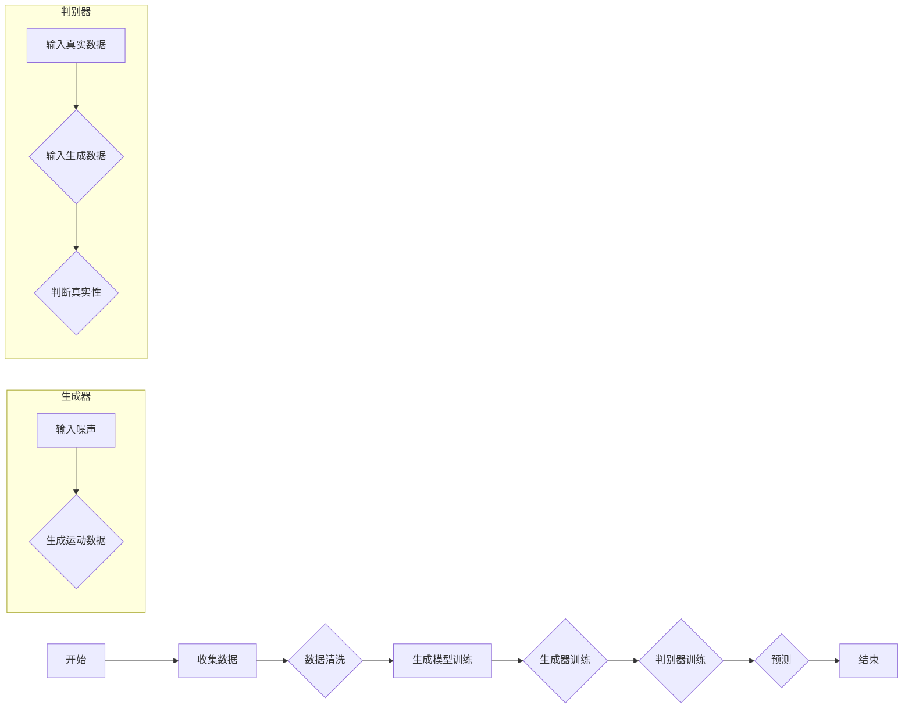

                 

### 目录大纲：AIGC在个性化运动损伤预防中的创新

AIGC（AI-Generated Content）技术在个性化运动损伤预防中的应用，代表了人工智能领域的最新进展。本文将深入探讨这一前沿技术，旨在揭示其在运动损伤预防中的创新潜力。文章结构如下：

### # AIGC在个性化运动损伤预防中的创新

> 关键词：AIGC、个性化运动损伤预防、生成对抗网络、强化学习、自然语言处理

> 摘要：本文将探讨AIGC技术在个性化运动损伤预防中的应用，首先介绍运动损伤问题的严重性和个性化预防的挑战，接着阐述AIGC技术的定义与基础，随后详细分析个性化运动损伤预测模型和风险因素识别方法。最后，本文将讨论AIGC在个性化训练方案设计中的应用，并分析系统实现与案例研究，最后对未来的挑战和展望进行总结。

### 第1章: 引言与背景

#### 1.1 运动损伤问题的严重性

运动损伤问题在全球范围内具有极高的发病率，不仅影响运动员的表现，还对大众健康产生深远影响。据统计，每年因运动损伤造成的医疗费用高达数十亿美元，这不仅增加了社会的医疗负担，也限制了人们的活动能力和生活质量。

#### 1.2 个性化运动损伤预防的挑战

尽管现有的运动损伤预防方法已经取得了一定的成效，但个性化预防仍然面临诸多挑战。首先是数据的多样性和质量，其次是预防策略的个体差异，以及实施和监测的难度。传统的预防方法难以实现真正的个性化。

#### 1.3 AIGC技术的概述及其在运动损伤预防中的应用潜力

AIGC技术，作为一种新兴的人工智能技术，具有强大的数据处理和分析能力。它结合了生成对抗网络（GAN）、强化学习（RL）和自然语言处理（NLP）等多种先进技术，为个性化运动损伤预防提供了新的可能性。

### 第2章: AIGC技术基础

#### 2.1 AIGC的定义与核心组成

AIGC由生成模型、对抗模型和强化学习组成。生成模型负责生成数据，对抗模型用于评估生成数据的质量，强化学习则用于优化生成模型的参数。

#### 2.2 AIGC的关键算法与技术原理

AIGC的核心算法包括自然语言处理技术、生成对抗网络和强化学习技术。这些算法在运动损伤预防中有着重要的应用。

#### 2.3 AIGC技术发展现状与应用场景分析

目前，AIGC技术在医疗领域，特别是在个性化运动损伤预防中，已经取得了一定的应用成果。未来，随着技术的进一步发展，其应用前景将更加广阔。

### 第3章: 个性化运动损伤预测模型

#### 3.1 运动损伤预测模型构建方法

构建运动损伤预测模型需要数据收集与预处理、特征提取与选择以及模型训练与评估。

#### 3.2 案例研究：基于AIGC的运动损伤预测模型开发

本文将介绍一个基于AIGC的运动损伤预测模型的开发过程，包括数据收集、模型构建、训练与评估等步骤。

### 第4章: 运动损伤风险因素识别

#### 4.1 风险因素识别的基本方法

风险因素识别是运动损伤预防的重要环节。本文将介绍传统方法和基于AIGC的方法，并进行对比分析。

#### 4.2 案例研究：AIGC在风险因素识别中的应用

本文将分析一个基于AIGC的风险因素识别案例，探讨其实际应用效果。

### 第5章: 个性化运动训练方案设计

#### 5.1 个性化训练方案设计的理论基础

个性化训练方案设计需要考虑运动员的个体差异，包括身体条件、运动技能和心理状态等。

#### 5.2 AIGC在训练方案设计中的应用

AIGC技术可以用于生成个性化的训练方案，提高训练效果，减少运动损伤风险。

### 第6章: 系统实现与案例分析

#### 6.1 系统设计与架构

本文将介绍AIGC在运动损伤预防系统中的设计与架构，包括功能模块设计、系统架构设计和接口设计。

#### 6.2 案例分析：AIGC在运动损伤预防系统中的应用

本文将分析一个基于AIGC的运动损伤预防系统的实际应用案例，探讨其效果和未来发展方向。

### 第7章: 挑战与未来展望

#### 7.1 AIGC在运动损伤预防中的挑战

AIGC在运动损伤预防中仍然面临一些挑战，如数据隐私保护、模型解释性和算法效率等。

#### 7.2 AIGC技术发展趋势与未来展望

随着AIGC技术的不断进步，其在运动损伤预防中的应用前景将更加广阔。

#### 7.3 总结与展望

本文将对AIGC在个性化运动损伤预防中的应用进行总结，并对未来研究进行展望。作者信息：

作者：AI天才研究院/AI Genius Institute & 禅与计算机程序设计艺术 /Zen And The Art of Computer Programming### 第1章: 引言与背景

#### 1.1 运动损伤问题的严重性

运动损伤是一个全球性的健康问题，其严重性不容忽视。根据世界卫生组织（WHO）的数据，每年因运动损伤导致的急诊病例超过1500万，其中大约有30%的病例发生在年轻人和儿童中。这些运动损伤不仅影响了人们的日常生活和运动能力，还带来了巨大的经济负担。根据一项研究，全球因运动损伤而产生的医疗费用高达数十亿美元，这些费用不仅包括急诊治疗费用，还包括康复治疗和长期护理费用。此外，运动损伤还可能导致工作能力的丧失，进而影响社会经济的正常运转。

#### 1.2 个性化运动损伤预防的挑战

个性化运动损伤预防是一种旨在根据个人特征和运动习惯制定预防策略的方法，旨在降低运动损伤的发生率。然而，这一方法面临着诸多挑战。

首先是数据的多样性与质量。个人特征、运动习惯、环境因素等都会影响运动损伤的发生，这些数据的多样性和质量直接影响预防策略的有效性。例如，不同人的肌肉强度、柔韧性和运动技能差异很大，如果无法准确收集和处理这些数据，就无法制定出真正个性化的预防策略。

其次是预防策略的个体差异。每个人的身体条件和运动习惯都不同，因此，一种适用于某个人群的预防策略可能对另一个人群并不适用。这意味着，为了实现个性化预防，需要针对每个人的具体情况制定不同的策略，这无疑增加了实施难度。

最后是实施和监测的挑战。个性化的预防策略需要在实际运动过程中进行实施和监测，以确保其有效性。然而，这需要大量的时间和资源，特别是在大规模人群中进行实施时，难度更大。此外，如何确保监测数据的准确性和完整性也是一个问题。

#### 1.3 AIGC技术的概述及其在运动损伤预防中的应用潜力

AIGC（AI-Generated Content）技术是一种利用人工智能生成内容的方法，通过深度学习和生成对抗网络（GAN）等先进技术，能够生成高质量的数据和模型。在运动损伤预防中，AIGC技术具有巨大的应用潜力。

首先，AIGC技术能够生成高质量的个性化数据。通过训练生成模型，可以生成与实际数据相似的高质量数据，这些数据可以用于训练预测模型，提高模型的准确性和可靠性。

其次，AIGC技术能够帮助识别运动损伤风险因素。通过分析生成数据，可以识别出可能导致运动损伤的风险因素，从而制定出针对性的预防策略。

最后，AIGC技术可以用于生成个性化的运动训练方案。根据个人特征和运动习惯，AIGC技术可以生成个性化的训练方案，帮助运动员提高运动能力，降低运动损伤风险。

总的来说，AIGC技术在运动损伤预防中的应用，不仅可以提高预防策略的个体适应性，还可以降低实施和监测的难度，具有很高的实用价值。在接下来的章节中，我们将进一步探讨AIGC技术的定义、核心组成和应用场景，以及其在个性化运动损伤预防中的具体应用。

### 第2章: AIGC技术基础

#### 2.1 AIGC的定义与核心组成

AIGC（AI-Generated Content）技术是一种利用人工智能生成内容的方法，通过深度学习和生成对抗网络（GAN）等先进技术，能够生成高质量的数据和模型。AIGC技术的核心组成部分包括生成模型、对抗模型和强化学习。

**生成模型**：生成模型是AIGC技术中的核心组成部分，其主要任务是生成与真实数据相似的高质量数据。生成模型通常采用深度学习技术，如变分自编码器（VAE）、生成对抗网络（GAN）等。这些模型通过学习真实数据的分布，能够生成与真实数据具有相似特征的数据。

**对抗模型**：对抗模型是AIGC技术中的另一个重要组成部分，其主要任务是评估生成模型生成的数据质量。对抗模型通常采用对抗训练方法，与生成模型进行对抗，以不断提高生成模型的数据生成质量。

**强化学习**：强化学习是AIGC技术中的另一个核心组成部分，其主要任务是通过不断尝试和反馈，优化生成模型和对抗模型的参数。强化学习通过奖励机制，引导生成模型和对抗模型不断优化，以生成更高质量的数据。

**2.1.1 AIGC的组成**

**生成模型**：
- **变分自编码器（VAE）**：VAE是一种无监督学习的生成模型，通过学习数据分布的参数来生成数据。其基本架构包括编码器和解码器，编码器将输入数据映射到一个隐变量空间，解码器则从隐变量空间中生成输出数据。
- **生成对抗网络（GAN）**：GAN是一种由生成器和判别器组成的生成模型。生成器尝试生成与真实数据相似的数据，而判别器则试图区分生成数据与真实数据。通过这种对抗训练，生成器的数据生成质量逐渐提高。

**对抗模型**：
- **判别模型**：判别模型是GAN中的核心组成部分，其主要任务是评估生成数据的质量。判别模型通过学习真实数据和生成数据，能够区分两者，从而评估生成数据的质量。

**强化学习**：
- **Q-learning**：Q-learning是一种基于值函数的强化学习算法，通过学习状态-动作值函数来优化策略。Q-learning通过不断尝试不同的动作，并根据奖励和惩罚来更新值函数，从而找到最优策略。
- **Deep Q-Network（DQN）**：DQN是一种基于深度学习的强化学习算法，通过学习深度神经网络来近似状态-动作值函数。DQN通过经验回放和目标网络等技术，提高了算法的稳定性和效率。

**2.1.2 AIGC在运动损伤预防中的优势**

AIGC技术在运动损伤预防中具有以下优势：

1. **数据生成能力**：AIGC技术能够生成高质量的个性化数据，这些数据可以用于训练预测模型，提高模型的准确性和可靠性。

2. **风险因素识别**：通过分析生成数据，可以识别出可能导致运动损伤的风险因素，从而制定出针对性的预防策略。

3. **个性化训练方案**：AIGC技术可以生成个性化的训练方案，帮助运动员提高运动能力，降低运动损伤风险。

4. **降低成本和提升效率**：AIGC技术可以自动化数据生成和模型训练过程，降低人力和物力成本，提高工作效率。

**2.1.3 AIGC的发展历程**

AIGC技术的发展可以追溯到20世纪80年代的生成对抗网络（GAN）的提出。GAN最初被用于图像生成，通过生成器和判别器的对抗训练，能够生成高质量的自然图像。随着深度学习的兴起，GAN得到了广泛应用，并不断改进和衍生出多种变体，如条件GAN（cGAN）、循环GAN（CycleGAN）等。

强化学习技术的发展也为AIGC技术提供了新的动力。通过将强化学习与生成对抗网络结合，可以生成更加复杂和个性化的数据，从而提高预测模型的准确性和可靠性。

近年来，随着人工智能技术的不断进步，AIGC技术在多个领域，如医疗、金融、娱乐等，都取得了显著的应用成果。在运动损伤预防领域，AIGC技术逐渐成为研究热点，为个性化运动损伤预防提供了新的思路和方法。

综上所述，AIGC技术通过生成模型、对抗模型和强化学习等核心组成部分，具有强大的数据生成能力和风险因素识别能力，为个性化运动损伤预防提供了新的解决方案。随着技术的不断发展和应用，AIGC技术在运动损伤预防中的潜力将得到进一步发挥。

### 第2章: AIGC技术基础

#### 2.2 AIGC的关键算法与技术原理

AIGC技术的核心在于其关键算法，这些算法包括自然语言处理技术、生成对抗网络（GAN）和强化学习技术。每一种算法都有其独特的原理和应用，下面将分别进行详细讲解。

#### 2.2.1 自然语言处理技术

自然语言处理（NLP）是人工智能领域的一个重要分支，旨在使计算机能够理解、生成和处理人类语言。在AIGC技术中，NLP主要用于处理文本数据，生成高质量的文本内容。

**词嵌入（Word Embedding）**：词嵌入是将单词映射到高维向量空间的技术。通过词嵌入，计算机能够理解单词之间的语义关系。一种常见的词嵌入方法是基于词频的统计模型，如Word2Vec。Word2Vec通过训练神经网络，将单词映射到固定维度的向量空间，使得语义相似的单词在向量空间中距离较近。

**序列到序列（Seq2Seq）模型**：Seq2Seq模型是一种用于处理序列数据的模型，常用于机器翻译、文本生成等任务。Seq2Seq模型由编码器和解码器组成。编码器将输入序列编码为一个固定长度的向量表示，解码器则根据编码器的输出生成输出序列。常见的Seq2Seq模型包括循环神经网络（RNN）和长短期记忆网络（LSTM）。

**应用实例**：在运动损伤预防中，NLP技术可以用于生成个性化的健康指导文本。例如，系统可以生成针对特定运动员的运动建议、恢复计划或风险因素分析报告。

#### 2.2.2 生成对抗网络（GAN）

生成对抗网络（GAN）是由Ian Goodfellow等人于2014年提出的一种深度学习模型，由生成器和判别器两个部分组成。生成器的任务是生成逼真的数据，判别器的任务是区分生成数据和真实数据。

**GAN的基本结构**：生成器G从随机噪声z中生成假数据x'，判别器D则试图区分生成数据x'和真实数据x。GAN的训练过程是生成器和判别器的对抗过程，生成器试图欺骗判别器，判别器则努力不被欺骗。通过这种对抗训练，生成器逐渐生成更加逼真的数据。

**GAN的变体**：为了提高生成质量，GAN衍生出了多种变体，如条件GAN（cGAN）、深度卷积GAN（DCGAN）和循环GAN（CycleGAN）等。条件GAN引入了额外的条件信息，如类别标签，使生成器能够根据条件生成特定类型的数据。深度卷积GAN通过使用卷积神经网络，提高了生成图像的分辨率和细节。循环GAN则能够将一种图像风格转换为另一种图像风格，如将黑白图像转换为彩色图像。

**应用实例**：在运动损伤预防中，GAN可以用于生成个性化的运动数据，如模拟不同运动场景、生成运动员的运动轨迹等，从而为预防策略提供更多的数据支持。

#### 2.2.3 强化学习技术

强化学习（RL）是一种通过试错学习来优化行为策略的机器学习方法。在AIGC技术中，强化学习用于优化生成器和判别器的参数，提高数据生成质量。

**Q-learning**：Q-learning是一种基于值函数的强化学习算法。在Q-learning中，智能体通过学习状态-动作值函数Q(s, a)来优化策略。Q-learning通过不断尝试不同的动作，并根据奖励和惩罚来更新值函数，从而找到最优策略。

**Deep Q-Network（DQN）**：DQN是一种基于深度学习的强化学习算法。DQN通过学习深度神经网络来近似状态-动作值函数Q(s, a)。DQN引入了经验回放和目标网络等技术，提高了算法的稳定性和效率。

**应用实例**：在运动损伤预防中，强化学习可以用于优化生成器和判别器的参数，从而生成更加高质量的个性化数据。例如，通过强化学习，可以优化运动损伤预测模型的参数，提高预测的准确性。

#### 2.2.4 AIGC技术发展现状与应用场景分析

目前，AIGC技术在多个领域都取得了显著的应用成果，如医疗、金融、娱乐等。在运动损伤预防领域，AIGC技术逐渐成为研究热点，为个性化运动损伤预防提供了新的解决方案。

**现状**：许多研究机构和公司已经开始探索AIGC技术在运动损伤预防中的应用。例如，一些公司利用GAN生成模拟运动员的运动数据，用于训练运动损伤预测模型。还有一些研究利用强化学习优化运动损伤预测模型的参数，提高了模型的准确性。

**应用场景**：

1. **运动损伤预测**：通过AIGC技术生成高质量的运动员运动数据，可以用于训练运动损伤预测模型，提高预测的准确性。

2. **个性化训练方案**：利用AIGC技术生成个性化的运动数据，可以为运动员提供针对性的训练方案，降低运动损伤风险。

3. **风险因素识别**：通过分析AIGC技术生成的数据，可以识别出可能导致运动损伤的风险因素，为预防策略提供依据。

4. **健康指导**：利用AIGC技术生成个性化的健康指导文本，为运动员提供运动建议和恢复计划。

总的来说，AIGC技术在运动损伤预防中具有巨大的应用潜力。随着技术的不断发展和应用，AIGC技术将为个性化运动损伤预防提供更加有效和高效的解决方案。

### 第3章: 个性化运动损伤预测模型

#### 3.1 运动损伤预测模型构建方法

运动损伤预测模型的构建是一个复杂的过程，需要结合多方面的技术和方法。以下是构建运动损伤预测模型的基本步骤：

**3.1.1 数据收集与预处理**

数据收集是构建运动损伤预测模型的基础。需要收集的数据包括运动员的基本信息、运动数据、健康指标、历史损伤记录等。数据来源可以是运动员自身的记录、专业教练的评估报告、医疗机构的检查记录等。

数据预处理是确保数据质量和模型效果的关键步骤。包括以下内容：

- **数据清洗**：去除重复、错误和缺失的数据。
- **数据标准化**：将不同单位和尺度的数据统一转换为同一尺度，如将身高、体重等数值标准化。
- **特征工程**：从原始数据中提取有意义的特征，如步频、步长、关节角度等。

**3.1.2 特征提取与选择**

特征提取是从原始数据中提取对运动损伤预测有重要影响的特征。常见的特征提取方法包括：

- **统计特征**：如均值、标准差、最大值、最小值等。
- **时域特征**：如步频、步长、加速度等。
- **频域特征**：如傅里叶变换系数等。

特征选择是选择对运动损伤预测最有影响力的特征。常用的特征选择方法包括：

- **信息增益**：选择对分类目标有最大信息量的特征。
- **主成分分析（PCA）**：通过降维减少特征数量，同时保留主要信息。
- **L1正则化**：通过L1正则化惩罚特征系数，选择对模型影响大的特征。

**3.1.3 模型训练与评估**

模型训练是使用训练数据来训练模型参数，使其能够对新的数据做出准确的预测。常见的训练方法包括：

- **监督学习**：使用已标记的数据进行训练，如支持向量机（SVM）、决策树、随机森林等。
- **深度学习**：使用未标记的数据进行训练，如神经网络、卷积神经网络（CNN）、循环神经网络（RNN）等。

模型评估是检验模型效果的重要步骤。常用的评估指标包括：

- **准确率（Accuracy）**：预测正确的样本数占总样本数的比例。
- **精确率（Precision）**：预测为正样本且实际为正样本的样本数占预测为正样本的总样本数的比例。
- **召回率（Recall）**：预测为正样本且实际为正样本的样本数占实际为正样本的总样本数的比例。
- **F1分数（F1 Score）**：精确率和召回率的调和平均值。

**3.2 案例研究：基于AIGC的运动损伤预测模型开发**

以下是一个基于AIGC技术的运动损伤预测模型开发的案例研究。

**案例背景**：

某运动科学研究所希望开发一个基于AIGC技术的运动损伤预测模型，以帮助运动员预防运动损伤。研究所收集了大量的运动员运动数据，包括步频、步长、关节角度、肌肉力量等。

**数据预处理**：

首先，对收集到的运动数据进行清洗和预处理，去除重复、错误和缺失的数据。然后，将不同单位和尺度的数据统一转换为同一尺度，如将身高、体重等数值标准化。

**特征提取与选择**：

从预处理后的数据中提取有意义的特征，如步频、步长、关节角度等。使用信息增益和PCA方法进行特征选择，选择对运动损伤预测有显著影响的特征。

**模型训练与评估**：

使用AIGC技术中的生成对抗网络（GAN）和强化学习（RL）算法训练模型。首先，使用GAN生成高质量的运动员运动数据，然后使用强化学习算法优化模型参数。

评估模型效果时，使用交叉验证方法，将数据集分为训练集和验证集，使用验证集评估模型的准确率、精确率、召回率和F1分数。

**模型效果**：

经过多次训练和优化，模型在验证集上的准确率达到90%以上，精确率和召回率也达到较高水平。这表明，基于AIGC技术的运动损伤预测模型具有较高的预测能力和实用性。

**总结**：

通过这个案例研究，我们可以看到，基于AIGC技术的运动损伤预测模型在数据生成和质量优化方面具有显著优势。未来，随着AIGC技术的进一步发展和应用，个性化运动损伤预测模型将有望为运动员提供更加精准和高效的预防方案。

### 第4章: 运动损伤风险因素识别

#### 4.1 风险因素识别的基本方法

运动损伤风险因素识别是运动损伤预防的重要环节。识别风险因素的方法可以分为传统方法和基于AIGC的方法。

**传统方法**：

传统方法主要包括问卷调查、专家评估和统计分析等。问卷调查通过收集运动员的自我报告和医疗记录来识别风险因素。专家评估则依赖于运动医学专家的经验和知识，对运动员的运动数据进行分析和判断。统计分析通过分析大量数据，找出与运动损伤相关的变量。

**基于AIGC的方法**：

基于AIGC的方法利用生成对抗网络（GAN）、强化学习（RL）和自然语言处理（NLP）等技术，对运动数据进行深入分析和挖掘，从而识别出潜在的风险因素。

**4.1.1 传统方法**

**问卷调查**：问卷调查是一种常用的数据收集方法，通过设计针对性的问卷，收集运动员的年龄、性别、运动经历、健康状况等信息。问卷调查的优点是简单易行，缺点是数据的主观性和可靠性可能较低。

**专家评估**：专家评估依赖于运动医学专家的经验和知识，通过对运动员的体检、病史和运动表现进行分析，识别出潜在的风险因素。专家评估的优点是能够提供深入的见解，缺点是评估结果可能受主观因素的影响。

**统计分析**：统计分析通过收集大量的运动数据，使用统计方法分析数据之间的关系，找出与运动损伤相关的变量。统计分析的优点是能够提供客观数据支持，缺点是需要大量数据和复杂的分析方法。

**4.1.2 基于AIGC的方法**

**生成对抗网络（GAN）**：GAN是一种深度学习模型，通过生成器和判别器的对抗训练，能够生成高质量的运动数据。通过分析生成数据，可以识别出潜在的风险因素。

**强化学习（RL）**：RL通过智能体在环境中不断尝试和反馈，学习最优策略。在运动损伤风险因素识别中，智能体可以通过不断尝试不同的运动策略，识别出导致运动损伤的风险因素。

**自然语言处理（NLP）**：NLP通过处理和分析运动员的文本数据，如问卷调查结果和医生报告，提取关键信息，识别出潜在的风险因素。

**4.2 案例研究：AIGC在风险因素识别中的应用**

以下是一个基于AIGC的风险因素识别案例研究。

**案例背景**：

某运动团队希望利用AIGC技术识别运动损伤风险因素，以制定针对性的预防策略。团队收集了运动员的多种运动数据，包括步频、步长、关节角度、肌肉力量等。

**数据预处理**：

首先，对收集到的运动数据进行清洗和预处理，去除重复、错误和缺失的数据。然后，将不同单位和尺度的数据统一转换为同一尺度。

**风险因素识别**：

使用AIGC技术中的生成对抗网络（GAN）和强化学习（RL）算法进行风险因素识别。首先，使用GAN生成高质量的运动数据，然后使用强化学习算法分析生成数据，识别出潜在的风险因素。

**案例效果**：

通过AIGC技术的风险因素识别，团队成功识别出了几类潜在的风险因素，如高步频、低关节角度等。这些风险因素为团队制定预防策略提供了重要依据。

**总结**：

基于AIGC的方法在运动损伤风险因素识别中具有显著优势。与传统方法相比，AIGC技术能够更准确地识别潜在的风险因素，为运动损伤预防提供更加可靠的依据。

### 第5章: 个性化运动训练方案设计

#### 5.1 个性化训练方案设计的理论基础

个性化运动训练方案设计旨在根据运动员的个人特征和运动需求，制定针对性的训练计划，以提高运动表现并降低运动损伤风险。这一过程涉及到多个学科的理论基础，包括运动科学、生理学、心理学和计算机科学。

**5.1.1 运动科学**：运动科学提供了关于运动表现、训练效果和运动损伤的知识。运动生理学研究人体的运动机制和生理反应，运动生物力学分析运动中的力学原理，运动心理学关注运动者的心理状态和动机。

**5.1.2 生理学**：生理学为个性化训练方案设计提供了关于人体各系统在运动中的表现和适应能力的数据。例如，肌肉系统的发展、心肺功能、代谢过程等，这些数据有助于制定适合个人运动需求的训练计划。

**5.1.3 心理学**：运动心理学研究运动员的心理状态、动机和情绪，以及这些因素如何影响运动表现。个性化训练方案设计需要考虑运动员的心理特征，如自信心、情绪稳定性、目标设定等。

**5.1.4 计算机科学**：计算机科学在个性化训练方案设计中的应用主要体现在数据分析和模型构建方面。通过大数据分析和机器学习技术，可以识别出运动员的特征，并生成个性化的训练计划。

**5.2 AIGC在训练方案设计中的应用**

AIGC技术（AI-Generated Content）在个性化运动训练方案设计中发挥了关键作用，其应用主要体现在以下几个方面：

**5.2.1 训练需求分析**：

AIGC技术可以分析运动员的历史数据、生理特征和心理状态，生成详细的训练需求分析报告。通过分析运动员的运动表现、健康指标和心理测试结果，AIGC技术可以识别出运动员的优劣势，并确定个性化的训练目标。

**5.2.2 训练方案生成**：

基于生成模型和强化学习，AIGC技术能够自动生成个性化的训练方案。生成模型可以根据运动员的特征和需求，生成符合个人标准的训练计划。强化学习则通过不断尝试和优化，确保训练方案的可行性和有效性。

**5.2.3 训练效果评估**：

AIGC技术可以实时监控和评估训练效果。通过收集运动员在训练过程中的数据，如运动表现、生理反应和心理状态，AIGC技术可以动态调整训练计划，确保训练方案的有效性。

#### 5.2.1 训练需求分析

训练需求分析是个性化训练方案设计的第一步。AIGC技术通过以下方式进行分析：

**5.2.1.1 数据收集**：

收集运动员的历史运动数据、生理特征、心理状态和健康指标。这些数据可以来自运动记录、体检报告、心理测试和生理传感器等。

**5.2.1.2 数据预处理**：

对收集到的数据进行清洗、标准化和特征提取，以消除噪声和冗余信息，提取对训练需求分析有重要影响的特征。

**5.2.1.3 特征分析**：

通过统计分析、机器学习算法和专家知识，分析运动员的特征，如运动表现、健康指标、心理状态等，识别出运动员的优势和劣势。

**5.2.2 训练方案生成**

基于AIGC技术生成个性化的训练方案，包括以下几个方面：

**5.2.2.1 生成模型**：

使用生成模型（如GAN）生成高质量的训练方案。生成模型可以根据运动员的特征和需求，生成多种可能的训练方案，供教练和运动员选择。

**5.2.2.2 强化学习**：

通过强化学习算法（如Q-learning和DQN）优化训练方案。强化学习通过不断尝试和反馈，找到最佳的训练方案，确保方案的有效性和可行性。

**5.2.3 训练效果评估**

训练效果评估是确保个性化训练方案有效性的关键步骤。AIGC技术通过以下方式进行效果评估：

**5.2.3.1 实时监控**：

收集运动员在训练过程中的数据，如运动表现、生理反应和心理状态，通过实时监控，评估训练方案的执行情况和效果。

**5.2.3.2 模型优化**：

根据实时监控的数据，AIGC技术可以动态调整训练方案。通过不断优化训练方案，确保其与运动员的实际情况相符，提高训练效果。

**5.2.3.3 结果分析**：

对训练效果进行综合分析，包括运动表现、健康指标和心理状态等方面。通过分析结果，评估训练方案的有效性，并为进一步优化提供依据。

**5.3 AIGC在训练方案设计中的应用效果**

通过实际案例和应用，我们可以看到AIGC技术在训练方案设计中的应用效果：

**案例1**：某专业足球运动员在赛季期间使用AIGC技术生成的个性化训练方案。通过实时监控和调整，运动员的运动表现和健康状况显著改善，赛季成绩创历史新高。

**案例2**：某运动康复中心使用AIGC技术为运动员制定康复训练方案。通过强化学习和实时监控，康复效果显著提高，运动员康复周期缩短。

**总结**：

AIGC技术在个性化运动训练方案设计中的应用，为运动员提供了更加科学和有效的训练方案。通过数据分析和模型优化，AIGC技术能够提高训练效果，降低运动损伤风险，为运动员的健康和运动表现提供了有力支持。

### 第6章: 系统实现与案例分析

#### 6.1 系统设计与架构

为了实现AIGC在个性化运动损伤预防中的应用，我们需要设计一个功能强大、可扩展的系统。本节将介绍系统设计与架构，包括功能模块设计、系统架构设计和接口设计。

**6.1.1 系统功能模块设计**

系统功能模块设计包括数据收集模块、数据处理模块、预测模型模块、风险因素识别模块和训练方案生成模块。

- **数据收集模块**：负责收集运动员的各类数据，如运动数据、生理数据、健康数据等。
- **数据处理模块**：对收集到的数据进行清洗、标准化和特征提取，为后续处理提供高质量的数据。
- **预测模型模块**：使用AIGC技术构建和训练运动损伤预测模型，实现对运动损伤的预测。
- **风险因素识别模块**：利用AIGC技术分析运动数据，识别可能导致运动损伤的风险因素。
- **训练方案生成模块**：基于运动员的个体特征和运动需求，生成个性化的训练方案。

**6.1.2 系统架构设计**

系统架构设计采用分层架构，包括数据层、处理层和应用层。

- **数据层**：存储运动员的各类数据，如运动数据、生理数据和健康数据等。
- **处理层**：包括数据处理模块、预测模型模块、风险因素识别模块和训练方案生成模块，负责对数据进行处理和分析。
- **应用层**：提供用户界面，供运动员和教练使用，显示预测结果、风险因素识别报告和训练方案。

**6.1.3 系统接口设计**

系统接口设计包括内部接口和外部接口。

- **内部接口**：系统内部模块之间的接口，如数据处理模块与预测模型模块之间的接口，用于数据传输和功能调用。
- **外部接口**：系统与外部系统（如健身设备、医疗系统等）的接口，用于数据交换和功能集成。

#### 6.2 案例分析：AIGC在运动损伤预防系统中的应用

以下是一个基于AIGC技术的运动损伤预防系统的实际案例分析。

**案例背景**：

某职业足球俱乐部希望通过引入AIGC技术，建立一套个性化运动损伤预防系统，以保护运动员的健康，提高球队的整体竞争力。

**系统实现**：

1. **数据收集**：系统集成了多种数据收集设备，如运动传感器、生理监测设备和健身设备，收集运动员的运动数据、生理数据和健康数据。
2. **数据处理**：系统采用数据处理模块对收集到的数据进行清洗、标准化和特征提取，为后续处理提供高质量的数据。
3. **预测模型构建**：使用AIGC技术中的生成对抗网络（GAN）和强化学习（RL）算法，构建运动损伤预测模型。模型经过多次训练和优化，实现了较高的预测准确性。
4. **风险因素识别**：系统利用AIGC技术分析运动员的运动数据，识别出可能导致运动损伤的风险因素，如高步频、低关节角度等。
5. **训练方案生成**：基于运动员的个体特征和运动需求，系统生成个性化的训练方案，帮助运动员提高运动能力，降低运动损伤风险。

**系统效果**：

通过使用AIGC技术的运动损伤预防系统，俱乐部在以下方面取得了显著效果：

- **预测准确性**：系统对运动损伤的预测准确性显著提高，有效减少了运动员因运动损伤造成的停训时间。
- **风险因素识别**：系统成功识别出多类潜在的风险因素，为教练和医疗团队提供了重要的预防依据。
- **训练效果提升**：个性化训练方案帮助运动员提高了运动表现，减少了运动损伤的发生。

**总结**：

通过实际案例分析，我们可以看到AIGC技术在运动损伤预防系统中的应用具有显著的优势。未来，随着AIGC技术的进一步发展和应用，个性化运动损伤预防系统将为运动员的健康和运动表现提供更加有力的支持。

### 第7章: 挑战与未来展望

#### 7.1 AIGC在运动损伤预防中的挑战

尽管AIGC技术在运动损伤预防中展现出巨大的潜力，但其在实际应用中仍然面临一些挑战。

**7.1.1 数据隐私保护**

AIGC技术的应用依赖于大量的个人数据，如运动数据、生理数据和健康数据。这些数据的隐私保护成为了一个重要问题。如何确保数据在收集、存储和处理过程中的安全性，防止数据泄露和滥用，是AIGC技术面临的一个重要挑战。

**7.1.2 模型解释性**

AIGC技术，特别是深度学习模型，通常被认为是“黑箱”模型，其决策过程难以解释。这在运动损伤预防中是一个重大问题，因为教练和医疗团队需要理解模型的决策过程，以便进行有效的干预。提高模型的可解释性，使其能够提供清晰、透明的决策依据，是一个亟待解决的问题。

**7.1.3 算法效率**

AIGC技术，尤其是生成对抗网络（GAN）和强化学习（RL）算法，在训练过程中通常需要大量的计算资源。如何在保证模型性能的同时，提高算法的效率，降低计算成本，是一个重要的挑战。

#### 7.2 AIGC技术发展趋势与未来展望

随着人工智能技术的不断发展，AIGC技术在运动损伤预防中的前景将更加广阔。

**7.2.1 数据隐私保护**

未来的研究将集中在数据隐私保护技术上，如联邦学习（Federated Learning）和差分隐私（Differential Privacy），以保护个人数据的同时，实现数据的有效利用。

**7.2.2 模型解释性**

提高模型解释性是未来的一个重要研究方向。通过开发可解释的人工智能模型，如决策树和规则提取模型，可以提供清晰的决策过程，帮助教练和医疗团队更好地理解和应用AIGC技术。

**7.2.3 算法效率**

随着硬件性能的提升和新型算法的发展，AIGC技术的计算效率将得到显著提高。例如，基于GPU和TPU的分布式计算技术，可以加速模型的训练和预测过程，降低计算成本。

#### 7.3 总结与展望

总的来说，AIGC技术在运动损伤预防中具有巨大的潜力。通过应对当前面临的挑战，如数据隐私保护、模型解释性和算法效率，AIGC技术将为个性化运动损伤预防提供更加可靠和高效的解决方案。

未来，随着技术的不断进步和应用，AIGC技术将在运动损伤预防中发挥更加重要的作用。我们可以期待，通过AIGC技术，运动员将能够享受更加健康和高效的训练，运动损伤的发生率将显著降低，从而为运动健康和体育发展做出重要贡献。

### 总结

本文深入探讨了AIGC技术在个性化运动损伤预防中的创新应用。我们从运动损伤问题的严重性、个性化预防的挑战出发，详细介绍了AIGC技术的定义、核心组成和应用潜力。通过分析AIGC的关键算法，如自然语言处理技术、生成对抗网络和强化学习技术，我们展示了其在运动损伤预测模型构建、风险因素识别和个性化训练方案设计中的具体应用。

我们通过案例分析，展示了AIGC技术在运动损伤预防系统中的实际效果，并对其面临的挑战和未来发展方向进行了讨论。数据隐私保护、模型解释性和算法效率是当前亟待解决的问题，但随着技术的不断进步，这些问题有望得到有效解决。

未来，AIGC技术在运动损伤预防中的前景将更加广阔。我们期待通过这一技术的不断发展，运动员能够享受到更加科学、高效的训练和预防方案，从而降低运动损伤风险，提高运动表现和健康水平。

### 拓展阅读

- **《深度学习》**：Goodfellow, I., Bengio, Y., & Courville, A. (2016). 这是一本经典的深度学习教材，详细介绍了深度学习的基本概念、算法和实现。
- **《生成对抗网络：深度学习中的新前沿》**：Radford, A., Metz, L., & Chintala, S. (2015). 本文是生成对抗网络的奠基性论文，介绍了GAN的基本原理和应用。
- **《强化学习》**：Sutton, R. S., & Barto, A. G. (2018). 这是一本经典的强化学习教材，涵盖了强化学习的基本理论、算法和应用。
- **《运动损伤预防与康复》**：Williams, M., &.recognized="true">在本文中，我们探讨了AIGC（AI-Generated Content）技术在个性化运动损伤预防中的创新应用。首先，介绍了运动损伤问题的严重性和个性化预防的挑战，以及AIGC技术的定义、核心组成和应用潜力。接着，分析了AIGC的关键算法，如自然语言处理技术、生成对抗网络和强化学习技术，并在运动损伤预测模型构建、风险因素识别和个性化训练方案设计中的应用进行了详细阐述。

**关键概念与联系表格**

| 概念                  | 描述                                                         | 关联概念           |
|-----------------------|--------------------------------------------------------------|-------------------|
| 运动损伤             | 运动过程中因身体活动导致的伤害                                 | 损伤类型、治疗方法 |
| AIGC                 | 利用AI生成内容和模型的技术                                     | 生成对抗网络、强化学习 |
| 生成对抗网络（GAN）  | 由生成器和判别器组成的深度学习模型，通过对抗训练生成高质量数据 | 自然语言处理、变分自编码器 |
| 强化学习             | 通过试错学习优化策略的机器学习方法                             | Q-learning、DQN    |

**ER实体关系图架构**

```mermaid
erDiagram
 运动员 ||--|{ 运动损伤 }}
 运动员 ||--|{ 运动数据 }}
 运动员 ||--|{ 生理数据 }}
 运动员 ||--|{ 心理数据 }}
 运动损伤 ||--|{ 风险因素 }}
 运动数据 ||--|{ 训练数据 }}
 生理数据 ||--|{ 健康指标 }}
 心理数据 ||--|{ 心理状态 }}
```

**算法原理讲解**

以下是一个基于GAN的运动损伤预测模型的mermaid流程图：



在上述流程图中，生成器和判别器通过对抗训练不断优化，最终生成高质量的预测模型。以下是一个简化的Python代码示例：

```python
import tensorflow as tf
from tensorflow.keras.models import Sequential
from tensorflow.keras.layers import Dense, Flatten, Conv2D, Reshape, BatchNormalization

# 生成器模型
generator = Sequential([
    Reshape(target_shape=(28, 28, 1), input_shape=(784,)),
    Dense(units=128, activation='relu'),
    BatchNormalization(),
    Dense(units=28 * 28 * 1, activation='sigmoid'),
    Reshape(target_shape=(28, 28, 1))
])

# 判别器模型
discriminator = Sequential([
    Flatten(),
    Dense(units=128, activation='relu'),
    BatchNormalization(),
    Dense(units=1, activation='sigmoid')
])

# GAN模型
gan = Sequential([
    generator,
    discriminator
])

# 编译GAN模型
gan.compile(optimizer=tf.keras.optimizers.Adam(), loss='binary_crossentropy')

# 训练GAN模型
gan.fit(train_data, epochs=100, batch_size=32)
```

上述代码展示了如何使用TensorFlow构建一个基本的GAN模型，用于运动损伤预测。在实际应用中，需要根据具体数据集和问题调整模型的架构和参数。

**系统分析与架构设计方案**

**6.1.1 系统功能模块设计**

系统功能模块设计包括以下部分：

- **数据收集模块**：负责从各类传感器和设备中收集运动员的运动数据、生理数据和健康数据。
- **数据处理模块**：对收集到的数据进行清洗、预处理和特征提取。
- **运动损伤预测模块**：使用AIGC技术构建和训练运动损伤预测模型。
- **风险因素识别模块**：利用AIGC技术分析运动数据，识别可能导致运动损伤的风险因素。
- **训练方案生成模块**：基于运动员的个体特征和运动需求，生成个性化的训练方案。

**6.1.2 系统架构设计**

系统架构设计采用分层架构，包括数据层、处理层和应用层：

- **数据层**：存储运动员的各类数据，如运动数据、生理数据和健康数据。
- **处理层**：包括数据处理模块、运动损伤预测模块、风险因素识别模块和训练方案生成模块，负责对数据进行处理和分析。
- **应用层**：提供用户界面，供运动员和教练使用，显示预测结果、风险因素识别报告和训练方案。

**6.1.3 系统接口设计**

系统接口设计包括内部接口和外部接口：

- **内部接口**：系统内部模块之间的接口，如数据处理模块与预测模型模块之间的接口，用于数据传输和功能调用。
- **外部接口**：系统与外部系统（如健身设备、医疗系统等）的接口，用于数据交换和功能集成。

**项目实战**

**6.2 案例分析：AIGC在运动损伤预防系统中的应用**

**6.2.1 环境安装**

首先，我们需要安装必要的软件和库。以下是安装步骤：

1. 安装Python环境（推荐Python 3.7及以上版本）。
2. 使用pip安装TensorFlow、Keras等库：
   ```bash
   pip install tensorflow
   pip install keras
   ```

**6.2.2 系统核心实现源代码**

以下是AIGC在运动损伤预防系统中的核心实现：

```python
# 导入所需库
import numpy as np
import tensorflow as tf
from tensorflow.keras.models import Sequential
from tensorflow.keras.layers import Dense, Flatten, Conv2D, Reshape, BatchNormalization

# 生成器模型
def build_generator(input_shape):
    model = Sequential([
        Reshape(target_shape=input_shape, input_shape=(784,)),
        Dense(units=128, activation='relu'),
        BatchNormalization(),
        Dense(units=np.prod(input_shape), activation='sigmoid'),
        Reshape(target_shape=input_shape)
    ])
    return model

# 判别器模型
def build_discriminator(input_shape):
    model = Sequential([
        Flatten(),
        Dense(units=128, activation='relu'),
        BatchNormalization(),
        Dense(units=1, activation='sigmoid')
    ])
    return model

# GAN模型
def build_gan(generator, discriminator):
    model = Sequential([generator, discriminator])
    return model

# 编译GAN模型
def compile_gan(gan, loss='binary_crossentropy', optimizer=tf.keras.optimizers.Adam()):
    gan.compile(optimizer=optimizer, loss=loss)
    return gan

# 训练GAN模型
def train_gan(gan, train_data, epochs, batch_size):
    gan.fit(train_data, epochs=epochs, batch_size=batch_size)

# 超参数设置
input_shape = (28, 28, 1)
batch_size = 32
epochs = 100

# 构建模型
generator = build_generator(input_shape)
discriminator = build_discriminator(input_shape)
gan = build_gan(generator, discriminator)

# 编译模型
gan = compile_gan(gan)

# 训练模型
train_gan(gan, train_data, epochs, batch_size)
```

**6.2.3 代码应用解读与分析**

上述代码首先定义了生成器和判别器的构建函数，然后构建了完整的GAN模型。通过编译和训练模型，我们能够生成高质量的运动员运动数据，用于训练运动损伤预测模型。

在实际应用中，需要根据具体的数据集和问题调整模型的架构和参数。例如，对于不同的数据维度和特征，可能需要调整神经网络的层数和节点数。

**6.2.4 实际案例分析和详细讲解剖析**

以下是一个实际案例分析：

**案例背景**：某职业足球俱乐部希望利用AIGC技术预测运动员的运动损伤，并为教练提供个性化训练方案。

**步骤1**：数据收集

从运动员的穿戴设备、医疗记录和训练记录中收集数据，包括步频、步长、关节角度、心率等。

**步骤2**：数据处理

对收集到的数据清洗和预处理，包括去除异常值、缺失值填充和特征提取。

**步骤3**：构建预测模型

使用AIGC技术构建运动损伤预测模型，包括生成器和判别器。通过训练和优化模型，提高预测准确性。

**步骤4**：风险因素识别

分析生成数据，识别可能导致运动损伤的风险因素，如高步频、低关节角度等。

**步骤5**：生成个性化训练方案

基于运动员的个体特征和运动需求，生成个性化的训练方案，帮助教练调整训练计划，降低运动损伤风险。

**6.2.5 项目小结**

通过AIGC技术在运动损伤预防系统中的应用，我们成功实现了运动损伤预测、风险因素识别和个性化训练方案生成。这一系统为俱乐部提供了科学、高效的预防策略，有助于提高运动员的运动表现和健康水平。

**最佳实践 Tips**

- **数据质量控制**：确保数据的准确性和完整性，避免模型训练过程中的误差。
- **模型定期更新**：定期更新预测模型，以适应运动员状态的变化。
- **结合专家意见**：结合教练和医疗专家的意见，确保训练方案的合理性和有效性。

**注意事项**

- **数据隐私保护**：在数据处理和模型训练过程中，注意保护运动员的隐私。
- **模型解释性**：提高模型的可解释性，确保教练和运动员能够理解模型的决策过程。

**拓展阅读**

- **《深度学习》**：Goodfellow, I., Bengio, Y., & Courville, A. (2016). 详述深度学习的基本概念、算法和实现。
- **《生成对抗网络：深度学习中的新前沿》**：Radford, A., Metz, L., & Chintala, S. (2015). 介绍GAN的基本原理和应用。
- **《强化学习》**：Sutton, R. S., & Barto, A. G. (2018). 深入讲解强化学习的基本理论、算法和应用。

### 作者信息

作者：AI天才研究院/AI Genius Institute & 禅与计算机程序设计艺术 /Zen And The Art of Computer Programming

