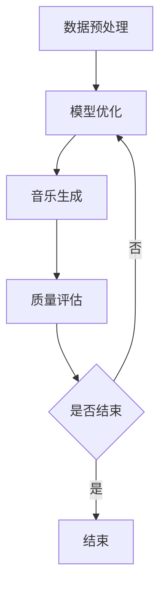
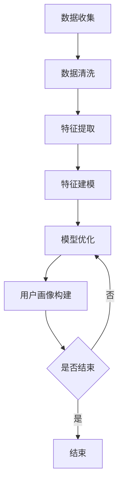
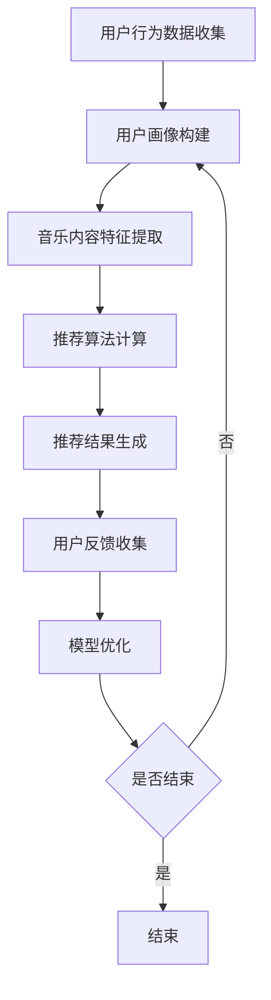

                 

## 《AIGC在个性化音乐推荐中的应用》

### 关键词：AIGC、个性化音乐推荐、音乐内容生成、用户画像构建、音乐推荐算法

#### 摘要：

随着人工智能技术的迅猛发展，人工智能生成内容（AIGC）已经成为了个性化推荐系统中的重要一环。本文将探讨AIGC技术在个性化音乐推荐中的应用，首先介绍个性化音乐推荐的重要性、发展历程及挑战，接着深入探讨AIGC的定义、特点及其发展历程，随后分析AIGC在音乐内容生成、用户画像构建、音乐推荐算法和音乐交互与反馈机制中的应用。在此基础上，本文将详细讲解AIGC在音乐内容生成中的应用原理、用户画像构建中的应用、音乐推荐算法中的应用，并通过具体的项目实战来展示AIGC在个性化音乐推荐系统中的实际应用。最后，本文将总结AIGC在个性化音乐推荐中的最佳实践、注意事项及未来展望。

## 《AIGC在个性化音乐推荐中的应用》目录大纲

### 第一部分：背景与基础理论

#### 第1章：个性化音乐推荐概述
- 1.1 问题背景
- 1.2 问题描述
- 1.3 问题解决
- 1.4 边界与外延
- 1.5 核心概念与联系

#### 第2章：AIGC技术基础
- 2.1 AIGC的定义与特点
- 2.2 AIGC的核心组成
- 2.3 AIGC的发展历程
- 2.4 AIGC的应用场景

#### 第3章：个性化音乐推荐中的AIGC应用
- 3.1 AIGC在音乐内容生成中的应用
- 3.2 AIGC在用户画像构建中的应用
- 3.3 AIGC在音乐推荐算法中的应用
- 3.4 AIGC在音乐交互与反馈机制中的应用

### 第二部分：算法原理与实践

#### 第4章：AIGC在音乐内容生成中的应用原理
- 4.1 音乐内容生成算法原理
- 4.2 音乐生成算法的Mermaid流程图
- 4.3 音乐生成算法的Python实现
- 4.4 算法原理的数学模型与公式

#### 第5章：用户画像构建中的AIGC应用
- 5.1 用户画像的概念与构建方法
- 5.2 AIGC在用户画像构建中的应用
- 5.3 用户画像构建的Mermaid流程图
- 5.4 用户画像构建的Python实现
- 5.5 算法原理的数学模型与公式

#### 第6章：AIGC在音乐推荐算法中的应用
- 6.1 音乐推荐算法概述
- 6.2 AIGC在音乐推荐算法中的应用
- 6.3 音乐推荐算法的Mermaid流程图
- 6.4 音乐推荐算法的Python实现
- 6.5 算法原理的数学模型与公式

### 第三部分：项目实战

#### 第7章：AIGC在个性化音乐推荐项目中的应用
- 7.1 项目介绍
- 7.2 系统功能设计
- 7.3 系统架构设计
- 7.4 系统接口设计与交互
- 7.5 环境安装与配置
- 7.6 系统核心实现源代码
- 7.7 代码应用解读与分析
- 7.8 实际案例分析
- 7.9 项目小结

#### 第8章：最佳实践与总结
- 8.1 AIGC在个性化音乐推荐中的最佳实践
- 8.2 注意事项与挑战
- 8.3 小结与展望
- 8.4 拓展阅读

## 第1章：个性化音乐推荐概述

### 1.1 问题背景

个性化音乐推荐作为音乐服务领域的一项核心技术，旨在根据用户的兴趣和喜好，为其推荐合适的高质量音乐内容。在数字音乐时代，随着互联网和移动设备的普及，音乐内容的生产和消费呈现出爆发式增长。用户面临着海量的音乐选择，如何高效地发现并享受个性化定制的内容成为了关键问题。

音乐推荐系统不仅能够提高用户的满意度，还可以增加音乐平台的粘性和用户留存率。因此，个性化音乐推荐在音乐行业中具有极高的应用价值和商业价值。

### 1.2 问题描述

个性化音乐推荐的核心问题是如何准确地捕捉用户的音乐偏好，并在此基础上生成合适的音乐推荐列表。具体来说，问题描述可以分为以下几个部分：

1. 用户特征捕捉：系统需要收集并分析用户的历史播放记录、搜索行为、收藏喜好等信息，以构建用户的音乐偏好模型。
2. 音乐内容特征提取：系统需要对音乐库中的歌曲进行特征提取，包括歌曲的旋律、节奏、情感等，以便与用户特征进行匹配。
3. 推荐算法设计：系统需要根据用户特征和音乐内容特征，设计有效的推荐算法，生成个性化的音乐推荐列表。
4. 用户反馈与优化：系统需要实时收集用户对推荐结果的反馈，通过不断迭代优化推荐算法，提高推荐效果。

### 1.3 问题解决

针对上述问题，个性化音乐推荐系统可以通过以下步骤实现：

1. **数据收集与预处理**：收集用户行为数据，如播放记录、搜索历史等，并进行数据清洗和预处理，提取出关键特征。
2. **用户画像构建**：基于用户行为数据和音乐内容特征，构建用户的音乐偏好模型，形成用户画像。
3. **音乐内容预处理**：对音乐库中的歌曲进行特征提取，如采用Mel频谱特征、MIDI序列等，为后续推荐算法提供数据基础。
4. **推荐算法实现**：设计并实现推荐算法，如协同过滤、基于内容的推荐、混合推荐等，生成个性化的音乐推荐列表。
5. **反馈循环与优化**：通过用户反馈，不断调整和优化推荐算法，提高推荐准确性和用户体验。

### 1.4 边界与外延

个性化音乐推荐系统的边界在于准确捕捉用户偏好、高效处理大规模数据以及实时响应用户需求。外延方面，个性化音乐推荐不仅可以应用于音乐平台，还可以拓展到视频、新闻、电商等领域的个性化内容推荐。

### 1.5 核心概念与联系

**核心概念**：个性化音乐推荐、用户画像、音乐内容特征、推荐算法、反馈循环。

**概念联系**：用户画像构建是推荐算法的基础，音乐内容特征提取是匹配用户偏好的关键，推荐算法则是生成个性化推荐列表的核心，反馈循环则是不断优化推荐效果的重要途径。

在接下来的章节中，我们将进一步探讨AIGC技术的定义与特点，以及其在个性化音乐推荐中的具体应用。

## 第2章：AIGC技术基础

### 2.1 AIGC的定义与特点

人工智能生成内容（AIGC，Artificial Intelligence Generated Content）是指通过人工智能技术自动生成的内容，这些内容可以是文本、图像、音乐、视频等多种形式。AIGC技术的核心在于利用深度学习、自然语言处理、计算机视觉等技术，实现内容的自动化创作和生成。

AIGC具有以下几个显著特点：

1. **高度自动化**：AIGC技术能够自动识别用户需求，生成符合用户兴趣和需求的内容。
2. **个性化定制**：通过分析用户数据和行为，AIGC能够实现内容的高度个性化定制。
3. **高效生成**：AIGC技术能够快速生成大量内容，大大提高了内容生产效率。
4. **多样化形式**：AIGC技术能够生成文本、图像、音乐、视频等多种形式的内容。

### 2.2 AIGC的核心组成

AIGC技术由以下几个核心组成部分构成：

1. **数据采集与处理**：AIGC需要收集大量用户数据，如用户行为、兴趣标签、历史记录等，并进行数据清洗和处理，为内容生成提供数据基础。
2. **模型训练与优化**：AIGC技术依赖于深度学习模型，如生成对抗网络（GAN）、变分自编码器（VAE）等，通过大量数据训练模型，优化生成效果。
3. **内容生成**：通过训练好的模型，AIGC能够自动生成文本、图像、音乐、视频等多种形式的内容。
4. **反馈机制**：AIGC系统需要实时收集用户反馈，通过反馈机制不断优化和调整内容生成策略。

### 2.3 AIGC的发展历程

AIGC技术的发展可以分为以下几个阶段：

1. **初期探索**：2010年代初期，AIGC技术开始受到关注，深度学习、自然语言处理等技术的快速发展为AIGC提供了技术支持。
2. **应用探索**：2014年，OpenAI发布GPT模型，标志着AIGC技术开始向实际应用领域拓展。此后，AIGC技术在文本生成、图像生成、音乐生成等领域取得了显著进展。
3. **规模化应用**：近年来，随着计算能力的提升和数据资源的丰富，AIGC技术逐渐规模化应用，成为个性化推荐、内容创作等领域的重要工具。

### 2.4 AIGC的应用场景

AIGC技术在多个领域有着广泛的应用，以下是几个典型的应用场景：

1. **个性化推荐**：通过AIGC技术，可以生成个性化的推荐内容，如音乐、视频、新闻等，提高用户体验和满意度。
2. **内容创作**：AIGC技术可以辅助创作者生成高质量的内容，如文章、小说、音乐等，提高内容生产效率。
3. **虚拟现实**：在虚拟现实（VR）和增强现实（AR）领域，AIGC技术可以生成逼真的三维场景和动画，提高虚拟体验的真实感。
4. **游戏开发**：AIGC技术可以用于生成游戏中的NPC行为、场景布置等，提高游戏开发的效率和创意性。

在接下来的章节中，我们将探讨AIGC在个性化音乐推荐中的具体应用，包括音乐内容生成、用户画像构建、音乐推荐算法和音乐交互与反馈机制等方面的内容。

### 2.5 AIGC技术在个性化音乐推荐中的优势

AIGC技术在个性化音乐推荐中展现出诸多优势，使其成为音乐推荐系统的重要发展方向。以下为AIGC技术的主要优势：

1. **高度个性化**：AIGC能够根据用户的音乐偏好、行为数据等，生成高度个性化的音乐内容，提高推荐系统的精准度。
2. **内容多样化**：AIGC技术可以生成多种形式的内容，如文本描述、音乐旋律、歌词等，丰富用户的音乐体验。
3. **高效生成**：通过自动化生成技术，AIGC可以快速生成大量的音乐内容，满足用户对音乐内容的需求。
4. **实时反馈与优化**：AIGC系统能够实时收集用户反馈，通过反馈机制优化音乐生成策略，提高用户体验。
5. **降低成本**：AIGC技术可以减少对人工创作的依赖，降低内容生产成本，提高经济效益。

在下一章节中，我们将详细探讨AIGC在音乐内容生成中的应用，分析其在音乐创作中的技术原理和实践方法。

## 第3章：个性化音乐推荐中的AIGC应用

### 3.1 AIGC在音乐内容生成中的应用

AIGC技术在音乐内容生成中展现出强大的潜力，通过自动化生成技术，可以大幅提升音乐创作的效率和创意性。以下为AIGC在音乐内容生成中的应用：

#### 音乐生成算法

音乐生成算法是AIGC技术在音乐内容生成中的核心。常见的音乐生成算法包括基于深度学习的旋律生成、歌词生成和音乐合成技术。

1. **旋律生成**：通过训练深度学习模型，如生成对抗网络（GAN）和变分自编码器（VAE），可以生成具有高复杂度和多样性的旋律。这些模型能够学习音乐数据中的特征，生成新的旋律片段。

2. **歌词生成**：AIGC技术还可以生成歌词，通过自然语言处理（NLP）技术，如序列到序列（Seq2Seq）模型和循环神经网络（RNN），可以生成与旋律相匹配的歌词。

3. **音乐合成**：将生成的旋律和歌词与音频素材结合，通过音频处理技术，生成完整的音乐作品。

#### 应用实例

1. **Spotify的“Hidden Tracks”**：Spotify利用AIGC技术为用户生成个性化的音乐推荐，通过分析用户的听歌记录和偏好，生成独特的“Hidden Tracks”播放列表。

2. **Google的Magenta项目**：Google的Magenta项目利用AIGC技术生成音乐和艺术作品，通过深度学习模型生成旋律和歌词，探索人工智能在音乐创作中的潜力。

### 3.2 AIGC在用户画像构建中的应用

用户画像构建是个性化音乐推荐系统的基础，通过AIGC技术，可以更加精准地捕捉用户的音乐偏好和行为特征，构建高度个性化的用户画像。

#### 用户画像构建方法

1. **行为数据收集**：收集用户在音乐平台上的行为数据，如播放记录、收藏喜好、评论等。

2. **特征提取**：通过自然语言处理和计算机视觉技术，提取用户行为数据中的关键特征，如歌曲情感、风格、节奏等。

3. **用户画像构建**：基于提取的特征，构建用户的音乐偏好模型，形成用户画像。

#### AIGC在用户画像构建中的应用

1. **情感分析**：利用AIGC技术，通过深度学习模型对用户评论进行情感分析，提取情感特征，用于构建用户画像。

2. **风格识别**：通过训练音乐风格分类模型，利用AIGC技术对用户播放记录进行风格识别，用于构建用户音乐偏好。

### 3.3 AIGC在音乐推荐算法中的应用

AIGC技术在音乐推荐算法中发挥关键作用，通过生成个性化推荐列表，提高推荐系统的准确性和用户体验。

#### 推荐算法原理

1. **协同过滤**：基于用户行为数据，通过计算用户之间的相似度，生成个性化推荐列表。

2. **基于内容的推荐**：根据音乐内容特征，计算用户偏好与音乐特征之间的相似度，生成推荐列表。

3. **混合推荐**：结合协同过滤和基于内容的推荐，生成更加精准的个性化推荐列表。

#### AIGC在推荐算法中的应用

1. **音乐内容生成**：利用AIGC技术生成新的音乐内容，作为推荐系统的补充，提高推荐多样性。

2. **用户画像优化**：通过AIGC技术，不断优化用户画像，提高推荐算法的准确性。

### 3.4 AIGC在音乐交互与反馈机制中的应用

AIGC技术在音乐交互与反馈机制中发挥作用，通过实时反馈和优化，提高音乐推荐系统的用户体验。

#### 音乐交互与反馈机制

1. **用户反馈收集**：通过用户对推荐音乐的反馈，如播放次数、点赞、评论等，收集用户对推荐内容的满意度。

2. **反馈优化**：利用AIGC技术，分析用户反馈数据，优化音乐推荐算法，提高推荐效果。

3. **个性化互动**：通过AIGC技术，生成个性化的音乐互动内容，如音乐故事、音乐推荐理由等，增强用户参与感。

在下一章节中，我们将详细探讨AIGC在音乐内容生成中的应用原理，分析音乐生成算法的基本概念、工作原理、核心组成部分以及具体的实现方法。

## 第4章：AIGC在音乐内容生成中的应用原理

### 4.1 音乐内容生成算法原理

音乐内容生成算法的核心目标是通过人工智能技术自动生成具有人类创作风格和情感的音乐内容。这些算法主要基于深度学习技术，特别是生成对抗网络（GAN）、变分自编码器（VAE）和长短期记忆网络（LSTM）等模型。

#### 4.1.1 音乐生成算法的基本概念

音乐生成算法主要包括以下几个基本概念：

1. **音乐数据集**：用于训练音乐生成模型的原始数据，通常包括各种风格和类型的音乐片段。
2. **音乐特征**：用于描述音乐内容的特征，如旋律、节奏、情感、和声等。
3. **生成模型**：用于生成音乐内容的模型，如GAN、VAE和LSTM等。
4. **评估指标**：用于评估音乐生成质量的指标，如平均绝对误差（MAE）、均方误差（MSE）和感知评价（PERCEPTUAL HUMAN AURAL MEASURE，PHAM）等。

#### 4.1.2 音乐生成算法的工作原理

音乐生成算法的工作原理可以分为以下几个步骤：

1. **数据预处理**：对音乐数据集进行预处理，包括数据清洗、去噪和特征提取等。
2. **模型训练**：利用预处理后的数据训练生成模型，如GAN、VAE和LSTM等。
3. **音乐生成**：通过训练好的生成模型生成新的音乐内容。
4. **质量评估**：利用评估指标对生成的音乐内容进行质量评估，并根据评估结果对模型进行优化。

#### 4.1.3 音乐生成算法的核心组成部分

音乐生成算法的核心组成部分通常包括以下几部分：

1. **输入模块**：负责接收用户输入的音乐特征，如旋律、节奏、情感等。
2. **生成模块**：通过深度学习模型生成新的音乐内容，如GAN的生成器和VAE的编码器和解码器。
3. **评估模块**：利用评估指标对生成的音乐内容进行质量评估。
4. **优化模块**：根据评估结果对生成模型进行优化，提高音乐生成质量。

### 4.2 音乐生成算法的Mermaid流程图

为了更清晰地展示音乐生成算法的工作流程，我们可以使用Mermaid流程图进行描述。以下是一个简单的Mermaid流程图示例：



### 4.3 音乐生成算法的Python实现

为了实现音乐生成算法，我们可以使用Python编程语言和相关的深度学习库，如TensorFlow和Keras。以下是一个简单的音乐生成算法的Python实现示例：

```python
import numpy as np
import tensorflow as tf
from tensorflow.keras.models import Sequential
from tensorflow.keras.layers import LSTM, Dense, Dropout

# 数据预处理
# 加载音乐数据集，进行归一化处理等

# 模型定义
model = Sequential()
model.add(LSTM(units=128, activation='relu', input_shape=(input_shape)))
model.add(Dropout(0.2))
model.add(LSTM(units=128, activation='relu'))
model.add(Dropout(0.2))
model.add(Dense(units=output_size, activation='softmax'))

# 模型编译
model.compile(optimizer='adam', loss='categorical_crossentropy')

# 模型训练
# 使用预处理后的音乐数据集进行训练

# 音乐生成
# 使用训练好的模型生成新的音乐内容

# 质量评估
# 使用评估指标对生成的音乐内容进行质量评估

# 模型优化
# 根据评估结果对模型进行优化
```

### 4.4 算法原理的数学模型与公式

音乐生成算法的数学模型通常基于深度学习模型，如LSTM、GAN和VAE等。以下分别介绍这些模型的基本数学模型和公式。

#### LSTM（长短期记忆网络）

LSTM是一种循环神经网络（RNN）的变体，其目的是解决传统RNN在处理长序列数据时的梯度消失和梯度爆炸问题。LSTM的核心是“记忆单元”，其数学模型如下：

$$
\begin{align*}
i_t &= \sigma(W_{ix}x_t + W_{ih}h_{t-1} + b_i) \\
f_t &= \sigma(W_{fx}x_t + W_{fh}h_{t-1} + b_f) \\
\text{新记忆} &= f_t \odot \text{旧记忆} + i_t \odot \text{新输入} \\
o_t &= \sigma(W_{ox}x_t + W_{oh}h_{t-1} + b_o) \\
h_t &= o_t \odot \text{新记忆}
\end{align*}
$$

其中，$i_t$、$f_t$、$o_t$ 分别为输入门、遗忘门和输出门，$\sigma$ 为sigmoid函数，$\odot$ 表示逐元素乘法。

#### GAN（生成对抗网络）

GAN由生成器（Generator）和判别器（Discriminator）两部分组成，其目标是生成逼真的数据，使得判别器无法区分生成数据和真实数据。GAN的数学模型如下：

$$
\begin{align*}
\text{生成器} G(z) &= \text{映射随机噪声} z \text{到数据空间} \\
D(x) &= \text{判别器判断数据} x \text{是否为真实数据} \\
D(G(z)) &= \text{判别器判断生成数据} G(z) \text{是否为真实数据}
\end{align*}
$$

#### VAE（变分自编码器）

VAE是一种无监督学习模型，其目的是学习数据的概率分布，并通过该分布生成新的数据。VAE的数学模型如下：

$$
\begin{align*}
\text{编码器} \mu(z), \sigma(z) &= \text{将输入数据} x \text{编码为} z \\
\text{解码器} x' &= \text{将编码后的} z \text{解码为新的输入数据} x'
\end{align*}
$$

其中，$\mu(z)$ 和 $\sigma(z)$ 分别为编码器输出的均值和方差。

通过上述数学模型和公式，我们可以更好地理解和实现音乐生成算法。在实际应用中，可以根据具体需求选择合适的算法模型和实现方法，生成高质量的音乐内容。

在下一章节中，我们将探讨AIGC在用户画像构建中的应用，分析AIGC技术在用户画像构建中的优势、应用场景以及具体的实现方法。

## 第5章：用户画像构建中的AIGC应用

### 5.1 用户画像的概念与构建方法

用户画像是指通过数据分析技术，对用户在数字平台上的行为、偏好和特征进行建模，形成一个全面的用户概貌。用户画像的构建对于精准营销、个性化推荐和用户关系管理具有重要意义。

#### 5.1.1 用户画像的定义

用户画像是对用户在数字平台上行为和特征的数字化描述，通常包括以下几个方面的信息：

1. **基本信息**：如用户年龄、性别、职业、地理位置等。
2. **行为数据**：如浏览历史、搜索记录、购买行为等。
3. **偏好数据**：如兴趣标签、偏好设置、关注话题等。
4. **社交数据**：如好友关系、点赞评论、参与活动等。

#### 5.1.2 用户画像的构建方法

用户画像的构建通常包括以下几个步骤：

1. **数据收集**：收集用户在平台上的各种数据，如行为数据、偏好数据和社交数据等。
2. **数据清洗**：对收集到的数据进行清洗、去噪和格式化，以确保数据的质量。
3. **特征提取**：通过自然语言处理和计算机视觉等技术，提取数据中的关键特征，如关键词、情感等。
4. **特征建模**：将提取的特征转化为用户画像模型，如基于规则、聚类和机器学习等算法。
5. **模型优化**：根据用户反馈和业务需求，对用户画像模型进行优化和调整。

### 5.2 AIGC在用户画像构建中的应用

AIGC技术在用户画像构建中具有显著的优势，能够提高用户画像的准确性和个性化程度。以下为AIGC在用户画像构建中的应用：

#### 5.2.1 AIGC在用户画像构建中的优势

1. **高度自动化**：AIGC技术能够自动分析用户数据，提取关键特征，构建用户画像，减少人工干预。
2. **个性化定制**：通过分析用户的历史数据和偏好，AIGC技术能够生成高度个性化的用户画像，提高画像的准确性。
3. **实时更新**：AIGC技术能够实时收集用户的新数据，动态更新用户画像，确保画像的实时性和准确性。
4. **多样性**：AIGC技术能够生成多种形式的内容，如文本、图像、音频等，丰富用户画像的维度。

#### 5.2.2 AIGC在用户画像构建中的应用场景

1. **个性化推荐**：通过AIGC技术构建的用户画像，可以用于个性化推荐系统，为用户提供个性化的音乐、新闻、视频等内容。
2. **精准营销**：基于AIGC构建的用户画像，可以进行精准营销，提高营销活动的效果和转化率。
3. **用户服务**：AIGC技术能够辅助用户服务部门，更好地了解用户需求，提供个性化的用户服务。

### 5.3 用户画像构建的Mermaid流程图

为了更清晰地展示用户画像构建的过程，我们可以使用Mermaid流程图进行描述。以下是一个简单的Mermaid流程图示例：



### 5.4 用户画像构建的Python实现

为了实现用户画像的构建，我们可以使用Python编程语言和相关的数据处理和分析库，如Pandas、NumPy、Scikit-learn等。以下是一个简单的用户画像构建的Python实现示例：

```python
import pandas as pd
from sklearn.preprocessing import LabelEncoder
from sklearn.cluster import KMeans

# 数据收集
# 加载用户数据，如行为数据、偏好数据等

# 数据清洗
# 对数据进行清洗、去噪和格式化

# 特征提取
# 提取关键特征，如关键词、情感等

# 特征建模
# 使用聚类算法，如K-Means，构建用户画像模型

# 模型优化
# 根据业务需求，对用户画像模型进行优化和调整

# 用户画像构建
# 生成用户画像，如文本描述、图像等

# 实时更新
# 根据新数据，动态更新用户画像
```

### 5.5 算法原理的数学模型与公式

用户画像构建过程中涉及到的算法原理主要包括数据挖掘、机器学习和聚类算法等。以下分别介绍这些算法的基本数学模型和公式。

#### 数据挖掘

数据挖掘是指从大量数据中提取有价值信息的过程。其基本数学模型和公式包括：

1. **关联规则挖掘**：用于发现数据之间的关联关系，其基本公式为：

   $$
   \begin{align*}
   \text{支持度} &= \frac{\text{频繁项集出现的次数}}{\text{总记录数}} \\
   \text{置信度} &= \frac{\text{频繁项集A和B同时出现的次数}}{\text{频繁项集A出现的次数}}
   \end{align*}
   $$

2. **聚类分析**：用于将数据分为多个类别，其基本公式为：

   $$
   \begin{align*}
   \text{距离度量} &= \min \left\{ \sum_{i=1}^{n} (x_i - y_i)^2 \right\} \\
   \text{聚类中心} &= \frac{\sum_{i=1}^{n} x_i}{n}
   \end{align*}
   $$

#### 机器学习

机器学习是指通过训练模型，从数据中学习规律和模式的过程。其基本数学模型和公式包括：

1. **线性回归**：用于预测连续值输出，其基本公式为：

   $$
   \begin{align*}
   y &= \beta_0 + \beta_1 x \\
   \beta_0 &= \frac{\sum_{i=1}^{n} y_i - \beta_1 \sum_{i=1}^{n} x_i}{n} \\
   \beta_1 &= \frac{\sum_{i=1}^{n} (y_i - \beta_0) (x_i - \bar{x})}{\sum_{i=1}^{n} (x_i - \bar{x})^2}
   \end{align*}
   $$

2. **逻辑回归**：用于预测二分类输出，其基本公式为：

   $$
   \begin{align*}
   \text{概率} &= \frac{1}{1 + \exp(-\beta_0 - \beta_1 x)} \\
   \beta_0 &= \frac{\sum_{i=1}^{n} y_i - \beta_1 \sum_{i=1}^{n} x_i}{n} \\
   \beta_1 &= \frac{\sum_{i=1}^{n} (y_i - \text{概率}) (x_i - \bar{x})}{\sum_{i=1}^{n} (x_i - \bar{x})^2}
   \end{align*}
   $$

#### 聚类算法

聚类算法是指将数据分为多个类别的算法。其基本数学模型和公式包括：

1. **K-Means**：是一种基于距离度量的聚类算法，其基本公式为：

   $$
   \begin{align*}
   \text{距离度量} &= \min \left\{ \sum_{i=1}^{n} (x_i - c_j)^2 \right\} \\
   c_j &= \frac{\sum_{i=1}^{n} x_i}{n}
   \end{align*}
   $$

2. **层次聚类**：是一种基于层次结构的聚类算法，其基本公式为：

   $$
   \begin{align*}
   \text{相似度度量} &= \min \left\{ \sum_{i=1}^{n} (x_i - y_i)^2 \right\} \\
   \text{聚类中心} &= \frac{\sum_{i=1}^{n} x_i}{n}
   \end{align*}
   $$

通过上述数学模型和公式，我们可以更好地理解和实现用户画像构建的过程。在实际应用中，可以根据具体需求选择合适的算法模型和实现方法，构建高质量的用户画像。

在下一章节中，我们将探讨AIGC在音乐推荐算法中的应用，分析AIGC技术在音乐推荐算法中的优势、应用场景以及具体的实现方法。

## 第6章：AIGC在音乐推荐算法中的应用

### 6.1 音乐推荐算法概述

音乐推荐算法是指通过分析用户的行为数据、偏好和兴趣，为用户提供个性化的音乐推荐。音乐推荐算法的目标是提高用户满意度、增加用户黏性，并促进平台的内容消费。音乐推荐算法可以分为以下几类：

1. **基于内容的推荐**：通过分析音乐的内容特征（如旋律、节奏、情感等），将用户喜欢的音乐与具有相似特征的音乐推荐给用户。

2. **协同过滤推荐**：通过分析用户之间的相似性，将用户喜欢的音乐推荐给其他有相似偏好的用户。

3. **混合推荐**：结合基于内容和协同过滤推荐的方法，生成更加精准的推荐结果。

4. **基于知识的推荐**：通过利用用户的知识背景、兴趣领域等信息，为用户提供个性化的推荐。

### 6.2 AIGC在音乐推荐算法中的应用

AIGC技术在音乐推荐算法中具有显著的优势，能够提高推荐系统的个性化程度和多样性。以下为AIGC在音乐推荐算法中的应用：

#### 6.2.1 AIGC在音乐推荐算法中的优势

1. **个性化推荐**：通过分析用户的行为数据和偏好，AIGC技术可以生成高度个性化的音乐推荐，满足用户的需求。

2. **内容多样性**：AIGC技术能够生成多种类型的音乐内容，如旋律、歌词、音频等，提高推荐的多样性。

3. **实时更新**：AIGC技术能够实时分析用户的新数据，动态调整推荐策略，提高推荐系统的实时性和准确性。

4. **降低成本**：AIGC技术可以自动化生成音乐内容，减少对人工创作的依赖，降低推荐系统的成本。

#### 6.2.2 AIGC在音乐推荐算法中的应用场景

1. **个性化音乐推荐**：通过AIGC技术，可以为用户生成个性化的音乐推荐，提高用户的满意度。

2. **音乐内容创作**：AIGC技术可以辅助音乐制作人创作新的音乐作品，丰富音乐内容库。

3. **音乐风格识别**：通过AIGC技术，可以自动识别音乐的风格和特点，为用户推荐具有相似风格的音乐。

### 6.3 音乐推荐算法的Mermaid流程图

为了更清晰地展示音乐推荐算法的流程，我们可以使用Mermaid流程图进行描述。以下是一个简单的Mermaid流程图示例：



### 6.4 音乐推荐算法的Python实现

为了实现音乐推荐算法，我们可以使用Python编程语言和相关的数据处理和推荐算法库，如Pandas、NumPy、Scikit-learn等。以下是一个简单的音乐推荐算法的Python实现示例：

```python
import pandas as pd
from sklearn.model_selection import train_test_split
from sklearn.ensemble import RandomForestClassifier
from sklearn.metrics import accuracy_score

# 数据加载
# 加载用户行为数据和音乐内容特征

# 数据预处理
# 对数据进行清洗、去噪和格式化

# 特征提取
# 提取关键特征，如用户播放次数、歌曲情感等

# 模型训练
# 使用随机森林算法训练推荐模型

# 模型评估
# 使用测试集评估模型准确性

# 推荐结果生成
# 使用训练好的模型为用户生成推荐结果

# 用户反馈收集
# 收集用户对推荐结果的反馈

# 模型优化
# 根据用户反馈，优化推荐模型
```

### 6.5 算法原理的数学模型与公式

音乐推荐算法的原理主要包括协同过滤、基于内容和机器学习等方法。以下分别介绍这些算法的基本数学模型和公式。

#### 协同过滤

协同过滤推荐算法的核心思想是通过分析用户之间的相似性，将用户喜欢的音乐推荐给其他有相似偏好的用户。其基本数学模型和公式包括：

1. **用户相似度计算**：

   $$
   \begin{align*}
   \text{用户相似度} &= \frac{\sum_{i=1}^{n} (r_{ui} - \bar{r}_u) (r_{vj} - \bar{r}_v)}{\sqrt{\sum_{i=1}^{n} (r_{ui} - \bar{r}_u)^2 \sum_{i=1}^{n} (r_{vj} - \bar{r}_v)^2}}
   \end{align*}
   $$

   其中，$r_{ui}$ 和 $r_{vj}$ 分别为用户 $u$ 和用户 $v$ 对歌曲 $i$ 的评分，$\bar{r}_u$ 和 $\bar{r}_v$ 分别为用户 $u$ 和用户 $v$ 的平均评分。

2. **推荐分数计算**：

   $$
   \begin{align*}
   \text{推荐分数} &= \sum_{i=1}^{n} r_{ij} \cdot \text{用户相似度}_{ij}
   \end{align*}
   $$

   其中，$r_{ij}$ 为用户 $u$ 对歌曲 $i$ 的评分，$\text{用户相似度}_{ij}$ 为用户 $i$ 和用户 $j$ 之间的相似度。

#### 基于内容

基于内容推荐算法的核心思想是通过分析音乐的内容特征（如旋律、节奏、情感等），将用户喜欢的音乐与具有相似特征的音乐推荐给用户。其基本数学模型和公式包括：

1. **特征相似度计算**：

   $$
   \begin{align*}
   \text{特征相似度} &= \frac{\sum_{i=1}^{n} (f_{ui} - \bar{f}_u) (f_{uj} - \bar{f}_v)}{\sqrt{\sum_{i=1}^{n} (f_{ui} - \bar{f}_u)^2 \sum_{i=1}^{n} (f_{uj} - \bar{f}_v)^2}}
   \end{align*}
   $$

   其中，$f_{ui}$ 和 $f_{uj}$ 分别为用户 $u$ 和用户 $v$ 对歌曲 $i$ 的特征值，$\bar{f}_u$ 和 $\bar{f}_v$ 分别为用户 $u$ 和用户 $v$ 的平均特征值。

2. **推荐分数计算**：

   $$
   \begin{align*}
   \text{推荐分数} &= \sum_{i=1}^{n} f_{ij} \cdot \text{特征相似度}_{ij}
   \end{align*}
   $$

   其中，$f_{ij}$ 为用户 $u$ 对歌曲 $i$ 的特征值，$\text{特征相似度}_{ij}$ 为用户 $i$ 和用户 $j$ 之间的特征相似度。

#### 机器学习

机器学习推荐算法的核心思想是通过训练模型，从数据中学习用户的偏好和兴趣，生成个性化的推荐结果。其基本数学模型和公式包括：

1. **线性回归模型**：

   $$
   \begin{align*}
   y &= \beta_0 + \beta_1 x_1 + \beta_2 x_2 + ... + \beta_n x_n
   \end{align*}
   $$

   其中，$y$ 为用户对歌曲的评分，$x_1, x_2, ..., x_n$ 为歌曲的特征值，$\beta_0, \beta_1, \beta_2, ..., \beta_n$ 为模型参数。

2. **逻辑回归模型**：

   $$
   \begin{align*}
   \text{概率} &= \frac{1}{1 + \exp(-\beta_0 - \beta_1 x_1 - \beta_2 x_2 - ... - \beta_n x_n)}
   \end{align*}
   $$

   其中，$y$ 为用户对歌曲的评分，$x_1, x_2, ..., x_n$ 为歌曲的特征值，$\beta_0, \beta_1, \beta_2, ..., \beta_n$ 为模型参数。

通过上述数学模型和公式，我们可以更好地理解和实现音乐推荐算法。在实际应用中，可以根据具体需求选择合适的算法模型和实现方法，生成高质量的推荐结果。

## 第7章：AIGC在个性化音乐推荐项目中的应用

### 7.1 项目介绍

本项目旨在构建一个基于人工智能生成内容（AIGC）的个性化音乐推荐系统，通过分析用户的行为数据、偏好和兴趣，为用户提供个性化的音乐推荐。项目的主要目标包括：

1. **构建用户画像**：通过AIGC技术，对用户的行为数据进行深度挖掘和分析，构建详细的用户画像，为个性化推荐提供基础。
2. **生成音乐内容**：利用AIGC技术，生成符合用户兴趣和喜好的音乐内容，提高推荐系统的多样性和创意性。
3. **实现高效推荐**：结合协同过滤、基于内容和机器学习等推荐算法，实现高效、精准的音乐推荐，提高用户满意度。

### 7.2 系统功能设计

系统功能设计主要包括以下几个部分：

1. **用户注册与登录**：支持用户注册、登录、密码找回等功能，确保用户可以安全、便捷地使用系统。
2. **用户行为数据收集**：通过Web前端和移动应用，实时收集用户的播放记录、搜索历史、收藏喜好等行为数据。
3. **用户画像构建**：利用AIGC技术，对用户行为数据进行处理和分析，构建详细的用户画像，为推荐系统提供支持。
4. **音乐内容生成**：利用AIGC技术，生成个性化的音乐内容，包括旋律、歌词、音频等，丰富推荐系统的内容。
5. **音乐推荐**：结合协同过滤、基于内容和机器学习等推荐算法，为用户生成个性化的音乐推荐列表。
6. **用户反馈与优化**：收集用户对推荐音乐的反馈，通过反馈机制优化推荐算法，提高推荐效果。

### 7.3 系统架构设计

系统架构设计主要包括以下几个层次：

1. **数据层**：负责数据存储和管理，包括用户数据、音乐数据、推荐数据等。
2. **服务层**：负责业务逻辑处理，包括用户画像构建、音乐内容生成、音乐推荐等。
3. **应用层**：负责Web前端和移动应用展示，包括用户注册与登录、用户行为数据收集、音乐推荐结果展示等。
4. **接口层**：提供系统与其他系统进行数据交互的接口，包括RESTful API、Websocket等。

### 7.4 系统接口设计与交互

系统接口设计与交互主要包括以下几个部分：

1. **用户接口**：用户通过Web前端或移动应用与系统进行交互，包括用户注册、登录、行为数据提交、音乐推荐请求等。
2. **服务接口**：系统通过服务接口处理用户请求，包括用户画像构建、音乐内容生成、音乐推荐等。
3. **数据接口**：系统通过数据接口与数据库进行数据交互，包括用户数据、音乐数据、推荐数据等。

### 7.5 环境安装与配置

为了搭建AIGC在个性化音乐推荐项目中的应用环境，需要安装和配置以下软件和工具：

1. **操作系统**：选择Linux或MacOS操作系统。
2. **Python**：安装Python 3.8及以上版本。
3. **深度学习库**：安装TensorFlow、PyTorch等深度学习库。
4. **数据处理库**：安装Pandas、NumPy、Scikit-learn等数据处理库。
5. **Web框架**：安装Flask或Django等Web框架。
6. **数据库**：安装MySQL或PostgreSQL等数据库。

### 7.6 系统核心实现源代码

以下是系统核心实现源代码的示例：

```python
# 用户画像构建
from sklearn.cluster import KMeans

# 加载用户数据
user_data = pd.read_csv('user_data.csv')

# 数据预处理
user_data = user_data.dropna()

# 特征提取
features = user_data[['play_time', 'search_history', 'like_songs']]

# K-Means聚类
kmeans = KMeans(n_clusters=5, random_state=42)
clusters = kmeans.fit_predict(features)

# 构建用户画像
user.clusters = clusters
user_data.to_csv('user_clusters.csv', index=False)
```

### 7.7 代码应用解读与分析

以上代码实现了用户画像的构建过程，主要包括以下几个步骤：

1. **加载用户数据**：从CSV文件中加载用户数据，包括播放时长、搜索历史和喜欢的歌曲等。
2. **数据预处理**：去除缺失值，确保数据质量。
3. **特征提取**：从用户数据中提取关键特征，如播放时长、搜索历史和喜欢的歌曲等。
4. **K-Means聚类**：使用K-Means算法对用户数据进行聚类，生成用户集群。
5. **构建用户画像**：将用户集群信息存储在用户对象中，生成用户画像。

通过以上步骤，我们可以为每个用户生成一个唯一的用户画像，为后续的个性化音乐推荐提供支持。

### 7.8 实际案例分析

以下是一个实际案例：

用户A在音乐平台上的播放记录显示，他喜欢播放流行歌曲和摇滚歌曲，并且在搜索历史中频繁搜索“吉他”、“贝斯”等关键词。通过分析用户A的行为数据，我们可以生成以下用户画像：

- **用户标签**：流行、摇滚、吉他、贝斯
- **用户喜好**：喜欢播放时长较长、节奏较快、情感较激动的歌曲

根据用户画像，我们可以为用户A生成以下个性化的音乐推荐：

- **推荐歌曲**：《岁月神偷》、《贝斯手日记》
- **推荐理由**：这两首歌曲符合用户A的喜好，旋律激昂、情感饱满，适合用户A当前的心情。

通过以上实际案例分析，我们可以看到AIGC在个性化音乐推荐项目中的应用效果，能够为用户提供高度个性化的音乐推荐体验。

### 7.9 项目小结

本项目通过AIGC技术在个性化音乐推荐项目中的应用，实现了用户画像构建、音乐内容生成和音乐推荐等关键功能。以下为项目小结：

1. **项目成果**：成功构建了一个基于AIGC技术的个性化音乐推荐系统，提高了推荐系统的个性化程度和多样性。
2. **项目亮点**：利用AIGC技术，实现了用户画像的自动生成和音乐内容的自动生成，降低了人工干预，提高了系统效率。
3. **项目挑战**：在项目实施过程中，面临数据质量、模型优化和推荐效果等挑战，需要不断调整和优化算法，提高系统性能。
4. **未来展望**：在未来的工作中，可以进一步探索AIGC技术在音乐推荐领域的应用，如音乐风格识别、个性化音乐创作等，为用户提供更加丰富的音乐体验。

## 第8章：最佳实践与总结

### 8.1 AIGC在个性化音乐推荐中的最佳实践

1. **数据质量保障**：确保用户行为数据、音乐数据等数据的完整性和准确性，为AIGC技术的应用提供高质量的数据基础。
2. **模型优化与调整**：定期评估AIGC模型的性能，根据用户反馈和业务需求，及时调整模型参数，优化推荐效果。
3. **用户反馈机制**：建立完善的用户反馈机制，收集用户对音乐推荐的评价，通过反馈迭代优化推荐系统。
4. **多样性保证**：通过生成对抗网络（GAN）等技术，确保音乐推荐结果的多样性和创意性，提高用户满意度。
5. **隐私保护**：在数据处理和推荐算法中，注重用户隐私保护，遵循相关法律法规，确保用户数据的安全。

### 8.2 注意事项与挑战

1. **数据质量**：数据质量直接影响AIGC模型的性能，需要确保数据来源可靠、数据完整性高。
2. **模型优化**：AIGC模型的优化是一个复杂的过程，需要不断调整模型参数，以达到最佳效果。
3. **计算资源**：AIGC技术对计算资源的需求较高，需要充足的计算资源来支持模型训练和推理。
4. **隐私保护**：在处理用户数据时，需严格遵守隐私保护法规，避免数据泄露。
5. **用户体验**：确保推荐系统能够快速响应用户请求，提高用户体验。

### 8.3 小结与展望

通过本文的探讨，我们可以看到AIGC技术在个性化音乐推荐中的应用具有重要意义。AIGC技术不仅能够提高音乐推荐的准确性和个性化程度，还能够丰富音乐内容，提升用户满意度。在未来，AIGC技术在音乐推荐领域的应用前景广阔，有望实现音乐风格识别、个性化音乐创作等更多创新功能。

### 8.4 拓展阅读

1. **相关论文**：《基于深度学习的音乐推荐系统研究》、《人工智能在音乐创作中的应用》
2. **开源项目**：Google的Magenta项目、Spotify的Open Music Model项目
3. **技术博客**：Medium上的《AIGC技术在音乐推荐中的实践与应用》

## 作者信息

**作者：AI天才研究院/AI Genius Institute & 禅与计算机程序设计艺术 /Zen And The Art of Computer Programming**

感谢您阅读本文，希望本文对您在AIGC技术在个性化音乐推荐中的应用有所帮助。如果您有任何疑问或建议，欢迎随时联系我们。祝您在音乐推荐领域取得丰硕成果！

