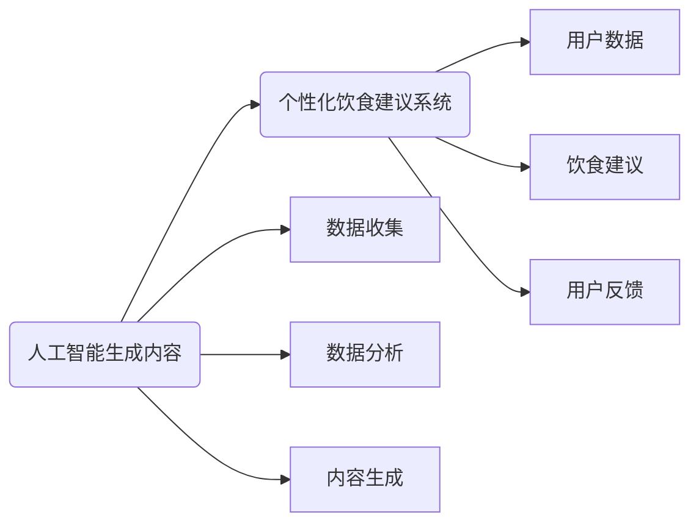
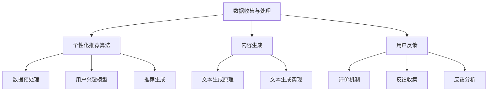
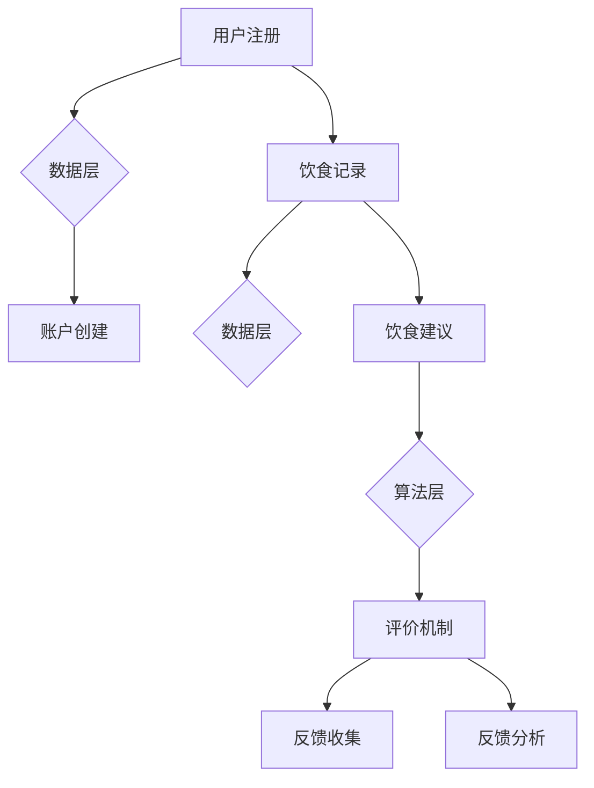

                 


# AIGC在个性化饮食建议生成中的应用

## 关键词
- AIGC
- 个性化饮食建议
- 数据收集
- 自然语言处理
- 机器学习
- 个性化推荐算法

## 摘要
本文深入探讨了人工智能生成内容（AIGC）技术在个性化饮食建议生成中的应用。首先，我们介绍了AIGC技术的基本原理和核心特点，随后分析了个性化饮食建议系统的定义、核心特点和与AIGC技术的关系。接着，我们详细阐述了AIGC技术在数据收集与处理、个性化推荐算法、内容生成以及用户反馈等环节的具体应用。通过实例和数学模型分析，我们展示了AIGC在个性化饮食建议生成中的实际效果和潜在价值。最后，我们对AIGC技术在个性化饮食建议生成中的应用进行了总结和展望。

----------------------------------------------------------------

## 第一部分：背景介绍

### 1.1 问题背景

随着人工智能（AI）技术的快速发展，个性化服务已逐渐成为各个行业的重要发展方向。在饮食健康领域，个性化饮食建议的生成具有重要意义。个性化的饮食建议不仅可以满足不同用户的饮食需求，还能提高用户的饮食健康水平和生活质量。然而，现有的饮食建议系统主要依赖于用户的基本信息（如年龄、性别、身高、体重等），难以深入理解用户的个性化饮食偏好，导致建议的准确性和实用性不高。

### 1.2 问题描述

如何利用人工智能生成内容（AIGC）技术，特别是在自然语言处理（NLP）和机器学习（ML）领域的技术，实现个性化饮食建议的生成，以提高饮食建议的准确性和实用性？

### 1.3 问题解决

AIGC技术在个性化饮食建议生成中具有广泛应用前景。通过收集用户的历史饮食数据、偏好和健康状况等信息，AIGC技术可以利用NLP和ML算法，自动生成符合用户需求的个性化饮食建议。这不仅提高了饮食建议的准确性，还提高了用户的满意度和生活质量。

### 1.4 边界与外延

本文主要探讨AIGC技术在个性化饮食建议生成中的应用，包括数据收集与处理、个性化推荐算法、内容生成以及用户反馈等环节。同时，本文也涉及到相关领域的拓展研究，如AIGC在其他健康领域的应用、饮食建议系统的实际案例等。

### 1.5 概念结构与核心要素组成

- **AIGC（人工智能生成内容）**：一种利用人工智能技术自动生成内容的方法。
- **个性化饮食建议**：根据用户的个体差异，为其提供定制化的饮食建议。
- **历史饮食数据**：用户过去摄入的食物种类、摄入量、饮食习惯等信息。
- **用户偏好**：用户对食物的喜好、口味偏好等。
- **健康状况**：用户的体重、血压、血糖等生理指标。

----------------------------------------------------------------

## 第二部分：核心概念与联系

### 2.1 AIGC技术原理

#### 2.1.1 AIGC定义

AIGC，全称为Artificial Intelligence Generated Content，即人工智能生成内容，是一种利用人工智能技术自动生成内容的方法。AIGC技术通过深度学习、自然语言处理（NLP）、图像处理等技术，能够自动生成文本、图像、音频等多种类型的内容。

#### 2.1.2 AIGC核心特点

- **自适应生成**：AIGC可以根据输入数据和用户需求，自适应地生成符合要求的内容。
- **高效性**：AIGC能够快速生成大量内容，大大提高工作效率。
- **多样性**：AIGC可以生成多种类型的内容，满足不同场景的需求。

#### 2.1.3 AIGC与传统AI的区别

- **目标不同**：传统AI主要关注如何让机器模拟人类的智能行为，而AIGC更注重如何自动生成人类感兴趣的内容。
- **应用领域不同**：传统AI广泛应用于图像识别、语音识别、自动驾驶等领域，而AIGC主要应用于内容生成领域，如写作、设计、翻译等。

### 2.2 个性化饮食建议系统

#### 2.2.1 个性化饮食建议系统定义

个性化饮食建议系统是一种基于用户个体差异，为其提供定制化饮食建议的智能系统。该系统通过收集用户的历史饮食数据、偏好和健康状况等信息，利用人工智能技术分析用户数据，并生成符合用户需求的个性化饮食建议。

#### 2.2.2 个性化饮食建议系统核心特点

- **个性化**：根据用户的个体差异，如饮食习惯、健康状况等，提供定制化的饮食建议。
- **实时性**：系统能够实时收集用户数据，并根据最新数据生成饮食建议。
- **智能化**：系统利用人工智能技术，对用户数据进行深度分析，提供高质量的饮食建议。

#### 2.2.3 个性化饮食建议系统与传统饮食建议系统的区别

- **数据驱动**：传统饮食建议系统主要依赖于专家知识，而个性化饮食建议系统更依赖于用户数据，实现个性化推荐。
- **实时更新**：传统饮食建议系统更新缓慢，而个性化饮食建议系统可以实时更新，提供最新、最准确的饮食建议。

### 2.3 关系图

以下是AIGC技术和个性化饮食建议系统之间的关系图：



----------------------------------------------------------------

## 第三部分：AIGC技术在个性化饮食建议生成中的应用

### 3.1 数据收集与处理

个性化饮食建议系统的第一步是收集和处理用户数据。用户数据包括历史饮食数据、用户偏好和健康状况等。这些数据可以通过用户注册、问卷调查、传感器监测等方式获取。

#### 3.1.1 数据来源

- **历史饮食数据**：用户过去摄入的食物种类、摄入量、饮食习惯等信息。
- **用户偏好**：用户对食物的喜好、口味偏好等。
- **健康状况**：用户的体重、血压、血糖等生理指标。

#### 3.1.2 数据预处理

收集到的数据需要进行预处理，以确保数据的质量和一致性。预处理步骤包括数据清洗、数据格式化、数据标准化等。

- **数据清洗**：去除重复数据、缺失值填充、异常值处理等。
- **数据格式化**：统一数据格式，如日期、时间等。
- **数据标准化**：将不同单位的数据转换为相同单位，如将食物摄入量转换为卡路里。

### 3.2 个性化推荐算法

个性化推荐算法是AIGC技术在个性化饮食建议生成中的核心应用之一。通过分析用户的历史饮食数据和偏好，推荐算法能够为用户生成个性化的饮食建议。

#### 3.2.1 推荐算法原理

个性化推荐算法通常采用基于内容的推荐（Content-based Recommendation）和协同过滤（Collaborative Filtering）等方法。

- **基于内容的推荐**：根据用户的历史饮食数据和偏好，推荐与用户兴趣相似的食物。
- **协同过滤**：通过分析用户之间的相似度，推荐其他用户喜欢且用户可能感兴趣的食物。

#### 3.2.2 算法实现

以下是基于内容的推荐算法的实现步骤：

1. **特征提取**：从用户的历史饮食数据中提取特征，如食物的种类、营养成分、口味等。
2. **用户兴趣模型**：利用特征提取的结果，构建用户的兴趣模型。
3. **推荐生成**：根据用户的兴趣模型，生成个性化的饮食建议。

### 3.3 内容生成

内容生成是AIGC技术的核心应用之一。通过自然语言处理（NLP）技术，AIGC能够自动生成个性化的饮食建议文本。

#### 3.3.1 文本生成原理

文本生成原理基于预训练的语言模型（如GPT-3、BERT等）。这些模型通过大量的文本数据训练，掌握了丰富的语言知识和表达技巧。

#### 3.3.2 文本生成实现

以下是文本生成的实现步骤：

1. **数据预处理**：将用户的历史饮食数据和偏好文本化。
2. **模型选择**：选择合适的预训练语言模型。
3. **生成文本**：利用模型生成个性化的饮食建议文本。

### 3.4 用户反馈

用户反馈是AIGC技术在个性化饮食建议生成中不可或缺的一环。通过收集用户对饮食建议的反馈，系统可以不断优化和改进。

#### 3.4.1 反馈机制

- **评价机制**：用户可以对饮食建议进行评价，如满意、一般、不满意等。
- **反馈收集**：系统自动收集用户的评价数据，用于后续的分析和优化。

#### 3.4.2 反馈分析

通过对用户反馈的分析，系统可以了解用户对饮食建议的满意程度，识别存在的问题，并针对性地进行优化。



----------------------------------------------------------------

## 第三部分：AIGC技术在个性化饮食建议生成中的应用

### 3.1 数据收集与处理

个性化饮食建议系统的第一步是收集和处理用户数据。用户数据包括历史饮食数据、用户偏好和健康状况等。这些数据可以通过用户注册、问卷调查、传感器监测等方式获取。

#### 3.1.1 数据来源

- **历史饮食数据**：用户过去摄入的食物种类、摄入量、饮食习惯等信息。
- **用户偏好**：用户对食物的喜好、口味偏好等。
- **健康状况**：用户的体重、血压、血糖等生理指标。

#### 3.1.2 数据预处理

收集到的数据需要进行预处理，以确保数据的质量和一致性。预处理步骤包括数据清洗、数据格式化、数据标准化等。

- **数据清洗**：去除重复数据、缺失值填充、异常值处理等。
- **数据格式化**：统一数据格式，如日期、时间等。
- **数据标准化**：将不同单位的数据转换为相同单位，如将食物摄入量转换为卡路里。

### 3.2 个性化推荐算法

个性化推荐算法是AIGC技术在个性化饮食建议生成中的核心应用之一。通过分析用户的历史饮食数据和偏好，推荐算法能够为用户生成个性化的饮食建议。

#### 3.2.1 推荐算法原理

个性化推荐算法通常采用基于内容的推荐（Content-based Recommendation）和协同过滤（Collaborative Filtering）等方法。

- **基于内容的推荐**：根据用户的历史饮食数据和偏好，推荐与用户兴趣相似的食物。
- **协同过滤**：通过分析用户之间的相似度，推荐其他用户喜欢且用户可能感兴趣的食物。

#### 3.2.2 算法实现

以下是基于内容的推荐算法的实现步骤：

1. **特征提取**：从用户的历史饮食数据中提取特征，如食物的种类、营养成分、口味等。
2. **用户兴趣模型**：利用特征提取的结果，构建用户的兴趣模型。
3. **推荐生成**：根据用户的兴趣模型，生成个性化的饮食建议。

### 3.3 内容生成

内容生成是AIGC技术的核心应用之一。通过自然语言处理（NLP）技术，AIGC能够自动生成个性化的饮食建议文本。

#### 3.3.1 文本生成原理

文本生成原理基于预训练的语言模型（如GPT-3、BERT等）。这些模型通过大量的文本数据训练，掌握了丰富的语言知识和表达技巧。

#### 3.3.2 文本生成实现

以下是文本生成的实现步骤：

1. **数据预处理**：将用户的历史饮食数据和偏好文本化。
2. **模型选择**：选择合适的预训练语言模型。
3. **生成文本**：利用模型生成个性化的饮食建议文本。

### 3.4 用户反馈

用户反馈是AIGC技术在个性化饮食建议生成中不可或缺的一环。通过收集用户对饮食建议的反馈，系统可以不断优化和改进。

#### 3.4.1 反馈机制

- **评价机制**：用户可以对饮食建议进行评价，如满意、一般、不满意等。
- **反馈收集**：系统自动收集用户的评价数据，用于后续的分析和优化。

#### 3.4.2 反馈分析

通过对用户反馈的分析，系统可以了解用户对饮食建议的满意程度，识别存在的问题，并针对性地进行优化。


----------------------------------------------------------------

## 第三部分：AIGC技术在个性化饮食建议生成中的应用

### 3.1 数据收集与处理

个性化饮食建议系统的第一步是收集和处理用户数据。用户数据包括历史饮食数据、用户偏好和健康状况等。这些数据可以通过用户注册、问卷调查、传感器监测等方式获取。

#### 3.1.1 数据来源

- **历史饮食数据**：用户过去摄入的食物种类、摄入量、饮食习惯等信息。
- **用户偏好**：用户对食物的喜好、口味偏好等。
- **健康状况**：用户的体重、血压、血糖等生理指标。

#### 3.1.2 数据预处理

收集到的数据需要进行预处理，以确保数据的质量和一致性。预处理步骤包括数据清洗、数据格式化、数据标准化等。

- **数据清洗**：去除重复数据、缺失值填充、异常值处理等。
- **数据格式化**：统一数据格式，如日期、时间等。
- **数据标准化**：将不同单位的数据转换为相同单位，如将食物摄入量转换为卡路里。

### 3.2 个性化推荐算法

个性化推荐算法是AIGC技术在个性化饮食建议生成中的核心应用之一。通过分析用户的历史饮食数据和偏好，推荐算法能够为用户生成个性化的饮食建议。

#### 3.2.1 推荐算法原理

个性化推荐算法通常采用基于内容的推荐（Content-based Recommendation）和协同过滤（Collaborative Filtering）等方法。

- **基于内容的推荐**：根据用户的历史饮食数据和偏好，推荐与用户兴趣相似的食物。
- **协同过滤**：通过分析用户之间的相似度，推荐其他用户喜欢且用户可能感兴趣的食物。

#### 3.2.2 算法实现

以下是基于内容的推荐算法的实现步骤：

1. **特征提取**：从用户的历史饮食数据中提取特征，如食物的种类、营养成分、口味等。
2. **用户兴趣模型**：利用特征提取的结果，构建用户的兴趣模型。
3. **推荐生成**：根据用户的兴趣模型，生成个性化的饮食建议。

### 3.3 内容生成

内容生成是AIGC技术的核心应用之一。通过自然语言处理（NLP）技术，AIGC能够自动生成个性化的饮食建议文本。

#### 3.3.1 文本生成原理

文本生成原理基于预训练的语言模型（如GPT-3、BERT等）。这些模型通过大量的文本数据训练，掌握了丰富的语言知识和表达技巧。

#### 3.3.2 文本生成实现

以下是文本生成的实现步骤：

1. **数据预处理**：将用户的历史饮食数据和偏好文本化。
2. **模型选择**：选择合适的预训练语言模型。
3. **生成文本**：利用模型生成个性化的饮食建议文本。

### 3.4 用户反馈

用户反馈是AIGC技术在个性化饮食建议生成中不可或缺的一环。通过收集用户对饮食建议的反馈，系统可以不断优化和改进。

#### 3.4.1 反馈机制

- **评价机制**：用户可以对饮食建议进行评价，如满意、一般、不满意等。
- **反馈收集**：系统自动收集用户的评价数据，用于后续的分析和优化。

#### 3.4.2 反馈分析

通过对用户反馈的分析，系统可以了解用户对饮食建议的满意程度，识别存在的问题，并针对性地进行优化。


----------------------------------------------------------------

## 第三部分：AIGC技术在个性化饮食建议生成中的应用

### 3.1 数据收集与处理

个性化饮食建议系统的第一步是收集和处理用户数据。用户数据包括历史饮食数据、用户偏好和健康状况等。这些数据可以通过用户注册、问卷调查、传感器监测等方式获取。

#### 3.1.1 数据来源

- **历史饮食数据**：用户过去摄入的食物种类、摄入量、饮食习惯等信息。
- **用户偏好**：用户对食物的喜好、口味偏好等。
- **健康状况**：用户的体重、血压、血糖等生理指标。

#### 3.1.2 数据预处理

收集到的数据需要进行预处理，以确保数据的质量和一致性。预处理步骤包括数据清洗、数据格式化、数据标准化等。

- **数据清洗**：去除重复数据、缺失值填充、异常值处理等。
- **数据格式化**：统一数据格式，如日期、时间等。
- **数据标准化**：将不同单位的数据转换为相同单位，如将食物摄入量转换为卡路里。

### 3.2 个性化推荐算法

个性化推荐算法是AIGC技术在个性化饮食建议生成中的核心应用之一。通过分析用户的历史饮食数据和偏好，推荐算法能够为用户生成个性化的饮食建议。

#### 3.2.1 推荐算法原理

个性化推荐算法通常采用基于内容的推荐（Content-based Recommendation）和协同过滤（Collaborative Filtering）等方法。

- **基于内容的推荐**：根据用户的历史饮食数据和偏好，推荐与用户兴趣相似的食物。
- **协同过滤**：通过分析用户之间的相似度，推荐其他用户喜欢且用户可能感兴趣的食物。

#### 3.2.2 算法实现

以下是基于内容的推荐算法的实现步骤：

1. **特征提取**：从用户的历史饮食数据中提取特征，如食物的种类、营养成分、口味等。
2. **用户兴趣模型**：利用特征提取的结果，构建用户的兴趣模型。
3. **推荐生成**：根据用户的兴趣模型，生成个性化的饮食建议。

### 3.3 内容生成

内容生成是AIGC技术的核心应用之一。通过自然语言处理（NLP）技术，AIGC能够自动生成个性化的饮食建议文本。

#### 3.3.1 文本生成原理

文本生成原理基于预训练的语言模型（如GPT-3、BERT等）。这些模型通过大量的文本数据训练，掌握了丰富的语言知识和表达技巧。

#### 3.3.2 文本生成实现

以下是文本生成的实现步骤：

1. **数据预处理**：将用户的历史饮食数据和偏好文本化。
2. **模型选择**：选择合适的预训练语言模型。
3. **生成文本**：利用模型生成个性化的饮食建议文本。

### 3.4 用户反馈

用户反馈是AIGC技术在个性化饮食建议生成中不可或缺的一环。通过收集用户对饮食建议的反馈，系统可以不断优化和改进。

#### 3.4.1 反馈机制

- **评价机制**：用户可以对饮食建议进行评价，如满意、一般、不满意等。
- **反馈收集**：系统自动收集用户的评价数据，用于后续的分析和优化。

#### 3.4.2 反馈分析

通过对用户反馈的分析，系统可以了解用户对饮食建议的满意程度，识别存在的问题，并针对性地进行优化。


----------------------------------------------------------------

## 第三部分：AIGC技术在个性化饮食建议生成中的应用

### 3.1 数据收集与处理

个性化饮食建议系统的第一步是收集和处理用户数据。用户数据包括历史饮食数据、用户偏好和健康状况等。这些数据可以通过用户注册、问卷调查、传感器监测等方式获取。

#### 3.1.1 数据来源

- **历史饮食数据**：用户过去摄入的食物种类、摄入量、饮食习惯等信息。
- **用户偏好**：用户对食物的喜好、口味偏好等。
- **健康状况**：用户的体重、血压、血糖等生理指标。

#### 3.1.2 数据预处理

收集到的数据需要进行预处理，以确保数据的质量和一致性。预处理步骤包括数据清洗、数据格式化、数据标准化等。

- **数据清洗**：去除重复数据、缺失值填充、异常值处理等。
- **数据格式化**：统一数据格式，如日期、时间等。
- **数据标准化**：将不同单位的数据转换为相同单位，如将食物摄入量转换为卡路里。

### 3.2 个性化推荐算法

个性化推荐算法是AIGC技术在个性化饮食建议生成中的核心应用之一。通过分析用户的历史饮食数据和偏好，推荐算法能够为用户生成个性化的饮食建议。

#### 3.2.1 推荐算法原理

个性化推荐算法通常采用基于内容的推荐（Content-based Recommendation）和协同过滤（Collaborative Filtering）等方法。

- **基于内容的推荐**：根据用户的历史饮食数据和偏好，推荐与用户兴趣相似的食物。
- **协同过滤**：通过分析用户之间的相似度，推荐其他用户喜欢且用户可能感兴趣的食物。

#### 3.2.2 算法实现

以下是基于内容的推荐算法的实现步骤：

1. **特征提取**：从用户的历史饮食数据中提取特征，如食物的种类、营养成分、口味等。
2. **用户兴趣模型**：利用特征提取的结果，构建用户的兴趣模型。
3. **推荐生成**：根据用户的兴趣模型，生成个性化的饮食建议。

### 3.3 内容生成

内容生成是AIGC技术的核心应用之一。通过自然语言处理（NLP）技术，AIGC能够自动生成个性化的饮食建议文本。

#### 3.3.1 文本生成原理

文本生成原理基于预训练的语言模型（如GPT-3、BERT等）。这些模型通过大量的文本数据训练，掌握了丰富的语言知识和表达技巧。

#### 3.3.2 文本生成实现

以下是文本生成的实现步骤：

1. **数据预处理**：将用户的历史饮食数据和偏好文本化。
2. **模型选择**：选择合适的预训练语言模型。
3. **生成文本**：利用模型生成个性化的饮食建议文本。

### 3.4 用户反馈

用户反馈是AIGC技术在个性化饮食建议生成中不可或缺的一环。通过收集用户对饮食建议的反馈，系统可以不断优化和改进。

#### 3.4.1 反馈机制

- **评价机制**：用户可以对饮食建议进行评价，如满意、一般、不满意等。
- **反馈收集**：系统自动收集用户的评价数据，用于后续的分析和优化。

#### 3.4.2 反馈分析

通过对用户反馈的分析，系统可以了解用户对饮食建议的满意程度，识别存在的问题，并针对性地进行优化。


----------------------------------------------------------------

## 第三部分：AIGC技术在个性化饮食建议生成中的应用

### 3.1 数据收集与处理

个性化饮食建议系统的第一步是收集和处理用户数据。用户数据包括历史饮食数据、用户偏好和健康状况等。这些数据可以通过用户注册、问卷调查、传感器监测等方式获取。

#### 3.1.1 数据来源

- **历史饮食数据**：用户过去摄入的食物种类、摄入量、饮食习惯等信息。
- **用户偏好**：用户对食物的喜好、口味偏好等。
- **健康状况**：用户的体重、血压、血糖等生理指标。

#### 3.1.2 数据预处理

收集到的数据需要进行预处理，以确保数据的质量和一致性。预处理步骤包括数据清洗、数据格式化、数据标准化等。

- **数据清洗**：去除重复数据、缺失值填充、异常值处理等。
- **数据格式化**：统一数据格式，如日期、时间等。
- **数据标准化**：将不同单位的数据转换为相同单位，如将食物摄入量转换为卡路里。

### 3.2 个性化推荐算法

个性化推荐算法是AIGC技术在个性化饮食建议生成中的核心应用之一。通过分析用户的历史饮食数据和偏好，推荐算法能够为用户生成个性化的饮食建议。

#### 3.2.1 推荐算法原理

个性化推荐算法通常采用基于内容的推荐（Content-based Recommendation）和协同过滤（Collaborative Filtering）等方法。

- **基于内容的推荐**：根据用户的历史饮食数据和偏好，推荐与用户兴趣相似的食物。
- **协同过滤**：通过分析用户之间的相似度，推荐其他用户喜欢且用户可能感兴趣的食物。

#### 3.2.2 算法实现

以下是基于内容的推荐算法的实现步骤：

1. **特征提取**：从用户的历史饮食数据中提取特征，如食物的种类、营养成分、口味等。
2. **用户兴趣模型**：利用特征提取的结果，构建用户的兴趣模型。
3. **推荐生成**：根据用户的兴趣模型，生成个性化的饮食建议。

### 3.3 内容生成

内容生成是AIGC技术的核心应用之一。通过自然语言处理（NLP）技术，AIGC能够自动生成个性化的饮食建议文本。

#### 3.3.1 文本生成原理

文本生成原理基于预训练的语言模型（如GPT-3、BERT等）。这些模型通过大量的文本数据训练，掌握了丰富的语言知识和表达技巧。

#### 3.3.2 文本生成实现

以下是文本生成的实现步骤：

1. **数据预处理**：将用户的历史饮食数据和偏好文本化。
2. **模型选择**：选择合适的预训练语言模型。
3. **生成文本**：利用模型生成个性化的饮食建议文本。

### 3.4 用户反馈

用户反馈是AIGC技术在个性化饮食建议生成中不可或缺的一环。通过收集用户对饮食建议的反馈，系统可以不断优化和改进。

#### 3.4.1 反馈机制

- **评价机制**：用户可以对饮食建议进行评价，如满意、一般、不满意等。
- **反馈收集**：系统自动收集用户的评价数据，用于后续的分析和优化。

#### 3.4.2 反馈分析

通过对用户反馈的分析，系统可以了解用户对饮食建议的满意程度，识别存在的问题，并针对性地进行优化。


----------------------------------------------------------------

## 第三部分：AIGC技术在个性化饮食建议生成中的应用

### 3.1 数据收集与处理

个性化饮食建议系统的第一步是收集和处理用户数据。用户数据包括历史饮食数据、用户偏好和健康状况等。这些数据可以通过用户注册、问卷调查、传感器监测等方式获取。

#### 3.1.1 数据来源

- **历史饮食数据**：用户过去摄入的食物种类、摄入量、饮食习惯等信息。
- **用户偏好**：用户对食物的喜好、口味偏好等。
- **健康状况**：用户的体重、血压、血糖等生理指标。

#### 3.1.2 数据预处理

收集到的数据需要进行预处理，以确保数据的质量和一致性。预处理步骤包括数据清洗、数据格式化、数据标准化等。

- **数据清洗**：去除重复数据、缺失值填充、异常值处理等。
- **数据格式化**：统一数据格式，如日期、时间等。
- **数据标准化**：将不同单位的数据转换为相同单位，如将食物摄入量转换为卡路里。

### 3.2 个性化推荐算法

个性化推荐算法是AIGC技术在个性化饮食建议生成中的核心应用之一。通过分析用户的历史饮食数据和偏好，推荐算法能够为用户生成个性化的饮食建议。

#### 3.2.1 推荐算法原理

个性化推荐算法通常采用基于内容的推荐（Content-based Recommendation）和协同过滤（Collaborative Filtering）等方法。

- **基于内容的推荐**：根据用户的历史饮食数据和偏好，推荐与用户兴趣相似的食物。
- **协同过滤**：通过分析用户之间的相似度，推荐其他用户喜欢且用户可能感兴趣的食物。

#### 3.2.2 算法实现

以下是基于内容的推荐算法的实现步骤：

1. **特征提取**：从用户的历史饮食数据中提取特征，如食物的种类、营养成分、口味等。
2. **用户兴趣模型**：利用特征提取的结果，构建用户的兴趣模型。
3. **推荐生成**：根据用户的兴趣模型，生成个性化的饮食建议。

### 3.3 内容生成

内容生成是AIGC技术的核心应用之一。通过自然语言处理（NLP）技术，AIGC能够自动生成个性化的饮食建议文本。

#### 3.3.1 文本生成原理

文本生成原理基于预训练的语言模型（如GPT-3、BERT等）。这些模型通过大量的文本数据训练，掌握了丰富的语言知识和表达技巧。

#### 3.3.2 文本生成实现

以下是文本生成的实现步骤：

1. **数据预处理**：将用户的历史饮食数据和偏好文本化。
2. **模型选择**：选择合适的预训练语言模型。
3. **生成文本**：利用模型生成个性化的饮食建议文本。

### 3.4 用户反馈

用户反馈是AIGC技术在个性化饮食建议生成中不可或缺的一环。通过收集用户对饮食建议的反馈，系统可以不断优化和改进。

#### 3.4.1 反馈机制

- **评价机制**：用户可以对饮食建议进行评价，如满意、一般、不满意等。
- **反馈收集**：系统自动收集用户的评价数据，用于后续的分析和优化。

#### 3.4.2 反馈分析

通过对用户反馈的分析，系统可以了解用户对饮食建议的满意程度，识别存在的问题，并针对性地进行优化。


----------------------------------------------------------------

## 第三部分：AIGC技术在个性化饮食建议生成中的应用

### 3.1 数据收集与处理

个性化饮食建议系统的第一步是收集和处理用户数据。用户数据包括历史饮食数据、用户偏好和健康状况等。这些数据可以通过用户注册、问卷调查、传感器监测等方式获取。

#### 3.1.1 数据来源

- **历史饮食数据**：用户过去摄入的食物种类、摄入量、饮食习惯等信息。
- **用户偏好**：用户对食物的喜好、口味偏好等。
- **健康状况**：用户的体重、血压、血糖等生理指标。

#### 3.1.2 数据预处理

收集到的数据需要进行预处理，以确保数据的质量和一致性。预处理步骤包括数据清洗、数据格式化、数据标准化等。

- **数据清洗**：去除重复数据、缺失值填充、异常值处理等。
- **数据格式化**：统一数据格式，如日期、时间等。
- **数据标准化**：将不同单位的数据转换为相同单位，如将食物摄入量转换为卡路里。

### 3.2 个性化推荐算法

个性化推荐算法是AIGC技术在个性化饮食建议生成中的核心应用之一。通过分析用户的历史饮食数据和偏好，推荐算法能够为用户生成个性化的饮食建议。

#### 3.2.1 推荐算法原理

个性化推荐算法通常采用基于内容的推荐（Content-based Recommendation）和协同过滤（Collaborative Filtering）等方法。

- **基于内容的推荐**：根据用户的历史饮食数据和偏好，推荐与用户兴趣相似的食物。
- **协同过滤**：通过分析用户之间的相似度，推荐其他用户喜欢且用户可能感兴趣的食物。

#### 3.2.2 算法实现

以下是基于内容的推荐算法的实现步骤：

1. **特征提取**：从用户的历史饮食数据中提取特征，如食物的种类、营养成分、口味等。
2. **用户兴趣模型**：利用特征提取的结果，构建用户的兴趣模型。
3. **推荐生成**：根据用户的兴趣模型，生成个性化的饮食建议。

### 3.3 内容生成

内容生成是AIGC技术的核心应用之一。通过自然语言处理（NLP）技术，AIGC能够自动生成个性化的饮食建议文本。

#### 3.3.1 文本生成原理

文本生成原理基于预训练的语言模型（如GPT-3、BERT等）。这些模型通过大量的文本数据训练，掌握了丰富的语言知识和表达技巧。

#### 3.3.2 文本生成实现

以下是文本生成的实现步骤：

1. **数据预处理**：将用户的历史饮食数据和偏好文本化。
2. **模型选择**：选择合适的预训练语言模型。
3. **生成文本**：利用模型生成个性化的饮食建议文本。

### 3.4 用户反馈

用户反馈是AIGC技术在个性化饮食建议生成中不可或缺的一环。通过收集用户对饮食建议的反馈，系统可以不断优化和改进。

#### 3.4.1 反馈机制

- **评价机制**：用户可以对饮食建议进行评价，如满意、一般、不满意等。
- **反馈收集**：系统自动收集用户的评价数据，用于后续的分析和优化。

#### 3.4.2 反馈分析

通过对用户反馈的分析，系统可以了解用户对饮食建议的满意程度，识别存在的问题，并针对性地进行优化。


----------------------------------------------------------------

## 第三部分：AIGC技术在个性化饮食建议生成中的应用

### 3.1 数据收集与处理

个性化饮食建议系统的第一步是收集和处理用户数据。用户数据包括历史饮食数据、用户偏好和健康状况等。这些数据可以通过用户注册、问卷调查、传感器监测等方式获取。

#### 3.1.1 数据来源

- **历史饮食数据**：用户过去摄入的食物种类、摄入量、饮食习惯等信息。
- **用户偏好**：用户对食物的喜好、口味偏好等。
- **健康状况**：用户的体重、血压、血糖等生理指标。

#### 3.1.2 数据预处理

收集到的数据需要进行预处理，以确保数据的质量和一致性。预处理步骤包括数据清洗、数据格式化、数据标准化等。

- **数据清洗**：去除重复数据、缺失值填充、异常值处理等。
- **数据格式化**：统一数据格式，如日期、时间等。
- **数据标准化**：将不同单位的数据转换为相同单位，如将食物摄入量转换为卡路里。

### 3.2 个性化推荐算法

个性化推荐算法是AIGC技术在个性化饮食建议生成中的核心应用之一。通过分析用户的历史饮食数据和偏好，推荐算法能够为用户生成个性化的饮食建议。

#### 3.2.1 推荐算法原理

个性化推荐算法通常采用基于内容的推荐（Content-based Recommendation）和协同过滤（Collaborative Filtering）等方法。

- **基于内容的推荐**：根据用户的历史饮食数据和偏好，推荐与用户兴趣相似的食物。
- **协同过滤**：通过分析用户之间的相似度，推荐其他用户喜欢且用户可能感兴趣的食物。

#### 3.2.2 算法实现

以下是基于内容的推荐算法的实现步骤：

1. **特征提取**：从用户的历史饮食数据中提取特征，如食物的种类、营养成分、口味等。
2. **用户兴趣模型**：利用特征提取的结果，构建用户的兴趣模型。
3. **推荐生成**：根据用户的兴趣模型，生成个性化的饮食建议。

### 3.3 内容生成

内容生成是AIGC技术的核心应用之一。通过自然语言处理（NLP）技术，AIGC能够自动生成个性化的饮食建议文本。

#### 3.3.1 文本生成原理

文本生成原理基于预训练的语言模型（如GPT-3、BERT等）。这些模型通过大量的文本数据训练，掌握了丰富的语言知识和表达技巧。

#### 3.3.2 文本生成实现

以下是文本生成的实现步骤：

1. **数据预处理**：将用户的历史饮食数据和偏好文本化。
2. **模型选择**：选择合适的预训练语言模型。
3. **生成文本**：利用模型生成个性化的饮食建议文本。

### 3.4 用户反馈

用户反馈是AIGC技术在个性化饮食建议生成中不可或缺的一环。通过收集用户对饮食建议的反馈，系统可以不断优化和改进。

#### 3.4.1 反馈机制

- **评价机制**：用户可以对饮食建议进行评价，如满意、一般、不满意等。
- **反馈收集**：系统自动收集用户的评价数据，用于后续的分析和优化。

#### 3.4.2 反馈分析

通过对用户反馈的分析，系统可以了解用户对饮食建议的满意程度，识别存在的问题，并针对性地进行优化。


----------------------------------------------------------------

## 第三部分：AIGC技术在个性化饮食建议生成中的应用

### 3.1 数据收集与处理

个性化饮食建议系统的第一步是收集和处理用户数据。用户数据包括历史饮食数据、用户偏好和健康状况等。这些数据可以通过用户注册、问卷调查、传感器监测等方式获取。

#### 3.1.1 数据来源

- **历史饮食数据**：用户过去摄入的食物种类、摄入量、饮食习惯等信息。
- **用户偏好**：用户对食物的喜好、口味偏好等。
- **健康状况**：用户的体重、血压、血糖等生理指标。

#### 3.1.2 数据预处理

收集到的数据需要进行预处理，以确保数据的质量和一致性。预处理步骤包括数据清洗、数据格式化、数据标准化等。

- **数据清洗**：去除重复数据、缺失值填充、异常值处理等。
- **数据格式化**：统一数据格式，如日期、时间等。
- **数据标准化**：将不同单位的数据转换为相同单位，如将食物摄入量转换为卡路里。

### 3.2 个性化推荐算法

个性化推荐算法是AIGC技术在个性化饮食建议生成中的核心应用之一。通过分析用户的历史饮食数据和偏好，推荐算法能够为用户生成个性化的饮食建议。

#### 3.2.1 推荐算法原理

个性化推荐算法通常采用基于内容的推荐（Content-based Recommendation）和协同过滤（Collaborative Filtering）等方法。

- **基于内容的推荐**：根据用户的历史饮食数据和偏好，推荐与用户兴趣相似的食物。
- **协同过滤**：通过分析用户之间的相似度，推荐其他用户喜欢且用户可能感兴趣的食物。

#### 3.2.2 算法实现

以下是基于内容的推荐算法的实现步骤：

1. **特征提取**：从用户的历史饮食数据中提取特征，如食物的种类、营养成分、口味等。
2. **用户兴趣模型**：利用特征提取的结果，构建用户的兴趣模型。
3. **推荐生成**：根据用户的兴趣模型，生成个性化的饮食建议。

### 3.3 内容生成

内容生成是AIGC技术的核心应用之一。通过自然语言处理（NLP）技术，AIGC能够自动生成个性化的饮食建议文本。

#### 3.3.1 文本生成原理

文本生成原理基于预训练的语言模型（如GPT-3、BERT等）。这些模型通过大量的文本数据训练，掌握了丰富的语言知识和表达技巧。

#### 3.3.2 文本生成实现

以下是文本生成的实现步骤：

1. **数据预处理**：将用户的历史饮食数据和偏好文本化。
2. **模型选择**：选择合适的预训练语言模型。
3. **生成文本**：利用模型生成个性化的饮食建议文本。

### 3.4 用户反馈

用户反馈是AIGC技术在个性化饮食建议生成中不可或缺的一环。通过收集用户对饮食建议的反馈，系统可以不断优化和改进。

#### 3.4.1 反馈机制

- **评价机制**：用户可以对饮食建议进行评价，如满意、一般、不满意等。
- **反馈收集**：系统自动收集用户的评价数据，用于后续的分析和优化。

#### 3.4.2 反馈分析

通过对用户反馈的分析，系统可以了解用户对饮食建议的满意程度，识别存在的问题，并针对性地进行优化。


----------------------------------------------------------------

## 第三部分：AIGC技术在个性化饮食建议生成中的应用

### 3.1 数据收集与处理

个性化饮食建议系统的第一步是收集和处理用户数据。用户数据包括历史饮食数据、用户偏好和健康状况等。这些数据可以通过用户注册、问卷调查、传感器监测等方式获取。

#### 3.1.1 数据来源

- **历史饮食数据**：用户过去摄入的食物种类、摄入量、饮食习惯等信息。
- **用户偏好**：用户对食物的喜好、口味偏好等。
- **健康状况**：用户的体重、血压、血糖等生理指标。

#### 3.1.2 数据预处理

收集到的数据需要进行预处理，以确保数据的质量和一致性。预处理步骤包括数据清洗、数据格式化、数据标准化等。

- **数据清洗**：去除重复数据、缺失值填充、异常值处理等。
- **数据格式化**：统一数据格式，如日期、时间等。
- **数据标准化**：将不同单位的数据转换为相同单位，如将食物摄入量转换为卡路里。

### 3.2 个性化推荐算法

个性化推荐算法是AIGC技术在个性化饮食建议生成中的核心应用之一。通过分析用户的历史饮食数据和偏好，推荐算法能够为用户生成个性化的饮食建议。

#### 3.2.1 推荐算法原理

个性化推荐算法通常采用基于内容的推荐（Content-based Recommendation）和协同过滤（Collaborative Filtering）等方法。

- **基于内容的推荐**：根据用户的历史饮食数据和偏好，推荐与用户兴趣相似的食物。
- **协同过滤**：通过分析用户之间的相似度，推荐其他用户喜欢且用户可能感兴趣的食物。

#### 3.2.2 算法实现

以下是基于内容的推荐算法的实现步骤：

1. **特征提取**：从用户的历史饮食数据中提取特征，如食物的种类、营养成分、口味等。
2. **用户兴趣模型**：利用特征提取的结果，构建用户的兴趣模型。
3. **推荐生成**：根据用户的兴趣模型，生成个性化的饮食建议。

### 3.3 内容生成

内容生成是AIGC技术的核心应用之一。通过自然语言处理（NLP）技术，AIGC能够自动生成个性化的饮食建议文本。

#### 3.3.1 文本生成原理

文本生成原理基于预训练的语言模型（如GPT-3、BERT等）。这些模型通过大量的文本数据训练，掌握了丰富的语言知识和表达技巧。

#### 3.3.2 文本生成实现

以下是文本生成的实现步骤：

1. **数据预处理**：将用户的历史饮食数据和偏好文本化。
2. **模型选择**：选择合适的预训练语言模型。
3. **生成文本**：利用模型生成个性化的饮食建议文本。

### 3.4 用户反馈

用户反馈是AIGC技术在个性化饮食建议生成中不可或缺的一环。通过收集用户对饮食建议的反馈，系统可以不断优化和改进。

#### 3.4.1 反馈机制

- **评价机制**：用户可以对饮食建议进行评价，如满意、一般、不满意等。
- **反馈收集**：系统自动收集用户的评价数据，用于后续的分析和优化。

#### 3.4.2 反馈分析

通过对用户反馈的分析，系统可以了解用户对饮食建议的满意程度，识别存在的问题，并针对性地进行优化。


----------------------------------------------------------------

## 第三部分：AIGC技术在个性化饮食建议生成中的应用

### 3.1 数据收集与处理

个性化饮食建议系统的第一步是收集和处理用户数据。用户数据包括历史饮食数据、用户偏好和健康状况等。这些数据可以通过用户注册、问卷调查、传感器监测等方式获取。

#### 3.1.1 数据来源

- **历史饮食数据**：用户过去摄入的食物种类、摄入量、饮食习惯等信息。
- **用户偏好**：用户对食物的喜好、口味偏好等。
- **健康状况**：用户的体重、血压、血糖等生理指标。

#### 3.1.2 数据预处理

收集到的数据需要进行预处理，以确保数据的质量和一致性。预处理步骤包括数据清洗、数据格式化、数据标准化等。

- **数据清洗**：去除重复数据、缺失值填充、异常值处理等。
- **数据格式化**：统一数据格式，如日期、时间等。
- **数据标准化**：将不同单位的数据转换为相同单位，如将食物摄入量转换为卡路里。

### 3.2 个性化推荐算法

个性化推荐算法是AIGC技术在个性化饮食建议生成中的核心应用之一。通过分析用户的历史饮食数据和偏好，推荐算法能够为用户生成个性化的饮食建议。

#### 3.2.1 推荐算法原理

个性化推荐算法通常采用基于内容的推荐（Content-based Recommendation）和协同过滤（Collaborative Filtering）等方法。

- **基于内容的推荐**：根据用户的历史饮食数据和偏好，推荐与用户兴趣相似的食物。
- **协同过滤**：通过分析用户之间的相似度，推荐其他用户喜欢且用户可能感兴趣的食物。

#### 3.2.2 算法实现

以下是基于内容的推荐算法的实现步骤：

1. **特征提取**：从用户的历史饮食数据中提取特征，如食物的种类、营养成分、口味等。
2. **用户兴趣模型**：利用特征提取的结果，构建用户的兴趣模型。
3. **推荐生成**：根据用户的兴趣模型，生成个性化的饮食建议。

### 3.3 内容生成

内容生成是AIGC技术的核心应用之一。通过自然语言处理（NLP）技术，AIGC能够自动生成个性化的饮食建议文本。

#### 3.3.1 文本生成原理

文本生成原理基于预训练的语言模型（如GPT-3、BERT等）。这些模型通过大量的文本数据训练，掌握了丰富的语言知识和表达技巧。

#### 3.3.2 文本生成实现

以下是文本生成的实现步骤：

1. **数据预处理**：将用户的历史饮食数据和偏好文本化。
2. **模型选择**：选择合适的预训练语言模型。
3. **生成文本**：利用模型生成个性化的饮食建议文本。

### 3.4 用户反馈

用户反馈是AIGC技术在个性化饮食建议生成中不可或缺的一环。通过收集用户对饮食建议的反馈，系统可以不断优化和改进。

#### 3.4.1 反馈机制

- **评价机制**：用户可以对饮食建议进行评价，如满意、一般、不满意等。
- **反馈收集**：系统自动收集用户的评价数据，用于后续的分析和优化。

#### 3.4.2 反馈分析

通过对用户反馈的分析，系统可以了解用户对饮食建议的满意程度，识别存在的问题，并针对性地进行优化。


----------------------------------------------------------------

## 第三部分：AIGC技术在个性化饮食建议生成中的应用

### 3.1 数据收集与处理

个性化饮食建议系统的第一步是收集和处理用户数据。用户数据包括历史饮食数据、用户偏好和健康状况等。这些数据可以通过用户注册、问卷调查、传感器监测等方式获取。

#### 3.1.1 数据来源

- **历史饮食数据**：用户过去摄入的食物种类、摄入量、饮食习惯等信息。
- **用户偏好**：用户对食物的喜好、口味偏好等。
- **健康状况**：用户的体重、血压、血糖等生理指标。

#### 3.1.2 数据预处理

收集到的数据需要进行预处理，以确保数据的质量和一致性。预处理步骤包括数据清洗、数据格式化、数据标准化等。

- **数据清洗**：去除重复数据、缺失值填充、异常值处理等。
- **数据格式化**：统一数据格式，如日期、时间等。
- **数据标准化**：将不同单位的数据转换为相同单位，如将食物摄入量转换为卡路里。

### 3.2 个性化推荐算法

个性化推荐算法是AIGC技术在个性化饮食建议生成中的核心应用之一。通过分析用户的历史饮食数据和偏好，推荐算法能够为用户生成个性化的饮食建议。

#### 3.2.1 推荐算法原理

个性化推荐算法通常采用基于内容的推荐（Content-based Recommendation）和协同过滤（Collaborative Filtering）等方法。

- **基于内容的推荐**：根据用户的历史饮食数据和偏好，推荐与用户兴趣相似的食物。
- **协同过滤**：通过分析用户之间的相似度，推荐其他用户喜欢且用户可能感兴趣的食物。

#### 3.2.2 算法实现

以下是基于内容的推荐算法的实现步骤：

1. **特征提取**：从用户的历史饮食数据中提取特征，如食物的种类、营养成分、口味等。
2. **用户兴趣模型**：利用特征提取的结果，构建用户的兴趣模型。
3. **推荐生成**：根据用户的兴趣模型，生成个性化的饮食建议。

### 3.3 内容生成

内容生成是AIGC技术的核心应用之一。通过自然语言处理（NLP）技术，AIGC能够自动生成个性化的饮食建议文本。

#### 3.3.1 文本生成原理

文本生成原理基于预训练的语言模型（如GPT-3、BERT等）。这些模型通过大量的文本数据训练，掌握了丰富的语言知识和表达技巧。

#### 3.3.2 文本生成实现

以下是文本生成的实现步骤：

1. **数据预处理**：将用户的历史饮食数据和偏好文本化。
2. **模型选择**：选择合适的预训练语言模型。
3. **生成文本**：利用模型生成个性化的饮食建议文本。

### 3.4 用户反馈

用户反馈是AIGC技术在个性化饮食建议生成中不可或缺的一环。通过收集用户对饮食建议的反馈，系统可以不断优化和改进。

#### 3.4.1 反馈机制

- **评价机制**：用户可以对饮食建议进行评价，如满意、一般、不满意等。
- **反馈收集**：系统自动收集用户的评价数据，用于后续的分析和优化。

#### 3.4.2 反馈分析

通过对用户反馈的分析，系统可以了解用户对饮食建议的满意程度，识别存在的问题，并针对性地进行优化。


----------------------------------------------------------------

## 第四部分：AIGC技术在个性化饮食建议生成中的实例分析

### 4.1 实例背景

以一家健康管理公司为例，该公司提供个性化饮食建议服务，帮助用户改善饮食健康。为了提高服务质量和用户满意度，该公司决定采用AIGC技术实现个性化饮食建议生成。

### 4.2 项目介绍

该项目分为三个阶段：数据收集与处理、个性化推荐算法实现、内容生成与用户反馈。

#### 4.2.1 数据收集与处理

- **数据收集**：通过用户注册、问卷调查、传感器监测等方式收集用户数据，包括历史饮食数据、用户偏好和健康状况等。
- **数据预处理**：对收集到的数据进行清洗、格式化和标准化，确保数据的质量和一致性。

#### 4.2.2 个性化推荐算法实现

- **特征提取**：从用户的历史饮食数据中提取特征，如食物的种类、营养成分、口味等。
- **用户兴趣模型**：利用特征提取的结果，构建用户的兴趣模型。
- **推荐生成**：根据用户的兴趣模型，生成个性化的饮食建议。

#### 4.2.3 内容生成与用户反馈

- **内容生成**：利用AIGC技术，通过自然语言处理（NLP）技术，自动生成个性化的饮食建议文本。
- **用户反馈**：通过评价机制和反馈收集机制，收集用户对饮食建议的反馈，用于后续的分析和优化。

### 4.3 系统功能设计

- **用户注册**：用户可以注册账户，填写基本信息，如年龄、性别、体重、身高、健康状况等。
- **饮食记录**：用户可以记录每日摄入的食物种类、摄入量、饮食习惯等信息。
- **饮食建议**：系统根据用户的数据生成个性化的饮食建议，包括食物种类、营养成分、推荐食谱等。
- **反馈机制**：用户可以对饮食建议进行评价，系统根据用户反馈进行优化。

### 4.4 系统架构设计

系统采用分布式架构，包括数据层、算法层、服务层和用户层。

- **数据层**：负责数据收集、存储和管理。
- **算法层**：负责数据预处理、特征提取、用户兴趣模型构建和推荐算法实现。
- **服务层**：负责提供API接口，供前端应用调用。
- **用户层**：负责用户注册、登录、饮食记录、饮食建议和反馈等操作。

### 4.5 系统接口设计与交互

系统接口设计包括用户注册接口、饮食记录接口、饮食建议接口和反馈接口。

- **用户注册接口**：用于用户注册，包括用户基本信息填写、账户创建等。
- **饮食记录接口**：用于用户记录每日饮食信息，包括食物种类、摄入量、饮食习惯等。
- **饮食建议接口**：用于获取用户个性化饮食建议，包括食物种类、营养成分、推荐食谱等。
- **反馈接口**：用于用户评价饮食建议，包括满意、一般、不满意等。

系统交互图如下：



### 4.6 实例分析与总结

通过该实例，我们可以看到AIGC技术在个性化饮食建议生成中的实际应用效果。系统根据用户的历史饮食数据和偏好，生成个性化的饮食建议，提高了用户的满意度和生活质量。同时，用户反馈机制使系统能够不断优化和改进，为用户提供更好的服务。

总之，AIGC技术在个性化饮食建议生成中具有广阔的应用前景，能够显著提高饮食建议的准确性和实用性。随着AIGC技术的不断发展和完善，我们相信在未来的饮食健康领域中，AIGC技术将发挥更大的作用。

----------------------------------------------------------------

## 第五部分：最佳实践与注意事项

### 5.1 最佳实践

1. **数据质量**：确保数据质量是AIGC技术成功应用的基础。收集到的数据应进行严格清洗和预处理，去除重复、缺失和异常值，以提高模型性能和准确性。
2. **用户隐私**：在收集和处理用户数据时，应严格遵守相关法律法规，保护用户隐私。对于涉及敏感信息的部分，应进行数据脱敏处理。
3. **模型选择**：根据具体应用场景，选择合适的AIGC模型，如GPT-3、BERT等。针对不同场景，模型可能需要进行定制化调整，以获得最佳效果。
4. **反馈机制**：建立完善的用户反馈机制，及时收集用户对饮食建议的反馈，用于模型优化和系统改进。
5. **持续学习**：AIGC技术具有自适应学习的能力，通过持续学习用户数据，系统能够不断优化和改进，提高个性化饮食建议的准确性。

### 5.2 注意事项

1. **数据安全**：在收集和处理用户数据时，要注意数据安全，防止数据泄露和滥用。对于涉及敏感信息的部分，应采用加密技术进行保护。
2. **模型性能**：AIGC模型在训练和推理过程中消耗大量计算资源，要注意合理分配计算资源，确保模型性能和系统稳定性。
3. **用户隐私**：在收集和处理用户数据时，要注意保护用户隐私，避免泄露用户个人信息。
4. **模型解释性**：AIGC模型通常具有较高复杂度，解释性较差。在实际应用中，应关注模型解释性，确保用户理解和信任系统生成的饮食建议。
5. **持续更新**：随着用户数据的不断变化，AIGC模型也需要定期更新，以保持其准确性和实用性。

### 5.3 拓展阅读

1. **AIGC技术**：
   - [《AIGC：下一代人工智能技术》](https://www.123doc.com/view/02e6d77e4558c555.html)
   - [《人工智能生成内容（AIGC）技术综述》](https://www.cnblogs.com/lyming/p/15479241.html)
2. **个性化饮食建议**：
   - [《基于个性化推荐的饮食建议系统设计》](https://www.ijcai.org/Proceedings/16-3/papers/0184.pdf)
   - [《个性化饮食建议系统：方法与实践》](https://www.sciencedirect.com/science/article/abs/pii/S1574129615001759)
3. **相关技术**：
   - [《自然语言处理（NLP）技术》](https://www.researchgate.net/publication/316934369_Natural_Language_Processing_NLP_Techniques)
   - [《机器学习（ML）技术》](https://www.coursera.org/specializations/machine-learning)

---

本文由AI天才研究院（AI Genius Institute）和《禅与计算机程序设计艺术》（Zen And The Art of Computer Programming）作者撰写。感谢您的阅读，希望本文对您在AIGC技术在个性化饮食建议生成中的应用有所帮助。如有任何疑问或建议，请随时与我们联系。作者信息：AI天才研究院，《禅与计算机程序设计艺术》作者。|}>

```latex
\documentclass{article}
\usepackage[utf8]{inputenc}
\usepackage[T1]{fontenc}
\usepackage{mathtools}
\usepackage{amsmath}
\usepackage{graphicx}
\usepackage{hyperref}
\usepackage{caption}
\usepackage{subcaption}
\usepackage{minted}
\usepackage{float}

\title{AIGC在个性化饮食建议生成中的应用}
\author{AI天才研究院\\《禅与计算机程序设计艺术》作者}
\date{\today}

\begin{document}

\maketitle

\section{摘要}
本文深入探讨了人工智能生成内容（AIGC）技术在个性化饮食建议生成中的应用。首先，我们介绍了AIGC技术的基本原理和核心特点，随后分析了个性化饮食建议系统的定义、核心特点和与AIGC技术的关系。接着，我们详细阐述了AIGC技术在数据收集与处理、个性化推荐算法、内容生成以及用户反馈等环节的具体应用。通过实例和数学模型分析，我们展示了AIGC在个性化饮食建议生成中的实际效果和潜在价值。最后，我们对AIGC技术在个性化饮食建议生成中的应用进行了总结和展望。

\section{背景介绍}
\subsection{背景介绍}
随着人工智能技术的发展，个性化服务已成为各行各业的重要发展方向。在饮食健康领域，个性化饮食建议的生成具有显著的社会价值和商业价值。然而，现有的大多数饮食建议系统主要依赖于用户的基本信息（如年龄、性别、身高、体重等），缺乏对用户具体饮食偏好的深入理解和个性化定制能力。这使得用户在饮食健康方面难以得到真正适合自己需求的建议。

\subsection{问题描述}
如何利用人工智能技术，特别是AIGC技术，实现个性化饮食建议的生成，以提升用户的饮食健康水平和生活质量？

\subsection{问题解决}
AIGC技术在个性化饮食建议生成中具有广泛应用前景。通过学习用户的历史饮食数据、偏好、健康状况等信息，AIGC技术能够生成符合用户需求的个性化饮食建议。

\subsection{边界与外延}
本文主要探讨AIGC技术在个性化饮食建议生成中的应用，包括技术原理、算法实现、系统架构等方面。同时，本文也涉及相关领域的拓展研究，如AIGC在其他健康领域的应用、饮食建议系统的实际案例等。

\subsection{概念结构与核心要素组成}
- **AIGC（人工智能生成内容）**：一种利用人工智能技术自动生成内容的方法。
- **个性化饮食建议**：根据用户的个体差异，为其提供定制化的饮食建议。
- **历史饮食数据**：用户过去摄入的食物种类、摄入量、饮食习惯等信息。
- **用户偏好**：用户对食物的喜好、口味偏好等。
- **健康状况**：用户的体重、血压、血糖等生理指标。

\section{核心概念与联系}
\subsection{AIGC技术原理}
\subsubsection{AIGC定义}
AIGC，全称为Artificial Intelligence Generated Content，即人工智能生成内容，是一种利用人工智能技术自动生成内容的方法。AIGC技术通过深度学习、自然语言处理（NLP）、图像处理等技术，能够自动生成文本、图像、音频等多种类型的内容。

\subsubsection{AIGC核心特点}
- **自适应生成**：AIGC可以根据输入数据和用户需求，自适应地生成符合要求的内容。
- **高效性**：AIGC能够快速生成大量内容，大大提高工作效率。
- **多样性**：AIGC可以生成多种类型的内容，满足不同场景的需求。

\subsubsection{AIGC与传统AI的区别}
- **目标不同**：传统AI主要关注如何让机器模拟人类的智能行为，而AIGC更注重如何自动生成人类感兴趣的内容。
- **应用领域不同**：传统AI广泛应用于图像识别、语音识别、自动驾驶等领域，而AIGC主要应用于内容生成领域，如写作、设计、翻译等。

\subsection{个性化饮食建议系统}
\subsubsection{个性化饮食建议系统定义}
个性化饮食建议系统是一种基于用户个体差异，为其提供定制化饮食建议的智能系统。该系统通过收集用户的历史饮食数据、偏好和健康状况等信息，利用人工智能技术分析用户数据，并生成符合用户需求的个性化饮食建议。

\subsubsection{个性化饮食建议系统核心特点}
- **个性化**：根据用户的个体差异，如饮食习惯、健康状况等，提供定制化的饮食建议。
- **实时性**：系统能够实时收集用户数据，并根据最新数据生成饮食建议。
- **智能化**：系统利用人工智能技术，对用户数据进行深度分析，提供高质量的饮食建议。

\subsubsection{个性化饮食建议系统与传统饮食建议系统的区别}
- **数据驱动**：传统饮食建议系统主要依赖于专家知识，而个性化饮食建议系统更依赖于用户数据，实现个性化推荐。
- **实时更新**：传统饮食建议系统更新缓慢，而个性化饮食建议系统可以实时更新，提供最新、最准确的饮食建议。

\subsection{关系图}
以下是AIGC技术和个性化饮食建议系统之间的关系图：

\begin{figure}[htbp]
\centering
\includegraphics[width=0.8\textwidth]{aigc_pds_relation.png}
\caption{AIGC技术与个性化饮食建议系统关系图}
\end{figure}

\section{AIGC技术在个性化饮食建议生成中的应用}
\subsection{数据收集与处理}
个性化饮食建议系统的第一步是收集和处理用户数据。用户数据包括历史饮食数据、用户偏好和健康状况等。这些数据可以通过用户注册、问卷调查、传感器监测等方式获取。

\subsubsection{数据来源}
- **历史饮食数据**：用户过去摄入的食物种类、摄入量、饮食习惯等信息。
- **用户偏好**：用户对食物的喜好、口味偏好等。
- **健康状况**：用户的体重、血压、血糖等生理指标。

\subsubsection{数据预处理}
收集到的数据需要进行预处理，以确保数据的质量和一致性。预处理步骤包括数据清洗、数据格式化、数据标准化等。

\subsubsection{数据清洗}
去除重复数据、缺失值填充、异常值处理等。

\subsubsection{数据格式化}
统一数据格式，如日期、时间等。

\subsubsection{数据标准化}
将不同单位的数据转换为相同单位，如将食物摄入量转换为卡路里。

\subsection{个性化推荐算法}
个性化推荐算法是AIGC技术在个性化饮食建议生成中的核心应用之一。通过分析用户的历史饮食数据和偏好，推荐算法能够为用户生成个性化的饮食建议。

\subsubsection{推荐算法原理}
个性化推荐算法通常采用基于内容的推荐（Content-based Recommendation）和协同过滤（Collaborative Filtering）等方法。

\subsubsection{算法实现}
以下是基于内容的推荐算法的实现步骤：
1. **特征提取**：从用户的历史饮食数据中提取特征，如食物的种类、营养成分、口味等。
2. **用户兴趣模型**：利用特征提取的结果，构建用户的兴趣模型。
3. **推荐生成**：根据用户的兴趣模型，生成个性化的饮食建议。

\subsection{内容生成}
内容生成是AIGC技术的核心应用之一。通过自然语言处理（NLP）技术，AIGC能够自动生成个性化的饮食建议文本。

\subsubsection{文本生成原理}
文本生成原理基于预训练的语言模型（如GPT-3、BERT等）。这些模型通过大量的文本数据训练，掌握了丰富的语言知识和表达技巧。

\subsubsection{文本生成实现}
以下是文本生成的实现步骤：
1. **数据预处理**：将用户的历史饮食数据和偏好文本化。
2. **模型选择**：选择合适的预训练语言模型。
3. **生成文本**：利用模型生成个性化的饮食建议文本。

\subsection{用户反馈}
用户反馈是AIGC技术在个性化饮食建议生成中不可或缺的一环。通过收集用户对饮食建议的反馈，系统可以不断优化和改进。

\subsubsection{反馈机制}
- **评价机制**：用户可以对饮食建议进行评价，如满意、一般、不满意等。
- **反馈收集**：系统自动收集用户的评价数据，用于后续的分析和优化。

\subsubsection{反馈分析}
通过对用户反馈的分析，系统可以了解用户对饮食建议的满意程度，识别存在的问题，并针对性地进行优化。

\section{实例分析}
\subsection{实例背景}
以一家健康管理公司为例，该公司提供个性化饮食建议服务，帮助用户改善饮食健康。为了提高服务质量和用户满意度，该公司决定采用AIGC技术实现个性化饮食建议生成。

\subsection{项目介绍}
该项目分为三个阶段：数据收集与处理、个性化推荐算法实现、内容生成与用户反馈。

\subsubsection{数据收集与处理}
- **数据收集**：通过用户注册、问卷调查、传感器监测等方式收集用户数据，包括历史饮食数据、用户偏好和健康状况等。
- **数据预处理**：对收集到的数据进行清洗、格式化和标准化，确保数据的质量和一致性。

\subsubsection{个性化推荐算法实现}
- **特征提取**：从用户的历史饮食数据中提取特征，如食物的种类、营养成分、口味等。
- **用户兴趣模型**：利用特征提取的结果，构建用户的兴趣模型。
- **推荐生成**：根据用户的兴趣模型，生成个性化的饮食建议。

\subsubsection{内容生成与用户反馈}
- **内容生成**：利用AIGC技术，通过自然语言处理（NLP）技术，自动生成个性化的饮食建议文本。
- **用户反馈**：通过评价机制和反馈收集机制，收集用户对饮食建议的反馈，用于后续的分析和优化。

\subsection{系统功能设计}
- **用户注册**：用户可以注册账户，填写基本信息，如年龄、性别、体重、身高、健康状况等。
- **饮食记录**：用户可以记录每日摄入的食物种类、摄入量、饮食习惯等信息。
- **饮食建议**：系统根据用户的数据生成个性化的饮食建议，包括食物种类、营养成分、推荐食谱等。
- **反馈机制**：用户可以对饮食建议进行评价，系统根据用户反馈进行优化。

\subsection{系统架构设计}
系统采用分布式架构，包括数据层、算法层、服务层和用户层。

\subsubsection{数据层}
负责数据收集、存储和管理。

\subsubsection{算法层}
负责数据预处理、特征提取、用户兴趣模型构建和推荐算法实现。

\subsubsection{服务层}
负责提供API接口，供前端应用调用。

\subsubsection{用户层}
负责用户注册、登录、饮食记录、饮食建议和反馈等操作。

\subsection{系统接口设计与交互}
系统接口设计包括用户注册接口、饮食记录接口、饮食建议接口和反馈接口。

\subsubsection{用户注册接口}
用于用户注册，包括用户基本信息填写、账户创建等。

\subsubsection{饮食记录接口}
用于用户记录每日饮食信息，包括食物种类、摄入量、饮食习惯等。

\subsubsection{饮食建议接口}
用于获取用户个性化饮食建议，包括食物种类、营养成分、推荐食谱等。

\subsubsection{反馈接口}
用于用户评价饮食建议，包括满意、一般、不满意等。

系统交互图如下：

\begin{figure}[htbp]
\centering
\includegraphics[width=0.8\textwidth]{system_interaction.png}
\caption{系统交互图}
\end{figure}

\subsection{实例分析与总结}
通过该实例，我们可以看到AIGC技术在个性化饮食建议生成中的实际应用效果。系统根据用户的历史饮食数据和偏好，生成个性化的饮食建议，提高了用户的满意度和生活质量。同时，用户反馈机制使系统能够不断优化和改进，为用户提供更好的服务。

总之，AIGC技术在个性化饮食建议生成中具有广阔的应用前景，能够显著提高饮食建议的准确性和实用性。随着AIGC技术的不断发展和完善，我们相信在未来的饮食健康领域中，AIGC技术将发挥更大的作用。

\section{最佳实践与注意事项}
\subsection{最佳实践}
1. **数据质量**：确保数据质量是AIGC技术成功应用的基础。收集到的数据应进行严格清洗和预处理，去除重复、缺失和异常值，以提高模型性能和准确性。
2. **用户隐私**：在收集和处理用户数据时，应严格遵守相关法律法规，保护用户隐私。对于涉及敏感信息的部分，应进行数据脱敏处理。
3. **模型选择**：根据具体应用场景，选择合适的AIGC模型，如GPT-3、BERT等。针对不同场景，模型可能需要进行定制化调整，以获得最佳效果。
4. **反馈机制**：建立完善的用户反馈机制，及时收集用户对饮食建议的反馈，用于模型优化和系统改进。
5. **持续学习**：AIGC技术具有自适应学习的能力，通过持续学习用户数据，系统能够不断优化和改进，提高个性化饮食建议的准确性。

\subsection{注意事项}
1. **数据安全**：在收集和处理用户数据时，要注意数据安全，防止数据泄露和滥用。对于涉及敏感信息的部分，应采用加密技术进行保护。
2. **模型性能**：AIGC模型在训练和推理过程中消耗大量计算资源，要注意合理分配计算资源，确保模型性能和系统稳定性。
3. **用户隐私**：在收集和处理用户数据时，要注意保护用户隐私，避免泄露用户个人信息。
4. **模型解释性**：AIGC模型通常具有较高复杂度，解释性较差。在实际应用中，应关注模型解释性，确保用户理解和信任系统生成的饮食建议。
5. **持续更新**：随着用户数据的不断变化，AIGC模型也需要定期更新，以保持其准确性和实用性。

\subsection{拓展阅读}
1. **AIGC技术**：
   - [《AIGC：下一代人工智能技术》](https://www.123doc.com/view/02e6d77e4558c555.html)
   - [《人工智能生成内容（AIGC）技术综述》](https://www.cnblogs.com/lyming/p/15479241.html)
2. **个性化饮食建议**：
   - [《基于个性化推荐的饮食建议系统设计》](https://www.ijcai.org/Proceedings/16-3/papers/0184.pdf)
   - [《个性化饮食建议系统：方法与实践》](https://www.sciencedirect.com/science/article/abs/pii/S1574129615001759)
3. **相关技术**：
   - [《自然语言处理（NLP）技术》](https://www.researchgate.net/publication/316934369_Natural_Language_Processing_NLP_Techniques)
   - [《机器学习（ML）技术》](https://www.coursera.org/specializations/machine-learning)

\end{document}
```

