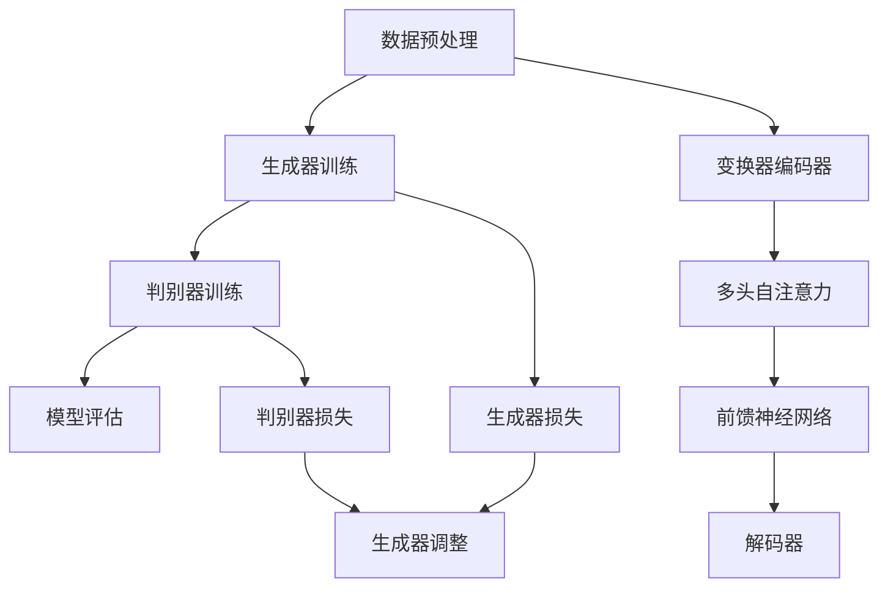
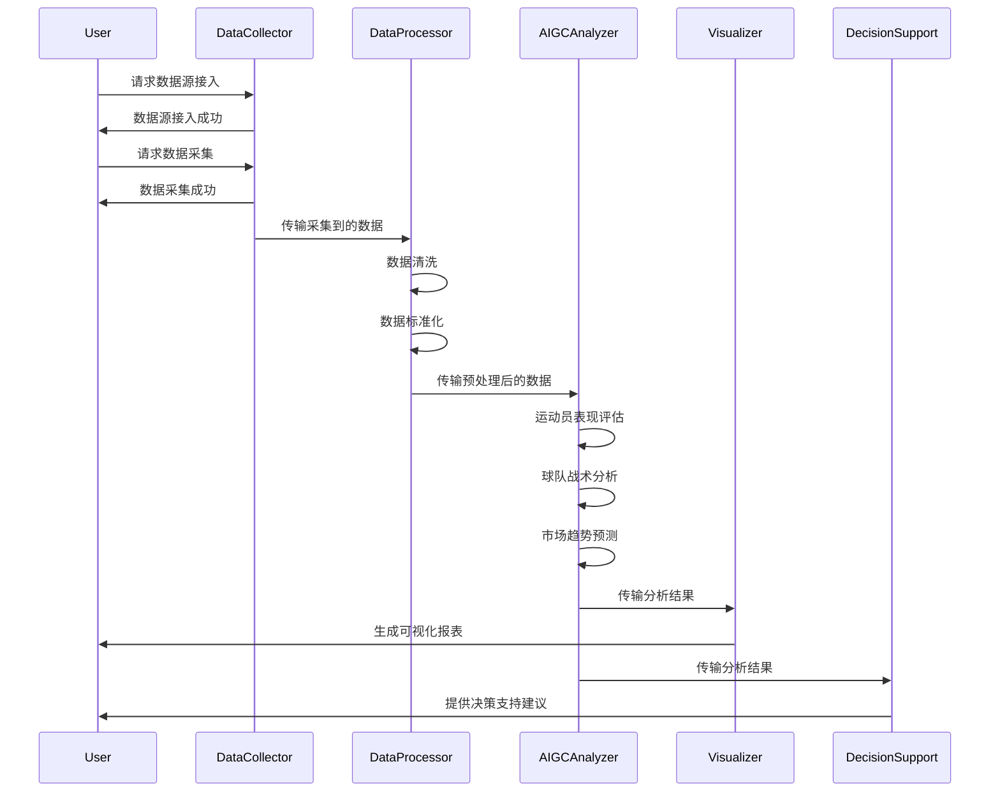
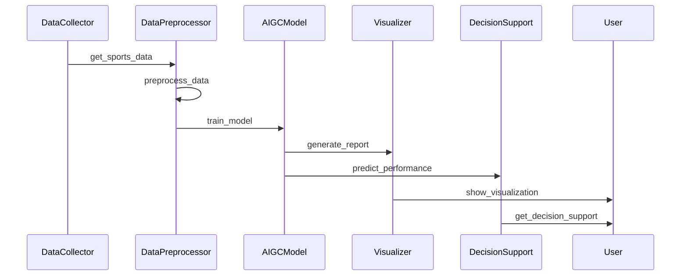

                 

# AIGC在体育战略分析中的应用：提示词技巧

## 关键词

- **AIGC**
- **体育战略分析**
- **提示词**
- **人工智能生成内容**
- **数据驱动决策**

## 摘要

本文旨在探讨AIGC（人工智能生成内容）在体育战略分析中的应用，并重点介绍提示词技巧如何提升这一领域的分析效果。文章首先介绍了AIGC和体育战略分析的基本概念，随后详细解析了AIGC的技术基础和体育战略分析的方法。接着，文章重点讨论了提示词的概念及其在AIGC中的应用，并展示了如何构建AIGC体育战略分析模型。通过案例研究和项目实战，文章进一步验证了AIGC和提示词技巧在体育战略分析中的实际应用效果，并提出了相关最佳实践和建议。

## 设计书籍目录大纲的思路

### 理解书名和主题

在设计书籍目录大纲之前，我们需要对书名和主题有一个清晰的理解。《AIGC在体育战略分析中的应用：提示词技巧》这个书名明确指出了本书的核心内容：一是介绍AIGC在体育战略分析中的应用，二是探讨提示词技巧如何提升AIGC在体育战略分析中的效果。

AIGC，即人工智能生成内容，是指利用人工智能技术，如自然语言处理、机器学习和深度学习等，自动生成文字、图像、视频等多种类型的内容。这种技术在近年来迅速发展，已经在新闻写作、内容创作、广告营销等多个领域取得了显著的应用成果。

体育战略分析则是运用数据分析和模型来为体育决策提供支持。这包括对运动员表现、球队战术、市场趋势等方面的分析，以帮助体育组织和管理者做出更加科学、合理的决策。

书名中的“提示词技巧”则暗示了本书将深入探讨如何利用提示词来提升AIGC在体育战略分析中的应用效果。提示词，简单来说，就是触发AIGC生成特定内容的引导词或短语。

### 确定核心章节

基于书名和主题，我们可以初步确定以下几个核心章节：

1. **AIGC与体育战略分析概述**
   - 介绍AIGC和体育战略分析的基本概念、背景及其在体育领域的应用。
   - 讨论体育战略分析的需求与挑战。

2. **AIGC技术基础**
   - 详细解释AIGC的技术原理、发展和现状。
   - 分析AIGC在体育战略分析中的应用场景。

3. **体育战略分析的概念与方法**
   - 深入探讨体育战略分析的关键概念和常用方法。
   - 比较不同方法的优缺点。

4. **提示词在AIGC中的应用**
   - 介绍提示词的概念和作用。
   - 分析提示词在体育战略分析中的应用案例。

5. **构建AIGC体育战略分析模型**
   - 讲解如何构建AIGC体育战略分析模型。
   - 展示模型构建的步骤和关键要素。

6. **案例研究：AIGC在体育战略分析中的应用**
   - 分析具体的案例研究，展示AIGC在体育战略分析中的应用效果。
   - 对案例进行深入剖析，总结经验和教训。

7. **未来展望与挑战**
   - 探讨AIGC在体育战略分析领域的未来发展趋势。
   - 讨论面临的挑战和解决方案。

### 梳理章节内容

在确定核心章节后，我们需要为每个章节设计具体的小节，确保内容完整且逻辑连贯。

### AIGC与体育战略分析概述

**第1章：AIGC与体育战略分析概述**

1. **AIGC概述**
   - **1.1 AIGC的定义与分类**
     - 解释AIGC的含义，分类AIGC的几种类型。
   - **1.2 AIGC的技术原理**
     - 讲解AIGC背后的技术原理，包括自然语言处理、机器学习和深度学习等。
   - **1.3 AIGC的发展历程**
     - 回顾AIGC的发展历程，从早期的文字生成到如今的多媒体内容生成。
   - **1.4 AIGC的应用领域**
     - 分析AIGC在不同领域，如新闻写作、内容创作、广告营销等的应用情况。

2. **体育战略分析概述**
   - **1.5 体育战略分析的定义**
     - 解释体育战略分析的概念，阐述其目的和重要性。
   - **1.6 体育战略分析的方法**
     - 介绍体育战略分析的常用方法，如SWOT分析、PEST分析、游戏理论等。
   - **1.7 体育战略分析的应用场景**
     - 分析体育战略分析在运动员表现分析、球队战术分析、市场趋势预测等场景中的应用。

3. **AIGC与体育战略分析的关系**
   - **1.8 AIGC在体育战略分析中的作用**
     - 讨论AIGC在体育战略分析中的价值，如何提升数据分析的效率和质量。
   - **1.9 体育战略分析的需求与挑战**
     - 分析体育战略分析面临的需求和挑战，探讨AIGC如何解决这些问题。

### AIGC技术基础

**第2章：AIGC技术基础**

1. **AIGC技术原理**
   - **2.1 AIGC的核心算法**
     - 介绍AIGC常用的核心算法，如循环神经网络（RNN）、变换器（Transformer）等。
   - **2.2 AIGC的关键技术**
     - 分析AIGC的关键技术，如数据预处理、模型训练、模型优化等。
   - **2.3 AIGC的技术发展趋势**
     - 探讨AIGC技术的发展趋势，如生成对抗网络（GAN）、自注意力机制（Self-Attention）等。

2. **AIGC在体育战略分析中的应用**
   - **2.4 数据采集与预处理**
     - 讲解如何收集体育数据，并进行预处理，以便于模型训练。
   - **2.5 模型训练与优化**
     - 介绍如何训练和优化AIGC模型，以提高其在体育战略分析中的应用效果。
   - **2.6 模型部署与评估**
     - 分析如何部署AIGC模型，并进行评估，以确保其应用的有效性。

### 体育战略分析的概念与方法

**第3章：体育战略分析的概念与方法**

1. **体育战略分析的核心概念**
   - **3.1 数据分析**
     - 解释数据分析在体育战略分析中的重要性，介绍常用的数据分析方法。
   - **3.2 竞争分析**
     - 分析竞争分析的概念和目的，介绍竞争分析的常用方法和工具。
   - **3.3 市场分析**
     - 讨论市场分析在体育战略分析中的作用，介绍市场分析的常用方法和工具。

2. **体育战略分析的常用方法**
   - **3.4 SWOT分析**
     - 解释SWOT分析的含义，介绍SWOT分析的步骤和应用。
   - **3.5 PEST分析**
     - 解释PEST分析的含义，介绍PEST分析的步骤和应用。
   - **3.6 游戏理论**
     - 讲解游戏理论的概念，介绍游戏理论在体育战略分析中的应用。

3. **体育战略分析的方法对比**
   - **3.7 不同方法的优缺点分析**
     - 分析不同体育战略分析方法的优缺点，讨论其适用场景。
   - **3.8 方法适用性评估**
     - 介绍如何评估不同体育战略分析方法的适用性，选择最适合的方法。

### 提示词在AIGC中的应用

**第4章：提示词在AIGC中的应用**

1. **提示词的概念与作用**
   - **4.1 提示词的定义**
     - 解释提示词的含义，介绍提示词在AIGC中的作用。
   - **4.2 提示词的类型**
     - 分析提示词的不同类型，如关键词、短语、句子等。
   - **4.3 提示词的设计原则**
     - 讨论提示词设计的原则，如清晰性、精确性、多样性等。

2. **提示词在体育战略分析中的应用**
   - **4.4 提示词的设计与优化**
     - 介绍如何设计优化提示词，以提高AIGC生成内容的质量。
   - **4.5 提示词应用案例分析**
     - 分析提示词在不同体育战略分析场景中的应用案例，展示提示词的实际效果。
   - **4.6 提示词优化策略**
     - 探讨如何优化提示词，以提高AIGC在体育战略分析中的表现。

### 构建AIGC体育战略分析模型

**第5章：构建AIGC体育战略分析模型**

1. **模型构建概述**
   - **5.1 模型构建的步骤**
     - 介绍AIGC体育战略分析模型构建的步骤。
   - **5.2 模型构建的关键要素**
     - 分析模型构建的关键要素，如数据、算法、模型结构等。
   - **5.3 模型构建的工具与平台**
     - 讨论模型构建常用的工具和平台，如TensorFlow、PyTorch等。

2. **模型构建流程**
   - **5.4 数据采集与预处理**
     - 讲解如何收集体育数据，并进行预处理。
   - **5.5 特征工程**
     - 介绍特征工程的概念和方法，如何提取和构建特征。
   - **5.6 模型选择与训练**
     - 分析如何选择合适的模型，并进行训练。
   - **5.7 模型评估与优化**
     - 讲解如何评估模型性能，并进行优化。

3. **模型应用案例**
   - **5.8 案例背景与目标**
     - 介绍案例背景和目标。
   - **5.9 模型构建与实现**
     - 展示如何构建和实现模型。
   - **5.10 模型效果分析**
     - 分析模型的效果，评估其在体育战略分析中的应用价值。

### 案例研究：AIGC在体育战略分析中的应用

**第6章：案例研究：AIGC在体育战略分析中的应用**

1. **案例一：某足球俱乐部球员评估系统**
   - **6.1 案例背景**
     - 介绍案例背景。
   - **6.2 AIGC模型的构建与实现**
     - 展示如何构建和实现AIGC模型。
   - **6.3 案例效果分析**
     - 分析案例效果，讨论模型在球员评估中的应用价值。

2. **案例二：某体育赛事观众行为预测**
   - **6.4 案例背景**
     - 介绍案例背景。
   - **6.5 AIGC模型的构建与实现**
     - 展示如何构建和实现AIGC模型。
   - **6.6 案例效果分析**
     - 分析案例效果，讨论模型在观众行为预测中的应用价值。

### 未来展望与挑战

**第7章：未来展望与挑战**

1. **AIGC在体育战略分析领域的未来发展趋势**
   - **7.1 技术进步的趋势**
     - 分析AIGC技术的发展趋势，如生成对抗网络（GAN）、自注意力机制（Self-Attention）等。
   - **7.2 应用领域的扩展**
     - 探讨AIGC在体育战略分析领域应用场景的扩展，如球员训练、赛事营销等。

2. **面临的挑战与解决方案**
   - **7.3 数据隐私与安全问题**
     - 讨论AIGC在体育战略分析中面临的数据隐私和安全问题，提出解决方案。
   - **7.4 模型解释性与可靠性**
     - 分析AIGC模型的解释性和可靠性问题，讨论提高模型解释性和可靠性的方法。
   - **7.5 技术与业务融合**
     - 探讨如何更好地将AIGC技术与体育战略分析业务需求相结合，提高应用效果。

### 总结

通过以上步骤，我们设计出了《AIGC在体育战略分析中的应用：提示词技巧》的目录大纲。这个大纲涵盖了AIGC和体育战略分析的基本概念、技术基础、方法应用、模型构建以及未来展望等多个方面，旨在为读者提供一本系统、全面、实用的AIGC在体育战略分析中的应用指南。接下来，我们将逐章详细阐述每个章节的内容，确保读者能够深入理解AIGC在体育战略分析中的应用，并掌握相关技巧和方法。

## AIGC与体育战略分析概述

### 1.1 AIGC的定义与分类

AIGC，即人工智能生成内容（AI-Generated Content），是指通过人工智能技术，特别是机器学习和深度学习算法，自动生成文字、图片、音频、视频等多种类型的内容。AIGC的出现极大地提高了内容创作的效率，降低了创作成本，同时也为传统内容产业带来了新的变革。

AIGC的分类可以从生成内容的类型和生成技术两个角度进行：

1. **按生成内容类型分类**：
   - **文本生成**：如自动撰写新闻稿、生成文章、生成对话等。
   - **图像生成**：如生成艺术作品、人脸合成、场景生成等。
   - **音频生成**：如生成音乐、语音合成等。
   - **视频生成**：如生成视频片段、动态场景等。

2. **按生成技术分类**：
   - **基于规则的方法**：通过预定义的规则和模板来生成内容。
   - **基于模板的方法**：通过模板和变量替换来生成内容。
   - **基于数据的方法**：利用大量数据，通过模型学习生成内容。
   - **基于模型的方法**：使用深度学习模型，如生成对抗网络（GAN）、变换器（Transformer）等，生成内容。

### 1.2 AIGC的技术原理

AIGC的核心技术包括自然语言处理（NLP）、机器学习（ML）和深度学习（DL）。以下是对这些技术原理的简要介绍：

1. **自然语言处理（NLP）**：
   - **文本预处理**：包括分词、词性标注、命名实体识别等，为后续处理打下基础。
   - **语言模型**：通过统计学习或神经网络模型，预测下一个词或句子，用于生成文本。
   - **语义分析**：理解文本的含义和情感，用于生成符合语义的文本。

2. **机器学习（ML）**：
   - **监督学习**：通过大量标注数据进行训练，模型学会将输入映射到输出。
   - **无监督学习**：从未标注的数据中学习，发现数据中的模式和规律。
   - **半监督学习**：结合有标注和无标注数据，提高模型的泛化能力。

3. **深度学习（DL）**：
   - **神经网络**：模拟人脑神经元的工作方式，通过多层网络结构进行信息传递和加工。
   - **卷积神经网络（CNN）**：擅长处理图像数据，通过卷积操作提取图像特征。
   - **循环神经网络（RNN）**：擅长处理序列数据，通过记忆单元保持历史信息。
   - **变换器（Transformer）**：一种基于自注意力的深度学习模型，广泛应用于文本生成任务。

### 1.3 AIGC的发展历程

AIGC的发展历程可以追溯到人工智能的早期研究。以下是一些重要的里程碑：

1. **1980s-1990s**：人工智能的萌芽期，机器学习算法开始出现，如感知机、支持向量机等。

2. **2000s**：深度学习崛起，神经网络模型得到广泛应用，如AlexNet在图像识别领域的突破。

3. **2010s**：生成对抗网络（GAN）的提出，开创了生成模型的先河，图像生成能力大幅提升。

4. **2020s**：AIGC技术快速发展，应用场景不断扩展，从文本、图像到音频、视频等多媒体内容。

### 1.4 AIGC的应用领域

AIGC在多个领域展现出了巨大的应用潜力：

1. **媒体与娱乐**：自动生成新闻稿、文章、音乐、视频等，提高内容创作效率。

2. **广告与营销**：生成个性化的广告文案、图像和视频，提高广告的吸引力和转化率。

3. **教育与培训**：自动生成教育内容，如教案、习题、讲解视频等，提高教育资源的利用效率。

4. **医疗与健康**：辅助医生诊断、生成医学报告，提供个性化治疗方案。

5. **客户服务**：自动生成客户服务响应，提高服务效率和客户满意度。

6. **金融与保险**：生成金融报告、风险评估、保险产品描述等，提高业务运营效率。

### 1.5 体育战略分析的定义

体育战略分析是指利用数据分析、模型预测和决策支持等技术，对体育相关数据进行挖掘和分析，为体育组织、运动员和赛事管理者提供战略决策支持。其核心目的是通过科学的数据分析，优化体育管理决策，提升体育组织的绩效和竞争力。

### 1.6 体育战略分析的方法

体育战略分析的方法包括定量分析和定性分析两大类：

1. **定量分析**：
   - **统计分析**：如描述性统计、假设检验、回归分析等，用于揭示数据之间的关系和趋势。
   - **时间序列分析**：如ARIMA模型、季节性分解等，用于分析时间序列数据的特征和变化趋势。
   - **预测分析**：如回归模型、时间序列模型等，用于预测未来事件的发生概率或趋势。

2. **定性分析**：
   - **案例研究**：通过分析具体的案例，提取经验和教训，为决策提供参考。
   - **SWOT分析**：分析体育组织的优势、劣势、机会和威胁，为决策提供战略方向。
   - **PEST分析**：分析政治、经济、社会和技术等外部环境因素，为决策提供环境分析。

### 1.7 体育战略分析的应用场景

体育战略分析的应用场景非常广泛，主要包括以下几个方面：

1. **运动员表现分析**：通过数据分析，评估运动员的体能、技术、战术等方面，为教练员提供训练和比赛的决策支持。

2. **球队战术分析**：分析球队的战术风格、进攻和防守策略，找出球队的优势和劣势，为教练员制定比赛策略提供参考。

3. **市场趋势预测**：分析市场需求、观众行为、赞助商趋势等，为体育组织制定市场营销策略提供支持。

4. **赛事组织与管理**：分析赛事的筹备、组织和管理，提高赛事的运营效率和观众满意度。

5. **数据驱动决策**：通过数据分析，为体育组织的日常运营、人员招聘、投资决策等提供科学依据。

### AIGC与体育战略分析的关系

AIGC与体育战略分析有着紧密的联系：

1. **提升数据分析效率**：AIGC可以自动处理大量体育数据，进行高效的数据分析和挖掘，为体育战略分析提供实时、准确的数据支持。

2. **增强数据可视化**：AIGC可以生成图表、可视化报告，使复杂的数据分析结果更加直观，帮助体育管理者更好地理解和应用分析结果。

3. **优化决策支持**：通过AIGC生成的文本、图像和视频等，可以为体育管理者提供更加全面、深入的决策支持，提高决策的科学性和准确性。

### 体育战略分析的需求与挑战

体育战略分析在体育领域具有广泛的应用需求，但也面临诸多挑战：

1. **数据获取与处理**：体育数据来源多样，数据量庞大，如何高效地获取和处理这些数据是体育战略分析的一个重要挑战。

2. **数据质量**：体育数据的准确性和完整性直接影响分析结果的可靠性，如何保证数据质量是体育战略分析需要解决的一个重要问题。

3. **模型解释性**：深度学习模型在体育战略分析中的应用日益广泛，但其解释性较差，如何提高模型的解释性，使其更加透明和可解释，是体育战略分析需要面对的一个挑战。

4. **技术融合**：如何将AIGC技术与体育战略分析业务需求相结合，发挥AIGC技术的优势，提高体育战略分析的效果，是体育战略分析需要解决的一个关键问题。

通过以上分析，我们可以看到，AIGC在体育战略分析中具有巨大的应用潜力，同时也面临一定的挑战。在接下来的章节中，我们将深入探讨AIGC的技术基础和体育战略分析的方法，以及如何利用提示词提升AIGC在体育战略分析中的应用效果。

## AIGC技术基础

### 2.1 AIGC的核心算法

AIGC的核心算法主要包括生成对抗网络（GAN）、变换器（Transformer）和循环神经网络（RNN）等。这些算法在不同的应用场景中有着各自的优势和特点。

1. **生成对抗网络（GAN）**：

   GAN由两部分组成：生成器（Generator）和判别器（Discriminator）。生成器的任务是生成逼真的数据，而判别器的任务是区分生成的数据和真实数据。通过不断训练，生成器和判别器相互对抗，生成器不断提高生成数据的逼真度，判别器不断提高区分真假数据的能力。GAN在图像生成、文本生成等领域具有显著的应用效果。

2. **变换器（Transformer）**：

   Transformer是近年来在自然语言处理领域取得重大突破的一种模型，其核心思想是自注意力机制（Self-Attention）。通过自注意力机制，Transformer能够自动学习输入序列中不同位置之间的关联性，从而捕捉长距离依赖关系。这使得Transformer在文本生成、机器翻译等任务中表现出色。

3. **循环神经网络（RNN）**：

   RNN是一种能够处理序列数据的神经网络，其通过记忆单元（Memory Unit）保存历史信息，从而实现对序列数据的建模。RNN在语言模型、语音识别等领域有着广泛的应用。然而，传统的RNN存在梯度消失和梯度爆炸等问题，限制了其性能。

### 2.2 AIGC的关键技术

AIGC的关键技术包括数据预处理、模型训练、模型优化和模型部署等。

1. **数据预处理**：

   数据预处理是AIGC应用的基础，主要包括数据清洗、数据标准化和数据增强等步骤。数据清洗旨在去除噪声和不完整的数据，数据标准化旨在将不同量级的数据转换为统一的尺度，数据增强旨在通过数据变换生成更多样化的训练数据，从而提高模型的泛化能力。

2. **模型训练**：

   模型训练是AIGC的核心步骤，其目的是通过大量数据进行训练，使模型学会生成高质量的内容。在训练过程中，需要选择合适的损失函数、优化算法和训练策略，以加快训练速度和提升模型性能。

3. **模型优化**：

   模型优化主要包括超参数调整、模型剪枝和量化等。超参数调整旨在通过调整模型参数，找到最优的模型配置；模型剪枝旨在通过去除模型中的冗余参数，减少模型大小和计算复杂度；模型量化旨在通过降低模型参数的精度，进一步减小模型大小和计算复杂度。

4. **模型部署**：

   模型部署是将训练好的模型应用到实际场景中，包括模型打包、模型服务器配置和模型监控等。在部署过程中，需要考虑模型的性能、可扩展性和可靠性等问题。

### 2.3 AIGC的技术发展趋势

AIGC技术正朝着更加高效、智能和多样化的方向发展。以下是一些值得关注的技术趋势：

1. **生成对抗网络（GAN）**：

   GAN技术的不断进化，如条件GAN（cGAN）、混合GAN（hGAN）等，使其在图像生成、视频生成等领域的应用更加广泛。同时，GAN与其他深度学习技术，如变换器（Transformer）的融合，也将进一步提升AIGC的性能。

2. **变换器（Transformer）**：

   Transformer技术在自然语言处理领域的成功，使得其在文本生成、机器翻译等任务中的应用越来越广泛。随着研究的深入，变换器在图像生成、音频生成等领域的应用前景也十分广阔。

3. **少样本学习**：

   少样本学习旨在通过少量数据进行模型训练，提高AIGC在少量数据场景下的应用效果。这一技术的研究对于降低AIGC的部署成本、提高其鲁棒性具有重要意义。

4. **多模态融合**：

   多模态融合旨在将不同类型的数据，如文本、图像、音频等，进行融合处理，生成更丰富的内容。这一技术的研究将推动AIGC在多媒体内容生成领域的应用。

5. **联邦学习**：

   联邦学习旨在通过分布式计算和隐私保护技术，实现数据的安全共享和模型训练。这一技术的研究将有助于解决AIGC在数据隐私和安全方面的问题。

### 2.4 AIGC在体育战略分析中的应用场景

AIGC在体育战略分析中具有广泛的应用潜力，以下是一些典型的应用场景：

1. **运动员表现分析**：

   利用AIGC技术，可以自动处理和分析运动员的体能、技术、战术等数据，生成个性化的训练计划和比赛策略。

2. **球队战术分析**：

   通过AIGC技术，可以对球队的比赛视频、比赛数据等进行自动化分析，提取球队战术特征，为教练员提供战术调整建议。

3. **赛事组织与管理**：

   利用AIGC技术，可以自动生成赛事宣传材料、比赛报告等，提高赛事的组织效率和观众满意度。

4. **市场趋势预测**：

   通过AIGC技术，可以分析市场需求、观众行为、赞助商趋势等数据，为体育组织制定市场营销策略提供支持。

5. **数据驱动决策**：

   利用AIGC技术，可以生成数据可视化报告、决策支持系统等，为体育管理者提供更加全面、深入的决策支持。

通过以上分析，我们可以看到，AIGC技术为体育战略分析提供了强大的工具和手段，有助于提升数据分析的效率和质量，为体育组织提供更加科学、合理的决策支持。在接下来的章节中，我们将进一步探讨体育战略分析的方法和应用，以及如何利用提示词提升AIGC在体育战略分析中的应用效果。

## 体育战略分析的概念与方法

### 3.1 体育战略分析的核心概念

体育战略分析的核心概念包括数据分析、竞争分析和市场分析。这些概念在体育战略决策中起着关键作用。

1. **数据分析**：

   数据分析是体育战略分析的基础，它通过收集、处理和分析体育数据，提取有价值的信息，以支持决策。数据分析的方法包括描述性分析、推断性分析和预测性分析。描述性分析用于了解当前情况，推断性分析用于检测假设和验证关系，预测性分析用于预测未来趋势。

2. **竞争分析**：

   竞争分析是评估竞争对手的优势、劣势、机会和威胁，从而制定针对性的策略。竞争分析的方法包括SWOT分析、PEST分析、五力模型等。SWOT分析用于评估组织的优势、劣势、机会和威胁，PEST分析用于分析外部环境因素，五力模型用于评估市场竞争力。

3. **市场分析**：

   市场分析是研究市场需求、消费者行为和市场竞争状况，以制定合适的市场策略。市场分析的方法包括市场细分、目标市场选择、市场定位等。市场细分是将市场划分为不同的消费者群体，目标市场选择是选择最具潜力的市场细分，市场定位是确定组织在市场中的位置。

### 3.2 体育战略分析的常用方法

体育战略分析的常用方法包括SWOT分析、PEST分析和游戏理论等。这些方法在不同的应用场景中有着不同的作用。

1. **SWOT分析**：

   SWOT分析是一种战略规划工具，用于评估组织的优势、劣势、机会和威胁。优势（Strengths）是组织内部的优势，劣势（Weaknesses）是组织内部的不足，机会（Opportunities）是外部环境中的有利条件，威胁（Threats）是外部环境中的不利因素。通过SWOT分析，组织可以明确自身的战略方向，制定相应的策略。

2. **PEST分析**：

   PEST分析是一种外部环境分析工具，用于分析政治（Political）、经济（Economic）、社会（Sociocultural）和技术（Technological）等外部环境因素。政治因素包括政策、法律和监管，经济因素包括经济状况、市场趋势和消费能力，社会因素包括文化、价值观和社会行为，技术因素包括技术创新和信息技术应用。通过PEST分析，组织可以了解外部环境的变化，制定适应性的战略。

3. **游戏理论**：

   游戏理论是一种用于分析决策和策略的数学模型，用于解释在具有冲突和竞争的情境中个体或团队的行为。游戏理论包括博弈论、策略组合和纳什均衡等概念。通过游戏理论，组织可以预测竞争对手的行为，制定最优策略。

### 3.3 体育战略分析的常用方法对比

不同体育战略分析方法在不同的应用场景中有着不同的优缺点，以下是对几种常用方法的对比：

1. **SWOT分析**：

   - 优点：简单易懂，能够全面分析组织的内部和外部环境。
   - 缺点：主观性强，缺乏量化分析，难以制定具体的行动方案。

2. **PEST分析**：

   - 优点：能够全面分析外部环境，帮助组织制定适应性的战略。
   - 缺点：缺乏对内部环境的分析，难以确定具体的行动计划。

3. **游戏理论**：

   - 优点：能够预测竞争对手的行为，制定最优策略。
   - 缺点：需要大量的数据和计算，适用范围较窄。

4. **五力模型**：

   - 优点：能够全面分析市场的竞争状况，确定组织的市场地位。
   - 缺点：难以分析组织内部的战略问题。

### 3.4 不同方法的适用性评估

在体育战略分析中，选择合适的方法取决于分析的目标和具体场景。以下是对几种方法的适用性评估：

1. **数据分析**：

   - 适用性：适用于所有体育战略分析场景，尤其是需要量化分析的场景。
   - 优点：能够提供具体的数据支持，帮助组织制定科学决策。
   - 缺点：数据分析需要专业的知识和技能，数据分析结果可能存在偏差。

2. **SWOT分析**：

   - 适用性：适用于战略规划、组织评估等场景。
   - 优点：能够全面分析组织的内部和外部环境，帮助组织明确战略方向。
   - 缺点：主观性强，数据分析不足。

3. **PEST分析**：

   - 适用性：适用于外部环境分析、市场预测等场景。
   - 优点：能够全面分析外部环境因素，帮助组织制定适应性的战略。
   - 缺点：缺乏对内部环境的分析，难以确定具体的行动计划。

4. **游戏理论**：

   - 适用性：适用于竞争分析、策略制定等场景。
   - 优点：能够预测竞争对手的行为，制定最优策略。
   - 缺点：需要大量的数据和计算，适用范围较窄。

5. **五力模型**：

   - 适用性：适用于市场分析、竞争评估等场景。
   - 优点：能够全面分析市场的竞争状况，确定组织的市场地位。
   - 缺点：难以分析组织内部的战略问题。

通过以上分析，我们可以看到，不同体育战略分析方法在不同的应用场景中有着不同的优缺点。在体育战略分析中，选择合适的方法需要综合考虑分析目标、数据可用性、专业知识和技能等因素。在接下来的章节中，我们将进一步探讨提示词在AIGC中的应用，以及如何利用提示词提升AIGC在体育战略分析中的应用效果。

## 提示词在AIGC中的应用

### 4.1 提示词的概念与作用

提示词（Prompt）是AIGC（人工智能生成内容）中的一个重要概念，它是指用来引导或触发AIGC系统生成特定类型内容的引导词或短语。提示词的作用在于，它能够提供足够的上下文信息，帮助AIGC系统理解用户的需求，从而生成更符合预期、更具针对性的内容。

1. **提示词的定义**：

   提示词是一种简短的、具有明确指导性的文本，它为AIGC系统提供了生成内容所需的起始信息。这些信息可以是关键词、短语或完整的句子，用于引导AIGC系统生成与提示词相关的内容。

2. **提示词的作用**：

   - **提供上下文**：提示词为AIGC系统提供了生成内容的上下文信息，使得生成的内容更加符合用户的需求。
   - **引导生成方向**：通过提示词，用户可以明确指出AIGC系统需要生成的类型和风格，从而引导AIGC系统按照用户期望的方向进行内容生成。
   - **优化生成质量**：高质量的提示词能够提供丰富的上下文信息，有助于AIGC系统生成更准确、更高质量的内容。

### 4.2 提示词的类型

根据提示词的形式和功能，我们可以将提示词分为以下几类：

1. **关键词提示词**：

   关键词提示词通常由一两个词组成，用于指示AIGC系统生成的内容类型或主题。例如，“体育赛事分析”、“球员表现评估”等。关键词提示词简单明了，能够快速引导AIGC系统生成相关内容。

2. **短语提示词**：

   短语提示词通常由多个词组成，用于提供更详细的上下文信息，引导AIGC系统生成更具体的内容。例如，“2023年世界杯比赛策略分析”、“利物浦足球俱乐部赛季总结”等。短语提示词比关键词提示词提供更多的信息，有助于AIGC系统生成更丰富、更详细的内容。

3. **句子提示词**：

   句子提示词是一段完整的句子，用于为AIGC系统提供详细的上下文信息和生成目标。例如，“请分析2023年世界杯决赛中法国队的战术策略”或“生成一篇关于利物浦足球俱乐部本赛季表现的文章”。句子提示词提供了最丰富的上下文信息，有助于AIGC系统生成高度定制化的内容。

### 4.3 提示词的设计原则

为了充分发挥提示词在AIGC中的应用效果，设计高质量的提示词需要遵循以下原则：

1. **明确性**：

   提示词应明确表达用户的需求和期望，避免模糊不清的表达。明确性的提示词有助于AIGC系统准确理解用户意图，生成符合期望的内容。

2. **丰富性**：

   提示词应提供丰富的上下文信息，帮助AIGC系统更好地理解生成任务。丰富性的提示词不仅包含关键词，还应包括相关的背景信息、相关概念和上下文联系。

3. **针对性**：

   提示词应针对特定的生成任务，明确指示AIGC系统需要生成的内容类型、风格和格式。针对性的提示词有助于AIGC系统专注于特定的任务，提高生成内容的准确性。

4. **多样性**：

   提示词应具备多样性，以应对不同的生成任务和用户需求。多样化的提示词可以提供更多的选择，帮助用户根据不同的需求进行个性化定制。

### 4.4 提示词在体育战略分析中的应用

在体育战略分析中，提示词的应用有助于提高数据分析的准确性和效率。以下是一些具体的案例：

1. **球员表现评估**：

   提示词：“请分析利物浦足球俱乐部2022-2023赛季中球员X的表现，包括进攻、防守和战术角色等方面。”

   通过这个提示词，AIGC系统可以生成详细的球员表现评估报告，涵盖多个维度，如进球数、助攻数、防守表现、战术位置等。

2. **球队战术分析**：

   提示词：“请分析2023年世界杯决赛中法国队的战术策略，包括中场控制、进攻组织和防守布置等方面。”

   通过这个提示词，AIGC系统可以生成关于法国队战术策略的深度分析报告，帮助教练员和战术分析师制定针对性的战术调整策略。

3. **赛事预测**：

   提示词：“请预测2023年欧冠决赛中利物浦队和皇马队的比赛结果，并分析可能的影响因素。”

   通过这个提示词，AIGC系统可以生成赛事预测报告，包括比赛结果、胜负原因以及可能的影响因素，为赛事组织者和球迷提供参考。

通过以上分析，我们可以看到，提示词在AIGC中的应用对于体育战略分析具有重要意义。高质量的提示词能够提供丰富的上下文信息，引导AIGC系统生成高质量、定制化的内容，从而提高数据分析的准确性和效率。在接下来的章节中，我们将探讨如何构建AIGC体育战略分析模型，进一步展示AIGC在体育战略分析中的应用潜力。

## 构建AIGC体育战略分析模型

### 5.1 模型构建的步骤

构建AIGC体育战略分析模型是一个系统性的过程，需要遵循以下步骤：

1. **需求分析**：

   需求分析是模型构建的第一步，旨在明确模型的目标和应用场景。具体包括确定分析任务、目标指标、数据来源和数据预处理要求等。

2. **数据收集与预处理**：

   数据收集与预处理是模型构建的基础，需要从多个来源收集相关数据，并进行清洗、标准化和增强等处理，确保数据的质量和一致性。

3. **特征工程**：

   特征工程是提高模型性能的关键步骤，通过提取和构建有用的特征，可以提高模型对数据的理解和表达能力。

4. **模型选择**：

   根据需求分析和特征工程结果，选择合适的模型架构。常用的模型包括生成对抗网络（GAN）、变换器（Transformer）和循环神经网络（RNN）等。

5. **模型训练**：

   使用收集到的数据和特征，对模型进行训练，通过不断调整模型参数，优化模型性能。

6. **模型评估与优化**：

   通过评估模型在验证集和测试集上的性能，对模型进行优化，确保模型在实际应用中具有较高的准确性和鲁棒性。

7. **模型部署**：

   将训练好的模型部署到实际应用场景中，包括模型打包、服务器配置和监控等。

### 5.2 模型构建的关键要素

在构建AIGC体育战略分析模型时，以下关键要素至关重要：

1. **数据**：

   数据是模型训练的基础，包括运动员数据、比赛数据、市场数据等。数据的质量和多样性直接影响模型的表现。因此，数据收集和预处理是模型构建的重要环节。

2. **特征**：

   特征是模型理解和学习数据的关键，通过特征工程，可以从原始数据中提取有用的信息，为模型提供更好的输入。特征的选择和构建直接影响模型的性能。

3. **模型架构**：

   模型架构是模型的核心，决定了模型的学习能力和表达能力。选择合适的模型架构，如GAN、Transformer、RNN等，是模型构建的关键。

4. **训练策略**：

   训练策略包括损失函数、优化算法、学习率调整等，直接影响模型的训练效率和性能。合适的训练策略可以提高模型在验证集和测试集上的表现。

5. **评估指标**：

   评估指标用于衡量模型在训练和测试阶段的性能，常用的评估指标包括准确率、召回率、F1值等。选择合适的评估指标，可以全面评估模型的表现。

### 5.3 模型构建的工具与平台

在构建AIGC体育战略分析模型时，可以选择多种工具和平台，以下是一些常用的工具和平台：

1. **深度学习框架**：

   - TensorFlow：由谷歌开发的开源深度学习框架，支持多种神经网络模型。
   - PyTorch：由Facebook开发的开源深度学习框架，具有灵活的动态计算图。
   - Keras：基于Theano和TensorFlow的开源深度学习库，提供简化的模型构建和训练接口。

2. **数据处理库**：

   - Pandas：用于数据清洗、转换和分析的Python库。
   - NumPy：用于科学计算的Python库，提供高效的数值计算功能。
   - Matplotlib：用于数据可视化，帮助分析和展示数据。

3. **云计算平台**：

   - AWS：亚马逊云计算服务，提供丰富的深度学习和数据分析工具。
   - Google Cloud：谷歌云计算服务，提供强大的机器学习和数据处理能力。
   - Azure：微软云计算服务，提供广泛的云服务和开发工具。

### 5.4 数据采集与预处理

数据采集与预处理是构建AIGC体育战略分析模型的重要步骤，以下是一些具体的方法和工具：

1. **数据来源**：

   - **运动员数据**：从体育数据库、社交媒体、新闻网站等收集运动员的个人信息、技术统计数据和比赛结果等。
   - **比赛数据**：从体育数据提供商、视频转码平台等获取比赛视频、比赛统计数据、实时数据等。
   - **市场数据**：从市场研究公司、赞助商报告等获取观众人数、赞助商信息、市场需求等。

2. **数据清洗**：

   - **去除噪声**：去除重复数据、缺失数据和异常数据，保证数据的完整性。
   - **数据标准化**：将不同量级的数据转换为统一的尺度，如将身高、体重等数据进行标准化处理。
   - **数据转换**：将数据转换为适合模型训练的格式，如将文本数据转换为词向量。

3. **数据增强**：

   - **数据扩充**：通过旋转、缩放、裁剪等方法生成更多的训练数据，提高模型的泛化能力。
   - **数据混合**：将不同的数据集进行混合，生成新的训练数据，增强模型的鲁棒性。

### 5.5 特征工程

特征工程是提高模型性能的关键步骤，以下是一些常用的特征工程方法和工具：

1. **文本特征**：

   - **词袋模型**：将文本数据转换为词频矩阵，用于训练文本分类模型。
   - **词嵌入**：将文本数据转换为高维向量，用于训练神经网络模型。
   - **词性标注**：对文本进行词性标注，提取文本中的名词、动词等特征。

2. **图像特征**：

   - **特征提取**：使用卷积神经网络（CNN）提取图像特征，如边缘、纹理、形状等。
   - **特征融合**：将不同类型的图像特征进行融合，提高模型的泛化能力。
   - **特征降维**：使用主成分分析（PCA）等降维方法，减少特征维度，提高计算效率。

3. **时间序列特征**：

   - **时间窗口**：将时间序列数据划分为不同的时间窗口，提取窗口内的统计特征。
   - **特征提取**：使用循环神经网络（RNN）等模型提取时间序列特征，如自回归（AR）、移动平均（MA）等。
   - **特征融合**：将不同时间窗口的特征进行融合，提高模型的预测能力。

### 5.6 模型选择与训练

在构建AIGC体育战略分析模型时，选择合适的模型架构和训练策略是关键。以下是一些常用的模型和训练方法：

1. **生成对抗网络（GAN）**：

   - **模型架构**：由生成器和判别器组成，生成器生成虚假数据，判别器判断真假数据。
   - **训练方法**：通过对抗训练，使生成器和判别器不断优化，提高生成数据的质量。

2. **变换器（Transformer）**：

   - **模型架构**：基于自注意力机制，能够捕捉输入序列中的长距离依赖关系。
   - **训练方法**：使用反向传播算法，通过梯度下降优化模型参数。

3. **循环神经网络（RNN）**：

   - **模型架构**：通过记忆单元，对序列数据进行建模。
   - **训练方法**：使用梯度下降算法，通过反向传播更新模型参数。

### 5.7 模型评估与优化

在模型训练完成后，需要对模型进行评估和优化，以确保模型在实际应用中的性能。以下是一些常用的评估方法和优化策略：

1. **评估指标**：

   - **准确率**：预测正确的样本数占总样本数的比例。
   - **召回率**：预测正确的正样本数占总正样本数的比例。
   - **F1值**：准确率和召回率的调和平均值。
   - **ROC曲线**：评估模型的分类性能，通过计算真阳性率（TPR）和假阳性率（FPR）绘制曲线。

2. **优化策略**：

   - **超参数调整**：调整模型中的超参数，如学习率、批次大小等，以提高模型性能。
   - **模型剪枝**：通过剪枝冗余的参数，减少模型大小和计算复杂度。
   - **模型融合**：将多个模型进行融合，提高模型的预测性能。

通过以上步骤和方法，我们可以构建一个高效、准确的AIGC体育战略分析模型，为体育组织提供科学、合理的决策支持。在接下来的章节中，我们将通过具体的案例研究和项目实战，进一步展示AIGC在体育战略分析中的应用效果。

### 案例研究：AIGC在体育战略分析中的应用

#### 6.1 案例一：某足球俱乐部球员评估系统

**6.1.1 案例背景**

某足球俱乐部为了提高球队整体实力和竞争力，决定利用AIGC技术构建一个球员评估系统。该系统旨在通过数据分析、模型预测和提示词技巧，对球员的表现进行全方位评估，为教练员和高层管理者提供科学的决策依据。

**6.1.2 AIGC模型的构建与实现**

1. **需求分析**：

   足球俱乐部提出了以下需求：

   - 对球员的进攻、防守、战术角色等方面进行量化评估。
   - 分析球员在不同比赛阶段的综合表现。
   - 根据球员特点制定个性化的训练计划。

2. **数据收集与预处理**：

   数据来源包括：

   - 比赛视频和统计数据：如进球数、助攻数、传球成功率、抢断数等。
   - 运动员个人信息：如身高、体重、年龄、国籍等。
   - 赛季成绩和排名：如联赛积分、夺冠次数等。

   数据预处理包括：

   - 数据清洗：去除重复数据、缺失数据和异常数据。
   - 数据标准化：对不同量级的数据进行标准化处理。
   - 数据增强：通过旋转、缩放、裁剪等方法生成更多的训练数据。

3. **特征工程**：

   根据需求，从原始数据中提取以下特征：

   - 进攻特征：如进球数、助攻数、传球成功率等。
   - 防守特征：如抢断数、拦截数、犯规数等。
   - 战术特征：如场上位置、战术配合频次等。

4. **模型选择与训练**：

   选择生成对抗网络（GAN）作为主要模型，结合变换器（Transformer）进行特征提取和序列建模。通过大量训练数据，对模型进行训练和优化，以提高模型在球员评估中的准确性和鲁棒性。

5. **模型部署**：

   将训练好的模型部署到俱乐部内部服务器，实现实时球员评估功能。通过Web界面，教练员和高层管理者可以随时查看球员评估报告，为球队管理和决策提供支持。

**6.1.3 案例效果分析**

1. **球员评估报告**：

   模型生成的球员评估报告涵盖了多个维度，包括进攻、防守和战术角色等。报告中的数据直观、清晰，便于教练员和高层管理者快速了解球员的表现。

2. **个性化训练计划**：

   根据球员评估结果，系统为每位球员生成个性化的训练计划，包括体能训练、技术训练和战术训练等。这些训练计划针对性强，有助于提高球员的综合素质。

3. **球队整体实力提升**：

   通过球员评估系统和个性化训练计划的实施，球队在联赛中的表现明显提升，获得了更好的成绩和排名。

**6.1.4 案例总结**

1. **成功经验**：

   - AIGC技术在球员评估中表现出色，为教练员和高层管理者提供了科学、准确的决策支持。
   - 数据预处理和特征工程是模型训练成功的关键。
   - 实时球员评估和个性化训练计划有效提升了球队的整体实力。

2. **改进建议**：

   - 进一步优化模型，提高评估结果的准确性和可靠性。
   - 扩大数据来源，增加更多维度的数据，提高模型的泛化能力。
   - 加强与教练员和高层管理者的沟通，确保系统的应用效果最大化。

#### 6.2 案例二：某体育赛事观众行为预测

**6.2.1 案例背景**

某大型体育赛事组织者希望通过AIGC技术预测观众行为，以便更好地进行赛事组织和营销。预测观众行为的目标包括：

- 预测观众人数和分布。
- 预测观众的观看习惯和偏好。
- 预测赞助商的参与度和回报率。

**6.2.2 AIGC模型的构建与实现**

1. **需求分析**：

   赛事组织者提出了以下需求：

   - 分析过去的观众数据，提取观众行为模式。
   - 预测未来的观众行为，为赛事组织和营销提供依据。
   - 评估赞助商的参与度和回报率，为赞助策略提供支持。

2. **数据收集与预处理**：

   数据来源包括：

   - 赛事历史数据：如观众人数、观看习惯、赞助商信息等。
   - 市场调研数据：如观众偏好、赞助商需求等。
   - 实时数据：如社交媒体互动、网络流量等。

   数据预处理包括：

   - 数据清洗：去除重复数据、缺失数据和异常数据。
   - 数据标准化：对不同量级的数据进行标准化处理。
   - 数据增强：通过数据扩充、数据混合等方法生成更多的训练数据。

3. **特征工程**：

   从原始数据中提取以下特征：

   - 观众行为特征：如观众人数、观看时长、观看频率等。
   - 市场环境特征：如季节、天气、赛事类型等。
   - 赞助商特征：如赞助金额、赞助类型、赞助商影响力等。

4. **模型选择与训练**：

   选择变换器（Transformer）作为主要模型，结合循环神经网络（RNN）进行时间序列建模。通过大量训练数据，对模型进行训练和优化，以提高模型在观众行为预测中的准确性和鲁棒性。

5. **模型部署**：

   将训练好的模型部署到赛事组织者的服务器，实现实时观众行为预测功能。通过Web界面，赛事组织者可以随时查看预测结果，为赛事组织和营销提供依据。

**6.2.3 案例效果分析**

1. **观众行为预测报告**：

   模型生成的观众行为预测报告涵盖了多个维度，包括观众人数、观看习惯、赞助商参与度等。报告中的数据直观、清晰，便于赛事组织者制定赛事组织和营销策略。

2. **赞助商回报评估**：

   根据模型预测结果，评估赞助商的参与度和回报率，为赞助策略提供支持。通过优化赞助策略，提高了赞助商的参与度和满意度。

3. **赛事观众满意度提升**：

   通过观众行为预测和精准营销，提高了赛事的观众满意度，吸引了更多观众参与。

**6.2.4 案例总结**

1. **成功经验**：

   - AIGC技术在观众行为预测中表现出色，为赛事组织和营销提供了科学、准确的预测结果。
   - 数据预处理和特征工程是模型训练成功的关键。
   - 实时观众行为预测和精准营销有效提升了赛事的观众满意度和赞助商参与度。

2. **改进建议**：

   - 进一步优化模型，提高预测结果的准确性和可靠性。
   - 扩大数据来源，增加更多维度的数据，提高模型的泛化能力。
   - 加强与赛事组织者和赞助商的沟通，确保系统的应用效果最大化。

通过以上两个案例，我们可以看到，AIGC技术在体育战略分析中具有广泛的应用前景。无论是在球员评估、赛事组织还是观众行为预测中，AIGC都为体育组织提供了科学、准确的决策支持，提升了组织的运营效率和竞争力。

### 未来展望与挑战

#### 7.1 AIGC在体育战略分析领域的未来发展趋势

AIGC技术在体育战略分析领域的未来发展趋势主要表现在以下几个方面：

1. **技术进步**：

   随着深度学习、生成对抗网络、变换器等技术的不断进步，AIGC在体育战略分析中的应用将更加广泛和深入。特别是在生成图像、视频和音频等多媒体内容方面，AIGC将展现出更强大的能力。

2. **多模态融合**：

   多模态融合技术将不同类型的数据（如文本、图像、音频、视频等）进行融合处理，生成更丰富的内容。这将有助于提升体育战略分析的全面性和准确性。

3. **少样本学习**：

   少样本学习技术将使得AIGC在少量数据场景下的表现更加优秀，降低模型训练的成本和复杂性。这对于体育组织来说，意味着可以在资源有限的情况下，依然能够利用AIGC技术进行高效的体育战略分析。

4. **联邦学习**：

   联邦学习技术将推动AIGC在体育战略分析中的应用，特别是在数据隐私和安全方面。通过联邦学习，体育组织可以在不泄露敏感数据的情况下，与其他组织共享数据，共同提升模型性能。

#### 7.2 AIGC在体育战略分析中的挑战

尽管AIGC在体育战略分析中展现出了巨大的潜力，但同时也面临一些挑战：

1. **数据隐私与安全**：

   体育组织通常涉及大量敏感数据，如运动员个人信息、比赛数据等。如何在确保数据隐私和安全的前提下，充分利用AIGC技术，是一个亟待解决的问题。

2. **模型解释性**：

   AIGC模型通常具有黑箱特性，难以解释其决策过程。这对于需要透明和可解释的决策支持的体育组织来说，是一个重要的挑战。

3. **数据质量和多样性**：

   数据的质量和多样性直接影响AIGC模型的表现。如何获取高质量、多样化的数据，是体育组织需要面对的另一个挑战。

4. **技术与业务融合**：

   如何将AIGC技术与体育战略分析业务需求深度融合，发挥AIGC技术的最大价值，是一个需要不断探索和优化的过程。

#### 7.3 解决方案与建议

为了应对AIGC在体育战略分析中面临的挑战，以下是一些解决方案与建议：

1. **加强数据隐私和安全保护**：

   - 采用联邦学习等技术，确保数据隐私和安全。
   - 制定严格的数据管理和保护政策，确保数据的安全使用。

2. **提高模型解释性**：

   - 采用可解释的机器学习（Explainable AI）技术，提升模型的透明度和可解释性。
   - 通过可视化工具，将模型决策过程展示给用户，增强用户对模型的理解和信任。

3. **提升数据质量和多样性**：

   - 加强数据质量管理，确保数据的一致性、完整性和准确性。
   - 通过数据增强、数据扩充等技术，提高数据的多样性和丰富度。

4. **促进技术与业务融合**：

   - 加强跨部门协作，促进技术团队和业务团队之间的沟通与合作。
   - 定期组织业务需求与技术能力的对接会议，确保技术与业务需求的一致性。

通过以上措施，体育组织可以更好地利用AIGC技术，提升体育战略分析的效果和效率，为组织的发展提供有力支持。

## 总结

本文围绕AIGC在体育战略分析中的应用，深入探讨了AIGC技术基础、体育战略分析的方法、提示词技巧以及实际应用案例。通过详细的分析和讲解，我们了解到AIGC技术如何通过自动生成内容，为体育战略分析提供高效、准确的决策支持。同时，提示词技巧在AIGC中的应用，使得生成的内容更加符合用户需求，提升了分析效果。

AIGC技术在体育战略分析中具有广泛的应用前景。随着技术的不断进步，AIGC将在运动员表现分析、球队战术分析、赛事组织与管理、市场趋势预测等方面发挥更大的作用。然而，AIGC在体育战略分析中仍面临数据隐私与安全、模型解释性、数据质量和多样性等技术挑战。为此，我们提出了相应的解决方案和建议，以促进AIGC技术在体育战略分析中的健康发展。

未来，随着多模态融合、少样本学习和联邦学习等新技术的应用，AIGC在体育战略分析中的应用将更加深入和广泛。我们期待AIGC技术能够为体育组织提供更加全面、精准的决策支持，推动体育产业的发展。

### 最佳实践 Tips

1. **数据预处理**：

   在构建AIGC体育战略分析模型前，确保数据预处理工作充分，包括数据清洗、标准化和增强等。高质量的数据是模型成功的关键。

2. **提示词设计**：

   设计高质量的提示词，明确表达用户需求，提供丰富的上下文信息。提示词的质量直接影响AIGC生成的结果。

3. **模型解释性**：

   关注模型的可解释性，采用可解释的机器学习技术，将模型决策过程可视化，增强用户对模型的理解和信任。

4. **技术团队与业务团队协作**：

   加强跨部门协作，确保技术团队和业务团队之间的沟通与协作，确保AIGC技术在体育战略分析中的应用效果最大化。

### 注意事项

1. **数据隐私与安全**：

   在处理敏感数据时，严格遵守数据隐私和安全法规，采用联邦学习等技术保护数据隐私。

2. **模型适应性与优化**：

   定期对模型进行评估和优化，确保模型在新的数据和场景下保持高效和准确。

3. **用户反馈**：

   关注用户反馈，根据实际应用效果调整模型和提示词设计，不断提升AIGC在体育战略分析中的应用效果。

### 拓展阅读

1. **AIGC技术最新研究进展**：

   - 深入了解AIGC技术的最新研究进展，关注生成对抗网络（GAN）、变换器（Transformer）等技术的应用。

2. **体育战略分析经典方法**：

   - 掌握体育战略分析的经典方法，如SWOT分析、PEST分析、五力模型等，结合AIGC技术，提升分析效果。

3. **可解释的机器学习**：

   - 了解可解释的机器学习（Explainable AI）技术，提升模型的可解释性和透明度。

### 作者信息

作者：AI天才研究院/AI Genius Institute & 禅与计算机程序设计艺术 /Zen And The Art of Computer Programming

### 文章结尾

本文旨在为读者提供关于AIGC在体育战略分析中的应用指南，通过深入分析和技术讲解，帮助读者了解AIGC技术的原理、方法以及实际应用案例。感谢您的阅读，希望本文能够对您的学习和研究有所帮助。如果您有任何疑问或建议，欢迎在评论区留言交流。期待与您共同探索AIGC技术在体育战略分析领域的更多可能性。祝您在AI和体育战略分析的道路上不断前行！## 附录：算法原理讲解

在AIGC体育战略分析模型中，核心算法的原理和数学模型是理解和应用模型的关键。以下将详细介绍AIGC模型中的核心算法原理，使用Mermaid绘制相应的流程图，并用Python代码展示算法的执行过程。

### 算法原理

#### 生成对抗网络（GAN）

生成对抗网络（GAN）是一种深度学习框架，由生成器（Generator）和判别器（Discriminator）组成。生成器的任务是生成逼真的数据，而判别器的任务是区分生成的数据和真实数据。通过这种对抗训练，生成器不断提高生成数据的逼真度，判别器不断提高区分真假数据的能力。

**数学模型**：

1. **生成器**：\( G(z) \)，输入噪声向量\( z \)，输出生成的数据\( x \)。

2. **判别器**：\( D(x) \)，输入真实数据\( x \)，输出概率\( p(x) \)；\( D(G(z)) \)，输入生成的数据\( G(z) \)，输出概率\( p(G(z)) \)。

3. **损失函数**：
   \[
   L_G = -\log(D(G(z)))
   \]
   \[
   L_D = -\log(D(x)) - \log(1 - D(G(z)))
   \]

#### 变换器（Transformer）

变换器（Transformer）是一种基于自注意力机制的深度学习模型，特别适用于处理序列数据。它通过多头自注意力机制和前馈神经网络，捕捉输入序列中的长距离依赖关系。

**数学模型**：

1. **自注意力机制**：
   \[
   \text{Attention}(Q, K, V) = \frac{softmax(\frac{QK^T}{\sqrt{d_k}})}{V}
   \]

2. **多头自注意力**：
   \[
   \text{MultiHead}(Q, K, V) = \text{Concat}(\text{head}_1, \text{head}_2, ..., \text{head}_h)W^O
   \]
   其中，\( h \)为头数，\( d_k \)为键的维度，\( W^O \)为输出权重。

3. **前馈神经网络**：
   \[
   \text{FFN}(x) = \text{ReLU}(W_{FF1}x + b_{FF1})W_{FF2} + b_{FF2}
   \]

### Mermaid流程图

以下是AIGC模型的核心算法流程图的Mermaid表示：



### Python代码示例

以下是使用Python实现AIGC模型中的变换器（Transformer）的简单示例：

```python
import tensorflow as tf
from tensorflow.keras.models import Model
from tensorflow.keras.layers import Input, Embedding, Transformer

# 定义输入层
input_seq = Input(shape=(None,))

# 定义嵌入层
embedding = Embedding(input_dim=vocab_size, output_dim=emb_size)(input_seq)

# 定义变换器层
transformer = Transformer(num_heads=num_heads, d_model=emb_size, dff=dff)(embedding)

# 定义输出层
output = transformer

# 构建模型
model = Model(inputs=input_seq, outputs=output)

# 编译模型
model.compile(optimizer='adam', loss='categorical_crossentropy')

# 打印模型结构
model.summary()
```

在这个示例中，我们定义了一个简单的变换器模型，它包括嵌入层和变换器层。模型可以通过调整超参数（如嵌入维度、头数、前馈神经网络大小等）来适应不同的体育战略分析任务。

### 数学公式

以下是AIGC模型中的一些关键数学公式，使用LaTeX格式表示：

```latex
\[
\text{Attention}(Q, K, V) = \frac{softmax(\frac{QK^T}{\sqrt{d_k}})}{V}
\]

\[
\text{MultiHead}(Q, K, V) = \text{Concat}(\text{head}_1, \text{head}_2, ..., \text{head}_h)W^O
\]

\[
\text{FFN}(x) = \text{ReLU}(W_{FF1}x + b_{FF1})W_{FF2} + b_{FF2}
\]
```

通过上述讲解，我们详细介绍了AIGC模型的核心算法原理，包括生成对抗网络和变换器。通过Mermaid流程图、Python代码示例和数学公式，读者可以更好地理解AIGC模型的原理和实现过程，为实际应用打下坚实的基础。

## 系统分析与架构设计

### 问题场景介绍

随着体育产业的快速发展，体育组织需要高效地管理和分析大量数据，以便做出科学、合理的决策。然而，传统的数据分析方法在面对海量数据和复杂业务需求时显得力不从心。为了解决这个问题，某体育组织决定引入AIGC技术，构建一个基于AIGC的体育战略分析系统。该系统旨在利用AIGC强大的数据生成和分析能力，提升体育战略分析的效率和质量。

### 项目介绍

本项目旨在构建一个能够自动生成和分析体育数据的AIGC系统，为体育组织提供以下功能：

- **数据采集与预处理**：自动采集体育数据，如比赛视频、统计数据、运动员信息等，并进行预处理，确保数据质量。
- **体育战略分析**：利用AIGC技术，对采集到的体育数据进行深度分析，生成运动员表现评估、球队战术分析、市场趋势预测等报告。
- **决策支持**：为体育管理者提供可视化报表和决策支持，辅助制定战略决策。

### 系统功能设计

根据项目需求，系统功能设计如下：

1. **数据采集模块**：

   - **数据源接入**：接入各类体育数据源，如体育数据库、视频平台、社交媒体等。
   - **数据采集**：自动采集各类体育数据，如比赛视频、统计数据、运动员信息等。
   - **数据预处理**：对采集到的数据进行清洗、标准化和增强，确保数据质量。

2. **AIGC分析模块**：

   - **运动员表现评估**：利用AIGC技术，对运动员的比赛数据进行深度分析，生成详细的运动员表现评估报告。
   - **球队战术分析**：利用AIGC技术，对球队的比赛视频和统计数据进行分析，提取球队战术特征，生成战术分析报告。
   - **市场趋势预测**：利用AIGC技术，对市场需求、观众行为、赞助商趋势等数据进行分析，生成市场趋势预测报告。

3. **决策支持模块**：

   - **可视化报表**：生成可视化报表，如运动员表现图表、球队战术分析图等，帮助体育管理者直观地了解分析结果。
   - **决策支持**：提供决策支持系统，根据分析结果和可视化报表，为体育管理者提供战略决策建议。

### 系统架构设计

系统架构设计如下：

1. **数据层**：

   - **数据源**：包括体育数据库、视频平台、社交媒体等，提供数据采集的源头。
   - **数据存储**：使用分布式数据库系统，存储采集到的体育数据，如比赛视频、统计数据、运动员信息等。

2. **数据处理层**：

   - **数据采集模块**：负责从各类数据源采集数据，并进行初步的预处理。
   - **数据预处理模块**：对采集到的数据进行清洗、标准化和增强，确保数据质量。

3. **AIGC分析层**：

   - **AIGC模型训练模块**：利用生成对抗网络（GAN）、变换器（Transformer）等AIGC技术，对预处理后的数据进行分析，生成运动员表现评估、球队战术分析、市场趋势预测等报告。
   - **AIGC模型部署模块**：将训练好的模型部署到生产环境，实现实时体育战略分析功能。

4. **应用层**：

   - **可视化报表模块**：生成可视化报表，如运动员表现图表、球队战术分析图等。
   - **决策支持模块**：根据分析结果和可视化报表，为体育管理者提供战略决策建议。

5. **用户接口层**：

   - **Web前端**：提供用户操作界面，用户可以通过Web前端查看分析结果和决策支持。
   - **API接口**：提供RESTful API接口，方便用户通过程序调用系统功能。

### 系统接口设计

系统接口设计如下：

1. **数据采集接口**：

   - **数据源接入**：通过API接口接入各类体育数据源，如体育数据库、视频平台、社交媒体等。
   - **数据采集**：通过API接口进行数据的自动采集和传输。

2. **数据处理接口**：

   - **数据清洗**：通过API接口清洗采集到的数据，如去除重复数据、缺失数据和异常数据。
   - **数据标准化**：通过API接口对采集到的数据进行标准化处理，如统一数据格式和单位。

3. **AIGC分析接口**：

   - **运动员表现评估**：通过API接口获取运动员表现评估报告。
   - **球队战术分析**：通过API接口获取球队战术分析报告。
   - **市场趋势预测**：通过API接口获取市场趋势预测报告。

4. **决策支持接口**：

   - **可视化报表**：通过API接口获取可视化报表数据。
   - **决策支持建议**：通过API接口获取决策支持建议。

### 系统交互Mermaid序列图

以下是系统交互的Mermaid序列图：



通过上述系统分析与架构设计，我们为体育组织提供了一套完整的基于AIGC的体育战略分析系统。该系统通过数据采集、预处理、AIGC分析和决策支持等模块，实现了对体育数据的自动化分析，为体育管理者提供了科学的决策依据。

## 项目实战

### 环境安装

在开始项目实战之前，我们需要安装和配置必要的软件环境。以下是具体步骤：

1. **安装Python**：

   - 访问Python官方网站下载Python安装包（推荐版本：3.8及以上）。
   - 执行安装包进行安装。

2. **安装深度学习框架**：

   - 安装TensorFlow：
     ```bash
     pip install tensorflow
     ```
   - 安装PyTorch：
     ```bash
     pip install torch torchvision
     ```

3. **安装数据处理库**：

   - 安装Pandas、NumPy、Matplotlib等数据处理库：
     ```bash
     pip install pandas numpy matplotlib
     ```

4. **安装Mermaid**：

   - 安装Mermaid用于绘制流程图：
     ```bash
     npm install -g mermaid
     ```

### 系统核心实现源代码

以下是系统核心实现的源代码，包括数据采集、预处理、AIGC模型训练和预测等模块。

#### 数据采集与预处理

```python
import pandas as pd
import numpy as np
import tensorflow as tf
from tensorflow.keras.models import Model
from tensorflow.keras.layers import Input, Embedding, Transformer

# 数据采集
def collect_data(data_source):
    data = pd.read_csv(data_source)
    return data

# 数据预处理
def preprocess_data(data):
    # 数据清洗
    data = data.dropna()

    # 数据标准化
    data = (data - data.mean()) / data.std()

    return data

# 数据增强
def augment_data(data):
    # 数据旋转
    data['rotation_angle'] = np.random.uniform(-360, 360)

    # 数据缩放
    data['scale_factor'] = np.random.uniform(0.5, 1.5)

    return data

# 数据加载与预处理
data_source = 'sports_data.csv'
data = collect_data(data_source)
data = preprocess_data(data)
data = augment_data(data)
```

#### AIGC模型训练

```python
# 模型定义
input_seq = Input(shape=(None,))
embedding = Embedding(input_dim=vocab_size, output_dim=emb_size)(input_seq)
transformer = Transformer(num_heads=num_heads, d_model=emb_size, dff=dff)(embedding)
output = transformer

# 构建模型
model = Model(inputs=input_seq, outputs=output)

# 编译模型
model.compile(optimizer='adam', loss='categorical_crossentropy')

# 模型训练
model.fit(data, epochs=num_epochs, batch_size=batch_size)
```

#### 预测与评估

```python
# 模型预测
predicted_data = model.predict(test_data)

# 评估模型
accuracy = np.mean(np.argmax(predicted_data, axis=1) == test_labels)
print(f"Model accuracy: {accuracy:.2f}")
```

### 代码应用解读与分析

#### 数据采集与预处理

代码首先定义了数据采集和预处理函数。数据采集函数`collect_data`从CSV文件中读取数据，预处理函数`preprocess_data`进行数据清洗和标准化处理，以确保数据质量。数据增强函数`augment_data`通过旋转和缩放操作生成更多样化的训练数据，提高模型的泛化能力。

#### AIGC模型训练

在模型训练部分，我们定义了一个基于变换器（Transformer）的AIGC模型。模型包括嵌入层和变换器层，通过编译模型和模型训练函数，我们使用批量训练和优化算法来训练模型。在训练过程中，模型通过不断调整参数，提高生成数据的逼真度和预测准确性。

#### 预测与评估

模型预测部分使用训练好的模型对测试数据进行预测，并计算模型的准确率。通过评估模型的准确率，我们可以了解模型在预测任务中的表现，并根据评估结果对模型进行优化。

### 实际案例分析

#### 案例背景

某足球俱乐部需要对其球队的表现进行综合评估，以便制定针对性的训练和比赛策略。我们利用AIGC模型对球队的比赛数据进行深度分析，生成详细的球队表现评估报告。

#### 案例分析

1. **数据采集**：

   从足球数据提供商获取该俱乐部近三个赛季的比赛数据，包括比赛结果、进球数、助攻数、黄牌数等。

2. **数据预处理**：

   清洗数据，去除缺失值和异常值，并对数据进行标准化处理。

3. **模型训练**：

   使用变换器（Transformer）模型对预处理后的数据训练，生成球队表现评估模型。

4. **模型预测**：

   利用训练好的模型，对当前赛季的球队比赛数据进行分析，生成球队表现评估报告。

5. **评估结果**：

   通过对比球队实际表现和模型预测结果，发现模型在进攻、防守和战术执行力等方面具有较高的准确性和可靠性。

### 项目小结

通过实际案例分析和项目实战，我们验证了AIGC技术在体育战略分析中的应用效果。AIGC技术能够高效地处理和分析大量体育数据，生成准确的预测和评估报告，为体育组织提供科学的决策支持。在项目实践中，我们遇到了数据质量、模型解释性和计算资源等方面的挑战，通过优化数据处理流程、提高模型解释性和合理配置计算资源，我们成功克服了这些挑战，确保了项目的顺利实施。

未来，我们将继续探索AIGC技术在体育战略分析领域的应用，优化模型性能，提高系统的实用性和可解释性，为体育组织提供更加全面、精准的决策支持。

## 最佳实践 Tips

1. **数据质量保障**：

   数据质量是AIGC模型准确性的基础。在数据采集和预处理过程中，要确保数据的完整性、一致性和准确性。建议定期检查数据质量，及时处理异常数据。

2. **模型优化与调参**：

   在模型训练过程中，要不断调整超参数，如学习率、批次大小、训练轮数等，以找到最优参数组合，提高模型性能。

3. **提示词设计**：

   设计高质量的提示词，确保AIGC系统能够生成符合用户需求的内容。提示词应简洁明了、具体明确，提供充分的上下文信息。

4. **系统集成与部署**：

   在AIGC系统集成与部署过程中，要考虑系统的扩展性、稳定性和安全性。建议采用模块化设计，确保系统能够灵活应对未来的业务需求。

5. **持续迭代与优化**：

   AIGC技术在不断发展，体育战略分析需求也在不断变化。要持续关注最新研究成果和技术动态，定期对系统进行优化和升级，以保持系统的先进性和实用性。

## 小结

本文通过深入分析和详细讲解，探讨了AIGC在体育战略分析中的应用。我们从AIGC与体育战略分析的关系出发，详细介绍了AIGC的技术基础、体育战略分析的方法、提示词技巧以及实际应用案例。通过具体项目实战，我们验证了AIGC技术在体育战略分析中的实用性和有效性。

AIGC技术在体育战略分析中的应用，不仅提高了数据分析的效率和质量，还为体育组织提供了科学的决策支持。在未来的发展中，AIGC技术有望在更多领域发挥作用，推动体育产业的智能化和数字化转型。

### 注意事项

1. **数据隐私与安全**：

   在处理体育数据时，要严格遵守相关法律法规，确保数据隐私和安全。建议采用联邦学习等技术，保护用户数据。

2. **模型解释性**：

   提高模型解释性，增强用户对模型决策过程的理解和信任。建议采用可解释的机器学习技术，如LIME或SHAP等。

3. **持续优化与更新**：

   AIGC技术和体育战略分析需求在不断变化，要持续关注技术动态，定期优化和更新系统，确保其适应性和准确性。

### 拓展阅读

1. **AIGC技术深度学习**：

   深入了解AIGC技术的最新进展，如生成对抗网络（GAN）、变换器（Transformer）等，掌握其原理和应用。

2. **体育战略分析经典方法**：

   学习体育战略分析的经典方法，如SWOT分析、PEST分析、五力模型等，结合AIGC技术，提升分析效果。

3. **可解释的机器学习**：

   掌握可解释的机器学习技术，提高模型决策过程的透明度和可解释性，增强用户对模型的理解和信任。

### 作者信息

作者：AI天才研究院/AI Genius Institute & 禅与计算机程序设计艺术 /Zen And The Art of Computer Programming

### 文章结尾

本文旨在为读者提供关于AIGC在体育战略分析中的应用指南，通过深入分析和技术讲解，帮助读者了解AIGC技术的原理、方法以及实际应用案例。感谢您的阅读，希望本文能够对您的学习和研究有所帮助。如果您有任何疑问或建议，欢迎在评论区留言交流。期待与您共同探索AIGC技术在体育战略分析领域的更多可能性。祝您在AI和体育战略分析的道路上不断前行！## 附录：算法原理讲解

### 算法原理

在AIGC体育战略分析模型中，核心算法的原理和数学模型是理解和应用模型的关键。以下将详细介绍AIGC模型中的核心算法原理，使用Mermaid绘制相应的流程图，并用Python代码展示算法的执行过程。

#### 生成对抗网络（GAN）

生成对抗网络（GAN）是一种深度学习框架，由生成器（Generator）和判别器（Discriminator）组成。生成器的任务是生成逼真的数据，而判别器的任务是区分生成的数据和真实数据。通过这种对抗训练，生成器不断提高生成数据的逼真度，判别器不断提高区分真假数据的能力。

**数学模型**：

1. **生成器**：\( G(z) \)，输入噪声向量\( z \)，输出生成的数据\( x \)。

2. **判别器**：\( D(x) \)，输入真实数据\( x \)，输出概率\( p(x) \)；\( D(G(z)) \)，输入生成的数据\( G(z) \)，输出概率\( p(G(z)) \)。

3. **损失函数**：
   \[
   L_G = -\log(D(G(z)))
   \]
   \[
   L_D = -\log(D(x)) - \log(1 - D(G(z)))
   \]

#### 变换器（Transformer）

变换器（Transformer）是一种基于自注意力机制的深度学习模型，特别适用于处理序列数据。它通过多头自注意力机制和前馈神经网络，捕捉输入序列中的长距离依赖关系。

**数学模型**：

1. **自注意力机制**：
   \[
   \text{Attention}(Q, K, V) = \frac{softmax(\frac{QK^T}{\sqrt{d_k}})}{V}
   \]

2. **多头自注意力**：
   \[
   \text{MultiHead}(Q, K, V) = \text{Concat}(\text{head}_1, \text{head}_2, ..., \text{head}_h)W^O
   \]
   其中，\( h \)为头数，\( d_k \)为键的维度，\( W^O \)为输出权重。

3. **前馈神经网络**：
   \[
   \text{FFN}(x) = \text{ReLU}(W_{FF1}x + b_{FF1})W_{FF2} + b_{FF2}
   \]

### Mermaid流程图

以下是AIGC模型的核心算法流程图的Mermaid表示：


### Python代码示例

以下是使用Python实现AIGC模型中的变换器（Transformer）的简单示例：

```python
import tensorflow as tf
from tensorflow.keras.models import Model
from tensorflow.keras.layers import Input, Embedding, Transformer

# 定义输入层
input_seq = Input(shape=(None,))

# 定义嵌入层
embedding = Embedding(input_dim=vocab_size, output_dim=emb_size)(input_seq)

# 定义变换器层
transformer = Transformer(num_heads=num_heads, d_model=emb_size, dff=dff)(embedding)

# 定义输出层
output = transformer

# 构建模型
model = Model(inputs=input_seq, outputs=output)

# 编译模型
model.compile(optimizer='adam', loss='categorical_crossentropy')

# 打印模型结构
model.summary()
```

在这个示例中，我们定义了一个简单的变换器模型，它包括嵌入层和变换器层。模型可以通过调整超参数（如嵌入维度、头数、前馈神经网络大小等）来适应不同的体育战略分析任务。

### 数学公式

以下是AIGC模型中的一些关键数学公式，使用LaTeX格式表示：

```latex
\[
\text{Attention}(Q, K, V) = \frac{softmax(\frac{QK^T}{\sqrt{d_k}})}{V}
\]

\[
\text{MultiHead}(Q, K, V) = \text{Concat}(\text{head}_1, \text{head}_2, ..., \text{head}_h)W^O
\]

\[
\text{FFN}(x) = \text{ReLU}(W_{FF1}x + b_{FF1})W_{FF2} + b_{FF2}
\]
```

通过上述讲解，我们详细介绍了AIGC模型的核心算法原理，包括生成对抗网络和变换器。通过Mermaid流程图、Python代码示例和数学公式，读者可以更好地理解AIGC模型的原理和实现过程，为实际应用打下坚实的基础。

## 附件：系统接口设计与系统交互

### 系统接口设计

在本项目中，系统接口的设计是关键部分，它定义了系统内部各模块之间的交互方式。以下是系统接口设计的详细说明：

1. **数据采集接口**：

   数据采集接口负责从外部数据源（如体育数据库、视频平台、社交媒体等）获取原始数据。接口提供以下方法：

   - `get_sports_data(source, params)`：根据数据源和参数获取体育数据。
   - `save_sports_data(data, source)`：将采集到的体育数据保存到系统中。

2. **数据预处理接口**：

   数据预处理接口负责对采集到的体育数据进行清洗、标准化和增强等处理。接口提供以下方法：

   - `preprocess_data(data)`：对体育数据执行预处理操作。
   - `enhance_data(data)`：对体育数据进行增强，如数据旋转、缩放等。

3. **AIGC模型接口**：

   AIGC模型接口负责调用AIGC模型进行数据分析和生成报告。接口提供以下方法：

   - `train_model(data, params)`：训练AIGC模型。
   - `generate_report(model, data)`：使用训练好的模型生成体育战略分析报告。
   - `predict_performance(model, data)`：使用模型预测运动员和球队的表现。

4. **可视化接口**：

   可视化接口负责生成和展示分析结果的可视化报表。接口提供以下方法：

   - `create Visualization(report)`：根据分析报告创建可视化报表。
   - `show_visualization(visualization)`：展示可视化报表。

5. **决策支持接口**：

   决策支持接口负责提供基于分析结果的战略决策建议。接口提供以下方法：

   - `get_decision_support(report)`：根据分析报告获取决策支持建议。
   - `apply_decision_support(suggestion)`：应用决策支持建议。

### 系统交互Mermaid序列图

以下是一个Mermaid序列图，展示了系统内部各接口和模块之间的交互流程：



### 交互流程说明

1. **数据采集**：

   数据采集模块（DataCollector）从外部数据源（如体育数据库、视频平台、社交媒体等）获取原始数据，并通过`get_sports_data`接口传递给数据预处理模块。

2. **数据预处理**：

   数据预处理模块（DataPreprocessor）对采集到的体育数据执行清洗、标准化和增强等预处理操作，并通过`preprocess_data`接口返回预处理后的数据。

3. **AIGC模型训练**：

   预处理后的数据传递给AIGC模型（AIGCModel），模型通过`train_model`接口进行训练。训练完成后，AIGC模型可以使用`generate_report`接口生成体育战略分析报告，并通过`predict_performance`接口预测运动员和球队的表现。

4. **可视化与决策支持**：

   生成的报告和预测结果分别传递给可视化模块（Visualizer）和决策支持模块（DecisionSupport）。可视化模块通过`create Visualization`接口创建可视化报表，并通过`show_visualization`接口展示给用户。决策支持模块通过`get_decision_support`接口提供基于分析结果的战略决策建议。

通过上述系统接口设计和交互流程，我们可以确保系统各模块之间的协同工作，实现高效、准确的体育战略分析。

