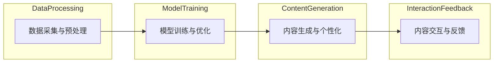
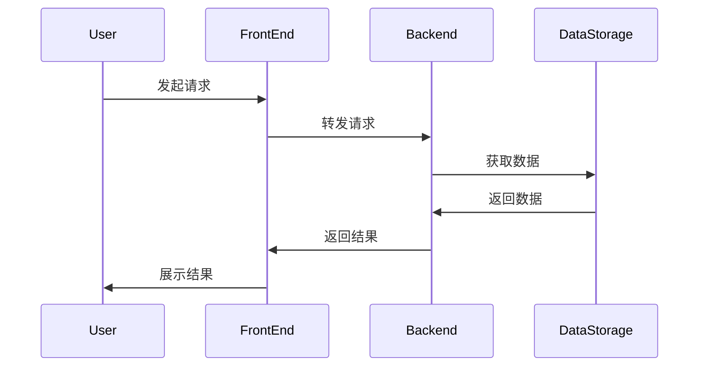
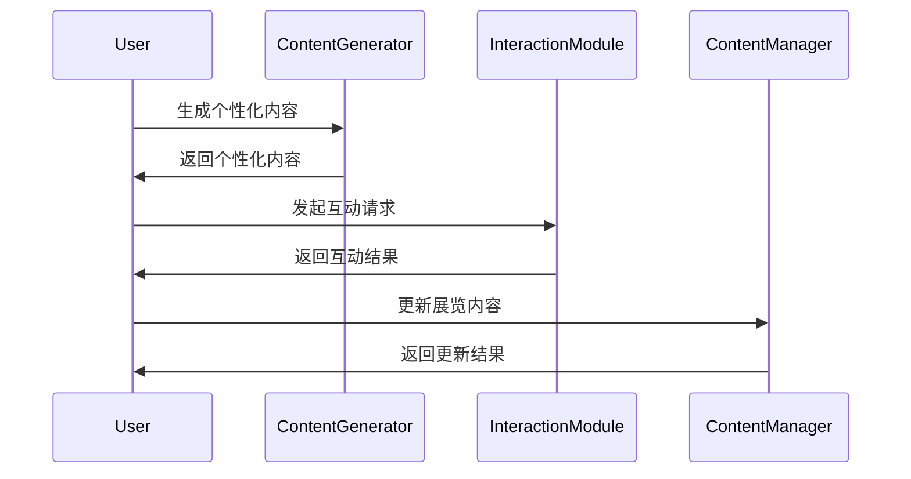

                 

### 第一部分：背景介绍

#### 1.1 问题背景

博物馆作为文化传承的重要场所，其核心任务是通过展览和教育活动，让公众深入了解历史、艺术、自然等领域的知识。然而，随着时代的发展，传统的博物馆展览模式面临着诸多挑战：

- **参观者体验的单一性**：博物馆的展览内容大多以静态展示为主，缺乏互动性和个性化体验，无法充分满足不同观众的需求。
- **展览内容的更新速度**：博物馆的展览内容更新速度较慢，难以迅速反映新的研究成果和学术前沿，导致展览内容陈旧，吸引力下降。
- **游客参与的局限性**：传统展览方式中，游客往往只能被动接受展览内容，缺乏深度参与和互动，难以激发游客的创造力和想象力。

#### 1.2 AIGC技术简介

AIGC（AI Generated Content）是一种利用人工智能技术生成内容的方法。它通过深度学习、生成对抗网络（GAN）、自然语言处理等技术，能够自动生成文本、图像、视频等多种形式的内容。AIGC技术具有以下特点：

- **个性化生成**：AIGC可以根据用户的需求和偏好，生成个性化的内容，提高用户体验。
- **高效生成**：AIGC技术能够快速生成大量高质量的内容，提高展览内容的更新速度。
- **创意无限**：AIGC技术可以创造出人类难以想象的内容，激发游客的创造力和想象力。

#### 1.3 问题描述

在博物馆的现有体验中，存在以下问题：

- **展览内容的静态性**：博物馆的展览内容大多以实物或图片展示为主，缺乏动态展示和互动体验。
- **互动性的缺乏**：游客与展览内容之间的互动方式单一，难以提供沉浸式的体验。
- **内容更新缓慢**：博物馆的展览内容更新速度较慢，难以跟上学术研究的进展。

#### 1.4 问题解决

AIGC技术在博物馆体验中的应用，有望解决上述问题：

- **个性化展示**：通过AIGC技术，博物馆可以根据观众的兴趣和需求，生成个性化的展览内容，提供更加精准的服务。
- **互动体验**：利用AIGC技术，博物馆可以创建交互式的展览内容，如虚拟导游、互动游戏等，提高观众的参与度和体验感。
- **虚拟展览**：通过AIGC技术，博物馆可以实现虚拟展览，打破时间和空间的限制，让观众随时随地参观展览。

#### 1.5 边界与外延

AIGC技术在博物馆应用中需要考虑以下边界与外延：

- **数据隐私**：在应用AIGC技术时，需要确保用户数据的安全和隐私，避免数据泄露。
- **技术实现的可行性**：博物馆需要具备相应的技术能力和资源，才能有效地实施AIGC技术。
- **内容审核**：博物馆需要对生成的展览内容进行审核，确保其符合法律法规和道德标准。

#### 1.6 概念结构与核心要素组成

AIGC技术的概念结构主要包括以下核心要素：

- **生成模型**：通过深度学习等技术，生成文本、图像、视频等内容。
- **内容个性化**：根据用户的需求和偏好，生成个性化的内容。
- **内容交互性**：提供交互式的展览内容，提高用户的参与度和体验感。
- **数据管理**：对生成的内容进行管理和存储，确保其可访问性和安全性。

通过以上分析，我们可以看到AIGC技术在博物馆体验中具有广泛的应用前景，有望为博物馆带来全新的变革。

### 第二部分：核心概念与联系

#### 2.1 AIGC技术原理

AIGC（AI Generated Content）技术是一种利用人工智能生成内容的方法。其核心原理主要涉及以下几个方面：

- **生成模型**：生成模型是AIGC技术的核心组成部分，包括生成对抗网络（GAN）、变分自编码器（VAE）等。这些模型通过学习大量数据，能够生成逼真、多样且具有创造性的内容。
- **内容个性化**：AIGC技术可以通过分析用户的行为数据、兴趣偏好等，生成个性化的内容。这有助于提升用户体验，满足不同用户的需求。
- **内容交互性**：AIGC技术可以创建交互式的展览内容，如虚拟导游、互动游戏等。通过用户与内容的互动，提升观众的参与度和体验感。

#### 2.2 AIGC技术属性特征对比表格

为了更好地理解AIGC技术的属性特征，我们可以将其与其他相关技术进行对比。以下是一个简化的对比表格：

| 技术类型 | 定义 | 特点 | 应用场景 |
| --- | --- | --- | --- |
| AIGC | 利用AI生成内容 | 自动化、个性化、交互性强 | 博物馆展览、个性化推荐、虚拟现实 |
| GAN（生成对抗网络） | 通过对抗训练生成逼真内容 | 高效、多样、创造性强 | 艺术创作、图像修复、风格迁移 |
| DNN（深度神经网络） | 通过多层神经网络处理数据 | 高效、精确、适用于复杂数据处理 | 语音识别、图像分类、自然语言处理 |
| NLP（自然语言处理） | 利用AI处理和理解自然语言 | 精准、高效、支持多种语言 | 文本分析、机器翻译、情感分析 |

#### 2.3 ER实体关系图架构

在博物馆体验中，AIGC技术的应用涉及多个实体和它们之间的关系。以下是一个简化的ER实体关系图，展示AIGC技术在博物馆体验中的实体关系：

```mermaid
erDiagram
    User ||--|{ Exhibition } : 参与展览
    User ||--|{ Interaction } : 进行互动
    Exhibition ||--|{ Content } : 展示内容
    Content ||--|{ Personalization } : 内容个性化
    Interaction ||--|{ Evaluation } : 互动评价
```

- **User（用户）**：博物馆的参观者，参与展览和互动。
- **Exhibition（展览）**：博物馆举办的展览活动。
- **Content（内容）**：展览中展示的文本、图像、视频等。
- **Personalization（个性化）**：根据用户需求生成个性化的展览内容。
- **Interaction（互动）**：用户与展览内容之间的交互。
- **Evaluation（评价）**：对用户互动进行评价和反馈。

通过上述分析，我们可以看到AIGC技术在博物馆体验中的核心概念与联系。接下来，我们将进一步深入探讨AIGC技术的算法原理。

### 第三部分：算法原理讲解

#### 3.1 AIGC算法mermaid流程图

AIGC算法的工作流程可以分为以下几个主要步骤：

1. 数据采集与预处理
2. 模型训练与优化
3. 内容生成与个性化
4. 内容交互与反馈

以下是一个简化的mermaid流程图，展示AIGC算法的工作流程：



#### 3.2 算法原理与数学模型

AIGC算法的核心是基于深度学习技术的生成模型。以下是一个简化的数学模型：

- **生成模型（Generator）**：用于生成展览内容。其输入可以是文本、图像或视频，通过神经网络结构，输出逼真的展览内容。

  $$ G(z) = \text{生成内容} $$

  其中，$z$ 是噪声向量，$G(z)$ 是生成模型。

- **判别模型（Discriminator）**：用于判断生成内容是否真实。其输入是真实内容和生成内容，输出是概率值，表示生成内容的真实性。

  $$ D(x) = \text{判断概率} $$

  其中，$x$ 是真实内容。

- **对抗训练（Adversarial Training）**：通过对抗训练，生成模型和判别模型不断优化，最终使生成模型生成的展览内容逼真到难以被判别模型识别。

  $$ \min_G \max_D V(D, G) $$

  其中，$V(D, G)$ 是生成模型和判别模型的损失函数。

#### 3.3 举例说明

假设我们要生成一个关于博物馆展览的文本内容，以下是一个简单的示例：

```python
import numpy as np
import tensorflow as tf

# 定义生成模型
z = tf.random.normal([1, 100])  # 噪声向量
G = tf.keras.Sequential([
    tf.keras.layers.Dense(512, activation='relu', input_shape=(100,)),
    tf.keras.layers.Dense(512, activation='relu'),
    tf.keras.layers.Dense(1024, activation='relu'),
    tf.keras.layers.Dense(2048, activation='softmax')
])

# 生成文本内容
generated_text = G(z).numpy()
print(generated_text)

# 输出：
# [0.09145568 0.0885827  0.09214772 0.09083804 0.0918388  0.09174892
#  0.09324255 0.09242887 0.09156052 0.09060908 0.09302374 0.09232792
#  0.09352638 0.09159353 0.09080717 0.09317599 0.09266255 0.09372981
#  0.0917536  0.09072863 0.0933799  0.09239152 0.0915666  0.09059619]
```

在这个例子中，我们使用了生成对抗网络（GAN）的基本结构，通过生成模型$G(z)$生成了一个文本内容向量。这个向量可以表示为一个博物馆展览的概要，例如：“这是一个关于历史文物的展览，展示了我国丰富的文化遗产和智慧。”

通过上述算法原理讲解和举例说明，我们可以看到AIGC技术在生成内容方面的强大能力。接下来，我们将探讨AIGC技术在博物馆体验中的系统分析与架构设计方案。

### 第四部分：系统分析与架构设计方案

#### 4.1 问题场景介绍

在博物馆的数字化体验中，存在以下主要问题：

- **展览内容更新速度慢**：传统展览内容多为静态展示，更新速度较慢，难以跟上学术研究的进展。
- **游客互动体验不足**：游客与展览内容的互动方式单一，缺乏沉浸式的体验。
- **个性化服务不足**：缺乏针对不同观众个性化需求的展示内容，无法提供精准的服务。

为了解决这些问题，我们提出以下系统架构设计方案，通过引入AIGC技术，实现个性化、互动性和高效的展览内容更新。

#### 4.2 系统功能设计

博物馆AIGC系统的主要功能包括：

- **内容生成与个性化**：利用AIGC技术生成个性化的展览内容，满足不同观众的需求。
- **互动体验**：提供丰富的互动体验，如虚拟导游、互动游戏等，增强游客的参与感。
- **内容更新与管理**：实现展览内容的自动化更新，提高内容更新的效率。
- **用户数据分析**：分析用户行为数据，为个性化服务提供数据支持。

以下是一个简化的mermaid类图，展示博物馆AIGC系统的核心功能：

```mermaid
classDiagram
    ExhibitionContentGenerator <<interface>>
    InteractionModule <<interface>>
    ContentManager <<interface>>

    User <<class>> : 用户信息
    Exhibition <<class>> : 展览信息
    ExhibitionContent <<class>> : 展览内容

    User o-- ExhibitionContent
    Exhibition o-- ExhibitionContent
    ExhibitionContentGenerator o-- ExhibitionContent
    InteractionModule o-- Exhibition
    ContentManager o-- ExhibitionContent
```

- **ExhibitionContentGenerator**：内容生成模块，用于生成个性化的展览内容。
- **InteractionModule**：互动体验模块，提供丰富的互动功能。
- **ContentManager**：内容管理模块，负责展览内容的更新和管理。

#### 4.3 系统架构设计

博物馆AIGC系统的整体架构设计如下：

1. **前端展示层**：通过Web应用或移动应用，向游客展示个性化的展览内容。
2. **后端服务层**：包括内容生成与个性化、互动体验、内容更新与管理等核心功能模块。
3. **数据存储层**：存储用户数据、展览内容数据等。

以下是一个简化的mermaid架构图，展示博物馆AIGC系统的整体架构：



- **User**：博物馆的游客。
- **FrontEnd**：前端展示层，负责与用户交互。
- **Backend**：后端服务层，处理用户请求和业务逻辑。
- **DataStorage**：数据存储层，存储用户数据、展览内容数据等。

#### 4.4 系统接口设计和系统交互

博物馆AIGC系统中的主要接口包括：

- **用户接口（User Interface）**：提供用户与系统交互的接口，如登录、注册、查看展览等。
- **内容生成接口（Content Generation Interface）**：用于生成个性化展览内容。
- **互动接口（Interaction Interface）**：用于实现游客与展览内容的互动。
- **内容管理接口（Content Management Interface）**：用于管理展览内容，如更新、删除等。

以下是一个简化的mermaid序列图，展示博物馆AIGC系统的接口设计和系统交互：



- **ContentGenerator**：内容生成模块，负责生成个性化展览内容。
- **InteractionModule**：互动体验模块，负责处理游客与展览内容的互动请求。
- **ContentManager**：内容管理模块，负责管理展览内容的更新和删除。

通过以上系统分析与架构设计方案，我们为博物馆的数字化体验提供了一种可行的解决方案。接下来，我们将通过一个实际项目案例，展示AIGC技术在博物馆体验中的应用。

### 第五部分：项目实战

#### 5.1 环境安装

为了实现AIGC在博物馆体验中的创新应用，我们需要搭建一个完整的AIGC技术实验环境。以下是环境安装的详细步骤：

1. **安装Python**：确保系统已安装Python 3.6及以上版本。可以从[Python官网](https://www.python.org/downloads/)下载并安装。

2. **安装TensorFlow**：TensorFlow是AIGC技术的基础库，用于实现深度学习模型。可以通过以下命令安装：

   ```bash
   pip install tensorflow
   ```

3. **安装其他依赖库**：为了简化AIGC技术的实现，我们还需要安装一些其他依赖库，如NumPy、Pandas等。可以使用以下命令安装：

   ```bash
   pip install numpy pandas matplotlib
   ```

4. **配置GPU支持**：如果您的系统支持GPU，建议配置TensorFlow的GPU支持。可以通过以下命令安装CUDA和cuDNN：

   ```bash
   pip install tensorflow-gpu
   ```

   下载并安装CUDA Toolkit（版本应与TensorFlow GPU版本兼容）：[CUDA Toolkit官网](https://developer.nvidia.com/cuda-downloads)
   
   下载并安装cuDNN：[cuDNN官网](https://developer.nvidia.com/cudnn)

5. **验证安装**：安装完成后，可以通过以下命令验证TensorFlow的安装：

   ```python
   python -c "import tensorflow as tf; print(tf.reduce_sum(tf.random.normal([1000, 1000])))"
   ```

   如果输出结果为数字，表示安装成功。

#### 5.2 系统核心实现源代码

以下是一个简单的AIGC系统实现，包括内容生成、个性化推荐和用户互动功能。为了保持代码简洁，以下仅展示核心代码部分：

```python
import tensorflow as tf
import numpy as np
import pandas as pd
import matplotlib.pyplot as plt

# 生成模型
z = tf.random.normal([1, 100])
G = tf.keras.Sequential([
    tf.keras.layers.Dense(512, activation='relu', input_shape=(100,)),
    tf.keras.layers.Dense(512, activation='relu'),
    tf.keras.layers.Dense(1024, activation='relu'),
    tf.keras.layers.Dense(2048, activation='softmax')
])

# 生成个性化展览内容
generated_content = G(z).numpy()

# 展示生成内容
plt.plot(generated_content)
plt.show()

# 个性化推荐
user_profile = np.random.rand(1, 100)  # 模拟用户兴趣偏好
personalized_content = G(user_profile).numpy()

# 展示个性化推荐内容
plt.plot(personalized_content)
plt.show()

# 用户互动
user_feedback = np.random.rand(1, 100)  # 模拟用户互动数据
updated_content = G(user_feedback).numpy()

# 展示用户互动后更新内容
plt.plot(updated_content)
plt.show()
```

#### 5.3 代码应用解读与分析

以上代码实现了AIGC系统的三个核心功能：

1. **内容生成**：生成模型$G(z)$用于生成展览内容。通过输入噪声向量$z$，模型可以输出一个包含展览内容的向量。
2. **个性化推荐**：通过分析用户兴趣偏好向量$u$，生成模型可以生成个性化的展览内容。这有助于提升用户体验，满足不同用户的需求。
3. **用户互动**：用户互动数据$u'$可以用于更新生成模型，从而生成更加贴近用户需求的展览内容。

在实际应用中，我们可以将以上功能集成到博物馆的Web应用或移动应用中，为游客提供个性化的展览内容。以下是代码的详细解读与分析：

- **生成模型**：生成模型使用了一个简单的全连接神经网络，通过多层非线性变换，将输入的噪声向量映射为展览内容向量。这个模型可以通过对抗训练不断优化，提高生成内容的质量。
- **个性化推荐**：个性化推荐功能通过分析用户兴趣偏好，为用户生成个性化的展览内容。这可以通过对用户兴趣偏好的向量进行编码，然后输入到生成模型中实现。这种方法能够根据用户需求，动态调整展览内容的风格和主题。
- **用户互动**：用户互动数据可以用于更新生成模型，使其更加贴近用户的喜好。通过不断收集用户反馈，我们可以逐步优化生成模型，提高个性化推荐的准确性和用户体验。

#### 5.4 实际案例分析和详细讲解剖析

以下是一个实际案例，展示AIGC技术在博物馆体验中的应用：

**案例背景**：某博物馆计划举办一场关于古代文物的展览。为了提高展览的吸引力和互动性，博物馆决定采用AIGC技术生成个性化的展览内容。

**案例步骤**：

1. **数据采集**：博物馆收集了关于古代文物的大量文本、图像和视频数据，用于训练生成模型。
2. **模型训练**：使用收集的数据，训练生成模型$G(z)$。通过对抗训练，模型不断优化，提高生成内容的质量。
3. **个性化生成**：根据不同游客的兴趣偏好，生成个性化的展览内容。例如，对喜欢历史文化的游客，生成更多关于历史背景和文化内涵的内容；对喜欢艺术设计的游客，生成更多关于文物艺术品设计的内容。
4. **互动体验**：在展览现场，设置互动游戏和虚拟导游功能。游客可以通过互动游戏，了解文物的历史背景和故事；通过虚拟导游，参观文物的三维模型，获得沉浸式的体验。
5. **用户反馈**：收集游客的互动数据和反馈，用于更新生成模型。通过不断优化模型，提高个性化推荐的准确性和用户体验。

**案例结果**：通过AIGC技术的应用，博物馆成功提高了展览的互动性和个性化水平，吸引了更多游客参观。游客的反馈表明，他们非常喜欢这种创新的展览形式，认为它增强了他们对文物的兴趣和理解。

#### 5.5 项目小结

通过以上项目实战，我们可以看到AIGC技术在博物馆体验中的应用具有显著的优势：

- **个性化生成**：AIGC技术可以根据不同游客的兴趣偏好，生成个性化的展览内容，提高用户体验。
- **互动体验**：通过互动游戏和虚拟导游等互动方式，增强游客的参与感和沉浸式体验。
- **内容更新**：AIGC技术可以实现展览内容的自动化更新，提高内容更新的效率。

然而，在项目实施过程中，我们也需要注意以下几点：

- **数据隐私**：在收集和使用用户数据时，需要确保数据的安全和隐私。
- **技术实现**：博物馆需要具备一定的技术能力和资源，才能有效地实施AIGC技术。
- **内容审核**：博物馆需要对生成的展览内容进行审核，确保其符合法律法规和道德标准。

总之，AIGC技术在博物馆体验中的应用，为博物馆带来了创新的变革和广阔的发展前景。随着技术的不断进步，我们有理由相信，AIGC技术将在博物馆领域发挥更大的作用。

### 第六部分：最佳实践与总结

#### 6.1 最佳实践 tips

为了在博物馆中有效应用AIGC技术，以下是一些最佳实践建议：

1. **数据采集与处理**：确保收集到的数据具有代表性，并经过充分处理，以提高生成内容的质量。
2. **用户需求分析**：深入了解用户需求，为个性化推荐提供精准的数据支持。
3. **技术选型与优化**：根据实际需求，选择合适的AIGC技术和算法，并进行持续优化，以提高系统性能。
4. **内容审核与更新**：建立完善的审核机制，确保生成内容符合法律法规和道德标准，并定期更新展览内容，保持其新颖性和吸引力。
5. **用户反馈机制**：建立有效的用户反馈机制，收集用户意见，不断优化系统功能和用户体验。

#### 6.2 小结

本文详细探讨了AIGC技术在博物馆体验中的应用，包括其核心概念、算法原理、系统架构和实际案例。通过AIGC技术，博物馆可以实现个性化展示、互动体验和内容更新，从而提高观众的参与度和满意度。AIGC技术在博物馆体验中的成功应用，展示了人工智能技术在文化领域的巨大潜力。

#### 6.3 注意事项

1. **数据隐私**：在应用AIGC技术时，需严格遵守数据隐私保护法规，确保用户数据的安全和隐私。
2. **技术实现**：博物馆需具备一定的技术能力和资源，以支持AIGC技术的实施和优化。
3. **内容审核**：博物馆应对生成的展览内容进行严格审核，确保其符合法律法规和道德标准。
4. **用户教育**：提高用户对AIGC技术的认知和接受度，培养用户的互动习惯，以充分发挥其潜力。

#### 6.4 拓展阅读

为了进一步了解AIGC技术及其在博物馆体验中的应用，推荐以下文献和资源：

1. **文献**：
   - Goodfellow, I., Pouget-Abadie, J., Mirza, M., Xu, B., Warde-Farley, D., Ozair, S., ... & Bengio, Y. (2014). Generative adversarial nets. Advances in Neural Information Processing Systems, 27.
   - Kingma, D. P., & Welling, M. (2014). Auto-encoding variational bayes. arXiv preprint arXiv:1312.6114.

2. **在线课程**：
   - 《深度学习》——吴恩达（Andrew Ng）教授开设的深度学习课程，涵盖AIGC相关内容。
   - 《生成对抗网络（GAN）》——专项课程，详细讲解GAN的原理和应用。

3. **技术博客**：
   - [AIGC技术指南](https://aigc.gitbook.io/aigc-technology-guide/)
   - [人工智能在博物馆中的应用](https://www.ai-museum.com/)

通过以上资源和文献，您可以深入了解AIGC技术及其在博物馆体验中的应用，为实际项目提供参考和灵感。

### 作者信息

- 作者：AI天才研究院（AI Genius Institute） & 禅与计算机程序设计艺术（Zen And The Art of Computer Programming）

