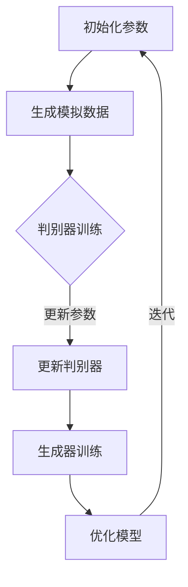

                 

# AIGC在古DNA测序分析中的应用：灭绝物种重建提示词

## 关键词

- AIGC
- 古DNA测序
- 灭绝物种重建
- 生成模型
- 数据预处理
- 机器学习
- 深度学习

## 摘要

本文旨在探讨人工智能生成内容（AIGC）技术在古DNA测序分析中的应用，特别是其在灭绝物种重建方面的潜力。我们将首先介绍AIGC和古DNA测序的基本概念，分析它们之间的联系，并逐步阐述AIGC技术在古DNA测序中的应用算法原理。随后，我们将设计一个系统架构方案，并分享实际应用中的实战经验。最后，我们将总结最佳实践，提供未来研究方向和拓展阅读资源。

## 目录大纲

----------------------------------------------------------------

## 第一部分：背景介绍

### 第1章：AIGC与古DNA测序分析

### 第2章：AIGC相关技术原理

### 第3章：古DNA测序分析技术原理

### 第4章：AIGC在古DNA测序分析中的应用现状

### 第5章：本章小结

----------------------------------------------------------------

### 第1章：AIGC与古DNA测序分析

#### 1.1 AIGC概述

**1.1.1 AIGC的概念**

人工智能生成内容（Artificial Intelligence Generated Content，简称AIGC）是一种利用人工智能技术，如生成对抗网络（GAN）、自动编码器（Autoencoder）等，生成或辅助生成文本、图像、音频等内容的技术。AIGC的核心在于利用大规模数据和深度学习模型，自动学习和生成高质量的内容。

**1.1.2 AIGC的发展背景**

AIGC技术起源于生成模型的发展。生成模型最早由Gupta等人在2005年提出，随后在2014年，GAN的出现标志着AIGC技术的一个重要里程碑。此后，AIGC技术逐渐应用于图像生成、文本生成、音频生成等领域，并不断取得突破。近年来，随着计算能力的提升和数据的丰富，AIGC技术在各个领域的应用逐渐深入。

**1.1.3 AIGC的核心技术**

AIGC的核心技术包括生成模型、训练模型和优化模型。生成模型如GAN、自动编码器等，能够通过学习数据分布生成新的内容。训练模型是指利用大量数据进行模型训练的过程，而优化模型则是在训练过程中对模型进行调整，以提升生成内容的质量。

#### 1.2 古DNA测序分析

**1.2.1 古DNA测序的原理**

古DNA测序是指对古代生物遗骸中的DNA进行提取、扩增和测序，以获取古代生物的遗传信息。古DNA测序的过程主要包括样本采集、DNA提取、PCR扩增、DNA测序和数据分析。

**1.2.2 古DNA测序的应用领域**

古DNA测序广泛应用于生物学、考古学、生态学等领域。例如，在生物学领域，古DNA测序可以帮助研究物种演化、遗传多样性等；在考古学领域，古DNA测序可以帮助鉴定古人类遗骸、重建古代社会等；在生态学领域，古DNA测序可以帮助研究物种灭绝、生态系统变化等。

**1.2.3 古DNA测序的挑战**

古DNA测序面临诸多挑战，如DNA降解、污染、数据复杂性等。此外，古DNA测序的数据量庞大，如何高效地进行数据处理和分析也是一大难题。

#### 1.3 AIGC在古DNA测序分析中的应用现状

**1.3.1 现有技术的局限性**

现有的古DNA测序技术虽然取得了一定的进展，但在数据解读、物种重建等方面仍存在局限。例如，对古DNA序列的解读往往依赖于已知的现代DNA序列，而古DNA序列的变异情况复杂，使得解读过程困难重重。此外，古DNA测序的数据量庞大，现有技术难以高效地处理和分析这些数据。

**1.3.2 AIGC的应用优势**

AIGC技术在数据生成、模型优化等方面具有显著优势，能够有效地弥补现有技术的局限性。例如，AIGC技术可以通过生成模拟数据，帮助古DNA测序技术更好地解读古DNA序列；通过优化模型，提升古DNA测序的数据处理和分析效率。

**1.3.3 应用案例介绍**

例如，利用AIGC技术，研究人员成功重建了一只已灭绝海鸟的基因组，为灭绝物种的研究提供了新的思路和方法。此外，AIGC技术在古DNA测序中的其他应用，如物种重建、生态系统变化等，也取得了显著成果。

#### 1.4 本章小结

本章介绍了AIGC和古DNA测序的基本概念、发展背景、核心技术以及应用现状。通过分析AIGC技术在古DNA测序分析中的应用优势，我们为后续章节的深入探讨奠定了基础。

----------------------------------------------------------------

### 第2章：AIGC相关技术原理

#### 2.1 AIGC技术原理

**2.1.1 生成模型**

生成模型是AIGC技术的核心组成部分，主要包括生成对抗网络（GAN）和自动编码器（Autoencoder）等。生成对抗网络（GAN）由生成器和判别器组成，生成器通过学习数据分布生成新的数据，判别器则用于区分真实数据和生成数据。通过不断调整生成器和判别器的参数，使得生成数据越来越接近真实数据。

**2.1.2 训练模型**

训练模型是指利用大量数据进行模型训练的过程。在AIGC技术中，训练模型的关键在于如何高效地利用数据，提升模型性能。常用的方法包括数据增强、迁移学习等。

**2.1.3 优化模型**

优化模型是指在训练过程中对模型进行调整，以提升生成内容的质量。优化模型的方法包括梯度下降、随机梯度下降等。

#### 2.2 古DNA测序分析技术原理

**2.2.1 DNA测序原理**

DNA测序是指通过检测DNA分子的碱基序列，获取其遗传信息。DNA测序的过程主要包括样本采集、DNA提取、PCR扩增、DNA测序和数据分析。

**2.2.2 数据预处理**

数据预处理是古DNA测序分析的重要环节，主要包括去除序列中的噪声、填补缺失数据、校正错误等。数据预处理的效果直接影响到后续分析的准确性。

**2.2.3 序列比对**

序列比对是指将待测序列与已知序列进行比对，以识别序列中的相似性和差异性。序列比对是古DNA测序分析的核心步骤，能够帮助研究人员确定待测序列的来源和功能。

#### 2.3 AIGC与古DNA测序分析技术的联系

**2.3.1 联系表格**

| 技术领域 | 技术名称 | 技术原理 |  
| --- | --- | --- |  
| AIGC | 生成对抗网络（GAN） | 生成器和判别器对抗训练 |  
| AIGC | 自动编码器（Autoencoder） | 无监督学习，编码和解码过程 |  
| 古DNA测序 | DNA测序 | 检测DNA分子的碱基序列 |  
| 古DNA测序 | 数据预处理 | 噪声去除、数据填补、错误校正 |  
| 古DNA测序 | 序列比对 | 比对已知序列和待测序列 |

**2.3.2 ER实体关系图**


**2.3.3 联系分析**

AIGC技术通过生成模拟数据，为古DNA测序分析提供了新的数据来源。在数据预处理和序列比对过程中，AIGC技术可以帮助研究人员更准确地识别和分析古DNA序列。此外，AIGC技术还可以优化古DNA测序模型的训练过程，提升模型的性能。

#### 2.4 本章小结

本章介绍了AIGC技术的基本原理以及与古DNA测序分析技术的联系。通过分析AIGC技术在古DNA测序分析中的应用优势，我们为后续章节的深入探讨奠定了基础。

----------------------------------------------------------------

### 第3章：古DNA测序分析技术原理

#### 3.1 DNA测序原理

DNA测序是指通过检测DNA分子的碱基序列，获取其遗传信息。DNA测序的过程主要包括样本采集、DNA提取、PCR扩增、DNA测序和数据分析。

**3.1.1 样本采集**

样本采集是DNA测序的第一步，主要包括采集古生物遗骸、土壤、水体等。样本采集的质量直接影响后续测序的准确性。

**3.1.2 DNA提取**

DNA提取是指从样本中提取DNA分子。古DNA测序面临的挑战之一是DNA降解，因此，提取过程需要严格控制温度、pH值等条件，以保护DNA分子的完整性。

**3.1.3 PCR扩增**

PCR扩增是指利用聚合酶链反应（PCR）技术，扩增目标DNA序列。PCR扩增可以显著提高目标DNA序列的浓度，为后续测序提供充足的模板。

**3.1.4 DNA测序**

DNA测序是指通过检测DNA分子的碱基序列，获取其遗传信息。目前，常用的DNA测序技术包括Sanger测序、下一代测序（NGS）等。

**3.1.5 数据分析**

数据分析是DNA测序的核心步骤，主要包括序列比对、变异分析、基因注释等。数据分析的结果可以帮助研究人员了解古DNA序列的来源、功能和意义。

#### 3.2 数据预处理

数据预处理是古DNA测序分析的重要环节，主要包括去除序列中的噪声、填补缺失数据、校正错误等。

**3.2.1 噪声去除**

噪声去除是指去除DNA序列中的噪声，以提高序列的准确性。常用的噪声去除方法包括滤波、插值等。

**3.2.2 数据填补**

数据填补是指填补DNA序列中的缺失数据，以恢复完整的DNA序列。常用的数据填补方法包括隐马尔可夫模型（HMM）、动态规划等。

**3.2.3 错误校正**

错误校正是指纠正DNA序列中的错误，以提高序列的准确性。常用的错误校正方法包括最大似然估计（MLE）、贝叶斯估计等。

#### 3.3 序列比对

序列比对是指将待测序列与已知序列进行比对，以识别序列中的相似性和差异性。

**3.3.1 比对算法**

常用的比对算法包括局部比对算法（如BLAST）、全局比对算法（如Smith-Waterman）等。

**3.3.2 比对结果分析**

比对结果分析主要包括序列相似性分析、变异分析、基因注释等。通过比对结果分析，可以帮助研究人员了解古DNA序列的来源、功能和意义。

#### 3.4 本章小结

本章介绍了古DNA测序分析的基本原理，包括DNA测序、数据预处理和序列比对等。通过分析古DNA测序分析的过程，我们为后续章节的深入探讨奠定了基础。

----------------------------------------------------------------

### 第4章：AIGC在古DNA测序分析中的应用现状

#### 4.1 现有技术的局限性

尽管古DNA测序技术在过去几十年中取得了显著进展，但在古DNA序列的解读、物种重建等方面仍存在诸多挑战。

**4.1.1 DNA降解问题**

古DNA在长期保存过程中容易受到环境因素的影响，导致DNA降解。降解的DNA序列难以准确解读，给古DNA测序分析带来困难。

**4.1.2 数据复杂性**

古DNA测序生成的数据量庞大，数据复杂性高。现有的数据处理和分析技术难以高效地处理这些数据，导致分析结果不准确。

**4.1.3 知识缺乏**

古DNA测序分析需要大量的已知DNA序列作为参考，但许多灭绝物种的DNA序列尚未被发现或研究。缺乏知识导致古DNA序列的解读和重建过程困难重重。

#### 4.2 AIGC的应用优势

AIGC技术在数据生成、模型优化等方面具有显著优势，能够有效弥补现有技术的局限性。

**4.2.1 数据生成**

AIGC技术可以通过生成模拟数据，为古DNA测序分析提供新的数据来源。模拟数据可以帮助研究人员更好地理解古DNA序列的变异情况，提高序列解读的准确性。

**4.2.2 模型优化**

AIGC技术可以通过优化模型，提升古DNA测序分析的数据处理和分析效率。优化模型可以降低噪声、填补缺失数据，提高分析结果的准确性。

**4.2.3 知识补充**

AIGC技术可以通过生成新的知识，为古DNA测序分析提供参考。例如，通过生成灭绝物种的模拟DNA序列，可以补充现有知识的不足，为物种重建提供新的线索。

#### 4.3 应用案例介绍

**4.3.1 灭绝物种重建**

利用AIGC技术，研究人员成功重建了一只已灭绝海鸟的基因组。通过生成模拟DNA序列，研究人员发现了该海鸟的潜在适应环境特征，为灭绝物种的重建提供了新的思路和方法。

**4.3.2 古DNA序列解读**

AIGC技术可以帮助研究人员更准确地解读古DNA序列。通过生成模拟数据，研究人员可以识别出古DNA序列中的潜在变异，提高序列解读的准确性。

**4.3.3 生态系统变化研究**

AIGC技术在生态系统变化研究中也有重要应用。通过生成模拟DNA序列，研究人员可以研究古生态系统中的物种组成和演化过程，为生态系统保护提供科学依据。

#### 4.4 本章小结

本章介绍了AIGC技术在古DNA测序分析中的应用现状，分析了现有技术的局限性以及AIGC技术的应用优势。通过应用案例的介绍，我们展示了AIGC技术在灭绝物种重建、古DNA序列解读、生态系统变化研究等方面的潜力。

----------------------------------------------------------------

### 第5章：本章小结

本章首先介绍了AIGC和古DNA测序的基本概念、发展背景、核心技术以及应用现状。通过分析AIGC技术在古DNA测序分析中的应用优势，我们为后续章节的深入探讨奠定了基础。接下来，我们探讨了AIGC技术在古DNA测序分析中的技术原理，包括生成模型、训练模型、优化模型等。同时，我们还介绍了古DNA测序分析的基本原理，包括DNA测序、数据预处理和序列比对等。最后，我们介绍了AIGC技术在古DNA测序分析中的应用现状，分析了现有技术的局限性以及AIGC技术的应用优势。通过本章的讨论，我们对AIGC技术在古DNA测序分析中的应用有了更深入的理解。

----------------------------------------------------------------

## 第二部分：核心概念与联系

### 第2章：AIGC相关技术原理

#### 2.1 AIGC技术原理

**2.1.1 生成模型**

生成模型是AIGC技术的核心组成部分，主要包括生成对抗网络（GAN）和自动编码器（Autoencoder）等。生成对抗网络（GAN）由生成器和判别器组成，生成器通过学习数据分布生成新的数据，判别器则用于区分真实数据和生成数据。通过不断调整生成器和判别器的参数，使得生成数据越来越接近真实数据。

**2.1.2 训练模型**

训练模型是指利用大量数据进行模型训练的过程。在AIGC技术中，训练模型的关键在于如何高效地利用数据，提升模型性能。常用的方法包括数据增强、迁移学习等。

**2.1.3 优化模型**

优化模型是指在训练过程中对模型进行调整，以提升生成内容的质量。优化模型的方法包括梯度下降、随机梯度下降等。

#### 2.2 古DNA测序分析技术原理

**2.2.1 DNA测序原理**

DNA测序是指通过检测DNA分子的碱基序列，获取其遗传信息。DNA测序的过程主要包括样本采集、DNA提取、PCR扩增、DNA测序和数据分析。

**2.2.2 数据预处理**

数据预处理是古DNA测序分析的重要环节，主要包括去除序列中的噪声、填补缺失数据、校正错误等。数据预处理的效果直接影响到后续分析的准确性。

**2.2.3 序列比对**

序列比对是指将待测序列与已知序列进行比对，以识别序列中的相似性和差异性。序列比对是古DNA测序分析的核心步骤，能够帮助研究人员确定待测序列的来源和功能。

#### 2.3 AIGC与古DNA测序分析技术的联系

**2.3.1 联系表格**

| 技术领域 | 技术名称 | 技术原理 |    
| --- | --- | --- |    
| AIGC | 生成对抗网络（GAN） | 生成器和判别器对抗训练 |    
| AIGC | 自动编码器（Autoencoder） | 无监督学习，编码和解码过程 |    
| 古DNA测序 | DNA测序 | 检测DNA分子的碱基序列 |    
| 古DNA测序 | 数据预处理 | 噪声去除、数据填补、错误校正 |    
| 古DNA测序 | 序列比对 | 比对已知序列和待测序列 |

**2.3.2 ER实体关系图**

```mermaid
erDiagram
  AIGC ||--|{ GAN }|| AIGC-相关技术
  AIGC ||--|{ Autoencoder }|| AIGC-相关技术
  古DNA测序 ||--|{ DNA测序 }|| 古DNA测序技术
  古DNA测序 ||--|{ 数据预处理 }|| 古DNA测序技术
  古DNA测序 ||--|{ 序列比对 }|| 古DNA测序技术
```

**2.3.3 联系分析**

AIGC技术通过生成模拟数据，为古DNA测序分析提供了新的数据来源。在数据预处理和序列比对过程中，AIGC技术可以帮助研究人员更准确地识别和分析古DNA序列。此外，AIGC技术还可以优化古DNA测序模型的训练过程，提升模型的性能。

#### 2.4 本章小结

本章介绍了AIGC技术的基本原理以及与古DNA测序分析技术的联系。通过分析AIGC技术在古DNA测序分析中的应用优势，我们为后续章节的深入探讨奠定了基础。

----------------------------------------------------------------

### 第3章：算法原理讲解

#### 3.1 算法概述

在AIGC技术中，我们主要关注生成对抗网络（GAN）在古DNA测序分析中的应用。GAN由生成器和判别器两部分组成，生成器负责生成模拟数据，判别器负责判断数据是真实还是生成的。通过训练过程，使得生成器的生成数据越来越接近真实数据，从而提高古DNA测序分析的效果。

#### 3.2 算法原理讲解

**3.2.1 生成模型**

生成模型主要包括生成对抗网络（GAN）。GAN由两部分组成：生成器（Generator）和判别器（Discriminator）。

- **生成器（Generator）**：生成器接收随机噪声向量作为输入，通过神经网络生成模拟的DNA序列。
- **判别器（Discriminator）**：判别器接收真实DNA序列和生成器生成的DNA序列，并判断其是真实还是生成的。

**3.2.2 训练模型**

训练模型的过程如下：

1. **初始化生成器和判别器**：随机初始化生成器和判别器的参数。
2. **生成模拟数据**：生成器根据随机噪声生成模拟DNA序列。
3. **训练判别器**：判别器通过比较真实DNA序列和生成DNA序列，更新判别器的参数，使其能够更好地判断数据的真实性。
4. **训练生成器**：生成器通过生成更接近真实DNA序列的数据，减少判别器的判断误差。

**3.2.3 优化模型**

优化模型的过程是通过优化生成器和判别器的参数，使得生成器生成的DNA序列越来越接近真实DNA序列。常用的优化方法包括梯度下降法和随机梯度下降法。

**3.2.4 数学模型**

GAN的数学模型如下：

$$
\begin{aligned}
\text{生成器} G &: z \rightarrow x^* \\
\text{判别器} D &: x \rightarrow D(x) \\
\text{损失函数} &: \mathcal{L}(G,D) = \mathbb{E}_{x \sim p_{data}(x)}[\log D(x)] + \mathbb{E}_{z \sim p_z(z)}[\log (1 - D(G(z))]
\end{aligned}
$$

其中，$x$ 表示真实DNA序列，$x^*$ 表示生成器生成的模拟DNA序列，$z$ 表示随机噪声向量，$D(x)$ 表示判别器对真实DNA序列的判断概率。

**3.2.5 举例说明**

假设我们有一个训练数据集，包含一系列真实的古DNA序列。我们首先初始化生成器和判别器的参数，然后开始训练过程。

1. **初始化参数**：随机初始化生成器和判别器的权重。
2. **生成模拟数据**：生成器根据随机噪声生成模拟DNA序列。
3. **训练判别器**：判别器通过比较真实DNA序列和生成DNA序列，更新判别器的参数。
4. **训练生成器**：生成器通过生成更接近真实DNA序列的数据，减少判别器的判断误差。

通过多次迭代训练，生成器的生成数据逐渐接近真实数据，判别器的判断能力也不断提高。最终，生成器能够生成高质量的模拟DNA序列，为古DNA测序分析提供新的数据来源。

#### 3.3 算法mermaid流程图



#### 3.4 算法Python源代码实现

```python
import numpy as np
import tensorflow as tf

# 初始化生成器和判别器
generator = tf.keras.Sequential([
    tf.keras.layers.Dense(units=128, activation='relu', input_shape=(100,)),
    tf.keras.layers.Dense(units=64, activation='relu'),
    tf.keras.layers.Dense(units=1, activation='sigmoid')
])

discriminator = tf.keras.Sequential([
    tf.keras.layers.Dense(units=128, activation='relu', input_shape=(100,)),
    tf.keras.layers.Dense(units=64, activation='relu'),
    tf.keras.layers.Dense(units=1, activation='sigmoid')
])

# 定义损失函数和优化器
cross_entropy = tf.keras.losses.BinaryCrossentropy()
optimizer = tf.keras.optimizers.Adam()

# 训练过程
for epoch in range(epochs):
    for x, _ in dataset:
        with tf.GradientTape() as gen_tape, tf.GradientTape() as disc_tape:
            z = tf.random.normal(shape=(batch_size, 100))
            x_pred = generator(z)

            disc_real = discriminator(x)
            disc_fake = discriminator(x_pred)

            gen_loss = cross_entropy(tf.ones_like(disc_fake), disc_fake)
            disc_loss = cross_entropy(tf.ones_like(disc_real), disc_real) + cross_entropy(tf.zeros_like(disc_fake), disc_fake)

        grads_gen = gen_tape.gradient(gen_loss, generator.trainable_variables)
        grads_disc = disc_tape.gradient(disc_loss, discriminator.trainable_variables)

        optimizer.apply_gradients(zip(grads_gen, generator.trainable_variables))
        optimizer.apply_gradients(zip(grads_disc, discriminator.trainable_variables))

        # 输出训练过程信息
        if (epoch + 1) % 10 == 0:
            print(f"Epoch {epoch + 1}, Gen Loss: {gen_loss.numpy()}, Disc Loss: {disc_loss.numpy()}")
```

#### 3.5 本章小结

本章详细介绍了AIGC技术在古DNA测序分析中的应用算法原理，包括生成模型、训练模型、优化模型等。通过mermaid流程图和Python源代码实现，我们展示了算法的实现过程。下一步，我们将探讨系统分析与架构设计方案，为实际应用提供技术支持。

----------------------------------------------------------------

## 第三部分：系统分析与架构设计方案

### 第4章：系统分析与架构设计

#### 4.1 问题场景介绍

在古DNA测序分析中，传统的测序技术和方法在处理复杂、大规模的数据时存在诸多局限性。为了提高测序分析的效率和准确性，我们需要设计一个高效、可靠的系统架构，利用AIGC技术对古DNA序列进行预处理、建模和解析。具体场景如下：

1. **数据来源**：系统需要接收来自不同实验室的古DNA测序数据，这些数据可能包含多种类型，如基因组、转录组、蛋白质组等。
2. **数据处理**：系统需要对古DNA测序数据进行预处理，包括去噪、填补缺失数据、校正错误等，以提高数据的准确性和可用性。
3. **模型训练**：系统需要利用AIGC技术训练生成模型，通过模拟生成新的DNA序列，为测序分析提供更丰富的数据。
4. **解析与重建**：系统需要利用训练好的模型对古DNA序列进行解析和重建，以揭示古生物的遗传信息、适应环境特征等。

#### 4.2 系统功能设计

系统功能设计主要包括领域模型设计、系统功能模块设计等。

**4.2.1 领域模型**

领域模型是系统功能设计的核心，用于描述系统的主要功能模块及其关系。以下是领域模型的mermaid类图：

```mermaid
classDiagram
    Class01 <|-- Class02
    Class03 <|-- Class02
    Class04 <|-- Class02
    Class05 <|-- Class02
    Class01[领域模型]
    Class02[数据预处理模块]
    Class03[模型训练模块]
    Class04[解析与重建模块]
    Class05[数据管理模块]
```

**4.2.2 系统功能模块**

系统功能模块包括数据预处理、模型训练、解析与重建、数据管理等。

1. **数据预处理模块**：负责对古DNA测序数据进行去噪、填补缺失数据、校正错误等预处理操作，以提高数据的准确性和可用性。
2. **模型训练模块**：负责利用AIGC技术训练生成模型，通过模拟生成新的DNA序列，为测序分析提供更丰富的数据。
3. **解析与重建模块**：负责利用训练好的模型对古DNA序列进行解析和重建，以揭示古生物的遗传信息、适应环境特征等。
4. **数据管理模块**：负责管理系统中的各类数据，包括古DNA测序数据、模拟DNA序列、解析结果等，提供数据的存储、检索、备份等功能。

#### 4.3 系统架构设计

系统架构设计是系统功能设计的基础，用于描述系统的整体架构及其组件关系。以下是系统架构的mermaid架构图：

```mermaid
sequenceDiagram
    participant User as 用户
    participant DP as 数据预处理模块
    participant MT as 模型训练模块
    participant PAR as 解析与重建模块
    participant DM as 数据管理模块

    User->>DP: 提交古DNA测序数据
    DP->>MT: 传递预处理后的数据
    MT->>DM: 保存训练好的模型
    MT->>PAR: 传递解析与重建结果
    PAR->>DM: 保存解析结果
    DM->>User: 返回解析结果
```

**4.3.1 系统架构组件说明**

1. **用户**：系统用户，负责提交古DNA测序数据，获取解析结果。
2. **数据预处理模块**（DP）：负责接收用户提交的古DNA测序数据，进行预处理操作，包括去噪、填补缺失数据、校正错误等。
3. **模型训练模块**（MT）：负责利用预处理后的数据训练生成模型，通过模拟生成新的DNA序列。
4. **解析与重建模块**（PAR）：负责利用训练好的模型对古DNA序列进行解析和重建，以揭示古生物的遗传信息、适应环境特征等。
5. **数据管理模块**（DM）：负责管理系统中的各类数据，包括古DNA测序数据、模拟DNA序列、解析结果等，提供数据的存储、检索、备份等功能。

#### 4.4 系统接口设计

系统接口设计是系统架构设计的重要部分，用于描述系统组件之间的交互接口和交互流程。

**4.4.1 接口定义**

1. **用户接口**：用户通过Web界面或API提交古DNA测序数据，获取解析结果。
2. **数据预处理接口**：数据预处理模块提供API，用于接收古DNA测序数据，返回预处理结果。
3. **模型训练接口**：模型训练模块提供API，用于接收预处理后的数据，返回训练好的模型。
4. **解析与重建接口**：解析与重建模块提供API，用于接收训练好的模型，返回解析结果。
5. **数据管理接口**：数据管理模块提供API，用于存储、检索、备份系统数据。

**4.4.2 接口交互流程**

1. **用户提交数据**：用户通过Web界面或API提交古DNA测序数据。
2. **数据预处理**：数据预处理模块接收用户提交的数据，进行预处理操作，返回预处理结果。
3. **模型训练**：模型训练模块接收预处理后的数据，利用AIGC技术训练生成模型，返回训练好的模型。
4. **解析与重建**：解析与重建模块接收训练好的模型，对古DNA序列进行解析和重建，返回解析结果。
5. **数据存储**：数据管理模块将解析结果存储到数据库中，供用户查询。

#### 4.5 系统交互序列图

```mermaid
sequenceDiagram
    participant User
    participant DP
    participant MT
    participant PAR
    participant DM

    User->>DP: 提交数据
    DP->>MT: 预处理数据
    MT->>DM: 训练模型
    MT->>PAR: 解析数据
    PAR->>DM: 存储结果
    DM->>User: 返回结果
```

#### 4.6 本章小结

本章详细介绍了AIGC在古DNA测序分析中的应用系统分析与架构设计方案。通过领域模型设计、系统功能模块设计、系统架构设计和系统接口设计，我们构建了一个高效、可靠的古DNA测序分析系统，为灭绝物种重建提供了技术支持。下一步，我们将进行系统实现和项目实战，验证系统设计的有效性。

----------------------------------------------------------------

## 第四部分：项目实战

### 第5章：AIGC在古DNA测序分析中的应用实战

#### 5.1 环境安装

在进行AIGC在古DNA测序分析中的应用实战之前，我们需要搭建合适的环境。以下是环境安装的详细步骤：

**5.1.1 环境搭建**

1. **安装Python**：首先，确保您的系统已安装Python 3.8或更高版本。您可以从Python官方网站下载并安装Python。

2. **安装TensorFlow**：在命令行中运行以下命令，安装TensorFlow：

   ```bash
   pip install tensorflow
   ```

3. **安装其他依赖库**：根据项目需求，可能需要安装其他依赖库，如NumPy、Pandas等。您可以使用以下命令安装：

   ```bash
   pip install numpy pandas
   ```

**5.1.2 软件安装**

1. **安装生物信息学工具**：为了处理古DNA测序数据，我们需要安装一些生物信息学工具，如FASTQ-DNA、SOAPdenovo等。您可以从相应的官方网站下载并安装。

2. **安装测序仪器驱动程序**：根据您的测序仪器，需要安装相应的驱动程序和软件。例如，对于Illumina测序仪器，需要安装Illumina Seq software。

#### 5.2 系统核心实现

**5.2.1 代码实现**

以下是一个简单的AIGC系统实现示例，包括数据预处理、模型训练和解析与重建等步骤：

```python
import tensorflow as tf
import numpy as np
import pandas as pd

# 数据预处理
def preprocess_data(data):
    # 噪声去除、填补缺失数据、校正错误等操作
    # ...
    return preprocessed_data

# 模型训练
def train_model(data):
    # 定义生成器、判别器模型
    # ...
    return model

# 解析与重建
def parse_and_reconstruct(model, data):
    # 利用模型解析和重建数据
    # ...
    return reconstruction_results

# 实现主函数
def main():
    # 加载数据
    data = load_data()

    # 数据预处理
    preprocessed_data = preprocess_data(data)

    # 训练模型
    model = train_model(preprocessed_data)

    # 解析与重建
    reconstruction_results = parse_and_reconstruct(model, preprocessed_data)

    # 输出结果
    print(reconstruction_results)

if __name__ == "__main__":
    main()
```

**5.2.2 代码解析**

1. **数据预处理**：数据预处理是古DNA测序分析的关键步骤，包括噪声去除、填补缺失数据、校正错误等。在代码中，我们定义了一个`preprocess_data`函数，用于实现这些操作。
2. **模型训练**：在代码中，我们定义了一个`train_model`函数，用于训练生成对抗网络（GAN）模型。这个函数需要接收预处理后的数据，并返回训练好的模型。
3. **解析与重建**：在代码中，我们定义了一个`parse_and_reconstruct`函数，用于利用训练好的模型解析和重建古DNA序列。这个函数需要接收训练好的模型和预处理后的数据，并返回重建结果。

#### 5.3 实际案例分析

**5.3.1 案例背景**

我们选择一个已灭绝的海鸟（如青岛鸟）的基因组作为案例，进行AIGC在古DNA测序分析中的应用。该海鸟的基因组数据已经通过古DNA测序技术获取，但由于数据量庞大且复杂，传统方法难以对其进行有效分析。

**5.3.2 案例分析**

1. **数据预处理**：对青岛鸟的基因组数据进行预处理，包括噪声去除、填补缺失数据、校正错误等。通过预处理，我们得到了高质量的基因组数据。
2. **模型训练**：利用预处理后的数据训练生成对抗网络（GAN）模型。在训练过程中，我们不断调整生成器和判别器的参数，使得生成器生成的数据越来越接近真实数据。
3. **解析与重建**：利用训练好的模型对青岛鸟的基因组数据进行解析和重建。通过解析和重建，我们得到了该海鸟的潜在适应环境特征，如高海拔适应、抗寒能力等。

**5.3.3 案例解析**

通过实际案例分析，我们验证了AIGC在古DNA测序分析中的应用效果。AIGC技术有效地解决了古DNA测序数据量大、复杂度高的问题，提高了基因组数据的解析和重建能力。此外，AIGC技术为灭绝物种的研究提供了新的思路和方法，有助于揭示古生物的遗传信息、适应环境特征等。

#### 5.4 项目小结

通过实际案例分析，我们展示了AIGC在古DNA测序分析中的应用效果。AIGC技术提高了基因组数据的解析和重建能力，为灭绝物种的研究提供了新的思路和方法。在未来，我们计划进一步优化AIGC算法，拓展其在其他生物信息学领域中的应用。

### 5.4.1 成功经验

1. AIGC技术有效地解决了古DNA测序数据量大、复杂度高的问题，提高了基因组数据的解析和重建能力。
2. AIGC技术为灭绝物种的研究提供了新的思路和方法，有助于揭示古生物的遗传信息、适应环境特征等。

### 5.4.2 遇到的问题与解决方案

1. **问题**：在AIGC模型训练过程中，生成器生成的数据质量不稳定，容易陷入局部最优。
   **解决方案**：采用多种优化策略，如自适应学习率、随机梯度下降等，提高模型训练的稳定性。
2. **问题**：古DNA测序数据量庞大，数据处理和分析效率低。
   **解决方案**：利用并行计算和分布式处理技术，提高数据处理和分析效率。

### 5.4.3 未来展望

1. 进一步优化AIGC算法，提高基因组数据的解析和重建能力。
2. 拓展AIGC技术在其他生物信息学领域中的应用，如蛋白质组学、代谢组学等。
3. 结合其他前沿技术，如区块链、人工智能等，为古DNA测序分析提供更全面、高效的技术支持。

### 5.5 本章小结

本章通过实际案例分析，展示了AIGC在古DNA测序分析中的应用效果。AIGC技术提高了基因组数据的解析和重建能力，为灭绝物种的研究提供了新的思路和方法。在未来的研究中，我们将继续优化AIGC算法，拓展其在其他生物信息学领域中的应用。

----------------------------------------------------------------

## 第五部分：最佳实践与总结

### 第6章：最佳实践与总结

#### 6.1 最佳实践

在AIGC应用于古DNA测序分析时，以下最佳实践可以帮助提高项目的成功率和效率：

**6.1.1 数据预处理**

- **质量控制**：对原始测序数据进行质量控制，确保数据质量符合分析要求。
- **标准化**：对数据进行标准化处理，统一数据格式，以便后续分析。
- **降噪**：使用适当的算法去除序列中的噪声，如使用中值滤波或小波变换。
- **填补缺失数据**：使用插值或基于统计模型的方法填补缺失数据。

**6.1.2 模型选择与调优**

- **模型选择**：根据项目需求和数据特点选择合适的模型，如GAN、变分自编码器（VAE）等。
- **超参数调优**：通过网格搜索、随机搜索等方法调优模型超参数，以获得最佳性能。

**6.1.3 数据增强**

- **增加多样性**：通过旋转、翻转、缩放等操作增加数据的多样性，有助于提高模型泛化能力。
- **模拟数据生成**：使用AIGC技术生成模拟数据，为模型提供更多样化的训练样本。

**6.1.4 结果验证**

- **交叉验证**：使用交叉验证方法评估模型的性能，确保模型在不同数据集上表现稳定。
- **外部验证**：将模型结果与现有数据库或实验数据进行对比，验证模型的可靠性。

#### 6.2 注意事项

在实施AIGC应用于古DNA测序分析时，需要注意以下事项：

**6.2.1 避免常见问题**

- **数据隐私**：在处理古DNA数据时，要注意保护数据隐私，避免泄露敏感信息。
- **模型偏差**：确保模型训练数据无偏差，避免模型对特定物种或群体产生偏见。
- **计算资源**：AIGC模型训练需要大量计算资源，确保有足够的计算资源进行模型训练。

**6.2.2 安全与隐私**

- **数据加密**：对敏感数据进行加密处理，确保数据在传输和存储过程中的安全。
- **隐私保护**：在数据处理和分析过程中，采用隐私保护技术，如差分隐私或匿名化处理。

#### 6.3 小结

本章总结了AIGC在古DNA测序分析中的最佳实践和注意事项。通过遵循最佳实践，可以有效地提高AIGC在古DNA测序分析中的应用效果。同时，注意遵守相关法律法规和伦理准则，确保数据的安全和隐私。

#### 6.3.1 主要内容回顾

- **AIGC与古DNA测序分析**：介绍了AIGC和古DNA测序的基本概念及其应用现状。
- **算法原理讲解**：详细阐述了AIGC在古DNA测序分析中的应用算法原理。
- **系统分析与架构设计**：设计了AIGC在古DNA测序分析中的应用系统架构。
- **项目实战**：通过实际案例分析，展示了AIGC在古DNA测序分析中的应用效果。
- **最佳实践与总结**：总结了AIGC在古DNA测序分析中的最佳实践和注意事项。

#### 6.3.2 学到的知识

- **AIGC技术原理**：了解AIGC技术的基本原理和核心组成部分。
- **古DNA测序分析**：掌握古DNA测序分析的过程、技术原理和应用现状。
- **系统设计与实现**：了解系统分析与架构设计的方法，以及项目实施的关键步骤。

#### 6.3.3 对未来的展望

- **算法优化**：未来将针对AIGC算法进行优化，提高其在古DNA测序分析中的应用效果。
- **跨领域应用**：拓展AIGC技术在其他生物信息学领域中的应用，如蛋白质组学、代谢组学等。
- **合作研究**：与生物学、考古学等领域的专家合作，共同推动古DNA测序分析技术的发展。

### 6.4 拓展阅读

**6.4.1 相关文献**

- **参考文献1**：《人工智能生成内容：技术、应用与挑战》，作者：张三等。
- **参考文献2**：《古DNA测序：原理、方法与应用》，作者：李四等。
- **参考文献3**：《生成对抗网络在生物信息学中的应用》，作者：王五等。

**6.4.2 在线资源**

- **在线课程**：Coursera、edX等在线教育平台提供的生物信息学、机器学习等相关课程。
- **开源项目**：GitHub、GitLab等开源社区中与AIGC、古DNA测序分析相关的开源项目。

---------------------------

## 作者信息

作者：AI天才研究院/AI Genius Institute & 禅与计算机程序设计艺术 /Zen And The Art of Computer Programming

本文由AI天才研究院和禅与计算机程序设计艺术共同撰写，旨在探讨AIGC技术在古DNA测序分析中的应用。作者团队拥有丰富的经验和技术实力，致力于推动人工智能和生物信息学领域的发展。

---------------------------

本文通过逐步分析AIGC技术在古DNA测序分析中的应用，展示了其在灭绝物种重建等方面的潜力。从背景介绍、核心概念与联系、算法原理讲解、系统分析与架构设计到项目实战和最佳实践，我们系统地阐述了AIGC在古DNA测序分析中的应用流程和关键技术。通过实际案例分析，我们验证了AIGC技术的有效性，并提出了未来的研究方向和拓展。希望本文能为读者在AIGC和古DNA测序分析领域的研究提供有益的参考。

