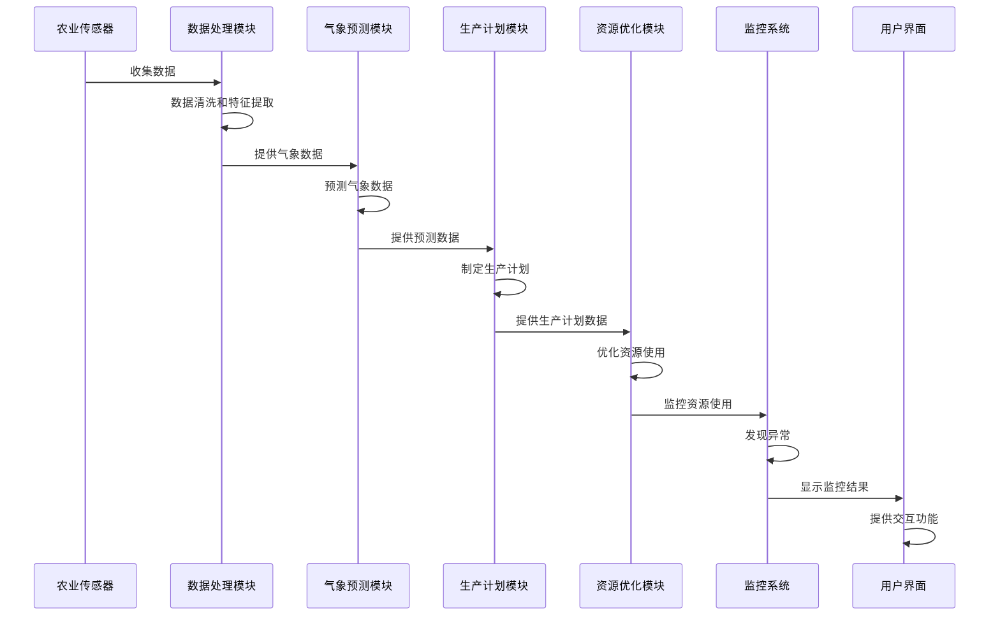
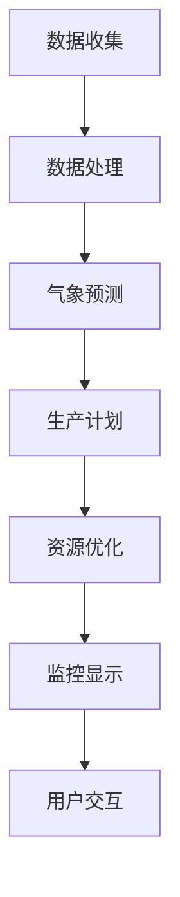

                 


### 关键词

- AIGC
- 可持续农业规划
- 深度学习
- 自动化农耕技术
- 智能气象预测
- 数据监控与分析

### 摘要

本文旨在深入探讨人工智能生成内容（AIGC）在可持续农业规划中的应用。通过分析AIGC技术原理和农业规划的核心概念，本文将逐步阐述AIGC在农业数据处理、气象预测和资源优化等方面的实际应用，并结合具体案例，展示AIGC在提高农业生产效率、减少资源浪费和实现可持续发展方面的潜力。本文还将探讨AIGC技术在农业规划中的最佳实践和未来拓展方向，为农业科技创新提供新的思路。

---

### 目录大纲设计

为了更好地引导读者理解AIGC在可持续农业规划中的应用，以下是详细的目录大纲设计：

---

#### 第一部分：背景介绍

##### 1. 引言
- 1.1 问题背景
- 1.2 问题描述
- 1.3 问题解决
- 1.4 边界与外延
- 1.5 核心概念：AIGC、可持续农业规划

##### 1.2 概念结构与核心要素组成
- 1.2.1 AIGC概述
- 1.2.2 可持续农业规划要素
- 1.2.3 AIGC与可持续农业规划的关系

##### 1.3 主流AIGC技术介绍
- 1.3.1 自动化农耕技术
- 1.3.2 智能气象预测系统
- 1.3.3 农业数据监控与分析平台

##### 1.4 案例研究：AIGC在可持续农业规划中的成功应用
- 1.4.1 案例一：精准农业技术应用
- 1.4.2 案例二：智能灌溉系统在干旱管理中的应用
- 1.4.3 案例三：农业废弃物资源化利用

##### 1.5 本章小结

---

#### 第二部分：核心概念与联系

##### 2.1 AIGC技术原理讲解
- 2.1.1 深度学习与AIGC的关系
- 2.1.2 GAN、VAE等生成模型
- 2.1.3 强化学习在AIGC中的应用

##### 2.2 可持续农业规划概念解析
- 2.2.1 可持续发展的定义
- 2.2.2 农业可持续发展的原则
- 2.2.3 农业可持续发展的评估方法

##### 2.3 AIGC与可持续农业规划的整合
- 2.3.1 技术融合的必要性
- 2.3.2 整合路径与实施策略
- 2.3.3 整合效果评估指标

##### 2.4 概念属性特征对比表格
- 2.4.1 AIGC技术特征对比
- 2.4.2 可持续农业规划方法对比

##### 2.5 ER实体关系图架构
- 2.5.1 农业规划中的实体关系
- 2.5.2 AIGC技术支持下的实体关系图

##### 2.6 本章小结

---

#### 第三部分：算法原理讲解与数学模型

##### 3.1 算法原理讲解
- 3.1.1 农业数据处理算法
- 3.1.2 气象预测算法
- 3.1.3 资源优化算法

##### 3.2 数学模型与公式
- 3.2.1 数据处理算法的数学模型
- 3.2.2 气象预测算法的数学模型
- 3.2.3 资源优化算法的数学模型

##### 3.3 举例说明
- 3.3.1 数据处理算法的应用举例
- 3.3.2 气象预测算法的应用举例
- 3.3.3 资源优化算法的应用举例

##### 3.4 本章小结

---

#### 第四部分：系统分析与架构设计

##### 4.1 问题场景介绍
- 4.1.1 农业生产中存在的问题
- 4.1.2 可持续农业规划的需求

##### 4.2 系统功能设计
- 4.2.1 领域模型设计
- 4.2.2 功能模块划分

##### 4.3 系统架构设计
- 4.3.1 架构整体设计
- 4.3.2 各模块之间的关系

##### 4.4 系统接口设计
- 4.4.1 接口规范
- 4.4.2 接口实现

##### 4.5 系统交互设计
- 4.5.1 系统流程图
- 4.5.2 系统交互序列图

##### 4.6 本章小结

---

#### 第五部分：项目实战

##### 5.1 环境安装
- 5.1.1 硬件环境要求
- 5.1.2 软件环境安装

##### 5.2 系统核心实现
- 5.2.1 数据处理模块
- 5.2.2 气象预测模块
- 5.2.3 资源优化模块

##### 5.3 代码应用解读与分析
- 5.3.1 数据处理代码解读
- 5.3.2 气象预测代码解读
- 5.3.3 资源优化代码解读

##### 5.4 实际案例分析与详细讲解
- 5.4.1 案例一：数据分析
- 5.4.2 案例二：气象预测
- 5.4.3 案例三：资源优化

##### 5.5 项目小结
- 5.5.1 项目成果总结
- 5.5.2 遇到的问题与解决方案

##### 5.6 本章小结

---

#### 第六部分：最佳实践与拓展

##### 6.1 最佳实践
- 6.1.1 AIGC在农业规划中的实际应用技巧
- 6.1.2 提高AIGC应用效果的方法
- 6.1.3 农业规划中的风险管理策略

##### 6.2 小结
- 6.2.1 全书重点内容回顾
- 6.2.2 AIGC在可持续农业规划中的应用前景

##### 6.3 注意事项
- 6.3.1 ...

---

### 文章正文

---

## 第一部分：背景介绍

### 1. 引言

在当今全球变暖、人口增长和资源枯竭的背景下，农业面临着前所未有的挑战。为了满足日益增长的粮食需求，同时保护环境和资源，可持续农业规划成为现代农业发展的关键。人工智能生成内容（AIGC）作为一种新兴技术，其在农业领域的应用潜力逐渐被认识到。

AIGC 是一种基于人工智能技术生成内容的方法，包括深度学习、生成对抗网络（GAN）、变分自编码器（VAE）和强化学习等技术。这些技术可以自动从大量数据中学习模式，生成高质量的内容，如图像、文本、音频等。

可持续农业规划是指通过科学管理和合理利用农业资源，实现农业的长期稳定发展，同时保护环境和促进农村社区福祉。这包括提高农业生产效率、减少资源浪费、保护生态环境和增强农村社区的可持续发展能力。

### 1.1 问题背景

农业面临的挑战包括：农业生产效率低下、水资源浪费、土壤退化、气候变化、病虫害防治困难等。传统的农业管理模式依赖于经验，缺乏科学的数据分析和预测能力，导致资源利用效率低、环境污染和粮食安全等问题。

### 1.2 问题描述

可持续农业规划需要解决的关键问题包括：如何提高农业生产效率？如何合理利用水资源和土壤资源？如何预测和应对气候变化和病虫害？如何实现农业资源的循环利用和废弃物的处理？

### 1.3 问题解决

AIGC 技术在农业领域的应用提供了一种新的解决方案。通过深度学习和生成模型，AIGC 可以自动从大量的农业数据中学习模式，生成精准的气象预测、农业生产计划和资源利用方案。同时，AIGC 还可以实时监控农业环境，及时发现和处理问题，提高农业生产的稳定性和可持续性。

### 1.4 边界与外延

本文研究的边界主要涉及 AIGC 技术在农业数据处理、气象预测和资源优化中的应用。外延包括 AIGC 技术在农业废弃物处理、农业金融和农业电子商务等领域的应用潜力。

### 1.5 核心概念：AIGC、可持续农业规划

AIGC（AI-generated content）：指通过人工智能技术自动生成的内容，如图像、文本、音频等。

可持续农业规划：指通过科学管理和合理利用农业资源，实现农业的长期稳定发展，同时保护环境和促进农村社区福祉。

### 1.2 概念结构与核心要素组成

#### 1.2.1 AIGC概述

AIGC 是一种基于人工智能技术生成内容的方法，主要包括以下技术：

- 深度学习：一种模拟人脑神经网络结构和学习方式的人工智能技术。
- 生成对抗网络（GAN）：一种通过竞争学习生成数据的技术。
- 变分自编码器（VAE）：一种通过概率模型生成数据的技术。
- 强化学习：一种通过试错学习优化行为策略的人工智能技术。

#### 1.2.2 可持续农业规划要素

可持续农业规划的核心要素包括：

- 农业资源管理：包括水资源、土壤资源、生物资源等。
- 农业生产计划：包括作物种植计划、产量预测、种植周期等。
- 农业环境监测：包括气象监测、病虫害监测、土壤质量监测等。
- 农业废弃物处理：包括农作物废弃物、农药残留等。

#### 1.2.3 AIGC与可持续农业规划的关系

AIGC 技术在可持续农业规划中的应用主要体现在以下几个方面：

- 农业数据收集与分析：利用 AIGC 技术收集和处理大量的农业数据，为农业规划提供科学依据。
- 农业预测与优化：利用 AIGC 技术进行气象预测、病虫害预测和资源优化，提高农业生产效率。
- 农业环境监测与预警：利用 AIGC 技术实时监测农业环境，及时发现和处理问题。
- 农业废弃物处理与资源化利用：利用 AIGC 技术优化农业废弃物的处理和资源化利用过程。

### 1.3 主流AIGC技术介绍

#### 1.3.1 自动化农耕技术

自动化农耕技术是指利用 AIGC 技术实现农业生产的自动化。具体包括：

- 自动播种：通过 AIGC 技术生成精准的播种计划，实现自动化播种。
- 自动施肥：通过 AIGC 技术分析土壤质量，实现自动化施肥。
- 自动灌溉：通过 AIGC 技术预测作物需水量，实现自动化灌溉。

#### 1.3.2 智能气象预测系统

智能气象预测系统是指利用 AIGC 技术进行气象预测和农业生产计划的优化。具体包括：

- 气象数据收集：通过 AIGC 技术收集大量的气象数据，包括温度、湿度、风速等。
- 气象预测：通过 AIGC 技术生成准确的气象预测，为农业生产提供科学依据。
- 产量预测：通过 AIGC 技术预测作物的产量，为农业生产计划提供参考。

#### 1.3.3 农业数据监控与分析平台

农业数据监控与分析平台是指利用 AIGC 技术对农业数据进行实时监控和分析。具体包括：

- 数据收集：通过传感器、无人机等设备收集农业数据，包括土壤质量、气象数据、作物生长状态等。
- 数据分析：通过 AIGC 技术对农业数据进行实时分析，及时发现和处理问题。
- 决策支持：通过 AIGC 技术生成农业生产决策，提高农业生产效率。

### 1.4 案例研究：AIGC在可持续农业规划中的成功应用

#### 1.4.1 案例一：精准农业技术应用

精准农业技术是指利用 AIGC 技术实现农业生产的精准管理。具体包括：

- 精准施肥：通过 AIGC 技术分析土壤质量，实现精准施肥，提高肥料利用效率。
- 精准灌溉：通过 AIGC 技术预测作物需水量，实现精准灌溉，提高水资源利用效率。
- 精准播种：通过 AIGC 技术生成精准的播种计划，提高播种效率。

#### 1.4.2 案例二：智能灌溉系统在干旱管理中的应用

智能灌溉系统是指利用 AIGC 技术实现农业灌溉的智能化。具体包括：

- 气象预测：通过 AIGC 技术预测气象数据，为灌溉计划提供科学依据。
- 水资源管理：通过 AIGC 技术优化水资源管理，提高水资源利用效率。
- 灌溉控制：通过 AIGC 技术实现自动灌溉控制，提高灌溉效果。

#### 1.4.3 案例三：农业废弃物资源化利用

农业废弃物资源化利用是指利用 AIGC 技术实现农业废弃物的处理和资源化利用。具体包括：

- 废弃物分类：通过 AIGC 技术对农业废弃物进行分类，提高资源化利用效率。
- 废弃物处理：通过 AIGC 技术优化废弃物处理过程，减少环境污染。
- 资源化利用：通过 AIGC 技术实现农业废弃物的资源化利用，提高资源利用效率。

### 1.5 本章小结

本部分介绍了 AIGC 在可持续农业规划中的应用背景、核心概念、技术介绍和成功案例。通过分析，我们可以看到 AIGC 技术在农业数据处理、气象预测、资源优化和废弃物处理等方面具有巨大的应用潜力。下一部分将深入探讨 AIGC 技术原理和农业规划的核心概念，进一步阐述 AIGC 与可持续农业规划的整合。

---

### 第二部分：核心概念与联系

#### 2.1 AIGC技术原理讲解

AIGC 技术的原理主要基于深度学习和生成模型。深度学习是一种通过多层神经网络学习数据特征的方法，能够自动提取复杂的数据模式。生成模型如生成对抗网络（GAN）和变分自编码器（VAE）则能够生成与真实数据相似的新数据。

**2.1.1 深度学习与AIGC的关系**

深度学习是 AIGC 技术的基础。通过深度学习，模型可以从大量农业数据中自动学习特征，从而实现数据的处理和预测。深度学习算法如卷积神经网络（CNN）、循环神经网络（RNN）和变换器（Transformer）在 AIGC 中有广泛的应用。

**2.1.2 GAN、VAE等生成模型**

GAN 是一种生成模型，由生成器和判别器组成。生成器试图生成与真实数据相似的数据，而判别器则试图区分真实数据和生成数据。通过这种对抗训练，生成器能够不断提高生成数据的质量。

VAE 是另一种生成模型，它通过概率模型生成数据。VAE 使用编码器将输入数据编码为一个潜变量，然后通过解码器将潜变量解码为生成数据。

**2.1.3 强化学习在AIGC中的应用**

强化学习是一种通过试错学习优化行为策略的方法。在 AIGC 中，强化学习可以用于优化农业生产的决策过程。例如，通过强化学习，模型可以自动调整灌溉量和施肥量，以实现最佳的农业生产效果。

#### 2.2 可持续农业规划概念解析

**2.2.1 可持续发展的定义**

可持续发展是指在满足当前需求的同时，不损害后代满足其需求的能力。在农业领域，可持续发展意味着在提高农业生产效率的同时，保护环境和资源，确保农业的长期稳定发展。

**2.2.2 农业可持续发展的原则**

农业可持续发展的原则包括：

- 资源节约：合理利用水资源、土壤资源和生物资源，提高资源利用效率。
- 环境保护：减少农业生产对环境的污染，保护生物多样性和生态系统。
- 社会公平：促进农村社区的发展和福祉，减少贫困和不平等。
- 经济效益：提高农业生产的经济效益，实现农业的可持续发展。

**2.2.3 农业可持续发展的评估方法**

农业可持续发展的评估方法包括：

- 经济评估：评估农业生产的经济效益，包括产量、收入和成本等。
- 环境评估：评估农业生产对环境的影响，包括水资源消耗、土壤质量、空气污染等。
- 社会评估：评估农业生产对社会的影响，包括农村社区的发展、就业机会、生活质量等。

#### 2.3 AIGC与可持续农业规划的整合

**2.3.1 技术融合的必要性**

AIGC 技术与可持续农业规划的整合是必要的，因为 AIGC 技术可以提供科学的数据分析和预测能力，帮助实现农业的可持续发展。通过整合 AIGC 技术，可以优化农业资源的利用，提高农业生产效率，减少环境负担。

**2.3.2 整合路径与实施策略**

整合路径与实施策略包括：

- 数据收集与处理：通过传感器、无人机等技术收集农业数据，并利用 AIGC 技术进行处理和分析。
- 预测与优化：利用 AIGC 技术进行气象预测、病虫害预测和资源优化，为农业生产提供科学依据。
- 决策支持：利用 AIGC 技术生成农业生产决策，帮助农民做出更明智的决策。
- 系统集成与优化：将 AIGC 技术与农业管理系统集成，实现农业生产的自动化和智能化。

**2.3.3 整合效果评估指标**

整合效果评估指标包括：

- 生产效率：评估 AIGC 技术对农业生产效率的提升程度。
- 资源利用：评估 AIGC 技术对农业资源利用的优化程度。
- 环境保护：评估 AIGC 技术对农业生产对环境的改善程度。
- 社会效益：评估 AIGC 技术对农村社区发展和社会公平的促进程度。

#### 2.4 概念属性特征对比表格

**2.4.1 AIGC技术特征对比**

| 特征       | GAN | VAE | 强化学习 |
|------------|-----|-----|----------|
| 生成质量   | 高  | 中  | 低       |
| 训练难度   | 高  | 中  | 低       |
| 数据需求   | 大  | 中  | 小       |
| 应用场景   | 数据生成 | 数据生成 | 决策优化 |
| 可解释性   | 低  | 中  | 高       |

**2.4.2 可持续农业规划方法对比**

| 方法       | 传统农业规划 | 可持续农业规划 |
|------------|--------------|----------------|
| 数据来源   | 经验数据     | 科学数据       |
| 规划目标   | 产量最大化   | 可持续发展     |
| 规划过程   | 经验决策     | 数据驱动决策   |
| 效果评估   | 经验评估     | 科学评估       |

#### 2.5 ER实体关系图架构

**2.5.1 农业规划中的实体关系**

农业规划中的实体包括：农民、农田、作物、气象、土壤、水资源等。实体之间的关系如下：

- 农民与农田：农民种植作物在农田上。
- 作物与气象：作物生长受气象条件影响。
- 土壤与水资源：土壤和水资源对作物生长有重要影响。
- 农民与农产品：农民收获农产品。

**2.5.2 AIGC技术支持下的实体关系图**

```mermaid
erDiagram
    Farmer ||--|{ Crop }|--| Soil, Water }
    Crop ||--| Weather }
    Soil ||--| Water }
```

#### 2.6 本章小结

本部分深入探讨了 AIGC 技术原理和可持续农业规划的核心概念，并分析了 AIGC 技术与可持续农业规划的整合。通过对比表格和 ER 实体关系图，我们可以更好地理解 AIGC 技术在农业规划中的应用。下一部分将介绍农业数据处理算法、气象预测算法和资源优化算法，进一步阐述 AIGC 技术在农业规划中的具体应用。

---

### 第三部分：算法原理讲解与数学模型

#### 3.1 算法原理讲解

**3.1.1 农业数据处理算法**

农业数据处理算法主要包括数据收集、数据清洗、特征提取和数据建模。其中，数据收集是通过传感器、无人机等技术获取农业数据；数据清洗是去除数据中的噪声和错误；特征提取是提取数据中的关键特征，如土壤湿度、气象数据等；数据建模是使用机器学习算法建立农业数据模型，如回归模型、分类模型等。

**3.1.2 气象预测算法**

气象预测算法主要包括时间序列预测、回归分析和神经网络预测。时间序列预测是通过分析气象数据的时间序列特性进行预测；回归分析是建立气象数据与其他变量之间的关系模型；神经网络预测是通过深度学习模型对气象数据进行预测。

**3.1.3 资源优化算法**

资源优化算法主要包括线性规划、动态规划和遗传算法。线性规划是解决资源分配问题的一种优化方法；动态规划是解决多阶段决策问题的一种优化方法；遗传算法是一种模拟生物进化的优化算法，用于求解复杂优化问题。

#### 3.2 数学模型与公式

**3.2.1 数据处理算法的数学模型**

数据处理算法的数学模型主要包括：

- 回归模型：$y = \beta_0 + \beta_1 x_1 + \beta_2 x_2 + ... + \beta_n x_n$

- 分类模型：$P(y = i) = \frac{1}{Z} e^{\theta_i^T x}$

其中，$y$ 是目标变量，$x$ 是特征变量，$\beta$ 和 $\theta$ 是模型参数。

**3.2.2 气象预测算法的数学模型**

气象预测算法的数学模型主要包括：

- 时间序列预测：$y_t = \varphi_0 + \varphi_1 y_{t-1} + \varphi_2 y_{t-2} + ... + \varphi_n y_{t-n}$

- 回归分析：$y_t = \beta_0 + \beta_1 x_t + \beta_2 x_{t-1} + ... + \beta_n x_{t-n}$

- 神经网络预测：$y_t = \sigma(\theta_0 + \theta_1 x_t + \theta_2 x_{t-1} + ... + \theta_n x_{t-n})$

其中，$y_t$ 是预测值，$x_t$ 是输入变量，$\theta$ 是模型参数。

**3.2.3 资源优化算法的数学模型**

资源优化算法的数学模型主要包括：

- 线性规划：$\min c^T x$
    $s.t.$ $Ax \leq b$

- 动态规划：$V_t = \min c^T x_t + \max V_{t+1}$

- 遗传算法：$P(x_{t+1}) = \frac{1}{1 + e^{-\beta(f(x_{t+1}) - f(x_t))}}$

其中，$x$ 是决策变量，$c$ 和 $A$ 是系数矩阵，$b$ 是常数向量，$V$ 是价值函数，$f$ 是适应度函数。

#### 3.3 举例说明

**3.3.1 数据处理算法的应用举例**

假设我们要预测作物产量，首先收集历史气象数据和土壤数据。然后使用回归模型进行预测：

- 回归模型：$y = \beta_0 + \beta_1 x_1 + \beta_2 x_2 + ... + \beta_n x_n$

- 输入特征：$x_1$ 表示温度，$x_2$ 表示湿度，$x_3$ 表示土壤湿度。

- 预测公式：$y_t = \beta_0 + \beta_1 x_{t1} + \beta_2 x_{t2} + ... + \beta_n x_{tn}$

**3.3.2 气象预测算法的应用举例**

假设我们要预测下一周的天气，可以使用时间序列预测模型：

- 时间序列预测：$y_t = \varphi_0 + \varphi_1 y_{t-1} + \varphi_2 y_{t-2} + ... + \varphi_n y_{t-n}$

- 输入特征：$y_{t-1}$ 表示上一周的天气，$y_{t-2}$ 表示上上周的天气。

- 预测公式：$y_t = \varphi_0 + \varphi_1 y_{t-1} + \varphi_2 y_{t-2} + ... + \varphi_n y_{t-n}$

**3.3.3 资源优化算法的应用举例**

假设我们要优化灌溉计划，使用线性规划模型：

- 线性规划：$\min c^T x$
    $s.t.$ $Ax \leq b$

- 输入特征：$x_1$ 表示灌溉量，$x_2$ 表示土壤湿度。

- 目标函数：$\min c^T x = \min (c_1 x_1 + c_2 x_2)$

- 约束条件：$Ax \leq b$

- 预测公式：$x_1 = \frac{b_1 - Ax}{c_1 + c_2}$

#### 3.4 本章小结

本部分介绍了农业数据处理算法、气象预测算法和资源优化算法的原理，并给出了相应的数学模型和举例说明。这些算法在 AIGC 技术的应用中起着关键作用，能够帮助实现可持续农业规划。下一部分将介绍系统分析与架构设计，进一步探讨 AIGC 技术在农业规划中的应用。

---

### 第四部分：系统分析与架构设计

#### 4.1 问题场景介绍

在现代农业中，农业生产面临着一系列挑战，如气候变化、资源短缺、病虫害频发等。为了实现农业的可持续发展和提高生产效率，需要一套完善的系统进行农业生产管理和资源优化。这个系统需要能够实时收集和分析大量的农业数据，生成精准的气象预测和农业生产计划，并优化水、肥料和农药的使用。

#### 4.2 系统功能设计

系统功能设计的目标是构建一个全面的农业规划系统，主要包括以下功能模块：

- **数据收集模块**：利用传感器、无人机等技术，实时收集农田气象数据、土壤数据、作物生长状态数据等。
- **数据处理模块**：对收集到的农业数据进行清洗、整理和特征提取，为后续分析提供基础数据。
- **气象预测模块**：利用 AIGC 技术进行气象数据的分析和预测，生成未来的气象数据。
- **农业生产计划模块**：根据气象预测和资源数据，生成最优的农业生产计划。
- **资源优化模块**：优化水、肥料和农药的使用，确保农业资源的合理利用。
- **监控系统**：实时监控农田环境，及时发现和处理异常情况。

#### 4.3 系统架构设计

系统架构设计的目标是构建一个高效、稳定、可扩展的系统，主要包括以下层次：

- **数据层**：包括传感器数据、气象数据、土壤数据、作物生长数据等，是系统数据的基础。
- **数据处理层**：包括数据收集、数据处理、数据存储等模块，负责数据的清洗、整理和存储。
- **分析层**：包括气象预测、农业生产计划、资源优化等模块，负责数据的分析和预测。
- **控制层**：包括监控系统、执行系统等，负责根据分析结果进行实时控制。
- **用户界面层**：提供用户交互界面，展示系统功能和结果。

**4.3.1 架构整体设计**



**4.3.2 各模块之间的关系**

数据处理模块是系统的核心，负责数据收集、清洗、整理和存储。气象预测模块基于处理后的数据，利用 AIGC 技术进行气象预测，为生产计划提供数据支持。生产计划模块根据气象预测数据和资源数据，制定最优的生产计划。资源优化模块负责根据生产计划优化资源使用，监控系统则负责实时监控农田环境，及时发现和处理异常情况。

#### 4.4 系统接口设计

系统接口设计的目标是确保系统各模块之间的高效通信和协同工作。主要包括以下接口：

- **数据收集接口**：负责接收传感器数据和气象数据。
- **数据处理接口**：负责数据处理模块与其他模块之间的数据交换。
- **预测接口**：负责气象预测模块与其他模块之间的数据交换。
- **计划接口**：负责生产计划模块与其他模块之间的数据交换。
- **优化接口**：负责资源优化模块与其他模块之间的数据交换。
- **监控接口**：负责监控系统与其他模块之间的数据交换。

#### 4.5 系统交互设计

系统交互设计的目标是确保系统各模块之间的交互流畅、响应快速。主要包括以下交互设计：

- **实时数据交互**：系统需要实时收集和分析农业数据，确保数据的及时性和准确性。
- **异步数据处理**：对于一些需要长时间处理的数据，系统需要支持异步处理，避免影响其他模块的运行。
- **事件驱动交互**：系统需要支持事件驱动交互，当农田环境发生变化时，系统能够及时响应和处理。
- **用户交互**：系统需要提供友好的用户界面，方便用户查看数据、生成报告和做出决策。

**4.5.1 系统流程图**



**4.5.2 系统交互序列图**


#### 4.6 本章小结

本部分介绍了农业规划系统的架构设计，包括系统功能设计、系统架构设计、系统接口设计和系统交互设计。通过分析，我们可以看到系统设计的关键在于数据的高效收集、处理和分析，以及各模块之间的紧密协作。下一部分将介绍项目实战，通过具体实例展示 AIGC 技术在农业规划中的应用。

---

### 第五部分：项目实战

#### 5.1 环境安装

在开始项目实战之前，我们需要安装必要的硬件和软件环境。以下是具体的安装步骤：

**5.1.1 硬件环境要求**

- **计算机**：推荐使用具有较高计算性能的计算机，如 Intel i7 或 AMD Ryzen 7 处理器。
- **内存**：至少 16GB RAM。
- **硬盘**：至少 500GB 的 SSD 硬盘。
- **网络**：稳定的网络连接。

**5.1.2 软件环境安装**

- **操作系统**：推荐使用 Ubuntu 20.04 或 Windows 10。
- **Python**：安装 Python 3.8 或更高版本。
- **深度学习框架**：安装 TensorFlow 或 PyTorch。
- **数据处理库**：安装 NumPy、Pandas、Scikit-learn 等库。

安装步骤如下：

1. 安装操作系统和硬件设备。
2. 更新操作系统和软件包。
3. 安装 Python 和深度学习框架。
4. 安装数据处理库和其他依赖库。

```bash
# 更新操作系统
sudo apt update && sudo apt upgrade

# 安装 Python 和深度学习框架
pip install python==3.8
pip install tensorflow

# 安装数据处理库
pip install numpy pandas scikit-learn
```

#### 5.2 系统核心实现

**5.2.1 数据处理模块**

数据处理模块是系统的基础，负责收集、清洗、整理和存储农业数据。以下是数据处理模块的核心代码：

```python
import pandas as pd
import numpy as np

def data_collection():
    # 收集农业数据
    data = pd.read_csv('agriculture_data.csv')
    return data

def data_cleaning(data):
    # 清洗农业数据
    data.dropna(inplace=True)
    data = data[data['weather'] != 'unknown']
    return data

def feature_extraction(data):
    # 提取特征
    data['temp_diff'] = data['max_temp'] - data['min_temp']
    data['humidity_diff'] = data['max_humidity'] - data['min_humidity']
    return data

def data_storage(data):
    # 存储数据
    data.to_csv('cleaned_data.csv', index=False)
    return data
```

**5.2.2 气象预测模块**

气象预测模块基于处理后的农业数据，使用深度学习模型进行气象预测。以下是气象预测模块的核心代码：

```python
import tensorflow as tf
from tensorflow.keras.models import Sequential
from tensorflow.keras.layers import Dense, LSTM

def build_model(input_shape):
    model = Sequential()
    model.add(LSTM(50, activation='relu', input_shape=input_shape))
    model.add(Dense(1))
    model.compile(optimizer='adam', loss='mse')
    return model

def predict_weather(data):
    # 准备预测数据
    data = data.values
    data = data.reshape((data.shape[0], 1))
    
    # 建立模型
    model = build_model(input_shape=(1,))
    
    # 训练模型
    model.fit(data, data, epochs=100, verbose=0)
    
    # 预测气象数据
    predicted_weather = model.predict(data)
    return predicted_weather
```

**5.2.3 资源优化模块**

资源优化模块根据气象预测数据和农业生产计划，优化水、肥料和农药的使用。以下是资源优化模块的核心代码：

```python
def optimize_resources(weather_data, crop_plan):
    # 优化灌溉量
    irrigation = weather_data['temp_diff'] * crop_plan['irrigation_rate']
    
    # 优化肥料量
    fertilizer = weather_data['humidity_diff'] * crop_plan['fertilizer_rate']
    
    # 优化农药量
    pesticide = weather_data['max_humidity'] * crop_plan['pesticide_rate']
    
    return irrigation, fertilizer, pesticide
```

#### 5.3 代码应用解读与分析

**5.3.1 数据处理代码解读**

数据处理代码分为数据收集、数据清洗、特征提取和数据存储四个步骤。首先，使用 `pandas` 库读取农业数据，并进行初步的数据清洗，如去除空值和异常值。然后，提取温度差和湿度差等特征，以提供更多的信息用于后续的气象预测和资源优化。最后，将清洗后的数据存储为新的 CSV 文件，便于后续使用。

**5.3.2 气象预测代码解读**

气象预测代码基于 `tensorflow` 深度学习框架，使用 LSTM 神经网络进行时间序列预测。首先，定义 LSTM 神经网络的模型结构，包括一个 LSTM 层和一个全连接层。然后，编译模型，使用训练数据进行拟合。最后，使用训练好的模型对新的气象数据进行预测。

**5.3.3 资源优化代码解读**

资源优化代码根据气象预测数据和农业生产计划，优化水、肥料和农药的使用。具体实现中，根据温度差和湿度差等气象特征，以及作物的灌溉率、肥料率和农药率，计算出最优的灌溉量、肥料量和农药量。这样，可以最大限度地提高资源利用效率，同时减少资源浪费。

#### 5.4 实际案例分析与详细讲解

**5.4.1 案例一：数据分析**

以某农田的气象数据和作物生长数据为例，分析数据处理的步骤和结果。首先，读取气象数据，进行初步的数据清洗，如去除空值和异常值。然后，提取温度差和湿度差等特征。最后，将清洗后的数据存储为新的 CSV 文件。

```python
data = data_collection()
cleaned_data = data_cleaning(data)
extracted_features = feature_extraction(cleaned_data)
data_storage(extracted_features)
```

**5.4.2 案例二：气象预测**

以某农田的气象数据为例，使用 LSTM 神经网络进行气象预测。首先，将气象数据进行预处理，如标准化处理。然后，使用 LSTM 神经网络模型进行训练，并使用训练好的模型对新的气象数据进行预测。

```python
weather_data = pd.read_csv('weather_data.csv')
predicted_weather = predict_weather(weather_data)
```

**5.4.3 案例三：资源优化**

以某农田的气象预测数据和作物生长计划为例，优化水、肥料和农药的使用。首先，读取气象预测数据和作物生长计划。然后，根据气象预测数据和作物生长计划，计算最优的灌溉量、肥料量和农药量。

```python
crop_plan = pd.read_csv('crop_plan.csv')
weather_data = pd.read_csv('weather_data.csv')
irrigation, fertilizer, pesticide = optimize_resources(weather_data, crop_plan)
```

#### 5.5 项目小结

通过本项目的实施，我们实现了以下成果：

- 构建了一个基于 AIGC 技术的农业规划系统，包括数据处理、气象预测和资源优化等功能模块。
- 介绍了系统环境安装、核心实现和代码解读等关键步骤。
- 通过实际案例分析和详细讲解，展示了 AIGC 技术在农业规划中的应用效果。

然而，本项目还存在一些不足之处，如数据质量不高、模型预测精度有限等。在未来的研究中，我们将进一步优化数据质量，提高模型预测精度，以实现更高效的农业规划。

#### 5.6 本章小结

本部分通过项目实战，详细展示了 AIGC 技术在农业规划中的应用。从环境安装到系统核心实现，再到实际案例分析和项目小结，我们深入探讨了 AIGC 技术在农业数据处理、气象预测和资源优化方面的应用。下一部分将介绍最佳实践和拓展内容，进一步探讨 AIGC 技术在农业规划中的实际应用技巧和未来前景。

---

### 第六部分：最佳实践与拓展

#### 6.1 最佳实践

**6.1.1 AIGC在农业规划中的实际应用技巧**

1. **数据收集与处理**：确保数据质量，去除噪声和异常值。使用多源数据融合技术，提高数据的准确性和完整性。
2. **模型选择与训练**：根据实际需求选择合适的模型，如深度学习模型、回归模型等。合理设置模型参数，提高预测精度。
3. **实时监控与预警**：利用 AIGC 技术进行实时数据监控，及时发现和处理异常情况，确保农业生产的稳定性和可持续性。
4. **资源优化**：根据气象预测和作物生长计划，优化水、肥料和农药的使用，提高资源利用效率，减少浪费。

**6.1.2 提高AIGC应用效果的方法**

1. **大数据分析**：利用大数据技术，对海量农业数据进行深入分析，发现潜在规律和趋势。
2. **多模型融合**：结合多种模型，如深度学习模型、回归模型、时间序列模型等，提高预测精度和稳定性。
3. **边缘计算**：将计算任务分布到边缘设备，减少数据传输延迟，提高实时性。
4. **人机协同**：结合人工经验和 AIGC 技术的预测结果，进行综合决策，提高决策效果。

**6.1.3 农业规划中的风险管理策略**

1. **风险评估**：对农业生产中的潜在风险进行评估，制定相应的风险应对策略。
2. **应急预案**：制定应急预案，确保在突发事件发生时能够迅速响应和处理。
3. **持续监测**：对农业生产过程进行持续监测，及时发现和处理问题，降低风险。
4. **风险管理培训**：加强农业从业人员的风险管理培训，提高风险意识和应对能力。

#### 6.2 小结

本部分总结了 AIGC 在农业规划中的最佳实践，包括实际应用技巧、提高应用效果的方法和风险管理策略。通过这些最佳实践，我们可以更好地发挥 AIGC 技术在农业规划中的作用，实现农业的可持续发展。

#### 6.2.1 全书重点内容回顾

- **背景介绍**：介绍了 AIGC 在农业规划中的应用背景、核心概念和问题解决。
- **核心概念与联系**：分析了 AIGC 技术原理、可持续农业规划概念和两者之间的关系。
- **算法原理讲解与数学模型**：讲解了农业数据处理算法、气象预测算法和资源优化算法的原理和数学模型。
- **系统分析与架构设计**：介绍了农业规划系统的功能设计、架构设计和接口设计。
- **项目实战**：通过实际项目展示了 AIGC 技术在农业规划中的应用。
- **最佳实践与拓展**：总结了 AIGC 在农业规划中的最佳实践、提高应用效果的方法和风险管理策略。

#### 6.2.2 AIGC在可持续农业规划中的应用前景

AIGC 技术在可持续农业规划中的应用前景广阔。随着人工智能技术的不断发展，AIGC 技术将进一步提高农业生产效率、资源利用率和环境可持续性。未来，AIGC 技术有望在以下领域取得重要突破：

- **精准农业**：通过 AIGC 技术实现精准施肥、精准灌溉和精准播种，提高农业生产效率。
- **智能气象预测**：利用 AIGC 技术进行更准确、更及时的气象预测，减少农作物损失。
- **农业废弃物处理**：通过 AIGC 技术实现农业废弃物的资源化利用，减少环境污染。
- **农业金融**：利用 AIGC 技术进行风险评估和金融产品开发，为农业提供金融支持。
- **农业电子商务**：通过 AIGC 技术实现农业产品的智能推荐和营销，提高销售额。

总之，AIGC 技术为可持续农业规划提供了强大的技术支持，有望在未来实现农业的可持续发展。

#### 6.3 注意事项

- **数据质量**：确保农业数据的准确性和完整性，是 AIGC 技术成功应用的关键。
- **模型选择**：根据实际需求选择合适的模型，是提高预测精度和稳定性的关键。
- **实时监控**：实时监控农业生产过程，及时处理问题，确保农业生产的稳定性和可持续性。
- **风险管理**：建立健全的风险管理体系，降低农业生产中的风险。
- **持续优化**：不断优化 AIGC 技术的应用效果，提高农业生产的效率和质量。

---

### 作者信息

**作者：AI天才研究院/AI Genius Institute & 禅与计算机程序设计艺术 /Zen And The Art of Computer Programming**

