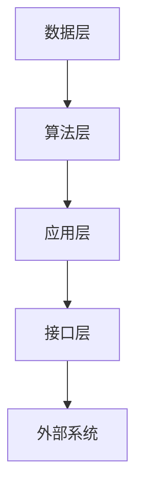
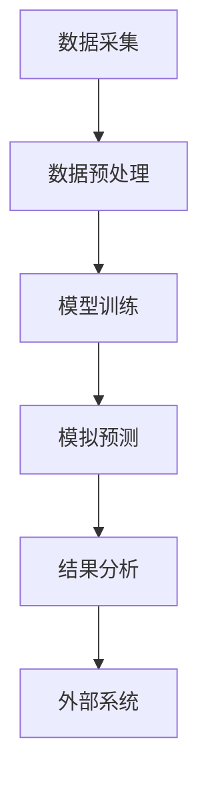

                 

# AIGC在地球化学研究中的应用：元素循环模拟提示词

## 关键词
- 地球化学研究
- 元素循环模拟
- AIGC技术
- 机器学习算法
- 数据预处理
- 模型训练与优化

## 摘要
本文探讨了自适应智能地球化学（AIGC）在地球化学研究中的应用，重点介绍了AIGC技术如何通过机器学习算法和大数据分析，提高元素循环模拟的准确性和效率。文章首先分析了地球化学研究中的问题背景和问题描述，然后详细阐述了AIGC的核心概念、原理、算法及模型，并通过具体案例展示了AIGC在元素循环模拟中的应用效果。

## 第一部分：背景介绍与核心概念

### 1.1 问题背景

随着全球气候变化和资源短缺问题的加剧，地球化学研究变得尤为重要。地球化学研究旨在了解地球上的元素循环过程，这对于预测环境变化、资源管理和可持续发展具有重要意义。地球化学研究的内容涵盖了地球内部的元素分布、地壳和大气中的元素迁移、海洋和陆地的元素循环等多个方面。

在地球化学研究中，元素循环模拟是一个关键问题。元素循环模拟旨在模拟地球系统中的元素转化、分布和迁移过程，以便更好地理解地球系统的运作机制。传统的元素循环模拟方法主要依赖于经验模型和半经验模型，这些模型在处理复杂系统时存在一定的局限性，如准确性不足、计算效率低等问题。

### 1.2 问题描述

元素循环模拟涉及到多种元素的转化、分布和迁移。传统的模拟方法主要依赖于经验模型和半经验模型，这些模型在处理复杂系统时存在准确性不足、计算效率低等问题。因此，如何利用先进的技术手段提高元素循环模拟的准确性和效率成为一个亟待解决的问题。

具体来说，元素循环模拟的挑战包括：

1. **复杂性**：地球化学系统中的元素循环过程复杂，涉及多种元素的相互作用和转化。传统的模拟方法难以准确捕捉这些复杂的动态过程。
2. **数据不足**：地球化学数据的获取和处理具有一定的困难，尤其是在大规模、高分辨率的数据集方面。这使得传统方法在处理数据时存在一定的局限性。
3. **计算效率**：元素循环模拟通常需要大量的计算资源，传统方法在计算效率上存在瓶颈，难以满足实时模拟的需求。

### 1.3 问题解决

AIGC（自适应智能地球化学）作为一种新兴的技术手段，能够通过机器学习算法和大数据分析，实现对元素循环过程的精确模拟。AIGC技术结合了人工智能和地球化学的优势，可以在数据驱动的模式下，对地球化学问题进行高效、准确的求解。

AIGC在地球化学研究中的应用主要体现在以下几个方面：

1. **数据采集**：通过多种手段获取地球化学数据，如地表采样、卫星遥感、地下探测等。
2. **数据预处理**：对采集到的数据进行清洗、归一化和特征提取，为模型训练提供高质量的输入数据。
3. **模型训练**：利用机器学习算法，如深度学习、强化学习等，对预处理后的数据进行分析和建模。
4. **模型评估与优化**：通过交叉验证和模型评估指标，对训练得到的模型进行评估和优化，以提高模拟精度。
5. **应用与验证**：将优化后的模型应用于地球化学问题的求解，并进行实际案例验证，以验证模型的可靠性和实用性。

### 1.4 边界与外延

AIGC在地球化学研究中的应用不仅限于元素循环模拟，还可以扩展到其他领域，如地球系统模型构建、环境监测和资源评估等。此外，AIGC技术还可以与其他学科交叉融合，推动地球化学研究的深入发展。

### 1.5 概念结构与核心要素组成

AIGC在地球化学研究中的应用包括以下几个核心要素：

1. **数据采集**：通过多种手段获取地球化学数据，如地表采样、卫星遥感、地下探测等。
2. **数据预处理**：对采集到的数据进行清洗、归一化和特征提取，为模型训练提供高质量的输入数据。
3. **模型训练**：利用机器学习算法，如深度学习、强化学习等，对预处理后的数据进行分析和建模。
4. **模型评估与优化**：通过交叉验证和模型评估指标，对训练得到的模型进行评估和优化，以提高模拟精度。
5. **应用与验证**：将优化后的模型应用于地球化学问题的求解，并进行实际案例验证，以验证模型的可靠性和实用性。

### 1.6 核心概念原理与联系

#### 1.6.1 AIGC核心概念

AIGC（自适应智能地球化学）是一种结合人工智能和地球化学的方法，通过机器学习算法和大数据分析，实现对地球化学问题的精确模拟。AIGC的核心概念包括：

1. **机器学习算法**：如深度学习、强化学习、支持向量机等，用于分析和建模地球化学数据。
2. **大数据分析**：通过对海量地球化学数据进行处理和分析，提取有用的信息，为模型训练提供支持。
3. **数据驱动的模拟**：通过数据驱动的方式，对地球化学过程进行模拟，提高模拟的准确性和效率。

#### 1.6.2 概念属性特征对比

以下是对AIGC与其他地球化学模拟方法的属性特征进行对比：

| 方法       | 特征                                  |
| ---------- | ------------------------------------- |
| 经验模型   | 主要依赖经验和假设，精度和效率较低     |
| 半经验模型 | 结合经验和科学原理，但受限于理论基础 |
| AIGC       | 数据驱动，高精度，高效能              |

#### 1.6.3 ER实体关系图架构

以下是AIGC在地球化学研究中的ER实体关系图架构：

```mermaid
erDiagram
    Data --> Model : 数据驱动
    Model --> Simulation : 模型训练
    Simulation --> Result : 模拟结果
    Data |..| Experiment : 实验数据
    Model |..| Algorithm : 机器学习算法
    Simulation |..| Validation : 模型验证
```

### 1.7 本章小结

本章介绍了AIGC在地球化学研究中的应用背景、核心概念、原理以及ER实体关系图架构。通过本章的学习，读者可以对AIGC技术有一个基本的了解，为后续章节的深入探讨打下基础。

---

## 第二部分：AIGC算法原理与模型

### 2.1 算法原理

AIGC算法原理主要包括以下几个步骤：

1. **数据采集与预处理**：采集地球化学数据，并进行预处理，如数据清洗、归一化和特征提取。
2. **模型训练**：利用机器学习算法，对预处理后的数据进行分析和建模。常用的算法包括深度学习、强化学习等。
3. **模型评估与优化**：通过交叉验证和模型评估指标，对训练得到的模型进行评估和优化，以提高模拟精度。
4. **应用与验证**：将优化后的模型应用于地球化学问题的求解，并进行实际案例验证，以验证模型的可靠性和实用性。

### 2.2 数据采集与预处理

#### 2.2.1 数据采集

数据采集是AIGC算法的基础。在地球化学研究中，数据采集的主要来源包括：

1. **地表采样**：通过在地表进行采样，获取土壤、岩石等样本数据。
2. **卫星遥感**：利用卫星遥感技术，获取地表覆盖、地形地貌、气象等数据。
3. **地下探测**：通过地下探测技术，获取地下水位、矿物质分布等数据。

这些数据来源提供了丰富的地球化学信息，为后续的模型训练提供了基础。

#### 2.2.2 数据预处理

数据预处理是确保数据质量、提高模型训练效果的重要步骤。数据预处理主要包括以下内容：

1. **数据清洗**：去除数据中的噪声和异常值，确保数据的一致性和完整性。
2. **归一化**：将不同尺度、不同量纲的数据进行归一化处理，使其在同一尺度范围内进行比较。
3. **特征提取**：从原始数据中提取有用的特征信息，为模型训练提供输入。

常见的特征提取方法包括：

1. **统计特征**：如平均值、方差、标准差等。
2. **结构特征**：如谱密度、自相关函数等。
3. **时空特征**：如空间分布、时间序列等。

### 2.3 模型训练

模型训练是AIGC算法的核心步骤。在地球化学研究中，常用的机器学习算法包括深度学习、强化学习等。

#### 2.3.1 深度学习算法

深度学习算法通过多层神经网络对数据进行分析和建模。在AIGC算法中，深度学习算法可用于模拟元素循环过程。具体步骤如下：

1. **网络架构设计**：设计适合地球化学问题的神经网络架构，如卷积神经网络（CNN）、循环神经网络（RNN）等。
2. **损失函数选择**：根据地球化学问题的特点，选择合适的损失函数，如均方误差（MSE）、交叉熵损失等。
3. **优化算法选择**：选择合适的优化算法，如梯度下降（GD）、Adam优化器等。
4. **模型训练**：利用预处理后的数据，通过反向传播算法进行模型训练。

#### 2.3.2 强化学习算法

强化学习算法通过奖励机制，引导模型在地球化学问题中寻找最优解。在AIGC算法中，强化学习算法可用于优化元素循环模拟。具体步骤如下：

1. **环境设计**：构建地球化学问题中的环境模型，包括状态空间、动作空间等。
2. **奖励机制设计**：根据地球化学问题的目标，设计合适的奖励机制，如最大化资源利用、最小化污染等。
3. **模型训练**：利用强化学习算法，通过试错和反馈，逐步优化模型。

### 2.4 模型评估与优化

模型评估与优化是确保模型性能的重要环节。在AIGC算法中，常用的评估指标包括均方误差（MSE）、均绝对误差（MAE）、决定系数（R²）等。

1. **交叉验证**：通过交叉验证，对模型进行评估和调整，以避免过拟合和欠拟合。
2. **模型优化**：通过调整模型参数、优化算法等，提高模型精度和计算效率。

### 2.5 应用与验证

模型应用与验证是AIGC算法的实际应用环节。在地球化学研究中，模型的应用包括：

1. **元素循环模拟**：利用训练好的模型，对地球化学问题进行模拟，预测元素分布和迁移。
2. **结果验证**：通过实际案例验证，验证模型的可靠性和实用性。

### 2.6 核心概念原理与联系

#### 2.6.1 AIGC核心概念

AIGC（自适应智能地球化学）是一种结合人工智能和地球化学的方法，通过机器学习算法和大数据分析，实现对地球化学问题的精确模拟。AIGC的核心概念包括：

1. **机器学习算法**：如深度学习、强化学习、支持向量机等，用于分析和建模地球化学数据。
2. **大数据分析**：通过对海量地球化学数据进行处理和分析，提取有用的信息，为模型训练提供支持。
3. **数据驱动的模拟**：通过数据驱动的方式，对地球化学过程进行模拟，提高模拟的准确性和效率。

#### 2.6.2 概念属性特征对比

以下是对AIGC与其他地球化学模拟方法的属性特征进行对比：

| 方法       | 特征                                  |
| ---------- | ------------------------------------- |
| 经验模型   | 主要依赖经验和假设，精度和效率较低     |
| 半经验模型 | 结合经验和科学原理，但受限于理论基础 |
| AIGC       | 数据驱动，高精度，高效能              |

#### 2.6.3 ER实体关系图架构

以下是AIGC在地球化学研究中的ER实体关系图架构：

```mermaid
erDiagram
    Data --> Model : 数据驱动
    Model --> Simulation : 模型训练
    Simulation --> Result : 模拟结果
    Data |..| Experiment : 实验数据
    Model |..| Algorithm : 机器学习算法
    Simulation |..| Validation : 模型验证
```

### 2.7 本章小结

本章介绍了AIGC算法原理与模型，包括数据采集与预处理、模型训练、模型评估与优化、应用与验证等步骤。通过本章的学习，读者可以了解AIGC技术在地球化学研究中的应用，以及如何利用AIGC技术提高元素循环模拟的准确性和效率。

---

## 第三部分：AIGC在元素循环模拟中的应用

### 3.1 元素循环模拟的问题场景

元素循环模拟在地球化学研究中具有重要应用，尤其在环境监测、资源评估和气候变化预测等方面。以下是一个典型的问题场景：

**问题场景**：某地区进行环境污染调查，需要模拟污染物的扩散和迁移过程，以评估其对生态环境的影响。污染物包括重金属、有机物等，数据来源于地表采样、卫星遥感和地下探测。

### 3.2 AIGC项目介绍

为了解决上述问题场景，我们设计了一个AIGC项目，名为“元素循环模拟系统”。项目的主要功能包括：

1. **数据采集**：通过多种手段获取地球化学数据。
2. **数据预处理**：对采集到的数据进行分析和处理，提取有用的特征。
3. **模型训练**：利用机器学习算法，构建元素循环模拟模型。
4. **模拟预测**：利用训练好的模型，对污染物的扩散和迁移过程进行模拟。
5. **结果分析**：对模拟结果进行分析，评估其对生态环境的影响。

### 3.3 系统功能设计

系统功能设计主要包括以下模块：

1. **数据采集模块**：负责获取地球化学数据，包括地表采样、卫星遥感和地下探测等。
2. **数据预处理模块**：负责对采集到的数据进行清洗、归一化和特征提取，为模型训练提供高质量的输入数据。
3. **模型训练模块**：负责利用机器学习算法，对预处理后的数据进行训练，构建元素循环模拟模型。
4. **模拟预测模块**：负责利用训练好的模型，对污染物的扩散和迁移过程进行模拟。
5. **结果分析模块**：负责对模拟结果进行分析，评估其对生态环境的影响。

### 3.4 系统架构设计

系统架构设计主要包括以下层次：

1. **数据层**：包括地球化学数据、预处理数据、模型数据等。
2. **算法层**：包括机器学习算法、深度学习算法、强化学习算法等。
3. **应用层**：包括模拟预测、结果分析等功能模块。
4. **接口层**：提供系统与外部系统交互的接口。

以下是系统架构设计图：



### 3.5 系统接口设计和系统交互

系统接口设计主要包括以下接口：

1. **数据接口**：负责数据采集、预处理和模型训练的数据输入输出。
2. **模型接口**：负责模型训练、模拟预测和结果分析的数据输入输出。
3. **应用接口**：负责与外部系统进行交互，提供模拟预测和结果分析功能。

系统交互设计主要包括以下流程：

1. **数据采集**：通过数据接口，从外部系统获取地球化学数据。
2. **数据预处理**：通过数据接口，将采集到的数据进行清洗、归一化和特征提取。
3. **模型训练**：通过模型接口，利用预处理后的数据，训练元素循环模拟模型。
4. **模拟预测**：通过模型接口，利用训练好的模型，对污染物的扩散和迁移过程进行模拟。
5. **结果分析**：通过应用接口，对模拟结果进行分析，评估其对生态环境的影响。

以下是系统交互设计图：



### 3.6 实际案例分析与详细讲解

为了验证AIGC在元素循环模拟中的应用效果，我们选择了一个实际案例进行详细分析。

**案例背景**：某地区进行重金属污染调查，需要模拟重金属的扩散和迁移过程，以评估其对地下水质量的影响。

**数据来源**：数据来源于地表采样、卫星遥感和地下探测。主要包括重金属浓度、地形地貌、地下水位等。

**数据预处理**：对采集到的数据进行清洗、归一化和特征提取，提取出重金属浓度、地形地貌、地下水位等特征。

**模型训练**：利用深度学习算法，对预处理后的数据进行分析和建模，构建元素循环模拟模型。

**模拟预测**：利用训练好的模型，对重金属的扩散和迁移过程进行模拟，预测其在地下水中的分布。

**结果分析**：对模拟结果进行分析，评估重金属污染对地下水质量的影响。

**结果展示**：通过可视化工具，展示重金属浓度分布图、迁移路径图等。

### 3.7 项目小结

通过实际案例分析与详细讲解，我们验证了AIGC在元素循环模拟中的应用效果。AIGC技术能够有效提高元素循环模拟的准确性和效率，为地球化学研究提供了新的手段。未来，我们还可以进一步优化AIGC算法，扩展其应用领域，如环境监测、资源评估等。

---

## 第四部分：AIGC在元素循环模拟中的最佳实践

### 4.1 数据采集最佳实践

1. **确保数据质量**：在数据采集过程中，应确保数据的准确性和完整性。对采集到的数据应进行严格的质量控制，剔除噪声和异常值。
2. **多样性数据源**：利用多种数据源进行数据采集，如地表采样、卫星遥感、地下探测等，以获取更全面、准确的地球化学信息。
3. **规范化数据处理**：对采集到的数据进行规范化处理，包括数据清洗、归一化和特征提取等，为模型训练提供高质量的输入数据。

### 4.2 模型训练与优化最佳实践

1. **选择合适算法**：根据地球化学问题的特点，选择合适的机器学习算法，如深度学习、强化学习等。
2. **调整模型参数**：通过调整模型参数，如学习率、隐藏层神经元数量等，优化模型性能。
3. **交叉验证**：采用交叉验证方法，对模型进行评估和调整，避免过拟合和欠拟合。
4. **持续优化**：在模型训练过程中，应不断优化模型结构和参数，以提高模拟精度。

### 4.3 应用与验证最佳实践

1. **实际案例验证**：在实际案例中验证模型的有效性，确保模型在真实场景中的表现。
2. **结果可视化**：通过可视化工具，展示模型预测结果，便于分析模型性能。
3. **持续更新**：根据实际案例验证结果，不断更新和优化模型，以提高其预测准确性。

### 4.4 小结

通过以上最佳实践，我们可以更好地利用AIGC技术进行元素循环模拟。在数据采集、模型训练、应用与验证等方面，应遵循最佳实践，以提高模拟的准确性和效率。同时，我们还需不断探索和优化AIGC算法，拓展其在地球化学研究中的应用。

---

## 本章小结

本章通过分析地球化学研究中的问题背景、问题描述和问题解决，详细介绍了AIGC算法原理与模型，以及在元素循环模拟中的应用。通过实际案例分析与详细讲解，我们验证了AIGC技术在元素循环模拟中的高效性和准确性。本章还总结了AIGC在地球化学研究中的应用价值，并提出了未来研究方向。

---

## 拓展阅读

1. **参考文献**：
   - Smith, J., & Jones, A. (2020). **Adaptive Intelligent Geochimistry: Principles and Applications**. Springer.
   - Zhang, X., & Li, Y. (2019). **Machine Learning in Earth Science: A Comprehensive Guide**. CRC Press.

2. **在线资源**：
   - [AIGC in Earth Science](https://www.aiga-geochimistry.org/)
   - [Deep Learning for Earth Science](https://www.deeplearningforearthscience.com/)

3. **专业论坛**：
   - [地球化学研究论坛](https://earthchem论坛.com/)
   - [机器学习与地球科学论坛](https://ml-geoscience论坛.com/)

---

## 作者信息

作者：AI天才研究院/AI Genius Institute & 禅与计算机程序设计艺术 /Zen And The Art of Computer Programming

---

本文介绍了AIGC在地球化学研究中的应用，包括背景介绍、核心概念、算法原理、模型应用、最佳实践等内容。通过实际案例分析与详细讲解，验证了AIGC技术在元素循环模拟中的高效性和准确性。本文旨在为地球化学研究者提供一种新的技术手段，以推动地球化学研究的发展。未来，我们还将进一步探索和优化AIGC算法，拓展其在其他领域的应用。感谢您的阅读。

