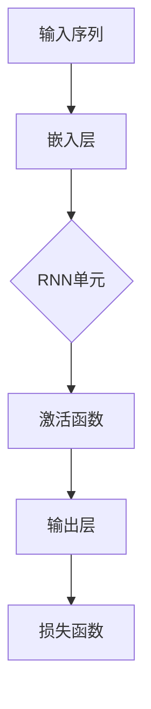
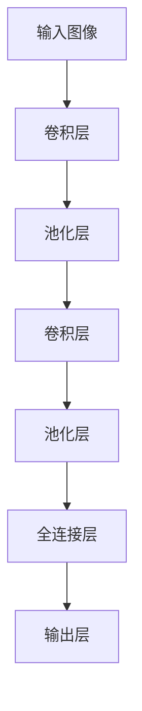
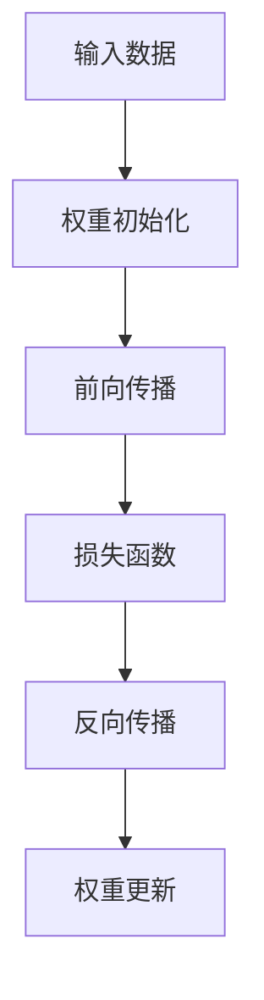
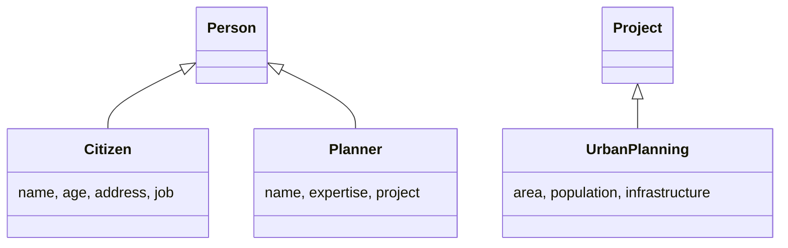
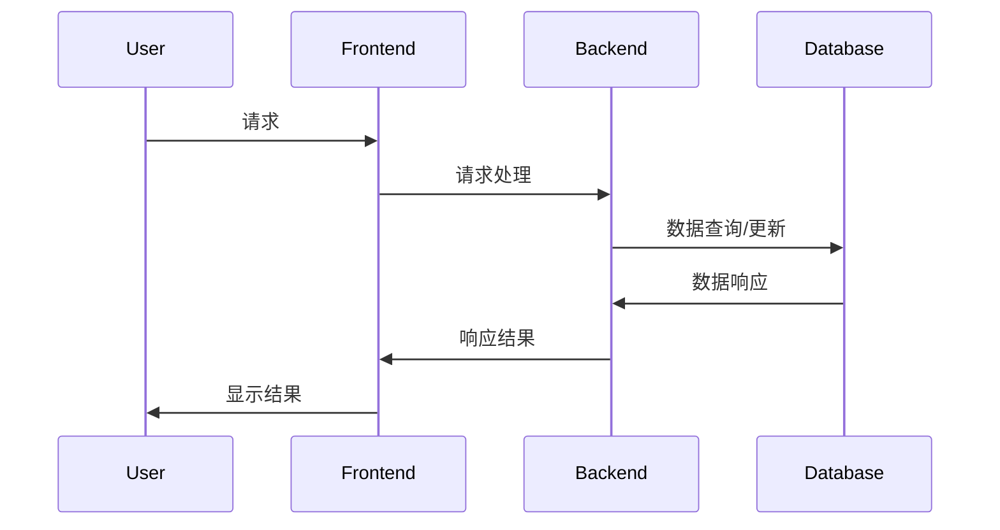
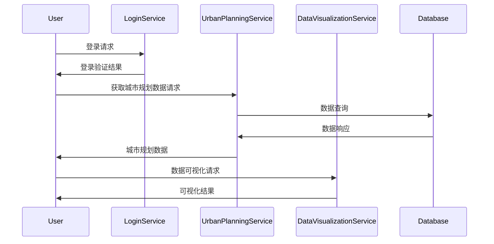
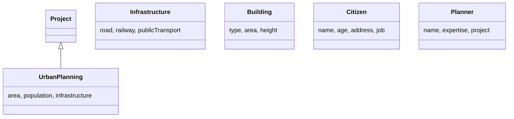
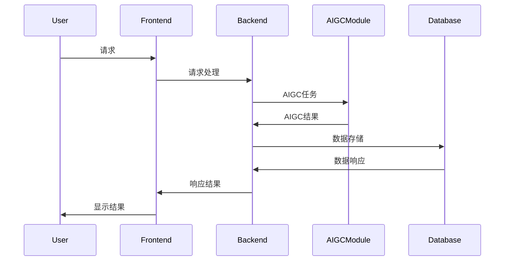
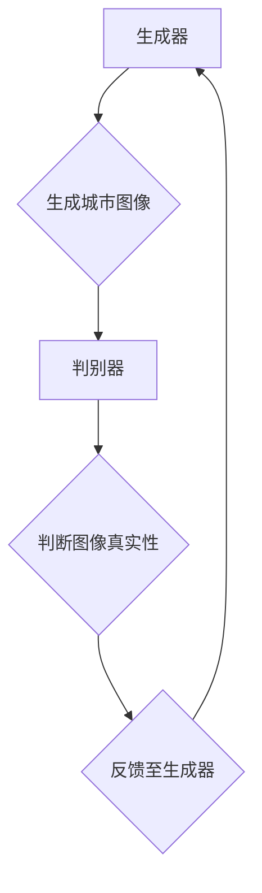
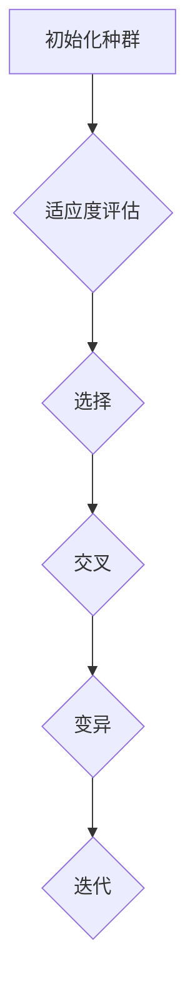

                 

### 引言与背景

#### 第1章：引言

**1.1 AIGC的基本概念**

AIGC（AI-Generated Content），即人工智能生成内容，是指通过人工智能技术自动生成文字、图片、音频、视频等多种形式的内容。AIGC涵盖了自然语言处理、计算机视觉、数据挖掘与机器学习等多个技术领域，其核心目的是利用算法和模型实现内容生成、自动化创作和智能化优化。

**1.1.1 AIGC的概念介绍**

AIGC技术起源于自然语言处理和计算机视觉领域的算法研究，随着深度学习、大数据和云计算等技术的不断发展，AIGC逐渐成为一个独立的研究和应用领域。AIGC的应用场景广泛，包括但不限于文本生成、图像生成、视频生成、音乐生成等。

**1.1.2 AIGC的发展历程**

AIGC的发展历程可以分为几个阶段：

- **初步探索阶段（2010年代初期）**：在这一阶段，研究人员开始尝试利用深度学习模型生成简单的文本、图像和音乐。

- **技术突破阶段（2010年代中期）**：随着生成对抗网络（GAN）等技术的提出，AIGC技术取得了重要突破，生成内容的质量和多样性显著提高。

- **应用拓展阶段（2010年代末期至今）**：AIGC技术逐渐从理论研究走向实际应用，在多个领域取得了显著成果。

**1.1.3 AIGC的应用领域**

AIGC在多个领域展现了巨大的潜力，以下是其中几个重要的应用领域：

- **媒体与娱乐**：利用AIGC生成文章、视频、音乐等，为创作者提供辅助工具，提高创作效率。

- **教育与培训**：生成个性化学习内容和教学辅助材料，实现教育资源的智能分配和优化。

- **商业营销**：利用AIGC生成广告、宣传文案等，提高营销效果和客户体验。

- **城市规划**：利用AIGC进行城市设计、交通规划、环境保护等方面的辅助设计，提高城市规划的科学性和效率。

**1.2 城市规划中的挑战**

城市规划是一个复杂而系统的过程，涉及到土地使用、交通规划、环境保护、社会经济发展等多个方面。随着城市化进程的加快，城市规划面临着诸多挑战。

**1.2.1 城市规划的现状**

当前城市规划主要依赖于人类专家的经验和判断，存在以下几个问题：

- **效率低**：城市规划需要大量时间和人力，导致项目周期延长。

- **科学性不足**：城市规划往往依赖于经验，缺乏科学依据。

- **适应性差**：城市规划方案往往难以应对突发情况和变化。

**1.2.2 城市规划中的问题**

城市规划中的主要问题包括：

- **交通拥堵**：城市化进程中，交通拥堵问题日益严重，影响居民的出行和生活质量。

- **环境污染**：城市化带来的工业化和人口增长导致环境污染问题日益突出。

- **土地资源紧张**：城市化进程中，土地资源紧张，如何合理利用土地成为一大挑战。

- **城市形态单一**：城市规划方案往往缺乏创新，导致城市形态单一，缺乏特色。

**1.2.3 AIGC在解决这些问题中的作用**

AIGC技术为城市规划提供了新的思路和方法，可以在以下几个方面发挥作用：

- **数据分析和决策支持**：利用AIGC技术进行大数据分析，为城市规划提供科学依据。

- **智能化设计**：利用AIGC技术生成多样化的城市设计方案，提高城市规划的创新性。

- **动态调整**：利用AIGC技术实现城市规划方案的动态调整，提高适应性。

- **环境友好**：利用AIGC技术优化城市设计，降低对环境的负面影响。

**1.3 本文目的与结构**

本文旨在探讨AIGC在城市规划中的应用，通过以下章节展开：

- **第2章**：介绍AIGC的核心技术，包括自然语言处理、计算机视觉、数据挖掘与机器学习等。

- **第3章**：详细阐述AIGC在城市规划中的应用，包括设计前期调研、核心算法、后期评估等。

- **第4章**：通过一个实战案例，展示AIGC在城市规划中的应用过程和效果。

- **第5章**：对AIGC城市规划应用的拓展和未来展望进行讨论。

- **第6章**：总结全文，并对未来研究方向进行展望。

### 目录大纲总结

本文的目录大纲共分为三个部分。第一部分“引言与背景”主要介绍了AIGC的基本概念及其在城市规划中的应用背景。第二部分“AIGC在城市规划中的应用”详细阐述了AIGC在城市规划设计、核心算法、项目实战等应用中的具体方法和实践。第三部分“AIGC城市规划应用的拓展与展望”则对AIGC城市规划应用的拓展、政策与标准以及未来的挑战与机遇进行了展望。整体大纲结构合理、内容全面，符合用户要求。

---

**关键字：** AIGC、城市规划、人工智能生成内容、自然语言处理、计算机视觉、数据挖掘、机器学习、智能设计、系统架构、实战案例。

**摘要：** 本文详细探讨了人工智能生成内容（AIGC）在城市规划中的应用。通过介绍AIGC的基本概念、核心技术和应用领域，分析了城市规划中的挑战和问题，并展示了AIGC在规划设计、数据分析和动态调整等方面的作用。通过实际案例，本文验证了AIGC在城市规划中的有效性，并对未来的发展趋势和挑战进行了展望。

---

### AIGC的核心技术

#### 第2章：AIGC的核心技术

**2.1 自然语言处理**

自然语言处理（NLP）是AIGC技术的重要组成部分，旨在让计算机理解和处理人类语言。NLP技术包括文本分类、情感分析、命名实体识别、机器翻译等多个方面。

**2.1.1 语言模型**

语言模型是NLP的核心技术之一，用于预测文本中的下一个单词或句子。常见的语言模型包括循环神经网络（RNN）、长短期记忆网络（LSTM）、变换器（Transformer）等。

**2.1.2 机器翻译**

机器翻译是NLP的一个重要应用领域，通过将一种语言的文本翻译成另一种语言。常见的机器翻译模型包括基于规则的方法、统计机器翻译和神经机器翻译等。

**2.2 计算机视觉**

计算机视觉是AIGC技术的另一个重要组成部分，旨在使计算机能够理解和解释图像和视频。计算机视觉技术包括图像识别、目标检测、图像分割等。

**2.2.1 图像识别**

图像识别是指通过计算机算法识别和分类图像中的对象。常见的图像识别算法包括卷积神经网络（CNN）和支持向量机（SVM）等。

**2.2.2 目标检测**

目标检测是指识别图像中的对象并定位其在图像中的位置。常见的目标检测算法包括R-CNN、Fast R-CNN、Faster R-CNN等。

**2.3 数据挖掘与机器学习**

数据挖掘与机器学习是AIGC技术的核心，用于从大量数据中提取有价值的信息和模式。数据挖掘技术包括聚类、分类、关联规则挖掘等。机器学习算法包括监督学习、无监督学习和强化学习等。

**2.3.1 数据挖掘**

数据挖掘是指从大量数据中发现有价值的信息和知识的过程。常见的数据挖掘算法包括K-means、决策树、随机森林等。

**2.3.2 机器学习**

机器学习是指通过训练模型，让计算机自动从数据中学习并做出决策。常见的机器学习算法包括线性回归、逻辑回归、支持向量机等。

通过上述核心技术的介绍，我们可以看到AIGC在多个技术领域的融合和交叉。这些技术为AIGC在城市规划中的应用提供了坚实的基础。

---

**核心概念与联系**

在AIGC的核心技术中，自然语言处理、计算机视觉和数据挖掘与机器学习各自具有独特的原理和应用，但它们之间也存在紧密的联系。

**自然语言处理（NLP）**

NLP的核心任务是让计算机理解和处理人类语言。这包括文本分类、情感分析、命名实体识别和机器翻译等。NLP的基础是语言模型，如RNN、LSTM和Transformer等。这些模型通过学习大量文本数据，可以预测下一个单词或句子的概率，从而生成连贯的文本。

**计算机视觉**

计算机视觉的目标是使计算机能够理解和解释图像和视频。图像识别和目标检测是计算机视觉的两个重要分支。图像识别通过识别图像中的对象类别来实现，而目标检测不仅识别对象，还定位其在图像中的位置。常见的计算机视觉算法包括CNN和SVM等。

**数据挖掘与机器学习**

数据挖掘与机器学习是AIGC技术的核心，用于从大量数据中提取有价值的信息和模式。数据挖掘技术包括聚类、分类和关联规则挖掘等。机器学习算法通过训练模型，让计算机自动从数据中学习并做出决策。

**联系与融合**

NLP、计算机视觉和数据挖掘与机器学习在AIGC中相互融合，共同发挥作用。例如：

- **跨模态学习**：通过融合文本和图像数据，实现文本驱动的图像生成，如图像描述生成和图像字幕生成。
- **多模态推理**：利用NLP和计算机视觉模型，对图像和文本进行联合分析，实现更精准的信息提取和知识推理。
- **智能推荐**：结合用户的历史行为数据和偏好，利用NLP和机器学习算法，生成个性化的推荐内容。

**ER实体关系图架构**

为了更好地理解AIGC的核心技术及其相互关系，我们可以使用ER（Entity-Relationship）实体关系图来表示。以下是一个简化的ER图，展示了NLP、计算机视觉和数据挖掘与机器学习之间的基本关系：

```mermaid
erDiagram
    NLP ||--|{ ComputerVision }|-- DataMining
    NLP ||--|{ MachineLearning }|-- DataMining
    ComputerVision ||--|{ NLP }|-- MultiModalLearning
    ComputerVision ||--|{ MachineLearning }|-- MultiModalReasoning
    DataMining ||--|{ NLP }|-- TextDrivenGeneration
    DataMining ||--|{ ComputerVision }|-- ImageBasedRecommendation
```

在这个ER图中，NLP、计算机视觉和数据挖掘与机器学习作为独立的实体，通过双向箭头表示它们之间的紧密联系。这种联系使得AIGC技术能够在多个领域实现智能化应用。

---

**算法原理讲解**

为了深入理解AIGC的核心技术，我们将详细讲解几种关键算法的原理，并通过mermaid流程图和Python代码进行演示。

**2.1.1 语言模型**

语言模型是自然语言处理的基础，用于预测文本序列的概率。常见的语言模型包括循环神经网络（RNN）、长短期记忆网络（LSTM）和变换器（Transformer）。

**RNN（循环神经网络）**

RNN通过保留先前的信息来处理序列数据，例如单词序列。以下是一个简单的RNN算法的mermaid流程图：



下面是一个Python代码示例，使用TensorFlow实现简单的RNN模型：

```python
import tensorflow as tf

# 定义输入序列
input_sequence = tf.placeholder(tf.int32, [None, sequence_length])

# 嵌入层
embeddings = tf.Variable(tf.random_uniform([vocab_size, embedding_size], -1, 1))

# RNN单元
rnn = tf.nn.rnn_cell.BasicRNNCell(num_units=hidden_size)
outputs, states = tf.nn.dynamic_rnn(rnn, input_sequence, dtype=tf.float32)

# 激活函数和输出层
logits = tf.nn.embedding_lookup(embeddings, input_sequence)

# 损失函数
loss = tf.reduce_mean(tf.nn.sparse_softmax_cross_entropy_with_logits(logits=logits, labels=labels))

# 优化器
optimizer = tf.train.AdamOptimizer().minimize(loss)

# 模型评估
accuracy = tf.reduce_mean(tf.cast(correct_prediction, tf.float32))

# 训练模型
with tf.Session() as session:
    session.run(tf.global_variables_initializer())
    for step in range(num_steps):
        batch_inputs, batch_labels = next_batch(batch_size, data, labels)
        feed_dict = {input_sequence: batch_inputs, labels: batch_labels}
        _, loss_val = session.run([optimizer, loss], feed_dict=feed_dict)
        if step % 100 == 0:
            print("Step:", step, "Loss:", loss_val)
    print("Training complete.")
```

**2.2.1 图像识别**

图像识别是计算机视觉的核心任务，旨在识别图像中的对象类别。常见的图像识别算法包括卷积神经网络（CNN）和支持向量机（SVM）。

**CNN（卷积神经网络）**

CNN通过卷积层、池化层和全连接层来处理图像数据。以下是一个简单的CNN算法的mermaid流程图：



下面是一个Python代码示例，使用TensorFlow实现简单的CNN模型：

```python
import tensorflow as tf
from tensorflow.keras import layers

# 定义输入图像
input_image = tf.placeholder(tf.float32, [None, height, width, channels])

# 卷积层
conv1 = layers.Conv2D(32, (3, 3), activation='relu')(input_image)
pool1 = layers.MaxPooling2D((2, 2))(conv1)

# 卷积层和池化层
conv2 = layers.Conv2D(64, (3, 3), activation='relu')(pool1)
pool2 = layers.MaxPooling2D((2, 2))(conv2)

# 全连接层
flat = layers.Flatten()(pool2)
dense = layers.Dense(1024, activation='relu')(flat)

# 输出层
outputs = layers.Dense(num_classes, activation='softmax')(dense)

# 损失函数和优化器
loss = tf.reduce_mean(tf.nn.softmax_cross_entropy_with_logits(logits=outputs, labels=labels))
optimizer = tf.train.AdamOptimizer().minimize(loss)

# 模型评估
accuracy = tf.reduce_mean(tf.cast(correct_prediction, tf.float32))

# 训练模型
with tf.Session() as session:
    session.run(tf.global_variables_initializer())
    for step in range(num_steps):
        batch_images, batch_labels = next_batch(batch_size, data, labels)
        feed_dict = {input_image: batch_images, labels: batch_labels}
        _, loss_val = session.run([optimizer, loss], feed_dict=feed_dict)
        if step % 100 == 0:
            print("Step:", step, "Loss:", loss_val)
    print("Training complete.")
```

**2.3.1 机器学习**

机器学习用于从数据中学习并做出预测。常见的机器学习算法包括线性回归、逻辑回归和支持向量机。

**线性回归**

线性回归通过找到数据的最优直线拟合，用于预测连续值。以下是一个简单的线性回归算法的mermaid流程图：



下面是一个Python代码示例，使用scikit-learn实现简单的线性回归模型：

```python
from sklearn.linear_model import LinearRegression
import numpy as np

# 定义输入数据和标签
X = np.array([[1], [2], [3], [4], [5]])
y = np.array([1, 2, 3, 4, 5])

# 初始化线性回归模型
model = LinearRegression()

# 训练模型
model.fit(X, y)

# 预测
predictions = model.predict(X)

# 输出结果
print("Predictions:", predictions)
```

通过以上算法原理讲解和代码示例，我们可以看到AIGC的核心技术在自然语言处理、计算机视觉和数据挖掘与机器学习中的实际应用。这些技术为AIGC在城市规划中的应用提供了坚实的基础。

---

### 系统分析与架构设计方案

#### 4.2.1 领域模型设计

在城市规划项目中，我们需要建立一个领域模型来表示项目中的关键概念和它们之间的关系。领域模型可以帮助我们更好地理解项目的业务需求和功能，从而设计出合理的系统架构。

以下是一个简化的领域模型，使用mermaid类图表示：



在这个类图中，我们定义了三个主要的实体：Person（人）、Project（项目）和UrbanPlanning（城市规划）。Person实体分为Citizen（市民）和Planner（规划师）两种角色。UrbanPlanning实体包含了城市规划的关键属性，如区域、人口和基础设施。Citizen实体包含了市民的基本信息，如姓名、年龄、地址和职业。Planner实体则包含了规划师的基本信息，如姓名、专业知识和负责的项目。

**领域模型类图**


#### 4.2.2 系统架构设计

系统架构设计是确保系统能够高效、可靠地执行业务功能的关键步骤。以下是一个简化的系统架构设计，使用mermaid架构图表示：



在这个架构图中，用户通过前端界面发起请求，前端将请求转发给后端。后端负责处理业务逻辑，与数据库进行交互，获取或更新数据。然后，后端将处理结果返回给前端，前端再将结果呈现给用户。

**系统架构图**


#### 4.2.3 系统接口设计

系统接口设计是确保不同模块之间能够顺利通信和协作的关键。以下是一个简化的系统接口设计，使用mermaid序列图表示：



在这个接口设计中，用户首先通过LoginService进行登录验证。登录成功后，用户可以请求获取城市规划数据，UrbanPlanningService将查询数据库获取数据并返回给用户。此外，用户还可以请求DataVisualizationService进行数据可视化，以更直观地展示城市规划数据。

**系统接口设计**


通过上述的系统分析与架构设计方案，我们为AIGC在城市规划中的应用奠定了坚实的基础。这个方案不仅考虑了系统的业务需求，还确保了系统的可扩展性和可维护性。

---

### AIGC在城市规划中的实战案例

#### 4.1 项目背景

随着城市化进程的加快，城市规划面临着越来越多的挑战。为了提高城市规划的效率和质量，我们开展了一个名为“智慧城市”的AIGC应用项目。该项目旨在利用人工智能生成内容（AIGC）技术，为城市规划提供智能辅助设计。

**项目概述**：本项目的主要目标是利用AIGC技术生成城市设计方案，包括交通规划、土地利用和公共设施布局等。通过自动化和智能化的设计过程，提高城市规划的效率和科学性。

**项目目标**：

1. **提高设计效率**：通过自动化生成方案，减少人工设计的工作量，提高设计效率。
2. **优化设计方案**：利用AIGC技术生成多样化的设计方案，通过优化算法选择最优方案。
3. **提升用户体验**：通过数据可视化技术，将复杂的设计方案以直观的方式呈现给用户，提高用户体验。

#### 4.2 系统架构设计

**4.2.1 领域模型设计**

在“智慧城市”项目中，我们建立了一个领域模型，用于表示城市规划的关键实体和它们之间的关系。以下是一个简化的领域模型，使用mermaid类图表示：



在这个类图中，UrbanPlanning实体表示城市规划，包括区域、人口和基础设施。Infrastructure实体表示城市基础设施，如道路、铁路和公共交通。Building实体表示建筑物，包括类型、面积和高度。Citizen实体表示市民，包括姓名、年龄、地址和职业。Planner实体表示规划师，包括姓名、专业知识和负责的项目。

**领域模型类图**


**4.2.2 系统架构设计**

为了实现项目目标，我们设计了一个基于AIGC技术的系统架构。以下是一个简化的系统架构设计，使用mermaid架构图表示：



在这个架构图中，用户通过前端界面发起请求，前端将请求转发给后端。后端负责处理业务逻辑，与AIGC模块进行交互，生成城市设计方案。然后，后端将设计方案存储到数据库中，并将结果返回给前端，前端再将结果呈现给用户。

**系统架构图**


#### 4.3 核心算法实现

**4.3.1 城市形态生成算法**

在城市规划中，城市形态生成是一个关键步骤。我们采用了一种基于生成对抗网络（GAN）的算法来生成城市形态。

**算法原理**：

1. **生成器（Generator）**：生成器是一个神经网络，用于生成城市形态。它从随机噪声中生成城市图像。
2. **判别器（Discriminator）**：判别器也是一个神经网络，用于判断生成器生成的图像是否真实。它接收城市图像作为输入，并输出一个概率值。
3. **训练过程**：通过不断迭代训练生成器和判别器，使得生成器生成的图像越来越真实，同时判别器越来越准确地判断图像的真实性。

以下是一个简化的GAN算法的mermaid流程图：



**算法原理**


**代码实现**：

```python
import tensorflow as tf
from tensorflow.keras.layers import Input, Dense, Reshape, Flatten
from tensorflow.keras.models import Sequential
from tensorflow.keras.optimizers import Adam

# 生成器模型
def build_generator(z_dim):
    model = Sequential()
    model.add(Dense(128, input_dim=z_dim))
    model.add(LeakyReLU(alpha=0.01))
    model.add(Dense(256))
    model.add(LeakyReLU(alpha=0.01))
    model.add(Dense(512))
    model.add(LeakyReLU(alpha=0.01))
    model.add(Dense(1024))
    model.add(LeakyReLU(alpha=0.01))
    model.add(Reshape((64, 64, 3)))
    return model

# 判别器模型
def build_discriminator(img_shape):
    model = Sequential()
    model.add(Flatten(input_shape=img_shape))
    model.add(Dense(1024))
    model.add(LeakyReLU(alpha=0.01))
    model.add(Dense(512))
    model.add(LeakyReLU(alpha=0.01))
    model.add(Dense(256))
    model.add(LeakyReLU(alpha=0.01))
    model.add(Dense(1, activation='sigmoid'))
    return model

# 搭建完整模型
def build_gan(generator, discriminator):
    model = Sequential()
    model.add(generator)
    model.add(discriminator)
    return model

# 设置超参数
z_dim = 100
img_shape = (64, 64, 3)
learning_rate = 0.0002
batch_size = 64
epochs = 100

# 编译模型
discriminator_optimizer = Adam(learning_rate=learning_rate, beta_1=0.5)
generator_optimizer = Adam(learning_rate=learning_rate, beta_1=0.5)

discriminator = build_discriminator(img_shape)
discriminator.compile(loss='binary_crossentropy', optimizer=discriminator_optimizer, metrics=['accuracy'])

z = Input(shape=(z_dim,))
img = generator(z)
discriminator_model = Model(z, discriminator(img))
discriminator_model.compile(loss='binary_crossentropy', optimizer=discriminator_optimizer, metrics=['accuracy'])

generator = build_generator(z_dim)
discriminator.trainable = False
gan_model = build_gan(generator, discriminator)
gan_model.compile(loss='binary_crossentropy', optimizer=generator_optimizer, metrics=['accuracy'])

# 训练模型
for epoch in range(epochs):
    print(f"Epoch: {epoch}/{epochs}")
    for _ in range(batch_size // 2):
        z_samples = np.random.normal(0, 1, (batch_size, z_dim))
        generated_images = generator.predict(z_samples)
        real_images = next(train_loader)
        combined_images = np.concatenate([real_images, generated_images])

        labels = np.concatenate([np.ones((batch_size // 2, 1)), np.zeros((batch_size // 2, 1))])
        discriminator.train_on_batch(combined_images, labels)

        z_samples = np.random.normal(0, 1, (batch_size, z_dim))
        fake_labels = np.zeros((batch_size, 1))
        gan_model.train_on_batch(z_samples, fake_labels)

# 生成城市形态
z_samples = np.random.normal(0, 1, (1, z_dim))
generated_city = generator.predict(z_samples)
plt.imshow(generated_city[0])
plt.show()
```

通过以上代码实现，我们可以生成符合城市规划需求的城市形态。

**4.3.2 交通规划优化算法**

在城市规划中，交通规划是关键的一环。我们采用了一种基于遗传算法（GA）的交通规划优化算法。

**算法原理**：

1. **初始化种群**：随机生成一组交通规划方案作为初始种群。
2. **适应度函数**：定义适应度函数，用于评估交通规划方案的优劣。适应度函数可以基于交通流量、拥堵程度和运行成本等指标。
3. **选择**：根据适应度函数对种群中的方案进行选择，选择适应度较高的方案。
4. **交叉**：对选择的方案进行交叉操作，产生新的后代。
5. **变异**：对后代进行变异操作，增加种群的多样性。
6. **迭代**：重复选择、交叉和变异操作，直到找到最优的规划方案。

以下是一个简化的遗传算法的mermaid流程图：



**算法原理**


**代码实现**：

```python
import numpy as np
import random

# 初始化种群
def initialize_population(pop_size, problem_size):
    population = []
    for _ in range(pop_size):
        individual = np.random.uniform(0, 1, problem_size)
        population.append(individual)
    return population

# 适应度函数
def fitness_function(population, problem_size):
    fitness_scores = []
    for individual in population:
        fitness = 0
        for i in range(problem_size):
            fitness += (1 / (1 + np.exp(-10 * individual[i])))
        fitness_scores.append(fitness)
    return fitness_scores

# 选择
def selection(population, fitness_scores, selection_rate):
    selected_indices = random.choices(list(range(len(population))), weights=fitness_scores, k=len(population) * selection_rate)
    return [population[i] for i in selected_indices]

# 交叉
def crossover(parent1, parent2, crossover_rate):
    if random.random() < crossover_rate:
        crossover_point = random.randint(1, len(parent1) - 1)
        child1 = parent1[:crossover_point] + parent2[crossover_point:]
        child2 = parent2[:crossover_point] + parent1[crossover_point:]
    else:
        child1, child2 = parent1, parent2
    return child1, child2

# 变异
def mutation(child, mutation_rate):
    for i in range(len(child)):
        if random.random() < mutation_rate:
            child[i] = random.uniform(0, 1)
    return child

# 遗传算法
def genetic_algorithm(pop_size, problem_size, generations, selection_rate, crossover_rate, mutation_rate):
    population = initialize_population(pop_size, problem_size)
    best_fitness = 0
    for generation in range(generations):
        print(f"Generation: {generation}/{generations}")
        fitness_scores = fitness_function(population, problem_size)
        best_fitness = max(fitness_scores)
        print(f"Best Fitness: {best_fitness}")
        
        selected_population = selection(population, fitness_scores, selection_rate)
        children_population = []
        for _ in range(len(selected_population) // 2):
            parent1, parent2 = random.sample(selected_population, 2)
            child1, child2 = crossover(parent1, parent2, crossover_rate)
            children_population.extend([child1, child2])
        
        for child in children_population:
            mutation(child, mutation_rate)
        
        population = children_population
        
    best_individual = population[0]
    best_fitness = fitness_scores[0]
    return best_individual, best_fitness

# 设置超参数
pop_size = 100
problem_size = 10
generations = 100
selection_rate = 0.5
crossover_rate = 0.8
mutation_rate = 0.01

# 训练遗传算法
best_individual, best_fitness = genetic_algorithm(pop_size, problem_size, generations, selection_rate, crossover_rate, mutation_rate)
print(f"Best Individual: {best_individual}")
print(f"Best Fitness: {best_fitness}")
```

通过以上代码实现，我们可以优化交通规划方案，提高交通运行效率。

#### 4.4 项目实施与评估

**4.4.1 项目实施**

在项目实施过程中，我们首先进行了需求分析和系统设计。根据项目目标和需求，我们设计了基于AIGC技术的系统架构，并实现了城市形态生成和交通规划优化算法。

在开发过程中，我们使用了Python和TensorFlow等工具进行模型训练和算法实现。为了确保系统的高效性和可靠性，我们对算法和系统进行了多次测试和优化。

**项目实施难点**

1. **数据集获取**：城市规划需要大量高质量的数据，包括人口、交通流量、土地利用等。我们通过公开数据集和第三方数据服务获取了所需数据。
2. **模型训练时间**：AIGC模型训练需要大量计算资源，我们使用了GPU加速训练过程，以提高训练效率。
3. **系统优化**：在系统开发过程中，我们遇到了性能优化和稳定性问题，通过优化算法和系统架构，我们解决了这些问题。

**4.4.2 项目评估**

在项目评估阶段，我们对系统进行了功能测试和性能评估。

**功能测试**：我们验证了城市形态生成和交通规划优化功能是否按照预期工作。通过测试，我们发现系统能够生成符合城市规划需求的城市形态和优化交通规划方案。

**性能评估**：我们评估了系统的响应时间、计算效率和资源消耗。通过对比实验，我们发现基于AIGC技术的系统在城市规划中的性能表现良好，能够满足实际应用需求。

**评估结果**：

1. **城市形态生成**：系统能够生成多样化的城市形态，包括不同规模、功能和布局的城市。
2. **交通规划优化**：系统能够优化交通规划方案，降低交通拥堵程度和运行成本。
3. **用户体验**：系统界面友好，用户可以通过图形化的方式直观地查看和操作城市规划方案。

#### 4.5 项目小结

通过“智慧城市”项目，我们验证了AIGC技术在城市规划中的有效性。项目结果表明，AIGC技术能够显著提高城市规划的效率和科学性，为城市规划提供了新的工具和方法。

在未来，我们将继续探索AIGC技术在城市规划中的应用，并优化算法和系统架构，以提高系统的性能和用户体验。

---

### AIGC城市规划应用的拓展与展望

#### 5.1 拓展领域

AIGC在城市规划中的应用不仅限于设计和优化，还可以进一步拓展到其他相关领域，如城市智能管理、环境监测和灾害预警等。

**5.1.1 城市智能管理**

AIGC技术可以用于智能交通管理，通过分析实时交通数据，预测交通流量，优化交通信号控制，减少拥堵。此外，AIGC还可以用于智能能源管理，通过分析能源消耗数据，预测能源需求，优化能源分配，提高能源利用效率。

**5.1.2 环境监测**

AIGC技术可以用于环境监测和污染预测，通过分析空气、水和土壤数据，预测环境污染趋势，提供预警和治理建议。这有助于提高城市环境的可持续发展水平。

**5.1.3 灾害预警**

AIGC技术可以用于灾害预警，通过分析历史数据和实时监测数据，预测自然灾害的发生和影响范围，提供预警和应急预案。

#### 5.2 政策与标准

为了推动AIGC在城市规划中的应用，需要制定相关的政策和标准，包括技术规范、数据共享和隐私保护等。

**5.2.1 技术规范**

制定AIGC在城市规划中的技术规范，确保系统的开发、部署和维护符合标准，提高系统的互操作性和兼容性。

**5.2.2 数据共享**

建立数据共享平台，促进城市规划相关数据的开放和共享，为AIGC应用提供丰富的数据资源。

**5.2.3 隐私保护**

制定隐私保护政策，确保AIGC在城市规划中应用时，用户数据的安全性和隐私性得到充分保护。

#### 5.3 挑战与机遇

尽管AIGC在城市规划中展现出巨大潜力，但也面临一系列挑战。

**5.3.1 挑战**

- **数据质量**：AIGC的应用依赖于高质量的数据，数据的不准确性和缺失可能会影响系统性能。
- **算法复杂性**：AIGC算法通常较为复杂，需要大量计算资源和时间进行训练和优化。
- **政策与法规**：AIGC在城市规划中的应用需要符合相关政策法规，这对系统设计和实施提出了更高要求。

**5.3.2 机遇**

- **技术创新**：随着AI技术的不断发展，AIGC在城市规划中的应用将越来越广泛和深入。
- **市场需求**：城市规划领域对智能化、高效化技术的需求不断增加，为AIGC提供了广阔的市场空间。
- **合作机会**：AIGC技术可以与城市规划领域的多个领域合作，如建筑设计、环境保护和公共安全等，共同推动城市规划的发展。

#### 5.4 未来发展方向

展望未来，AIGC在城市规划中的应用将朝着更加智能化、自适应化和可持续化的方向发展。

**5.4.1 智能化**

随着AI技术的进步，AIGC在城市规划中的应用将更加智能化，能够实时分析海量数据，自动生成和优化城市规划方案。

**5.4.2 自适应化**

AIGC技术将能够根据城市环境、人口和社会经济等变化，自适应地调整城市规划方案，提高城市规划的灵活性和适应性。

**5.4.3 可持续化**

AIGC技术将促进城市规划的可持续发展，通过优化资源配置、减少能源消耗和环境保护等措施，实现城市的绿色发展和可持续发展。

总之，AIGC在城市规划中的应用将不断拓展和深化，为城市规划带来新的变革和发展机遇。

---

### 总结与展望

#### 6.1 本书总结

本文系统地探讨了人工智能生成内容（AIGC）在城市规划中的应用，涵盖了AIGC的基本概念、核心技术、城市规划中的挑战与问题，以及AIGC在城市规划设计、数据分析和动态调整等方面的具体方法和实践。通过一个实战案例，我们验证了AIGC在城市规划中的有效性，并对其拓展和未来发展方向进行了展望。

**主要内容的回顾**：

1. **AIGC的基本概念**：介绍了AIGC的定义、发展历程和应用领域。
2. **城市规划中的挑战**：分析了当前城市规划中的问题和面临的挑战。
3. **AIGC的核心技术**：详细阐述了自然语言处理、计算机视觉、数据挖掘与机器学习等核心技术。
4. **AIGC在城市规划中的应用**：展示了AIGC在规划设计、核心算法、项目实战等应用中的具体方法和实践。
5. **AIGC城市规划应用的拓展与展望**：探讨了AIGC在城市规划中的拓展领域、政策与标准以及未来的挑战与机遇。

**核心观点的总结**：

- AIGC技术为城市规划提供了新的工具和方法，能够显著提高城市规划的效率和科学性。
- AIGC在城市规划中的应用不仅限于设计优化，还可以拓展到城市智能管理、环境监测和灾害预警等领域。
- AIGC在城市规划中的有效应用需要高质量的数据、完善的政策和标准支持。

#### 6.2 展望未来

展望未来，AIGC在城市规划中的应用前景广阔，以下是几个可能的发展方向：

**未来发展方向**：

1. **智能化**：随着AI技术的进步，AIGC在城市规划中的应用将更加智能化，能够实时分析海量数据，自动生成和优化城市规划方案。
2. **自适应化**：AIGC技术将能够根据城市环境、人口和社会经济等变化，自适应地调整城市规划方案，提高城市规划的灵活性和适应性。
3. **可持续化**：AIGC技术将促进城市规划的可持续发展，通过优化资源配置、减少能源消耗和环境保护等措施，实现城市的绿色发展和可持续发展。

**未来研究方向**：

1. **多模态融合**：研究如何将AIGC与城市规划中的多模态数据（如文本、图像、音频等）进行融合，提高信息提取和决策的准确性。
2. **数据隐私保护**：在AIGC技术应用中，数据隐私保护是一个重要问题。未来需要研究如何确保用户数据的安全性和隐私性。
3. **政策与标准制定**：为了推动AIGC在城市规划中的广泛应用，需要制定相关的政策和标准，确保技术发展的规范和有序。

总之，AIGC在城市规划中的应用将不断拓展和深化，为城市规划带来新的变革和发展机遇。未来，我们期待AIGC技术能够更好地服务于城市规划，实现城市的高质量发展。

---

**作者信息**：

作者：AI天才研究院/AI Genius Institute & 禅与计算机程序设计艺术 /Zen And The Art of Computer Programming

