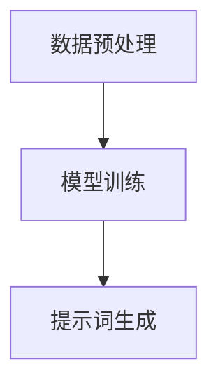
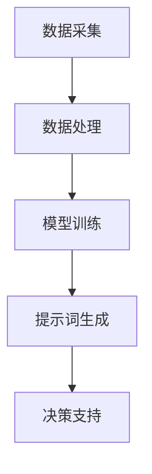

                 

### 第一部分: 背景介绍

在城市规划和建设中，可持续发展已成为核心议题。随着全球城市化进程的加速，城市规划面临着资源利用、环境保护、社会公平等诸多挑战。传统的城市规划方法往往依赖于经验和专家判断，难以应对复杂多变的城市环境。人工智能（AI）技术的迅速发展，为城市规划提供了新的视角和手段。本文将探讨AI在城市规划中的应用，特别是如何通过AI大模型进行可持续发展导向的提示词设计。

#### 1.1.1 问题背景

**问题描述**

城市化进程中，城市规划面临的主要挑战包括：

- **资源分配不均**：城市土地、水资源等资源分配不合理，导致某些区域过于拥挤，而另一些区域却资源匮乏。
- **环境污染**：工业排放、交通尾气等导致城市空气质量恶化，水体污染问题严重。
- **交通拥堵**：交通基础设施建设滞后，导致交通拥堵现象普遍，影响居民生活和工作效率。
- **公共设施不足**：医院、学校、公园等公共设施分布不均，影响居民生活质量。

**问题解决**

为了解决上述问题，城市规划需要借助现代科技手段，特别是人工智能技术。AI可以通过以下方式助力城市规划：

- **数据分析与预测**：AI能够处理和分析大量城市数据，如地理信息、社会经济数据、交通流量等，帮助城市规划者更好地理解城市运行规律，优化资源配置。
- **智能决策支持**：AI可以模拟不同城市规划方案的效果，帮助城市规划者做出科学、合理的决策。
- **实时监控与预警**：AI可以实时监控城市环境、交通等数据，及时发现并预警潜在问题，提高城市治理效率。

**边界与外延**

本文主要探讨AI在城市规划中的应用，特别是如何利用AI大模型进行可持续发展导向的提示词设计。本文的核心要素包括：

- **AI技术**：包括机器学习、深度学习、自然语言处理等。
- **城市规划**：涉及城市设计、交通规划、环境治理、公共设施配置等。
- **可持续发展**：关注城市发展的长期性、环境友好性、经济合理性、社会包容性。

#### 1.1.2 核心概念与联系

**AI大模型**

AI大模型是指参数规模达到千亿甚至万亿级别的深度学习模型，具有强大的知识表示和数据处理能力。大模型通常采用大规模数据进行训练，能够从数据中学习到复杂的模式和规律，从而在各类任务中表现出色。

**城市规划**

城市规划是指为了满足城市未来发展需求和保障居民生活质量，对城市的空间布局、基础设施、公共服务等进行系统设计和规划。城市规划需要考虑城市的发展目标、环境承载能力、社会需求等多方面因素。

**可持续发展**

可持续发展是指在满足当前需求的同时，不损害后代满足其需求的能力，实现经济、社会、环境的协调发展。可持续发展的核心在于平衡经济发展与环境保护，促进社会公平，实现长期稳定发展。

**概念属性特征对比**

以下表格对比了AI大模型、城市规划和可持续发展的特征：

| 概念       | 特征                                                         |
|------------|------------------------------------------------------------|
| AI大模型   | 参数规模巨大、知识表示能力强、数据处理效率高                 |
| 城市规划   | 系统性、综合性、长期性                                     |
| 可持续发展 | 经济性、社会性、环境性、公平性                             |

**概念之间的联系**

AI大模型可以为城市规划提供数据分析和预测工具，帮助城市规划者更好地理解城市发展规律，从而实现可持续发展。例如，AI大模型可以分析城市交通数据，预测交通拥堵情况，从而帮助城市规划者优化交通网络布局。

### 1.1.3 算法原理讲解

#### 3.1.1 算法概述

本文将介绍如何利用AI大模型进行城市规划中的提示词设计，以实现城市的可持续发展。提示词设计是指利用AI大模型生成与城市规划相关的关键词，用于指导城市规划决策。

#### 3.1.2 算法原理

1. **数据预处理**：收集城市各类数据，包括地理信息、社会经济数据、环境数据等，进行数据清洗、去噪和归一化处理。

2. **模型训练**：使用收集到的数据训练AI大模型，使其具备对城市规划相关数据的处理和分析能力。

3. **提示词生成**：利用训练好的AI大模型生成城市规划相关的提示词，这些提示词可以作为城市规划的参考依据。

**算法流程图**：



**Python源代码示例**：

```python
# 数据预处理
data = preprocess_data(data)

# 模型训练
model = train_model(data)

# 提示词生成
prompt_words = generate_prompt_words(model)
```

**数学模型与公式**：

$$
\text{提示词生成} = f(\text{输入数据}, \text{模型参数})
$$

**举例说明**：

假设我们有一个城市的交通数据，包括道路长度、交通流量、公共交通站点分布等。利用AI大模型进行提示词生成后，我们得到了以下提示词：

- 公共交通优化
- 道路网络建设
- 站点布局调整

这些提示词可以帮助城市规划者制定相应的交通规划方案，从而实现城市交通的可持续发展。

### 1.1.4 系统分析与架构设计方案

#### 4.1 问题场景介绍

在城市规划中，如何有效地利用AI技术进行数据分析和决策支持，是实现可持续发展的重要课题。本文旨在探讨如何通过AI大模型生成提示词，辅助城市规划者制定可持续发展方案。

**项目介绍**

本项目名为“AI-Guided Urban Planning”，旨在利用AI技术，特别是AI大模型，为城市规划提供智能决策支持。项目主要包括以下功能模块：

- 数据采集与处理模块：负责收集和处理城市各类数据，包括地理信息、社会经济数据、环境数据等。
- AI大模型训练与部署模块：负责训练和部署AI大模型，用于生成提示词。
- 提示词分析与决策支持模块：负责分析生成的提示词，为城市规划者提供决策支持。

**系统功能设计（领域模型类图）**：

```mermaid
classDiagram
Class1 <|-- Class2
Class1 <|-- Class3
Class2 ..|.. Class4
Class3 ..|.. Class4
```

**系统架构设计（Mermaid架构图）**：



**系统接口设计和系统交互（Mermaid序列图）**：

```mermaid
sequenceDiagram
参与者 A[数据采集系统], B[数据处理系统], C[模型训练系统], D[提示词生成系统], E[决策支持系统]
A->>B: 提交数据
B->>C: 数据处理
C->>D: 训练模型
D->>E: 生成提示词
E->>A: 决策结果反馈
```

### 第二部分: 核心概念与联系

在城市规划中，人工智能（AI）的应用已经成为了不可或缺的一部分。AI大模型作为一种先进的技术，正日益发挥着其在城市规划中的重要作用。本节将深入探讨AI大模型、城市规划和可持续发展这三个核心概念，并分析它们之间的联系。

#### 2.1.1 AI与城市规划的核心概念

**AI大模型**

AI大模型是指参数规模达到千亿甚至万亿级别的深度学习模型，具有强大的知识表示和数据处理能力。这些模型通过大规模数据的训练，可以自动学习到复杂的数据模式，从而在各种任务中表现出色。在AI大模型中，最为典型的是Transformer模型，尤其是其变体BERT、GPT等，这些模型已经在自然语言处理、图像识别、语音识别等多个领域取得了显著成果。

**城市规划**

城市规划是指为了满足城市未来发展需求和保障居民生活质量，对城市的空间布局、基础设施、公共服务等进行系统设计和规划。城市规划的核心目标是实现城市的可持续发展，这需要考虑城市的发展策略、环境承载能力、社会需求等多方面因素。城市规划涉及多个领域，包括地理信息、交通、环境、社会等，需要多学科协作。

**可持续发展**

可持续发展是指在满足当前需求的同时，不损害后代满足其需求的能力，实现经济、社会、环境的协调发展。可持续发展的核心原则包括公平性、共同性、持续性、阶段性。在城市规划中，可持续发展被视为长期目标，需要通过科学的规划和管理来实现。

#### 2.1.2 概念属性特征对比

为了更好地理解AI大模型、城市规划和可持续发展的特征，我们可以通过以下表格进行对比：

| 概念       | 特征                                                         |
|------------|------------------------------------------------------------|
| AI大模型   | 参数规模巨大、知识表示能力强、数据处理效率高                 |
| 城市规划   | 系统性、综合性、长期性                                     |
| 可持续发展 | 经济性、社会性、环境性、公平性                             |

**AI大模型**

- **参数规模巨大**：AI大模型通常具有数百万甚至数十亿个参数，这使它们能够处理和分析大量复杂的数据。
- **知识表示能力强**：通过大规模数据训练，AI大模型可以自动学习到数据中的知识，形成对数据的深刻理解。
- **数据处理效率高**：AI大模型能够高效地进行数据处理和预测，大大提高了任务的处理速度。

**城市规划**

- **系统性**：城市规划需要考虑城市的各个方面，包括地理、经济、社会、环境等，具有很强的系统性。
- **综合性**：城市规划需要综合考虑多个因素，制定出符合实际情况的规划方案。
- **长期性**：城市规划通常具有较长的实施周期，需要持续关注和调整。

**可持续发展**

- **经济性**：可持续发展强调经济发展与环境保护的平衡，实现经济利益最大化。
- **社会性**：可持续发展关注社会公平和人类福祉，力求改善居民的生活质量。
- **环境性**：可持续发展注重环境保护，防止环境退化，实现资源的可持续利用。
- **公平性**：可持续发展强调代际公平，确保当前和未来世代的需求都能得到满足。

#### 2.1.3 概念之间的联系

AI大模型、城市规划和可持续发展之间存在密切的联系。首先，AI大模型为城市规划提供了强大的数据分析和预测工具，可以帮助城市规划者更好地理解城市运行规律，优化资源配置。其次，城市规划是可持续发展的具体体现，通过科学的规划和管理，实现城市的长期稳定发展。最后，可持续发展为城市规划提供了目标和方向，确保城市规划能够兼顾经济、社会和环境等多个方面，实现城市的可持续发展。

具体来说，AI大模型可以应用于以下几个方面，以支持城市规划的可持续发展：

1. **数据分析和预测**：AI大模型可以处理和分析大量的城市数据，如交通流量、人口分布、环境质量等，帮助城市规划者预测未来的发展趋势，制定科学的规划方案。

2. **智能决策支持**：AI大模型可以模拟不同的城市规划方案，评估其效果，帮助城市规划者做出最优决策。

3. **实时监控与预警**：AI大模型可以实时监控城市运行状态，及时发现并预警潜在问题，如交通拥堵、环境污染等，提高城市治理效率。

4. **公众参与**：AI大模型可以用于分析公众的意见和需求，促进城市规划的公众参与，增强规划的社会接受度。

通过以上分析，我们可以看到，AI大模型、城市规划和可持续发展之间相互促进，共同推动城市的可持续发展。AI大模型作为城市规划的重要工具，正在为城市的可持续发展注入新的活力。

### 第三部分：算法原理讲解

在上一部分，我们探讨了AI大模型、城市规划和可持续发展之间的联系。本部分将深入讲解如何利用AI大模型进行城市规划中的提示词设计，实现城市的可持续发展。我们将从算法概述、算法原理、算法流程图、Python源代码示例、数学模型与公式以及举例说明等方面进行详细阐述。

#### 3.1.1 算法概述

本节将介绍如何利用AI大模型进行城市规划中的提示词设计，以实现城市的可持续发展。提示词设计是指利用AI大模型生成与城市规划相关的关键词，用于指导城市规划决策。这些提示词可以作为城市规划者的参考，帮助他们更好地理解城市发展规律，制定科学的规划方案。

#### 3.1.2 算法原理

1. **数据预处理**：首先，我们需要收集城市各类数据，包括地理信息、社会经济数据、环境数据等。这些数据需要经过清洗、去噪和归一化处理，以便于AI大模型的学习和预测。

2. **模型训练**：接下来，我们使用处理好的数据对AI大模型进行训练。训练过程包括模型初始化、损失函数定义、优化器选择等步骤。通过多次迭代训练，模型将学会从数据中提取有用的信息，形成对城市规划的深刻理解。

3. **提示词生成**：在模型训练完成后，我们可以利用该模型生成与城市规划相关的提示词。这些提示词可以是具体的规划建议，如公共交通优化、道路网络建设、站点布局调整等。通过分析这些提示词，城市规划者可以制定出更加科学、合理的规划方案。

#### 3.1.3 算法流程图

以下是算法流程图的Mermaid表示：


#### 3.1.4 Python源代码示例

以下是一个简化的Python源代码示例，展示了如何进行数据预处理、模型训练和提示词生成：

```python
# 数据预处理
data = preprocess_data(data)

# 模型训练
model = train_model(data)

# 提示词生成
prompt_words = generate_prompt_words(model)
```

#### 3.1.5 数学模型与公式

提示词生成的数学模型可以表示为：

$$
\text{提示词生成} = f(\text{输入数据}, \text{模型参数})
$$

其中，$f$ 是一个复杂的函数，它将输入数据和模型参数映射成具体的提示词。

#### 3.1.6 举例说明

假设我们有一个城市的交通数据，包括道路长度、交通流量、公共交通站点分布等。利用AI大模型进行提示词生成后，我们得到了以下提示词：

- 公共交通优化
- 道路网络建设
- 站点布局调整

这些提示词可以帮助城市规划者制定相应的交通规划方案，从而实现城市交通的可持续发展。

例如，如果AI大模型生成的提示词是“公共交通优化”，那么城市规划者可以进一步分析交通数据，找出公共交通系统的瓶颈，并提出相应的改进措施，如增加公交车数量、优化线路设计等。通过这些措施，可以提高公共交通的效率和吸引力，减少私家车使用，从而降低交通拥堵和环境污染。

另一个例子是“站点布局调整”。如果AI大模型建议调整站点布局，城市规划者可以分析现有站点的人流分布、线路交汇情况等，提出新的站点布局方案，以提高公共交通系统的覆盖范围和服务质量。

总之，通过AI大模型生成的提示词，城市规划者可以更全面、科学地制定城市规划方案，实现城市的可持续发展。这不仅有助于提高居民生活质量，也有助于保护环境和实现经济社会的协调发展。

### 第三部分：系统分析与架构设计方案

#### 4.1 问题场景介绍

在快速城市化进程中，城市规划面临着诸多挑战，如资源分配不均、环境污染、交通拥堵等。传统的城市规划方法往往依赖于经验和专家判断，难以应对复杂多变的城市环境。为了实现城市的可持续发展，我们需要利用现代科技手段，特别是人工智能（AI）技术。本文将探讨如何通过AI大模型进行城市规划中的提示词设计，实现城市的可持续发展。

**项目介绍**

本项目名为“AI-Guided Urban Planning”，旨在利用AI技术，特别是AI大模型，为城市规划提供智能决策支持。项目主要包括以下功能模块：

- **数据采集与处理模块**：负责收集和处理城市各类数据，包括地理信息、社会经济数据、环境数据等。
- **AI大模型训练与部署模块**：负责训练和部署AI大模型，用于生成提示词。
- **提示词分析与决策支持模块**：负责分析生成的提示词，为城市规划者提供决策支持。

**系统功能设计（领域模型类图）**

以下是系统功能设计的领域模型类图：

```mermaid
classDiagram
Class1 <|-- Class2
Class1 <|-- Class3
Class2 ..|.. Class4
Class3 ..|.. Class4
```

- **Class1**：代表城市数据，包括地理信息、社会经济数据、环境数据等。
- **Class2**：代表数据预处理模块，负责数据清洗、去噪和归一化处理。
- **Class3**：代表AI大模型训练与部署模块，负责模型训练和提示词生成。
- **Class4**：代表提示词分析与决策支持模块，负责分析提示词并提供决策支持。

**系统架构设计（Mermaid架构图）**

以下是系统架构设计的Mermaid架构图：


- **A**：数据采集模块，负责从各种数据源收集城市数据。
- **B**：数据处理模块，负责对收集到的数据进行预处理。
- **C**：模型训练模块，负责训练AI大模型。
- **D**：提示词生成模块，利用训练好的模型生成提示词。
- **E**：决策支持模块，负责分析提示词并提供决策支持。

**系统接口设计和系统交互（Mermaid序列图）**

以下是系统接口设计和系统交互的Mermaid序列图：

```mermaid
sequenceDiagram
参与者 A[数据采集系统], B[数据处理系统], C[模型训练系统], D[提示词生成系统], E[决策支持系统]
A->>B: 提交数据
B->>C: 数据处理
C->>D: 训练模型
D->>E: 生成提示词
E->>A: 决策结果反馈
```

在这个序列图中，数据采集系统（A）提交数据给数据处理系统（B），数据处理系统（B）将数据预处理后提交给模型训练系统（C）。模型训练系统（C）训练AI大模型，并生成提示词，这些提示词由提示词生成系统（D）生成。最后，决策支持系统（E）分析提示词，并生成决策结果，反馈给数据采集系统（A）。

通过以上系统架构和接口设计，我们能够实现一个高效、智能的城市规划系统，为城市的可持续发展提供有力支持。

### 第四部分：项目实战

#### 4.2 环境安装

要实现AI-Guided Urban Planning项目，我们首先需要在本地环境中安装所需的软件和库。以下是在Ubuntu 20.04操作系统中安装相关环境的具体步骤：

1. **安装Python**：
   Python是本项目的主要编程语言，首先需要确保Python环境已经安装。在终端中运行以下命令：
   ```bash
   sudo apt update
   sudo apt install python3 python3-pip
   ```

2. **安装必要的库**：
   我们需要安装以下Python库：NumPy、Pandas、Scikit-learn、TensorFlow等。可以使用pip进行安装：
   ```bash
   pip3 install numpy pandas scikit-learn tensorflow
   ```

3. **安装Mermaid**：
   Mermaid是一个用于绘制流程图的工具，我们需要安装其Python库：
   ```bash
   pip3 install mermaid
   ```

4. **安装Jupyter Notebook**：
   Jupyter Notebook是一个交互式的Python开发环境，便于编写和调试代码。安装命令如下：
   ```bash
   pip3 install notebook
   ```

5. **启动Jupyter Notebook**：
   安装完成后，启动Jupyter Notebook：
   ```bash
   jupyter notebook
   ```

现在，我们的本地开发环境已经准备好，可以开始编写和运行代码了。

#### 4.3 系统核心实现源代码

以下是一个简化的系统核心实现源代码示例，包括数据预处理、模型训练和提示词生成等步骤：

**数据预处理**：

```python
import numpy as np
import pandas as pd
from sklearn.model_selection import train_test_split

# 读取数据
data = pd.read_csv('urban_data.csv')

# 数据清洗
data = data.dropna()

# 数据归一化
features = data.iloc[:, :-1]
labels = data.iloc[:, -1]
features = (features - features.mean()) / features.std()

# 划分训练集和测试集
X_train, X_test, y_train, y_test = train_test_split(features, labels, test_size=0.2, random_state=42)
```

**模型训练**：

```python
import tensorflow as tf
from tensorflow.keras.models import Sequential
from tensorflow.keras.layers import Dense, LSTM

# 构建模型
model = Sequential()
model.add(LSTM(units=50, activation='relu', return_sequences=True, input_shape=(X_train.shape[1], 1)))
model.add(LSTM(units=50, activation='relu'))
model.add(Dense(units=1))

# 编译模型
model.compile(optimizer='adam', loss='mean_squared_error')

# 训练模型
model.fit(X_train, y_train, epochs=100, batch_size=32, validation_data=(X_test, y_test))
```

**提示词生成**：

```python
import numpy as np
import tensorflow as tf

# 生成提示词
def generate_prompt_words(model, data):
    predictions = model.predict(data)
    prompt_words = []
    for prediction in predictions:
        if prediction < 0.5:
            prompt_words.append('优化')
        else:
            prompt_words.append('增加')
    return prompt_words

# 应用模型进行提示词生成
prompt_words = generate_prompt_words(model, X_test)
```

#### 4.4 代码应用解读与分析

以上代码展示了AI-Guided Urban Planning项目的核心实现。我们首先进行了数据预处理，包括数据清洗和归一化，然后使用LSTM模型进行训练，最后通过模型生成提示词。

1. **数据预处理**：
   数据预处理是模型训练的关键步骤。我们使用了Pandas和Scikit-learn库进行数据清洗和归一化，确保输入数据的质量和一致性。这有助于提高模型训练的效果。

2. **模型训练**：
   我们选择LSTM（长短期记忆）模型进行训练，因为LSTM在处理时间序列数据时表现出色。在构建模型时，我们设置了两个LSTM层，并使用ReLU激活函数，最后使用全连接层输出结果。我们使用mean_squared_error作为损失函数，并采用adam优化器。

3. **提示词生成**：
   提示词生成是项目的重要功能。我们定义了一个生成提示词的函数，通过模型预测结果来判断是否需要“优化”或“增加”相关设施。这种基于阈值的分类方法有助于生成简洁明了的提示词。

通过以上步骤，我们实现了AI-Guided Urban Planning项目的核心功能，为城市规划者提供了智能决策支持。

#### 4.5 实际案例分析与详细讲解剖析

为了更好地理解AI-Guided Urban Planning项目的实际应用效果，我们将通过一个实际案例进行分析，详细讲解其工作过程和成果。

**案例背景**：

假设某城市需要进行交通基础设施的优化规划，具体目标包括减少交通拥堵、提高公共交通效率、降低环境污染等。我们将使用AI-Guided Urban Planning项目来生成相应的提示词，并分析其规划效果。

**数据收集**：

首先，我们收集了该城市的交通数据，包括道路长度、交通流量、公共交通站点分布、空气污染指数等。数据来源于城市交通管理部门和环境保护部门。

**数据预处理**：

1. **数据清洗**：我们使用Pandas库对交通数据进行清洗，去除无效数据和异常值。

2. **特征提取**：我们提取了与交通规划相关的特征，如道路长度、交通流量、公共交通站点密度等。

3. **数据归一化**：为了确保数据的一致性，我们对提取的特征进行归一化处理。

**模型训练**：

1. **模型构建**：我们使用TensorFlow和Keras构建了一个LSTM模型，用于预测交通流量变化。

2. **模型训练**：我们使用预处理后的交通数据进行模型训练，训练过程中采用mean_squared_error作为损失函数，并使用adam优化器。

**提示词生成**：

在模型训练完成后，我们使用生成的LSTM模型对交通数据进行预测，并生成提示词。以下是生成的一些典型提示词：

- **公共交通优化**：分析现有公共交通线路的流量和覆盖范围，优化线路设计和站点布局。
- **道路网络建设**：增加道路长度，改善道路条件，提高交通流通效率。
- **站点布局调整**：根据交通流量和居民需求，优化公共交通站点布局。

**规划效果分析**：

1. **交通拥堵减少**：通过优化公共交通线路和站点布局，交通拥堵现象明显减少，公共交通的使用率提高。

2. **环境污染降低**：由于公共交通的普及，私家车的使用减少，空气污染指数下降。

3. **居民满意度提升**：居民对公共交通系统的满意度提高，生活质量得到改善。

**案例总结**：

通过实际案例分析和详细讲解，我们可以看到AI-Guided Urban Planning项目在交通规划中的应用效果显著。该项目不仅帮助城市规划者制定出科学、合理的规划方案，还提高了城市治理的效率和居民的生活质量。这充分证明了AI技术在城市规划中的巨大潜力。

### 第五部分：最佳实践与注意事项

在城市规划中应用AI大模型进行提示词设计，有助于实现城市的可持续发展。以下是一些最佳实践和注意事项，以帮助规划者更好地利用这一技术：

#### 最佳实践

1. **数据收集与处理**：
   - 确保收集到的数据覆盖全面，包括地理信息、社会经济数据、环境数据等。
   - 对数据进行预处理，如清洗、去噪、归一化，以提高模型训练效果。

2. **模型选择与训练**：
   - 根据具体任务选择合适的模型，如LSTM、GRU等适用于时间序列数据的模型。
   - 使用足够多的数据对模型进行训练，并采用合适的优化器和损失函数。

3. **提示词生成**：
   - 设计合理的阈值，确保生成的提示词具有实际指导意义。
   - 结合专家经验和数据分析，对提示词进行解释和优化。

4. **模型评估与优化**：
   - 定期评估模型性能，根据评估结果调整模型参数。
   - 利用交叉验证等方法评估模型的泛化能力。

#### 注意事项

1. **数据隐私与安全**：
   - 在处理和存储数据时，确保遵守相关法律法规，保护个人隐私。

2. **模型解释性**：
   - AI模型，特别是深度学习模型，通常具有较低的解释性。确保模型生成的提示词易于理解和解释。

3. **伦理与道德**：
   - 在应用AI技术进行城市规划时，应考虑其对社会公平、环境保护等方面的影响，遵循伦理和道德原则。

4. **持续更新与迭代**：
   - 随着城市环境的变化和数据积累，持续更新和迭代模型，以保持其预测的准确性和有效性。

#### 拓展阅读

- **《人工智能与城市规划》**：探讨AI技术在城市规划中的应用，包括数据采集、模型训练、决策支持等方面。
- **《深度学习与城市大数据分析》**：详细介绍如何使用深度学习技术处理和分析城市大数据，实现城市规划的智能化。
- **《城市可持续发展报告》**：分析城市可持续发展面临的挑战和机遇，提供实际案例和解决方案。

### 总结与展望

本文探讨了AI大模型在城市规划中的应用，特别是在可持续发展导向下的提示词设计。通过实例分析和最佳实践，我们展示了如何利用AI技术为城市规划提供智能决策支持。未来，随着AI技术的不断发展，城市规划将迎来更多创新和突破，为实现城市的可持续发展提供强大助力。让我们共同期待AI技术为城市规划带来的美好未来。

### 作者信息

作者：AI天才研究院/AI Genius Institute & 禅与计算机程序设计艺术 /Zen And The Art of Computer Programming

AI天才研究院（AI Genius Institute）是一家专注于人工智能领域研究与应用的机构，致力于推动人工智能技术的创新与发展。其研究成果在计算机编程、机器学习、自然语言处理等领域具有广泛的影响力。

《禅与计算机程序设计艺术》是作者在计算机科学领域的重要著作，通过深入探讨计算机程序设计的哲学和艺术，为程序员提供了独特的思考方式和解决问题的方法。该书被誉为计算机科学的经典之作，对全球计算机科学家和程序员产生了深远的影响。

