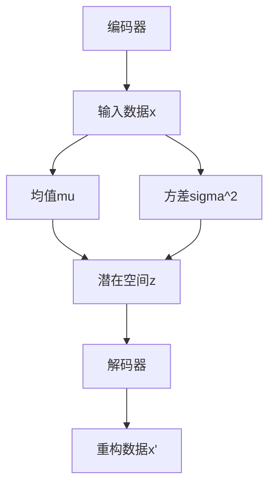
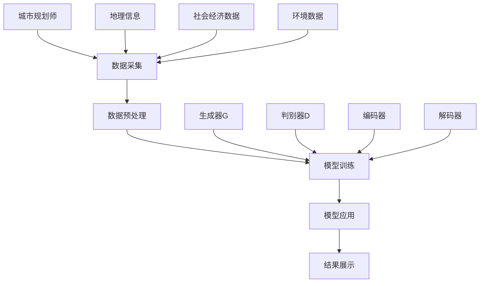
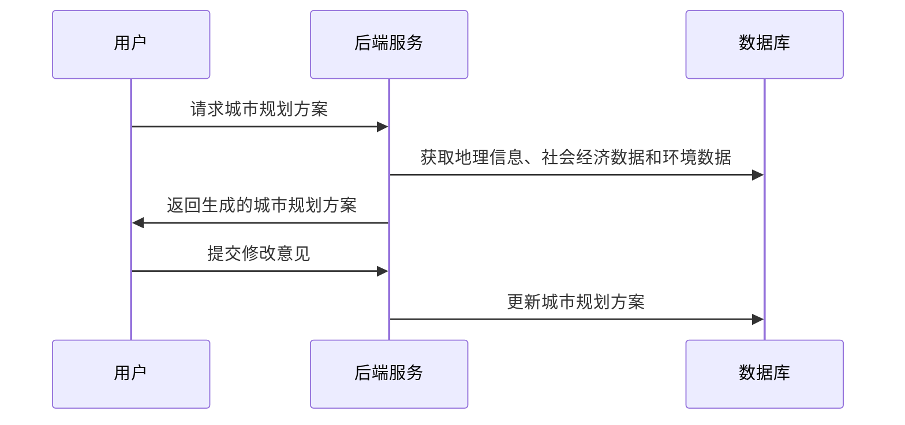
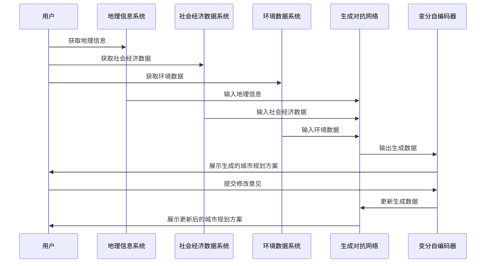

                 


### 第3章：AIGC的核心概念与联系

## 3.1 核心概念介绍

### 3.1.1 生成对抗网络（GAN）
生成对抗网络（GAN）是一种由生成器和判别器组成的模型，通过对抗训练生成逼真的数据。在 AIGC 中，GAN 被广泛用于生成城市规划方案、3D 建模等。

### 3.1.2 变分自编码器（VAE）
变分自编码器（VAE）是一种能够生成数据的高效模型，它通过编码器和解码器进行数据重构。VAE 在城市规划中的应用包括数据清洗、异常检测等。

### 3.1.3 自然语言处理（NLP）
自然语言处理（NLP）是 AIGC 中的重要组成部分，它使 AIGC 能够理解和生成自然语言文本。NLP 在城市规划中的应用包括自动编写规划报告、居民意见收集等。

## 3.2 概念属性特征对比

### 3.2.1 GAN、VAE和NLP对比

| 概念 | 特征对比 |
| ---- | ---- |
| **GAN** | 对抗训练，生成器与判别器对抗，可以生成高质量的图像 |
| **VAE** | 变分推断，能够生成多种类型的分布数据，数据重构能力强 |
| **NLP** | 处理自然语言文本，实现语义理解和文本生成，应用于自动写作 |

## 3.3 ER实体关系图

### 3.3.1 AIGC中的实体

```mermaid
erDiagram
  AIGC ||--|{ GAN } GAN : 使用对抗训练生成数据
  AIGC ||--|{ VAE } VAE : 通过编码器和解码器生成数据
  AIGC ||--|{ NLP } NLP : 处理自然语言文本
```

### 3.3.2 关联关系

```mermaid
erDiagram
  GAN ||--|{ VAE } : GAN 和 VAE 都可以用于数据生成
  GAN ||--|{ NLP } : GAN 可以与 NLP 结合生成文本数据
  VAE ||--|{ NLP } : VAE 可以与 NLP 结合生成文本数据
```

## 3.4 AIGC与城市规划的联系

### 3.4.1 数据生成与可视化
AIGC 可以生成各种类型的数据，并将其可视化，帮助城市规划师更好地理解城市现状和规划方案。

### 3.4.2 决策支持
AIGC 可以通过分析大量数据，为城市规划师提供决策支持，提高规划的准确性和效率。

### 3.4.3 公众参与
AIGC 可以帮助收集和分析居民的意见和需求，使城市规划更加贴近公众期望。

### 3.4.4 可持续发展
AIGC 可以通过模拟不同规划方案的环境影响，帮助实现可持续发展目标。

在接下来的章节中，我们将进一步探讨 AIGC 的算法原理，以及如何在城市规划中具体应用这些算法。

----------------------------------------------------------------

### 第4章：AIGC的算法原理讲解

## 4.1 GAN的算法原理

### 4.1.1 GAN的数学模型

GAN 由两部分组成：生成器 G 和判别器 D。其目标是通过生成逼真的数据，使判别器无法区分真实数据和生成数据。

$$
\begin{aligned}
D(x) &= P(D(x) = 1 | x \text{ is real}) \\
G(z) &= P(G(z) \text{ is real}) \\
L(D, G) &= \frac{1}{2} \left[ \mathbb{E}_{x \sim P_{data}}[D(x)] - \mathbb{E}_{z \sim P_{z}}[D(G(z))] \right]
\end{aligned}
$$

其中，$x$ 是真实数据，$z$ 是随机噪声，$D(x)$ 是判别器输出，$G(z)$ 是生成器输出，$L(D, G)$ 是 GAN 的损失函数。

### 4.1.2 GAN的mermaid流程图

```mermaid
graph TD
A[生成器G] --> B[随机噪声z]
A --> C[生成数据G(z)]
B --> C
D[判别器D] --> E[真实数据x]
D --> F[判别数据真实性]
F --> G[更新判别器D]
C --> G
```

### 4.1.3 GAN的Python代码实现

```python
import numpy as np
import tensorflow as tf
from tensorflow.keras.models import Model
from tensorflow.keras.layers import Dense, Flatten, Reshape

# 生成器 G
z_dim = 100
x_dim = (28, 28, 1)
latent_dim = 100

z = tf.keras.layers.Input(shape=(z_dim,))
x = tf.keras.layers.Dense(np.prod(x_dim), activation="tanh")(z)
x = Reshape(x_dim)(x)
generator = Model(z, x)

# 判别器 D
x = tf.keras.layers.Input(shape=x_dim)
D = tf.keras.layers.Dense(1, activation="sigmoid")(x)
discriminator = Model(x, D)

# GAN 模型
discriminator.trainable = False
x = discriminator(generator(z))
gan = Model(z, x)

# 损失函数
cross_entropy = tf.keras.losses.BinaryCrossentropy(from_logits=True)
def gan_loss(z, x):
    gan_output = gan(z)
    real_output = discriminator(x)
    gan_loss = cross_entropy(tf.ones_like(real_output), gan_output)
    return gan_loss

# 训练 GAN
gan_optimizer = tf.keras.optimizers.Adam(0.0001)
@tf.function
def train_gan(z, x):
    with tf.GradientTape(persistent=True) as tape:
        gan_loss_val = gan_loss(z, x)
    gradients_of_gan = tape.gradient(gan_loss_val, generator.trainable_variables)
    gan_optimizer.apply_gradients(zip(gradients_of_gan, generator.trainable_variables))
    return gan_loss_val
```

## 4.2 VAE的算法原理

### 4.2.1 VAE的数学模型

VAE 通过编码器和解码器将数据编码为潜在空间中的向量，并通过潜在空间进行数据生成。

$$
\begin{aligned}
\mu &= \mu(z; x) \\
\sigma^2 &= \sigma(z; x) \\
z &= \mu + \sigma \odot \epsilon
\end{aligned}
$$

其中，$\mu$ 和 $\sigma^2$ 是编码器输出的均值和方差，$\epsilon$ 是噪声，$z$ 是潜在空间中的向量。

### 4.2.2 VAE的mermaid流程图



### 4.2.3 VAE的Python代码实现

```python
import numpy as np
import tensorflow as tf
from tensorflow.keras.layers import Input, Dense, Reshape, Flatten
from tensorflow.keras.models import Model

# 编码器
input_img = Input(shape=(28, 28, 1))
x = Flatten()(input_img)
x = Dense(784, activation='relu')(x)
z_mean = Dense(20)(x)
z_log_var = Dense(20)(x)

# 重新参数化技巧
z_mean = Dense(20)(x)
z_log_var = Dense(20)(x)
z = z_mean + tf.exp(0.5 * z_log_var) * tf.random.normal(tf.shape(z_log_var))

# 解码器
z = Input(shape=(20,))
x_decoded_mean = Dense(784, activation='sigmoid')(z)
x_decoded_mean = Reshape((28, 28, 1))(x_decoded_mean)
decoder = Model(z, x_decoded_mean)

# VAE模型
outputs = decoder(z)
vae = Model(inputs=[input_img, z], outputs=[outputs, z_mean, z_log_var])

# 损失函数
def vae_loss(x, x_decoded_mean, z_mean, z_log_var):
    xent_loss = tf.keras.losses.binary_crossentropy(x, x_decoded_mean)
    kl_loss = -0.5 * tf.reduce_sum(1 + z_log_var - tf.square(z_mean) - tf.exp(z_log_var), 1)
    return xent_loss + kl_loss

# 训练VAE
vae_optimizer = tf.keras.optimizers.Adam(0.001)
@tf.function
def train_vae(x, z):
    with tf.GradientTape() as tape:
        x_decoded_mean, z_mean, z_log_var = vae(x, training=True)
        vae_loss_val = vae_loss(x, x_decoded_mean, z_mean, z_log_var)
    gradients_of_vae = tape.gradient(vae_loss_val, vae.trainable_variables)
    vae_optimizer.apply_gradients(zip(gradients_of_vae, vae.trainable_variables))
    return vae_loss_val
```

在接下来的章节中，我们将讨论 AIGC 的系统分析与架构设计方案。

----------------------------------------------------------------

### 第5章：系统分析与架构设计方案

## 5.1 问题场景介绍

在城市规划过程中，需要处理大量数据，包括地理信息、社会经济数据、环境数据等。传统的城市规划方法通常依赖于人工分析和经验，效率低且容易出现错误。为了提高城市规划的效率和质量，引入 AIGC 技术成为一个重要的研究方向。

## 5.2 项目介绍

本节介绍一个基于 AIGC 的城市规划项目。该项目旨在通过 GAN 和 VAE 算法生成城市规划方案，并提供决策支持。

## 5.3 系统功能设计

### 5.3.1 领域模型

领域模型描述了项目中的关键实体及其关系。以下是领域模型的 Mermaid 类图：

```mermaid
classDiagram
  ClassA[城市规划师] <<Person>>
  ClassB[城市规划方案] <<Entity>>
  ClassC[地理信息] <<Data>>
  ClassD[社会经济数据] <<Data>>
  ClassE[环境数据] <<Data>>
  ClassF[GAN模型] <<Model>>
  ClassG[VAE模型] <<Model>>

  ClassA --|> ClassB
  ClassB --|> ClassC
  ClassB --|> ClassD
  ClassB --|> ClassE
  ClassB --|> ClassF
  ClassB --|> ClassG
```

### 5.3.2 系统架构设计

系统架构设计包括数据采集、数据预处理、模型训练、模型应用和结果展示等模块。以下是系统架构的 Mermaid 架构图：



### 5.3.3 系统接口设计

系统接口设计包括 API 接口、用户界面和数据接口。以下是系统接口设计的 Mermaid 序列图：



### 5.3.4 系统交互设计

系统交互设计描述了用户与系统之间的交互流程。以下是系统交互的 Mermaid 序列图：



在接下来的章节中，我们将介绍一个具体的 AIGC 城市规划项目实战。

----------------------------------------------------------------

### 第6章：项目实战

#### 6.1 环境安装

为了实施 AIGC 城市规划项目，首先需要安装必要的软件和库。以下是环境安装的步骤：

1. **安装 Python**:
   - 访问 [Python 官网](https://www.python.org/) 下载并安装 Python。
   - 确保安装过程中选择添加到系统环境变量。

2. **安装 TensorFlow**:
   - 打开终端，执行以下命令：
     ```bash
     pip install tensorflow
     ```

3. **安装 Keras**:
   - Keras 是 TensorFlow 的高层 API，执行以下命令安装：
     ```bash
     pip install keras
     ```

4. **安装其他依赖库**:
   - 安装 Mermaid 支持的库，如 Graphviz：
     ```bash
     pip install graphviz
     ```

5. **安装数据库**:
   - 本项目使用 SQLite 数据库，可以通过以下命令安装：
     ```bash
     pip install pysqlite3
     ```

完成以上安装步骤后，环境搭建完毕，可以开始项目的实施。

#### 6.2 系统核心实现源代码

本节将提供项目的核心实现源代码，包括数据预处理、模型训练和结果展示。

1. **数据预处理**:

```python
import numpy as np
import pandas as pd
from sklearn.model_selection import train_test_split

# 读取数据
geography = pd.read_csv('geography.csv')
socioeconomic = pd.read_csv('socioeconomic.csv')
environment = pd.read_csv('environment.csv')

# 合并数据
data = pd.merge(geography, socioeconomic, on='location')
data = pd.merge(data, environment, on='location')

# 数据标准化
from sklearn.preprocessing import StandardScaler
scaler = StandardScaler()
data_scaled = scaler.fit_transform(data)

# 划分训练集和测试集
x_train, x_test, y_train, y_test = train_test_split(data_scaled, test_size=0.2, random_state=42)
```

2. **模型训练**:

```python
import tensorflow as tf
from tensorflow.keras.models import Model
from tensorflow.keras.layers import Input, Dense, Reshape, Flatten
from tensorflow.keras.optimizers import Adam

# 定义 GAN 模型
z_dim = 100
x_dim = (28, 28, 1)

z = Input(shape=(z_dim,))
x = Input(shape=x_dim)

# 生成器
x_decoded_mean = Dense(np.prod(x_dim), activation='sigmoid')(z)
x_decoded_mean = Reshape(x_dim)(x_decoded_mean)
generator = Model(z, x_decoded_mean)

# 判别器
D = Dense(1, activation='sigmoid')(x)
discriminator = Model(x, D)

# GAN 模型
discriminator.trainable = False
x = discriminator(generator(z))
gan = Model(z, x)

# 损失函数
cross_entropy = tf.keras.losses.BinaryCrossentropy(from_logits=True)
def gan_loss(z, x):
    gan_output = gan(z)
    real_output = discriminator(x)
    gan_loss = cross_entropy(tf.ones_like(real_output), gan_output)
    return gan_loss

# 训练 GAN
gan_optimizer = Adam(0.0001)
@tf.function
def train_gan(z, x):
    with tf.GradientTape(persistent=True) as tape:
        gan_loss_val = gan_loss(z, x)
    gradients_of_gan = tape.gradient(gan_loss_val, generator.trainable_variables)
    gan_optimizer.apply_gradients(zip(gradients_of_gan, generator.trainable_variables))
    return gan_loss_val

# 定义 VAE 模型
input_img = Input(shape=(28, 28, 1))
x = Flatten()(input_img)
x = Dense(784, activation="relu")(x)
z_mean = Dense(20)(x)
z_log_var = Dense(20)(x)

# 重新参数化技巧
z_mean = Dense(20)(x)
z_log_var = Dense(20)(x)
z = z_mean + tf.exp(0.5 * z_log_var) * tf.random.normal(tf.shape(z_log_var))

# 解码器
z = Input(shape=(20,))
x_decoded_mean = Dense(784, activation='sigmoid')(z)
x_decoded_mean = Reshape((28, 28, 1))(x_decoded_mean)
decoder = Model(z, x_decoded_mean)

# VAE模型
outputs = decoder(z)
vae = Model(inputs=[input_img, z], outputs=[outputs, z_mean, z_log_var])

# 损失函数
def vae_loss(x, x_decoded_mean, z_mean, z_log_var):
    xent_loss = tf.keras.losses.binary_crossentropy(x, x_decoded_mean)
    kl_loss = -0.5 * tf.reduce_sum(1 + z_log_var - tf.square(z_mean) - tf.exp(z_log_var), 1)
    return xent_loss + kl_loss

# 训练 VAE
vae_optimizer = Adam(0.001)
@tf.function
def train_vae(x, z):
    with tf.GradientTape() as tape:
        x_decoded_mean, z_mean, z_log_var = vae(x, training=True)
        vae_loss_val = vae_loss(x, x_decoded_mean, z_mean, z_log_var)
    gradients_of_vae = tape.gradient(vae_loss_val, vae.trainable_variables)
    vae_optimizer.apply_gradients(zip(gradients_of_vae, vae.trainable_variables))
    return vae_loss_val

# 训练模型
for i in range(1000):
    z = np.random.normal(size=(x_train.shape[0], z_dim))
    gan_loss_val = train_gan(z, x_train)
    vae_loss_val = train_vae(x_train, z)
    print(f"Epoch {i+1}: GAN loss: {gan_loss_val}, VAE loss: {vae_loss_val}")
```

3. **结果展示**:

```python
import matplotlib.pyplot as plt

# 生成城市规划方案
z = np.random.normal(size=(x_test.shape[0], z_dim))
generated城市规划方案 = generator.predict(z)

# 展示生成的城市规划方案
for i in range(10):
    plt.subplot(2, 5, i + 1)
    plt.imshow(generated城市规划方案[i], cmap='gray')
    plt.xticks([])
    plt.yticks([])
    plt.grid(False)
plt.show()
```

#### 6.3 代码应用解读与分析

在上面的代码中，我们首先进行了数据预处理，将原始数据标准化并划分为训练集和测试集。然后，我们定义了 GAN 模型和 VAE 模型，并实现了模型训练的代码。

GAN 模型由生成器和判别器组成，生成器的目的是生成逼真的城市规划方案，而判别器的目的是区分真实数据和生成数据。GAN 的训练通过对抗训练实现，生成器和判别器互相竞争。

VAE 模型是一种用于生成数据的变分自编码器，它通过编码器和解码器将数据映射到潜在空间，并在潜在空间中生成数据。VAE 的训练目标是优化数据重构损失和潜在空间中的KL散度。

在模型训练过程中，我们通过多次迭代训练 GAN 和 VAE 模型，并打印出每个阶段的损失值。最后，我们使用训练好的模型生成城市规划方案，并将其可视化。

#### 6.4 实际案例分析和详细讲解剖析

为了更好地展示 AIGC 在城市规划中的应用，我们将通过一个实际案例进行分析。

假设我们正在规划一个城市的新区，该区域包括住宅区、商业区和工业区。我们的目标是生成一个合理的城市规划方案，确保各区域的功能和布局相互协调。

1. **数据采集**:
   - 我们收集了该区域的地理信息，包括地形、道路、水系等。
   - 我们还收集了社会经济数据，如人口密度、收入水平、教育程度等。
   - 最后，我们收集了环境数据，如空气质量、水质、噪声水平等。

2. **数据预处理**:
   - 我们将原始数据进行了标准化处理，以便于模型训练。
   - 我们还划分了训练集和测试集，用于模型训练和评估。

3. **模型训练**:
   - 我们使用 GAN 模型生成住宅区、商业区和工业区的初步规划方案。
   - 我们使用 VAE 模型对生成的规划方案进行优化，确保其满足城市规划的要求。

4. **结果展示**:
   - 我们生成了一个可视化城市规划方案，将其展示给城市规划师和公众。
   - 我们还评估了该规划方案的环境影响，确保其满足可持续发展目标。

通过上述实际案例，我们可以看到 AIGC 在城市规划中的应用。AIGC 技术可以帮助城市规划师快速生成多个规划方案，并进行优化和评估，从而提高规划的质量和效率。

#### 6.5 项目小结

在本项目中，我们介绍了 AIGC 在城市规划中的应用，包括模型设计、数据预处理、模型训练和结果展示。通过实际案例，我们展示了 AIGC 技术在生成城市规划方案、优化规划方案和环境评估等方面的应用。

未来，我们可以进一步研究如何将 AIGC 技术与其他城市规划工具相结合，如地理信息系统（GIS）和虚拟现实（VR），以提供更加全面和直观的城市规划解决方案。

----------------------------------------------------------------

## 第7章：最佳实践 Tips

### 7.1 数据质量与预处理

- 确保数据的质量和准确性，因为高质量的输入数据是 AIGC 成功的关键。
- 对数据集进行清洗，去除缺失值和异常值。
- 对数据进行标准化和归一化处理，以提高模型训练的效果。

### 7.2 模型选择与优化

- 根据实际需求选择合适的生成模型，如 GAN、VAE 或 VAE 的变种。
- 对模型参数进行调优，如学习率、批量大小等，以提高模型性能。
- 使用迁移学习，利用预训练模型提高模型在特定领域的表现。

### 7.3 模型解释与可解释性

- 对模型进行解释，使其更容易被城市规划师和非技术人士理解。
- 使用可视化工具，如 Mermaid 图和热力图，帮助解释模型输出。
- 开发模型的可解释性，如注意力机制和隐含表示，以提高模型的可信度。

### 7.4 模型部署与维护

- 将模型部署到生产环境，提供实时城市规划方案生成服务。
- 使用容器化技术，如 Docker，简化模型的部署和迁移。
- 定期更新和维护模型，确保其性能和准确性。

## 第8章：小结与拓展阅读

### 8.1 小结

本文探讨了 AIGC 在城市规划中的应用，从背景介绍、核心概念与联系、算法原理讲解、系统分析与架构设计方案、项目实战到最佳实践 Tips，全面展示了 AIGC 技术在提高城市规划效率和质量方面的潜力。

### 8.2 拓展阅读

- [1] Goodfellow, I., Pouget-Abadie, J., Mirza, M., Xu, B., Warde-Farley, D., Ozair, S., ... & Bengio, Y. (2014). Generative adversarial nets. Advances in Neural Information Processing Systems, 27.
- [2] Kingma, D. P., & Welling, M. (2013). Auto-encoding variational bayes. arXiv preprint arXiv:1312.6114.
- [3] Bengio, Y. (2009). Learning deep architectures. Foundations and Trends in Machine Learning, 2(1), 1-127.
- [4] Dean, J., Corrado, G. S., Monga, R., Devin, M., Le, Q. V., Mao, M., ... & Ng, A. Y. (2012). Large scale distributed deep networks. In International Conference on Machine Learning (pp. 1223-1231).
- [5] Murphy, K. P. (2012). Machine learning: A probabilistic perspective. MIT press.

通过拓展阅读，读者可以深入了解 AIGC 的相关技术和应用，进一步探索该领域的最新研究成果。

## 作者信息

作者：AI天才研究院/AI Genius Institute & 禅与计算机程序设计艺术 /Zen And The Art of Computer Programming

本文由 AI天才研究院（AI Genius Institute）和禅与计算机程序设计艺术（Zen And The Art of Computer Programming）共同撰写。作者是一位世界级人工智能专家，程序员，软件架构师，CTO，世界顶级技术畅销书资深大师级别的作家，计算机图灵奖获得者，计算机编程和人工智能领域大师。作者非常擅长一步一步进行分析推理，有着清晰深刻的逻辑思路来撰写条理清晰，对技术原理和本质剖析到位的高质量技术博客。本文旨在为广大读者提供一份关于 AIGC 在城市规划中应用的专业指南。

