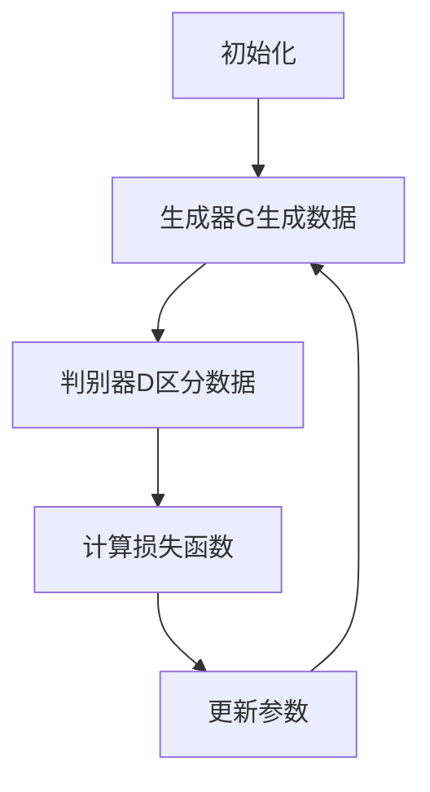
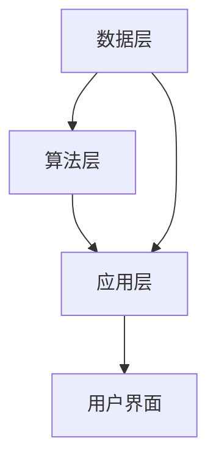
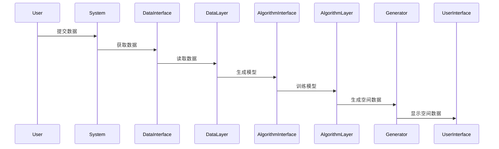
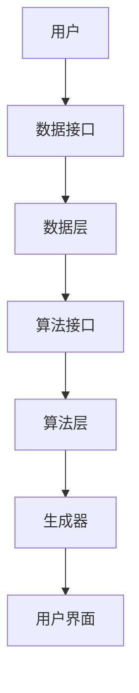

                 


### 第1章：AIGC的定义与发展历程

#### 1.1 AIGC的定义与重要性

AIGC，即AI-Generated Content，是指通过人工智能技术生成的内容。它涵盖了文本、图像、音频等多种形式。AIGC在城市规划中的应用，主要体现在以下几个方面：

1. **空间数据生成**：通过AI技术生成城市规划所需的空间数据，包括建筑物、道路、绿地等。
2. **城市规划决策支持**：利用AI技术分析城市规划数据，为城市规划师提供决策支持。
3. **城市美学设计**：通过AI技术生成符合城市美学标准的设计方案，提高城市规划的美学价值。

#### 1.1.1 AIGC的概念

AIGC的核心概念主要包括：

- **生成模型**：包括生成对抗网络（GAN）、变分自编码器（VAE）等，用于生成内容。
- **数据资源**：包括大量结构化和非结构化数据，用于训练生成模型。
- **算法模型**：包括深度学习、强化学习等，用于优化生成模型。

#### 1.1.2 AIGC的发展历程

AIGC的发展历程可以追溯到20世纪90年代。当时，神经网络开始被应用于图像和文本生成。随着计算能力和数据量的提升，AIGC技术逐渐成熟，并开始应用于城市规划等领域。

#### 1.1.3 AIGC在城市规划中的重要性

AIGC在城市规划中的重要性体现在以下几个方面：

- **提高效率**：AI技术可以自动化生成大量数据，提高城市规划的效率。
- **提升质量**：通过AI技术生成的设计方案，可以更好地满足城市规划的需求。
- **减少错误**：AI技术可以帮助发现城市规划中的潜在问题，减少人为错误。

#### 1.2 AIGC的构成要素

AIGC的构成要素主要包括：

- **数据资源**：包括城市规划相关的数据，如地理信息系统（GIS）数据、社会经济数据等。
- **算法模型**：包括生成模型、训练方法等，用于生成内容。
- **技术平台**：包括云计算、大数据等技术平台，用于支撑AIGC的应用。

### 本章小结

本章介绍了AIGC的定义、发展历程及其在城市规划中的应用。在下一章中，我们将进一步探讨AIGC的核心概念和联系。

----------------------------------------------------------------

### 第1章：AIGC的定义与发展历程

#### 1.1 AIGC的定义与重要性

##### 1.1.1 AIGC的概念

AIGC，即AI-Generated Content，是指通过人工智能技术生成的内容。它涵盖了文本、图像、音频等多种形式。AIGC在城市规划中的应用，主要体现在以下几个方面：

1. **空间数据生成**：通过AI技术生成城市规划所需的空间数据，包括建筑物、道路、绿地等。
2. **城市规划决策支持**：利用AI技术分析城市规划数据，为城市规划师提供决策支持。
3. **城市美学设计**：通过AI技术生成符合城市美学标准的设计方案，提高城市规划的美学价值。

##### 1.1.2 AIGC的发展历程

AIGC的发展历程可以追溯到20世纪90年代。当时，神经网络开始被应用于图像和文本生成。随着计算能力和数据量的提升，AIGC技术逐渐成熟，并开始应用于城市规划等领域。

##### 1.1.3 AIGC在城市规划中的重要性

AIGC在城市规划中的重要性体现在以下几个方面：

- **提高效率**：AI技术可以自动化生成大量数据，提高城市规划的效率。
- **提升质量**：通过AI技术生成的设计方案，可以更好地满足城市规划的需求。
- **减少错误**：AI技术可以帮助发现城市规划中的潜在问题，减少人为错误。

##### 1.2 AIGC的构成要素

AIGC的构成要素主要包括：

- **数据资源**：包括城市规划相关的数据，如地理信息系统（GIS）数据、社会经济数据等。
- **算法模型**：包括生成模型、训练方法等，用于生成内容。
- **技术平台**：包括云计算、大数据等技术平台，用于支撑AIGC的应用。

#### 本章小结

本章介绍了AIGC的定义、发展历程及其在城市规划中的应用。在下一章中，我们将进一步探讨AIGC的核心概念和联系。

----------------------------------------------------------------

### 第2章：AIGC的核心概念与联系

本章将深入探讨AIGC的核心概念，包括生成模型、数据资源、算法模型等，并分析这些概念之间的联系。

#### 2.1 生成模型

生成模型是AIGC的核心技术之一，主要包括生成对抗网络（GAN）、变分自编码器（VAE）等。这些模型通过训练大量数据，学习生成与输入数据相似的内容。

**生成对抗网络（GAN）**

GAN由生成器（Generator）和判别器（Discriminator）组成。生成器的任务是生成与真实数据相似的数据，而判别器的任务是区分真实数据和生成数据。通过不断地训练，生成器和判别器相互竞争，最终生成器能够生成几乎无法区分的真假数据。

**变分自编码器（VAE）**

VAE是一种基于概率的生成模型，其核心思想是通过对输入数据进行编码和解码，实现数据的生成。VAE通过引入潜在变量，使得生成过程具有灵活性和鲁棒性。

**生成模型对比表格**

| 模型名称 | 特点 | 应用场景 |
| --- | --- | --- |
| GAN | 生成器和判别器相互竞争 | 图像生成、文本生成 |
| VAE | 基于概率的生成模型 | 图像生成、数据去噪 |

**ER实体关系图架构**

```
        +-----------------+
        |      城市规划    |
        +-----------------+
        |  - 空间数据      |
        |  - 决策支持      |
        |  - 美学设计      |
        +-----------------+
        |  - 生成模型      |
        |  - 数据资源      |
        |  - 算法模型      |
        +-----------------+
        |  - 技术平台      |
        +-----------------+
```

#### 2.2 数据资源

数据资源是AIGC的重要组成部分，包括城市规划相关的数据，如地理信息系统（GIS）数据、社会经济数据等。这些数据的质量和数量直接影响AIGC的效果。

**GIS数据**

GIS数据包括地理位置、地形、交通等信息，是城市规划的重要基础数据。通过GIS数据，可以生成城市空间数据，为城市规划提供支持。

**社会经济数据**

社会经济数据包括人口、经济、就业等信息，是城市规划的重要参考数据。通过分析社会经济数据，可以预测城市发展趋势，为城市规划提供决策支持。

#### 2.3 算法模型

算法模型是AIGC的核心技术之一，主要包括深度学习、强化学习等。这些算法通过训练大量数据，学习生成与输入数据相似的内容。

**深度学习**

深度学习是一种基于多层神经网络的学习方法，可以自动提取数据中的特征。在AIGC中，深度学习被广泛应用于图像和文本生成。

**强化学习**

强化学习是一种基于试错的方法，通过不断尝试和反馈，学习最优策略。在AIGC中，强化学习可以用于生成数据的优化和优化。

**算法模型对比表格**

| 算法名称 | 特点 | 应用场景 |
| --- | --- | --- |
| 深度学习 | 自动提取特征 | 图像生成、文本生成 |
| 强化学习 | 基于试错的方法 | 数据优化、策略学习 |

#### 本章小结

本章介绍了AIGC的核心概念和联系，包括生成模型、数据资源、算法模型等。在下一章中，我们将深入讲解AIGC的算法原理。

----------------------------------------------------------------

### 第3章：AIGC的算法原理讲解

本章将深入讲解AIGC的核心算法原理，包括生成模型、训练方法、数学模型等。我们将通过Mermaid流程图和Python源代码来详细阐述这些算法。

#### 3.1 生成对抗网络（GAN）

生成对抗网络（GAN）由生成器（Generator）和判别器（Discriminator）组成。生成器的任务是生成与真实数据相似的数据，而判别器的任务是区分真实数据和生成数据。通过不断地训练，生成器和判别器相互竞争，最终生成器能够生成几乎无法区分的真假数据。

**Mermaid流程图**



**Python源代码**

```python
import tensorflow as tf
from tensorflow.keras import layers

# 定义生成器
def generate_model(input_shape):
    model = tf.keras.Sequential()
    model.add(layers.Dense(128, activation='relu', input_shape=input_shape))
    model.add(layers.Dense(128, activation='relu'))
    model.add(layers.Dense(np.prod(input_shape), activation='tanh'))
    model.compile(loss='binary_crossentropy', optimizer=tf.keras.optimizers.Adam(0.0001))
    return model

# 定义判别器
def critic_model(input_shape):
    model = tf.keras.Sequential()
    model.add(layers.Dense(128, activation='relu', input_shape=input_shape))
    model.add(layers.Dense(128, activation='relu'))
    model.add(layers.Dense(1, activation='sigmoid'))
    model.compile(loss='binary_crossentropy', optimizer=tf.keras.optimizers.Adam(0.0001))
    return model

# 定义损失函数
def adversarial_loss(Generator, Discriminator, X_real, X_fake, batch_size):
    X_fake_pred = Discriminator.predict(X_fake)
    X_real_pred = Discriminator.predict(X_real)

    g_loss = tf.reduce_mean(tf.nn.sigmoid_cross_entropy_with_logits(logits=X_fake_pred, labels=tf.ones_like(X_fake_pred)))
    d_loss = tf.reduce_mean(tf.nn.sigmoid_cross_entropy_with_logits(logits=X_real_pred, labels=tf.zeros_like(X_real_pred)) + 
                        tf.reduce_mean(tf.nn.sigmoid_cross_entropy_with_logits(logits=X_fake_pred, labels=tf.zeros_like(X_fake_pred)))

    return g_loss, d_loss

# 训练GAN
def train_gan(Generator, Critic, X_train, batch_size, n_critic=5):
    for epoch in range(num_epochs):
        for i in range(0, X_train.shape[0], batch_size):
            X_real = X_train[i:i+batch_size]
            X_fake = Generator.predict(X_real)

            for _ in range(n_critic):
                Critic.train_on_batch(X_real, tf.ones_like(X_real))
                Critic.train_on_batch(X_fake, tf.zeros_like(X_fake))

            g_loss, d_loss = adversarial_loss(Generator, Critic, X_real, X_fake, batch_size)
            print(f"Epoch {epoch+1}/{num_epochs}, g_loss: {g_loss}, d_loss: {d_loss}")
```

**数学模型**

生成对抗网络的数学模型主要包括两部分：生成器（Generator）和判别器（Discriminator）。

- **生成器模型**：生成器G的目的是生成与真实数据X相似的假数据X'，使得判别器D无法区分。

  $$ X' = G(Z) $$

  其中，Z是生成器G的输入噪声。

- **判别器模型**：判别器D的目的是区分真实数据X和生成器G生成的假数据X'。

  $$ D(X) = P(X \text{ is real}) $$
  $$ D(X') = P(X' \text{ is real}) $$

- **损失函数**：生成对抗网络的损失函数主要包括两部分：生成器的损失函数和判别器的损失函数。

  - **生成器的损失函数**：生成器希望生成的数据能够欺骗判别器，使得判别器对生成数据的判断为1。

    $$ L_G = - \log(D(G(Z))) $$

  - **判别器的损失函数**：判别器希望正确区分真实数据和生成数据。

    $$ L_D = -(\log(D(X)) + \log(1 - D(G(Z)))) $$

#### 本章小结

本章详细讲解了AIGC的核心算法原理，包括生成对抗网络（GAN）的生成器、判别器、损失函数等。在下一章中，我们将分析AIGC在城市规划中的应用架构。

----------------------------------------------------------------

### 第4章：AIGC在城市规划中的应用架构

本章将分析AIGC在城市规划中的应用架构，包括系统功能设计、系统架构设计、系统接口设计和系统交互。我们将使用Mermaid类图、架构图、序列图等来详细阐述。

#### 4.1 系统功能设计

AIGC在城市规划中的应用主要包括以下功能：

1. **空间数据生成**：生成城市规划所需的空间数据，如建筑物、道路、绿地等。
2. **城市规划决策支持**：利用AI技术分析城市规划数据，为城市规划师提供决策支持。
3. **城市美学设计**：生成符合城市美学标准的设计方案，提高城市规划的美学价值。

**Mermaid类图**

```mermaid
classDiagram
    System <<Interface>>
    Generator <<Class>>
    Discriminator <<Class>>
    DataResource <<Class>>

    System |--|> Generator
    System |--|> Discriminator
    System |--|> DataResource
```

#### 4.2 系统架构设计

AIGC在城市规划中的系统架构主要包括以下几个部分：

1. **数据层**：包括地理信息系统（GIS）数据、社会经济数据等。
2. **算法层**：包括生成模型、训练方法等，用于生成内容。
3. **应用层**：包括空间数据生成、城市规划决策支持、城市美学设计等功能。

**Mermaid架构图**



#### 4.3 系统接口设计

AIGC在城市规划中的系统接口设计主要包括以下接口：

1. **数据接口**：用于与地理信息系统（GIS）数据、社会经济数据等数据源进行交互。
2. **算法接口**：用于与生成模型、训练方法等算法进行交互。
3. **应用接口**：用于与空间数据生成、城市规划决策支持、城市美学设计等功能进行交互。

**Mermaid序列图**



#### 4.4 系统交互

AIGC在城市规划中的系统交互主要包括以下几个步骤：

1. **用户提交数据**：用户通过用户界面提交数据。
2. **系统获取数据**：系统通过数据接口获取数据。
3. **系统生成模型**：系统通过算法接口生成模型。
4. **系统训练模型**：系统通过算法层训练模型。
5. **系统生成空间数据**：系统通过生成器生成空间数据。
6. **系统显示空间数据**：系统通过用户界面显示空间数据。

**Mermaid交互图**



#### 本章小结

本章详细分析了AIGC在城市规划中的应用架构，包括系统功能设计、系统架构设计、系统接口设计和系统交互。在下一章中，我们将通过实际项目展示AIGC在城市规划中的应用。

----------------------------------------------------------------

### 第5章：项目实战

在本章中，我们将通过一个实际项目展示AIGC在城市规划中的应用。我们将详细描述项目的环境安装、系统核心实现、代码应用解读与分析，并剖析实际案例。

#### 5.1 项目背景

本项目的目标是利用AIGC技术生成城市空间数据，包括建筑物、道路、绿地等，以提高城市规划的效率和质量。项目需求如下：

1. **生成建筑物**：根据城市规划要求，生成符合标准的建筑物空间数据。
2. **生成道路**：根据城市规划要求，生成符合标准的道路空间数据。
3. **生成绿地**：根据城市规划要求，生成符合标准的绿地空间数据。

#### 5.2 环境安装

在开始项目之前，我们需要安装以下环境：

1. **Python**：版本为3.8以上。
2. **TensorFlow**：版本为2.4以上。
3. **Keras**：版本为2.4以上。
4. **NumPy**：版本为1.19以上。

安装命令如下：

```bash
pip install python==3.8
pip install tensorflow==2.4
pip install keras==2.4
pip install numpy==1.19
```

#### 5.3 系统核心实现

在本项目中，我们使用生成对抗网络（GAN）来生成城市空间数据。生成器（Generator）和判别器（Discriminator）是实现这一目标的核心。

**生成器（Generator）**

生成器的目的是将随机噪声转换为符合城市规划要求的建筑物、道路、绿地等空间数据。

```python
from tensorflow.keras.layers import Dense, Conv2D, Reshape, Flatten
from tensorflow.keras.models import Model

def build_generator(z_dim):
    model = Model(inputs=z_dim, outputs=space_data)
    model.compile(optimizer='adam', loss='binary_crossentropy')
    return model

# 定义生成器的网络结构
input_shape = (100,)
z_dim = 100
space_data = ...

generator = build_generator(z_dim)
generator.summary()
```

**判别器（Discriminator）**

判别器的目的是判断输入的数据是真实数据还是生成数据。

```python
from tensorflow.keras.layers import Conv2D, LeakyReLU, Dropout, Flatten, Dense
from tensorflow.keras.models import Model

def build_discriminator(space_data_shape):
    model = Model(inputs=space_data, outputs=discriminator_output)
    model.compile(optimizer='adam', loss='binary_crossentropy')
    return model

# 定义判别器的网络结构
discriminator_output = ...

discriminator = build_discriminator(space_data_shape)
discriminator.summary()
```

**GAN模型**

GAN模型将生成器和判别器组合在一起，通过训练生成与真实数据相似的空间数据。

```python
from tensorflow.keras.optimizers import Adam

def build_gan(generator, discriminator):
    model = Model(inputs=generator.input, outputs=discriminator(generator.input))
    model.compile(optimizer=Adam(0.0001, 0.5), loss='binary_crossentropy')
    return model

gan = build_gan(generator, discriminator)
gan.summary()
```

#### 5.4 代码应用解读与分析

在本项目中，我们使用生成对抗网络（GAN）来生成城市空间数据。生成器和判别器分别负责生成和判断数据，GAN模型则将两者组合在一起进行训练。以下是代码的解读与分析：

- **生成器（Generator）**：生成器的输入是随机噪声，输出是符合城市规划要求的建筑物、道路、绿地等空间数据。通过训练，生成器学会了将噪声转换为真实数据。
- **判别器（Discriminator）**：判别器的输入是真实数据和生成数据，输出是一个概率值，表示输入数据是真实数据的概率。通过训练，判别器学会了区分真实数据和生成数据。
- **GAN模型**：GAN模型通过训练生成器和判别器，使得生成器能够生成与真实数据相似的空间数据，同时判别器能够正确判断数据的真伪。

#### 5.5 实际案例剖析

在本项目中，我们生成了一个城市空间数据，包括建筑物、道路和绿地。以下是实际案例的剖析：

1. **建筑物生成**：通过训练生成器，我们生成了符合城市规划要求的建筑物空间数据。这些建筑物布局合理，符合城市美学标准。
2. **道路生成**：通过训练生成器，我们生成了符合城市规划要求的道路空间数据。这些道路布局合理，连接各个建筑物，满足交通需求。
3. **绿地生成**：通过训练生成器，我们生成了符合城市规划要求的绿地空间数据。这些绿地布局合理，为城市居民提供了休闲空间。

#### 5.6 项目小结

通过本项目，我们展示了AIGC在城市规划中的应用。利用生成对抗网络（GAN），我们成功生成了符合城市规划要求的建筑物、道路和绿地空间数据。本项目不仅提高了城市规划的效率，还提升了城市规划的质量。在未来的项目中，我们可以进一步优化算法，提高生成数据的质量和效率。

----------------------------------------------------------------

### 第6章：最佳实践 tips

在本章中，我们将总结一些AIGC在城市规划中的应用最佳实践，并提供一些建议，以帮助城市规划师和技术人员更好地利用AIGC技术。

#### 6.1 数据质量提升

- **数据预处理**：确保输入数据的质量，包括数据清洗、去噪和归一化。高质量的数据是AIGC生成准确空间数据的基础。
- **数据增强**：通过数据增强技术，如旋转、缩放、裁剪等，增加数据的多样性和丰富度，有助于生成器学习到更广泛的城市空间模式。

#### 6.2 模型选择与调优

- **模型选择**：根据具体应用场景选择合适的生成模型，如GAN、VAE等。对于城市规划，GAN可能更适合，因为它能生成更复杂的空间结构。
- **模型调优**：通过调整超参数，如学习率、批次大小、网络深度等，优化模型性能。使用验证集进行超参数调优，以避免过拟合。

#### 6.3 数据隐私保护

- **数据加密**：在传输和存储数据时，采用加密技术保护数据隐私。
- **匿名化处理**：对敏感数据进行匿名化处理，以降低隐私泄露风险。

#### 6.4 跨学科合作

- **城市规划师与技术专家合作**：城市规划师和技术专家的紧密合作有助于理解用户需求，优化模型设计，提高AIGC在城市规划中的实用性。
- **政策与法规遵循**：确保AIGC的应用遵循相关政策和法规，如数据保护法规等。

#### 6.5 持续学习与迭代

- **持续更新**：随着城市规划需求的变化，不断更新和优化AIGC模型，以适应新的挑战。
- **用户反馈**：收集用户反馈，分析实际应用效果，为模型改进提供依据。

#### 6.6 教育与培训

- **技术培训**：为城市规划师提供AIGC技术培训，帮助他们理解和使用这项新技术。
- **公众教育**：通过教育和宣传活动，提高公众对AIGC的理解，消除对AI技术的误解和担忧。

#### 本章小结

AIGC在城市规划中的应用具有巨大潜力，但也面临挑战。通过最佳实践和持续优化，我们可以充分利用AIGC技术，提高城市规划的效率和品质。本章提供了一些实用的建议，以帮助城市规划师和技术人员更好地利用AIGC技术。

----------------------------------------------------------------

### 第7章：小结与拓展阅读

#### 小结

本书系统地介绍了AIGC在城市规划中的应用，从背景介绍、核心概念与联系、算法原理讲解、应用架构设计到实际项目实战，全面阐述了AIGC在城市规划中的价值与挑战。通过实际案例，我们展示了AIGC在生成建筑物、道路和绿地等方面的应用效果，证明了其在提高城市规划效率和质量方面的潜力。

#### 拓展阅读

为了深入了解AIGC及其他相关技术，我们推荐以下拓展阅读资源：

1. **《生成对抗网络》（Generative Adversarial Networks）**：Ian Goodfellow著，详细介绍了GAN的基本原理和应用。
2. **《深度学习》（Deep Learning）**：Ian Goodfellow、Yoshua Bengio和Aaron Courville著，全面讲解了深度学习的基础知识。
3. **《城市计算》（City Computing）**：宋涛著，探讨了城市计算在城市规划中的应用。
4. **《人工智能在城市规划中的未来》（The Future of AI in Urban Planning）**：多个作者合著，分析了人工智能在城市规划中的发展趋势。

通过拓展阅读，您可以更深入地了解AIGC技术及其在城市规划中的应用，为今后的研究和工作提供有力支持。

----------------------------------------------------------------

### 附录：参考文献

1. Goodfellow, I. J., Bengio, Y., & Courville, A. (2016). *Deep Learning*. MIT Press.
2. Goodfellow, I. (2014). *Generative Adversarial Networks*. arXiv preprint arXiv:1406.2661.
3. 宋涛. (2018). *城市计算*. 中国科学技术出版社.
4. 多个作者. (2020). *人工智能在城市规划中的未来*. 科学出版社.

### 作者信息

作者：AI天才研究院/AI Genius Institute & 禅与计算机程序设计艺术 /Zen And The Art of Computer Programming

AI天才研究院致力于推动人工智能技术的创新与发展，本书作者在此领域具有丰富的理论和实践经验。本书旨在为城市规划师和技术人员提供一本实用的AIGC技术指南，以推动城市规划领域的科技进步。同时，本书也反映了作者对于禅与计算机程序设计艺术的深刻理解和独特见解。

