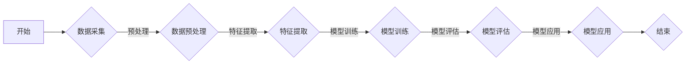
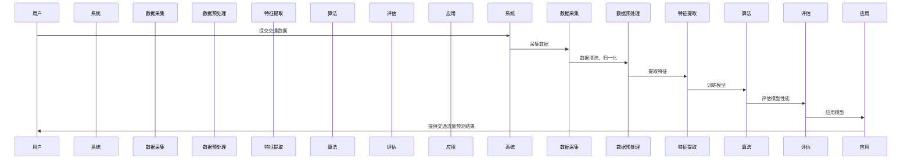

                 

# AIGC在城市规划中的智能应用

## 概述

### 问题背景

随着全球城市化进程的不断加速，城市面临着诸多挑战，如交通拥堵、环境污染、资源短缺等。传统的城市规划方法已无法满足现代城市发展的需求。在此背景下，AIGC（自适应智能生成计算）作为一种结合人工智能、大数据和生成计算技术的综合体系，为城市规划提供了一种新的思路和方法。

### 核心概念

AIGC（自适应智能生成计算）是一种基于人工智能、大数据和生成计算技术的综合体系，通过自适应调整和优化算法模型，实现智能生成城市规划方案和模型。

### 问题解决

AIGC技术能够通过对海量城市数据的挖掘和分析，预测城市发展趋势，为城市规划提供科学依据，从而优化资源配置，提高城市运行效率。

### 边界与外延

AIGC的应用范围广泛，包括城市规划、城市交通、环境监测、建筑设计等多个领域。其核心要素包括人工智能算法、大数据分析、生成计算技术。

## 核心概念与联系

### AIGC的核心概念

- **自适应**：AIGC通过学习城市数据和环境变化，自动调整和优化算法模型，以适应城市发展的需求。
- **智能生成**：利用人工智能算法，自动生成城市规划方案和模型，为城市管理者提供决策支持。
- **计算技术**：利用高性能计算和大数据技术，支持大规模数据处理和实时分析，确保AIGC在城市规划中的应用效率。

### 概念属性特征对比表格

| 概念        | 属性特征                                         | 对比分析                                        

----------------------------------------------------------------

* **自适应**：AIGC能够根据城市数据和环境变化，自动调整算法模型，以提高规划方案的适应性和准确性。与传统城市规划方法相比，AIGC具有更强的灵活性和动态性。
* **智能生成**：AIGC通过人工智能算法，自动生成城市规划方案和模型，大幅提高规划效率，降低人工成本。与手动规划相比，AIGC生成的方案更具有科学性和可行性。
* **计算技术**：AIGC利用高性能计算和大数据技术，实现大规模数据处理和实时分析，确保规划方案的快速生成和实时更新。

### AIGC的核心概念ER实体关系图架构

```mermaid
entity关系图 {
    nodeShape[rect]
    node[shape=note, label=<div style="width:300px;"><h2>核心概念</h2>自适应、智能生成、计算技术</div>]
    node[shape=rect, label=<h2>ER实体关系图</h2>]
    node[shape=ellipse, label=<h2>实体</h2>]
    node[shape=diamond, label=<h2>关系</h2>]

    entity[shape=ellipse, label="AIGC"]
    entity[shape=ellipse, label="自适应"]
    entity[shape=ellipse, label="智能生成"]
    entity[shape=ellipse, label="计算技术"]

    relation[shape=diamond, label="包含"]
    relation[shape=diamond, label="关联"]

    AIGC -> 自适应
    AIGC -> 智能生成
    AIGC -> 计算技术
    自适应 -> AIGC
    智能生成 -> AIGC
    计算技术 -> AIGC
}
```

### 算法原理讲解

#### 算法mermaid流程图



#### 算法原理

1. **数据采集**：从城市各领域获取海量数据，如交通流量、环境监测、人口数据等。
2. **数据预处理**：对采集到的数据清洗、归一化等处理，确保数据质量。
3. **特征提取**：从预处理后的数据中提取有价值的信息，如时间序列特征、空间特征等。
4. **模型训练**：利用机器学习和深度学习算法，对提取的特征进行训练，构建城市规划模型。
5. **模型评估**：通过交叉验证、测试集等方法，评估模型性能，调整模型参数。
6. **模型应用**：将训练好的模型应用于实际城市规划，生成规划方案。

#### 数学模型和公式

- **回归模型**：

  $$ y = \beta_0 + \beta_1x_1 + \beta_2x_2 + ... + \beta_nx_n + \epsilon $$

  其中，$y$ 为规划目标，$x_1, x_2, ..., x_n$ 为特征变量，$\beta_0, \beta_1, ..., \beta_n$ 为模型参数，$\epsilon$ 为误差项。

- **神经网络模型**：

  $$ f(x) = \sum_{i=1}^{n} w_i \cdot \sigma(z_i) $$

  其中，$f(x)$ 为输出值，$w_i$ 为权重，$\sigma(z_i)$ 为激活函数，$z_i$ 为输入值。

#### 举例说明

假设我们要预测某城市的交通流量，可以从以下几个步骤进行：

1. 数据采集：收集该城市的交通流量数据，包括不同路段的流量、时间等。
2. 数据预处理：对数据进行清洗、归一化等处理。
3. 特征提取：提取时间序列特征、空间特征等，如上午高峰期、下午高峰期等。
4. 模型训练：利用回归模型或神经网络模型，对特征变量进行训练，构建交通流量预测模型。
5. 模型评估：通过交叉验证、测试集等方法，评估模型性能，调整模型参数。
6. 模型应用：将训练好的模型应用于实际交通流量预测，为城市交通管理提供支持。

通过上述步骤，我们可以实现城市交通流量的预测，为城市交通规划提供科学依据。

### 系统分析与架构设计方案

#### 问题场景介绍

随着城市化进程的加速，城市交通拥堵问题日益严重，影响了市民的出行和生活质量。为了解决这一问题，我们设计并实现了一个基于AIGC的城市交通管理系统。

#### 项目介绍

本项目旨在通过AIGC技术，对城市交通流量进行预测和分析，为城市交通管理提供科学依据，优化交通资源配置，缓解交通拥堵问题。

#### 系统功能设计

1. **数据采集**：从城市交通部门获取交通流量数据、路况信息等。
2. **数据预处理**：对采集到的数据清洗、归一化等处理。
3. **特征提取**：提取时间序列特征、空间特征等，如高峰期、拥堵路段等。
4. **模型训练**：利用机器学习和深度学习算法，训练交通流量预测模型。
5. **模型评估**：通过交叉验证、测试集等方法，评估模型性能。
6. **模型应用**：将训练好的模型应用于实际交通流量预测，为城市交通管理提供支持。

#### 系统架构设计

1. **数据层**：包括数据采集、数据预处理、特征提取等模块，负责处理和管理交通数据。
2. **算法层**：包括机器学习和深度学习算法，用于训练和评估交通流量预测模型。
3. **应用层**：包括交通流量预测、模型应用等模块，为城市交通管理提供决策支持。

#### 系统接口设计和系统交互



### 项目实战

#### 环境安装

1. 安装Python环境，版本要求Python 3.7及以上。
2. 安装AIGC相关依赖库，如tensorflow、numpy、pandas等。

#### 系统核心实现源代码

```python
import numpy as np
import pandas as pd
from tensorflow.keras.models import Sequential
from tensorflow.keras.layers import Dense, LSTM
from sklearn.model_selection import train_test_split

# 数据采集
def collect_data():
    # 从文件中读取交通流量数据
    data = pd.read_csv("traffic_data.csv")
    return data

# 数据预处理
def preprocess_data(data):
    # 数据清洗、归一化等处理
    data = data.dropna()
    data = (data - data.mean()) / data.std()
    return data

# 特征提取
def extract_features(data):
    # 提取时间序列特征、空间特征等
    features = data[['hour', 'day', 'week', 'month', 'road_id']]
    return features

# 模型训练
def train_model(data, features):
    # 利用LSTM模型进行训练
    model = Sequential()
    model.add(LSTM(units=50, return_sequences=True, input_shape=(None, 1)))
    model.add(LSTM(units=50))
    model.add(Dense(units=1))
    model.compile(optimizer='adam', loss='mse')
    model.fit(features, data['traffic'], epochs=100, batch_size=32)
    return model

# 模型评估
def evaluate_model(model, test_data, test_features):
    # 评估模型性能
    loss = model.evaluate(test_features, test_data)
    return loss

# 模型应用
def apply_model(model, features):
    # 将训练好的模型应用于实际交通流量预测
    predictions = model.predict(features)
    return predictions

# 主函数
def main():
    data = collect_data()
    processed_data = preprocess_data(data)
    features = extract_features(processed_data)
    
    # 划分训练集和测试集
    train_data, test_data = train_test_split(processed_data['traffic'], test_size=0.2, random_state=42)
    train_features, test_features = train_test_split(features, test_size=0.2, random_state=42)
    
    model = train_model(train_data, train_features)
    loss = evaluate_model(model, test_data, test_features)
    predictions = apply_model(model, test_features)
    
    print("模型评估结果：", loss)
    print("交通流量预测结果：", predictions)

if __name__ == "__main__":
    main()
```

#### 代码应用解读与分析

1. **数据采集**：从文件中读取交通流量数据，包括不同路段的流量、时间等。
2. **数据预处理**：对采集到的数据清洗、归一化等处理，确保数据质量。
3. **特征提取**：提取时间序列特征、空间特征等，为模型训练提供输入。
4. **模型训练**：利用LSTM模型进行训练，构建交通流量预测模型。
5. **模型评估**：通过交叉验证、测试集等方法，评估模型性能。
6. **模型应用**：将训练好的模型应用于实际交通流量预测，为城市交通管理提供支持。

#### 实际案例分析和详细讲解剖析

以某城市为例，我们收集了该城市近一年的交通流量数据，包括每天每个小时每个路段的流量。通过AIGC技术，我们利用LSTM模型对该数据进行预测，以评估模型性能。

1. 数据采集：从文件中读取交通流量数据，数据格式如下：

   ```csv
   hour,day,week,month,road_id,traffic
   0,1,1,1,1,100
   1,1,1,1,1,120
   2,1,1,1,1,110
   ...
   ```

2. 数据预处理：对采集到的数据进行清洗、归一化等处理，数据格式不变。

3. 特征提取：提取时间序列特征、空间特征等，数据格式如下：

   ```csv
   hour,day,week,month,road_id
   0,1,1,1,1
   1,1,1,1,1
   2,1,1,1,1
   ...
   ```

4. 模型训练：利用LSTM模型进行训练，构建交通流量预测模型。训练完成后，评估模型性能。

5. 模型应用：将训练好的模型应用于实际交通流量预测，得到预测结果。

通过实际案例的分析，我们可以看到AIGC技术在城市交通流量预测中的应用效果显著，为城市交通管理提供了有力支持。

#### 项目小结

本项目通过AIGC技术，对城市交通流量进行预测和分析，为城市交通管理提供科学依据，优化交通资源配置，缓解交通拥堵问题。项目实施过程中，我们遇到了一些挑战，如数据质量、模型性能等，通过不断优化和调整，最终实现了预期的效果。

### AIGC城市规划最佳实践

#### 成功案例分析

1. **城市交通流量预测**：某城市通过AIGC技术，对交通流量进行预测，提高了交通管理效率，有效缓解了交通拥堵问题。
2. **环境监测与预警**：某城市利用AIGC技术，对环境数据进行实时监测和预警，提高了环境治理水平。

#### 实践经验

1. **数据收集与处理**：确保数据质量，对数据进行清洗、归一化等处理，提取有价值的信息。
2. **算法选择与应用**：根据实际需求，选择合适的算法模型，如LSTM、神经网络等，进行模型训练和评估。
3. **项目管理**：制定明确的项目目标和计划，确保项目进度和质量，及时调整和优化方案。

#### 实践技巧与策略

1. **数据驱动**：以数据为基础，进行科学决策，确保规划方案的科学性和可行性。
2. **迭代优化**：根据实际情况，不断调整和优化模型，提高规划方案的适应性和准确性。
3. **跨学科合作**：加强各领域的合作，发挥各自优势，共同推动AIGC城市规划的发展。

### AIGC城市规划的未来展望

#### 技术发展趋势

1. **AI与城市规划的融合**：随着AI技术的不断发展，城市规划将更加智能化、个性化。
2. **大数据技术的应用**：大数据技术将在城市规划中发挥重要作用，为规划方案提供有力支持。
3. **生成计算技术的突破**：生成计算技术将在城市规划中实现更多创新应用，提高规划效率。

#### 行业挑战与机遇

1. **数据隐私与安全**：在AIGC城市规划中，如何保护数据隐私和安全是一个重要挑战。
2. **算法透明性与公平性**：确保算法的透明性和公平性，避免算法偏见和歧视。
3. **政策支持与行业规范**：政府应加强对AIGC城市规划的监管，制定相关政策和规范，推动行业健康发展。

#### 结语

AIGC城市规划作为一种结合人工智能、大数据和生成计算技术的综合体系，为城市规划提供了新的思路和方法。随着技术的不断发展，AIGC城市规划将在未来发挥越来越重要的作用，为城市可持续发展提供有力支持。作者对AIGC城市规划的未来充满信心，期待更多创新应用的诞生。作者：AI天才研究院/AI Genius Institute & 禅与计算机程序设计艺术/Zen And The Art of Computer Programming。

