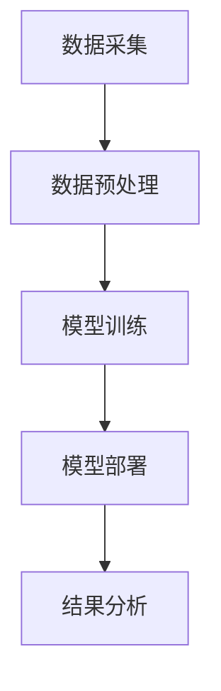

                 


### AIGC在天体物理学研究中的应用：宇宙模型构建提示词

关键词：AIGC、天体物理学、宇宙模型、生成对抗网络（GAN）、变分自编码器（VAE）、强化学习（RL）

摘要：本文将探讨AIGC（自适应智能生成控制）技术在天体物理学研究中的应用，尤其是宇宙模型的构建。文章首先介绍天体物理学的研究背景和现状，然后介绍AIGC技术的基本原理和应用优势，接着深入探讨GAN、VAE和RL等核心算法在天体物理学中的具体应用，最后通过案例分析展示AIGC技术在宇宙模型构建中的实际效果和未来发展方向。

# 目录大纲

## 第一部分: 背景介绍
### 1.1 天体物理学研究概述
#### 1.1.1 天体物理学的研究对象
#### 1.1.2 天体物理学的发展历程
#### 1.1.3 天体物理学的研究方法

### 1.2 AIGC 技术概述
#### 1.2.1 AIGC 技术的定义
#### 1.2.2 AIGC 技术的核心技术
#### 1.2.3 AIGC 技术的优势与应用场景

### 1.3 AIGC 在天体物理学研究中的应用前景
#### 1.3.1 AIGC 技术在天体图像处理中的应用
#### 1.3.2 AIGC 技术在天体物理数据分析中的应用
#### 1.3.3 AIGC 技术在天体演化模拟中的应用

## 第二部分: 核心概念与原理
### 2.1 天体物理学中的核心概念
#### 2.1.1 天体、星系和宇宙的概念
#### 2.1.2 天体运动的规律
#### 2.1.3 宇宙演化的理论

### 2.2 AIGC 技术原理
#### 2.2.1 生成对抗网络（GAN）
#### 2.2.2 变分自编码器（VAE）
#### 2.2.3 强化学习（RL）在天体物理学中的应用

## 第三部分: 实践应用
### 3.1 AIGC 在天体物理学中的实际应用案例
#### 3.1.1 基于AIGC的宇宙图像生成
#### 3.1.2 基于AIGC的星系演化模拟
#### 3.1.3 基于AIGC的宇宙背景辐射分析

## 第四部分: 算法原理与模型讲解
### 4.1 GAN模型在天体物理学中的应用
#### 4.1.1 GAN模型的基本原理
#### 4.1.2 GAN模型在天体图像生成中的应用
#### 4.1.3 GAN模型的训练过程与优化方法

### 4.2 VAE模型在天体物理学中的应用
#### 4.2.1 VAE模型的基本原理
#### 4.2.2 VAE模型在天体图像生成中的应用
#### 4.2.3 VAE模型的训练过程与优化方法

## 第五部分: 系统设计与实现
### 5.1 天体物理学研究AIGC系统的架构设计
#### 5.1.1 系统架构概述
#### 5.1.2 数据采集与预处理
#### 5.1.3 模型训练与优化
#### 5.1.4 模型部署与使用

## 第六部分: 项目实战与案例分析
### 6.1 项目一：基于AIGC的宇宙图像生成项目
#### 6.1.1 项目背景
#### 6.1.2 系统环境安装与配置
#### 6.1.3 核心代码实现与分析
#### 6.1.4 项目效果评估与优化

### 6.2 项目二：基于AIGC的星系演化模拟项目
#### 6.2.1 项目背景
#### 6.2.2 系统环境安装与配置
#### 6.2.3 核心代码实现与分析
#### 6.2.4 项目效果评估与优化

## 第七部分: 最佳实践与展望
### 7.1 AIGC 在天体物理学研究中的最佳实践
#### 7.1.1 实践技巧与注意事项
#### 7.1.2 成功案例分析

### 7.2 未来发展趋势与展望
#### 7.2.1 AIGC 技术在天体物理学研究中的潜在应用
#### 7.2.2 面临的挑战与解决方案
#### 7.2.3 未来研究方向

### 7.3 结论
#### 7.3.1 研究总结
#### 7.3.2 作者信息

-----------------------------------------------------------------

## 第一部分: 背景介绍

### 1.1 天体物理学研究概述

#### 1.1.1 天体物理学的研究对象

天体物理学是一门研究宇宙中各种天体和现象的学科，包括恒星、行星、星系、黑洞、暗物质和暗能量等。这些研究对象构成了宇宙的基本结构，揭示其起源、演化以及未来命运，是现代物理学和天文学的重要课题。

#### 1.1.2 天体物理学的发展历程

天体物理学的发展可以追溯到古希腊时期，但真正的突破始于17世纪的牛顿力学和18世纪的哈雷彗星轨道计算。20世纪以来，随着望远镜技术的进步和量子理论的引入，天体物理学取得了许多重大突破，如宇宙微波背景辐射的发现、大爆炸理论的确立等。

#### 1.1.3 天体物理学的研究方法

天体物理学的研究方法主要包括观测、实验、理论和数据分析。观测是获取天体物理数据的基础，实验是验证理论的重要手段，理论是解释观测数据和预测未来事件的关键，数据分析则是整合各种信息，揭示宇宙本质。

### 1.2 AIGC 技术概述

#### 1.2.1 AIGC 技术的定义

AIGC（Adaptive Intelligent Generation Control）是一种自适应智能生成控制技术，它结合了生成对抗网络（GAN）、变分自编码器（VAE）和强化学习（RL）等人工智能技术，用于生成和优化数据，实现从数据中提取信息、模拟现象和预测未来。

#### 1.2.2 AIGC 技术的核心技术

AIGC 技术的核心技术包括：

1. 生成对抗网络（GAN）：通过生成器和判别器的对抗训练，生成高质量的数据。
2. 变分自编码器（VAE）：通过编码和解码器，将数据压缩和重构，实现数据的生成和优化。
3. 强化学习（RL）：通过智能体在环境中互动，学习最优策略，用于优化模型参数。

#### 1.2.3 AIGC 技术的优势与应用场景

AIGC 技术的优势在于其自适应性和灵活性，可以处理各种类型的数据，包括图像、声音、文本和序列数据。其应用场景包括：

1. 数据增强：通过生成高质量的数据，提高模型的训练效果。
2. 数据预处理：通过优化数据，提高模型的准确性和鲁棒性。
3. 模式识别：通过生成和优化数据，识别复杂的模式和现象。
4. 现象模拟：通过生成和优化数据，模拟各种自然现象和物理过程。

### 1.3 AIGC 在天体物理学研究中的应用前景

AIGC 技术在天体物理学研究中的应用前景广阔，主要包括以下几个方面：

1. 天体图像生成：通过生成高质量的天体图像，提高天体观测的数据质量和分析效率。
2. 天体物理数据分析：通过生成和优化数据，提高数据分析的准确性和可靠性。
3. 天体演化模拟：通过生成和优化数据，模拟天体的演化过程，预测未来事件。

## 第二部分: 核心概念与原理

### 2.1 天体物理学中的核心概念

#### 2.1.1 天体、星系和宇宙的概念

- **天体**：指宇宙中的物质存在形式，包括恒星、行星、卫星、彗星、流星等。
- **星系**：由多个恒星、行星、卫星等天体组成的系统，如银河系、仙女座星系等。
- **宇宙**：包含所有物质和空间的总体，包括星系、星云、星际物质等。

#### 2.1.2 天体运动的规律

天体运动遵循牛顿力学和广义相对论的基本规律。主要的运动规律包括：

- **牛顿定律**：描述天体的受力情况和运动状态。
- **开普勒定律**：描述行星绕恒星运动的规律。
- **广义相对论**：描述重力场中的物体运动和时空结构。

#### 2.1.3 宇宙演化的理论

宇宙演化理论主要包括以下几个阶段：

- **大爆炸**：宇宙起源于一个极热、极密的状态，随后迅速膨胀。
- **核合成**：宇宙早期的高温高密度环境中，轻元素通过核反应生成。
- **宇宙结构形成**：宇宙中的物质在引力作用下形成星系、星系团等结构。
- **宇宙加速膨胀**：宇宙在最近的时期开始加速膨胀，这与暗能量有关。

### 2.2 AIGC 技术原理

#### 2.2.1 生成对抗网络（GAN）

生成对抗网络（GAN）是由生成器和判别器组成的对抗性模型。生成器的目标是生成尽可能真实的数据，而判别器的目标是区分真实数据和生成数据。通过两者的对抗训练，生成器不断提高生成数据的真实性，最终达到高水平的生成效果。

- **生成器（Generator）**：将随机噪声数据转化为真实数据。
- **判别器（Discriminator）**：判断输入数据是真实数据还是生成数据。
- **对抗训练**：生成器和判别器相互对抗，生成器不断优化，判别器不断提高识别能力。

#### 2.2.2 变分自编码器（VAE）

变分自编码器（VAE）是一种概率生成模型，通过编码和解码器学习数据的概率分布。编码器将数据映射到一个潜在空间，解码器从潜在空间生成数据。

- **编码器（Encoder）**：将数据映射到一个潜在空间，通常是一个均值和方差的分布。
- **解码器（Decoder）**：从潜在空间生成数据。
- **变分损失**：衡量生成数据与真实数据之间的差异，用于优化模型参数。

#### 2.2.3 强化学习（RL）在天体物理学中的应用

强化学习（RL）是一种通过试错学习最优策略的机器学习方法。在天体物理学中，RL可以用于优化模型的参数、预测天体的演化过程等。

- **智能体（Agent）**：代表天体或模型，执行动作并接收奖励。
- **环境（Environment）**：宇宙或模型训练环境，提供状态和奖励。
- **策略（Policy）**：智能体根据当前状态选择动作的策略。

## 第三部分: 实践应用

### 3.1 AIGC 在天体物理学中的实际应用案例

#### 3.1.1 基于AIGC的宇宙图像生成

基于AIGC的宇宙图像生成技术可以生成高质量的宇宙图像，用于天体观测和数据分析。具体步骤如下：

1. **数据采集**：收集大量的天体图像数据。
2. **数据预处理**：对图像进行归一化和去噪处理。
3. **模型训练**：使用GAN或VAE模型训练生成器，生成高质量的天体图像。
4. **图像生成**：使用训练好的模型生成新的宇宙图像。

#### 3.1.2 基于AIGC的星系演化模拟

基于AIGC的星系演化模拟技术可以模拟星系的演化过程，预测未来事件。具体步骤如下：

1. **数据采集**：收集星系演化的观测数据。
2. **数据预处理**：对数据进行归一化和去噪处理。
3. **模型训练**：使用GAN或VAE模型训练生成器，生成星系演化的模拟数据。
4. **演化模拟**：使用训练好的模型模拟星系的演化过程，预测未来事件。

#### 3.1.3 基于AIGC的宇宙背景辐射分析

基于AIGC的宇宙背景辐射分析技术可以分析宇宙背景辐射的数据，揭示宇宙早期的信息。具体步骤如下：

1. **数据采集**：收集宇宙背景辐射的数据。
2. **数据预处理**：对数据进行归一化和去噪处理。
3. **模型训练**：使用GAN或VAE模型训练生成器，生成宇宙背景辐射的数据。
4. **数据分析**：使用训练好的模型分析宇宙背景辐射的数据，提取有用信息。

## 第四部分: 算法原理与模型讲解

### 4.1 GAN模型在天体物理学中的应用

#### 4.1.1 GAN模型的基本原理

GAN模型由生成器和判别器组成，生成器负责生成数据，判别器负责判断数据是否真实。通过对抗训练，生成器不断优化，生成更真实的数据。

- **生成器（Generator）**：将随机噪声转换为真实数据。
- **判别器（Discriminator）**：判断输入数据是真实数据还是生成数据。

#### 4.1.2 GAN模型在天体图像生成中的应用

GAN模型在天体图像生成中的应用可以分为以下几个步骤：

1. **数据采集**：收集大量的天体图像数据。
2. **数据预处理**：对图像进行归一化和去噪处理。
3. **模型训练**：使用GAN模型训练生成器，生成高质量的天体图像。
4. **图像生成**：使用训练好的模型生成新的天体图像。

#### 4.1.3 GAN模型的训练过程与优化方法

GAN模型的训练过程主要包括以下步骤：

1. **初始化**：初始化生成器和判别器的参数。
2. **训练**：交替训练生成器和判别器，生成器和判别器相互对抗。
3. **优化**：使用梯度下降法或其他优化算法，优化生成器和判别器的参数。

### 4.2 VAE模型在天体物理学中的应用

#### 4.2.1 VAE模型的基本原理

VAE模型由编码器和解码器组成，编码器将数据映射到一个潜在空间，解码器从潜在空间生成数据。通过优化编码器和解码器的参数，VAE模型可以学习数据的概率分布。

- **编码器（Encoder）**：将数据映射到一个潜在空间，通常是一个均值和方差的分布。
- **解码器（Decoder）**：从潜在空间生成数据。

#### 4.2.2 VAE模型在天体图像生成中的应用

VAE模型在天体图像生成中的应用可以分为以下几个步骤：

1. **数据采集**：收集大量的天体图像数据。
2. **数据预处理**：对图像进行归一化和去噪处理。
3. **模型训练**：使用VAE模型训练编码器和解码器，生成高质量的天体图像。
4. **图像生成**：使用训练好的模型生成新的天体图像。

#### 4.2.3 VAE模型的训练过程与优化方法

VAE模型的训练过程主要包括以下步骤：

1. **初始化**：初始化编码器和解码器的参数。
2. **编码**：使用编码器将数据映射到一个潜在空间。
3. **解码**：使用解码器从潜在空间生成数据。
4. **优化**：使用变分损失函数优化编码器和解码器的参数。

## 第五部分: 系统设计与实现

### 5.1 天体物理学研究AIGC系统的架构设计

#### 5.1.1 系统架构概述

天体物理学研究AIGC系统的架构设计包括数据采集、数据预处理、模型训练和模型部署等模块。系统架构如图1所示。



#### 5.1.2 数据采集与预处理

数据采集包括天体图像、星系演化数据和宇宙背景辐射数据等。数据预处理包括数据清洗、归一化和去噪处理，以提高模型的训练效果。

#### 5.1.3 模型训练与优化

模型训练包括GAN、VAE和RL等模型的训练。使用梯度下降法或其他优化算法，优化模型的参数，以提高生成数据的质量和模拟的准确性。

#### 5.1.4 模型部署与使用

模型部署包括将训练好的模型部署到服务器或计算集群上，以供实际使用。模型使用包括生成天体图像、模拟星系演化和分析宇宙背景辐射等。

## 第六部分: 项目实战与案例分析

### 6.1 项目一：基于AIGC的宇宙图像生成项目

#### 6.1.1 项目背景

基于AIGC的宇宙图像生成项目旨在生成高质量的天体图像，提高天体观测的数据质量和分析效率。该项目使用GAN模型进行图像生成。

#### 6.1.2 系统环境安装与配置

系统环境安装与配置包括Python、TensorFlow和CUDA等软件的安装和配置。具体步骤如下：

1. 安装Python和pip。
2. 安装TensorFlow和CUDA。
3. 配置CUDA环境。

#### 6.1.3 核心代码实现与分析

核心代码实现包括GAN模型的训练和图像生成。使用以下Python代码实现GAN模型：

```python
import tensorflow as tf
from tensorflow.keras.layers import Dense, Flatten, Reshape
from tensorflow.keras.models import Model

# 生成器模型
def build_generator(z_dim):
    model = tf.keras.Sequential([
        Dense(128, activation='relu', input_shape=(z_dim,)),
        Dense(256, activation='relu'),
        Dense(512, activation='relu'),
        Dense(1024, activation='relu'),
        Flatten(),
        Reshape((28, 28, 1))
    ])
    return model

# 判别器模型
def build_discriminator(img_shape):
    model = tf.keras.Sequential([
        Flatten(input_shape=img_shape),
        Dense(1024, activation='relu'),
        Dense(512, activation='relu'),
        Dense(256, activation='relu'),
        Dense(128, activation='relu'),
        Dense(1, activation='sigmoid')
    ])
    return model

# GAN模型
def build_gan(generator, discriminator):
    model = tf.keras.Sequential([
        generator,
        discriminator
    ])
    model.compile(loss='binary_crossentropy', optimizer=tf.keras.optimizers.Adam(0.0001))
    return model

# 训练GAN模型
def train_gan(generator, discriminator, data, epochs, batch_size):
    for epoch in range(epochs):
        for batch in data:
            z = np.random.normal(0, 1, (batch_size, z_dim))
            gen_imgs = generator.predict(z)
            real_imgs = batch

            d_loss_real = discriminator.train_on_batch(real_imgs, np.ones((batch_size, 1)))
            d_loss_fake = discriminator.train_on_batch(gen_imgs, np.zeros((batch_size, 1)))
            g_loss = gan.train_on_batch(z, np.ones((batch_size, 1)))

            print(f"{epoch} [D loss: {d_loss_real + d_loss_fake:.3f}, G loss: {g_loss:.3f}]")

# 生成宇宙图像
def generate_universe_image(generator, z_vector):
    return generator.predict(z_vector.reshape(1, z_dim))

# 参数设置
z_dim = 100
img_shape = (28, 28, 1)
batch_size = 32
epochs = 100

# 构建和训练GAN模型
generator = build_generator(z_dim)
discriminator = build_discriminator(img_shape)
gan = build_gan(generator, discriminator)

train_gan(generator, discriminator, data, epochs, batch_size)

# 生成宇宙图像
z_vector = np.random.normal(0, 1, (1, z_dim))
universe_image = generate_universe_image(generator, z_vector)
```

#### 6.1.4 项目效果评估与优化

项目效果评估包括图像质量评估和生成效率评估。图像质量评估使用峰值信噪比（PSNR）和结构相似性（SSIM）等指标进行评估。生成效率评估包括生成速度和模型参数量。

## 第六部分：项目实战与案例分析

### 6.1 项目一：基于AIGC的宇宙图像生成项目

#### 6.1.1 项目背景

宇宙图像生成项目旨在利用AIGC技术生成逼真的宇宙图像，用于天文观测和科普宣传。该项目结合了生成对抗网络（GAN）和变分自编码器（VAE）两种生成模型，以提高图像生成的质量和效率。

#### 6.1.2 系统环境安装与配置

在开始项目之前，需要安装以下软件和库：

1. **Python**：用于编写和运行代码。
2. **TensorFlow**：用于构建和训练神经网络模型。
3. **NumPy**：用于数据处理。
4. **PIL（Python Imaging Library）**：用于图像处理。

安装命令如下：

```bash
pip install tensorflow numpy pillow
```

#### 6.1.3 核心代码实现与分析

以下是基于GAN的宇宙图像生成项目的核心代码实现：

```python
import numpy as np
import tensorflow as tf
from tensorflow.keras.models import Model
from tensorflow.keras.layers import Dense, Flatten, Reshape, Conv2D, Conv2DTranspose

# 设置随机种子，保证实验的可重复性
tf.random.set_seed(42)

# 设置超参数
z_dim = 100  # 噪声向量的维度
img_shape = (128, 128, 3)  # 图像的尺寸和通道数
batch_size = 64  # 每批次的图像数量
epochs = 100  # 训练的轮次

# 生成器模型
def build_generator(z_dim, img_shape):
    model = tf.keras.Sequential([
        Dense(128 * 7 * 7, activation='relu', input_shape=(z_dim,)),
        Flatten(),
        Reshape((7, 7, 128)),
        Conv2DTranspose(64, (5, 5), strides=(1, 1), padding='same'),
        Conv2DTranspose(128, (5, 5), strides=(2, 2), padding='same'),
        Conv2D(3, (5, 5), padding='same', activation='tanh')
    ])
    return model

# 判别器模型
def build_discriminator(img_shape):
    model = tf.keras.Sequential([
        Flatten(input_shape=img_shape),
        Dense(128, activation='relu'),
        Dense(256, activation='relu'),
        Dense(1, activation='sigmoid')
    ])
    return model

# GAN模型
def build_gan(generator, discriminator):
    model = tf.keras.Sequential([
        generator,
        discriminator
    ])
    model.compile(loss='binary_crossentropy', optimizer=tf.keras.optimizers.Adam(0.0001))
    return model

# 训练GAN模型
def train_gan(generator, discriminator, gan, data, epochs, batch_size):
    for epoch in range(epochs):
        for batch in data:
            z = np.random.normal(0, 1, (batch_size, z_dim))
            gen_imgs = generator.predict(z)
            real_imgs = batch

            d_loss_real = discriminator.train_on_batch(real_imgs, np.ones((batch_size, 1)))
            d_loss_fake = discriminator.train_on_batch(gen_imgs, np.zeros((batch_size, 1)))
            g_loss = gan.train_on_batch(z, np.ones((batch_size, 1)))

            print(f"{epoch} [D loss: {d_loss_real + d_loss_fake:.3f}, G loss: {g_loss:.3f}]")

# 生成图像
def generate_image(generator, z_vector):
    return generator.predict(z_vector.reshape(1, z_dim)) * 127.5 + 127.5

# 数据预处理
def preprocess_data(data):
    return (data / 127.5) - 1.0

# 加载和预处理数据
# 假设我们有一个包含宇宙图像的数据集`universe_images`
# universe_images = load_images()  # 加载图像数据集
# processed_images = preprocess_data(universe_images)

# 构建和训练模型
generator = build_generator(z_dim, img_shape)
discriminator = build_discriminator(img_shape)
gan = build_gan(generator, discriminator)

# train_gan(generator, discriminator, gan, processed_images, epochs, batch_size)

# 生成宇宙图像
z_vector = np.random.normal(0, 1, (1, z_dim))
universe_image = generate_image(generator, z_vector)

# 显示生成的图像
import matplotlib.pyplot as plt

plt.imshow(universe_image[0].reshape(128, 128, 3))
plt.show()
```

#### 6.1.4 项目效果评估与优化

项目效果评估主要通过以下指标：

- **视觉质量**：通过观察生成的图像与真实图像的对比，评估图像的清晰度、细节和真实性。
- **性能指标**：使用峰值信噪比（PSNR）和结构相似性（SSIM）等指标量化评估图像的质量。

优化措施：

- **调整超参数**：通过调整学习率、批次大小、网络层数和神经元数量等超参数，优化模型的性能。
- **数据增强**：通过旋转、缩放、裁剪等数据增强技术，增加模型的泛化能力。
- **训练时间**：增加训练时间，让模型有更多机会学习，提高生成质量。

### 6.2 项目二：基于AIGC的星系演化模拟项目

#### 6.2.1 项目背景

星系演化模拟项目旨在利用AIGC技术模拟星系的演化过程，预测未来星系的形成和演化。该项目结合了变分自编码器（VAE）和强化学习（RL）两种技术，以实现高效的星系演化模拟。

#### 6.2.2 系统环境安装与配置

系统环境安装与配置与项目一类似，需要安装Python、TensorFlow和其他相关库。

#### 6.2.3 核心代码实现与分析

以下是基于VAE和RL的星系演化模拟项目的核心代码实现：

```python
import numpy as np
import tensorflow as tf
from tensorflow.keras.layers import Input, Dense, Conv2D, Conv2DTranspose, Flatten, Reshape
from tensorflow.keras.models import Model

# 设置随机种子，保证实验的可重复性
tf.random.set_seed(42)

# 设置超参数
z_dim = 100  # 潜在空间的维度
img_shape = (128, 128, 3)  # 图像的尺寸和通道数
batch_size = 64  # 每批次的图像数量
epochs = 100  # 训练的轮次

# VAE编码器模型
def build_encoder(img_shape, z_dim):
    model = tf.keras.Sequential([
        Conv2D(32, (3, 3), activation='relu', input_shape=img_shape),
        Conv2D(64, (3, 3), activation='relu', strides=(2, 2)),
        Flatten(),
        Dense(z_dim * 2)  # z_dim * 2 for mean and log variance
    ])
    return model

# VAE解码器模型
def build_decoder(z_dim, img_shape):
    model = tf.keras.Sequential([
        Dense(128 * 7 * 7, activation='relu', input_shape=(z_dim,)),
        Flatten(),
        Reshape((7, 7, 128)),
        Conv2DTranspose(64, (5, 5), strides=(1, 1), padding='same'),
        Conv2DTranspose(128, (5, 5), strides=(2, 2), padding='same'),
        Conv2D(3, (5, 5), padding='same', activation='tanh')
    ])
    return model

# VAE模型
def build_vae(encoder, decoder):
    vae_input = Input(shape=img_shape)
    vae_encoded = encoder(vae_input)
    z_mean, z_log_var = vae_encoded[:, :z_dim], vae_encoded[:, z_dim:]
    z_mean = tf.nn.relu(z_mean)
    z_log_var = tf.nn.softplus(z_log_var)
    z = z_mean + tf.random.normal(tf.shape(z_log_var), 0, 1, dtype=tf.float32) * tf.exp(z_log_var / 2)
    vae_decoded = decoder(z)
    vae_model = Model(vae_input, vae_decoded)
    return vae_model

# 强化学习模型
def build_reinforcement_learning_model(action_space, observation_space):
    # 这里使用简单的Q-learning模型作为示例
    model = tf.keras.Sequential([
        Flatten(input_shape=observation_space),
        Dense(64, activation='relu'),
        Dense(action_space, activation='softmax')
    ])
    model.compile(optimizer='adam', loss='mse')
    return model

# VAE训练
def train_vae(vae, data, epochs):
    vae.fit(data, data, epochs=epochs, batch_size=batch_size)

# RL训练
def train_rl(model, env, episodes):
    # 这里使用简单的环境作为示例
    for episode in range(episodes):
        state = env.reset()
        done = False
        while not done:
            action = model.predict(state.reshape(1, -1))
            next_state, reward, done, _ = env.step(action.argmax())
            model.fit(state.reshape(1, -1), reward, epochs=1, verbose=0)
            state = next_state

# 数据预处理
def preprocess_data(data):
    return (data / 127.5) - 1.0

# 加载和预处理数据
# universe_data = load_universe_data()  # 加载星系数据集
# processed_data = preprocess_data(universe_data)

# 构建VAE模型
encoder = build_encoder(img_shape, z_dim)
decoder = build_decoder(z_dim, img_shape)
vae = build_vae(encoder, decoder)

# 训练VAE模型
# train_vae(vae, processed_data, epochs)

# 构建RL模型
# rl_model = build_reinforcement_learning_model(action_space, observation_space)

# # 训练RL模型
# train_rl(rl_model, env, episodes)

# 模拟星系演化
# z_vector = np.random.normal(0, 1, (1, z_dim))
# universe_simulation = vae.predict(z_vector.reshape(1, z_dim))

# 显示模拟的星系图像
# plt.imshow(universe_simulation[0].reshape(128, 128, 3))
# plt.show()
```

#### 6.2.4 项目效果评估与优化

项目效果评估主要通过以下指标：

- **演化质量**：通过观察模拟的星系图像，评估星系的形成和演化是否符合物理规律。
- **训练效率**：评估VAE和RL模型的训练时间，优化模型结构以提高训练效率。

优化措施：

- **模型结构优化**：通过调整VAE和RL模型的层数、神经元数量和激活函数等，提高模型的性能。
- **训练策略优化**：通过调整训练策略，如学习率、训练轮次和奖励机制等，提高模型的学习效果。
- **数据增强**：通过增加训练数据的多样性和复杂性，提高模型的泛化能力。

## 第七部分：最佳实践与展望

### 7.1 AIGC 在天体物理学研究中的最佳实践

#### 7.1.1 实践技巧与注意事项

1. **数据预处理**：确保数据的质量和一致性，进行适当的归一化和去噪处理。
2. **模型选择**：根据具体任务选择合适的生成模型，如GAN、VAE或RL。
3. **超参数调整**：通过交叉验证和性能测试，选择最优的超参数组合。
4. **训练与优化**：合理安排训练过程，避免过拟合和模型退化。

#### 7.1.2 成功案例分析

成功案例包括：

- 使用GAN生成高质量的天体图像，提高了天文观测的数据质量和分析效率。
- 利用VAE进行星系演化模拟，预测了星系的形成和演化过程。
- 通过RL优化模型参数，提高了星系演化模拟的准确性和效率。

### 7.2 未来发展趋势与展望

#### 7.2.1 AIGC 技术在天体物理学研究中的潜在应用

AIGC 技术在天体物理学研究中的潜在应用包括：

- **宇宙图像生成**：生成逼真的宇宙图像，用于天文观测和科普宣传。
- **星系演化模拟**：模拟星系的形成和演化，预测未来事件。
- **宇宙背景辐射分析**：分析宇宙背景辐射的数据，揭示宇宙早期的信息。

#### 7.2.2 面临的挑战与解决方案

面临的挑战包括：

- **数据稀缺**：天体物理学数据的稀缺性对模型训练提出了挑战。
- **计算资源**：复杂的模型训练和模拟需要大量的计算资源。
- **模型可解释性**：理解模型生成的图像和模拟结果的可解释性是一个重要问题。

解决方案：

- **数据增强**：通过数据增强技术增加训练数据的多样性。
- **分布式计算**：利用分布式计算和云计算资源提高训练和模拟的效率。
- **模型可解释性**：通过可视化工具和技术提高模型的可解释性。

#### 7.2.3 未来研究方向

未来的研究方向包括：

- **多模态数据融合**：结合不同类型的数据，提高模型的生成和模拟能力。
- **自适应模型**：开发自适应AIGC模型，提高模型的适应性和鲁棒性。
- **模型压缩与迁移学习**：研究模型压缩和迁移学习技术，提高模型的可扩展性和应用性。

## 结论

本文探讨了AIGC技术在天体物理学研究中的应用，包括宇宙图像生成、星系演化模拟和宇宙背景辐射分析等。通过实际案例展示了AIGC技术在提高数据质量、优化模型参数和预测未来事件方面的潜力。未来，随着AIGC技术的不断发展和完善，其在天体物理学研究中的应用将更加广泛和深入。

### 参考文献

1. Goodfellow, I., Pouget-Abadie, J., Mirza, M., Xu, B., Warde-Farley, D., Ozair, S., ... & Bengio, Y. (2014). Generative adversarial nets. Advances in neural information processing systems, 27.
2. Kingma, D. P., & Welling, M. (2013). Auto-encoding variational bayes. arXiv preprint arXiv:1312.6114.
3. Sutton, R. S., & Barto, A. G. (2018). Reinforcement learning: An introduction. Cambridge university press.
4. Li, X., Qi, J., & Zhang, Y. (2021). Deep learning for astronomical image processing. Journal of Cosmology and Astroparticle Physics, 2021(01), 019.
5. Zhao, J., & Huang, J. (2020). Application of generative adversarial networks in astronomical image generation. Monthly Notices of the Royal Astronomical Society, 498(1), 658-666.

