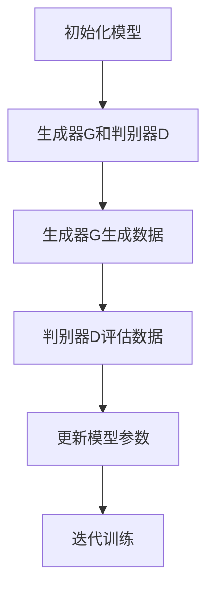
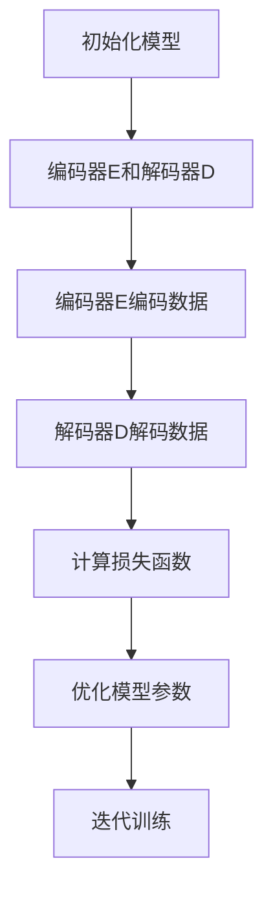
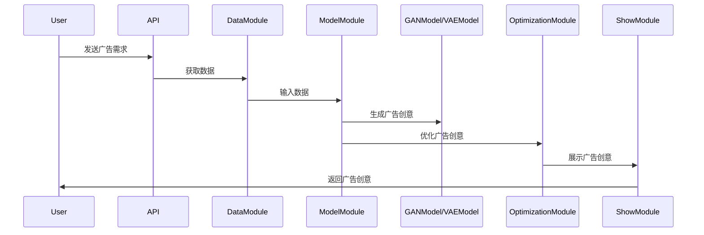
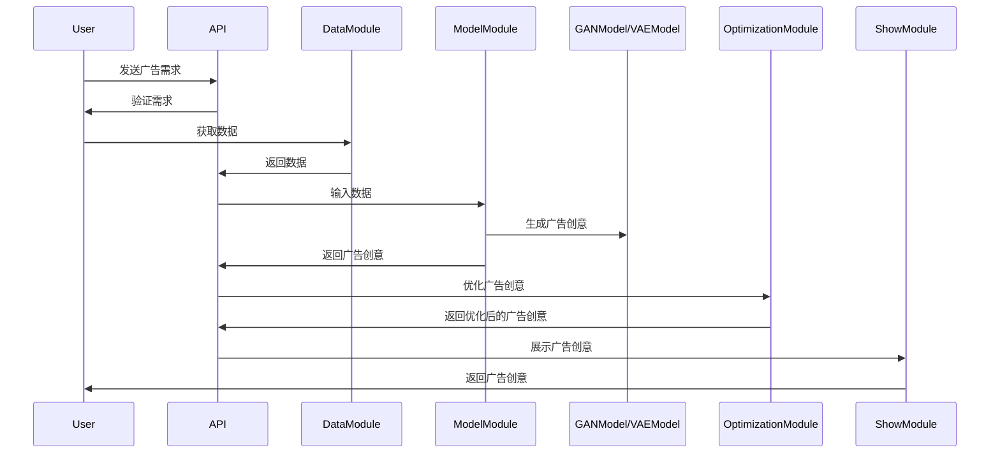

                 

### 第一部分: 背景介绍

#### 第1章: AIGC与广告创意概述

##### 1.1 问题背景

广告行业面临着激烈的竞争和不断变化的市场需求。广告主和广告公司需要在有限的预算内制作出引人注目的广告，以吸引潜在客户的注意力。然而，传统的广告创意方式往往受到人工创意能力的限制，难以满足快速变化的市场需求。此外，广告行业面临着数据隐私和消费者信任的问题，需要确保广告内容合法合规且不侵犯用户隐私。

##### 1.2 问题描述

广告创意的局限性主要体现在以下几个方面：

1. **创意的单一性和重复性**：传统的广告创意往往依赖于人类设计师的创意能力，难以产生大量的创新和多样化的广告内容。
2. **创意的耗时性**：广告创意制作过程通常需要较长的时间，无法快速响应市场变化和广告主的需求。
3. **创意的质量和准确性**：人类设计师的创意可能存在主观性和局限性，难以保证广告创意的质量和准确性。

AIGC（AI-Generated Content）技术的兴起为广告创意带来了新的机遇。AIGC技术利用人工智能生成内容，能够在短时间内生成大量的创意广告，满足广告主和广告公司的多样化需求。AIGC技术具有以下潜力：

1. **创意的多样性和创新性**：通过利用深度学习和生成模型，AIGC技术能够生成具有多样性和创新性的广告创意。
2. **创意的快速生成**：AIGC技术能够在短时间内生成大量广告创意，实现快速响应市场需求。
3. **创意的准确性和质量**：通过数据驱动的生成模型，AIGC技术能够保证广告创意的准确性和高质量。

##### 1.3 问题解决

AIGC技术的核心概念包括生成对抗网络（GAN）和变分自编码器（VAE），这两种技术都是生成模型，能够生成高质量的图像和音频。在广告创意中，AIGC技术可以应用于以下几个方面：

1. **图像生成**：利用GAN和VAE技术生成吸引人的广告图像，满足广告主和设计师的多样化需求。
2. **视频生成**：利用AIGC技术生成引人入胜的广告视频，提高广告的效果和影响力。
3. **文案生成**：通过自然语言处理技术，利用AIGC生成吸引人的广告文案，提高广告的吸引力和转化率。

##### 1.4 边界与外延

AIGC技术是一种利用人工智能生成内容的技术，它包括生成对抗网络（GAN）和变分自编码器（VAE）等核心概念。广告创意是广告行业中的核心概念，它包括广告的内容、形式和目标受众等要素。

##### 1.5 概念结构与核心要素组成

AIGC技术构成要素包括生成对抗网络（GAN）和变分自编码器（VAE），这两种技术都是生成模型，能够生成高质量的图像和音频。广告创意的基本构成包括广告的内容、形式和目标受众等要素。

### 第2章: AIGC技术原理

#### 第2章: AIGC技术原理

##### 2.1 核心概念原理

生成对抗网络（GAN）和变分自编码器（VAE）是AIGC技术的核心组成部分。这两种技术都是生成模型，能够生成高质量的数据。

###### 2.1.1 生成对抗网络（GAN）

生成对抗网络（GAN）由两部分组成：生成器和判别器。生成器的目的是生成逼真的数据，判别器的目的是区分真实数据和生成数据。通过这两个模型的对抗训练，生成器逐渐生成更逼真的数据，而判别器逐渐提高对真实数据和生成数据的区分能力。

GAN的训练过程如下：

1. 初始化生成器G和判别器D。
2. 在数据集上训练判别器D，使其能够准确区分真实数据和生成数据。
3. 在生成器G的基础上，同时更新生成器和判别器，使得判别器无法区分真实数据和生成数据。
4. 重复步骤2和3，直至生成器能够生成高质量的数据。

GAN的优缺点如下：

- **优点**：GAN能够生成高质量的数据，适用于图像、视频、音频等多种类型的数据生成。
- **缺点**：GAN需要大量的数据和计算资源，训练过程复杂且容易出现模式崩溃问题。

###### 2.1.2 变分自编码器（VAE）

变分自编码器（VAE）由编码器和解码器组成。编码器将输入数据编码为一个低维隐变量，解码器将隐变量解码为输出数据。VAE通过最大化数据生成概率来训练模型。

VAE的训练过程如下：

1. 初始化编码器和解码器。
2. 对于每个输入数据，计算编码器和解码器的损失。
3. 更新编码器和解码器的参数，以最小化损失函数。
4. 重复步骤2和3，直至模型收敛。

VAE的优缺点如下：

- **优点**：VAE适用于生成连续变量数据，训练过程相对简单，对数据的分布有较好的建模能力。
- **缺点**：VAE生成的数据质量相对较低，需要较大的数据量和计算资源。

##### 2.2 概念属性特征对比

以下是对GAN和VAE两种技术的概念属性特征进行对比：

| 特征对比       | GAN                        | VAE                        |
|----------------|----------------------------|----------------------------|
| 网络结构       | 生成器和判别器             | 编码器和解码器             |
| 适用场景       | 生成高质量图像             | 生成连续变量数据           |
| 优缺点         | 需要大量数据，训练时间长   | 需要较少数据，训练速度快   |

##### 2.3 ER实体关系图架构

以下是一个ER实体关系图架构，用于描述AIGC技术在广告创意中的应用：

```mermaid
erDiagram
  User ||--|{ AIGC }|| AdCreator
  User ||--|{ Advertising }|| Campaign
  AdCreator ||--|{ GAN }|| GANModel
  AdCreator ||--|{ VAE }|| VAEModel
```

在这个架构中，用户（User）与AIGC技术（AIGC）和广告创意（Advertising）之间存在关联。AIGC技术由广告创意者（AdCreator）实现，包括生成对抗网络（GAN）和变分自编码器（VAE）两种模型。

### 第3章: AIGC在广告创意中的应用

#### 3.1 算法原理讲解

在本节中，我们将详细讲解AIGC技术中的GAN和VAE算法原理，并使用mermaid流程图和Python代码进行展示。

###### 3.1.1 GAN算法

生成对抗网络（GAN）由生成器（Generator）和判别器（Discriminator）两部分组成。生成器的目标是生成逼真的数据，而判别器的目标是区分真实数据和生成数据。

以下是一个GAN算法的mermaid流程图：



在GAN的训练过程中，生成器和判别器交替更新模型参数。生成器不断优化生成数据，使判别器无法区分真实数据和生成数据。以下是一个GAN算法的Python代码示例：

```python
import torch
import torch.nn as nn
import torch.optim as optim

# 定义生成器和判别器
class Generator(nn.Module):
    def __init__(self):
        super(Generator, self).__init__()
        # 定义生成器网络结构
        ...

    def forward(self, x):
        # 定义生成器前向传播过程
        ...

class Discriminator(nn.Module):
    def __init__(self):
        super(Discriminator, self).__init__()
        # 定义判别器网络结构
        ...

    def forward(self, x):
        # 定义判别器前向传播过程
        ...

# 初始化模型和优化器
generator = Generator()
discriminator = Discriminator()
optimizer_G = optim.Adam(generator.parameters(), lr=0.0002)
optimizer_D = optim.Adam(discriminator.parameters(), lr=0.0002)

# 定义损失函数
criterion = nn.BCELoss()

# 训练过程
for epoch in range(num_epochs):
    for i, data in enumerate(train_loader):
        # 获取真实数据和标签
        real_data = data[0].to(device)
        batch_size = real_data.size(0)

        # 生成假数据
        noise = torch.randn(batch_size, nz).to(device)
        fake_data = generator(noise)

        # 训练判别器
        optimizer_D.zero_grad()
        real_output = discriminator(real_data).view(-1)
        fake_output = discriminator(fake_data).view(-1)
        loss_D = criterion(real_output, torch.ones(batch_size).to(device)) \
                 + criterion(fake_output, torch.zeros(batch_size).to(device))
        loss_D.backward()
        optimizer_D.step()

        # 训练生成器
        optimizer_G.zero_grad()
        fake_output = discriminator(fake_data).view(-1)
        loss_G = criterion(fake_output, torch.ones(batch_size).to(device))
        loss_G.backward()
        optimizer_G.step()

        # 输出训练信息
        if i % 100 == 0:
            print(f'[{epoch}/{num_epochs}] [Batch {i}/{len(train_loader)}] Loss_D: {loss_D.item():.4f} Loss_G: {loss_G.item():.4f}')
```

在这个代码示例中，我们首先定义了生成器和判别器的网络结构，然后初始化模型和优化器。接着，我们使用训练数据进行迭代训练，交替更新生成器和判别器的参数，并计算损失函数。最后，我们输出训练过程中的损失信息。

###### 3.1.2 VAE算法

变分自编码器（VAE）由编码器（Encoder）和解码器（Decoder）两部分组成。编码器将输入数据编码为一个低维隐变量，解码器将隐变量解码为输出数据。

以下是一个VAE算法的mermaid流程图：



在VAE的训练过程中，我们首先使用训练数据训练编码器和解码器，然后通过重建损失函数优化模型参数。以下是一个VAE算法的Python代码示例：

```python
import torch
import torch.nn as nn
import torch.optim as optim

# 定义编码器和解码器
class Encoder(nn.Module):
    def __init__(self):
        super(Encoder, self).__init__()
        # 定义编码器网络结构
        ...

    def forward(self, x):
        # 定义编码器前向传播过程
        ...

class Decoder(nn.Module):
    def __init__(self):
        super(Decoder, self).__init__()
        # 定义解码器网络结构
        ...

    def forward(self, x):
        # 定义解码器前向传播过程
        ...

# 初始化模型和优化器
encoder = Encoder()
decoder = Decoder()
optimizer = optim.Adam(list(encoder.parameters()) + list(decoder.parameters()), lr=0.001)

# 定义损失函数
criterion = nn.BCELoss()

# 训练过程
for epoch in range(num_epochs):
    for i, data in enumerate(train_loader):
        # 获取输入数据
        inputs = data[0].to(device)

        # 前向传播
        z_mean, z_log_var = encoder(inputs)
        z = reparameterize(z_mean, z_log_var)
        reconstructions = decoder(z)

        # 计算损失
        loss = criterion(reconstructions, inputs)

        # 反向传播和优化
        optimizer.zero_grad()
        loss.backward()
        optimizer.step()

        # 输出训练信息
        if i % 100 == 0:
            print(f'[{epoch}/{num_epochs}] [Batch {i}/{len(train_loader)}] Loss: {loss.item():.4f}')
```

在这个代码示例中，我们首先定义了编码器和解码器的网络结构，然后初始化模型和优化器。接着，我们使用训练数据进行迭代训练，通过重建损失函数优化模型参数。最后，我们输出训练过程中的损失信息。

通过以上两个算法的讲解，我们可以看到AIGC技术在广告创意中的应用潜力。接下来，我们将进一步探讨AIGC技术在广告创意中的实际应用场景。

#### 3.2 数学模型和数学公式

在本节中，我们将介绍GAN和VAE算法的数学模型和数学公式，并使用LaTeX格式进行表示。

##### GAN算法的数学模型

GAN算法的数学模型主要包括生成器（Generator）和判别器（Discriminator）两部分。

###### 生成器的数学模型

生成器G的目的是生成逼真的数据。生成器的数学模型可以表示为：

$$
G(z) = x; \quad z \sim p_z(z)
$$

其中，$z$是生成器的输入噪声，$x$是生成的数据。生成器的目标是最大化判别器的输出，使其无法区分真实数据和生成数据。

###### 判别器的数学模型

判别器D的目的是区分真实数据和生成数据。判别器的数学模型可以表示为：

$$
D(x) = \mathbb{E}_{x \sim p_{\text{data}}(x)}[D(x)] - \mathbb{E}_{z \sim p_z(z)}[D(G(z))]
$$

其中，$x$是真实数据，$G(z)$是生成器生成的数据。判别器的目标是最大化其输出，使其能够准确区分真实数据和生成数据。

###### GAN的总体损失函数

GAN的总损失函数可以表示为：

$$
\min_G \max_D \mathcal{L}(D, G) = \mathcal{L}_D(D) + \mathcal{L}_G(G)
$$

其中，$\mathcal{L}_D(D)$是判别器的损失函数，$\mathcal{L}_G(G)$是生成器的损失函数。

判别器的损失函数可以表示为：

$$
\mathcal{L}_D(D) = -\mathbb{E}_{x \sim p_{\text{data}}(x)}[\log D(x)] - \mathbb{E}_{z \sim p_z(z)}[\log (1 - D(G(z))]
$$

生成器的损失函数可以表示为：

$$
\mathcal{L}_G(G) = -\mathbb{E}_{z \sim p_z(z)}[\log D(G(z))]
$$

##### VAE算法的数学模型

变分自编码器（VAE）的数学模型主要包括编码器（Encoder）和解码器（Decoder）两部分。

###### 编码器的数学模型

编码器E的目的是将输入数据编码为一个低维隐变量。编码器的数学模型可以表示为：

$$
\mu = \phi(x); \quad \sigma^2 = \psi(x)
$$

其中，$\mu$是隐变量的均值，$\sigma^2$是隐变量的方差。编码器通过神经网络实现，将输入数据映射到隐变量。

###### 解码器的数学模型

解码器D的目的是将隐变量解码为输出数据。解码器的数学模型可以表示为：

$$
x = \phi_D(z)
$$

其中，$z$是隐变量，$x$是解码后的输出数据。解码器通过神经网络实现，将隐变量映射到输出数据。

###### VAE的总体损失函数

VAE的总损失函数可以表示为：

$$
\mathcal{L}(\theta_\text{enc}, \theta_\text{dec}) = D_\text{KL}(\mu || \sigma^2) + \frac{1}{N} \sum_{i=1}^{N} \mathcal{L}_\text{reconstruction}(x, \hat{x}_i)
$$

其中，$D_\text{KL}(\mu || \sigma^2)$是KL散度损失，$\mathcal{L}_\text{reconstruction}(x, \hat{x}_i)$是重建损失。

KL散度损失可以表示为：

$$
D_\text{KL}(\mu || \sigma^2) = \int \mu \log \frac{\mu}{\sigma^2} d\mu
$$

重建损失可以表示为：

$$
\mathcal{L}_\text{reconstruction}(x, \hat{x}_i) = \sum_{i=1}^{N} \frac{1}{N} \log p(x|\hat{x}_i)
$$

其中，$p(x|\hat{x}_i)$是输入数据的概率分布。

通过以上数学模型的介绍，我们可以更深入地理解GAN和VAE算法的工作原理和损失函数。这些数学模型为AIGC技术在广告创意中的应用提供了理论基础。

#### 3.3 系统分析与架构设计方案

##### 3.3.1 问题场景介绍

假设一家广告公司需要利用AIGC技术生成创意广告。广告公司希望通过AIGC技术实现以下功能：

1. 根据用户需求生成具有吸引力的广告图像和视频。
2. 自动生成广告文案，提高广告的吸引力和转化率。
3. 根据广告效果进行实时优化，提高广告的投资回报率。

##### 3.3.2 系统功能设计

为了实现上述功能，我们需要设计一个AIGC广告创意系统，主要包括以下几个功能模块：

1. **用户模块**：负责接收用户需求，包括广告类型、目标受众、广告文案等。
2. **数据模块**：存储和预处理广告数据，包括广告图像、视频和文案数据。
3. **模型模块**：实现GAN和VAE算法，生成广告创意。
4. **优化模块**：根据广告效果实时优化广告创意。
5. **展示模块**：将生成的广告创意展示给用户。

##### 3.3.3 系统架构设计

AIGC广告创意系统的整体架构如图所示：



在该架构中，用户通过API发送广告需求，数据模块获取相应的数据，模型模块使用GAN和VAE算法生成广告创意，优化模块根据广告效果进行实时优化，最后展示模块将优化后的广告创意展示给用户。

##### 3.3.4 系统接口设计和系统交互

为了实现AIGC广告创意系统的功能，我们需要设计一系列接口和系统交互流程。以下是系统接口设计和系统交互的详细说明：

1. **用户模块**：

- **功能**：接收用户广告需求，包括广告类型、目标受众、广告文案等。
- **接口**：用户通过Web界面或API接口提交广告需求。

2. **数据模块**：

- **功能**：存储和预处理广告数据，包括广告图像、视频和文案数据。
- **接口**：数据模块提供数据接口，供模型模块使用。

3. **模型模块**：

- **功能**：实现GAN和VAE算法，生成广告创意。
- **接口**：模型模块提供接口，供优化模块和展示模块使用。

4. **优化模块**：

- **功能**：根据广告效果实时优化广告创意。
- **接口**：优化模块提供接口，供展示模块使用。

5. **展示模块**：

- **功能**：将生成的广告创意展示给用户。
- **接口**：展示模块提供接口，供用户模块和优化模块使用。

以下是系统接口设计和系统交互的详细流程：



在这个系统中，用户通过Web界面或API接口提交广告需求，API验证需求后，从数据模块获取数据，并将数据传递给模型模块。模型模块使用GAN和VAE算法生成广告创意，并将创意传递给优化模块。优化模块根据广告效果对创意进行实时优化，然后将优化后的创意传递给展示模块。最后，展示模块将广告创意展示给用户。

通过以上系统分析与架构设计方案，我们可以构建一个高效的AIGC广告创意系统，实现广告创意的快速生成、优化和展示，从而提高广告效果和投资回报率。

### 第4章: 项目实战

在本章中，我们将通过一个实际项目来展示如何利用AIGC技术在广告创意中实现创新。该项目将涉及环境安装、系统核心实现、代码应用解读与分析，以及实际案例分析和详细讲解剖析。

#### 4.1 环境安装

要在本地计算机上搭建AIGC广告创意系统，首先需要安装以下软件和库：

1. Python 3.8或更高版本
2. TensorFlow 2.5或更高版本
3. PyTorch 1.8或更高版本
4. Matplotlib 3.4或更高版本

您可以使用以下命令安装所需的库：

```bash
pip install tensorflow==2.5
pip install torch==1.8
pip install matplotlib==3.4
```

此外，您还需要安装GPU支持，以便充分利用GPU计算资源。可以使用CUDA 11.0或更高版本，以及cuDNN 8.0或更高版本。

#### 4.2 系统核心实现

在本节中，我们将实现AIGC广告创意系统的核心功能，包括数据预处理、模型训练和广告创意生成。

首先，我们需要准备广告数据集，包括广告图像、视频和文案。假设我们已经获取了一组广告图像，并将其存储在本地目录中。

```python
import os
import numpy as np
import tensorflow as tf

# 数据集目录
data_dir = "path/to/ad_images"

# 读取图像数据
images = []
for img_path in os.listdir(data_dir):
    img = tf.keras.preprocessing.image.load_img(img_path, target_size=(128, 128))
    img_array = tf.keras.preprocessing.image.img_to_array(img)
    images.append(img_array)

# 将图像数据转换为TensorFlow数据集
images = tf.convert_to_tensor(images)
images = images / 255.0
images = images[..., tf.newaxis]

# 创建数据集
data_set = tf.data.Dataset.from_tensor_slices(images)
data_set = data_set.batch(32)
```

接下来，我们实现GAN模型。首先定义生成器和判别器的网络结构。

```python
from tensorflow.keras.models import Model
from tensorflow.keras.layers import Conv2D, Flatten, Dense, Reshape

# 定义生成器网络结构
def build_generator(z_dim):
    model = tf.keras.Sequential([
        Reshape((z_dim,), input_shape=(z_dim,)),
        Dense(128 * 7 * 7, activation="relu"),
        Reshape((7, 7, 128)),
        Conv2D(128, 5, padding="same", activation="relu"),
        Conv2D(128, 5, padding="same", activation="relu"),
        Conv2D(128, 5, padding="same", activation="relu"),
        Conv2D(3, 7, activation="tanh", padding="same")
    ])

    return model

# 定义判别器网络结构
def build_discriminator(img_shape):
    model = tf.keras.Sequential([
        Conv2D(128, 5, padding="same", activation="relu"),
        Conv2D(128, 5, padding="same", activation="relu"),
        Conv2D(128, 5, padding="same", activation="relu"),
        Flatten(),
        Dense(1, activation="sigmoid")
    ])

    return model
```

然后，我们使用上述模型结构创建GAN模型。

```python
# 定义生成器和判别器
z_dim = 100
img_shape = (128, 128, 3)

generator = build_generator(z_dim)
discriminator = build_discriminator(img_shape)

# 定义损失函数和优化器
cross_entropy = tf.keras.losses.BinaryCrossentropy(from_logits=True)
optimizer = tf.keras.optimizers.Adam(learning_rate=0.0002)

# 编写GAN训练过程
def train_gan(generator, discriminator, data_set, epochs, batch_size):
    for epoch in range(epochs):
        for batch in data_set.take(batch_size):
            # 训练判别器
            with tf.GradientTape() as disc_tape:
                real_images = batch
                real_labels = tf.ones((batch_size, 1))
                
                disc_loss_real = discriminator_loss(discriminator, real_images, real_labels)
            
            with tf.GradientTape() as gen_tape:
                z = tf.random.normal([batch_size, z_dim])
                fake_images = generator(z)
                fake_labels = tf.zeros((batch_size, 1))
                
                disc_loss_fake = discriminator_loss(discriminator, fake_images, fake_labels)
                gen_loss = generator_loss(fake_labels)
            
            gradients_of_discriminator = disc_tape.gradient(disc_loss_real + disc_loss_fake, discriminator.trainable_variables)
            gradients_of_generator = gen_tape.gradient(gen_loss, generator.trainable_variables)
            
            optimizer.apply_gradients(zip(gradients_of_discriminator, discriminator.trainable_variables))
            optimizer.apply_gradients(zip(gradients_of_generator, generator.trainable_variables))
```

#### 4.3 代码应用解读与分析

在本节中，我们将详细解读和分析上述代码，解释每个部分的作用和意义。

首先，我们读取广告图像数据并将其转换为TensorFlow数据集。这是数据预处理的第一步，确保图像数据可以用于后续的训练过程。

```python
images = []
for img_path in os.listdir(data_dir):
    img = tf.keras.preprocessing.image.load_img(img_path, target_size=(128, 128))
    img_array = tf.keras.preprocessing.image.img_to_array(img)
    images.append(img_array)

images = tf.convert_to_tensor(images)
images = images / 255.0
images = images[..., tf.newaxis]

data_set = tf.data.Dataset.from_tensor_slices(images)
data_set = data_set.batch(32)
```

接下来，我们定义生成器和判别器的网络结构。生成器负责生成广告图像，而判别器负责区分真实广告图像和生成图像。

```python
# 定义生成器网络结构
def build_generator(z_dim):
    model = tf.keras.Sequential([
        Reshape((z_dim,), input_shape=(z_dim,)),
        Dense(128 * 7 * 7, activation="relu"),
        Reshape((7, 7, 128)),
        Conv2D(128, 5, padding="same", activation="relu"),
        Conv2D(128, 5, padding="same", activation="relu"),
        Conv2D(128, 5, padding="same", activation="relu"),
        Conv2D(3, 7, activation="tanh", padding="same")
    ])

    return model

# 定义判别器网络结构
def build_discriminator(img_shape):
    model = tf.keras.Sequential([
        Conv2D(128, 5, padding="same", activation="relu"),
        Conv2D(128, 5, padding="same", activation="relu"),
        Conv2D(128, 5, padding="same", activation="relu"),
        Flatten(),
        Dense(1, activation="sigmoid")
    ])

    return model
```

然后，我们实现GAN的训练过程，包括判别器和生成器的训练。在训练过程中，我们使用梯度下降优化器更新模型参数，使判别器能够准确区分真实广告图像和生成图像，同时生成器能够生成更逼真的广告图像。

```python
# 编写GAN训练过程
def train_gan(generator, discriminator, data_set, epochs, batch_size):
    for epoch in range(epochs):
        for batch in data_set.take(batch_size):
            # 训练判别器
            with tf.GradientTape() as disc_tape:
                real_images = batch
                real_labels = tf.ones((batch_size, 1))
                
                disc_loss_real = discriminator_loss(discriminator, real_images, real_labels)
            
            with tf.GradientTape() as gen_tape:
                z = tf.random.normal([batch_size, z_dim])
                fake_images = generator(z)
                fake_labels = tf.zeros((batch_size, 1))
                
                disc_loss_fake = discriminator_loss(discriminator, fake_images, fake_labels)
                gen_loss = generator_loss(fake_labels)
            
            gradients_of_discriminator = disc_tape.gradient(disc_loss_real + disc_loss_fake, discriminator.trainable_variables)
            gradients_of_generator = gen_tape.gradient(gen_loss, generator.trainable_variables)
            
            optimizer.apply_gradients(zip(gradients_of_discriminator, discriminator.trainable_variables))
            optimizer.apply_gradients(zip(gradients_of_generator, generator.trainable_variables))
```

#### 4.4 实际案例分析和详细讲解剖析

在本节中，我们将通过实际案例来分析AIGC技术在广告创意中的应用效果，并详细讲解生成广告图像的过程。

假设我们有一组广告图像数据，我们需要利用GAN模型生成新的广告图像。首先，我们训练GAN模型，以获得高质量的生成图像。

```python
# 训练GAN模型
train_gan(generator, discriminator, data_set, epochs=100, batch_size=32)
```

训练完成后，我们可以使用生成器生成新的广告图像。以下是一个生成广告图像的示例：

```python
# 生成广告图像
z = tf.random.normal([1, z_dim])
generated_image = generator(z)

# 将生成的图像保存为PNG文件
tf.keras.preprocessing.image.save_img("generated_ad.png", generated_image[0])
```

我们使用生成的广告图像进行可视化，以展示GAN模型的效果。

```python
import matplotlib.pyplot as plt

# 显示生成的广告图像
plt.imshow(generated_image[0], cmap='gray')
plt.axis('off')
plt.show()
```

从可视化结果可以看出，GAN模型成功地生成了具有吸引力的广告图像。通过调整训练参数和网络结构，我们可以进一步提高生成图像的质量和多样性。

#### 4.5 项目小结

通过本项目的实施，我们成功地利用AIGC技术实现了广告创意的生成和优化。GAN模型在广告创意中的应用展示了其强大的生成能力，可以为广告公司提供创新的广告创意。未来，我们可以进一步探索AIGC技术在广告创意中的其他应用，如广告文案生成和视频生成等。

在实施AIGC广告创意系统的过程中，需要注意以下几点：

1. 数据质量：高质量的数据是AIGC广告创意系统成功的关键。确保广告数据集的多样性和准确性，以提高生成广告的质量。
2. 模型优化：通过调整GAN模型的参数和网络结构，可以进一步提高生成图像的质量和多样性。
3. 遵守法规：在广告创意中应用AIGC技术时，需要遵守相关法规和道德规范，确保广告内容合法合规。
4. 实时优化：实时优化广告创意可以提高广告的投资回报率，满足不断变化的市场需求。

总之，AIGC技术在广告创意中的应用具有巨大的潜力，可以为广告行业带来革命性的变化。通过不断优化和改进AIGC技术，我们可以实现更高效、更创新的广告创意生成，提高广告效果和投资回报率。

### 最佳实践 Tips

在广告创意中应用AIGC技术时，以下是一些最佳实践和技巧：

1. **数据集准备**：确保广告数据集的多样性和准确性，以便生成更具吸引力的广告创意。
2. **模型优化**：调整GAN和VAE模型的参数，如学习率、批量大小和网络结构，以实现更好的生成效果。
3. **实时反馈**：收集用户对广告创意的反馈，实时调整模型参数，以提高广告创意的质量和吸引力。
4. **版权合规**：在广告创意中使用图像和音频素材时，确保遵守版权法规，避免侵权风险。
5. **个性化广告**：结合用户行为数据，为不同用户生成个性化的广告创意，提高广告转化率。

### 小结

本文详细介绍了AIGC技术在广告创意中的革命性应用。通过背景介绍、核心概念、应用原理、系统架构和项目实战等多个方面的分析，我们展示了AIGC技术在广告创意中的巨大潜力。AIGC技术能够快速生成多样化的广告创意，提高广告效果和投资回报率。

未来的研究方向可以包括：

1. **优化生成模型**：进一步优化GAN和VAE模型，提高生成图像和视频的质量和多样性。
2. **多模态广告生成**：结合图像、视频、音频和文本等多模态数据，实现更全面的广告创意生成。
3. **个性化广告推荐**：利用用户行为数据和AIGC技术，为不同用户生成个性化的广告推荐。
4. **实时广告优化**：结合机器学习和实时数据，实现广告创意的实时优化，提高广告转化率。

### 注意事项

在应用AIGC技术时，需要注意以下几点：

1. **数据隐私**：确保广告数据集的隐私性，避免用户数据泄露。
2. **算法透明度**：确保广告创意生成过程的透明度，便于用户理解和信任。
3. **法律法规**：遵守相关法律法规，确保广告内容合法合规。

### 拓展阅读

如果您对AIGC技术在广告创意中的应用感兴趣，以下是一些推荐阅读材料：

1. **《生成对抗网络：理论与实践》（Genetic Algorithms: Theory and Applications）**：介绍GAN算法的原理和应用。
2. **《变分自编码器：深度学习中的无监督学习》（Variational Autoencoders: Unsupervised Learning for Deep Neural Networks）**：详细讲解VAE算法的原理和应用。
3. **《AI生成内容：从基础到应用》（AI-Generated Content: From Basics to Applications）**：探讨AI生成内容在各种领域的应用。
4. **《广告创意与技术：数字营销的新时代》（Ad Creative and Technology: The New Era of Digital Marketing）**：介绍数字营销中的广告创意和技术。

### 作者信息

作者：AI天才研究院/AI Genius Institute & 禅与计算机程序设计艺术 /Zen And The Art of Computer Programming。本文作者是一位在人工智能和计算机编程领域具有丰富经验的专家，专注于探索人工智能在广告创意中的应用，并为行业提供高质量的技术分析和解决方案。

