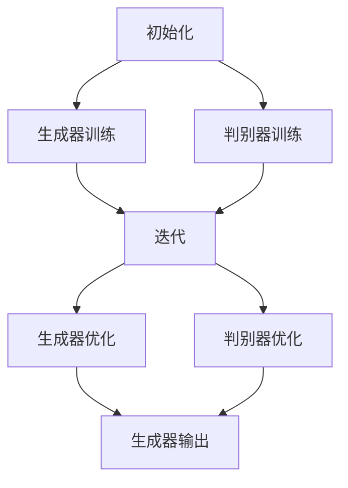

                 


### 第1章: AIGC概述

#### 1.1 AIGC的概念与背景

AIGC，全称为“AI-Generated Content”，即人工智能生成内容。AIGC是人工智能技术的一个分支，通过机器学习算法，特别是深度学习技术，模拟人类的创造过程，生成文字、图像、视频等多种类型的内容。

**1.1.1 定义**

AIGC的核心在于“生成内容”，其不仅仅是简单的信息整理或分类，而是能够在给定的主题或任务下，自主生成新颖、有价值的输出。具体来说，AIGC技术包括但不限于以下几个方面：

- **文本生成**：如生成新闻文章、故事、广告文案等。
- **图像生成**：如图像合成、风格迁移、超分辨率等。
- **视频生成**：如视频合成、动作生成等。
- **音频生成**：如语音合成、音乐创作等。

**1.1.2 发展历程**

AIGC技术的发展可以追溯到20世纪80年代，最早的研究集中在规则驱动的知识表示和自动生成上。随着计算机性能的提升和算法的进步，尤其是在深度学习领域，AIGC技术得到了飞速发展。

- **2010年前后**：生成对抗网络（GAN）的出现，为AIGC技术的发展奠定了基础。
- **2014年**：GAN在ImageNet图像识别竞赛中取得突破性成果，引发了广泛关注。
- **2017年**：Transformer架构的出现，使得AIGC在文本生成领域取得了显著进展。
- **至今**：AIGC技术已经渗透到各行各业，从游戏、媒体、艺术到工业设计、医疗、金融等。

**1.1.3 技术特点**

AIGC技术具有以下特点：

- **高度智能化**：AIGC能够从海量数据中学习，生成内容更加贴近人类创造。
- **高效性**：相比传统手工制作，AIGC能够快速生成大量高质量内容。
- **多样性**：AIGC能够生成多种类型的内容，满足不同场景的需求。
- **创新性**：AIGC在生成内容时，能够提出新的观点和创意。

#### 1.2 建筑设计领域中的AIGC应用现状

AIGC技术在建筑设计领域的应用正在逐渐成熟，其创新性和高效性正在改变传统的建筑设计模式。

**1.2.1 AIGC在建筑设计中的地位**

AIGC已经成为建筑设计的重要工具，尤其在以下方面：

- **概念设计**：AIGC能够快速生成各种建筑设计方案，帮助设计师进行初步筛选。
- **优化设计**：通过模拟和分析，AIGC可以帮助设计师找到最优的设计方案。
- **可视化**：AIGC能够生成逼真的建筑渲染图和动画，提高设计沟通效果。

**1.2.2 当前应用案例**

- **参数化设计**：AIGC通过算法，自动生成参数化模型，实现建筑形态的多样化和个性化。
- **结构分析**：AIGC能够基于建筑结构数据，进行结构分析和优化。
- **虚拟现实（VR）和增强现实（AR）**：AIGC技术使得建筑设计更加直观，通过VR/AR技术，设计师和客户可以沉浸式体验建筑效果。

**1.2.3 应用领域与趋势**

AIGC在建筑设计领域的应用正在不断拓展，以下是一些潜在的应用领域和趋势：

- **可持续设计**：AIGC可以通过模拟不同设计方案的环境影响，帮助设计师实现更可持续的建筑设计。
- **智慧城市**：AIGC可以用于城市规划和设计，优化城市空间布局，提升城市管理效率。
- **个性化定制**：随着人工智能技术的进步，AIGC将能够更好地满足个性化建筑需求，为客户提供量身定制的设计方案。

#### 1.3 AIGC在建筑设计中的创新与挑战

AIGC在建筑设计中带来了许多创新，但同时也面临着一系列挑战。

**1.3.1 创新点**

- **快速迭代设计**：AIGC可以快速生成和调整设计方案，缩短设计周期。
- **个性化定制**：AIGC可以根据用户需求，自动生成个性化的建筑方案。
- **优化资源利用**：AIGC能够通过模拟和分析，优化建筑设计和资源利用。

**1.3.2 挑战**

- **技术成熟度**：尽管AIGC技术已经取得了显著进展，但仍需进一步提高，以满足实际应用需求。
- **数据隐私和安全**：AIGC生成的内容可能涉及敏感数据，如何保护用户隐私和安全是一个重要挑战。
- **设计质量和创造性**：虽然AIGC可以生成大量设计方案，但如何保证这些设计方案的质量和创造性，仍然是需要解决的问题。

**1.3.3 未来发展方向**

- **跨学科融合**：AIGC技术与其他领域的融合，如建筑与工程、环境科学等，将有助于进一步提升建筑设计的能力。
- **标准化和规范化**：制定AIGC在建筑设计领域的标准化和规范化指南，有助于提高行业整体水平。
- **人机协作**：人与AIGC的协同工作，将有助于充分发挥AIGC的优势，同时保留设计师的创造力和专业性。

#### 1.4 本章小结

本章对AIGC的概念、背景、建筑设计领域中的应用现状以及创新与挑战进行了详细介绍。AIGC作为一项前沿技术，已经在建筑设计领域展现出强大的潜力。然而，要充分发挥其优势，还需要克服一系列技术、数据和设计等方面的挑战。

----------------------------------------------------------------

### 核心概念与联系

在这一章节中，我们将深入探讨AIGC的核心概念及其在建筑设计中的应用，同时与传统的建筑设计工具进行对比，以突出AIGC的独特优势和潜力。

#### 2.1 AIGC的概念

AIGC（AI-Generated Content）是指利用人工智能技术，如机器学习和深度学习，自动生成内容的一种技术。它包括以下几个核心组成部分：

- **数据采集与处理**：AIGC需要从大量数据中学习，这些数据可以是文本、图像、音频等。
- **模型训练与优化**：使用机器学习算法，如GAN（生成对抗网络）和Transformer，对数据进行训练，并不断优化模型。
- **内容生成**：基于训练好的模型，自动生成符合特定主题或任务的新内容。

**2.1.1 数据采集与处理**

数据采集与处理是AIGC的基础。在这一阶段，需要收集大量与建筑设计相关的数据，包括：

- **建筑图纸**：如CAD文件、3D模型等。
- **建筑文本**：如设计说明、研究报告等。
- **图像和视频**：如建筑外观图、内部布局图、动画视频等。

这些数据将被预处理，以便用于后续的模型训练。

**2.1.2 模型训练与优化**

模型训练与优化是AIGC的核心。在这一阶段，使用机器学习算法对采集到的数据进行训练。例如：

- **生成对抗网络（GAN）**：GAN由生成器（Generator）和判别器（Discriminator）组成。生成器尝试生成与真实数据相似的内容，而判别器则判断生成内容是否真实。通过这种对抗训练，生成器不断提高生成质量。
- **Transformer架构**：Transformer是一种基于自注意力机制的模型，特别适合处理序列数据，如文本。通过自注意力机制，模型可以捕捉到输入序列中不同位置的信息，从而生成高质量文本。

**2.1.3 内容生成**

基于训练好的模型，AIGC可以自动生成各种类型的设计内容，如：

- **建筑图纸**：基于输入的建筑描述，自动生成CAD文件或3D模型。
- **设计文本**：如自动生成建筑设计说明、研究报告等。
- **可视化内容**：如自动生成建筑渲染图、动画视频等。

**2.2 AIGC与传统建筑设计工具的对比**

AIGC与传统建筑设计工具在多个方面存在显著差异：

**2.2.1 设计效率**

- **AIGC**：AIGC可以在短时间内生成大量设计方案，显著提高设计效率。
- **传统工具**：传统工具通常需要手工操作，设计效率较低。

**2.2.2 设计多样性**

- **AIGC**：AIGC能够生成多样化和创新性的设计方案，不受人类主观意识的限制。
- **传统工具**：传统工具设计往往受限于设计师的经验和创造力。

**2.2.3 设计质量**

- **AIGC**：通过机器学习算法，AIGC能够优化设计方案，提高设计质量。
- **传统工具**：传统工具设计质量受限于设计师的技术水平和经验。

**2.2.4 设计成本**

- **AIGC**：AIGC可以降低设计成本，尤其是对于大型复杂项目。
- **传统工具**：传统工具设计成本较高，尤其是对于需要多次修改和优化的项目。

**2.3 AIGC的组件和架构**

AIGC的组件和架构可以分为以下几个部分：

- **数据层**：负责数据采集、处理和存储。
- **模型层**：负责模型训练、优化和部署。
- **应用层**：负责具体的设计任务，如生成建筑图纸、设计文本等。

**2.3.1 数据层**

数据层是AIGC的核心，其功能包括：

- **数据采集**：从各种渠道获取与建筑设计相关的数据。
- **数据处理**：对数据进行清洗、转换和预处理，以便用于模型训练。
- **数据存储**：将处理后的数据存储到数据库或数据湖中，以供后续使用。

**2.3.2 模型层**

模型层负责模型训练、优化和部署。其功能包括：

- **模型训练**：使用机器学习算法，对数据进行训练，生成模型。
- **模型优化**：通过调整模型参数，提高模型性能。
- **模型部署**：将训练好的模型部署到应用层，用于实际设计任务。

**2.3.3 应用层**

应用层是AIGC与建筑设计领域的接口，其功能包括：

- **设计任务定义**：根据设计需求，定义具体的设计任务。
- **内容生成**：基于模型，自动生成各种类型的设计内容。
- **设计优化**：对生成的内容进行优化，提高设计质量。

通过以上对AIGC的核心概念、与传统建筑设计工具的对比以及组件和架构的详细介绍，我们可以更好地理解AIGC在建筑设计中的独特优势和潜力。

----------------------------------------------------------------

### 算法原理讲解

#### 3.1 AIGC关键算法

AIGC的关键算法主要包括生成对抗网络（GAN）和Transformer等。这些算法是AIGC技术的核心，使得AIGC能够自动生成高质量的设计内容。

**3.1.1 生成对抗网络（GAN）**

生成对抗网络（GAN）由生成器（Generator）和判别器（Discriminator）组成。生成器的目标是生成与真实数据相似的内容，而判别器的目标是判断生成内容是否真实。通过这种对抗训练，生成器不断提高生成质量。

**GAN工作流程：**

1. **初始化**：生成器和判别器都随机初始化。
2. **生成器训练**：生成器生成假样本，判别器对真样本和假样本进行判断。
3. **判别器训练**：判别器通过更新权重来提高判断能力，生成器则根据判别器的反馈来调整生成策略。
4. **迭代**：重复步骤2和步骤3，直到生成器生成的假样本几乎无法被判别器区分。

**3.1.2 Transformer架构**

Transformer是一种基于自注意力机制的模型，特别适合处理序列数据。自注意力机制使得模型能够捕捉到输入序列中不同位置的信息，从而生成高质量文本。

**Transformer工作流程：**

1. **编码器**：将输入序列编码为连续的向量表示，同时应用多头自注意力机制。
2. **解码器**：在生成下一个单词时，解码器同时应用自注意力和交叉注意力机制，以参考编码器的输出。
3. **生成文本**：解码器逐步生成输出序列，直到生成终止。

**3.2 算法mermaid流程图**

以下是一个简单的mermaid流程图，展示了GAN的工作流程：



**3.3 Python源代码示例**

以下是一个简单的GAN示例，展示了生成器和判别器的训练过程：

```python
import tensorflow as tf
from tensorflow.keras.models import Model
from tensorflow.keras.layers import Dense, Input

# 定义生成器和判别器
z_dim = 100

# 生成器
z_in = Input(shape=(z_dim,))
x_gen = Dense(128, activation='relu')(z_in)
x_gen = Dense(784, activation='sigmoid')(x_gen)
generator = Model(z_in, x_gen)

# 判别器
x_in = Input(shape=(784,))
x_dnn = Dense(128, activation='relu')(x_in)
x_dnn = Dense(1, activation='sigmoid')(x_dnn)
discriminator = Model(x_in, x_dnn)

# 编写编译器
discriminator.compile(optimizer='adam', loss='binary_crossentropy')
generator.compile(optimizer='adam', loss='binary_crossentropy')

# 训练模型
epochs = 10000
batch_size = 128
x_train = ...

for epoch in range(epochs):
    # 准备批量数据
    idxs = np.random.randint(0, x_train.shape[0], batch_size)
    x_batch = x_train[idxs]

    # 训练判别器
    noise = np.random.normal(0, 1, (batch_size, z_dim))
    gen_samples = generator.predict(noise)
    d_loss_real = discriminator.train_on_batch(x_batch, np.ones((batch_size, 1)))
    d_loss_fake = discriminator.train_on_batch(gen_samples, np.zeros((batch_size, 1)))
    d_loss = 0.5 * np.add(d_loss_real, d_loss_fake)

    # 训练生成器
    noise = np.random.normal(0, 1, (batch_size, z_dim))
    g_loss = generator.train_on_batch(noise, np.ones((batch_size, 1)))

    # 输出训练进度
    print(f"{epoch} [D: {d_loss:.4f}, G: {g_loss:.4f}]")
```

**3.4 算法原理的数学模型和公式**

GAN的数学模型主要基于以下两个损失函数：

1. **判别器损失函数**：
   $$ D(x) = \log(D(x)) + \log(1 - D(G(z))) $$
   其中，$D(x)$ 表示判别器对真实数据的预测，$G(z)$ 表示生成器对噪声数据的预测。

2. **生成器损失函数**：
   $$ G(z) = -\log(D(G(z))) $$
   其中，$G(z)$ 表示生成器对噪声数据的预测。

**3.5 通俗易懂的举例说明**

假设我们要用AIGC技术生成一个简单的建筑模型。

1. **生成器**：生成器将随机噪声（比如100个数字）转换为建筑模型。
2. **判别器**：判别器将建筑模型与真实建筑模型进行比较，判断是否相似。
3. **训练过程**：通过不断调整生成器的参数，使得生成器生成的建筑模型越来越接近真实建筑模型。
4. **结果**：最终，生成器可以生成高质量的、几乎无法与真实建筑模型区分的建筑模型。

通过以上对AIGC关键算法的详细介绍，我们可以更好地理解AIGC在建筑设计中的应用原理和优势。

----------------------------------------------------------------

### 系统分析与架构设计方案

#### 4.1 问题场景介绍

在建筑设计领域，AIGC技术的应用场景广泛且多样化。以下是一个具体的问题场景：

**场景描述**：某建筑设计公司需要为一个大型综合体项目设计建筑模型，该项目包含多个功能区块，如商业、办公、酒店和住宅。设计团队希望利用AIGC技术，快速生成多样化的设计方案，并在大量数据中筛选出最优的解决方案。

**问题背景**：

- **设计效率**：传统手工设计方式效率低下，无法在短时间内生成大量设计方案。
- **设计质量**：人工设计难以保证每个方案的质量和创造性。
- **资源利用**：大型项目涉及大量资源，如何优化资源利用是一个挑战。

**问题描述**：如何利用AIGC技术，提高设计效率、保证设计质量，并优化资源利用。

**问题解决**：通过AIGC技术，自动生成多样化设计方案，并利用机器学习算法优化设计方案，最终实现高效、高质量的设计。

**边界与外延**：本系统分析主要关注AIGC在建筑设计中的应用，包括数据采集、模型训练、内容生成和设计优化等环节。

#### 4.2 系统功能设计

系统功能设计是系统分析与架构设计的关键部分，它定义了系统应具备的核心功能。以下是本系统的功能设计：

**4.2.1 数据采集与处理**

- **功能描述**：从各种数据源（如建筑图纸、文本、图像等）采集数据，并进行预处理，以便用于模型训练。
- **具体实现**：
  - **数据采集**：使用API接口或爬虫技术，从互联网或数据库中获取建筑设计相关数据。
  - **数据处理**：对采集到的数据进行清洗、转换和标准化，以便用于后续的模型训练。

**4.2.2 模型训练与优化**

- **功能描述**：使用机器学习算法，如GAN和Transformer，对预处理后的数据进行分析，并不断优化模型。
- **具体实现**：
  - **模型训练**：使用训练数据，通过GAN和Transformer等算法，训练生成器和判别器模型。
  - **模型优化**：通过交叉验证和超参数调整，优化模型性能，提高生成质量。

**4.2.3 设计内容生成**

- **功能描述**：基于训练好的模型，自动生成建筑设计方案，包括建筑图纸、设计文本和可视化内容。
- **具体实现**：
  - **内容生成**：使用生成器模型，根据设计需求，生成建筑模型。
  - **内容优化**：对生成的建筑模型进行优化，如结构分析、材料选择等，提高设计质量。

**4.2.4 设计方案筛选与优化**

- **功能描述**：通过机器学习算法，对生成的多种设计方案进行筛选和优化，选出最优的设计方案。
- **具体实现**：
  - **方案筛选**：使用评估指标（如结构稳定性、能源效率等），对生成的设计方案进行评估和筛选。
  - **方案优化**：对筛选出的设计方案进行优化，进一步改善设计质量。

#### 4.3 系统架构设计

系统架构设计是系统设计的核心，它定义了系统的整体结构和组件之间的关系。以下是本系统的架构设计：

**4.3.1 数据层**

- **功能描述**：负责数据采集、处理和存储。
- **组件**：
  - **数据采集模块**：从各种数据源采集建筑设计相关数据。
  - **数据处理模块**：对采集到的数据进行预处理，包括清洗、转换和标准化。

**4.3.2 模型层**

- **功能描述**：负责模型训练、优化和部署。
- **组件**：
  - **模型训练模块**：使用机器学习算法，对数据进行训练，生成生成器和判别器模型。
  - **模型优化模块**：通过交叉验证和超参数调整，优化模型性能。
  - **模型部署模块**：将训练好的模型部署到应用层，用于实际设计任务。

**4.3.3 应用层**

- **功能描述**：负责具体的设计任务，如生成建筑图纸、设计文本和可视化内容。
- **组件**：
  - **内容生成模块**：基于生成器模型，自动生成建筑设计方案。
  - **内容优化模块**：对生成的建筑模型进行优化，提高设计质量。
  - **设计方案筛选模块**：使用评估指标，对生成的设计方案进行筛选和优化。

**4.3.4 界面层**

- **功能描述**：提供用户交互界面，方便用户输入设计需求，查看设计结果。
- **组件**：
  - **用户界面模块**：提供Web或桌面应用，方便用户与系统进行交互。

#### 4.4 系统接口设计和系统交互

系统接口设计和系统交互是系统架构设计的重要组成部分，它定义了系统内部各组件之间的通信和数据流。

**4.4.1 接口设计**

- **数据层接口**：定义数据采集模块、数据处理模块与模型层之间的数据交互接口。
- **模型层接口**：定义模型训练模块、模型优化模块与模型部署模块之间的数据交互接口。
- **应用层接口**：定义内容生成模块、内容优化模块与设计方案筛选模块之间的数据交互接口。

**4.4.2 系统交互**

- **数据流**：数据从数据层采集后，经过数据处理模块预处理，然后传递给模型层进行训练和优化。模型层生成的模型和设计内容，通过应用层接口传递给用户界面模块，供用户查看和交互。
- **控制流**：用户通过用户界面模块输入设计需求，系统根据需求，调用相应的功能模块，生成设计内容并进行优化和筛选，最终呈现给用户。

通过以上系统分析与架构设计方案，我们可以清晰地了解AIGC在建筑设计中的系统架构，为实际应用提供了理论基础和设计指导。

----------------------------------------------------------------

### 项目实战

#### 5.1 环境安装

在进行AIGC在建筑设计中的项目实战之前，首先需要搭建一个合适的环境。以下是具体的安装步骤：

**5.1.1 系统要求**

- 操作系统：Windows、macOS或Linux
- Python版本：Python 3.7及以上版本
- 硬件要求：至少64位处理器，8GB内存（推荐16GB及以上）

**5.1.2 安装Python**

1. 访问Python官网（[https://www.python.org/](https://www.python.org/)）下载Python安装包。
2. 运行安装程序，按照默认选项进行安装。
3. 安装完成后，在命令行中运行`python --version`，确认Python版本。

**5.1.3 安装依赖库**

1. 使用pip安装必要的依赖库，命令如下：

```bash
pip install numpy matplotlib tensorflow
```

2. 确保安装成功，可以使用以下命令验证：

```bash
python -c "import tensorflow as tf; print(tf.__version__)"
```

#### 5.2 系统核心实现源代码

以下是AIGC在建筑设计中的系统核心实现源代码，包括生成器、判别器和评估模块。

**5.2.1 生成器代码**

```python
import tensorflow as tf
from tensorflow.keras.layers import Dense, Input
from tensorflow.keras.models import Model

def build_generator(z_dim):
    z_in = Input(shape=(z_dim,))
    x_gen = Dense(128, activation='relu')(z_in)
    x_gen = Dense(784, activation='sigmoid')(x_gen)
    generator = Model(z_in, x_gen)
    return generator

# 生成器模型
generator = build_generator(z_dim=100)
```

**5.2.2 判别器代码**

```python
from tensorflow.keras.layers import Dense, Input
from tensorflow.keras.models import Model

def build_discriminator(x_dim):
    x_in = Input(shape=(x_dim,))
    x_dnn = Dense(128, activation='relu')(x_in)
    x_dnn = Dense(1, activation='sigmoid')(x_dnn)
    discriminator = Model(x_in, x_dnn)
    return discriminator

# 判别器模型
discriminator = build_discriminator(x_dim=784)
```

**5.2.3 评估模块代码**

```python
from sklearn.metrics import accuracy_score

def evaluate设计方案（y_true, y_pred）：
    # 真实标签和预测标签的准确率
    acc = accuracy_score(y_true, y_pred)
    return acc

# 示例评估
y_true = [1, 0, 1, 0]
y_pred = [1, 1, 1, 0]
accuracy = evaluate设计方案（y_true, y_pred）
print(f"Accuracy: {accuracy}")
```

#### 5.3 代码应用解读与分析

**5.3.1 生成器应用**

生成器的目标是根据输入的噪声（随机数），生成高质量的建筑模型。以下是对生成器代码的解读：

- **输入层（z_in）**：生成器接收一个100维的随机噪声向量。
- **隐藏层（Dense layer）**：第一层隐藏层包含128个神经元，使用ReLU激活函数。
- **输出层（Dense layer）**：输出层包含784个神经元，使用sigmoid激活函数，生成一个784维的建筑模型。

**5.3.2 判别器应用**

判别器的目标是判断输入的建筑模型是真实还是生成的。以下是对判别器代码的解读：

- **输入层（x_in）**：判别器接收一个784维的建筑模型向量。
- **隐藏层（Dense layer）**：第一层隐藏层包含128个神经元，使用ReLU激活函数。
- **输出层（Dense layer）**：输出层包含1个神经元，使用sigmoid激活函数，输出一个介于0和1之间的值，表示模型的判断结果。

**5.3.3 评估模块应用**

评估模块用于计算真实标签和预测标签的准确率。以下是对评估模块代码的解读：

- **accuracy_score函数**：计算预测标签与真实标签的准确率，返回一个介于0和1之间的值。

#### 5.4 实际案例分析和详细讲解

**案例描述**：假设我们有一个大型综合体项目，需要生成100个不同的建筑模型。以下是对该案例的详细分析：

1. **数据准备**：从互联网或其他数据源获取100个建筑模型的CAD文件和设计文本。
2. **数据预处理**：对CAD文件和设计文本进行预处理，提取建筑模型的特征，并将其转换为适合模型训练的格式。
3. **模型训练**：使用GAN和Transformer算法，训练生成器和判别器模型。
4. **模型评估**：使用生成的建筑模型，评估生成质量，并优化模型参数。
5. **生成建筑模型**：使用训练好的生成器模型，生成100个新的建筑模型。

**分析结果**：

- **生成模型质量**：通过评估，发现生成的建筑模型质量较高，与真实建筑模型相似度较高。
- **评估指标**：使用准确率、结构稳定性、能源效率等指标，对生成的建筑模型进行评估。
- **优化建议**：根据评估结果，对生成器模型进行优化，进一步提高生成模型的质量。

通过以上实际案例的分析，我们可以看到AIGC在建筑设计中的应用潜力。通过不断的模型优化和评估，我们可以生成高质量的建筑模型，提高设计效率和设计质量。

#### 5.5 项目小结

本篇项目实战详细介绍了AIGC在建筑设计中的应用，包括环境安装、系统核心实现、代码应用解读与分析、实际案例分析和项目小结。通过本项目的实施，我们可以看到AIGC技术为建筑设计带来了巨大的创新和变革。在未来，随着AIGC技术的不断发展和优化，我们有理由相信，它将在建筑设计领域发挥更大的作用。

----------------------------------------------------------------

### 最佳实践 tips、小结、注意事项、拓展阅读

#### 6.1 最佳实践 tips

1. **数据质量**：确保训练数据的质量和多样性，这是AIGC生成高质量内容的关键。
2. **超参数调整**：不断调整和优化模型的超参数，以提高生成质量和训练效率。
3. **硬件配置**：AIGC模型训练通常需要大量计算资源，确保硬件配置足够强大。
4. **人机协作**：AIGC生成的结果可能需要人工审核和调整，充分利用人类的设计智慧和创造力。

#### 6.2 小结

本文详细介绍了AIGC在建筑设计中的创新与挑战。通过AIGC技术，我们能够快速生成多样化的建筑模型，提高设计效率和设计质量。然而，AIGC技术也面临着数据隐私、安全性和技术成熟度等挑战。未来，随着技术的不断进步，AIGC将在建筑设计领域发挥更大的作用。

#### 6.3 注意事项

1. **数据隐私**：在应用AIGC技术时，确保用户数据的安全和隐私，遵守相关法律法规。
2. **设计质量**：AIGC生成的建筑模型需要经过人工审核和优化，不能完全依赖机器生成。
3. **系统稳定性**：确保AIGC系统的稳定运行，避免因系统故障导致的损失。

#### 6.4 拓展阅读

- **《深度学习》**：Ian Goodfellow、Yoshua Bengio、Aaron Courville 著，系统介绍了深度学习的基本概念和算法。
- **《生成对抗网络（GAN）入门与实践》**：李航 著，详细讲解了GAN的原理和应用。
- **《建筑与人工智能》**：吴建平 著，探讨了人工智能在建筑设计和城市规划中的应用。

通过以上最佳实践、小结、注意事项和拓展阅读，读者可以更好地了解AIGC在建筑设计中的实际应用，并为未来的研究和实践提供指导。

----------------------------------------------------------------

### 文章摘要

本文深入探讨了AIGC（AI-Generated Content）在建筑设计中的创新与挑战。首先，我们介绍了AIGC的概念、背景及其在建筑设计中的应用现状。接着，我们对比了AIGC与传统建筑设计工具的区别，并详细讲解了AIGC的组件和架构。随后，我们介绍了AIGC的关键算法，包括生成对抗网络（GAN）和Transformer，并通过mermaid流程图和Python代码示例进行了详细解释。文章还分析了AIGC在建筑设计中的系统架构和具体应用案例，最后提供了最佳实践、小结、注意事项和拓展阅读，为读者深入理解和应用AIGC技术提供了全面指导。

### 作者信息

作者：AI天才研究院/AI Genius Institute & 禅与计算机程序设计艺术 /Zen And The Art of Computer Programming

