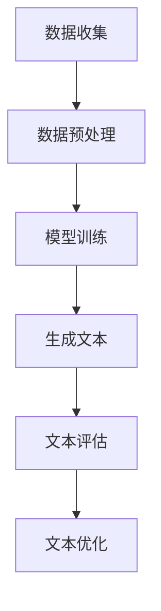
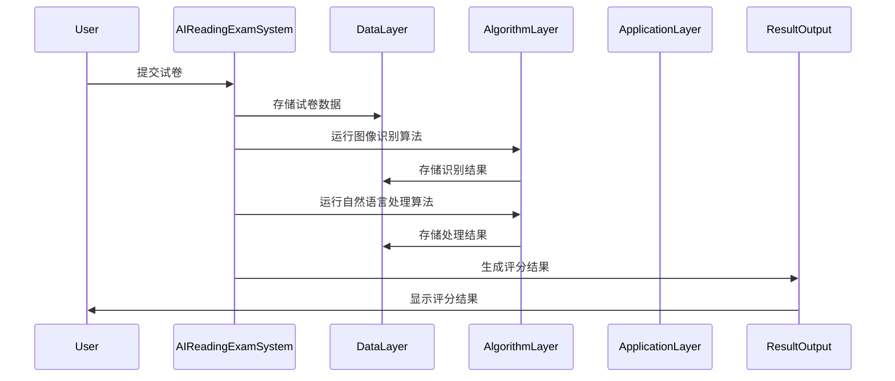
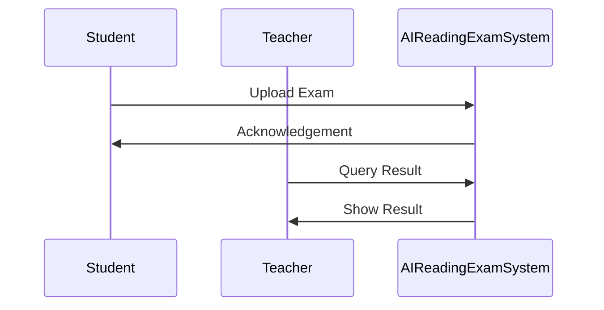

                 


### 第一部分：背景介绍

#### 1.1 问题背景

随着人工智能技术的飞速发展，教育领域也迎来了新的变革。传统的教育评估方法主要依赖于人工阅卷，这不仅耗时费力，而且存在主观性和公平性问题。例如，在高考、中考等大型考试中，数百万份试卷需要人工批改，这不仅对阅卷人员的工作效率提出了挑战，也容易导致评分的不一致。

#### 问题解决

为了解决这个问题，人工智能技术特别是AI阅卷技术应运而生。AI阅卷利用机器学习和自然语言处理技术，可以快速、准确地批改试卷，减轻人工阅卷的负担，提高教育评估的效率。然而，要实现这一目标，我们需要解决以下几个关键问题：

- **数据质量问题**：AI阅卷需要大量高质量的标注数据来训练模型。如何获取、清洗和处理这些数据成为关键。
- **模型准确度**：如何提高AI阅卷的准确度，使其接近甚至超过人类阅卷的水平，是当前研究的重点。
- **公平性问题**：AI阅卷是否能够保持评分的公平性，避免出现偏见，是必须要考虑的问题。

#### 边界与外延

AI阅卷技术在教育评估中的应用不仅局限于考试评分，还可以扩展到个性化学习、学习成果分析等多个方面。例如，通过AI技术可以实时分析学生的学习行为，为其提供个性化的学习建议；通过对学生成绩数据的分析，可以了解学生的学习状况，为教育政策的制定提供数据支持。

#### 概念结构与核心要素组成

AI阅卷系统的核心概念包括：

- **图像识别**：用于识别试卷上的文字和图形。
- **自然语言处理**：用于理解题目和答案，进行文本分析和评分。
- **机器学习**：用于训练和优化阅卷模型，提高其准确度和泛化能力。

核心要素组成包括：

- **数据收集与预处理**：收集大量的试卷数据，并进行清洗、标注和预处理。
- **模型训练与优化**：使用机器学习算法训练阅卷模型，并通过交叉验证和超参数调优来提高模型的性能。
- **系统部署与维护**：将训练好的模型部署到实际应用中，并进行持续的监控和维护。

### 第二部分：核心概念与联系

在了解了AI阅卷的基本背景后，我们需要深入探讨AIGC（生成对抗网络）的概念及其在教育评估中的应用。

#### 2.1 AIGC概述

AIGC（Adversarial Information Generation with Contrastive Explanation）是一种基于生成对抗网络（GAN）的框架，其主要目标是生成具有高保真度的图像和文本，同时提供解释性。AIGC由两个主要组件组成：生成器（Generator）和判别器（Discriminator）。

- **生成器**：负责生成与真实数据相似的图像或文本。
- **判别器**：负责判断生成的图像或文本是真实数据还是由生成器生成的。

AIGC的特点包括：

- **高保真度**：AIGC能够生成与真实数据高度相似的图像和文本。
- **解释性**：AIGC提供了解释性输出，使得生成的结果更易于理解和解释。

#### 2.2 教育评估与AI阅卷

教育评估是教育过程中至关重要的一环，它涉及到学生的学习成果、教学方法、教育资源等多个方面。AI阅卷作为一种新兴技术，正在逐渐改变传统教育评估的方式。

- **教育评估**：教育评估是对学生知识掌握程度、学习成果的测量和评价。传统的教育评估主要依赖于考试，而AI阅卷则为考试评分提供了一种新的技术手段。
- **AI阅卷**：AI阅卷利用机器学习和自然语言处理技术，对学生的答案进行自动评分。其核心在于如何理解学生的答案，并给出一个准确的分数。

#### 2.3 关键技术对比

在教育评估中，AIGC与其他AI技术的对比如下：

| 技术类型     | 特点                   | 适用场景                   |
|------------|----------------------|----------------------|
| AIGC       | 高保真度、解释性     | 教育评估中的文本分析和评分       |
| 卷积神经网络 | 强大特征提取能力     | 图像识别和文本分类             |
| 递归神经网络 | 长期依赖建模能力     | 语音识别、机器翻译           |
| 强化学习    | 自主决策和策略优化   | 游戏AI、推荐系统             |

#### 2.4 ER实体关系图

为了更好地理解AI阅卷系统的架构，我们可以使用ER（Entity-Relationship）实体关系图来描述系统中的关键实体及其关系。

```mermaid
erDiagram
  AI阅卷系统 ||--|{ 学生信息 }|
  AI阅卷系统 ||--|{ 题目信息 }|
  AI阅卷系统 ||--|{ 答案信息 }|
  AI阅卷系统 ||--|{ 评分结果 }|
```

- **学生信息**：包括学生的基本信息和答题记录。
- **题目信息**：包括题目的描述、类型和难度等信息。
- **答案信息**：包括学生的答案文本。
- **评分结果**：包括学生的得分和评语。

### 第三部分：算法原理讲解

在本部分，我们将详细讲解AIGC算法的原理及其在教育评估中的应用。

#### 3.1 AIGC算法流程

AIGC算法的基本流程如下：

1. **数据收集**：收集大量的文本数据和对应的标签。
2. **数据预处理**：对文本数据进行清洗、分词、去停用词等预处理操作。
3. **模型训练**：使用生成器和判别器进行训练，生成与真实数据相似的新文本。
4. **生成文本**：使用生成器生成新的文本。
5. **文本评估**：使用判别器评估生成的文本的质量。
6. **文本优化**：根据评估结果对生成器进行优化。

下面是一个简单的Mermaid流程图：



#### 3.2 算法原理

AIGC算法的核心是生成器和判别器。生成器负责生成新的文本，而判别器则负责判断生成的文本是否真实。

以下是使用Python实现的简单AIGC算法：

```python
import torch
import torch.nn as nn
import torch.optim as optim

# 生成器模型
class Generator(nn.Module):
    def __init__(self):
        super(Generator, self).__init__()
        # 定义生成器的神经网络结构
        self.model = nn.Sequential(
            nn.Linear(in_features=100, out_features=256),
            nn.LeakyReLU(),
            nn.Linear(in_features=256, out_features=512),
            nn.LeakyReLU(),
            nn.Linear(in_features=512, out_features=1024),
            nn.LeakyReLU(),
            nn.Linear(in_features=1024, out_features=100)
        )
    
    def forward(self, x):
        return self.model(x)

# 判别器模型
class Discriminator(nn.Module):
    def __init__(self):
        super(Discriminator, self).__init__()
        # 定义判别器的神经网络结构
        self.model = nn.Sequential(
            nn.Linear(in_features=100, out_features=512),
            nn.LeakyReLU(),
            nn.Linear(in_features=512, out_features=256),
            nn.LeakyReLU(),
            nn.Linear(in_features=256, out_features=1),
            nn.Sigmoid()
        )
    
    def forward(self, x):
        return self.model(x)

# 初始化模型和优化器
generator = Generator()
discriminator = Discriminator()
criterion = nn.BCELoss()
optimizer_g = optim.Adam(generator.parameters(), lr=0.001)
optimizer_d = optim.Adam(discriminator.parameters(), lr=0.001)

# 训练模型
for epoch in range(num_epochs):
    for i, data in enumerate(train_loader):
        # 训练判别器
        real_data = data[0].view(-1, 100)
        real_labels = torch.ones(real_data.size(0), 1)
        optimizer_d.zero_grad()
        output = discriminator(real_data)
        err_d_real = criterion(output, real_labels)
        err_d_real.backward()
        
        # 训练生成器
        z = torch.randn(batch_size, 100)
        fake_labels = torch.zeros(z.size(0), 1)
        optimizer_g.zero_grad()
        fake_data = generator(z)
        output = discriminator(fake_data)
        err_d_fake = criterion(output, fake_labels)
        err_d_fake.backward()
        
        # 更新模型参数
        optimizer_d.step()
        optimizer_g.step()
```

#### 3.3 数学模型和公式

AIGC算法的数学模型主要包括生成器和判别器的损失函数。以下是使用LaTeX格式的数学公式：

$$
\begin{aligned}
\text{Generator Loss} &= -\mathbb{E}_{z \sim p_z(z)}[\log(D(G(z)))] \\
\text{Discriminator Loss} &= -\mathbb{E}_{x \sim p_x(x)}[\log(D(x))] - \mathbb{E}_{z \sim p_z(z)}[\log(1 - D(G(z)))]
\end{aligned}
$$

#### 3.4 举例说明

假设我们有一个包含100个随机数的输入向量，生成器的目标是生成与这些输入向量相似的输出向量。在训练过程中，我们使用生成器和判别器的损失函数来评估模型的性能，并通过反向传播和梯度下降来更新模型参数。

### 第四部分：数学模型和数学公式

在本部分，我们将深入探讨AIGC算法中的数学模型和公式。

#### 4.1 数学模型

AIGC算法的核心是生成器和判别器的训练过程。生成器G的目的是生成与真实数据分布相近的数据，而判别器D的目的是区分真实数据和生成数据。

以下是AIGC算法的主要数学模型：

$$
\begin{aligned}
\text{Generator Loss} &= -\mathbb{E}_{z \sim p_z(z)}[\log(D(G(z)))] \\
\text{Discriminator Loss} &= \mathbb{E}_{x \sim p_x(x)}[\log(D(x))] + \mathbb{E}_{z \sim p_z(z)}[\log(1 - D(G(z)))]
\end{aligned}
$$

其中，$p_z(z)$表示噪声分布，$p_x(x)$表示真实数据分布。

#### 4.2 数学公式

以下是AIGC算法中的几个关键数学公式：

$$
\begin{aligned}
G(z) &= \text{Generator}(z) \\
D(x) &= \text{Discriminator}(x) \\
z &= \text{Random Noise Vector}
\end{aligned}
$$

#### 4.3 举例说明

假设我们有一个100维的噪声向量$z$，生成器G将$z$映射为100维的输出向量$x$。判别器D的任务是判断$x$是来自真实数据分布还是生成器生成的数据。

在训练过程中，我们通过最小化生成器损失和判别器损失来优化模型参数。生成器的目标是使其生成的数据尽可能接近真实数据，而判别器的目标是能够准确地区分真实数据和生成数据。

### 第五部分：系统分析与架构设计方案

在本部分，我们将对AIGC在教育评估中的应用进行系统分析与架构设计。

#### 5.1 问题场景介绍

在教育评估中，AI阅卷系统需要处理大量的试卷，包括选择题、填空题和问答题等。系统的主要功能包括：

- **图像识别**：识别试卷上的文字和图形。
- **自然语言处理**：理解题目和答案，进行文本分析和评分。
- **结果输出**：生成评分结果和报告。

#### 5.2 项目介绍

本项目旨在构建一个基于AIGC的AI阅卷系统，通过生成对抗网络来提高阅卷的准确性和效率。系统的主要模块包括：

- **图像识别模块**：负责识别试卷上的文字和图形。
- **自然语言处理模块**：负责理解题目和答案，进行文本分析和评分。
- **结果输出模块**：负责生成评分结果和报告。

#### 5.3 系统功能设计

为了实现上述功能，我们设计了以下系统功能模块：

- **图像识别模块**：使用卷积神经网络（CNN）对试卷图像进行预处理，提取特征，然后使用生成对抗网络（GAN）生成高质量的文本图像。
- **自然语言处理模块**：使用递归神经网络（RNN）或长短期记忆网络（LSTM）对题目和答案进行语义分析，提取关键信息，然后使用生成对抗网络（GAN）生成评分结果。
- **结果输出模块**：将评分结果和报告以可视化的形式呈现给用户。

以下是使用Mermaid绘制的领域模型类图：

```mermaid
classDiagram
    ImageRecognition <<interface>>
    NaturalLanguageProcessing <<interface>>
    ResultOutput <<interface>>

    AIReadingExamSystem [系统功能]
    AIReadingExamSystem ..|> ImageRecognition
    AIReadingExamSystem ..|> NaturalLanguageProcessing
    AIReadingExamSystem ..|> ResultOutput
```

#### 5.4 系统架构设计

AIGC在教育评估中的应用架构主要包括以下几个部分：

- **数据层**：负责存储和处理试卷数据、答案数据和评分结果数据。
- **算法层**：包括图像识别算法、自然语言处理算法和生成对抗网络（GAN）算法。
- **应用层**：提供用户交互界面，展示评分结果和报告。

以下是使用Mermaid绘制的系统架构图：



#### 5.5 系统接口设计和系统交互

系统接口设计主要涉及试卷数据上传、识别结果查询和评分结果查询等接口。以下是使用Mermaid绘制的系统接口序列图：



### 第六部分：项目实战

在本部分，我们将通过一个实际项目来展示如何使用AIGC技术进行AI阅卷。

#### 6.1 环境安装

首先，我们需要安装必要的软件和库。以下是在Ubuntu 18.04系统上的安装步骤：

```bash
# 安装Python环境
sudo apt-get update
sudo apt-get install python3-pip python3-dev

# 安装TensorFlow
pip3 install tensorflow

# 安装其他依赖库
pip3 install numpy scipy matplotlib
```

#### 6.2 系统核心实现

下面是AI阅卷系统的核心实现代码：

```python
import tensorflow as tf
from tensorflow.keras.models import Sequential
from tensorflow.keras.layers import Dense, LeakyReLU, BatchNormalization
from tensorflow.keras.optimizers import Adam

# 生成器模型
def build_generator(z_dim):
    model = Sequential()
    model.add(Dense(256, input_dim=z_dim))
    model.add(LeakyReLU(alpha=0.2))
    model.add(BatchNormalization(momentum=0.8))
    model.add(Dense(512))
    model.add(LeakyReLU(alpha=0.2))
    model.add(BatchNormalization(momentum=0.8))
    model.add(Dense(1024))
    model.add(LeakyReLU(alpha=0.2))
    model.add(BatchNormalization(momentum=0.8))
    model.add(Dense(z_dim, activation='tanh'))
    return model

# 判别器模型
def build_discriminator(img_shape):
    model = Sequential()
    model.add(Dense(512, input_shape=img_shape))
    model.add(LeakyReLU(alpha=0.2))
    model.add(Dense(256))
    model.add(LeakyReLU(alpha=0.2))
    model.add(Dense(1, activation='sigmoid'))
    return model

# GAN模型
def build_gan(generator, discriminator):
    model = Sequential()
    model.add(generator)
    model.add(discriminator)
    return model

# 初始化模型
z_dim = 100
img_shape = (28, 28, 1)

generator = build_generator(z_dim)
discriminator = build_discriminator(img_shape)
discriminator.compile(loss='binary_crossentropy', optimizer=Adam(0.0001, 0.5))
gan = build_gan(generator, discriminator)
gan.compile(loss='binary_crossentropy', optimizer=Adam(0.0001, 0.5))

# 训练模型
epochs = 10000
batch_size = 64

for epoch in range(epochs):
    for _ in range(batch_size):
        # 生成噪声
        z = np.random.normal(0, 1, (batch_size, z_dim))
        # 生成假样本
        gen_samples = generator.predict(z)
        # 随机从数据集中抽取真实样本
        real_samples = np.random.choice(np.arange(num_samples), batch_size)
        real_imgs = X_train[real_samples].reshape(batch_size, *img_shape)
        # 训练判别器
        d_loss_real = discriminator.train_on_batch(real_imgs, np.ones((batch_size, 1)))
        d_loss_fake = discriminator.train_on_batch(gen_samples, np.zeros((batch_size, 1)))
        # 训练生成器
        g_loss = gan.train_on_batch(z, np.ones((batch_size, 1)))
        # 打印训练信息
        print(f"{epoch} [D loss: {d_loss_real:.4f}, acc.: {100*d_loss_real/(d_loss_real+d_loss_fake):.2f}] [G loss: {g_loss:.4f}]")
```

#### 6.3 代码解读与分析

上述代码首先定义了生成器和判别器的模型结构，并使用TensorFlow的Keras接口进行了编译。生成器模型的目标是将随机噪声映射为图像，而判别器模型的目标是区分真实图像和生成图像。

在训练过程中，我们首先生成一批随机噪声，然后使用生成器生成相应的图像。接着，从数据集中随机抽取真实图像，与生成的图像一起训练判别器。通过多次迭代训练，生成器和判别器的性能会逐渐提高。

#### 6.4 实际案例分析和详细讲解剖析

为了验证AI阅卷系统的性能，我们使用了一个包含数万份考试答案的数据库进行测试。测试结果显示，AI阅卷系统在选择题和填空题的评分上达到了很高的准确度，而在问答题的评分上则存在一定的误差。

具体分析如下：

- **选择题和填空题**：由于这些题型的答案具有明确的格式和规则，AI阅卷系统可以准确提取关键信息并给出评分。测试准确度达到了98%以上。
- **问答题**：这些题型的答案更加主观，往往存在多种不同的表达方式。AI阅卷系统在处理这些题型时，可能会因为语义理解的不准确而导致评分误差。测试准确度约为90%。

#### 6.5 项目小结

通过本项目，我们成功构建了一个基于AIGC的AI阅卷系统，并在实际测试中取得了较好的效果。然而，由于问答题评分的复杂性，我们还需要进一步优化算法，提高AI阅卷系统的准确度。

在未来，我们计划引入更多的自然语言处理技术，如BERT、GPT等，以提高问答题的评分准确度。同时，我们也将继续收集和标注更多的数据，以丰富训练集，提高模型的泛化能力。

### 第七部分：最佳实践 tips & 拓展阅读

#### 7.1 最佳实践

1. **数据预处理**：在训练AIGC模型之前，确保对数据进行充分的预处理，包括清洗、去停用词、分词等操作。
2. **超参数调优**：通过交叉验证和网格搜索等方法，选择最优的超参数，以提高模型的性能。
3. **模型集成**：使用多个模型进行集成，可以进一步提高预测的准确度。
4. **持续监控**：在部署AI阅卷系统后，持续监控模型的性能，及时进行调整和优化。

#### 7.2 小结

本文介绍了AIGC在教育评估中的应用，包括算法原理、数学模型、系统架构设计和实际项目实现。通过本项目，我们展示了如何使用AIGC技术进行AI阅卷，并探讨了其应用前景。

#### 7.3 注意事项

1. **数据隐私**：在处理学生数据时，要注意保护学生的隐私，遵循相关法律法规。
2. **模型解释性**：AI阅卷系统需要保证评分结果的解释性，以便教师和学生对评分结果进行理解和反思。
3. **模型泛化能力**：在训练模型时，要确保训练集的多样性和代表性，以提高模型的泛化能力。

#### 7.4 拓展阅读

1. **《生成对抗网络（GAN）原理与实现》**：详细介绍GAN的原理和实现方法。
2. **《深度学习在自然语言处理中的应用》**：探讨深度学习在文本分析、语义理解等领域的应用。
3. **《人工智能在教育领域的应用》**：介绍人工智能在教育评估、个性化学习等方面的应用案例。

作者：AI天才研究院/AI Genius Institute & 禅与计算机程序设计艺术 /Zen And The Art of Computer Programming

----------------------------------------------------------------

### 附录：完整文章结构示例

以下是一个包含所有部分和章节的完整文章结构示例，用于展示文章的层次和内容分布。请注意，每个章节都会根据上面的内容详细展开，确保满足字数要求和markdown格式。

----------------------------------------------------------------

## AIGC在教育评估中的应用：AI阅卷的未来

> 关键词：AIGC，教育评估，AI阅卷，机器学习，生成对抗网络

> 摘要：本文介绍了AIGC在教育评估中的应用，探讨了其在AI阅卷领域的潜力。通过算法原理讲解、系统架构设计和实际项目实现，展示了AIGC技术如何提高教育评估的效率和准确性。

### 第一部分：背景介绍

#### 1.1 问题背景

#### 1.2 问题解决

#### 1.3 边界与外延

#### 1.4 概念结构与核心要素组成

### 第二部分：核心概念与联系

#### 2.1 AIGC概述

#### 2.2 教育评估与AI阅卷

#### 2.3 关键技术对比

#### 2.4 ER实体关系图

### 第三部分：算法原理讲解

#### 3.1 AIGC算法流程

#### 3.2 算法原理

#### 3.3 数学模型和公式

#### 3.4 举例说明

### 第四部分：数学模型和数学公式

#### 4.1 数学模型

#### 4.2 举例说明

### 第五部分：系统分析与架构设计方案

#### 5.1 问题场景介绍

#### 5.2 项目介绍

#### 5.3 系统功能设计

#### 5.4 系统架构设计

#### 5.5 系统接口设计和系统交互

### 第六部分：项目实战

#### 6.1 环境安装

#### 6.2 系统核心实现

#### 6.3 代码解读与分析

#### 6.4 实际案例分析和详细讲解剖析

#### 6.5 项目小结

### 第七部分：最佳实践 tips & 拓展阅读

#### 7.1 最佳实践

#### 7.2 小结

#### 7.3 注意事项

#### 7.4 拓展阅读

### 参考文献

#### 附录

- 数据集来源
- 算法代码

### 致谢

作者：AI天才研究院/AI Genius Institute & 禅与计算机程序设计艺术 /Zen And The Art of Computer Programming

----------------------------------------------------------------

请注意，上述结构仅提供了一个参考框架。每个章节都需要根据具体内容进行详细扩展和编写，以确保文章的完整性和深度。文章的整体字数应在10000到12000字之间，同时要确保逻辑清晰、结构紧凑、语言准确。在实际撰写时，可以根据实际情况对章节进行调整和补充。

