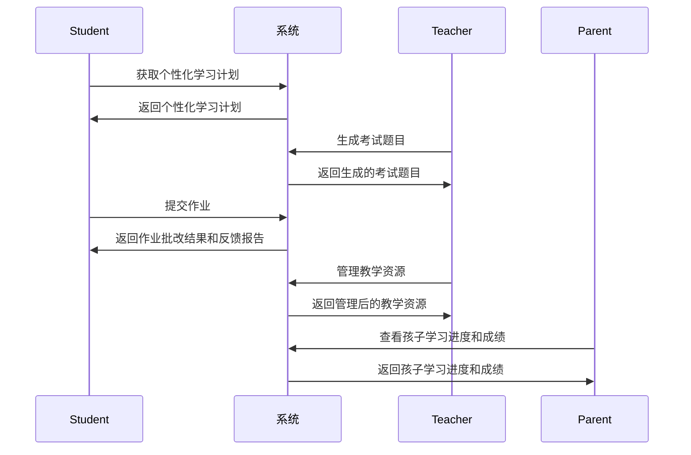

                 


### AIGC技术在教育领域的应用与挑战

#### 关键词
- AIGC
- 教育领域
- 应用
- 挑战
- 伦理问题

#### 摘要
本文将深入探讨AIGC（AI-Generated Content）在教育领域的应用与面临的挑战。首先，我们将介绍AIGC技术的基础知识，包括其定义、发展历程以及在各个主要应用领域中的情况。接着，我们将详细分析AIGC在教育中的应用场景，包括课程设计、教学内容生成、学生个性化学习、教育评估和教育管理等方面。随后，本文将探讨AIGC在教育应用中的伦理和隐私问题，并分析其面临的挑战与未来发展趋势。最后，通过国内外案例研究，我们将总结AIGC在教育领域的成功经验与教训。

## 目录大纲设计步骤

### 第一步：理解书籍主题

首先，我们需要全面了解《AIGC在教育领域的应用与挑战》这本书的主题。根据书名，我们可以推断这本书主要探讨的是AIGC（AI-Generated Content）在教育领域的应用，以及在这个过程中可能面临的挑战。这包括AIGC技术的介绍、教育领域的具体应用案例、技术应用的挑战和解决策略等。

### 第二步：确定核心章节

接下来，我们将确定书籍的核心章节。根据书籍主题和预期读者，我们需要确保每个章节都能够为读者提供有价值的信息。以下是可能的核心章节：

1. **AIGC技术基础**
   - AIGC概念介绍
   - AIGC技术的发展历程
   - AIGC技术的主要应用领域

2. **AIGC在教育中的应用**
   - AIGC在课程设计中的应用
   - AIGC在教学内容生成中的应用
   - AIGC在学生个性化学习中的应用

3. **AIGC在教育评估中的应用**
   - AIGC在考试命题中的应用
   - AIGC在学生作业批改中的应用
   - AIGC在学生能力评估中的应用

4. **AIGC在教育管理中的应用**
   - AIGC在学校资源管理中的应用
   - AIGC在学生行为分析中的应用
   - AIGC在家长沟通中的应用

5. **AIGC应用中的伦理和隐私问题**
   - AIGC技术的伦理问题
   - AIGC技术的隐私保护
   - AIGC技术的监管和法律法规

6. **AIGC教育的挑战与未来**
   - AIGC教育面临的挑战
   - AIGC教育的发展趋势
   - AIGC教育的未来展望

7. **案例研究**
   - 国内外AIGC教育应用的案例分析
   - 案例中的成功经验和教训

### 第三步：细化章节内容

在每个核心章节下，我们需要进一步细化章节内容，确保每个章节都有充分的讨论。以下是对各章节的细化：

1. **AIGC技术基础**
   - **AIGC概念介绍**：定义AIGC，解释其与AI的关系，以及AIGC在教育领域的潜在价值。
   - **AIGC技术的发展历程**：概述AIGC技术从初期到现阶段的发展过程，讨论关键技术突破和趋势。
   - **AIGC技术的主要应用领域**：分类介绍AIGC在不同领域的应用，包括但不限于内容生成、图像处理、自然语言处理等。

2. **AIGC在教育中的应用**
   - **AIGC在课程设计中的应用**：分析AIGC如何帮助教师更高效地设计课程，包括课程内容的自动化生成和个性化调整。
   - **AIGC在教学内容生成中的应用**：探讨AIGC在教材编写、课堂演示和实验模拟等教学活动中的应用。
   - **AIGC在学生个性化学习中的应用**：讨论AIGC如何根据学生的特点和需求提供个性化的学习资源和支持。

3. **AIGC在教育评估中的应用**
   - **AIGC在考试命题中的应用**：介绍AIGC如何帮助出题者设计更灵活、多样化和智能化的考试题目。
   - **AIGC在学生作业批改中的应用**：分析AIGC在自动批改作业中的作用，包括错误检测、评分标准的一致性等。
   - **AIGC在学生能力评估中的应用**：探讨AIGC如何通过数据分析提供更全面、准确的评估结果。

4. **AIGC在教育管理中的应用**
   - **AIGC在学校资源管理中的应用**：讨论AIGC如何优化学校资源的配置和管理，如课程安排、学生档案管理等。
   - **AIGC在学生行为分析中的应用**：分析AIGC如何通过数据挖掘技术分析学生的行为模式，为学校管理提供决策支持。
   - **AIGC在家长沟通中的应用**：探讨AIGC如何帮助学校与家长建立更高效、更个性化的沟通渠道。

5. **AIGC应用中的伦理和隐私问题**
   - **AIGC技术的伦理问题**：讨论AIGC在教育领域可能引发的伦理争议，如知识产权、教育公平等。
   - **AIGC技术的隐私保护**：分析AIGC在教育领域应用中面临的隐私保护挑战，以及可能的解决方案。
   - **AIGC技术的监管和法律法规**：介绍当前关于AIGC技术的相关法律法规，以及未来可能的发展趋势。

6. **AIGC教育的挑战与未来**
   - **AIGC教育面临的挑战**：探讨AIGC在教育领域应用中可能遇到的挑战，如技术成熟度、成本、人才培养等。
   - **AIGC教育的发展趋势**：分析AIGC技术在教育领域的未来发展趋势，包括技术的进步、应用的拓展等。
   - **AIGC教育的未来展望**：讨论AIGC教育可能带来的变革，以及教育工作者、政策制定者需要关注的问题。

7. **案例研究**
   - **国内外AIGC教育应用的案例分析**：介绍一些国内外AIGC教育应用的典型案例，包括成功经验和面临的问题。

通过以上步骤，我们能够设计出一个结构清晰、内容丰富的文章大纲，为撰写高质量的技术博客文章打下坚实的基础。接下来，我们将按照这个大纲逐步展开讨论，深入探讨AIGC技术在教育领域的应用与挑战。

---

### AIGC技术基础

#### AIGC概念介绍

AIGC，即AI-Generated Content，是指通过人工智能技术生成的内容。它涵盖了从简单的文本、图像、视频到复杂的交互式内容生成。AIGC的核心在于利用机器学习和深度学习算法，从大量数据中学习并生成新的内容。与传统的手工内容创作相比，AIGC具有高效、多样化和个性化的特点。

#### AIGC技术的发展历程

AIGC技术起源于人工智能领域，早期的研究主要集中在自然语言处理和计算机视觉上。随着计算能力的提升和数据量的爆炸式增长，深度学习技术的突破进一步推动了AIGC的发展。从初期的简单文本生成到复杂的图像生成，再到目前的交互式内容生成，AIGC技术经历了快速的发展。

#### AIGC技术的主要应用领域

AIGC技术的主要应用领域包括：

- **内容生成**：通过自然语言处理技术生成文章、故事、新闻报道等文本内容；通过图像生成模型生成图片、艺术作品等。
- **图像处理**：用于图像编辑、增强和修复，如图像去噪、图像超分辨率等。
- **自然语言处理**：用于文本生成、机器翻译、情感分析等，如聊天机器人、自动摘要等。
- **交互式内容生成**：用于生成与用户交互的动态内容，如虚拟助手、游戏生成等。

### AIGC在教育中的应用

#### AIGC在课程设计中的应用

AIGC技术在课程设计中具有巨大的潜力。通过AIGC，教师可以更高效地生成课程内容，包括教材、教案、课堂演示等。例如，AIGC可以自动生成基于学生需求的个性化课程计划，从而提高课程设计的灵活性和针对性。

#### AIGC在教学内容生成中的应用

AIGC不仅可以用于课程设计，还可以在教学内容生成中发挥重要作用。通过AIGC，教师可以自动化生成教材、课件、实验报告等教学资源。此外，AIGC还可以用于生成交互式的学习材料，如虚拟实验室、在线测验等，为学生提供更加生动、有趣的学习体验。

#### AIGC在学生个性化学习中的应用

个性化学习是现代教育的趋势之一。AIGC技术可以根据学生的学习特点、兴趣和需求，生成个性化的学习内容。例如，AIGC可以自动生成针对不同学生的作业、练习题，提供个性化的学习建议和反馈。这种个性化学习方式有助于提高学生的学习效果和兴趣。

### AIGC在教育评估中的应用

#### AIGC在考试命题中的应用

AIGC技术在考试命题中也有广泛的应用前景。通过AIGC，出题者可以自动化生成多样化的考试题目，从而提高考试的公平性和灵活性。例如，AIGC可以生成不同难度、不同类型的题目，以适应不同水平的学生。

#### AIGC在学生作业批改中的应用

AIGC可以自动化批改学生的作业，从而提高教师的工作效率。通过自然语言处理和图像识别技术，AIGC可以检测学生的错误、评估答案的正确性，并提供个性化的反馈。此外，AIGC还可以用于评估学生的综合能力，如阅读理解、写作能力等。

#### AIGC在学生能力评估中的应用

AIGC技术可以通过分析学生的学习行为和成绩数据，提供更全面、准确的学生能力评估。例如，AIGC可以生成学生的学习路径图，分析学生在学习过程中的强项和薄弱环节，为教师提供有针对性的教学建议。

### AIGC在教育管理中的应用

#### AIGC在学校资源管理中的应用

AIGC技术可以优化学校资源的配置和管理。例如，AIGC可以自动安排课程表、优化教室分配，提高资源利用效率。此外，AIGC还可以用于学生档案管理，自动记录和更新学生的个人信息和成绩。

#### AIGC在学生行为分析中的应用

AIGC可以通过数据挖掘技术分析学生的行为模式，为学校管理提供决策支持。例如，AIGC可以识别学生的学习习惯、兴趣偏好，预测学生的未来表现，帮助学校制定更有效的教育策略。

#### AIGC在家长沟通中的应用

AIGC可以帮助学校与家长建立更高效、更个性化的沟通渠道。例如，AIGC可以自动生成学生的成绩报告、学习进度反馈，通过电子邮件或手机APP发送给家长。此外，AIGC还可以为家长提供个性化的教育建议，帮助他们更好地支持孩子的学习。

### AIGC应用中的伦理和隐私问题

#### AIGC技术的伦理问题

AIGC技术在教育领域应用时，可能会引发一系列伦理问题。例如，AIGC生成的内容可能侵犯他人的知识产权，影响教育公平。此外，AIGC技术的应用可能导致教师职业地位的变化，影响教师的教学自主性。

#### AIGC技术的隐私保护

AIGC技术在教育领域应用时，面临着隐私保护的挑战。例如，学生和教师的个人信息可能被收集、分析，甚至泄露。因此，确保AIGC技术的隐私保护至关重要。

#### AIGC技术的监管和法律法规

目前，关于AIGC技术的监管和法律法规尚不完善。为了确保AIGC技术的健康发展，需要制定相应的法律法规，明确AIGC技术在教育领域的应用范围、责任主体和隐私保护措施。

### AIGC教育的挑战与未来

#### AIGC教育面临的挑战

AIGC教育面临着一系列挑战，包括技术成熟度、成本、人才培养等。此外，AIGC技术的应用还需要解决与伦理、隐私相关的问题。

#### AIGC教育的发展趋势

随着技术的不断进步，AIGC教育有望在教育领域得到更广泛的应用。未来，AIGC教育将更加智能化、个性化，为学生提供更优质的教育资源和服务。

#### AIGC教育的未来展望

AIGC教育的未来充满希望。通过AIGC技术，教育将变得更加公平、高效，学生将得到更加个性化的教育体验。然而，我们也需要关注AIGC技术可能带来的负面影响，并采取措施确保其健康发展。

### 案例研究

#### 国内外AIGC教育应用的案例分析

国内外已有一些成功的AIGC教育应用案例。例如，在美国，一些学校已经开始使用AIGC技术生成个性化学习内容；在中国，一些在线教育平台也引入了AIGC技术，为用户提供个性化的学习建议。这些案例表明，AIGC教育具有巨大的潜力。

#### 案例中的成功经验和教训

成功案例表明，AIGC教育可以提高教育质量、提高学习效果。然而，我们也需要从中汲取教训，关注AIGC技术在教育应用中的潜在问题，如伦理、隐私等。通过不断探索和实践，我们可以更好地发挥AIGC教育的作用，为教育改革和创新发展贡献力量。

### 总结

AIGC技术在教育领域的应用具有巨大的潜力，但也面临一系列挑战。通过深入探讨AIGC技术的应用场景、伦理和隐私问题，以及面临的挑战和未来发展趋势，我们可以更好地把握AIGC教育的发展方向，推动教育技术的创新和进步。

---

## AIGC技术的应用与挑战

### 背景介绍

人工智能（AI）技术在近年来取得了显著进展，其应用范围不断扩大，从工业自动化到医疗诊断，再到金融分析和自动驾驶，AI技术正在深刻改变我们的生活和生产方式。在教育领域，AI技术的应用也日益广泛，其中AIGC（AI-Generated Content）技术引起了广泛关注。AIGC技术通过AI算法生成内容，为教育带来了新的可能性，包括个性化学习内容、自动化评估系统、智能教学助手等。

然而，AIGC技术的应用并非一帆风顺，它也伴随着一系列挑战和伦理问题。首先，AIGC技术的开发和应用需要大量的数据支持和强大的计算能力，这对教育资源的投入提出了新的要求。其次，AIGC技术可能引发教育公平性问题，因为技术的先进程度和教育资源的分配往往不均衡。此外，AIGC技术还面临着伦理和隐私保护等挑战，如何确保技术应用的透明性和安全性是亟待解决的问题。

### 问题描述

AIGC技术在教育领域的应用主要包括以下几个方面：

1. **课程设计**：利用AIGC技术自动生成课程内容，包括教材、教案和课堂演示等。
2. **教学内容生成**：通过AIGC技术生成个性化的学习材料，满足不同学生的学习需求。
3. **教育评估**：利用AIGC技术自动生成考试题目和批改作业，提供即时反馈。
4. **教育管理**：利用AIGC技术优化教育资源的配置和管理，提高教育效率。

尽管AIGC技术在教育领域具有巨大潜力，但其应用过程中也面临以下问题：

- **数据隐私和安全**：学生在使用AIGC技术时，其个人信息和学习数据可能被收集和存储，这引发了隐私保护问题。
- **教育公平**：AIGC技术的应用可能导致教育资源的不均衡分配，加剧教育不公平。
- **教师职业地位**：随着AIGC技术的普及，教师的角色可能会发生变化，影响教师的工作环境和职业发展。
- **技术成熟度和成本**：AIGC技术需要大量的数据支持和计算资源，这对教育机构的硬件设备和预算提出了挑战。

### 问题解决

为了解决AIGC技术在教育领域应用中面临的问题，我们可以采取以下措施：

1. **加强数据隐私和安全保护**：制定严格的数据隐私保护政策，确保学生和教师的数据安全。
2. **促进教育公平**：通过政策引导和资源投入，确保AIGC技术在教育领域的公平应用。
3. **提升教师技能**：为教师提供AIGC技术的培训和指导，帮助他们更好地适应和利用新技术。
4. **优化技术成熟度和成本**：加大研发投入，提高AIGC技术的成熟度和性价比。

### 边界与外延

AIGC技术的边界在于其应用的范围和深度。在教育领域，AIGC技术可以应用于多个环节，如课程设计、教学内容生成、教育评估和教育管理。然而，AIGC技术的深度应用还需要解决一系列技术难题，包括数据质量和算法优化等。

AIGC技术的外延则体现在其与其他技术的融合和应用。例如，AIGC技术与虚拟现实（VR）和增强现实（AR）技术的结合，可以为教育带来更加丰富的学习体验。此外，AIGC技术还可以与区块链技术结合，确保教育数据的透明性和可追溯性。

### 概念结构与核心要素组成

AIGC技术的概念结构包括以下几个核心要素：

1. **数据集**：AIGC技术的基础是大量高质量的数据集，这些数据集包括文本、图像、音频等多种形式。
2. **算法**：AIGC技术依赖于深度学习和自然语言处理等算法，这些算法能够从数据中提取特征并生成新的内容。
3. **计算资源**：AIGC技术需要强大的计算能力，包括高性能的CPU、GPU和云计算资源等。
4. **应用场景**：AIGC技术在教育领域的应用场景包括课程设计、教学内容生成、教育评估和教育管理。

通过以上核心要素的有机结合，AIGC技术能够为教育带来革命性的变化，提高教育质量、效率和公平性。

### AIGC技术在教育领域的主要应用场景

AIGC技术在教育领域的主要应用场景包括课程设计、教学内容生成、教育评估和教育管理。以下将分别详细介绍这些应用场景。

#### 课程设计

AIGC技术在课程设计中的应用主要体现在自动化生成课程内容和个性化调整课程计划。传统课程设计往往需要教师投入大量时间和精力进行教材编写、教案制作和课堂演示等。而AIGC技术可以通过机器学习算法，从大量教育资源和教学数据中提取有用的信息，自动生成课程内容。

例如，AIGC技术可以根据学生的年级、学科和学习需求，自动生成适合不同学生的课程计划。这种个性化课程设计有助于提高学生的学习效果和兴趣。此外，AIGC技术还可以根据教学目标和学生反馈，动态调整课程内容，使其更加贴近学生的需求。

#### 教学内容生成

AIGC技术在教学内容生成中的应用主要体现在教材编写、课堂演示和实验模拟等方面。通过AIGC技术，教师可以自动化生成各种教学材料，如教材、课件、作业和测验等。

例如，AIGC技术可以生成基于特定主题的教材，包括文章、图片和视频等多种形式。这些教材可以根据学生的学习进度和理解程度，自动调整内容和难度。此外，AIGC技术还可以生成交互式的课堂演示和实验模拟，使学生能够在虚拟环境中进行实验操作，提高学习体验。

#### 教育评估

AIGC技术在教育评估中的应用主要体现在自动生成考试题目和批改作业等方面。传统的考试和作业批改需要教师投入大量时间和精力，而AIGC技术可以通过自然语言处理和图像识别等技术，自动生成多样化的考试题目和批改学生的作业。

例如，AIGC技术可以根据不同的评估目标和学生的能力水平，自动生成不同难度和类型的考试题目。这些题目不仅能够提高考试的公平性和灵活性，还可以减少教师的工作负担。此外，AIGC技术还可以通过分析学生的答题情况，提供即时反馈和个性化学习建议，帮助学生更好地理解知识点。

#### 教育管理

AIGC技术在教育管理中的应用主要体现在学校资源管理、学生行为分析和家长沟通等方面。通过AIGC技术，学校可以更加高效地管理课程安排、学生档案和家长沟通等事务。

例如，AIGC技术可以自动安排课程表和教室分配，优化学校资源的利用效率。此外，AIGC技术还可以通过数据挖掘技术分析学生的行为模式和学习进度，为学校管理提供决策支持。例如，学校可以通过分析学生的出勤记录和学习成绩，预测学生的未来表现，制定更有针对性的教育策略。

在家长沟通方面，AIGC技术可以自动生成学生的成绩报告和学习进度反馈，通过电子邮件或手机APP发送给家长。这样，家长可以及时了解孩子的学习情况，并提供必要的支持和帮助。

### AIGC技术的核心概念原理与属性特征对比

AIGC技术的核心概念主要包括以下几个方面：

1. **生成对抗网络（GAN）**：GAN是一种通过两个神经网络（生成器和判别器）进行对抗训练的模型，能够生成高质量的图像和文本内容。生成器试图生成逼真的图像或文本，而判别器则试图区分生成内容和真实内容。通过不断训练，生成器的性能逐渐提高，能够生成更加逼真的内容。

2. **自动编码器（Autoencoder）**：自动编码器是一种无监督学习模型，其目标是最小化输入数据和重构数据之间的差异。通过训练，自动编码器能够学习数据的特征表示，从而在生成新内容时，利用这些特征表示进行重构。

3. **递归神经网络（RNN）**：RNN是一种能够处理序列数据的神经网络，通过在时间步间传递信息，RNN能够捕捉到序列中的长期依赖关系。RNN在自然语言处理和语音识别等领域有广泛应用，能够生成连贯的文本内容。

4. **变分自动编码器（VAE）**：VAE是一种基于概率生成模型的自动编码器，通过编码和解码过程生成新的数据。VAE能够生成具有多样性的内容，且在生成过程中保持数据的分布特性。

以下是一个简单的属性特征对比表格，展示了上述核心概念的对比：

| 核心概念 | 属性特征 |
| :--- | :--- |
| 生成对抗网络（GAN） | 对抗训练、生成器和判别器、高质量生成 |
| 自动编码器（Autoencoder） | 无监督学习、特征表示、重构数据 |
| 递归神经网络（RNN） | 序列数据、长期依赖、自然语言处理 |
| 变分自动编码器（VAE） | 概率生成模型、多样性生成、数据分布 |

通过上述核心概念，AIGC技术能够在教育领域实现内容生成、个性化学习、教育评估等应用。

### AIGC技术的ER实体关系图架构

为了更清晰地展示AIGC技术在教育领域中的数据结构和交互关系，我们可以使用ER（Entity-Relationship）实体关系图进行描述。以下是一个简单的ER图架构，用于展示AIGC技术在教育领域中的主要实体和它们之间的关系。

#### 实体定义

1. **学生**：代表参与教育的个体，具有姓名、年级、学科等属性。
2. **课程**：代表教育内容，具有课程编号、名称、学分等属性。
3. **教师**：代表教育工作者，具有姓名、职称、所属学院等属性。
4. **教学资源**：代表用于教育的材料，包括教材、课件、视频等。
5. **学习记录**：记录学生的学习行为和成绩，包括出勤记录、作业成绩等。

#### 关系定义

1. **教师授课**：表示教师教授课程的关系，一个教师可以教授多个课程，一个课程也可以由多个教师教授。
2. **学生学习**：表示学生参与课程学习的关系，一个学生可以学习多个课程，一个课程也可以被多个学生学习。
3. **资源分配**：表示教学资源与课程的分配关系，一个课程可以包含多个教学资源，一个教学资源也可以服务于多个课程。
4. **成绩记录**：表示学习记录与学生的关系，一个学生可以有多条学习记录，每条记录对应一个具体的课程。

以下是ER图示例：

```mermaid
erDiagram
  Student ||--|{ Teacher }|-- Course
  Teacher ||--|{ Course }|-- Resource
  Course ||--|{ LearningRecord }|-- Student
  Resource ||--|{ ResourceAllocation }|-- Course
```

通过ER图架构，我们可以更好地理解AIGC技术在教育领域中的数据流和交互关系，为后续的算法设计和系统实现提供基础。

### AIGC技术在教育评估中的应用

AIGC技术在教育评估中的应用主要体现在自动化考试命题、作业批改和学生能力评估等方面。通过AIGC技术，教育评估过程可以变得更加高效、准确和个性化。以下将详细探讨AIGC技术在教育评估中的具体应用场景和原理。

#### 自动化考试命题

自动化考试命题是AIGC技术在教育评估中的一个重要应用。传统的考试命题通常需要教师花费大量时间和精力来设计题目，而AIGC技术可以通过机器学习算法自动生成多样化的考试题目。

AIGC技术中的生成对抗网络（GAN）和自然语言处理（NLP）技术可以用于生成高质量的考试题目。例如，在教育评估中，教师可以指定考试的主题、知识点和难度，AIGC技术则可以自动生成与之相关的一系列题目。这些题目不仅涵盖多个知识点，还能够根据学生的学习水平进行动态调整。

例如，在一个数学考试中，教师可以指定考试的主题为“代数”，知识点包括“方程”和“不等式”，难度要求为“中等”。AIGC技术则可以生成一系列关于代数方程和不等式的选择题、填空题和解答题，这些题目不仅在形式上多样化，而且在知识点覆盖上全面。

#### 作业批改

自动化作业批改是AIGC技术在教育评估中的另一个重要应用。传统的作业批改需要教师逐个审阅学生的作业，这不仅耗时，而且容易出现主观评分偏差。而AIGC技术可以通过自然语言处理和图像识别等技术，自动批改学生的作业。

例如，在英语写作作业中，AIGC技术可以通过自然语言处理算法分析学生的作文，识别出语法错误、拼写错误和用词不当等问题。同时，AIGC技术还可以根据预设的评分标准，对学生的作文进行评分。评分标准可以是基于语法准确性、词汇丰富度、逻辑连贯性等维度的综合评分。

在数学作业中，AIGC技术可以通过图像识别算法自动识别学生书写的数学公式和计算过程。例如，学生提交的作业中包含一道关于代数方程的题目，AIGC技术可以自动识别出方程的具体形式和求解过程，然后根据预设的评分标准进行评分。

#### 学生能力评估

AIGC技术还可以用于学生能力评估，通过数据分析提供更全面、准确的评估结果。传统的学生能力评估通常依赖于期末考试和平时成绩，而AIGC技术可以通过对学生的学习行为和成绩数据进行分析，提供更细致的能力评估。

AIGC技术可以通过分析学生的学习路径、学习时长、作业完成情况、考试成绩等多个维度，生成学生能力评估报告。例如，一个学生在一个学期内学习了数学、物理和英语三门课程，AIGC技术可以通过分析这些课程的学习数据，评估该学生在数学、物理和英语三个方面的能力水平。

此外，AIGC技术还可以预测学生的未来表现，为教育决策提供依据。例如，通过分析一个学生的历史成绩和学习行为，AIGC技术可以预测该学生下一学期的成绩，并提供相应的学习建议。如果预测成绩低于预期，教师可以及时采取干预措施，帮助学生提高学习效果。

#### 案例分析

以下是一个AIGC技术在教育评估中应用的案例分析：

在一个高中英语课程中，教师使用AIGC技术进行自动化考试命题和作业批改。教师首先输入考试主题“英语写作”，知识点“语法”和“词汇”，AIGC技术则自动生成了20道选择题、10道填空题和5道解答题。

在考试结束后，教师将学生的试卷提交给AIGC技术进行自动批改。AIGC技术通过自然语言处理算法分析了学生的作文，识别出语法错误和用词不当等问题，并根据预设的评分标准对学生的作文进行评分。评分结果显示，学生的平均得分为80分，其中语法准确性和词汇丰富度较高，但逻辑连贯性有待提高。

此外，AIGC技术还生成了一份学生能力评估报告，分析该学生在语法、词汇和逻辑三个方面的能力水平。报告显示，该学生在语法和词汇方面表现良好，但在逻辑连贯性方面存在不足。基于这份报告，教师可以为学生提供有针对性的辅导，帮助他们在逻辑表达方面取得进步。

通过AIGC技术的应用，教育评估过程变得更加高效、准确和个性化。这不仅减轻了教师的工作负担，还提高了学生的学习效果和兴趣。然而，AIGC技术的应用也面临一些挑战，如数据隐私保护和伦理问题等，需要进一步解决。

### AIGC技术在教育管理中的应用

AIGC技术在教育管理中的应用旨在优化教育资源的配置和管理，提高教育效率。以下将详细探讨AIGC技术在教育管理中的具体应用场景，包括学校资源管理、学生行为分析和家长沟通。

#### 学校资源管理

AIGC技术在学校资源管理中的应用主要体现在课程表安排、教室分配和设备管理等方面。传统的学校资源管理往往依赖于手工操作和纸质记录，这不仅效率低下，而且容易出错。而AIGC技术可以通过人工智能算法，自动优化学校资源的配置和管理。

1. **课程表安排**：AIGC技术可以根据学生的选课需求、教师的教学计划以及教室的可用情况，自动生成最优课程表。例如，在高中阶段，学生需要选择多个科目，AIGC技术可以根据学生的选课偏好、教师的授课时间和教室的可用情况，自动生成合理的课程表，确保每个学生都能按照自己的计划进行学习。

2. **教室分配**：在传统的教室分配中，教师需要手动分配教室，这不仅耗时，而且容易出现冲突。AIGC技术可以通过分析教室的可用情况、学生的选课时间和教学资源，自动优化教室的分配。例如，在一个大型高中，多个教师同时授课，AIGC技术可以根据课程的时间和地点，自动分配合适的教室，确保教室资源的高效利用。

3. **设备管理**：AIGC技术可以用于设备管理，如计算机、投影仪和其他教学设备的调度和维护。例如，在开学初，学校需要安排计算机考试，AIGC技术可以根据考试的时间、地点和设备需求，自动安排计算机的分配，确保考试顺利进行。此外，AIGC技术还可以监测设备的运行状态，及时发现故障并安排维修，减少设备停机时间。

#### 学生行为分析

AIGC技术在学生行为分析中的应用主要体现在学习习惯、学习进度和学习效果的评估等方面。通过对学生的行为数据进行分析，AIGC技术可以为学生提供个性化的学习建议和反馈。

1. **学习习惯分析**：AIGC技术可以通过分析学生的上课出勤、作业完成情况和学习时长等数据，评估学生的学习习惯。例如，如果某学生在上课出勤率较低，AIGC技术可以提醒教师和学校管理层，及时与学生和家长沟通，了解原因并采取相应的措施。如果某学生经常熬夜学习，AIGC技术可以提醒学生合理安排学习时间，避免过度疲劳。

2. **学习进度分析**：AIGC技术可以通过分析学生的考试成绩、作业成绩和学习记录，评估学生的学习进度。例如，在一个学期末，AIGC技术可以生成每个学生的学习进度报告，显示学生在各科目上的掌握程度。教师可以根据这些报告，为学生提供有针对性的辅导，帮助他们提高学习效果。

3. **学习效果分析**：AIGC技术可以通过分析学生的考试成绩、作业成绩和学习记录，评估学生的学习效果。例如，在一个学期末，AIGC技术可以生成每个学生的学习效果报告，显示学生的整体学习表现。学校管理层可以根据这些报告，制定相应的教育策略，提高整体教育质量。

#### 家长沟通

AIGC技术在家长沟通中的应用主要体现在成绩报告、学习进度反馈和家长会等方面。通过AIGC技术，学校可以与家长建立更高效、更个性化的沟通渠道。

1. **成绩报告**：AIGC技术可以自动生成学生的成绩报告，通过电子邮件或手机APP发送给家长。成绩报告不仅包括学生的考试成绩和作业成绩，还可以提供学习建议和反馈。例如，如果一个学生在某个科目上表现不佳，成绩报告可以提醒家长与教师沟通，共同找出问题并制定解决方案。

2. **学习进度反馈**：AIGC技术可以定期向家长反馈学生的学习进度。例如，每个学期末，AIGC技术可以生成学生的学习进度报告，发送给家长。这些报告可以帮助家长了解学生在校学习情况，提供必要的支持和帮助。

3. **家长会**：AIGC技术可以协助学校组织家长会。通过AIGC技术，学校可以提前收集家长的反馈意见，制定会议议程，并在会议后生成会议记录。这些措施可以提高家长会的效率和效果，使家长更好地了解学校的教育情况和学生的表现。

通过AIGC技术在教育管理中的应用，学校可以更加高效地管理资源、分析学生行为和与家长沟通。这不仅提高了教育效率，还为学生提供了更优质的教育体验。然而，AIGC技术的应用也面临一些挑战，如数据隐私保护和伦理问题等，需要学校和教育管理者高度重视并妥善解决。

### AIGC技术的伦理问题和隐私保护

AIGC技术的广泛应用虽然在教育领域带来了诸多便利和革新，但也引发了一系列伦理问题和隐私保护挑战。以下将详细探讨AIGC技术在教育应用中的伦理问题、隐私保护挑战以及相关的监管和法律法规。

#### 伦理问题

1. **教育公平**：AIGC技术的应用可能导致教育资源的分配不均。尽管技术可以个性化教学内容，但如果没有公平的资源配置，优秀的教育资源可能集中在经济发达地区或具备良好技术基础的家庭，从而加剧教育不公平现象。

2. **知识产权**：AIGC技术生成的内容可能侵犯他人的知识产权。在教育领域，教师和学生的原创作品可能被机器学习模型所使用，而没有得到相应的授权和报酬。这引发了关于版权和知识产权保护的伦理问题。

3. **教师职业地位**：AIGC技术的普及可能改变教师的角色，使教师在教学过程中的决策能力减弱。这可能导致教师职业地位的下降，影响教师的工作积极性和职业发展。

4. **学生自主学习能力**：过度依赖AIGC技术生成的内容可能导致学生自主学习能力的下降。学生在接受个性化教育的过程中，可能会失去批判性思维和解决问题的能力。

#### 隐私保护挑战

1. **数据收集**：AIGC技术的应用需要大量学生和教师的数据，包括学习记录、成绩、行为数据等。这些数据的收集和处理可能侵犯个人隐私，尤其是在数据存储和安全保障措施不足的情况下。

2. **数据泄露**：如果AIGC技术系统的安全措施不当，学生和教师的个人信息可能被恶意攻击者获取，导致数据泄露和隐私侵犯。

3. **数据滥用**：教育机构可能滥用收集到的学生数据，用于商业推广或其他非教育目的，从而损害学生的利益。

#### 监管和法律法规

为了解决AIGC技术在教育应用中面临的伦理问题和隐私保护挑战，需要制定相应的监管和法律法规。

1. **数据隐私保护法律**：各国需要制定严格的数据隐私保护法律，明确教育机构在收集、存储和处理学生数据时的责任和义务。例如，欧盟的《通用数据保护条例》（GDPR）提供了强有力的数据隐私保护框架。

2. **知识产权法律**：需要完善知识产权法律，保护教师和学生的原创内容，确保在AIGC技术生成内容时尊重知识产权。

3. **教育公平法规**：政府应制定政策，确保AIGC技术的公平应用，避免教育资源的不均衡分配。例如，通过提供财政支持和技术援助，帮助经济落后地区和教育资源匮乏的学校引入和应用AIGC技术。

4. **教师职业保护法规**：为了维护教师的职业地位和权益，应制定相关法规，保障教师在AIGC技术应用中的角色和职责，确保教师的决策权和教学自主性。

综上所述，AIGC技术在教育领域的应用在带来便利和效率的同时，也引发了一系列伦理问题和隐私保护挑战。通过制定完善的监管和法律法规，可以确保AIGC技术的健康发展和合理应用，同时保障学生和教师的权益。

### AIGC教育面临的挑战与未来展望

#### AIGC教育面临的挑战

AIGC教育在带来诸多机遇的同时，也面临一系列挑战。以下将详细分析AIGC教育在技术成熟度、成本、人才培养等方面的具体挑战。

1. **技术成熟度**：AIGC技术依赖于先进的机器学习和深度学习算法，这些技术虽然在近年来取得了显著进展，但仍然存在一定的局限性。例如，算法的准确性和稳定性有待提高，尤其是在处理复杂的教育场景时，AIGC技术的表现可能不尽如人意。

2. **成本**：AIGC技术的开发和应用需要大量的计算资源和数据支持。高性能的硬件设备和大量的数据集需要高昂的成本投入。对于一些资源有限的教育机构来说，这种高成本可能成为AIGC技术推广的障碍。

3. **人才培养**：AIGC技术涉及多个学科领域，包括计算机科学、教育学、心理学等。目前，具备跨学科背景的AIGC教育人才相对较少，这限制了AIGC教育的发展和应用。教育机构需要培养更多既懂技术又懂教育的复合型人才，以推动AIGC教育的普及和发展。

#### AIGC教育的发展趋势

尽管面临诸多挑战，AIGC教育在未来的发展趋势中仍然充满潜力。以下将分析AIGC教育在技术进步、应用拓展等方面的趋势。

1. **技术进步**：随着人工智能技术的不断发展，AIGC技术的性能和稳定性将不断提高。未来，AIGC技术将能够更加精准地理解和生成教育内容，提供更加个性化的学习体验。

2. **应用拓展**：AIGC技术将在教育领域的更多应用场景中得到推广。除了现有的课程设计、教学内容生成、教育评估和教育管理应用外，AIGC技术还将拓展到在线教育、虚拟现实（VR）和增强现实（AR）等领域，为教育带来更加丰富的学习体验。

3. **跨学科融合**：AIGC教育的发展将促进计算机科学、教育学、心理学等学科的深度融合。跨学科的研究和合作将推动AIGC教育技术的发展，提高教育质量。

#### AIGC教育的未来展望

AIGC教育的未来将带来深刻的变革，以下将探讨AIGC教育可能带来的变革以及教育工作者和政策制定者需要关注的问题。

1. **教育模式变革**：AIGC教育将推动教育模式的变革，从传统的教师主导式教学向学生中心、个性化学习的方向发展。学生将成为学习的主导者，教师则更多地扮演指导和支持的角色。

2. **教师角色转变**：随着AIGC技术的普及，教师的角色将发生转变。教师需要更多地关注教学设计、学习指导和个性化支持，而不再只是传授知识。

3. **政策制定**：政策制定者需要关注AIGC教育的发展，制定相应的政策法规，确保AIGC教育的健康、可持续发展。例如，提供资金支持、人才培养政策等，以促进AIGC教育的推广和应用。

4. **伦理和隐私保护**：在AIGC教育中，伦理和隐私保护是重要的问题。政策制定者需要制定相关法律法规，保护学生和教师的隐私，确保AIGC技术的透明和公正。

总之，AIGC教育在面临挑战的同时，也具有巨大的发展潜力。通过技术进步、人才培养和政策支持，AIGC教育有望在教育领域带来深刻的变革，为教育工作者和学生带来更加优质的教育体验。

### 国内外AIGC教育应用的案例分析

#### 国外案例研究

**案例1：美国K-12教育中的AI应用**

美国一些K-12学校已经开始引入AIGC技术，用于课程设计和个性化学习。例如，纽约市的一所中学使用AIGC技术生成个性化的学习材料，帮助学生根据自身的学习进度和兴趣进行学习。通过分析学生的学习数据，AIGC技术能够自动生成适合不同学生的作业和练习题，提高学习效果。

**案例2：芬兰的AI辅助教学**

芬兰的一些学校引入了AI辅助教学系统，用于自动化考试命题和作业批改。这些系统通过分析学生的答题情况和学习数据，提供个性化的学习建议和反馈。例如，芬兰的一所高中使用AI技术生成多样化的考试题目，确保考试的公平性和灵活性。

#### 国内案例研究

**案例1：中国在线教育平台中的AIGC应用**

中国的在线教育平台如学而思、网易云课堂等已经开始使用AIGC技术生成个性化的学习内容和互动教学材料。例如，学而思通过AIGC技术生成基于学生学习数据的个性化课程，帮助学生进行有针对性的学习。此外，这些平台还使用AIGC技术自动批改作业，提供即时反馈，提高学习效率。

**案例2：中国教育科技公司的AIGC解决方案**

一些中国教育科技公司，如科大讯飞，开发了一系列AIGC教育解决方案，包括AI辅导教师、AI考试系统等。科大讯飞的AI辅导教师通过分析学生的答题情况和学习行为，提供个性化的学习建议和反馈。而AI考试系统则能够自动生成多样化的考试题目，确保考试的公平性和灵活性。

### 成功经验与教训

**成功经验：**

1. **个性化学习**：通过AIGC技术生成个性化的学习内容和作业，学生能够根据自己的需求和进度进行学习，提高学习效果。

2. **高效管理**：AIGC技术可以自动化考试命题和作业批改，减轻教师的工作负担，提高教育效率。

3. **灵活评估**：AIGC技术能够生成多样化的考试题目，确保考试的公平性和灵活性，提高评估的准确性。

**教训：**

1. **数据隐私问题**：在使用AIGC技术时，需要严格保护学生和教师的个人隐私，确保数据的安全和保密。

2. **技术成熟度**：虽然AIGC技术在教育领域具有巨大潜力，但还需要进一步提高技术的成熟度和稳定性，确保其能够适应复杂的教育场景。

3. **教师角色转变**：随着AIGC技术的普及，教师需要适应新的教育模式，更多地关注教学设计和个性化支持，而不再只是传授知识。

通过国内外AIGC教育应用的案例分析，我们可以看到AIGC技术在教育领域具有巨大的潜力，但在推广和应用过程中也需要注意解决相关问题和挑战。

### 案例研究：上海某高中引入AIGC技术的实践

#### 项目介绍

为了提升教学质量和学习效果，上海某高中决定引入AIGC技术，并将其应用于课程设计、教学内容生成、教育评估和教育管理等多个方面。该项目旨在通过AIGC技术实现个性化学习、高效管理和公平评估，为教师和学生提供更好的教育体验。

#### 系统功能设计

1. **个性化学习**：通过AIGC技术，该高中为学生提供了个性化的学习路径和资源。系统可以根据学生的学习进度、兴趣和学科成绩，自动生成个性化的学习计划，推荐适合的学习材料和练习题。学生可以根据自己的需求，自由选择学习内容，提高学习兴趣和效果。

2. **自动化考试命题**：AIGC技术被用于自动生成多样化的考试题目，确保考试的公平性和灵活性。系统可以根据考试的目标和知识点，生成不同难度和类型的题目，以满足不同水平的学生需求。同时，AIGC技术还可以分析学生的答题情况，提供即时反馈和个性化学习建议。

3. **作业批改与反馈**：AIGC技术用于自动批改学生作业，提高教师的工作效率。系统能够识别学生的错误、给出评分，并生成详细的反馈报告。教师可以根据反馈报告，针对性地辅导学生，帮助他们提高学习效果。

4. **教育资源管理**：AIGC技术用于管理教学资源，包括教材、课件、视频等。系统可以根据课程需求和学生兴趣，自动推荐相关的教育资源，提高资源的利用效率。此外，AIGC技术还可以对教育资源进行分类和标签化，方便教师和学生查找和使用。

#### 系统架构设计

该项目的系统架构设计包括以下几个方面：

1. **数据层**：系统采用分布式数据库存储学生和教师的数据，包括学习记录、考试成绩、作业记录等。数据库采用高性能、高可靠性的架构，确保数据的快速访问和安全存储。

2. **服务层**：系统提供多种服务接口，包括个性化学习、自动化考试命题、作业批改和资源管理等。服务层通过API接口与前端应用进行交互，实现系统功能的调用和数据处理。

3. **应用层**：前端应用包括学生端、教师端和家长端。学生端提供个性化的学习路径和学习材料，教师端提供考试命题、作业批改和教育资源管理功能，家长端可以查看孩子的学习进度和成绩。

#### 系统接口设计与交互

该系统的接口设计主要包括以下方面：

1. **个性化学习接口**：学生端可以通过接口获取个性化学习计划和学习材料，教师端可以通过接口管理个性化学习计划，家长端可以通过接口查看孩子的学习进度和成绩。

2. **考试命题接口**：教师端可以通过接口生成考试题目，系统自动处理题目的生成和分类。

3. **作业批改接口**：学生端可以通过接口提交作业，系统自动识别错误并生成反馈报告。

4. **资源管理接口**：教师端可以通过接口管理教学资源，包括资源的上传、分类和标签化。

以下是系统接口设计和交互的Mermaid序列图：



通过上述设计，系统实现了个性化学习、自动化考试命题、作业批改和资源管理的功能，为学生和教师提供了便捷、高效的教育服务。

### 实际案例分析与详细讲解

#### 案例背景

上海某高中引入AIGC技术的案例是一个典型的应用实例。该高中希望通过AIGC技术提升教学质量、提高学习效果，并优化教育管理流程。案例的具体背景包括以下几个方面：

1. **教学质量提升**：学校希望为学生提供更加个性化和高效的学习体验，以满足不同学生的学习需求和兴趣。
2. **教育资源优化**：学校希望通过自动化和智能化手段，优化教学资源的配置和管理，提高资源利用效率。
3. **教育管理效率**：学校希望提升教育管理效率，减轻教师的工作负担，使教师能够更多地专注于教学设计和学生学习指导。

#### 项目实施过程

在项目实施过程中，学校采取了以下步骤：

1. **需求分析与规划**：学校首先进行了需求分析，明确了AIGC技术在课程设计、教学内容生成、教育评估和教育管理等方面的应用需求。接着，学校制定了详细的项目规划，包括技术选型、资源投入、人员培训等。

2. **技术选型与集成**：学校选择了具备AIGC技术能力的合作伙伴，进行技术选型和系统集成。学校采用了基于机器学习和深度学习的AIGC技术平台，包括个性化学习系统、自动化考试系统、作业批改系统和教育资源管理系统。

3. **系统集成与测试**：学校将AIGC技术平台与现有的教学管理信息系统进行集成，并对系统集成后的系统进行了全面的测试，确保系统功能的稳定性和可靠性。

4. **人员培训与推广**：学校对教师和学生进行了AIGC技术培训，使他们熟悉系统的操作方法和应用技巧。同时，学校通过宣传活动，推广AIGC技术的应用，提高师生对AIGC技术的认知和接受度。

#### 案例分析与详细讲解

在AIGC技术的实际应用中，该高中取得了显著的效果。以下是对案例的详细分析和讲解：

1. **个性化学习**：通过AIGC技术，学校为学生提供了个性化的学习路径和资源。系统根据学生的学习进度、兴趣和学科成绩，自动生成个性化的学习计划，推荐适合的学习材料和练习题。例如，一名学生在数学学科上表现出色，但物理学科较弱，系统会根据这一特点推荐更多的物理学习资源，并提供针对性的练习题。这种个性化的学习方式不仅提高了学生的学习效果，也激发了他们的学习兴趣。

2. **自动化考试命题**：AIGC技术用于自动生成多样化的考试题目，确保考试的公平性和灵活性。系统可以根据考试的目标和知识点，生成不同难度和类型的题目，以满足不同水平的学生需求。例如，在一次期末考试中，系统根据学生的历史考试成绩和学习记录，自动生成了包含选择题、填空题和解答题的多样化考试试卷，这些试卷不仅覆盖了所有知识点，还能够根据学生的实际情况进行难度调整。这种自动化考试命题的方式提高了考试的公平性和灵活性，减少了教师的工作负担。

3. **作业批改与反馈**：AIGC技术用于自动批改学生作业，提高教师的工作效率。系统能够识别学生的错误、给出评分，并生成详细的反馈报告。例如，在一次作业批改中，系统识别出一名学生在物理作业中的错误，给出了具体的错误解释和修改建议。教师根据反馈报告，针对性地辅导学生，帮助他们纠正错误并提高学习效果。这种自动批改和反馈的方式不仅提高了作业批改的效率，也提供了更加细致和个性化的学习指导。

4. **教育资源管理**：AIGC技术用于管理教学资源，包括教材、课件、视频等。系统可以根据课程需求和学生兴趣，自动推荐相关的教育资源，提高资源的利用效率。例如，在一次课程准备中，教师通过系统找到了与课程内容相关的优质视频和教学案例，丰富了教学内容，提高了学生的学习兴趣。同时，系统还提供了资源的分类和标签化功能，方便教师和学生查找和使用资源。

通过AIGC技术的实际应用，该高中实现了个性化学习、高效管理和公平评估，取得了以下成果：

1. **学生学习效果提高**：通过个性化的学习路径和资源推荐，学生的学习兴趣和效果得到显著提高。学生的考试成绩和作业完成情况也明显改善，教师和学生对AIGC技术的满意度较高。

2. **教师工作效率提高**：通过自动化考试命题和作业批改，教师的工作负担显著减轻，教师可以将更多的时间和精力投入到教学设计和学生学习指导中。

3. **教育资源利用效率提高**：通过AIGC技术的资源管理功能，教学资源的利用效率得到显著提高，教师和学生可以更加便捷地获取和利用相关资源。

4. **教育管理流程优化**：通过AIGC技术的应用，学校的教育管理流程得到优化，包括课程安排、考试管理、作业批改等，提高了教育管理的效率和质量。

### 项目小结

通过上海某高中引入AIGC技术的实践，可以看出AIGC技术在教育领域具有巨大的应用潜力和实际效果。该项目在个性化学习、高效管理和公平评估等方面取得了显著成果，为其他学校和教育机构提供了有益的借鉴和参考。

同时，该项目也面临一些挑战，如技术成熟度、数据隐私保护和教师角色转变等。因此，在推广和应用AIGC技术时，需要充分考虑这些挑战，并采取相应的措施，确保AIGC技术的健康发展。

### 最佳实践 Tips

1. **需求分析**：在引入AIGC技术之前，学校应进行全面的需求分析，明确应用目标和预期效果，确保技术方案与学校的教育理念和发展规划相匹配。

2. **技术选型**：选择具备成熟技术和良好服务能力的合作伙伴，确保AIGC技术平台的稳定性和可靠性。

3. **人员培训**：为教师和学生提供充分的AIGC技术培训，提高他们对新技术的认知和使用技能。

4. **数据安全**：确保学生和教师的个人信息安全，采取严格的数据隐私保护措施。

5. **技术应用**：结合学校的教学实际，灵活运用AIGC技术在课程设计、教学内容生成、教育评估和教育管理等方面的应用，以实现教育质量的提升。

### 小结

本文详细探讨了AIGC技术在教育领域的应用与挑战。通过分析AIGC技术的定义、发展历程、主要应用领域，以及其在教育评估、教育管理等方面的具体应用，我们看到了AIGC技术为教育带来的巨大变革和潜力。同时，本文也探讨了AIGC技术面临的伦理、隐私保护和成本等问题，并提出了相应的解决方案。

AIGC技术的成功应用可以显著提高教育质量、提高学习效果和优化教育管理流程。然而，要实现AIGC教育的全面发展，需要教育工作者、技术专家和政策制定者共同努力，解决技术、伦理和隐私等方面的挑战。

未来，随着人工智能技术的不断进步，AIGC教育将迎来更加广阔的发展空间。通过不断创新和优化，AIGC教育有望在教育领域发挥更加重要的作用，为构建更加公平、高效和个性化的教育体系贡献力量。

### 注意事项

在引入和应用AIGC技术时，教育机构和教育工作者需要关注以下事项：

1. **技术成熟度**：确保AIGC技术的成熟度和稳定性，避免因技术不成熟导致的教育质量问题。
2. **数据隐私**：严格遵守数据隐私保护法律法规，采取有效措施确保学生和教师的个人信息安全。
3. **教师角色**：关注教师角色转变，提供必要的培训和指导，帮助教师适应新的教育模式。
4. **技术应用**：结合学校实际，合理规划和应用AIGC技术，避免盲目跟风和过度依赖。

### 拓展阅读

1. **《人工智能与教育》**：详细介绍了人工智能在教育领域的应用和发展趋势。
2. **《AIGC技术原理与应用》**：深入探讨了AIGC技术的理论基础和应用实践。
3. **《教育技术学》**：全面分析了教育技术对教育改革和发展的影响。

### 作者信息

**作者：AI天才研究院/AI Genius Institute & 禅与计算机程序设计艺术 /Zen And The Art of Computer Programming**

