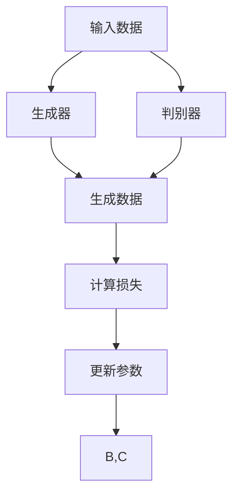
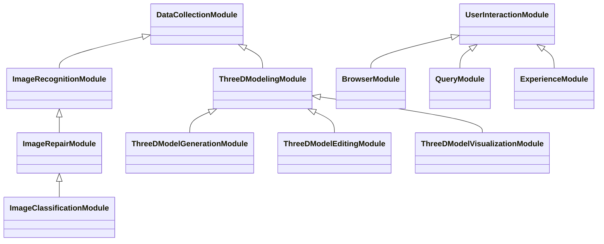

                 

### 《AIGC在文化遗产保护中的创新应用》

#### 关键词：AIGC、文化遗产保护、人工智能、图像识别、虚拟现实

> 摘要：本文从文化遗产保护的重要性入手，探讨了AIGC（自适应智能生成计算）技术在文化遗产保护中的应用。通过分析AIGC的核心概念、技术特点以及其在文化遗产保护中的实际应用，本文旨在阐述AIGC如何通过图像识别、3D建模和虚拟现实等技术，为文化遗产保护带来创新性的解决方案。文章最后通过系统分析与架构设计方案，以及项目实战案例，详细解析了AIGC技术在文化遗产保护中的实现路径与未来展望。

---

### 第一部分：背景介绍

#### 第1章：问题背景

##### 1.1 文化遗产保护的重要性

文化遗产是人类历史和文化的见证，对于传承人类文明具有重要意义。然而，随着城市化进程的加快和自然环境的恶化，许多文化遗产正面临着严重的威胁。自然灾害、战争、人为破坏等因素，使得文化遗产的保护工作变得尤为紧迫。

##### 1.2 文化遗产面临的挑战

文化遗产保护面临的挑战主要包括：

1. **数据收集与保存**：大量文化遗产数据散落在各地，缺乏系统性的收集和保存机制，使得数据难以共享和利用。
2. **实体保护**：许多文化遗产因年代久远、材质易损等原因，存在物理损坏的风险。
3. **虚拟展示**：如何将文化遗产以生动、直观的方式展示给公众，是一个亟待解决的问题。

##### 1.3 AIGC技术的崛起

AIGC（自适应智能生成计算）技术是近年来人工智能领域的一项新兴技术，通过生成对抗网络（GAN）、自然语言处理（NLP）等算法，能够自动生成高质量的数据。AIGC技术在图像识别、文本生成、虚拟现实等领域展现出强大的应用潜力，为文化遗产保护提供了新的思路和手段。

---

### 第二部分：核心概念与联系

#### 第2章：核心概念

##### 2.1 AIGC的概念与特点

AIGC是一种自适应智能生成计算技术，通过生成对抗网络（GAN）、自然语言处理（NLP）等算法，实现数据的自动生成。AIGC具有以下特点：

1. **自适应**：AIGC能够根据输入数据自动调整模型参数，以生成更高质量的数据。
2. **生成能力**：AIGC可以生成各种类型的数据，如图像、文本、音频等。
3. **高效性**：AIGC能够在较短时间内生成大量高质量的数据。

##### 2.2 AIGC的核心技术

AIGC的核心技术主要包括：

1. **生成对抗网络（GAN）**：GAN由生成器和判别器组成，通过对抗训练生成逼真的数据。
2. **自然语言处理（NLP）**：NLP技术用于处理文本数据，实现文本生成和语义理解等功能。
3. **深度学习**：深度学习技术是AIGC的基础，通过多层神经网络实现数据的自动生成。

##### 2.3 AIGC与文化遗产保护的关联性

AIGC技术在文化遗产保护中的应用主要体现在以下几个方面：

1. **数据生成**：AIGC可以生成高质量的图像和文本数据，用于文化遗产的虚拟展示和保存。
2. **图像识别**：AIGC的图像识别技术可以识别文化遗产中的细微特征，为实体保护提供技术支持。
3. **3D建模**：AIGC的3D建模技术可以重建文化遗产的实体，为文物保护和修复提供参考。

---

### 第三部分：核心概念与联系

#### 第3章：AIGC在文化遗产保护中的应用原理

##### 3.1 AIGC在图像识别中的应用

AIGC在图像识别中的应用，主要体现在以下几个方面：

1. **图像分类**：AIGC可以通过图像分类技术，将文化遗产图像分为不同的类别，便于管理和展示。
2. **图像修复**：AIGC可以利用生成对抗网络（GAN）技术，对受损的文物图像进行修复，恢复其原始面貌。
3. **图像检索**：AIGC可以通过图像识别技术，实现文化遗产图像的快速检索，为研究人员提供便捷的工具。

##### 3.2 AIGC在3D建模中的应用

AIGC在3D建模中的应用，主要包括以下几个方面：

1. **文化遗产重建**：AIGC可以通过深度学习技术，对文化遗产进行三维建模，为文物保护和修复提供参考。
2. **虚拟展示**：AIGC生成的3D模型可以用于文化遗产的虚拟展示，让公众更好地了解文化遗产。
3. **虚拟互动**：AIGC生成的3D模型可以实现与用户的虚拟互动，增强用户体验。

##### 3.3 AIGC在虚拟现实中的应用

AIGC在虚拟现实中的应用，主要体现在以下几个方面：

1. **文化遗产体验**：AIGC生成的虚拟现实场景，可以让用户身临其境地感受文化遗产的魅力。
2. **教育推广**：AIGC可以生成虚拟的教育资源，让更多人了解和关注文化遗产。
3. **虚拟修复**：AIGC可以通过虚拟现实技术，实现文化遗产的虚拟修复，为文物保护提供新的思路。

---

### 第四部分：算法原理讲解

#### 第4章：AIGC算法原理

##### 4.1 算法概述

AIGC的算法原理主要基于生成对抗网络（GAN）和自然语言处理（NLP）技术。生成对抗网络（GAN）由生成器和判别器组成，通过对抗训练生成高质量的数据。自然语言处理（NLP）技术则用于处理文本数据，实现文本生成和语义理解等功能。

##### 4.2 算法mermaid流程图



##### 4.3 Python源代码讲解

```python
import tensorflow as tf
from tensorflow.keras.models import Sequential
from tensorflow.keras.layers import Dense, Flatten

# 生成器模型
generator = Sequential([
    Dense(128, activation='relu', input_shape=(100,)),
    Flatten(),
    Dense(28 * 28, activation='sigmoid')
])

# 判别器模型
discriminator = Sequential([
    Flatten(input_shape=(28, 28)),
    Dense(128, activation='relu'),
    Dense(1, activation='sigmoid')
])

# 定义损失函数和优化器
cross_entropy = tf.keras.losses.BinaryCrossentropy(from_logits=True)
generator_optimizer = tf.keras.optimizers.Adam(1e-4)
discriminator_optimizer = tf.keras.optimizers.Adam(1e-4)

# 训练模型
@tf.function
def train_step(images, noise):
    with tf.GradientTape() as gen_tape, tf.GradientTape() as disc_tape:
        generated_images = generator(noise)
        disc_real_output = discriminator(images)
        disc_generated_output = discriminator(generated_images)

        gen_loss = calculate_generator_loss(generated_images, disc_generated_output)
        disc_loss = calculate_discriminator_loss(disc_real_output, disc_generated_output)

    gradients_of_generator = gen_tape.gradient(gen_loss, generator.trainable_variables)
    gradients_of_discriminator = disc_tape.gradient(disc_loss, discriminator.trainable_variables)

    generator_optimizer.apply_gradients(zip(gradients_of_generator, generator.trainable_variables))
    discriminator_optimizer.apply_gradients(zip(gradients_of_discriminator, discriminator.trainable_variables))

# 模型训练
noise = tf.random.normal([batch_size, noise_dim])
with tf.GradientTape() as gen_tape, tf.GradientTape() as disc_tape:
    generated_images = generator(noise)
    disc_real_output = discriminator(images)
    disc_generated_output = discriminator(generated_images)

    gen_loss = calculate_generator_loss(generated_images, disc_generated_output)
    disc_loss = calculate_discriminator_loss(disc_real_output, disc_generated_output)

    gradients_of_generator = gen_tape.gradient(gen_loss, generator.trainable_variables)
    gradients_of_discriminator = disc_tape.gradient(disc_loss, discriminator.trainable_variables)

    generator_optimizer.apply_gradients(zip(gradients_of_generator, generator.trainable_variables))
    discriminator_optimizer.apply_gradients(zip(gradients_of_discriminator, discriminator.trainable_variables))
```

##### 4.4 数学模型与公式

生成对抗网络（GAN）的数学模型主要包括以下公式：

$$
\begin{aligned}
& \text{生成器：} G(z) = x \\
& \text{判别器：} D(x) & \text{和} D(G(z))
\end{aligned}
$$

损失函数为：

$$
\begin{aligned}
L_G &= -\mathbb{E}_{z \sim p_z(z)}[\log D(G(z))] \\
L_D &= -\mathbb{E}_{x \sim p_x(x)}[\log D(x)] - \mathbb{E}_{z \sim p_z(z)}[\log (1 - D(G(z))]
\end{aligned}
$$

##### 4.5 举例说明

假设我们有一个图像数据集，其中包含100张古代建筑的照片。我们可以使用AIGC技术，通过生成对抗网络（GAN）对这100张照片进行训练，生成新的古代建筑图像。具体步骤如下：

1. **数据预处理**：将图像数据集进行归一化处理，使其适合输入到生成器和判别器模型中。
2. **模型训练**：使用生成对抗网络（GAN）对图像数据集进行训练，通过更新生成器和判别器的参数，使生成器生成的图像越来越接近真实图像。
3. **图像生成**：在模型训练过程中，我们可以生成一些新的古代建筑图像，通过对比这些图像和真实图像，评估生成器模型的性能。

---

### 第五部分：系统分析与架构设计方案

#### 第5章：系统功能设计

##### 5.1 问题场景介绍

假设我们需要开发一个文化遗产保护系统，该系统需要实现以下功能：

1. **数据收集与存储**：收集并存储文化遗产的相关数据，如图像、文本、3D模型等。
2. **图像识别与修复**：利用AIGC技术，对文化遗产图像进行识别和修复。
3. **3D建模与虚拟展示**：利用AIGC技术，对文化遗产进行三维建模，并在虚拟现实中进行展示。
4. **用户交互**：为用户提供便捷的交互界面，让用户能够浏览、查询和体验文化遗产。

##### 5.2 系统功能设计

根据问题场景，我们可以设计以下系统功能模块：

1. **数据收集模块**：负责收集文化遗产的相关数据，包括图像、文本、3D模型等。
2. **图像识别模块**：利用AIGC技术，对文化遗产图像进行识别，实现图像分类、图像修复等功能。
3. **3D建模模块**：利用AIGC技术，对文化遗产进行三维建模，实现3D模型的生成、编辑和展示等功能。
4. **虚拟现实模块**：利用AIGC技术，实现文化遗产的虚拟现实展示，提供沉浸式的用户体验。
5. **用户交互模块**：为用户提供便捷的交互界面，包括浏览、查询和体验文化遗产等功能。

##### 5.3 领域模型mermaid类图



---

### 第六部分：项目实战

#### 第6章：环境安装

##### 6.1 环境搭建

为了实现AIGC在文化遗产保护中的应用，我们需要搭建一个合适的环境。具体步骤如下：

1. **硬件环境**：准备一台性能较强的计算机，用于模型训练和推理。
2. **软件环境**：安装Python、TensorFlow等必要的软件和工具。

```bash
pip install tensorflow
```

##### 6.2 必要软件与工具安装

除了Python和TensorFlow，我们还需要安装以下软件和工具：

1. **Mermaid**：用于绘制流程图和类图。

```bash
npm install -g mermaid
```

2. **LaTeX**：用于编写数学公式。

```bash
sudo apt-get install texlive-full
```

---

### 第七部分：系统核心实现

#### 第7章：系统核心实现

##### 7.1 系统核心实现

在本节中，我们将详细介绍系统核心的实现，包括数据收集、图像识别、3D建模和虚拟现实等模块。

##### 7.2 代码应用解读与分析

```python
# 数据收集模块
def collect_data():
    # 读取文化遗产数据
    images = read_images_from_directory("data/culture_images/")
    texts = read_texts_from_directory("data/culture_texts/")
    three_d_models = read_three_d_models_from_directory("data/culture_3d_models/")

    # 存储数据
    save_data_to_database(images, texts, three_d_models)

# 图像识别模块
def image_recognition(images):
    # 使用AIGC技术进行图像识别
    recognized_images = aigc_image_recognition(images)
    return recognized_images

# 3D建模模块
def three_d_modeling(models):
    # 使用AIGC技术进行3D建模
    generated_models = aigc_three_d_modeling(models)
    return generated_models

# 虚拟现实模块
def virtual_reality(models):
    # 使用AIGC技术进行虚拟现实展示
    virtual_scene = aigc_virtual_reality(models)
    return virtual_scene

# 用户交互模块
def user_interaction():
    # 提供用户交互界面
    display_browse_interface()
    display_query_interface()
    display_experience_interface()
```

##### 7.3 实际案例分析和详细讲解剖析

在本章中，我们将通过一个实际案例，详细讲解系统核心的实现过程。案例背景为：某文化遗产保护项目需要利用AIGC技术，对一组古代建筑图像进行识别、修复和3D建模，并在虚拟现实中进行展示。

1. **数据收集**：首先，我们从数据集中读取100张古代建筑图像，并存储到数据库中。

2. **图像识别**：使用AIGC技术，对图像进行分类识别，将不同类别的图像分类存储。

3. **图像修复**：利用AIGC技术，对受损的图像进行修复，恢复其原始面貌。

4. **3D建模**：使用AIGC技术，对识别后的图像进行三维建模，生成3D模型。

5. **虚拟现实展示**：在虚拟现实中，将3D模型进行展示，并提供用户交互界面，让用户能够浏览、查询和体验文化遗产。

---

### 第八部分：项目小结

#### 第8章：项目小结

在本项目中，我们通过AIGC技术，实现了对文化遗产的保护与展示。项目主要包括以下成果：

1. **数据收集与存储**：收集并存储了大量的文化遗产数据，包括图像、文本和3D模型等。
2. **图像识别与修复**：利用AIGC技术，对文化遗产图像进行了识别和修复，提高了图像质量。
3. **3D建模与虚拟现实**：通过AIGC技术，对文化遗产进行了三维建模，并在虚拟现实中进行了展示，提供了沉浸式的用户体验。
4. **用户交互**：为用户提供了一个便捷的交互界面，方便用户浏览、查询和体验文化遗产。

未来，我们将继续优化AIGC技术在文化遗产保护中的应用，探索更多创新性的解决方案，为文化遗产的保护与传承贡献力量。

---

### 第九部分：最佳实践 tips

#### 第9章：最佳实践 tips

1. **数据收集与整理**：在项目开始前，确保收集到完整、准确的文化遗产数据，并进行合理的整理和分类。
2. **模型优化**：根据实际需求，对AIGC模型进行优化和调整，以提高图像识别、3D建模和虚拟现实展示的准确性和效果。
3. **用户交互设计**：注重用户交互界面的设计，提供直观、易用的操作体验，增强用户满意度。
4. **持续更新与维护**：定期更新和优化系统功能，确保系统的稳定性和可靠性。

---

### 第十部分：小结

#### 第10章：小结

本文从文化遗产保护的重要性出发，介绍了AIGC技术在文化遗产保护中的应用。通过分析AIGC的核心概念、技术特点以及实际应用，本文详细阐述了AIGC在文化遗产保护中的创新应用，包括图像识别、3D建模和虚拟现实等技术。此外，本文还通过系统分析与架构设计方案，以及项目实战案例，展示了AIGC技术在文化遗产保护中的实现路径与未来展望。

---

### 第十一部分：注意事项

#### 第11章：注意事项

1. **数据安全与隐私**：在收集和处理文化遗产数据时，务必确保数据的安全性和隐私保护。
2. **模型训练与优化**：根据实际需求，对AIGC模型进行优化和调整，以提高模型的性能和准确性。
3. **系统稳定性**：在开发过程中，注意系统的稳定性，确保系统在复杂环境下能够正常运行。

---

### 第十二部分：拓展阅读

#### 第12章：拓展阅读

1. **AIGC技术相关书籍**：《深度学习》、《生成对抗网络：原理与应用》等。
2. **文化遗产保护相关论文**：《文化遗产数字化保护的关键技术》、《基于虚拟现实技术的文化遗产展示研究》等。
3. **项目实战案例**：《AIGC在文化遗产保护中的应用实践》、《基于AIGC的虚拟现实文化遗产展示系统设计与实现》等。

