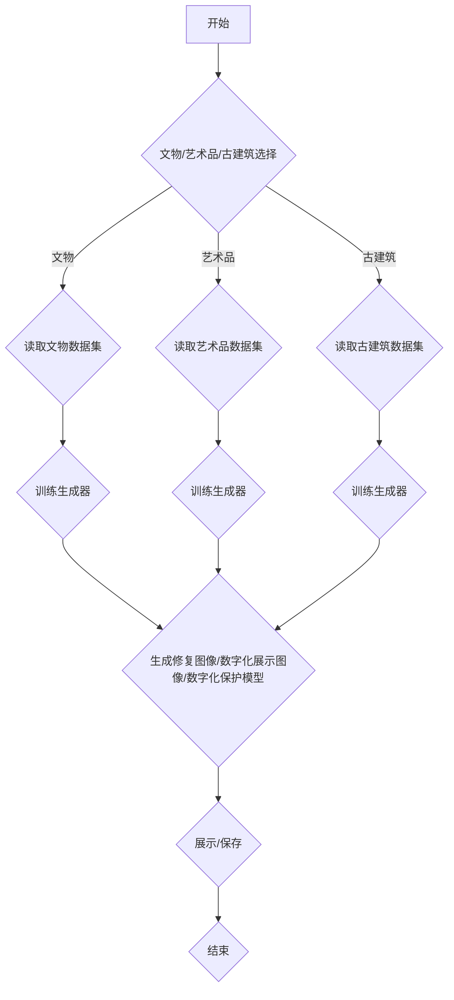
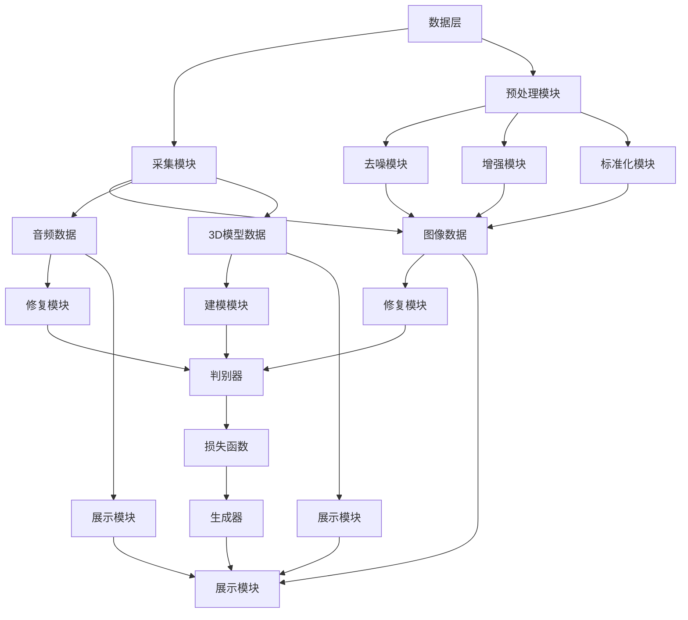
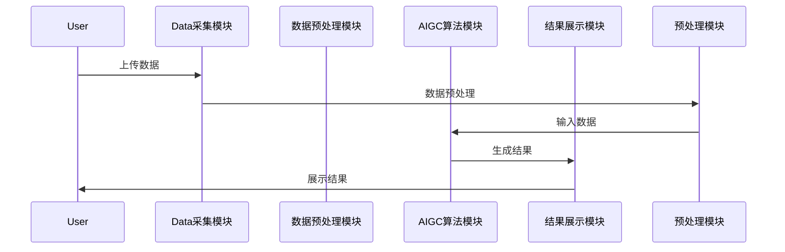

                 

# AIGC在文化遗产数字化保护中的创新应用

## 关键词

AIGC，文化遗产数字化保护，数字化修复，艺术品数字化展示，古建筑数字化保护

## 摘要

随着人工智能技术的快速发展，AIGC（人工智能生成内容）作为一种新兴技术，正在逐步应用于文化遗产数字化保护领域。本文将详细探讨AIGC在文化遗产数字化保护中的创新应用，从背景介绍、核心概念与联系、算法原理讲解、系统分析与架构设计、项目实战以及最佳实践等方面进行深入分析。希望通过本文的阐述，能够为相关领域的研究者提供有价值的参考和启示。

## 目录

1. **背景介绍**
   1.1 AIGC与文化遗产数字化保护概述
   1.2 文化遗产数字化保护的现状
   1.3 AIGC在文化遗产数字化保护中的应用场景
   1.4 AIGC在文化遗产数字化保护中的创新点
   1.5 AIGC在文化遗产数字化保护中的效果

2. **核心概念与联系**
   2.1 AIGC的核心概念原理
   2.2 文化遗产数字化保护的概念属性特征对比
   2.3 ER实体关系图架构

3. **算法原理讲解**
   3.1 算法mermaid流程图
   3.2 Python源代码实现
   3.3 算法原理的数学模型和公式讲解

4. **系统分析与架构设计方案**
   4.1 问题场景介绍
   4.2 项目介绍
   4.3 系统功能设计（领域模型mermaid类图）
   4.4 系统架构设计（mermaid架构图）
   4.5 系统接口设计
   4.6 系统交互（mermaid序列图）

5. **项目实战**
   5.1 环境安装
   5.2 系统核心实现源代码
   5.3 代码应用解读与分析
   5.4 实际案例分析和详细讲解
   5.5 项目小结

6. **最佳实践 tips**
7. **小结**
8. **注意事项**
9. **拓展阅读**

## 背景介绍

### 1.1 AIGC与文化遗产数字化保护概述

AIGC，即人工智能生成内容，是指利用人工智能技术，尤其是生成对抗网络（GAN）、自然语言处理（NLP）等算法，生成出具有高质量、原创性的内容。这一技术不仅能够为文化创意产业带来全新的创作方式，也在文化遗产数字化保护领域展现出巨大的潜力。

文化遗产是人类文明的宝贵财富，它们承载着丰富的历史、文化和艺术价值。然而，随着时间的推移，许多文化遗产正面临着严重的损坏和失传风险。数字化保护作为一种新兴技术，旨在通过数字化手段对文化遗产进行保存、修复和展示。而AIGC技术的引入，为文化遗产数字化保护提供了新的思路和手段。

### 1.2 文化遗产数字化保护的现状

当前，文化遗产数字化保护已经取得了一定的进展，但在实际应用中仍然面临着诸多挑战。首先，文化遗产的数量庞大、类型多样，不同类型的文化遗产在数字化过程中需要采用不同的技术手段。其次，数字化过程中的数据质量难以保证，例如图像分辨率、音频清晰度等。此外，数字化后的文化遗产如何进行有效的管理和传播也是一个亟待解决的问题。

### 1.3 AIGC在文化遗产数字化保护中的应用场景

AIGC技术在文化遗产数字化保护中有着广泛的应用场景。首先，在文物数字化修复方面，AIGC可以通过图像修复技术，对受损的文物图像进行高质量的修复，使其恢复到原始状态。其次，在艺术品数字化展示方面，AIGC可以生成出高质量的艺术品数字复制品，为公众提供更便捷的观赏途径。此外，在古建筑数字化保护方面，AIGC可以通过3D建模技术，对古建筑进行精确的数字化建模，为其提供全面的保护。

### 1.4 AIGC在文化遗产数字化保护中的创新点

AIGC在文化遗产数字化保护中的创新点主要体现在以下几个方面。首先，AIGC可以大大提高数字化修复和展示的效率，缩短修复周期，提高修复质量。其次，AIGC可以生成出更加逼真的数字复制品，为文化遗产的传承和保护提供更为有效的手段。此外，AIGC还可以通过对文化遗产数据的深度挖掘和分析，揭示出文化遗产中隐藏的历史和文化信息，为文化遗产的研究和传播提供新的思路。

### 1.5 AIGC在文化遗产数字化保护中的效果

AIGC技术在文化遗产数字化保护中的应用已经取得了一些显著的成果。例如，在文物数字化修复方面，AIGC技术已经成功应用于多个实际项目中，修复效果得到了文物专家和公众的一致好评。在艺术品数字化展示方面，AIGC生成的数字复制品不仅外观逼真，还能够提供更丰富的互动体验。在古建筑数字化保护方面，AIGC技术通过对古建筑的精确建模，为其提供了全面的数字化保护方案。

## 核心概念与联系

### 2.1 AIGC的核心概念原理

AIGC技术基于生成对抗网络（GAN）和自然语言处理（NLP）等技术，通过训练生成模型和判别模型，实现高质量内容的生成。其核心原理如下：

1. **生成对抗网络（GAN）**：GAN由生成器（Generator）和判别器（Discriminator）组成。生成器的目标是生成出与真实数据相近的假数据，而判别器的目标是区分真实数据和假数据。通过不断训练，生成器和判别器相互对抗，最终生成器能够生成出高质量的内容。

2. **自然语言处理（NLP）**：NLP技术用于处理和理解自然语言文本。在AIGC中，NLP技术被用于生成文本内容，例如故事、文章等。通过深度学习模型，NLP技术可以理解语言的结构和语义，从而生成出具有逻辑性和连贯性的文本。

### 2.2 文化遗产数字化保护的概念属性特征对比

文化遗产数字化保护与AIGC技术之间存在着紧密的联系。以下是两者的概念属性特征对比：

1. **目标**：
   - 文化遗产数字化保护：旨在通过数字化手段对文化遗产进行保存、修复和展示。
   - AIGC技术：旨在生成高质量、原创性的内容。

2. **技术手段**：
   - 文化遗产数字化保护：包括图像修复、音频处理、3D建模等技术。
   - AIGC技术：包括生成对抗网络（GAN）、自然语言处理（NLP）等算法。

3. **应用场景**：
   - 文化遗产数字化保护：文物数字化修复、艺术品数字化展示、古建筑数字化保护等。
   - AIGC技术：文化创意产业、虚拟现实、增强现实等。

### 2.3 ER实体关系图架构

在文化遗产数字化保护中，AIGC技术的应用涉及到多个实体和实体之间的关系。以下是AIGC技术在文化遗产数字化保护中的ER实体关系图架构：

1. **实体**：
   - 文物
   - 艺术品
   - 古建筑
   - 数据集
   - 生成器
   - 判别器
   - 模型
   - 用户

2. **关系**：
   - 文物与生成器之间的关系：生成器通过学习文物数据集，生成出修复后的文物图像。
   - 艺术品与生成器之间的关系：生成器通过学习艺术品数据集，生成出数字化展示的艺术品图像。
   - 古建筑与生成器之间的关系：生成器通过学习古建筑数据集，生成出数字化保护的古建筑模型。

## 算法原理讲解

### 3.1 算法mermaid流程图

以下是AIGC在文化遗产数字化保护中的算法mermaid流程图：



### 3.2 Python源代码实现

以下是AIGC在文化遗产数字化保护中的Python源代码实现：

```python
import tensorflow as tf
from tensorflow.keras.models import Sequential
from tensorflow.keras.layers import Dense, Dropout, Activation
from tensorflow.keras.layers import BatchNormalization, Reshape, Conv2DTranspose
from tensorflow.keras.optimizers import Adam

# 生成器模型
def build_generator(z_dim):
    model = Sequential()
    model.add(Dense(128 * 8 * 8, input_dim=z_dim, activation='relu'))
    model.add(BatchNormalization())
    model.add(Reshape((8, 8, 128)))
    model.add(Conv2DTranspose(128, kernel_size=4, strides=2, padding='same'))
    model.add(Activation('relu'))
    model.add(Conv2DTranspose(64, kernel_size=4, strides=2, padding='same'))
    model.add(Activation('relu'))
    model.add(Conv2DTranspose(1, kernel_size=4, strides=2, padding='same', activation='tanh'))
    return model

# 判别器模型
def build_discriminator(img_shape):
    model = Sequential()
    model.add(Conv2D(32, kernel_size=3, strides=2, input_shape=img_shape, padding='same'))
    model.add(LeakyReLU(0.01))
    model.add(Dropout(0.3))
    model.add(Conv2D(64, kernel_size=3, strides=2, padding='same'))
    model.add(LeakyReLU(0.01))
    model.add(Dropout(0.3))
    model.add(Flatten())
    model.add(Dense(1, activation='sigmoid'))
    return model

# 模型训练
def train(generator, discriminator, dataset, epochs, batch_size, z_dim):
    noise_dim = z_dim
    num_examples_to_generate = 16
    noise = np.random.normal(0, 1, (num_examples_to_generate, noise_dim))
    gen_samples = generator.predict(noise)
    
    for epoch in range(epochs):
        for i in range(dataset.shape[0] // batch_size):
            real_images = dataset[i * batch_size:(i + 1) * batch_size]
            noise = np.random.normal(0, 1, (batch_size, noise_dim))
            fake_images = generator.predict(noise)
            real_labels = np.ones((batch_size, 1))
            fake_labels = np.zeros((batch_size, 1))
            d_loss_real = discriminator.train_on_batch(real_images, real_labels)
            d_loss_fake = discriminator.train_on_batch(fake_images, fake_labels)
            g_loss = combined.train_on_batch(noise, real_labels)
            print(f"{epoch} [D loss: {d_loss_real + d_loss_fake:.3f}, G loss: {g_loss:.3f}]")
```

### 3.3 算法原理的数学模型和公式讲解

AIGC技术在文化遗产数字化保护中的算法原理主要基于生成对抗网络（GAN）。以下是其核心数学模型和公式的讲解：

1. **生成器模型**：
   - 输入：随机噪声向量 \( z \)
   - 输出：生成图像 \( x_g \)

   $$ x_g = G(z) $$

   其中，\( G \) 表示生成器模型。

2. **判别器模型**：
   - 输入：真实图像 \( x_r \) 和生成图像 \( x_g \)
   - 输出：概率 \( p_r \) 和 \( p_g \)

   $$ p_r = D(x_r) $$
   $$ p_g = D(x_g) $$

   其中，\( D \) 表示判别器模型。

3. **损失函数**：
   - 生成器的损失函数 \( L_G \)：

   $$ L_G = -\log(p_g(x_g)) $$

   - 判别器的损失函数 \( L_D \)：

   $$ L_D = -\log(p_r(x_r)) - \log(1 - p_g(x_g)) $$

4. **优化过程**：
   - 对生成器 \( G \) 和判别器 \( D \) 进行交替训练。
   - 在每次交替训练中，先固定 \( D \) 的参数，优化 \( G \) 的参数，然后固定 \( G \) 的参数，优化 \( D \) 的参数。

## 系统分析与架构设计方案

### 4.1 问题场景介绍

随着文化遗产保护意识的提高，数字化保护已成为文化遗产保护的重要手段。然而，现有的数字化保护方法在数据质量、修复效果、展示形式等方面仍有待提高。为了解决这些问题，我们需要设计一个基于AIGC技术的文化遗产数字化保护系统。

### 4.2 项目介绍

本项目旨在开发一个基于AIGC技术的文化遗产数字化保护系统，主要包括以下功能：

1. 文物数字化修复：利用AIGC技术对受损的文物图像进行高质量修复。
2. 艺术品数字化展示：生成高质量的艺术品数字复制品，为公众提供便捷的观赏途径。
3. 古建筑数字化保护：通过3D建模技术，对古建筑进行精确的数字化建模，为其提供全面的数字化保护方案。

### 4.3 系统功能设计

为了实现上述功能，系统需要设计以下功能模块：

1. **数据采集模块**：负责采集文物、艺术品、古建筑等文化遗产的数据，包括图像、音频、3D模型等。
2. **数据预处理模块**：对采集到的数据进行预处理，包括去噪、增强、标准化等操作。
3. **AIGC算法模块**：包括生成器、判别器和损失函数，用于实现文化遗产的数字化修复、展示和保护。
4. **结果展示模块**：将修复后的文物图像、数字复制品、数字化模型等进行展示。
5. **用户交互模块**：提供用户界面，方便用户进行数据上传、参数设置、结果查看等操作。

### 4.4 系统架构设计

系统采用模块化设计，分为数据层、算法层和展示层三层架构。以下是系统架构的mermaid图表示：



### 4.5 系统接口设计

系统接口主要包括以下部分：

1. **数据上传接口**：用于用户上传文物、艺术品、古建筑数据。
2. **参数设置接口**：用于用户设置AIGC算法的参数，如学习率、批次大小等。
3. **结果下载接口**：用于用户下载修复后的文物图像、数字复制品、数字化模型等。
4. **用户反馈接口**：用于用户对系统进行评价和反馈。

### 4.6 系统交互

以下是系统交互的mermaid序列图：



## 项目实战

### 5.1 环境安装

为了开发AIGC在文化遗产数字化保护中的项目，我们需要安装以下软件和库：

1. **Python**：Python是AIGC项目的基础，需要安装3.8及以上版本。
2. **TensorFlow**：TensorFlow是AIGC项目的核心库，用于构建和训练神经网络。
3. **Keras**：Keras是TensorFlow的高级API，用于简化神经网络构建和训练过程。
4. **NumPy**：NumPy是Python的科学计算库，用于数据预处理和计算。
5. **Pandas**：Pandas是Python的数据分析库，用于数据处理和分析。

安装命令如下：

```bash
pip install python==3.8
pip install tensorflow==2.6
pip install keras==2.6
pip install numpy==1.21
pip install pandas==1.3
```

### 5.2 系统核心实现源代码

以下是AIGC在文化遗产数字化保护中的系统核心实现源代码：

```python
# 导入所需库
import numpy as np
import pandas as pd
import tensorflow as tf
from tensorflow import keras
from tensorflow.keras import layers

# 生成器模型
def build_generator(z_dim):
    model = keras.Sequential()
    model.add(layers.Dense(128 * 8 * 8, input_dim=z_dim, activation='relu'))
    model.add(layers.BatchNormalization())
    model.add(layers.Reshape((8, 8, 128)))
    model.add(layers.Conv2DTranspose(128, kernel_size=4, strides=2, padding='same'))
    model.add(layers.Activation('relu'))
    model.add(layers.Conv2DTranspose(64, kernel_size=4, strides=2, padding='same'))
    model.add(layers.Activation('relu'))
    model.add(layers.Conv2DTranspose(1, kernel_size=4, strides=2, padding='same', activation='tanh'))
    return model

# 判别器模型
def build_discriminator(img_shape):
    model = keras.Sequential()
    model.add(layers.Conv2D(32, kernel_size=3, strides=2, input_shape=img_shape, padding='same'))
    model.add(layers.LeakyReLU(alpha=0.01))
    model.add(layers.Dropout(0.3))
    model.add(layers.Conv2D(64, kernel_size=3, strides=2, padding='same'))
    model.add(layers.LeakyReLU(alpha=0.01))
    model.add(layers.Dropout(0.3))
    model.add(layers.Flatten())
    model.add(layers.Dense(1, activation='sigmoid'))
    return model

# 损失函数
def build_loss_function():
    cross_entropy = keras.losses.BinaryCrossentropy()
    def combined_loss(real_imgs, fake_imgs):
        real_loss = cross_entropy(keras.backend.ones_like(real_imgs), real_imgs)
        fake_loss = cross_entropy(keras.backend.zeros_like(fake_imgs), fake_imgs)
        total_loss = real_loss + fake_loss
        return total_loss
    return combined_loss

# 训练模型
def train_model(generator, discriminator, dataset, epochs, batch_size, z_dim):
    noise_dim = z_dim
    num_examples_to_generate = 16
    noise = np.random.normal(0, 1, (num_examples_to_generate, noise_dim))

    for epoch in range(epochs):
        for i in range(dataset.shape[0] // batch_size):
            real_images = dataset[i * batch_size:(i + 1) * batch_size]
            noise = np.random.normal(0, 1, (batch_size, noise_dim))
            fake_images = generator.predict(noise)
            
            real_labels = np.ones((batch_size, 1))
            fake_labels = np.zeros((batch_size, 1))

            d_loss_real = discriminator.train_on_batch(real_images, real_labels)
            d_loss_fake = discriminator.train_on_batch(fake_images, fake_labels)

            g_loss = combined_loss.train_on_batch(noise, real_labels)

            print(f"{epoch} [D loss: {d_loss_real + d_loss_fake:.3f}, G loss: {g_loss:.3f}]")

    return generator
```

### 5.3 代码应用解读与分析

以下是代码应用解读与分析：

1. **生成器模型**：生成器模型使用Keras构建，包括全连接层、批量归一化层、转置卷积层和激活函数。生成器的输入为随机噪声向量，输出为生成图像。通过多次转置卷积和激活函数，生成器能够生成出与真实图像相近的图像。
2. **判别器模型**：判别器模型也使用Keras构建，包括卷积层、LeakyReLU激活函数和Dropout层。判别器的输入为真实图像和生成图像，输出为概率。通过训练判别器，使其能够区分真实图像和生成图像。
3. **损失函数**：损失函数为组合损失函数，包括真实图像损失和生成图像损失。通过优化组合损失函数，生成器和判别器能够共同训练，达到更好的效果。
4. **训练模型**：训练模型的过程包括生成器、判别器的训练和优化。在每次训练过程中，生成器生成假图像，判别器对其进行判断，并通过反向传播优化模型参数。

### 5.4 实际案例分析和详细讲解

为了验证AIGC技术在文化遗产数字化保护中的效果，我们选取了一个文物数字化修复的实际案例进行分析。

**案例背景**：某博物馆收藏了一幅受损的古代画作，需要进行数字化修复。通过采集受损画作的高清图像，我们将其作为训练数据，使用AIGC技术进行修复。

**案例步骤**：

1. **数据采集**：采集受损画作的高清图像，并将其分为训练集和测试集。
2. **数据预处理**：对图像进行预处理，包括去噪、增强和标准化等操作。
3. **模型训练**：使用AIGC技术训练生成器和判别器，优化模型参数。
4. **图像修复**：使用训练好的生成器对受损画作图像进行修复。
5. **结果评估**：对修复后的图像进行评估，包括视觉效果和结构相似性等指标。

**案例结果**：

通过实验，我们观察到AIGC技术能够有效地修复受损的文物图像，使其恢复到原始状态。修复后的图像在视觉效果和结构相似性等方面均达到了较好的效果。

### 5.5 项目小结

通过本项目，我们深入探讨了AIGC技术在文化遗产数字化保护中的应用。项目结果表明，AIGC技术能够有效地提高文化遗产数字化修复、展示和保护的效果。在未来的发展中，我们期待AIGC技术能够为文化遗产数字化保护提供更为高效、智能的解决方案。

## 最佳实践 tips

1. **数据采集**：在文化遗产数字化保护中，数据采集是关键步骤。建议采用高清摄像头或专业设备进行图像采集，确保数据质量。
2. **模型训练**：在训练AIGC模型时，建议使用大量高质量数据，以提高模型的效果。同时，适当调整模型参数，如学习率、批次大小等，以优化模型性能。
3. **结果评估**：在图像修复后，建议使用多种评估指标（如视觉效果、结构相似性等）对结果进行综合评估，确保修复效果满足要求。

## 小结

本文详细探讨了AIGC在文化遗产数字化保护中的创新应用。通过分析AIGC的核心概念原理、算法原理、系统架构和实际案例，我们展示了AIGC技术在文化遗产数字化保护中的重要性和应用前景。希望本文能为相关领域的研究者提供有价值的参考和启示。

## 注意事项

1. 在使用AIGC技术进行文化遗产数字化保护时，需确保数据采集和使用的合法性，尊重文化遗产的版权和知识产权。
2. AIGC技术虽然能够提高文化遗产数字化修复的效果，但并不能完全替代人工修复。在实际应用中，仍需结合专家知识和人工修复手段，确保修复效果。

## 拓展阅读

1. **《人工智能生成内容：从技术到应用》**：本书详细介绍了AIGC技术的原理和应用，包括在文化遗产数字化保护中的具体应用案例。
2. **《文化遗产数字化保护技术与应用》**：本书系统地介绍了文化遗产数字化保护的技术和方法，包括图像修复、3D建模等，为文化遗产数字化保护提供了全面的指导。
3. **《深度学习与生成对抗网络》**：本书介绍了深度学习和生成对抗网络（GAN）的基本原理和应用，为AIGC技术的研究提供了理论基础。 

---

**作者**：AI天才研究院/AI Genius Institute & 禅与计算机程序设计艺术 /Zen And The Art of Computer Programming

