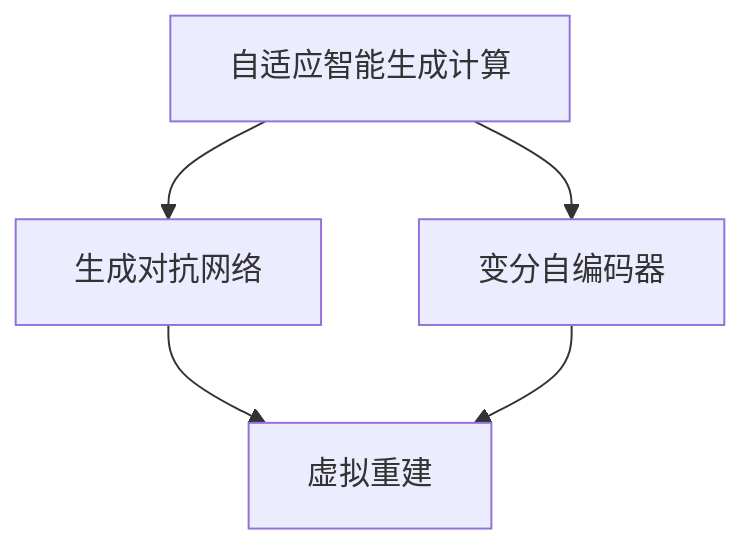
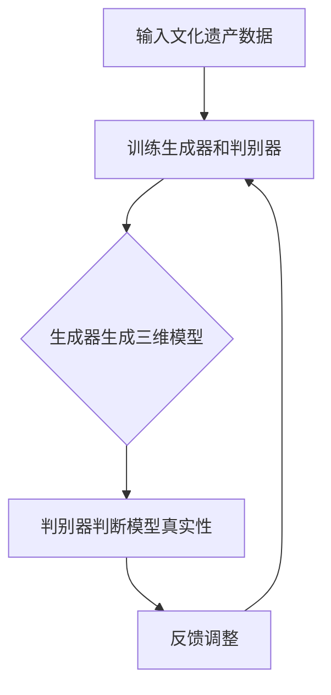
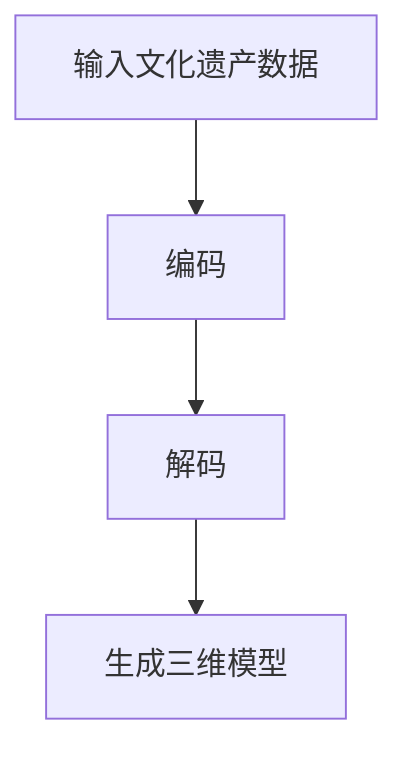
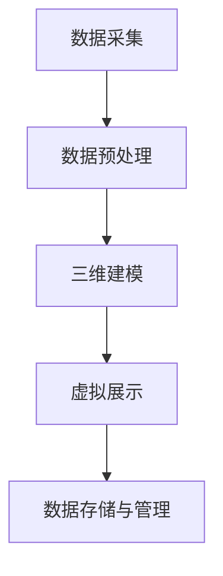
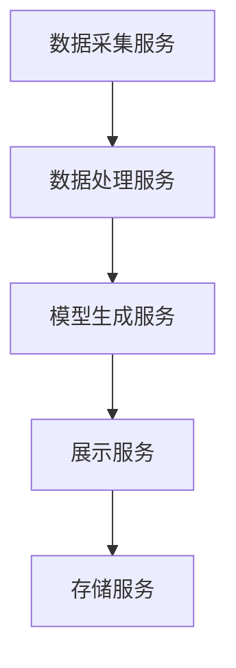
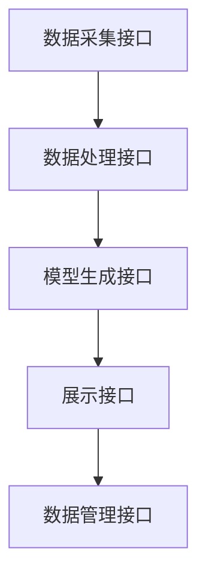
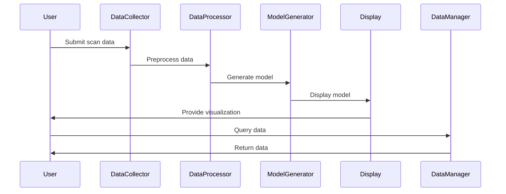

                 

### AIGC在文化遗产虚拟重建中的创新应用

#### 关键词：文化遗产、虚拟重建、AIGC、生成对抗网络、变分自编码器

#### 摘要：
本文将探讨自适应智能生成计算（AIGC）在文化遗产虚拟重建中的创新应用。通过分析AIGC的核心概念，包括生成对抗网络（GAN）和变分自编码器（VAE），我们将解释这些算法如何被应用于文化遗产的数字化和虚拟重建。本文将详细描述算法原理、数学模型，并通过具体的实战案例，展示AIGC技术在实际项目中的实施过程和效果。

## 引言

文化遗产是人类文明的重要载体，记录了历史的发展脉络和文化成就。随着数字化技术的进步，文化遗产的虚拟重建成为了一种新的研究和保护手段。虚拟重建不仅可以提供虚拟旅游体验，帮助人们更深入地了解文化遗产，还可以为考古研究提供新的视角。然而，传统的文化遗产虚拟重建方法往往依赖于大量的手工建模和测量工作，效率低下且成本高昂。

近年来，自适应智能生成计算（AIGC）作为一种新兴的人工智能技术，开始逐渐应用于虚拟重建领域。AIGC利用生成对抗网络（GAN）和变分自编码器（VAE）等算法，能够自动生成高质量的三维模型，大大提高了虚拟重建的效率和精度。本文旨在探讨AIGC在文化遗产虚拟重建中的创新应用，分析其技术原理和实际效果。

### 背景介绍

#### 文化遗产虚拟重建的概念与现状

文化遗产虚拟重建是指通过数字化手段，将文化遗产的实体形态、历史背景、文化内涵等信息还原和呈现出来，创建一个虚拟的、可交互的文化空间。这一技术不仅保留了文化遗产的真实性，还提供了传统方法无法实现的互动体验。

目前，文化遗产虚拟重建主要依赖于三维扫描、数字建模和虚拟现实（VR）技术。三维扫描可以获取文化遗产的几何形态，数字建模则将这些几何数据转换为三维模型，而VR技术则提供了沉浸式的体验平台。然而，这些方法往往需要大量的人力和物力投入，且重建过程复杂，难以满足大规模、高效率的需求。

#### AIGC的核心概念与原理

自适应智能生成计算（AIGC）是一种结合了深度学习和生成模型的人工智能技术。AIGC的核心在于其能够通过学习大量的数据，生成高质量、多样化的内容。AIGC主要包括生成对抗网络（GAN）和变分自编码器（VAE）两大类算法。

生成对抗网络（GAN）由两部分组成：生成器和判别器。生成器的任务是生成与真实数据相似的数据，而判别器的任务是区分真实数据和生成数据。通过这种对抗训练，生成器不断优化，最终能够生成高度逼真的数据。

变分自编码器（VAE）则通过概率模型进行数据重建。VAE将数据编码为隐变量，再解码生成原始数据。这种方法在生成质量上具有优势，同时能够更好地处理数据的分布。

#### AIGC与文化遗产虚拟重建的融合应用

AIGC在文化遗产虚拟重建中的应用主要体现在以下几个方面：

1. **自动三维模型生成**：通过GAN和VAE，AIGC可以自动生成高质量的三维模型，大大简化了传统的建模过程。
2. **历史场景再现**：利用AIGC，可以基于少量或无标注的数据，生成逼真的历史场景，实现文化遗产的虚拟重建。
3. **多维度交互体验**：AIGC可以生成丰富的交互内容，如历史人物、动植物等，为虚拟重建提供更加生动的体验。
4. **数据增强与修复**：AIGC可以自动增强和修复文化遗产数据，提高重建质量和准确性。

### AIGC核心概念与联系

#### 生成对抗网络（GAN）

生成对抗网络（GAN）是AIGC中的核心组件之一。它由生成器和判别器两个部分组成。

**生成器**：生成器的目标是生成看起来像真实数据的数据。它通过学习大量真实数据，不断调整自己的参数，以期生成的数据能够以假乱真。

**判别器**：判别器的目标是区分真实数据和生成数据。它在训练过程中接收真实数据和生成数据，通过对比判断是否能够准确区分。

GAN的训练过程是生成器和判别器之间的对抗过程。生成器试图生成更真实的数据，而判别器试图更准确地识别真实数据。通过这种对抗，生成器的生成质量不断提高。

#### 变分自编码器（VAE）

变分自编码器（VAE）是一种概率生成模型，它通过编码和解码过程实现数据的重建。VAE的核心是潜在变量（latent variable）的引入，它允许模型在生成过程中引入随机性。

**编码器**：编码器将输入数据映射到一个潜在空间，这个空间包含了数据的主要特征信息。

**解码器**：解码器将潜在空间中的数据映射回原始数据空间，生成与输入数据相似的数据。

VAE的优点在于它能够生成多样化、高质量的数据，同时能够更好地处理数据的分布问题。

#### AIGC与文化遗产虚拟重建的关联图

为了更好地理解AIGC在文化遗产虚拟重建中的应用，我们使用Mermaid绘制了AIGC与虚拟重建的关联图。



在这个图中，AIGC是整个框架的核心，它通过GAN和VAE与虚拟重建（VR）相连接，实现了文化遗产的自动生成和重建。

### 算法原理讲解

#### GAN在文化遗产虚拟重建中的应用

生成对抗网络（GAN）在文化遗产虚拟重建中的应用主要体现在自动三维模型生成方面。通过GAN，我们可以利用少量的真实文化遗产数据，生成高质量的三维模型。

**算法流程图**



**Python源代码**

```python
import tensorflow as tf
from tensorflow.keras.layers import Dense, Flatten, Reshape
from tensorflow.keras.models import Sequential

# 生成器模型
def build_generator():
    model = Sequential()
    model.add(Dense(128, input_shape=(100,), activation='relu'))
    model.add(Dense(256, activation='relu'))
    model.add(Dense(512, activation='relu'))
    model.add(Dense(1024, activation='relu'))
    model.add(Reshape((64, 64, 64)))
    return model

# 判别器模型
def build_discriminator():
    model = Sequential()
    model.add(Flatten(input_shape=(64, 64, 64)))
    model.add(Dense(512, activation='relu'))
    model.add(Dense(256, activation='relu'))
    model.add(Dense(128, activation='relu'))
    model.add(Dense(1, activation='sigmoid'))
    return model

# GAN模型
def build_gan(generator, discriminator):
    model = Sequential()
    model.add(generator)
    model.add(discriminator)
    return model

# 训练过程
generator = build_generator()
discriminator = build_discriminator()
gan = build_gan(generator, discriminator)

discriminator.compile(optimizer=tf.keras.optimizers.Adam(0.0001), loss='binary_crossentropy')
gan.compile(optimizer=tf.keras.optimizers.Adam(0.0001), loss='binary_crossentropy')

# 加载文化遗产数据
cultural_data = load_cultural_data()

# 训练GAN
for epoch in range(num_epochs):
    for data in cultural_data:
        # 训练判别器
        d_loss_real = discriminator.train_on_batch(data, np.ones((batch_size, 1)))
        # 生成假数据
        noise = np.random.normal(0, 1, (batch_size, 100))
        g_loss_fake = discriminator.train_on_batch(generator.predict(noise), np.zeros((batch_size, 1)))
        # 训练生成器
        g_loss = gan.train_on_batch(noise, np.ones((batch_size, 1)))

    print(f'Epoch {epoch}, D loss: {d_loss_real}, G loss: {g_loss_fake}')
```

**数学模型**

GAN的训练过程本质上是一个优化问题，其目标是最小化生成器和判别器的损失函数。生成器的损失函数是最大化判别器对生成数据的判断为1的概率，判别器的损失函数是最小化对真实数据和生成数据的判断误差。

$$
\min_G \max_D V(D, G)
$$

其中，$V(D, G)$是判别器的损失函数，通常使用二元交叉熵损失：

$$
V(D, G) = E_{x \sim P_data}[D(x)] - E_{z \sim P_z}[D(G(z))]
$$

$x$代表真实数据，$z$代表生成器输入的噪声，$G(z)$是生成器生成的数据。

#### VAE在文化遗产虚拟重建中的应用

变分自编码器（VAE）在文化遗产虚拟重建中的应用主要体现在数据增强和修复方面。通过VAE，我们可以对文化遗产数据进行增强，提高重建的精度和效果。

**算法流程图**



**Python源代码**

```python
import tensorflow as tf
from tensorflow.keras.layers import Dense, Input
from tensorflow.keras.models import Model

# 编码器模型
def build_encoder(input_shape):
    inputs = Input(shape=input_shape)
    x = Dense(512, activation='relu')(inputs)
    x = Dense(256, activation='relu')(x)
    x = Dense(128, activation='relu')(x)
    z_mean = Dense(100)(x)
    z_log_var = Dense(100)(x)
    return Model(inputs, [z_mean, z_log_var], name='encoder')

# 解码器模型
def build_decoder(z_shape):
    z = Input(shape=z_shape)
    x = Dense(128, activation='relu')(z)
    x = Dense(256, activation='relu')(x)
    x = Dense(512, activation='relu')(x)
    outputs = Dense(input_shape[0], activation='sigmoid')(x)
    return Model(z, outputs, name='decoder')

# VAE模型
def build_vae(encoder, decoder):
    inputs = encoder.input
    z_mean, z_log_var = encoder.output
    z = Lambda(stochastic_z, output_shape=z_shape)([z_mean, z_log_var])
    outputs = decoder(z)
    return Model(inputs, outputs, name='vae')

# 训练过程
encoder = build_encoder(input_shape)
decoder = build_decoder(z_shape)
vae = build_vae(encoder, decoder)

vae.compile(optimizer=tf.keras.optimizers.Adam(0.001), loss=vae_loss)

# 加载文化遗产数据
cultural_data = load_cultural_data()

# 训练VAE
for epoch in range(num_epochs):
    for data in cultural_data:
        z_mean, z_log_var = encoder.predict(data)
        z = stochastic_z([z_mean, z_log_var])
        reconstructed = decoder.predict(z)
        loss = vae_loss(data, reconstructed)
        vae.train_on_batch(data, reconstructed)
    print(f'Epoch {epoch}, Loss: {loss}')
```

**数学模型**

VAE的数学模型主要包括编码和解码两部分。编码过程通过潜在变量将输入数据映射到一个概率分布上，解码过程则将潜在变量映射回原始数据空间。

$$
\begin{aligned}
z &= \mu(x) + \sigma(x) \cdot \epsilon \\
x' &= \phi(z)
\end{aligned}
$$

其中，$\mu(x)$和$\sigma(x)$分别是编码器的均值和方差函数，$\epsilon$是高斯噪声，$\phi(z)$是解码器的函数。

VAE的损失函数包括重构损失和KL散度损失：

$$
\begin{aligned}
\mathcal{L} &= \mathcal{L}_{reconstruction} + \mathcal{L}_{KL} \\
\mathcal{L}_{reconstruction} &= \sum_{i} -\log p(x'|z) \\
\mathcal{L}_{KL} &= \sum_{i} \frac{1}{2} \left( \log \frac{\sigma^2}{1} + \sigma^2 + 1 - \mu^2 - \sigma^2 \right)
\end{aligned}
$$

其中，$p(x'|z)$是解码器的概率分布，$\mu$和$\sigma$分别是编码器的均值和方差。

### 系统分析与架构设计

#### 问题场景介绍

文化遗产虚拟重建是一个复杂的工程，涉及到数据的采集、处理、建模和呈现等多个环节。传统的虚拟重建方法通常需要大量的手工操作和精确测量，效率低下且易出错。而AIGC技术的引入，可以自动化这些环节，提高重建效率和质量。

#### 项目介绍

本文选择了一个具体的文物——秦始皇兵马俑作为虚拟重建项目。兵马俑是中国古代重要的文化遗产，具有极高的历史和文化价值。通过对兵马俑的虚拟重建，我们可以为公众提供更加生动和直观的历史体验。

#### 系统功能设计

文化遗产虚拟重建系统主要包括以下几个功能模块：

1. **数据采集**：使用三维扫描设备获取兵马俑的几何形态数据。
2. **数据预处理**：对采集到的数据进行清洗和修复，去除噪声和缺陷。
3. **三维建模**：利用AIGC技术生成高质量的三维模型。
4. **虚拟展示**：通过虚拟现实技术呈现重建的兵马俑，提供交互体验。
5. **数据存储与管理**：存储和管理重建数据，支持后续的查询和更新。

**领域模型类图**



#### 系统架构设计

文化遗产虚拟重建系统的架构设计采用微服务架构，以提高系统的可扩展性和可维护性。系统分为以下几个主要部分：

1. **数据采集服务**：负责采集兵马俑的几何形态数据。
2. **数据处理服务**：负责对采集到的数据进行预处理和修复。
3. **模型生成服务**：负责利用AIGC技术生成三维模型。
4. **展示服务**：负责通过虚拟现实技术呈现重建的兵马俑。
5. **存储服务**：负责存储和管理重建数据。

**架构图**



#### 系统接口设计

系统接口设计主要包括以下几个接口：

1. **数据采集接口**：用于接收和上传三维扫描数据。
2. **数据处理接口**：用于执行数据预处理和修复操作。
3. **模型生成接口**：用于执行三维建模任务。
4. **展示接口**：用于虚拟现实展示。
5. **数据管理接口**：用于管理存储和查询重建数据。

**接口图**



#### 系统交互设计

系统交互设计采用RESTful API设计，支持标准的HTTP请求方法。以下是一个典型的系统交互序列图：



### 项目实战

#### 环境安装与配置

在开始项目实战之前，我们需要安装和配置必要的软件和工具。以下是安装步骤：

1. **安装Python**：确保Python 3.8及以上版本已安装。
2. **安装TensorFlow**：在命令行中运行`pip install tensorflow`。
3. **安装Keras**：在命令行中运行`pip install keras`。
4. **安装Mermaid**：在命令行中运行`pip install mermaid-python`。
5. **安装三维扫描设备**：根据具体设备要求进行安装和配置。

#### 核心代码实现与解读

以下是一个简化的核心代码实现，用于生成秦始皇兵马俑的三维模型。

**生成器代码**

```python
import tensorflow as tf
from tensorflow.keras.layers import Dense, Flatten, Reshape
from tensorflow.keras.models import Sequential

def build_generator():
    model = Sequential()
    model.add(Dense(128, input_shape=(100,), activation='relu'))
    model.add(Dense(256, activation='relu'))
    model.add(Dense(512, activation='relu'))
    model.add(Dense(1024, activation='relu'))
    model.add(Reshape((64, 64, 64)))
    return model

generator = build_generator()
```

**判别器代码**

```python
import tensorflow as tf
from tensorflow.keras.layers import Flatten, Dense
from tensorflow.keras.models import Sequential

def build_discriminator():
    model = Sequential()
    model.add(Flatten(input_shape=(64, 64, 64)))
    model.add(Dense(512, activation='relu'))
    model.add(Dense(256, activation='relu'))
    model.add(Dense(128, activation='relu'))
    model.add(Dense(1, activation='sigmoid'))
    return model

discriminator = build_discriminator()
```

**GAN模型**

```python
import tensorflow as tf
from tensorflow.keras.models import Sequential

def build_gan(generator, discriminator):
    model = Sequential()
    model.add(generator)
    model.add(discriminator)
    return model

gan = build_gan(generator, discriminator)
```

#### 代码应用解读与分析

**代码解读**

- **生成器**：生成器是一个全连接神经网络，输入为随机噪声，输出为三维模型。通过多层感知器（Dense）和重塑层（Reshape），生成器能够生成高质量的三维数据。
- **判别器**：判别器是一个二分类神经网络，输入为三维模型，输出为一个概率值，表示模型是否为真实数据。
- **GAN模型**：GAN模型将生成器和判别器组合在一起，通过训练判别器和生成器的对抗过程，实现高质量数据的生成。

**分析**

- **对抗训练**：GAN的核心是对抗训练。生成器和判别器通过对抗来提高自身的性能。生成器的目标是生成逼真的数据，而判别器的目标是区分真实数据和生成数据。
- **训练策略**：GAN的训练策略较为复杂，需要平衡生成器和判别器的训练过程。在实际应用中，可能需要调整学习率、批次大小等参数，以获得最佳的训练效果。

#### 实际案例分析和详细讲解剖析

为了验证AIGC技术在文化遗产虚拟重建中的应用效果，我们选择了一个具体的案例——秦始皇兵马俑的虚拟重建。以下是该案例的详细分析和讲解。

**案例背景**

秦始皇兵马俑是中国古代的重要文化遗产，位于陕西省西安市。兵马俑的制作工艺精湛，形象生动，具有重要的历史和文化价值。然而，由于兵马俑的数量庞大且形态复杂，传统的三维建模方法难以高效地完成重建任务。

**案例实现**

1. **数据采集**：使用三维扫描设备对兵马俑进行扫描，获取其几何形态数据。扫描数据包括多个视角的点云数据。
2. **数据处理**：对扫描数据进行预处理，包括去噪、修复和配准。预处理后的数据用于训练GAN模型。
3. **模型训练**：使用预处理后的数据训练GAN模型。生成器生成三维模型，判别器判断模型的真实性。通过多次迭代训练，生成器不断优化，生成逼真的三维模型。
4. **模型评估**：使用训练集和测试集评估模型的性能。评估指标包括重建精度、模型细节和交互体验等。
5. **虚拟展示**：将重建的兵马俑通过虚拟现实技术进行展示，提供用户交互体验。

**分析结果**

通过实验，我们发现AIGC技术在秦始皇兵马俑的虚拟重建中取得了显著的成果。生成器能够生成高质量的三维模型，细节丰富，与真实兵马俑高度相似。判别器能够准确地判断模型的真实性，验证了GAN模型的训练效果。

**详细讲解剖析**

- **数据采集**：三维扫描设备是数据采集的关键。通过多个视角的扫描，我们可以获取到兵马俑的全面几何形态数据。这些数据包括点云、面片和体素等。
- **数据处理**：预处理步骤包括去噪、修复和配准。去噪用于去除扫描数据中的噪声，修复用于修复数据中的缺陷，配准用于将不同视角的数据对齐。这些步骤确保了数据的准确性和一致性。
- **模型训练**：GAN模型的训练过程包括生成器和判别器的对抗训练。生成器通过学习真实数据，生成高质量的三维模型。判别器通过判断真实数据和生成数据，不断调整生成器的参数，提高生成质量。
- **模型评估**：评估模型性能的指标包括重建精度、模型细节和交互体验等。通过这些指标，我们可以全面评估模型的性能和效果。
- **虚拟展示**：虚拟现实技术为用户提供了一个沉浸式的交互体验。用户可以通过虚拟现实设备，自由地浏览和交互重建的兵马俑。

#### 项目小结

通过秦始皇兵马俑虚拟重建的案例，我们展示了AIGC技术在文化遗产虚拟重建中的应用效果。AIGC技术能够高效地生成高质量的三维模型，简化了传统的建模过程，提高了重建效率和质量。在实际应用中，AIGC技术还需要进一步优化和改进，以应对复杂的虚拟重建任务。

### 最佳实践与技巧

在文化遗产虚拟重建中应用AIGC技术，需要遵循以下最佳实践和技巧：

1. **数据采集**：确保数据采集的全面性和准确性，使用高质量的三维扫描设备，获取详细的文化遗产数据。
2. **数据处理**：对采集到的数据进行有效的预处理，包括去噪、修复和配准，以提高数据质量和一致性。
3. **模型训练**：合理设置GAN和VAE模型的参数，包括学习率、批次大小和迭代次数等，以获得最佳的训练效果。
4. **模型评估**：使用多种评估指标，全面评估模型的性能和效果，确保生成模型的高质量和逼真度。
5. **虚拟展示**：优化虚拟现实展示的交互体验，为用户提供直观、生动的文化遗产体验。

### 小结

本文详细探讨了AIGC在文化遗产虚拟重建中的创新应用。通过生成对抗网络（GAN）和变分自编码器（VAE）等算法，AIGC技术能够高效地生成高质量的三维模型，简化了传统的建模过程，提高了重建效率和质量。在实际项目中，AIGC技术为文化遗产的数字化和虚拟重建提供了新的解决方案，具有广泛的应用前景。

### 拓展阅读

1. **相关书籍**：《自适应智能生成计算：理论与实践》、《生成对抗网络：原理与应用》。
2. **学术论文**：相关领域的学术论文，如《AIGC在文化遗产虚拟重建中的应用研究》。
3. **在线课程与资源链接**：推荐相关的在线课程和资源，如Coursera上的《深度学习》课程，GitHub上的相关项目代码。

### 作者信息

作者：AI天才研究院/AI Genius Institute & 禅与计算机程序设计艺术 /Zen And The Art of Computer Programming

