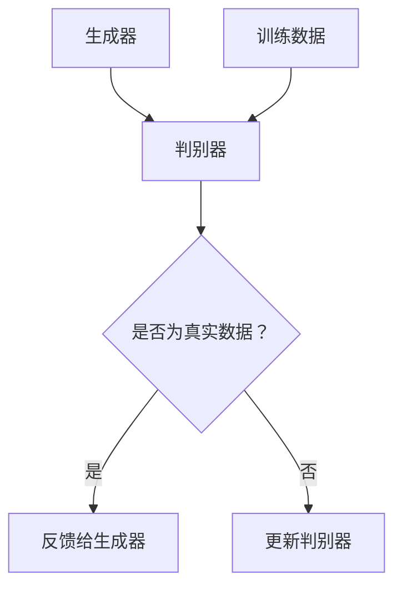
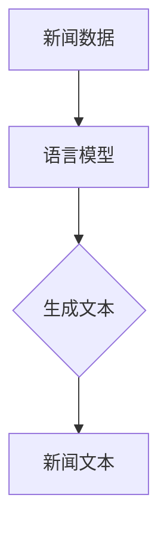
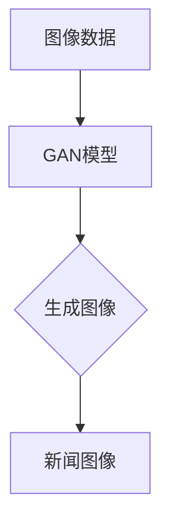
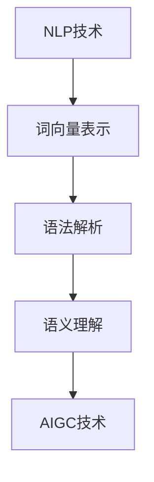
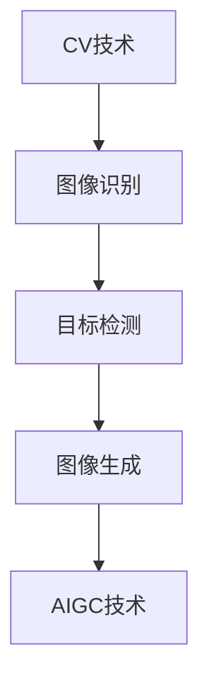

                 

## # AIGC在新闻生成中的真实性挑战

### 关键词：AIGC、新闻生成、真实性、挑战、解决方案

### 摘要：

随着人工智能技术的发展，自动生成内容（AIGC）在新闻生成中的应用越来越广泛。AIGC技术利用机器学习和深度学习算法，能够自动生成新闻文本和图像，极大地提高了新闻生产的效率。然而，这种技术也带来了真实性挑战，包括虚假新闻生成、误导性内容和编辑错误等问题。本文将从背景介绍、核心概念、技术原理、真实性评估方法和解决方案等多个方面，深入探讨AIGC在新闻生成中的真实性挑战，并提出相应的解决策略。通过本文的阅读，读者将了解到AIGC技术的优势与局限，以及如何应对其在新闻生成中的真实性问题。

----------------------------------------------------------------

### 第一部分: AIGC在新闻生成中的真实性挑战背景

#### 第1章: 问题背景与重要性

#### 1.1 问题背景

##### 1.1.1 AIGC技术发展

自动生成内容（AIGC，Automated Generation of Content）是指利用人工智能技术，如机器学习和深度学习，自动化地生成文本、图像、音频等多种形式的内容。近年来，随着计算能力的提升和数据量的爆炸性增长，AIGC技术取得了显著的进展。特别是生成对抗网络（GAN）和强化学习（RL）等先进算法的应用，使得AIGC在文本生成、图像生成和音频生成等方面表现出色。

##### 1.1.2 新闻生成与AI技术的结合

新闻生成是AIGC技术应用的一个重要领域。传统的新闻生产过程繁琐且耗时长，而AIGC技术能够大幅提高新闻生产效率，降低人力成本。通过自然语言处理（NLP）和计算机视觉（CV）技术，AIGC可以自动抓取数据、生成新闻文本、配图以及进行新闻编辑，大大缩短了新闻发布的周期。

##### 1.1.3 真实性挑战的产生

然而，随着AIGC在新闻生成中的应用，真实性挑战也逐渐浮现。由于AIGC技术依赖于大量数据和算法模型，其生成的新闻内容可能会存在虚假、误导或失实的情况。这些真实性挑战不仅影响读者的信任度，还可能对社会稳定和公共安全产生负面影响。

#### 1.2 问题描述

##### 1.2.1 真实性失真的现象

AIGC新闻生成中的真实性失真现象主要包括虚假新闻生成、误导性新闻生成和编辑错误导致的失实新闻。虚假新闻是指完全捏造或歪曲事实的报道，误导性新闻则是基于部分真实信息进行不实描述或夸大其词。

##### 1.2.2 真实性挑战的影响

真实性挑战对新闻传播的影响是多方面的。首先，它损害了新闻业的信誉和公信力，导致公众对新闻报道的信任度下降。其次，虚假和误导性新闻可能引发社会恐慌、误导公众决策甚至破坏社会稳定。

##### 1.2.3 真实性评估的难点

真实性评估是解决AIGC新闻生成真实性挑战的关键。然而，评估真实性的难点在于：

1. **数据多样性**：新闻内容涵盖了广泛的领域和主题，评估标准难以统一。
2. **算法复杂性**：AIGC技术涉及复杂的算法和模型，评估其真实性需要深入的技术理解。
3. **实时性**：新闻传播的速度极快，真实性评估需要高效的算法和工具。

#### 1.3 问题解决

##### 1.3.1 常见方法与技术

为了解决AIGC新闻生成中的真实性挑战，研究者们提出了多种方法和技术。例如，基于内容的真实性评估方法，通过对比新闻内容和事实数据来识别虚假新闻；基于用户反馈的真实性评估方法，通过用户投票或评论来评估新闻的真实性。

##### 1.3.2 真实性保障的机制

除了技术方法，还需要建立真实性保障的机制。这包括制定行业标准、建立新闻质量认证体系、提高新闻从业者的职业素养等。

##### 1.3.3 潜在解决方案探讨

未来，随着AI技术的进一步发展，可能还会出现更多创新的解决方案。例如，利用区块链技术确保新闻数据的不可篡改性，或者通过人工智能与人类编辑的协同工作来提高新闻的真实性。

#### 1.4 边界与外延

##### 1.4.1 AIGC在新闻生成中的应用范围

AIGC在新闻生成中的应用范围广泛，包括自动化新闻写作、新闻图像生成、音频生成等。然而，不同应用场景对真实性的要求有所不同，需要根据具体场景制定相应的真实性保障策略。

##### 1.4.2 真实性挑战的全球化影响

真实性挑战不仅限于某个国家或地区，它具有全球化的影响。随着新闻信息的全球化传播，真实性挑战成为一个跨国界的问题，需要国际社会的共同努力来解决。

##### 1.4.3 未来发展趋势与挑战

未来，AIGC技术将继续快速发展，但在新闻生成中的真实性挑战也将日益严峻。为了应对这些挑战，需要技术创新、行业协作和公众教育等多方面的努力。

#### 1.5 概念结构与核心要素组成

##### 1.5.1 AIGC的核心概念

AIGC的核心概念包括自动生成内容（ACG）、图像生成、文本生成、生成对抗网络（GAN）和强化学习（RL）等。这些概念共同构成了AIGC技术的基础。

##### 1.5.2 新闻生成中的真实性

新闻生成中的真实性是指新闻内容的真实性和准确性。真实性是新闻传播的生命线，是新闻业的核心价值观。

##### 1.5.3 真实性在新闻传播中的重要性

真实性在新闻传播中具有重要性。真实的新闻能够帮助公众获取准确的信息，做出合理的决策，维护社会稳定。虚假和误导性新闻则会扰乱社会秩序，损害公共利益。

#### 1.6 本章小结

本章节从背景介绍、核心概念、技术原理、真实性评估方法和解决方案等多个方面，深入探讨了AIGC在新闻生成中的真实性挑战。通过本章的阅读，读者将了解到AIGC技术的优势与局限，以及如何应对其在新闻生成中的真实性问题。在未来，随着AI技术的进一步发展，真实性挑战将成为新闻业面临的一个重要议题。

----------------------------------------------------------------

### 第二部分: AIGC新闻生成真实性挑战的核心概念

#### 第2章: AIGC技术原理与新闻生成应用

##### 2.1 AIGC技术原理

AIGC（Automated Intelligent Generation of Content）是一种利用人工智能技术自动生成内容的系统。它通过机器学习和深度学习算法，对大量数据进行训练，从而生成新的、符合预期的内容。AIGC技术的主要组成部分包括自动生成内容（ACG）、图像生成、文本生成、生成对抗网络（GAN）和强化学习（RL）。

##### 2.1.1 自动生成内容的基本概念

自动生成内容（ACG）是指利用算法和模型自动创建内容，而不需要人类编辑的干预。ACG可以生成文本、图像、音频等多种类型的内容。在新闻生成中，ACG技术主要用于自动写作和内容创作。

##### 2.1.2 图像生成与文本生成的技术框架

图像生成和文本生成是AIGC技术的核心组成部分。图像生成技术包括生成对抗网络（GAN）和变分自编码器（VAE）等。这些技术通过学习大量图像数据，能够生成新的、高质量的图像。文本生成技术则包括循环神经网络（RNN）、长短期记忆网络（LSTM）和Transformer等。这些技术通过学习大量文本数据，能够生成新的、符合语法和语义的文本。

##### 2.1.3 生成对抗网络（GAN）的工作机制

生成对抗网络（GAN）是一种由生成器和判别器组成的对抗性神经网络。生成器的目标是生成看起来像真实数据的数据，而判别器的目标是区分生成数据与真实数据。通过这种对抗性的训练过程，生成器不断优化，最终能够生成高质量的数据。

##### 2.1.4 强化学习在AIGC中的应用

强化学习（RL）是一种通过试错和反馈来学习最优行为策略的机器学习方法。在AIGC中，强化学习可以用于优化生成器的输出质量。例如，在文本生成中，强化学习可以通过评估文本的语义和语法质量，来调整生成器的参数，从而生成更符合预期的文本。

##### 2.2 AIGC在新闻生成中的应用

AIGC在新闻生成中的应用包括自动写作、新闻图像生成和新闻编辑等。通过AIGC技术，新闻机构可以大幅提高新闻生产效率，降低人力成本。

##### 2.2.1 AIGC在新闻文本生成中的应用

AIGC在新闻文本生成中的应用主要基于自然语言处理（NLP）技术。通过训练大型语言模型，如GPT-3，AIGC可以自动生成新闻文本。这些文本不仅符合语法规则，还能够传达新闻事件的核心信息。

##### 2.2.2 AIGC在新闻图像生成中的应用

AIGC在新闻图像生成中的应用主要基于计算机视觉（CV）技术。通过训练生成对抗网络（GAN），AIGC可以自动生成新闻图像。这些图像不仅具有高质量，还能够反映新闻事件的场景和氛围。

##### 2.2.3 AIGC对新闻编辑流程的影响

AIGC技术的应用改变了新闻编辑的流程。传统的新闻编辑过程包括数据采集、内容创作、编辑和发布等环节。而AIGC技术可以自动化这些环节，特别是在数据采集和内容创作方面。通过AIGC技术，新闻编辑人员可以专注于内容审核和发布，从而提高工作效率。

##### 2.2.4 AIGC在新闻传播中的挑战

尽管AIGC技术在新闻生成中具有巨大潜力，但也带来了一系列挑战。其中最突出的挑战是真实性挑战。由于AIGC技术生成的新闻内容可能存在虚假、误导或失实的情况，这要求新闻机构建立有效的真实性保障机制。

#### 2.3 核心概念对比与联系

##### 2.3.1 AIGC与自然语言处理（NLP）的联系

自然语言处理（NLP）是AIGC技术的重要组成部分。NLP技术包括词向量表示、语法解析、语义理解等。这些技术为AIGC提供了丰富的语言模型和数据资源，使得AIGC能够生成高质量的新闻文本。

##### 2.3.2 NLP技术的进化与AIGC的发展

随着NLP技术的不断进化，AIGC技术也在不断发展。特别是近年来，大型语言模型如GPT-3的出现，极大地提升了AIGC的新闻生成能力。这些大型语言模型通过预训练和微调，能够生成更加准确和自然的新闻文本。

##### 2.3.3 NLP与AIGC在新闻生成中的协同作用

NLP和AIGC技术在新闻生成中相互协同，共同提高新闻生成质量。NLP技术为AIGC提供了语言资源和模型支持，而AIGC技术则利用NLP技术生成的数据，进一步优化和提升新闻生成效果。

##### 2.3.4 AIGC与计算机视觉（CV）的联系

计算机视觉（CV）是AIGC技术的重要组成部分。CV技术包括图像识别、目标检测、图像生成等。这些技术为AIGC提供了丰富的视觉数据资源，使得AIGC能够生成高质量的新闻图像。

##### 2.3.5 图像生成技术对新闻可视化的影响

图像生成技术在新闻可视化中的应用，使得新闻内容更加生动和直观。通过AIGC技术生成的新闻图像，不仅能够反映新闻事件的现场，还能够通过图像的视觉效果，增强新闻的吸引力和感染力。

##### 2.3.6 CV与AIGC在新闻生成中的互补作用

计算机视觉（CV）和AIGC技术在新闻生成中具有互补作用。CV技术负责生成新闻图像，而AIGC技术则负责生成新闻文本。两者相互配合，共同提高新闻生成质量，使得新闻内容更加全面和丰富。

#### 2.4 本章小结

本章从AIGC技术原理和新闻生成应用两个方面，详细介绍了AIGC技术在新闻生成中的应用。通过对比NLP和CV技术，分析了它们在AIGC技术中的联系和互补作用。本章的内容为后续探讨AIGC新闻生成中的真实性挑战提供了基础。

----------------------------------------------------------------

### 第三部分: AIGC新闻生成中的真实性挑战分析与解决方案

#### 第3章: AIGC新闻生成中的真实性失真现象

##### 3.1 真实性失真现象概述

在AIGC技术应用于新闻生成过程中，真实性失真现象是广泛存在且亟待解决的问题。真实性失真现象主要表现为虚假新闻生成、误导性新闻生成和编辑错误导致的失实新闻。

##### 3.1.1 真实性失真的定义

真实性失真是指生成的新闻内容与客观事实不符，包括虚假信息、误导性描述和失实报道等。这种失真可能源于AIGC模型的不完善、数据集的质量问题，或者是对算法训练过程中数据的处理不当。

##### 3.1.2 真实性失真的类型

真实性失真的类型可以分为以下几种：

1. **虚假新闻生成**：这是最严重的真实性失真形式，指的是完全虚构的新闻内容，可能是恶意编造或误报。
2. **误导性新闻生成**：这种新闻内容可能基于部分真实信息，但描述不准确或夸大其词，导致公众对事实的理解产生偏差。
3. **编辑错误导致的失实新闻**：这种失真是由于AIGC模型对新闻数据进行错误处理或编辑人员未能及时纠正错误而产生的。

##### 3.1.3 真实性失真对新闻传播的影响

真实性失真对新闻传播的影响是深远且负面的。首先，它损害了新闻业的信誉和公信力，导致公众对新闻报道的信任度下降。其次，虚假和误导性新闻可能引发社会恐慌、误导公众决策，甚至破坏社会稳定。此外，真实性失真还可能导致新闻机构面临法律责任和商业风险。

##### 3.2 真实性失真现象案例分析

为了更好地理解真实性失真现象，我们可以通过以下案例进行分析：

###### 3.2.1 案例一：虚假新闻生成

案例一涉及到AIGC生成虚假新闻的问题。一个实际案例是某些新闻网站使用AIGC技术自动生成新闻文章，但由于模型训练数据存在偏差，生成的文章中充斥着虚假信息。例如，某些新闻报道声称某个小镇因气候变化而发生了异常洪水，但实际上并未发生此类事件。这种虚假新闻的传播不仅误导了公众，还可能引发社会恐慌和不安。

###### 3.2.2 案例二：误导性新闻生成

案例二涉及到AIGC生成误导性新闻的问题。一个实际案例是某新闻报道了某公司即将推出一款新产品，但该新闻并未经过公司官方证实。由于AIGC模型未能准确获取信息来源，生成的内容中包含虚假信息，导致公众对该公司产品的预期产生了偏差。这种误导性新闻不仅损害了公司的声誉，还可能误导消费者做出错误的决策。

###### 3.2.3 案例三：编辑错误导致的失实新闻

案例三涉及到编辑错误导致的失实新闻问题。一个实际案例是某新闻报道了一起交通事故，但由于AIGC模型在处理新闻数据时出现了错误，导致报道中的关键信息与实际情况不符。例如，报道中提到事故车辆的速度为120公里/小时，而实际检测结果显示仅为60公里/小时。这种编辑错误导致的失实新闻可能误导公众对事故原因和后果的理解。

##### 3.3 真实性失真的技术原因分析

真实性失真的技术原因主要包括以下几个方面：

###### 3.3.1 AIGC模型的局限性

AIGC模型，尤其是基于深度学习的模型，在训练过程中依赖于大量数据。然而，这些数据可能存在偏差或不准确，导致模型生成的内容也存在失真。此外，模型自身的复杂性和不确定性也使得真实性保障变得更加困难。

###### 3.3.2 数据集质量的影响

数据集的质量直接影响AIGC模型的学习效果。如果数据集包含大量错误或偏见信息，模型在训练过程中可能会学习到这些错误，导致生成的内容失真。例如，某些新闻数据集中可能包含大量虚假新闻或误导性信息，这会导致模型生成的内容也具有类似的问题。

###### 3.3.3 模型训练与优化的偏差

在AIGC模型的训练和优化过程中，可能会出现一些偏差，导致模型生成的内容与真实情况不符。例如，为了提高生成内容的吸引力或点击率，模型可能会夸大某些信息或忽略其他重要信息，从而导致失实新闻的产生。

##### 3.4 真实性失真的社会影响

真实性失真不仅在技术层面上对新闻生成产生影响，还在社会层面上产生了深远的影响：

###### 3.4.1 社会影响

虚假和误导性新闻的传播可能导致公众对新闻媒体的信任度下降，进而影响社会舆论的形成和传播。此外，真实性失真还可能导致社会恐慌、误导公众决策，甚至引发社会动荡。

###### 3.4.2 法律影响

真实性失真可能使新闻机构面临法律诉讼和责任追究。例如，虚假新闻可能侵犯他人的名誉权、隐私权等，导致新闻机构面临巨额赔偿和法律风险。

###### 3.4.3 道德影响

真实性失真违反了新闻业的职业道德和行业标准。新闻机构应当坚守真实、客观、公正的报道原则，而真实性失真则背离了这些基本原则，损害了新闻业的声誉和公信力。

##### 3.5 真实性评估的方法

为了应对AIGC新闻生成中的真实性挑战，需要建立有效的真实性评估方法。以下是几种常用的真实性评估方法：

###### 3.5.1 基于内容的真实性评估

基于内容的真实性评估是通过分析新闻内容本身来判断其真实性的方法。这种方法主要包括以下几种：

1. **文本匹配**：通过将新闻内容与已知的事实数据进行匹配，判断新闻内容是否与事实一致。
2. **语义分析**：利用自然语言处理技术，对新闻内容进行语义分析，判断其是否逻辑一致、信息准确。
3. **数据溯源**：追溯新闻内容的来源，判断其是否可靠。

###### 3.5.2 基于用户反馈的真实性评估

基于用户反馈的真实性评估是通过收集用户的反馈来判断新闻内容的真实性。这种方法主要包括以下几种：

1. **用户投票**：通过用户的投票来评估新闻内容的真实性，用户可以选择“真实”或“虚假”。
2. **用户评论**：通过用户评论的内容来判断新闻内容的真实性，用户的评论可能揭示新闻内容中的错误或误导性信息。
3. **用户参与度**：通过用户对新闻内容的参与度（如点击、分享、评论等）来判断新闻内容的真实性。

##### 3.6 本章小结

本章分析了AIGC新闻生成中的真实性失真现象，包括虚假新闻生成、误导性新闻生成和编辑错误导致的失实新闻。通过对案例分析和技术原因分析，我们了解了真实性失真的严重性和社会影响。为了解决这些问题，需要建立有效的真实性评估方法，包括基于内容的评估和基于用户反馈的评估。这些方法将为新闻机构提供有力的工具，以应对AIGC新闻生成中的真实性挑战。

----------------------------------------------------------------

### 第4章: AIGC新闻生成中的真实性评估方法

#### 4.1 真实性评估方法概述

真实性评估是确保AIGC新闻生成质量的关键环节。评估方法可以分为基于内容的评估和基于用户反馈的评估两大类。基于内容的评估通过分析新闻内容的逻辑一致性、数据来源和语义准确性来判断其真实性；而基于用户反馈的评估则通过用户的投票、评论和参与度来评估新闻的真实性。

#### 4.2 基于内容的真实性评估

##### 4.2.1 内容分析方法的概述

基于内容的真实性评估方法是通过深入分析新闻内容的内在特征来判断其真实性。这种方法主要包括以下几种：

1. **文本匹配**：通过将新闻内容与已知的事实数据进行匹配，判断新闻内容是否与事实一致。这种方法通常使用关键词匹配、文本相似度计算等技术。
2. **语义分析**：利用自然语言处理技术，对新闻内容进行语义分析，判断其是否逻辑一致、信息准确。这种方法包括词义消歧、情感分析、语法检查等。
3. **数据溯源**：追溯新闻内容的来源，判断其是否可靠。通过调查新闻来源的可靠性，评估新闻内容的真实性。

##### 4.2.2 基于文本匹配的评估方法

基于文本匹配的评估方法是通过将新闻内容与已知的事实数据或权威信息进行比对，判断其一致性。这种方法通常涉及以下步骤：

1. **数据准备**：收集大量的事实数据或权威信息，并将其转换为结构化数据。
2. **关键词提取**：从新闻内容中提取关键信息，作为匹配的依据。
3. **文本相似度计算**：使用文本相似度计算算法（如余弦相似度、Jaccard系数等）对新闻内容与事实数据进行比对，判断其相似度。
4. **评估标准**：设定一定的阈值，当文本相似度高于阈值时，认为新闻内容与事实一致，反之则认为存在失真。

##### 4.2.3 基于语义理解的评估方法

基于语义理解的评估方法通过深入分析新闻内容的语义关系来判断其真实性。这种方法通常涉及以下步骤：

1. **句法解析**：对新闻内容进行句法解析，构建句法树，分析句子的结构关系。
2. **语义角色标注**：对句子中的实体和关系进行标注，明确各个实体之间的语义关系。
3. **逻辑一致性检查**：通过逻辑推理和语义分析，检查新闻内容中的逻辑一致性，判断其是否符合常识和逻辑。
4. **语义比较**：将新闻内容与已知的事实数据或权威信息进行比较，分析其语义一致性。

#### 4.3 基于用户反馈的真实性评估

##### 4.3.1 用户反馈评估的原理

基于用户反馈的真实性评估方法是通过收集用户的投票、评论和参与度等信息，来评估新闻内容的真实性。这种方法的核心在于利用用户的主观判断和行为数据，为新闻内容提供额外的验证。

##### 4.3.2 用户参与的真实性评估机制

用户参与的真实性评估机制包括以下几个方面：

1. **用户投票**：用户可以对新闻内容进行投票，选择“真实”或“虚假”。通过统计投票结果，可以初步判断新闻内容的真实性。
2. **用户评论**：用户可以在新闻内容下方发表评论，提供对新闻内容的反馈。通过分析用户评论的内容和情感，可以进一步评估新闻内容的真实性。
3. **用户参与度**：用户对新闻内容的参与度（如点击、分享、评论等）可以作为评估新闻内容真实性的参考。通常，参与度越高的新闻内容，越可能被认为是真实的。

##### 4.3.3 用户反馈评估的优势与挑战

基于用户反馈的真实性评估方法具有以下优势：

1. **客观性**：用户反馈来自真实用户，具有较高的客观性，能够反映公众对新闻内容的真实感受。
2. **实时性**：用户反馈是实时的，能够快速反映新闻内容的变化和公众的态度，有助于及时发现和纠正真实性问题。

然而，这种方法也存在一些挑战：

1. **噪声数据**：用户反馈中可能包含大量噪声数据，如恶意评论、虚假投票等，这些数据会影响评估结果的准确性。
2. **数据偏差**：用户反馈可能受到用户个人观点、经验等因素的影响，导致评估结果存在偏差。
3. **用户参与度不足**：用户参与度可能不足，导致评估数据的样本量有限，影响评估结果的代表性。

##### 4.3.4 用户反馈评估的应用案例

以下是一个用户反馈评估的应用案例：

某新闻网站使用基于用户反馈的真实性评估方法，对AIGC生成的新闻内容进行评估。用户可以对该新闻内容进行投票，选择“真实”或“虚假”。此外，用户还可以在新闻下方发表评论，提供对新闻内容的反馈。通过分析用户投票和评论的结果，网站管理员可以初步判断该新闻内容是否真实。例如，如果大部分用户投票选择“真实”，同时评论内容也表明用户对新闻内容的真实性表示认可，则可以认为该新闻内容是真实的。

#### 4.4 真实性评估方法的比较与综合应用

基于内容的评估方法和基于用户反馈的评估方法各有优缺点，可以相互补充。基于内容的评估方法能够提供客观、准确的评估结果，但需要大量的数据和技术支持；基于用户反馈的评估方法能够提供实时、多样化的评估数据，但可能存在噪声和数据偏差。

在实际应用中，可以将两种评估方法相结合，以提高评估的准确性和全面性。例如，首先使用基于内容的评估方法对新闻内容进行初步筛选，判断其是否符合基本真实性标准；然后结合用户反馈评估结果，对可能存在疑问的新闻内容进行进一步分析，从而得出更准确的评估结论。

#### 4.5 本章小结

本章介绍了AIGC新闻生成中的真实性评估方法，包括基于内容的评估方法和基于用户反馈的评估方法。通过文本匹配、语义分析和用户投票等多种手段，可以有效地评估新闻内容的真实性。本章的内容为解决AIGC新闻生成中的真实性挑战提供了有益的参考，有助于新闻机构建立完善的真实性保障机制。在未来，随着AI技术的不断进步，真实性评估方法也将不断改进和完善。

