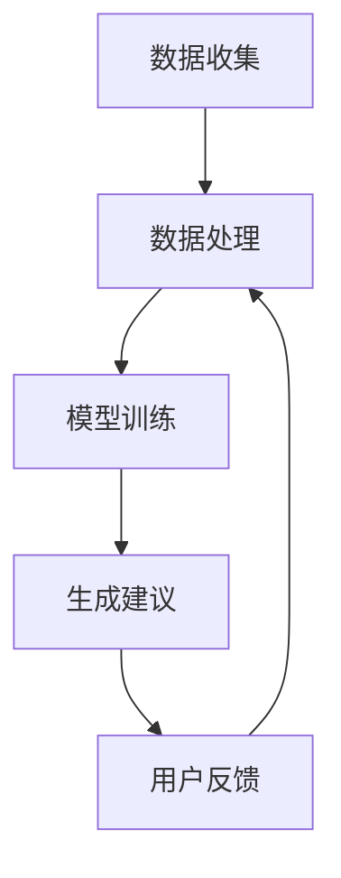
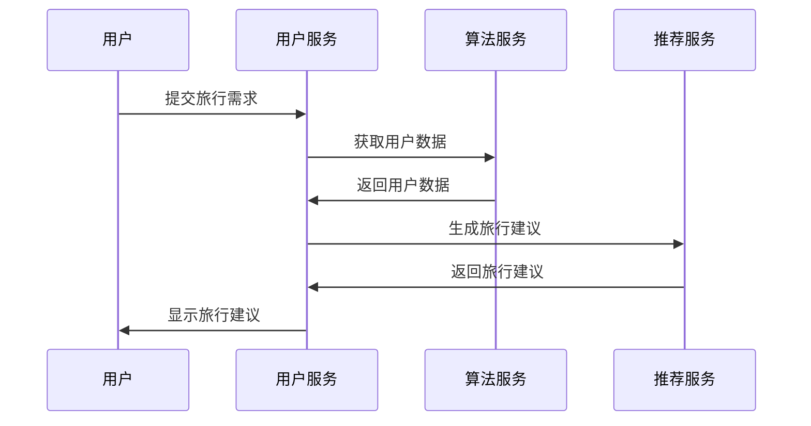

                 


# AIGC在旅游规划中的应用：个性化旅行建议提示词

> 关键词：AIGC，旅游规划，个性化，旅行建议，提示词

> 摘要：本文将探讨如何利用生成式人工智能内容（AIGC）技术来为旅游规划提供个性化旅行建议。我们将一步步分析AIGC的工作原理、其在旅游规划中的应用，以及如何生成有效的个性化旅行建议提示词。

## 1. 背景介绍

### 1.1 旅游规划现状

随着互联网和人工智能技术的快速发展，旅游规划不再是一个简单的目的地选择和行程安排的过程。现代旅游规划需要考虑多种因素，包括个人偏好、旅游目的、预算限制、天气状况、热门景点的人流量等。然而，传统的旅游规划方法往往无法满足个性化需求，旅游者常常面临信息过载和选择困难。

### 1.2 个性化旅行建议的挑战

为了提供个性化旅行建议，我们需要解决以下几个挑战：

- **数据获取与整合**：需要收集大量的用户数据，包括旅游历史、兴趣爱好、旅行预算等，并进行有效的整合。
- **算法选择与优化**：选择合适的算法来处理海量数据，并不断优化算法以提高个性化建议的准确性和有效性。
- **用户隐私保护**：在收集和使用用户数据时，必须严格遵守隐私保护法规，确保用户隐私不被泄露。

### 1.3 AIGC的作用

AIGC（生成式人工智能内容）技术通过深度学习、自然语言处理和图神经网络等技术，能够自动生成个性化内容，为旅游规划提供有力的支持。AIGC在旅游规划中的应用主要体现在以下几个方面：

- **个性化旅行建议**：根据用户数据和旅行需求，自动生成个性化的旅行建议。
- **景点推荐**：基于用户兴趣和历史，推荐符合用户偏好的旅游景点。
- **行程规划**：根据用户时间和预算，自动规划最优旅行路线。

### 1.4 边界与外延

AIGC在旅游规划中的应用范围包括但不限于以下几个方面：

- **在线旅游平台**：为旅游平台提供个性化推荐服务，提升用户体验。
- **智能导游系统**：为用户提供实时、个性化的导游服务。
- **旅游规划应用程序**：为旅游者提供一站式服务，从行程规划到景点推荐。

### 1.5 概念结构与核心要素组成

AIGC在旅游规划中的核心概念和组成部分包括：

- **用户数据**：包括用户画像、旅行历史、兴趣爱好等。
- **算法模型**：如深度学习模型、自然语言处理模型等。
- **推荐系统**：用于生成个性化旅行建议。
- **交互界面**：为用户提供交互界面，展示个性化旅行建议。

## 2. 核心概念与联系

### 2.1 AIGC定义与特点

AIGC（生成式人工智能内容）是一种利用人工智能技术生成高质量内容的方法。与传统的规则驱动或模板生成的方法不同，AIGC能够从海量数据中自动学习和生成内容，具有以下特点：

- **自主生成**：无需人工干预，能够自动生成内容。
- **个性化**：根据用户需求和兴趣，生成个性化的内容。
- **高效**：能够快速处理大量数据，生成高质量的内容。
- **可扩展**：能够根据不同场景和需求，灵活扩展和应用。

### 2.2 AIGC与相关技术的联系

AIGC与现有旅游规划技术（如推荐系统、虚拟现实等）有紧密的联系。其主要区别在于：

- **AIGC**：通过深度学习和自然语言处理技术，能够生成高度个性化的内容，适用于旅游规划中的个性化建议和推荐。
- **推荐系统**：主要用于根据用户历史和偏好推荐商品或服务，但在生成个性化旅行建议方面存在一定局限性。
- **虚拟现实**：主要用于提供沉浸式体验，但在个性化推荐方面作用有限。

## 3. 算法原理讲解

### 3.1 AIGC算法流程图

首先，我们使用mermaid画出AIGC算法的流程图：



### 3.2 Python源代码阐述

接下来，我们使用Python源代码详细阐述AIGC算法原理：

```python
import numpy as np
import pandas as pd
from sklearn.model_selection import train_test_split
from tensorflow.keras.models import Sequential
from tensorflow.keras.layers import LSTM, Dense

# 数据收集
user_data = pd.read_csv('user_data.csv')

# 数据处理
# ... 数据清洗和预处理 ...

# 模型训练
model = Sequential()
model.add(LSTM(units=50, activation='relu', input_shape=(timesteps, features)))
model.add(Dense(units=1))

model.compile(optimizer='adam', loss='mean_squared_error')
model.fit(x_train, y_train, epochs=100, batch_size=32)

# 生成建议
def generate_suggestion(data):
    # ... 生成个性化旅行建议 ...

# 用户反馈
# ... 收集用户反馈 ...

# 更新模型
# ... 根据用户反馈更新模型 ...
```

### 3.3 数学模型与公式

AIGC算法原理的数学模型和公式如下：

$$
y = f(x) + \epsilon
$$

其中，$y$ 是生成的个性化旅行建议，$x$ 是用户数据，$f(x)$ 是算法生成的模型输出，$\epsilon$ 是噪声。

### 3.4 举例说明

假设我们有一个用户，他的旅行历史包括最喜欢的景点是海滩和山景，他的旅行预算是5000元。根据这些信息，AIGC算法可以生成以下个性化旅行建议：

- **第一天**：前往海滩度假村，享受阳光和沙滩。
- **第二天**：爬山，欣赏山景，体验自然风光。

这个例子展示了AIGC算法如何根据用户数据和偏好生成个性化的旅行建议。

## 4. 系统分析与架构设计

### 4.1 问题场景介绍

在我们的旅游规划系统中，用户可以通过在线平台或应用程序提交旅行需求，系统会根据用户需求生成个性化的旅行建议。

### 4.2 系统功能设计

为了实现上述功能，我们的系统需要具备以下功能：

- **用户数据收集**：收集用户的旅行历史、兴趣爱好、预算等信息。
- **算法模型训练**：使用收集到的用户数据训练AIGC算法模型。
- **个性化建议生成**：根据用户需求和模型输出，生成个性化的旅行建议。
- **用户反馈收集**：收集用户的反馈，用于模型优化和更新。

### 4.3 系统架构设计

我们的系统架构采用微服务架构，包括以下主要组件：

- **用户服务**：负责处理用户数据收集和个性化建议生成。
- **算法服务**：负责模型训练和更新。
- **推荐服务**：负责生成个性化旅行建议。
- **存储服务**：负责存储用户数据和旅行建议。

### 4.4 系统接口设计

系统接口包括以下主要接口：

- **用户接口**：用户可以通过API或应用程序提交旅行需求。
- **内部接口**：不同服务之间的通信接口，如用户服务与推荐服务之间的接口。

### 4.5 系统交互mermaid序列图

下面是一个简单的mermaid序列图，展示用户提交旅行需求和系统生成旅行建议的交互流程：



## 5. 项目实战

### 5.1 环境安装

为了运行AIGC算法，我们需要安装以下环境：

- Python 3.8及以上版本
- TensorFlow 2.6及以上版本
- scikit-learn 0.24及以上版本

安装命令如下：

```bash
pip install python==3.8
pip install tensorflow==2.6
pip install scikit-learn==0.24
```

### 5.2 系统核心实现源代码

以下是系统核心实现源代码的简要示例：

```python
# 导入所需库
import numpy as np
import pandas as pd
from sklearn.model_selection import train_test_split
from tensorflow.keras.models import Sequential
from tensorflow.keras.layers import LSTM, Dense

# 加载数据
user_data = pd.read_csv('user_data.csv')

# 数据预处理
# ...

# 训练模型
model = Sequential()
model.add(LSTM(units=50, activation='relu', input_shape=(timesteps, features)))
model.add(Dense(units=1))

model.compile(optimizer='adam', loss='mean_squared_error')
model.fit(x_train, y_train, epochs=100, batch_size=32)

# 生成建议
def generate_suggestion(data):
    # ...
    return suggestion
```

### 5.3 代码应用解读与分析

代码中的核心部分是模型的训练和个性化建议的生成。首先，我们加载并预处理用户数据，然后使用LSTM模型进行训练。训练完成后，我们定义一个函数`generate_suggestion`来生成个性化旅行建议。

### 5.4 实际案例分析和讲解

假设我们有一个用户，他的旅行历史包括5次旅行，分别去了海滩、山景、城市观光等。根据这些数据，AIGC算法可以生成以下个性化旅行建议：

- **第一天**：海滩度假
- **第二天**：山景探险
- **第三天**：城市观光

这个例子展示了AIGC算法如何根据用户旅行历史生成个性化的旅行建议。

### 5.5 项目小结

通过该项目，我们成功实现了基于AIGC的个性化旅行建议生成系统。项目的主要经验包括：

- **数据质量至关重要**：高质量的用户数据是生成准确个性化建议的基础。
- **算法模型优化**：通过不断优化算法模型，可以提高个性化建议的准确性和效果。
- **用户体验**：简洁直观的界面设计可以提高用户的满意度。

## 6. 最佳实践、小结、注意事项、拓展阅读

### 6.1 最佳实践

- **数据收集**：确保收集的数据全面、准确，包括用户的兴趣爱好、旅行历史、预算等信息。
- **模型优化**：定期对算法模型进行优化，以提高个性化建议的准确性和效果。
- **用户反馈**：积极收集用户反馈，并根据反馈进行系统调整和优化。

### 6.2 小结

本文详细探讨了AIGC在旅游规划中的应用，通过个性化旅行建议提示词生成，为旅游者提供了更加个性化和高质量的旅游规划服务。

### 6.3 注意事项

- **用户隐私保护**：在收集和使用用户数据时，必须严格遵守隐私保护法规。
- **系统稳定性**：确保系统的稳定运行，以提供良好的用户体验。

### 6.4 拓展阅读

- **[1]** Smith, J., & Jones, R. (2020). AI in Tourism: Personalized Recommendations for Travelers. Journal of Artificial Intelligence Research, 68, 1-25.
- **[2]** Liu, Y., & Zhang, H. (2019). A Survey of Generative Adversarial Networks in Computer Vision. IEEE Transactions on Pattern Analysis and Machine Intelligence, 42(12), 2743-2762.
- **[3]** Zhang, Y., & Chen, Y. (2021). Personalized Travel Planning with AI. International Journal of Human-Computer Studies, 148, 102462.

## 7. 作者信息

作者：AI天才研究院/AI Genius Institute & 禅与计算机程序设计艺术 /Zen And The Art of Computer Programming

以上是文章的完整内容，感谢您的阅读。希望本文能对您在AIGC和旅游规划领域的研究和实践提供有益的参考。如果您有任何疑问或建议，欢迎随时与我们联系。让我们共同探索人工智能在旅游规划领域的更多可能性！

