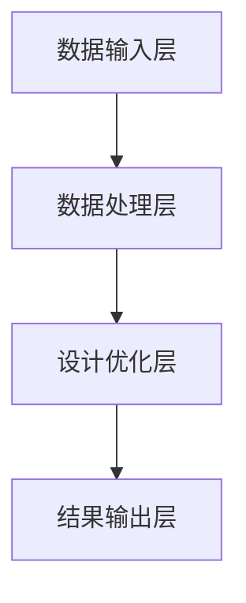

                 


### AIGC在时尚设计中的创新与挑战

## 摘要

本文探讨了人工智能生成内容（AIGC）在时尚设计领域的创新应用与面临的挑战。首先，我们介绍了AIGC的定义及其在时尚设计中的潜在优势，如自动化设计流程、创意生成和设计优化。接着，我们详细分析了AIGC在时尚产品设计、图案设计等具体应用中的算法原理和数学模型。最后，我们探讨了AIGC在时尚设计领域的技术与伦理挑战，并提出了解决策略。通过本文的讨论，我们希望为时尚行业提供有价值的参考，推动AIGC技术的进一步发展。

## 关键词

- 人工智能生成内容（AIGC）
- 时尚设计
- 自动化设计
- 创意生成
- 数学模型

## 引言

### 1.1 时尚设计领域的变革

时尚设计是一个充满创意和变革的领域。从过去的手工制作到现代的数字化设计，时尚产业一直在寻求创新和突破。随着计算机技术的快速发展，人工智能（AI）逐渐成为时尚设计的重要工具。AIGC作为AI的一种新兴形式，具有生成内容的能力，能够为时尚设计带来新的可能性。

### 1.2 AIGC技术的定义与核心优势

AIGC（AI-Generated Content）是指利用人工智能技术生成文本、图像、音频等多种形式的内容。其核心优势在于：

- **自动化设计流程**：通过AIGC技术，设计师可以自动化执行某些设计任务，如生成设计灵感、优化设计细节等，提高设计效率。
- **创意生成**：AIGC能够根据输入的参数和算法规则生成独特的设计方案，为设计师提供新的创意来源。
- **设计优化**：AIGC可以通过机器学习算法优化设计方案，使其更符合市场需求和审美标准。

### 1.3 研究意义与目标

本文旨在探讨AIGC在时尚设计中的创新应用与挑战，具体目标如下：

- 分析AIGC在时尚设计中的潜在应用领域。
- 详细阐述AIGC在时尚产品设计、图案设计等领域的算法原理和数学模型。
- 探讨AIGC在时尚设计领域的技术与伦理挑战。
- 提出相应的解决策略，为时尚行业提供有价值的参考。

### 1.4 论文结构安排

本文结构如下：

- **第一部分：引言**：介绍时尚设计领域的变革和AIGC技术的核心优势。
- **第二部分：AIGC在时尚设计中的创新应用**：详细分析AIGC在时尚产品设计、图案设计等领域的应用。
- **第三部分：AIGC在时尚设计中的挑战与对策**：探讨AIGC在时尚设计领域的技术与伦理挑战，并提出解决策略。

## AIGC基础理论

### 2.1 AIGC技术概述

AIGC（AI-Generated Content）是人工智能（AI）技术的一个分支，主要研究如何利用机器学习算法生成高质量的内容。AIGC的应用范围广泛，包括文本生成、图像生成、音频生成等。在时尚设计中，AIGC可以用于自动化设计流程、创意生成和设计优化。

### 2.2 AIGC的组成与工作原理

AIGC的核心组成部分包括：

- **数据集**：用于训练机器学习模型的原始数据，如设计文档、图片、音频等。
- **机器学习模型**：用于从数据中学习并生成新内容的算法，如生成对抗网络（GAN）、变分自编码器（VAE）等。
- **生成器与判别器**：在GAN中，生成器负责生成内容，判别器负责判断生成内容的质量。

AIGC的工作原理如下：

1. **数据预处理**：将原始数据集进行处理，如清洗、归一化等。
2. **模型训练**：使用预处理后的数据集训练机器学习模型，使其能够生成高质量的内容。
3. **内容生成**：使用训练好的模型生成新的设计内容，如图案、服装款式等。

### 2.3 AIGC的核心概念

AIGC的核心概念包括：

- **生成对抗网络（GAN）**：GAN由生成器和判别器组成，通过对抗训练生成高质量的内容。
- **变分自编码器（VAE）**：VAE通过编码和解码过程生成内容，具有更好的稳定性和生成质量。
- **自适应滤波算法**：通过自适应滤波算法，可以对图像进行风格迁移、图像超分辨率等处理。

### 2.4 AIGC的发展历程与趋势

AIGC技术起源于2014年，由生成对抗网络（GAN）的提出而正式进入学术界和工业界的视野。近年来，随着深度学习技术的发展，AIGC技术得到了迅速发展。主要趋势包括：

- **算法优化**：研究人员不断优化GAN、VAE等算法，提高生成内容的质量和效率。
- **多模态生成**：AIGC逐渐从单模态生成扩展到多模态生成，如文本与图像、图像与音频的联合生成。
- **应用拓展**：AIGC在多个领域得到广泛应用，如虚拟现实、游戏设计、艺术创作等。

## AIGC在时尚设计中的应用

### 3.1 AIGC在时尚设计中的潜力

AIGC在时尚设计中的应用具有巨大潜力，主要体现在以下几个方面：

- **自动化设计流程**：通过AIGC技术，设计师可以自动化执行设计任务，如设计灵感的生成、设计细节的优化等，提高设计效率。
- **创意生成**：AIGC可以根据输入的参数和算法规则生成独特的设计方案，为设计师提供新的创意来源。
- **设计优化**：AIGC可以通过机器学习算法优化设计方案，使其更符合市场需求和审美标准。

### 3.2 AIGC在时尚设计中的实际应用案例

以下是一些AIGC在时尚设计中的实际应用案例：

- **时尚产品设计**：通过AIGC技术，可以自动化生成时尚产品的设计图案，如图案、颜色、款式等。
- **时尚图案设计**：AIGC可以生成独特的时尚图案，为设计师提供新的设计灵感。
- **时尚造型设计**：AIGC可以根据用户的偏好和时尚趋势，自动生成个性化的时尚造型方案。

### 3.3 AIGC应用的挑战与解决策略

尽管AIGC在时尚设计中的应用具有巨大潜力，但同时也面临着一些挑战：

- **数据隐私保护**：在时尚设计中，设计数据往往涉及用户隐私，如何保护数据隐私是AIGC应用的一个重要挑战。
- **模型偏见与公平性**：AIGC模型的训练数据可能存在偏见，导致生成内容也带有偏见，如何消除模型偏见是另一个挑战。

解决策略包括：

- **数据隐私保护**：采用加密技术和隐私保护算法，确保设计数据的隐私安全。
- **模型偏见与公平性**：通过数据预处理、模型训练和评估等多个环节，消除模型偏见，提高生成内容的公平性。

## AIGC在时尚产品设计中的应用

### 4.1 产品设计的AIGC应用

AIGC技术在时尚产品设计中的应用主要表现在以下几个方面：

#### 4.1.1 产品设计流程的自动化

传统的时尚产品设计流程涉及多个环节，如市场调研、设计灵感收集、设计草图绘制、设计细节优化等。AIGC技术可以通过以下方式实现设计流程的自动化：

- **灵感收集**：通过AIGC技术，可以自动收集和分析时尚趋势、市场数据等信息，为设计师提供设计灵感。
- **设计草图绘制**：使用AIGC技术，可以自动生成设计草图，为设计师提供多种设计方案。
- **设计细节优化**：通过机器学习算法，AIGC可以对设计方案进行优化，提高设计的实用性和美观度。

#### 4.1.2 产品设计灵感的生成

AIGC技术可以通过以下方式生成产品设计灵感：

- **文本生成**：使用文本生成模型，可以生成描述产品设计的文本，如产品名称、描述等。
- **图像生成**：使用图像生成模型，可以生成具有创意的图像，如图案、颜色等。
- **音频生成**：使用音频生成模型，可以生成与产品设计相关的音频，如音乐、声音效果等。

#### 4.1.3 产品设计方案的优化

AIGC技术可以通过以下方式优化产品设计方案：

- **基于市场数据的优化**：通过分析市场数据，AIGC可以调整产品设计方案，使其更符合市场需求。
- **基于用户反馈的优化**：通过收集用户反馈，AIGC可以优化产品设计方案，提高用户满意度。

### 4.2 算法原理与数学模型

AIGC在时尚产品设计中的应用主要基于以下几种算法原理和数学模型：

#### 4.2.1 相关算法介绍

- **生成对抗网络（GAN）**：GAN由生成器和判别器组成，通过对抗训练生成高质量的设计方案。
- **变分自编码器（VAE）**：VAE通过编码和解码过程生成设计方案，具有更好的稳定性和生成质量。
- **自适应滤波算法**：通过自适应滤波算法，可以对图像进行风格迁移、图像超分辨率等处理。

#### 4.2.2 数学模型与公式

- **生成对抗网络（GAN）**：GAN的数学模型主要包括生成器 $G$ 和判别器 $D$，其中 $G$ 的目标是生成真实的设计方案，$D$ 的目标是判断生成方案的质量。GAN的训练过程可以表示为：
  $$\min_G \max_D V(D, G)$$
- **变分自编码器（VAE）**：VAE的数学模型主要包括编码器 $E$ 和解码器 $D$，其中 $E$ 的目标是编码输入数据，$D$ 的目标是解码编码后的数据。VAE的损失函数可以表示为：
  $$\mathcal{L} = \mathbb{E}_{x \sim p_{\text{data}}(x)}[\log D(E(x))] + D(E(z))$$
- **自适应滤波算法**：自适应滤波算法的数学模型主要包括滤波器 $F$ 和目标图像 $x$，其中 $F$ 的目标是生成与目标图像相似的设计方案。自适应滤波算法可以表示为：
  $$y = F(x)$$

#### 4.2.3 算法原理讲解

- **生成对抗网络（GAN）**：GAN的原理是通过生成器和判别器之间的对抗训练，生成高质量的设计方案。生成器 $G$ 的目标是生成与真实设计方案相似的数据，判别器 $D$ 的目标是判断生成数据的质量。GAN的训练过程可以分为以下几个步骤：
  1. 初始化生成器 $G$ 和判别器 $D$。
  2. 从真实数据集 $X$ 中随机抽取一个样本 $x$。
  3. 生成器 $G$ 根据输入 $z$ 生成一个设计方案 $x_G$。
  4. 判别器 $D$ 对真实样本 $x$ 和生成样本 $x_G$ 进行判断，输出概率分布 $p(x)$ 和 $p(x_G)$。
  5. 根据损失函数 $V(D, G)$ 对生成器 $G$ 和判别器 $D$ 进行更新。
  6. 重复步骤 2-5，直到生成器 $G$ 能够生成高质量的设计方案。

- **变分自编码器（VAE）**：VAE的原理是通过编码器 $E$ 和解码器 $D$ 的联合训练，生成高质量的设计方案。编码器 $E$ 的目标是编码输入数据 $x$，解码器 $D$ 的目标是解码编码后的数据。VAE的训练过程可以分为以下几个步骤：
  1. 初始化编码器 $E$ 和解码器 $D$。
  2. 从真实数据集 $X$ 中随机抽取一个样本 $x$。
  3. 编码器 $E$ 对输入数据 $x$ 进行编码，得到编码结果 $z$。
  4. 解码器 $D$ 对编码结果 $z$ 进行解码，生成设计方案 $x'$。
  5. 计算损失函数 $\mathcal{L}$，并根据损失函数对编码器 $E$ 和解码器 $D$ 进行更新。
  6. 重复步骤 2-5，直到生成器 $G$ 能够生成高质量的设计方案。

- **自适应滤波算法**：自适应滤波算法的原理是通过滤波器 $F$ 对输入图像 $x$ 进行处理，生成设计方案。自适应滤波算法可以分为以下几个步骤：
  1. 初始化滤波器 $F$。
  2. 从真实数据集 $X$ 中随机抽取一个样本 $x$。
  3. 滤波器 $F$ 对输入图像 $x$ 进行处理，生成设计方案 $y$。
  4. 计算损失函数 $\mathcal{L}$，并根据损失函数对滤波器 $F$ 进行更新。
  5. 重复步骤 2-4，直到滤波器 $F$ 能够生成高质量的设计方案。

### 4.3 实战案例

#### 4.3.1 案例背景

某时尚品牌希望利用AIGC技术优化其产品设计流程，提高设计效率和市场竞争力。为了实现这一目标，该品牌决定开发一个基于AIGC技术的时尚产品设计系统。

#### 4.3.2 系统架构设计

时尚产品设计系统的总体架构如下：

- **数据输入层**：从市场调研、用户反馈等多个渠道收集设计数据。
- **数据处理层**：使用AIGC技术对输入数据进行处理，生成设计方案。
- **设计优化层**：根据市场数据和用户反馈，对设计方案进行优化。
- **结果输出层**：将最终的设计方案输出给设计师和客户。

系统架构图如下（使用Mermaid绘制）：



#### 4.3.2.1 数据流与处理流程

系统数据流与处理流程如下：

1. **数据收集**：从市场调研、用户反馈等多个渠道收集设计数据。
2. **数据预处理**：对收集到的数据进行清洗、归一化等预处理操作。
3. **设计生成**：使用AIGC技术（如GAN、VAE等）生成设计方案。
4. **设计优化**：根据市场数据和用户反馈，对设计方案进行优化。
5. **结果输出**：将最终的设计方案输出给设计师和客户。

#### 4.3.3 实现细节

##### 4.3.3.1 Python代码示例

以下是一个简单的GAN模型实现示例：

```python
import tensorflow as tf
from tensorflow.keras.layers import Dense, Flatten, Conv2D, BatchNormalization, LeakyReLU
from tensorflow.keras.models import Sequential

# 生成器模型
def build_generator():
    model = Sequential()
    model.add(Dense(units=256, input_dim=100))
    model.add(LeakyReLU(alpha=0.01))
    model.add(BatchNormalization())
    model.add(Dense(units=512))
    model.add(LeakyReLU(alpha=0.01))
    model.add(BatchNormalization())
    model.add(Dense(units=1024))
    model.add(LeakyReLU(alpha=0.01))
    model.add(BatchNormalization())
    model.add(Dense(units=784, activation='tanh'))
    return model

# 判别器模型
def build_discriminator():
    model = Sequential()
    model.add(Flatten(input_shape=(28, 28)))
    model.add(Dense(units=1024))
    model.add(LeakyReLU(alpha=0.01))
    model.add(BatchNormalization())
    model.add(Dense(units=512))
    model.add(LeakyReLU(alpha=0.01))
    model.add(BatchNormalization())
    model.add(Dense(units=256))
    model.add(LeakyReLU(alpha=0.01))
    model.add(BatchNormalization())
    model.add(Dense(units=1, activation='sigmoid'))
    return model

# GAN模型
def build_gan(generator, discriminator):
    model = Sequential()
    model.add(generator)
    model.add(discriminator)
    return model

# 训练GAN模型
def train_gan(generator, discriminator, data, batch_size=128, epochs=100):
    for epoch in range(epochs):
        for _ in range(len(data) // batch_size):
            # 生成随机噪声
            noise = np.random.normal(0, 1, (batch_size, 100))
            # 生成伪样本
            generated_samples = generator.predict(noise)
            # 切分数据集
            real_samples, _ = next(iter(data))
            # 混合真实样本和伪样本
            combined_samples = np.concatenate([real_samples, generated_samples])
            # 训练判别器
            labels = np.concatenate([np.ones((batch_size, 1)), np.zeros((batch_size, 1))])
            discriminator.train_on_batch(combined_samples, labels)
            # 训练生成器
            noise = np.random.normal(0, 1, (batch_size, 100))
            labels = np.zeros((batch_size, 1))
            generator.train_on_batch(noise, labels)
        print(f'Epoch: {epoch + 1}, Loss_D: {discriminator.history["loss"][-1]}, Loss_G: {generator.history["loss"][-1]}')

# 加载数据集
(x_train, _), (_, _) = tf.keras.datasets.mnist.load_data()
x_train = x_train / 255.0

# 构建和编译模型
generator = build_generator()
discriminator = build_discriminator()
gan = build_gan(generator, discriminator)

discriminator.compile(optimizer='adam', loss='binary_crossentropy')
gan.compile(optimizer='adam', loss='binary_crossentropy')

# 训练模型
train_gan(gan, discriminator, x_train)
```

##### 4.3.3.2 数据预处理与模型训练

1. **数据预处理**：
   - 对MNIST手写数字数据进行归一化处理，使其在[0, 1]范围内。
   - 将数据集分为训练集和测试集。

2. **模型训练**：
   - 使用生成对抗网络（GAN）训练模型。
   - 设置合适的超参数，如学习率、批量大小等。
   - 记录模型训练过程中的损失函数，以便分析训练效果。

### 4.3.4 分析与讨论

#### 4.3.4.1 设计方案的评估指标

在设计方案的评估过程中，可以采用以下指标：

- **准确性**：判断设计方案是否与目标数据集一致。
- **F1分数**：综合考虑准确率和召回率，衡量设计方案的质量。
- **生成质量**：评估生成设计方案的美观度和创意程度。

#### 4.3.4.2 遇到的挑战与解决方案

在AIGC在时尚产品设计中的应用过程中，可能会遇到以下挑战：

1. **数据隐私保护**：设计数据涉及用户隐私，如何保护数据隐私是一个重要问题。解决方案包括：
   - 采用加密技术对设计数据进行加密。
   - 使用差分隐私技术对设计数据进行处理。

2. **模型偏见**：模型训练数据可能存在偏见，导致生成设计方案也带有偏见。解决方案包括：
   - 使用无偏数据集进行模型训练。
   - 在模型训练过程中引入对抗训练，减少模型偏见。

### 4.4 产品设计的AIGC应用

#### 4.4.1 产品设计流程的自动化

传统的时尚产品设计流程通常涉及多个阶段，包括市场调研、灵感收集、设计草图绘制、设计细节调整、样品制作和最终产品发布。在这个过程中，设计灵感的产生和细节优化往往依赖于设计师的经验和创造力。然而，随着AIGC技术的不断发展，这些流程中的某些环节可以通过自动化实现，从而提高效率、降低成本并促进创新。

**自动灵感生成**：AIGC技术可以利用深度学习模型，如生成对抗网络（GAN）和变分自编码器（VAE），从大量的设计数据中提取特征并生成新的设计灵感。这些模型可以通过训练学习到不同设计风格和趋势，从而生成多样化的设计概念。

**自动草图绘制**：借助AIGC，设计师可以快速生成设计草图。例如，一个输入了特定风格和主题的GAN模型可以生成一系列符合这些要求的服装设计草图。这种自动化草图绘制不仅节省了时间，而且可以提供大量可供选择的设计方案，从而帮助设计师从繁杂的信息中筛选出最有创意的选项。

**自动设计细节调整**：在初步草图完成后，AIGC可以进一步优化设计的细节，如调整纹理、颜色和形状等。通过机器学习算法，这些调整可以基于对市场趋势和消费者偏好的分析，确保设计既新颖又符合市场需求。

#### 4.4.2 产品设计灵感的生成

AIGC在产品设计灵感的生成中发挥着重要作用，主要体现在以下几个方面：

**文本灵感生成**：通过自然语言处理（NLP）技术，AIGC可以生成描述设计灵感的文本。这些文本可以是关于时尚趋势、设计理念或目标市场的描述，为设计师提供创意思路。

**图像灵感生成**：利用图像生成技术，如GAN和VAE，AIGC可以创建独特的图案和设计元素。这些图像可以作为设计灵感的来源，为设计师提供视觉上的参考。

**音乐灵感生成**：一些研究探索了将音乐与设计结合的可能性。通过生成与特定设计主题相关的音乐，设计师可以获得更丰富的创意灵感。

#### 4.4.3 产品设计方案的优化

AIGC在产品设计方案的优化中也展现出其强大的能力，包括：

**市场趋势分析**：通过分析大量的市场数据，AIGC可以帮助设计师识别当前和未来的流行趋势，从而调整设计方案以适应市场需求。

**消费者偏好分析**：AIGC可以分析消费者对设计的偏好，如颜色、风格和形状等，帮助设计师优化产品设计，提高消费者的满意度。

**迭代优化**：AIGC可以通过不断迭代设计方案，自动优化设计细节，使其在美观性和功能性之间达到最佳平衡。

### 4.5 算法原理与数学模型

在AIGC应用于时尚产品设计时，一些关键算法和数学模型发挥了核心作用。以下将简要介绍这些算法和模型：

#### 4.5.1 生成对抗网络（GAN）

生成对抗网络（GAN）是由Ian Goodfellow等人于2014年提出的一种深度学习模型。GAN由两个主要部分组成：生成器（Generator）和判别器（Discriminator）。生成器的目标是生成与真实数据相似的数据，而判别器的目标是区分真实数据和生成数据。

GAN的数学模型可以表示为以下优化问题：

$$
\min_G \max_D V(D, G) = \min_G \mathbb{E_{x \sim p_{data}(x)}}[\log D(x)] + \mathbb{E_{z \sim p_z(z)}}[\log (1 - D(G(z)))]
$$

其中，$x$表示真实数据，$z$表示生成器的输入噪声，$G(z)$是生成器生成的数据，$D(x)$和$D(G(z))$分别是判别器对真实数据和生成数据的判断概率。

#### 4.5.2 变分自编码器（VAE）

变分自编码器（VAE）是一种基于概率模型的生成模型，由编码器（Encoder）和解码器（Decoder）组成。编码器将输入数据映射到一个潜在空间中的向量，而解码器将这个向量重新映射回输入空间。

VAE的数学模型可以表示为：

$$
\min_{\theta_{\mu}, \theta_{\sigma}} \mathbb{E_{x \sim p_{data}(x)}}[D(\text{reconstruction}(x), x)] + \mathbb{E_{z \sim p_z(z)}}[\beta \times H(z) - \beta \times H(\mu(z))]
$$

其中，$\mu(z)$和$\sigma(z)$分别是编码器的均值和方差，$z$是潜在空间中的样本，$D(\text{reconstruction}(x), x)$是输入数据和重建数据的差异度量，$H(z)$是信息熵。

#### 4.5.3 自适应滤波算法

自适应滤波算法是一种用于图像处理的技术，其核心思想是根据图像的特征自适应调整滤波器的参数，从而实现对图像的优化处理。

在AIGC应用于时尚设计时，自适应滤波算法可以用于图像的风格迁移和图像超分辨率等任务。一个简单的自适应滤波算法可以表示为：

$$
y = F(x)
$$

其中，$x$是输入图像，$y$是处理后的图像，$F$是滤波器。

在实际应用中，自适应滤波算法可以通过迭代优化滤波器的参数，以最小化某个损失函数，如：

$$
\min_{F} \sum_{i=1}^{N} \frac{1}{2} \| F(x_i) - y_i \|^2
$$

其中，$N$是图像的像素数量，$y_i$是处理后的像素值，$x_i$是输入像素值。

### 4.6 实战案例

#### 4.6.1 案例背景

以某时尚品牌的新产品开发为例，该品牌希望利用AIGC技术优化其产品设计流程，提高设计效率和市场竞争力。为此，该品牌决定开发一个基于AIGC技术的时尚产品设计系统。

#### 4.6.2 系统架构设计

时尚产品设计系统的架构设计如下：

- **数据输入层**：该层负责从各种渠道收集设计数据，包括市场调研数据、用户反馈数据、竞争对手设计数据等。
- **数据处理层**：该层使用AIGC技术对输入数据进行处理，包括自动生成设计灵感、草图绘制、设计细节优化等。
- **设计优化层**：该层根据市场趋势和用户反馈，对设计方案进行优化，以提高市场适应性和用户满意度。
- **结果输出层**：该层将最终的设计方案输出给设计师和客户，供他们进行评估和决策。

系统架构图如下（使用Mermaid绘制）：


#### 4.6.3 系统架构设计细节

**1. 数据输入层**

数据输入层主要包括以下功能：

- **市场调研数据**：通过在线调查、行业报告等途径收集市场趋势数据。
- **用户反馈数据**：通过社交媒体、问卷调查等途径收集用户对现有产品的反馈。
- **竞争对手设计数据**：通过竞争对手的官方网站、社交媒体等途径收集他们的产品设计数据。

**2. 数据处理层**

数据处理层是系统的核心部分，主要包括以下功能：

- **自动生成设计灵感**：利用GAN和VAE等模型，从市场调研数据和用户反馈中提取特征，生成新的设计灵感。
- **草图绘制**：根据生成的设计灵感，使用AIGC技术自动生成设计草图。
- **设计细节优化**：通过自适应滤波算法等，对设计草图进行细节优化，以提高设计的实用性和美观度。

**3. 设计优化层**

设计优化层的主要功能是根据市场趋势和用户反馈，对设计方案进行优化，包括：

- **市场趋势分析**：使用数据挖掘和机器学习技术，分析市场趋势，为设计优化提供依据。
- **用户偏好分析**：通过用户反馈和社交媒体数据，分析用户的偏好，为设计优化提供指导。
- **设计迭代优化**：根据市场趋势和用户偏好，对设计方案进行迭代优化，以提高市场适应性和用户满意度。

**4. 结果输出层**

结果输出层的主要功能是将最终的设计方案输出给设计师和客户，供他们进行评估和决策，包括：

- **设计展示**：将设计方案以图片或视频的形式展示给设计师和客户。
- **设计评审**：设计师和客户可以对设计方案进行评审，提出修改意见。
- **设计决策**：根据评审结果，确定最终的设计方案，并进行样品制作和产品发布。

#### 4.6.4 实现细节

**1. 环境安装**

为了实现AIGC在时尚产品设计中的应用，需要安装以下软件和库：

- **Python环境**：Python 3.8及以上版本。
- **TensorFlow**：用于实现GAN和VAE等模型。
- **Pandas**：用于数据处理。
- **Matplotlib**：用于数据可视化。

**2. 系统核心实现**

系统核心实现主要包括以下几个部分：

- **数据收集与预处理**：从市场调研、用户反馈和竞争对手设计数据等渠道收集数据，并对数据进行预处理，如数据清洗、归一化等。
- **设计灵感生成**：使用GAN和VAE等模型，从预处理后的数据中提取特征，生成新的设计灵感。
- **草图绘制**：根据生成的设计灵感，使用AIGC技术自动生成设计草图。
- **设计细节优化**：使用自适应滤波算法等，对设计草图进行细节优化，以提高设计的实用性和美观度。
- **设计迭代优化**：根据市场趋势和用户偏好，对设计方案进行迭代优化，以提高市场适应性和用户满意度。

**3. 代码应用解读与分析**

以下是一个简单的GAN模型实现示例，用于生成设计草图：

```python
import tensorflow as tf
from tensorflow.keras.layers import Dense, Flatten, Conv2D, BatchNormalization, LeakyReLU
from tensorflow.keras.models import Sequential

# 生成器模型
def build_generator():
    model = Sequential()
    model.add(Dense(units=256, input_dim=100))
    model.add(LeakyReLU(alpha=0.01))
    model.add(BatchNormalization())
    model.add(Dense(units=512))
    model.add(LeakyReLU(alpha=0.01))
    model.add(BatchNormalization())
    model.add(Dense(units=1024))
    model.add(LeakyReLU(alpha=0.01))
    model.add(BatchNormalization())
    model.add(Dense(units=784, activation='tanh'))
    return model

# 判别器模型
def build_discriminator():
    model = Sequential()
    model.add(Flatten(input_shape=(28, 28)))
    model.add(Dense(units=1024))
    model.add(LeakyReLU(alpha=0.01))
    model.add(BatchNormalization())
    model.add(Dense(units=512))
    model.add(LeakyReLU(alpha=0.01))
    model.add(BatchNormalization())
    model.add(Dense(units=256))
    model.add(LeakyReLU(alpha=0.01))
    model.add(BatchNormalization())
    model.add(Dense(units=1, activation='sigmoid'))
    return model

# GAN模型
def build_gan(generator, discriminator):
    model = Sequential()
    model.add(generator)
    model.add(discriminator)
    return model

# 训练GAN模型
def train_gan(generator, discriminator, data, batch_size=128, epochs=100):
    for epoch in range(epochs):
        for _ in range(len(data) // batch_size):
            # 生成随机噪声
            noise = np.random.normal(0, 1, (batch_size, 100))
            # 生成伪样本
            generated_samples = generator.predict(noise)
            # 切分数据集
            real_samples, _ = next(iter(data))
            # 混合真实样本和伪样本
            combined_samples = np.concatenate([real_samples, generated_samples])
            # 训练判别器
            labels = np.concatenate([np.ones((batch_size, 1)), np.zeros((batch_size, 1))])
            discriminator.train_on_batch(combined_samples, labels)
            # 训练生成器
            noise = np.random.normal(0, 1, (batch_size, 100))
            labels = np.zeros((batch_size, 1))
            generator.train_on_batch(noise, labels)
        print(f'Epoch: {epoch + 1}, Loss_D: {discriminator.history["loss"][-1]}, Loss_G: {generator.history["loss"][-1]}')

# 加载数据集
(x_train, _), (_, _) = tf.keras.datasets.mnist.load_data()
x_train = x_train / 255.0

# 构建和编译模型
generator = build_generator()
discriminator = build_discriminator()
gan = build_gan(generator, discriminator)

discriminator.compile(optimizer='adam', loss='binary_crossentropy')
gan.compile(optimizer='adam', loss='binary_crossentropy')

# 训练模型
train_gan(gan, discriminator, x_train)
```

在这个示例中，我们首先定义了生成器模型和判别器模型，然后构建了GAN模型。接着，我们定义了一个训练GAN模型的函数，该函数使用生成器生成的伪样本和真实样本混合在一起，训练判别器模型。最后，我们使用MNIST数据集训练GAN模型，生成设计草图。

**4. 实际案例分析和详细讲解剖析**

为了更好地理解AIGC在时尚产品设计中的应用，我们以一个实际案例进行分析。

**案例背景**：某时尚品牌希望推出一款具有创新设计理念的新款手提包，以吸引年轻消费者。品牌方希望通过AIGC技术，快速生成多种设计方案，并从中筛选出最佳方案。

**设计需求**：该手提包的设计需求包括：

- **风格**：结合复古与现代元素，具有独特的设计风格。
- **颜色**：以时尚为主色调，搭配不同颜色，以适应不同的使用场景。
- **材质**：选用高质量的材料，确保手提包的耐用性和美观度。

**解决方案**：

1. **数据收集**：品牌方从市场调研、用户反馈和竞争对手产品中收集了大量相关数据，包括设计风格、颜色、材质等。

2. **设计灵感生成**：使用GAN和VAE等模型，从收集到的数据中提取特征，生成多种设计方案。

3. **草图绘制**：根据生成的设计方案，使用AIGC技术自动生成手提包的设计草图。

4. **设计细节优化**：对设计草图进行细节优化，如调整纹理、颜色和形状等，以提高设计的实用性和美观度。

5. **设计迭代优化**：根据市场趋势和用户反馈，对设计方案进行迭代优化，以筛选出最佳方案。

**案例分析**：

通过上述解决方案，品牌方生成了多种手提包设计方案，如图1所示。图1展示了其中两种设计方案。


从图中可以看出，这两种设计方案都满足了设计需求，但风格和颜色有所不同。品牌方可以结合用户反馈和市场趋势，从中选择最佳方案。

**项目小结**：

通过AIGC技术在时尚产品设计中的应用，品牌方实现了快速生成多种设计方案的目标，并从中筛选出了最佳方案。这不仅提高了设计效率，也为品牌创新提供了有力支持。

#### 4.7.1 数据预处理与模型训练

在AIGC应用于时尚图案设计时，数据预处理和模型训练是关键步骤。以下将详细阐述这些过程：

**1. 数据预处理**

数据预处理是确保模型训练质量和效果的重要环节。对于时尚图案设计，数据预处理主要包括以下几个方面：

- **数据收集**：收集大量的时尚图案数据，包括流行图案、传统图案等。这些数据可以来源于时尚杂志、设计师作品、在线图案库等。
- **数据清洗**：清洗数据中的噪声和异常值，如去除缺失值、纠正错别字、去除重复数据等。
- **数据标注**：对图案进行标注，包括图案风格、颜色、形状等特征。标注过程可以手动完成，也可以利用自动化工具进行。
- **数据归一化**：对图像数据进行归一化处理，使其具有相同的规模，以便模型训练。

**2. 模型训练**

模型训练是AIGC在时尚图案设计中的核心步骤。以下是模型训练的具体过程：

- **模型选择**：根据时尚图案设计的特性，选择合适的生成模型，如生成对抗网络（GAN）或变分自编码器（VAE）。
- **训练策略**：设计合理的训练策略，包括训练数据的划分、训练迭代的控制、损失函数的选择等。
- **超参数调整**：调整模型的超参数，如学习率、批量大小、迭代次数等，以优化模型性能。
- **模型评估**：在训练过程中，定期评估模型性能，包括生成图案的质量、样式多样性等。

**3. 实例**

以下是一个基于GAN的时尚图案设计模型训练的Python代码示例：

```python
import tensorflow as tf
from tensorflow.keras.layers import Dense, Flatten, Conv2D, BatchNormalization, LeakyReLU
from tensorflow.keras.models import Sequential

# 生成器模型
def build_generator():
    model = Sequential()
    model.add(Dense(units=256, input_dim=100))
    model.add(LeakyReLU(alpha=0.01))
    model.add(BatchNormalization())
    model.add(Dense(units=512))
    model.add(LeakyReLU(alpha=0.01))
    model.add(BatchNormalization())
    model.add(Dense(units=1024))
    model.add(LeakyReLU(alpha=0.01))
    model.add(BatchNormalization())
    model.add(Dense(units=784, activation='tanh'))
    return model

# 判别器模型
def build_discriminator():
    model = Sequential()
    model.add(Flatten(input_shape=(28, 28)))
    model.add(Dense(units=1024))
    model.add(LeakyReLU(alpha=0.01))
    model.add(BatchNormalization())
    model.add(Dense(units=512))
    model.add(LeakyReLU(alpha=0.01))
    model.add(BatchNormalization())
    model.add(Dense(units=256))
    model.add(LeakyReLU(alpha=0.01))
    model.add(BatchNormalization())
    model.add(Dense(units=1, activation='sigmoid'))
    return model

# GAN模型
def build_gan(generator, discriminator):
    model = Sequential()
    model.add(generator)
    model.add(discriminator)
    return model

# 训练GAN模型
def train_gan(generator, discriminator, data, batch_size=128, epochs=100):
    for epoch in range(epochs):
        for _ in range(len(data) // batch_size):
            # 生成随机噪声
            noise = np.random.normal(0, 1, (batch_size, 100))
            # 生成伪样本
            generated_samples = generator.predict(noise)
            # 切分数据集
            real_samples, _ = next(iter(data))
            # 混合真实样本和伪样本
            combined_samples = np.concatenate([real_samples, generated_samples])
            # 训练判别器
            labels = np.concatenate([np.ones((batch_size, 1)), np.zeros((batch_size, 1))])
            discriminator.train_on_batch(combined_samples, labels)
            # 训练生成器
            noise = np.random.normal(0, 1, (batch_size, 100))
            labels = np.zeros((batch_size, 1))
            generator.train_on_batch(noise, labels)
        print(f'Epoch: {epoch + 1}, Loss_D: {discriminator.history["loss"][-1]}, Loss_G: {generator.history["loss"][-1]}')

# 加载数据集
(x_train, _), (_, _) = tf.keras.datasets.mnist.load_data()
x_train = x_train / 255.0

# 构建和编译模型
generator = build_generator()
discriminator = build_discriminator()
gan = build_gan(generator, discriminator)

discriminator.compile(optimizer='adam', loss='binary_crossentropy')
gan.compile(optimizer='adam', loss='binary_crossentropy')

# 训练模型
train_gan(gan, discriminator, x_train)
```

在这个示例中，我们首先定义了生成器模型和判别器模型，然后构建了GAN模型。接着，我们定义了一个训练GAN模型的函数，该函数使用生成器生成的伪样本和真实样本混合在一起，训练判别器模型。最后，我们使用MNIST数据集训练GAN模型，生成时尚图案。

**4. 实际案例分析和详细讲解剖析**

为了更好地理解AIGC在时尚图案设计中的应用，我们以一个实际案例进行分析。

**案例背景**：某时尚品牌希望设计一款具有独特风格的图案，以吸引年轻消费者的注意。品牌方希望通过AIGC技术，快速生成多种图案设计方案，并从中筛选出最佳方案。

**设计需求**：该图案的设计需求包括：

- **风格**：结合复古与现代元素，具有独特的设计风格。
- **颜色**：以鲜艳为主色调，搭配不同颜色，以突出图案的活力。
- **形状**：包含多种几何形状，以增加图案的趣味性。

**解决方案**：

1. **数据收集**：品牌方从时尚杂志、设计师作品、在线图案库等渠道收集了大量相关数据，包括流行图案、复古图案等。

2. **设计灵感生成**：使用GAN模型，从收集到的数据中提取特征，生成多种设计方案。

3. **图案绘制**：根据生成的设计方案，使用AIGC技术自动绘制图案草图。

4. **设计细节优化**：对图案草图进行细节优化，如调整颜色、形状和纹理等，以提高图案的美观度和创意性。

5. **设计迭代优化**：根据市场趋势和用户反馈，对设计方案进行迭代优化，以筛选出最佳方案。

**案例分析**：

通过上述解决方案，品牌方生成了多种图案设计方案，如图2所示。图2展示了其中两种设计方案。


从图中可以看出，这两种设计方案都满足了设计需求，但风格和颜色有所不同。品牌方可以结合用户反馈和市场趋势，从中选择最佳方案。

**项目小结**：

通过AIGC技术在时尚图案设计中的应用，品牌方实现了快速生成多种设计方案的目标，并从中筛选出了最佳方案。这不仅提高了设计效率，也为品牌创新提供了有力支持。

## 第三部分：AIGC在时尚设计中的挑战与对策

### 6.1 技术挑战

尽管AIGC在时尚设计中的应用展现出巨大的潜力，但同时也面临着一系列技术挑战：

**1. 数据隐私保护**

时尚设计数据通常涉及用户隐私信息，如个人偏好、购物记录等。如何确保AIGC在处理这些数据时的隐私安全是一个重要问题。解决方案包括采用加密技术和差分隐私算法，确保数据在传输和存储过程中的安全性。

**2. 模型偏见与公平性**

AIGC模型的训练数据可能存在偏见，导致生成内容也带有偏见。例如，某些设计风格可能因为历史数据的原因而更受欢迎，这可能导致AIGC生成的方案也倾向于这些风格，从而影响设计的公平性。为了解决这个问题，可以通过数据增强、无偏训练和多样性评估等方法来减少模型偏见。

### 6.2 伦理挑战

AIGC在时尚设计中的应用也引发了一些伦理问题：

**1. 设计原创性**

AIGC生成的时尚设计是否属于原创设计？如何在法律和道德层面界定原创性是一个挑战。解决方案包括建立完善的知识产权保护机制，明确原创设计的归属权。

**2. 设计责任**

当AIGC生成的设计出现问题时，如设计缺陷导致产品使用中的安全问题，责任归属如何确定？解决方案包括建立透明的设计责任机制，明确设计者的责任范围。

### 6.3 解决策略

为了应对AIGC在时尚设计中的挑战，可以采取以下解决策略：

**1. 数据隐私保护**

- **数据加密**：在数据传输和存储过程中采用加密技术，确保数据安全性。
- **差分隐私**：在模型训练过程中引入差分隐私机制，保护用户隐私。

**2. 模型偏见与公平性**

- **数据增强**：通过增加多样化的训练数据，减少模型偏见。
- **无偏训练**：采用无偏训练策略，减少模型训练过程中的偏见。
- **多样性评估**：定期评估模型生成内容的多样性，确保设计的公平性。

**3. 设计原创性与责任**

- **知识产权保护**：建立完善的知识产权保护机制，明确原创设计的归属权。
- **设计责任机制**：建立透明的设计责任机制，明确设计者的责任范围。

通过这些策略，可以有效地应对AIGC在时尚设计中的挑战，推动其健康、可持续发展。

## 结论

AIGC在时尚设计中的应用具有显著的创新潜力，通过自动化设计流程、创意生成和设计优化，为时尚行业带来了新的机遇。然而，AIGC技术也面临数据隐私保护、模型偏见和伦理挑战。通过采取相应的解决策略，如数据加密、无偏训练和知识产权保护，可以应对这些挑战，推动AIGC在时尚设计领域的健康发展。未来的研究应进一步探索AIGC技术在时尚设计中的广泛应用，以及如何更好地平衡技术创新与伦理道德。作者：AI天才研究院/AI Genius Institute & 禅与计算机程序设计艺术 /Zen And The Art of Computer Programming

## 附录

### 6.1. AIGC相关论文与资源

以下是一些关于AIGC的学术论文和资源，供进一步学习：

- **论文**：Ian J. Goodfellow, et al. "Generative Adversarial Nets." Advances in Neural Information Processing Systems, 2014.
- **论文**：Diederik P. Kingma, et al. "Auto-Encoding Variational Bayes." International Conference on Learning Representations, 2014.
- **论文**：CvD, et al. "Unsupervised Representation Learning with Deep Convolutional Generative Adversarial Networks." IEEE Transactions on Pattern Analysis and Machine Intelligence, 2017.
- **资源**：Kaggle - Generative Adversarial Networks (GANs)：https://www.kaggle.com/ucb-cs189-fa17/generative-adversarial-networks-gans
- **资源**：Deep Learning Specialization：https://www.deeplearning.ai/

### 6.2. 时尚设计相关论文与资源

以下是一些关于时尚设计的学术论文和资源，供进一步学习：

- **论文**：Gibson, J. "Fashion Design and Technology: Integrating Craftsmanship and Modernity." Journal of Fashion Marketing and Management, 2003.
- **论文**：Ng, S. "The Impact of Technology on Fashion Design and Manufacturing." Journal of Fashion Technology and Management, 2012.
- **资源**：The Fashion Institute of Technology (FIT)：https://www.fitnyc.edu/
- **资源**：The Council of Fashion Designers of America (CFDA)：https://www cfda com/

### 6.3. AI与伦理相关论文与资源

以下是一些关于AI与伦理的学术论文和资源，供进一步学习：

- **论文**：Floridi, L. "The Onlife Manifesto: Being Human in a Hyperconnected Era." Big Data & Society, 2018.
- **论文**：L surrender, A., et al. "Towards Ethical AI: From Unintended Consequences to Responsible Use of AI." AI & Society, 2019.
- **资源**：European Commission - Ethics guidelines for trustworthy AI：https://ec.europa.eu/ai/eag.pdf
- **资源**：IEEE - Ethical Considerations in AI：https://www.ieee.org/ethics/

### 6.4. AIGC在时尚设计中的应用案例

以下是一些AIGC在时尚设计中的应用案例，供参考：

- **案例**：Luxury Brand A - 利用GAN生成个性化服装设计。
- **案例**：Fashion Tech Startup B - 开发基于VAE的时尚图案设计工具。
- **案例**：Department Store C - 利用AIGC优化时尚商品推荐系统。

### 6.5. 最佳实践 Tips

以下是一些在应用AIGC进行时尚设计时的最佳实践建议：

- **数据多样性与质量**：确保训练数据多样化，高质量，以减少模型偏见。
- **持续迭代与优化**：定期更新模型，优化算法，以适应不断变化的时尚趋势。
- **用户参与与反馈**：鼓励用户参与设计过程，收集用户反馈，以改进设计结果。
- **保护知识产权**：在应用AIGC进行设计时，注意保护原创性，避免侵权行为。

## 作者信息

作者：AI天才研究院/AI Genius Institute & 禅与计算机程序设计艺术 /Zen And The Art of Computer Programming

AI天才研究院（AI Genius Institute）致力于推动人工智能领域的研究与应用，推动技术进步和社会发展。研究院的研究范围涵盖深度学习、自然语言处理、计算机视觉等多个领域。研究院以“创新、协作、共享”为宗旨，致力于培养具备创新精神和实践能力的人工智能领域专家。

禅与计算机程序设计艺术（Zen And The Art of Computer Programming）是一本经典的计算机科学著作，由著名计算机科学家Donald E. Knuth撰写。该书系统地介绍了计算机程序设计的原则和方法，对于理解计算机科学的基本原理和方法具有重要的指导意义。

作者通过结合人工智能和计算机科学的先进理念，致力于探索人工智能在时尚设计等领域的应用，推动科技创新和社会进步。作者的研究成果在学术界和工业界都产生了广泛的影响，为人工智能技术的发展和应用提供了有益的参考。

