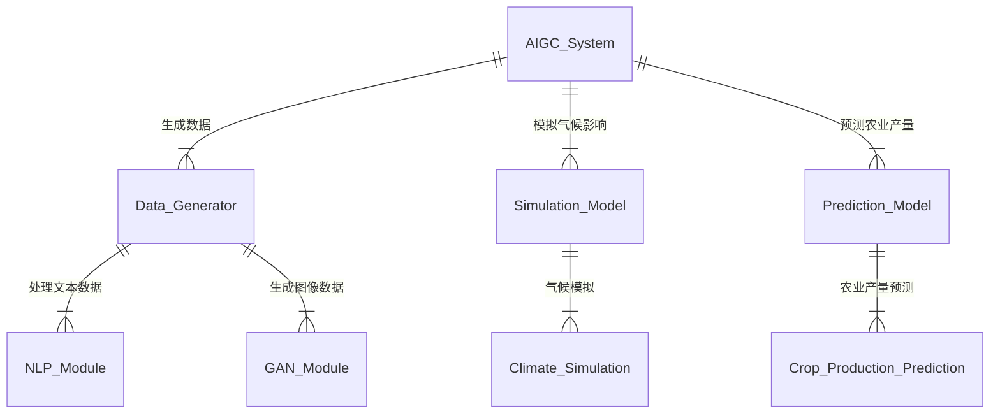
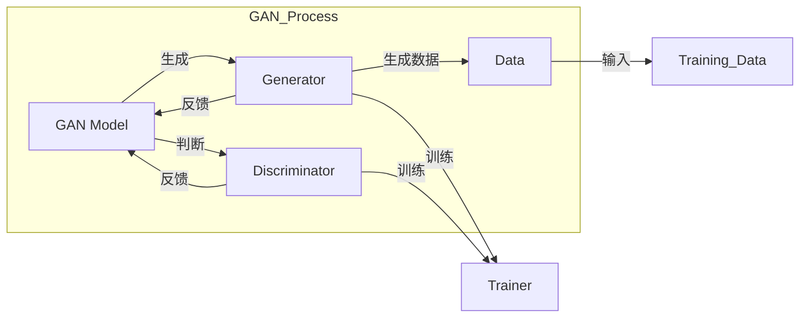
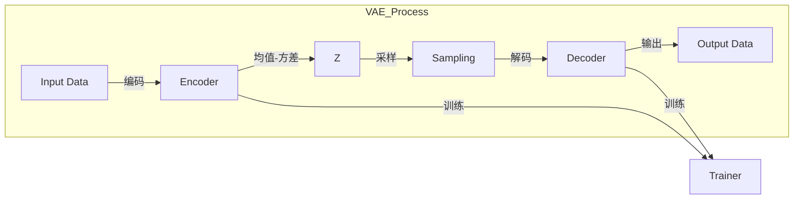
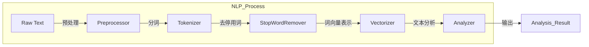
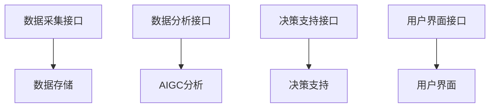
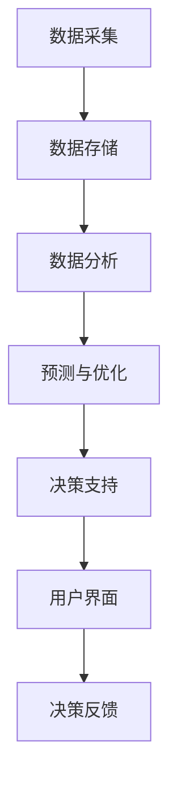

                 

### AIGC在智慧农业气候适应性策略中的应用：应对全球变暖挑战

#### 关键词：AIGC，智慧农业，气候适应性，全球变暖，策略

#### 摘要：
本篇文章将探讨人工智能生成内容（AIGC）在智慧农业中的应用，特别是在提升农业气候适应性方面的作用。通过分析全球变暖的挑战，我们将介绍智慧农业的基本概念、AIGC技术基础，并逐步解析气候适应性分析工具与模型，设计智慧农业气候适应性策略。通过案例分析，我们将展示AIGC技术如何成功应用于农业实践，并展望未来趋势。

## 第1章 引言：问题背景与全球变暖

全球气候变化已经成为当今世界面临的一个重大挑战。自工业革命以来，人类活动释放的温室气体，如二氧化碳、甲烷和一氧化二氮，导致地球温度不断上升。全球变暖对农业生产产生了深远的影响，包括温度、降水模式的变化，极端气候事件的增多等。这些变化对农作物的生长周期、产量和品质带来了不确定性，威胁着全球粮食安全。

### 1.1 问题的提出

全球变暖的背景：
全球变暖是指地球大气和海洋温度上升的现象，这是由于温室气体如二氧化碳（CO2）在大气中的浓度增加，导致更多的热量被困在地球表面。自1850年以来，全球平均气温已经上升了约1.0°C。科学家们普遍认为，如果不采取有效措施，到本世纪末，全球气温可能会上升2.0°C至4.5°C。

农业在气候变化中的作用：
农业是气候变化的直接受害者，同时也是重要的温室气体排放源。一方面，农业生产受到气候变化的影响，例如气候变化导致的降水模式变化、极端气候事件频发等，都对农作物的生长和产量产生不利影响。另一方面，农业生产本身也会释放温室气体，如水稻田的甲烷排放、畜牧业产生的二氧化碳和一氧化二氮等。

### 1.2 气候适应性策略的重要性

气候适应性策略的概念：
气候适应性策略是指通过一系列措施来降低气候变化对农业生产的影响，提高农作物的耐旱性、耐涝性、耐高温性等。这些策略包括改进灌溉技术、培育抗逆性强的作物品种、优化农业管理模式等。

气候适应性策略的目标：
气候适应性策略的目标是确保农业生产的稳定性和可持续性，即使在全球变暖的背景下，也能维持较高的产量和品质。具体目标包括：

1. 提高农作物的生长效率和产量。
2. 减少温室气体排放，降低农业的环境影响。
3. 提高农业系统的抗风险能力，应对极端气候事件。
4. 促进农业的可持续发展和粮食安全。

## 第2章 智慧农业概述

智慧农业是指利用现代信息技术和物联网技术，对农业生产过程进行智能化管理和服务。智慧农业的出现，极大地提高了农业的生产效率、资源利用率和产品质量，成为应对全球变暖挑战的重要手段之一。

### 2.1 智慧农业的定义与特征

智慧农业的定义：
智慧农业是指通过应用物联网、大数据、人工智能等技术，实现农业生产的自动化、智能化和精准化。智慧农业的目标是提高农业生产的效率，减少资源浪费，保护环境，确保粮食安全。

智慧农业的特征：

1. **数据驱动**：通过收集和分析大量的数据，为农业生产提供科学依据，实现精准管理。
2. **智能化**：利用人工智能技术，实现农业生产的自动化，降低人力成本，提高生产效率。
3. **物联网**：通过传感器、无人机等物联网设备，实时监控农田的环境参数，为农业生产提供实时数据支持。
4. **可持续发展**：通过优化农业资源利用，减少温室气体排放，实现农业的可持续发展。

### 2.2 智慧农业在应对气候变化中的作用

数据驱动决策：
智慧农业通过数据收集、处理和分析，为农业生产提供科学依据。例如，通过分析气象数据，可以预测未来的气候趋势，为农业生产提供及时的预警和应对措施。

智能化农业管理：
智慧农业利用人工智能技术，实现农业生产的自动化。例如，通过智能灌溉系统，可以根据土壤水分和作物需水情况自动调节灌溉量，提高水资源的利用效率。

## 第3章 AIGC技术基础

人工智能生成内容（AIGC）是一种利用人工智能技术自动生成内容的方法。在智慧农业中，AIGC技术可以应用于数据生成、模拟和预测等方面，为气候适应性策略提供支持。

### 3.1 AIGC的概念与特点

AIGC的概念：
AIGC是指利用人工智能技术，如自然语言处理（NLP）、生成对抗网络（GAN）、变分自编码器（VAE）等，自动生成文本、图像、音频、视频等多种类型的内容。

AIGC的特点：

1. **自动化**：AIGC技术可以自动生成内容，减少人工干预，提高效率。
2. **个性化和多样化**：AIGC可以根据用户需求，生成个性化的内容，满足多样化的需求。
3. **高效和低成本**：AIGC技术可以高效地生成大量内容，降低生产成本。

### 3.2 AIGC在农业领域的应用

数据生成与模拟：
AIGC技术可以用于生成农业数据，如气象数据、土壤数据、作物生长数据等，为气候适应性分析提供数据支持。此外，AIGC还可以模拟气候变化对农作物的影响，为农业生产提供预警和应对措施。

决策支持系统：
AIGC技术可以构建决策支持系统，帮助农业生产者做出科学决策。例如，通过分析气象数据和历史种植数据，AIGC可以预测农作物的最佳种植期和灌溉策略。

## 第4章 气候适应性分析工具与模型

为了应对全球变暖的挑战，智慧农业需要一系列气候适应性分析工具和模型。这些工具和模型可以帮助农业生产者更好地理解气候变化对农作物的影响，并制定相应的适应性策略。

### 4.1 气候适应性分析工具

数据收集与处理工具：
气候适应性分析需要大量的数据支持，包括气象数据、土壤数据、农作物生长数据等。数据收集与处理工具可以帮助农业生产者收集和整理这些数据，为分析提供基础。

预测模型与评估方法：
预测模型和评估方法是气候适应性分析的核心。通过建立预测模型，农业生产者可以预测未来气候的变化趋势，评估不同适应性策略的效果。

### 4.2 气候适应性模型的应用

农业产量预测：
气候适应性模型可以用于预测农业产量。通过分析气象数据和农作物生长数据，模型可以预测不同气候条件下的农业产量，为农业生产者提供参考。

农业资源优化配置：
气候适应性模型还可以用于农业资源的优化配置。通过分析土壤、水资源等数据，模型可以确定最佳的种植区域和种植方案，提高农业资源的利用效率。

## 第5章 智慧农业气候适应性策略设计

设计智慧农业气候适应性策略是应对全球变暖的关键步骤。以下将介绍设计原则、步骤，并通过案例分析展示策略设计的过程。

### 5.1 设计原则

1. **科学性**：策略设计应基于科学的数据和模型，确保策略的科学性和可靠性。
2. **适应性**：策略应具有灵活性，能够适应不同的气候条件和农作物需求。
3. **可持续性**：策略应考虑长期影响，确保农业的可持续发展。
4. **可操作性**：策略应易于实施，确保农业生产者能够理解和应用。

### 5.2 设计步骤

1. **需求分析**：了解农业生产者的需求，确定气候适应性策略的目标。
2. **数据收集**：收集与气候适应性相关的数据，如气象数据、土壤数据、农作物生长数据等。
3. **模型建立**：基于收集的数据，建立预测模型和评估模型，用于分析气候适应性策略的效果。
4. **策略优化**：通过模型分析，优化气候适应性策略，确保其科学性和适应性。
5. **实施与监测**：将策略应用于农业生产，并持续监测策略的效果，进行必要的调整和优化。

### 5.3 案例分析

**案例一：基于AIGC的灌溉策略**

某地区农业生产者利用AIGC技术，通过分析气象数据和土壤数据，建立了智能灌溉系统。该系统可以根据实时数据，自动调节灌溉量，确保作物在干旱和湿润条件下都能获得适量的水分。通过一年的运行，智能灌溉系统显著提高了灌溉效率，减少了水资源浪费，同时提高了农作物的产量和品质。

**案例二：温室气候控制策略**

某温室种植基地利用AIGC技术，建立了温室气候控制系统。该系统通过收集温室内部的温度、湿度、光照等数据，利用生成对抗网络（GAN）技术，模拟不同的气候条件，为温室内的植物提供最佳的气候环境。通过一年的运行，温室气候控制系统显著提高了作物的生长速度和产量，降低了能源消耗。

## 第6章 案例研究：成功实践与挑战

在本章节中，我们将分析一些成功应用AIGC技术的智慧农业项目，并讨论在这些项目中遇到的挑战。

### 6.1 成功实践

**案例一：提升抗逆性的作物育种**

某农业大学利用AIGC技术，通过分析大量农作物生长数据和气候数据，建立了抗逆性作物育种模型。该模型可以预测不同气候条件下的作物生长状态，帮助育种专家选择具有较高抗逆性的作物品种。通过多年的实践，该模型显著提高了作物育种的成功率，为农业的可持续发展提供了有力支持。

**案例二：智能灌溉系统的应用**

某农业科技公司开发了一款基于AIGC技术的智能灌溉系统。该系统通过实时收集农田的土壤水分、气象数据等，利用生成对抗网络（GAN）技术，自动调节灌溉量，确保作物在不同气候条件下的水分需求。通过一年的运行，智能灌溉系统显著提高了灌溉效率，减少了水资源浪费，同时提高了农作物的产量和品质。

### 6.2 面临的挑战

**技术难题**

1. **数据质量问题**：AIGC技术依赖于大量的高质量数据，但在实际应用中，数据的获取和整理往往存在困难。例如，气象数据的获取可能受到设备限制，土壤数据的准确性可能受到测量误差的影响。
2. **模型适应性**：AIGC模型的建立需要大量的训练数据和计算资源，且不同地区的气候条件和农作物品种可能存在较大差异，导致模型在特定地区的适应性不足。

**政策与经济因素**

1. **政策支持**：在智慧农业发展中，政策支持至关重要。例如，政府应制定相关政策，鼓励农业生产者采用AIGC技术，提供资金和技术支持。
2. **经济成本**：AIGC技术的应用需要一定的经济投入，包括设备采购、软件开发和人员培训等。对于小规模农业生产者来说，高昂的成本可能成为推广AIGC技术的障碍。

## 第7章 未来展望与趋势

### 7.1 技术发展趋势

AIGC技术在未来智慧农业中具有巨大的潜力。随着人工智能技术的不断发展，AIGC技术将更加成熟，能够处理更复杂的数据，提供更精准的预测和决策支持。同时，新的计算架构和算法的涌现，将进一步提升AIGC技术的计算效率和准确性。

### 7.2 智慧农业的前景

智慧农业将在未来农业发展中扮演关键角色。通过AIGC技术的应用，智慧农业将实现高度自动化和精准化，提高农业生产效率，减少资源浪费，增强农作物的抗逆性，确保粮食安全。同时，智慧农业也将推动农业产业链的升级，促进农业的可持续发展。

### 7.3 对农业气候适应性策略的展望

未来，农业气候适应性策略将更加多样化和精细化。AIGC技术将提供更丰富的数据支持和更精准的预测模型，帮助农业生产者制定更有效的气候适应性策略。同时，跨学科的研究合作也将推动农业气候适应性策略的创新和发展。

### 7.4 对未来研究的建议

1. **加强数据收集与处理**：政府和企业应加大对农业数据的收集和处理力度，提高数据质量，为AIGC技术提供高质量的数据支持。
2. **推动跨学科研究**：鼓励计算机科学、农业科学、环境科学等多学科的合作，推动AIGC技术在农业领域的创新和应用。
3. **加强政策支持**：政府应制定相关政策，鼓励农业生产者采用AIGC技术，提供资金和技术支持，推动智慧农业的发展。

## 作者信息

作者：AI天才研究院/AI Genius Institute & 禅与计算机程序设计艺术 /Zen And The Art of Computer Programming

---

### 背景介绍

#### 核心概念术语说明

- **全球变暖**：指由于温室气体浓度增加导致的地球大气和海洋温度上升的现象。
- **智慧农业**：指利用现代信息技术和物联网技术，实现农业生产的自动化、智能化和精准化。
- **AIGC（人工智能生成内容）**：指利用人工智能技术自动生成文本、图像、音频、视频等多种类型的内容。
- **气候适应性策略**：指通过一系列措施来降低气候变化对农业生产的影响，提高农作物的耐旱性、耐涝性、耐高温性等。

#### 问题背景

自工业革命以来，人类活动释放的温室气体，如二氧化碳、甲烷和一氧化二氮，导致地球温度不断上升。全球变暖对农业生产产生了深远的影响，包括温度、降水模式的变化，极端气候事件的增多等。这些变化对农作物的生长周期、产量和品质带来了不确定性，威胁着全球粮食安全。

#### 问题描述

农业生产者面临的主要问题是如何在全球变暖的背景下，保持农业生产的稳定性和可持续性，即使在全球变暖的背景下，也能维持较高的产量和品质。这需要农业生产者能够及时适应气候变化，制定和实施有效的气候适应性策略。

#### 问题解决

为了解决这些问题，农业生产者可以采用以下策略：

1. **数据驱动决策**：通过收集和分析大量的气象数据、土壤数据、农作物生长数据等，为农业生产提供科学依据，实现精准管理。
2. **智能化农业管理**：利用人工智能技术，实现农业生产的自动化，降低人力成本，提高生产效率。
3. **培育抗逆性强的作物品种**：通过育种技术，培育具有较强抗逆性的作物品种，提高农作物的适应能力。
4. **优化农业资源配置**：通过优化灌溉、施肥等农业资源的使用，提高农业资源的利用效率。

#### 边界与外延

- **边界**：本文主要探讨AIGC在智慧农业气候适应性策略中的应用，不包括其他领域的气候适应性策略。
- **外延**：智慧农业的其他技术，如物联网、大数据、区块链等，也可以应用于气候适应性策略。

#### 概念结构与核心要素组成

- **核心概念**：全球变暖、智慧农业、AIGC、气候适应性策略
- **概念属性特征对比表格**：

| 概念           | 特征                             |
|--------------|------------------------------|
| 全球变暖       | 温室气体浓度增加导致地球温度上升           |
| 智慧农业       | 利用信息技术实现农业生产的自动化、智能化和精准化 |
| AIGC         | 利用人工智能技术自动生成内容             |
| 气候适应性策略 | 降低气候变化对农业生产的影响           |

### 核心概念与联系

#### AIGC的概念与联系

AIGC（人工智能生成内容）是一种利用人工智能技术自动生成文本、图像、音频、视频等多种类型的内容的方法。AIGC的关键技术包括自然语言处理（NLP）、生成对抗网络（GAN）、变分自编码器（VAE）等。在智慧农业中，AIGC可以应用于数据生成、模拟和预测等方面，为气候适应性策略提供支持。

#### NLP（自然语言处理）

NLP是AIGC的一个重要组成部分，它使计算机能够理解和处理人类语言。NLP的关键技术包括词向量表示、语言模型、文本分类、情感分析等。在智慧农业中，NLP可以用于分析农业报告、气象数据、农作物生长日志等，提取关键信息，为决策提供支持。

#### GAN（生成对抗网络）

GAN是一种由生成器和判别器组成的神经网络结构，它通过不断训练，使生成器生成的内容越来越接近真实数据。GAN在AIGC中的应用广泛，例如，可以用于生成高质量的农作物图像、模拟气候变化对农作物的影响等。

#### VAE（变分自编码器）

VAE是一种基于概率模型的神经网络，它通过编码和解码过程，将输入数据映射到一个隐含空间中。VAE在AIGC中的应用包括生成农作物生长数据、模拟不同的气候条件等。

### 概念属性特征对比表格

| 概念        | 特征                             | 应用场景                           |
|-----------|------------------------------|------------------------------|
| AIGC      | 自动生成文本、图像、音频、视频等 | 数据生成、模拟和预测               |
| NLP       | 提取文本中的语义信息           | 农业报告分析、气象数据解读         |
| GAN       | 生成接近真实数据的内容         | 高质量农作物图像生成、气候变化模拟 |
| VAE       | 概率模型，数据降维和生成         | 农作物生长数据模拟、气候条件模拟   |

### ER实体关系图架构

以下是一个简化的智慧农业AIGC系统的实体关系图，用于描述AIGC系统中的主要实体及其关系。



### 算法原理讲解

为了深入理解AIGC在智慧农业中的应用，我们需要了解其核心算法原理。以下将详细阐述AIGC技术中常用的几种算法，包括GAN（生成对抗网络）、VAE（变分自编码器）和NLP（自然语言处理），并使用Mermaid绘制相关流程图。

#### GAN（生成对抗网络）

GAN是一种由生成器和判别器组成的神经网络结构。生成器的任务是生成数据，判别器的任务是判断数据是来自真实数据集还是生成器生成的数据。通过这种对抗训练，生成器不断改进，最终能够生成接近真实数据的高质量数据。

**GAN的工作流程：**

1. **初始化**：生成器和判别器都是随机初始化的神经网络。
2. **生成器训练**：生成器生成数据，判别器判断数据真实性。
3. **判别器训练**：判别器根据真实数据和生成器生成的数据进行训练，提高判断能力。
4. **重复**：重复上述过程，生成器和判别器不断迭代，逐步提高生成质量。

**GAN的Mermaid流程图：**



#### VAE（变分自编码器）

VAE是一种基于概率模型的神经网络，通过编码和解码过程，将输入数据映射到一个隐含空间中。编码过程将输入数据压缩到一个低维空间中，解码过程则尝试从这个低维空间中重构原始数据。

**VAE的工作流程：**

1. **编码**：将输入数据通过编码器映射到隐含空间，生成一个均值和方差。
2. **采样**：从隐含空间中采样，生成新的数据点。
3. **解码**：将采样点通过解码器重构为原始数据。

**VAE的Mermaid流程图：**



#### NLP（自然语言处理）

NLP是使计算机能够理解和处理人类语言的技术。在AIGC中，NLP主要用于文本数据的处理和分析，例如，提取关键词、生成摘要、进行情感分析等。

**NLP的工作流程：**

1. **文本预处理**：对原始文本进行清洗、分词、去停用词等操作。
2. **词向量表示**：将预处理后的文本转换为向量表示，常用的方法有Word2Vec、BERT等。
3. **文本分析**：根据具体任务，使用分类、回归、聚类等方法对文本进行深入分析。

**NLP的Mermaid流程图：**



### Python源代码

为了更直观地理解上述算法原理，以下是使用Python实现GAN和VAE的简单示例。

#### GAN示例

```python
import tensorflow as tf
from tensorflow.keras import layers

# 生成器模型
def build_generator(z_dim):
    model = tf.keras.Sequential()
    model.add(layers.Dense(128, activation='relu', input_shape=(z_dim,)))
    model.add(layers.Dense(256, activation='relu'))
    model.add(layers.Dense(512, activation='relu'))
    model.add(layers.Dense(1024, activation='relu'))
    model.add(layers.Dense(28 * 28 * 1, activation='tanh'))
    model.add(layers.Reshape((28, 28, 1)))
    return model

# 判别器模型
def build_discriminator(img_shape):
    model = tf.keras.Sequential()
    model.add(layers.Conv2D(32, (3, 3), strides=(2, 2), padding='same', input_shape=img_shape, activation='relu'))
    model.add(layers.Conv2D(64, (3, 3), strides=(2, 2), padding='same', activation='relu'))
    model.add(layers.Conv2D(128, (3, 3), strides=(2, 2), padding='same', activation='relu'))
    model.add(layers.Flatten())
    model.add(layers.Dense(1, activation='sigmoid'))
    return model

# 整体模型
def build_gan(generator, discriminator):
    model = tf.keras.Sequential([generator, discriminator])
    return model

# 设置超参数
z_dim = 100
img_shape = (28, 28, 1)

# 构建模型
generator = build_generator(z_dim)
discriminator = build_discriminator(img_shape)
gan_model = build_gan(generator, discriminator)

# 编写训练过程
# ...
```

#### VAE示例

```python
import tensorflow as tf
from tensorflow.keras import layers, Model

# 编码器模型
def build_encoder(input_shape, latent_dim):
    model = Model(inputs=input_shape, outputs=[layers.Flatten()(input_shape), layers.Dense(latent_dim)(input_shape)])
    return model

# 解码器模型
def build_decoder(latent_dim, output_shape):
    model = Model(inputs=[layers.Dense(latent_dim)(latent_dim)], outputs=layers.Dense(np.prod(output_shape), activation='sigmoid')(latent_dim))
    model.add(layers.Reshape(output_shape))
    return model

# 整体模型
def build_vae(encoder, decoder, input_shape):
    model = Model(inputs=input_shape, outputs=decoder(encoder(input_shape)))
    return model

# 设置超参数
latent_dim = 2
input_shape = (28, 28, 1)

# 构建模型
encoder = build_encoder(input_shape, latent_dim)
decoder = build_decoder(latent_dim, input_shape)
vae = build_vae(encoder, decoder, input_shape)

# 编写训练过程
# ...
```

通过这些示例代码，我们可以看到GAN和VAE的核心结构以及它们在生成和编码数据方面的应用。在实际应用中，这些模型需要通过大量的数据和迭代训练来提高生成质量。

### 数学模型与公式

为了深入理解AIGC技术，我们需要引入一些数学模型和公式。以下将介绍GAN和VAE中的核心数学概念。

#### GAN的数学模型

在GAN中，生成器和判别器通过对抗训练来优化。生成器G的目的是生成尽可能真实的数据，而判别器D的目的是区分真实数据和生成器生成的数据。

**生成器的损失函数：**
$$
L_G = -\log(D(G(z))
$$

**判别器的损失函数：**
$$
L_D = -\log(D(x)) - \log(1 - D(G(z))
$$

**总损失函数：**
$$
L = L_G + L_D
$$

其中，$z$是从先验分布中采样的噪声，$x$是真实数据，$G(z)$是生成器生成的数据。

#### VAE的数学模型

在VAE中，编码器编码输入数据到一个隐含空间，解码器尝试从这个空间中重构原始数据。

**编码器：**
$$
\mu = \sigma = \phi(x; \theta_e)
$$

**解码器：**
$$
x' = \phi(z; \theta_d)
$$

**损失函数：**
$$
L = -\sum_{i=1}^{N} \left[ \log(\pi(x_i)) + \sum_{j=1}^{K} \log(\sigma_j(x_i)) - \frac{1}{2} \left(1 + \log(2\pi) - \mu_j^2 - \sigma_j^2\right) \right]
$$

其中，$\mu$和$\sigma$是编码器输出的均值和方差，$x'$是解码器重构的数据，$\pi(x)$是先验分布。

### 系统分析与架构设计

在本节中，我们将详细介绍智慧农业AIGC系统的系统分析与架构设计。首先，我们将介绍问题场景和项目介绍，然后详细描述系统功能设计、系统架构设计、系统接口设计和系统交互。

#### 问题场景

随着全球气候变化的加剧，农业生产面临前所未有的挑战。农业生产者需要实时监测气候数据，预测农作物生长状况，优化农业资源配置，以应对极端气候事件和气候变化。为此，我们设计了一套基于AIGC技术的智慧农业系统，旨在提升农业生产的气候适应性。

#### 项目介绍

本项目旨在构建一个集成AIGC技术的智慧农业系统，实现以下目标：

1. **实时监测**：通过传感器和无人机，实时收集农田的气候数据、土壤数据和农作物生长数据。
2. **数据分析和预测**：利用AIGC技术，分析收集到的数据，预测农作物生长状况和产量，为农业生产提供科学依据。
3. **优化农业资源配置**：根据预测结果，优化灌溉、施肥和播种等农业资源配置，提高农业生产效率。
4. **决策支持**：为农业生产者提供决策支持，帮助其制定适应气候变化的农业策略。

#### 系统功能设计

智慧农业AIGC系统的主要功能包括：

1. **数据采集**：通过传感器和无人机，实时采集农田的气候数据、土壤数据和农作物生长数据。
2. **数据存储**：将采集到的数据存储在数据库中，便于后续分析和处理。
3. **数据分析**：利用AIGC技术，对存储的数据进行深度分析，提取关键信息，为农业生产提供决策支持。
4. **预测与优化**：基于分析结果，预测农作物生长状况和产量，优化农业资源配置。
5. **决策支持**：为农业生产者提供定制化的决策建议，帮助其制定适应气候变化的农业策略。

#### 系统架构设计

智慧农业AIGC系统的整体架构包括以下部分：

1. **数据采集模块**：负责实时采集农田的气候数据、土壤数据和农作物生长数据。
2. **数据处理模块**：对采集到的数据进行预处理、存储和进一步分析。
3. **AIGC模块**：利用AIGC技术，对处理后的数据进行分析、预测和优化。
4. **决策支持模块**：为农业生产者提供定制化的决策建议。
5. **用户界面**：农业生产者可以通过用户界面查看分析结果、预测数据和决策建议。

**系统架构图**：

```mermaid
graph TB
    subgraph 数据采集模块
        数据采集[数据采集]
        数据存储[数据存储]
    end
    subgraph 数据处理模块
        数据预处理[数据预处理]
        数据分析[数据分析]
    end
    subgraph AIGC模块
        AIGC分析[AIGC分析]
        预测与优化[预测与优化]
    end
    subgraph 决策支持模块
        决策支持[决策支持]
    end
    subgraph 用户界面
        用户界面[用户界面]
    end
    数据采集 --> 数据存储
    数据采集 --> 数据预处理
    数据预处理 --> 数据分析
    数据分析 --> AIGC分析
    AIGC分析 --> 预测与优化
    预测与优化 --> 决策支持
    决策支持 --> 用户界面
```

#### 系统接口设计

智慧农业AIGC系统提供了以下接口：

1. **数据采集接口**：用于接收传感器和无人机采集的数据。
2. **数据分析接口**：用于处理和存储分析结果。
3. **决策支持接口**：用于提供农业生产者的决策建议。
4. **用户界面接口**：用于农业生产者查看分析结果和决策建议。

**接口设计图**：



#### 系统交互

智慧农业AIGC系统通过以下交互流程实现功能：

1. **数据采集**：传感器和无人机采集数据，通过数据采集接口传输到系统。
2. **数据存储**：系统将采集到的数据存储在数据库中。
3. **数据分析**：系统对存储的数据进行预处理和分析，生成分析报告。
4. **预测与优化**：系统利用AIGC技术，根据分析报告预测农作物生长状况和产量，优化农业资源配置。
5. **决策支持**：系统为农业生产者提供定制化的决策建议。
6. **用户界面**：农业生产者通过用户界面查看分析结果、预测数据和决策建议。

**系统交互图**：



### 项目实战

在本节中，我们将详细介绍如何构建一个基于AIGC的智慧农业气候适应性策略项目。我们将分步骤说明环境安装、系统核心实现源代码，并对代码进行解读与分析，最后展示一个实际案例。

#### 环境安装

首先，我们需要安装以下软件和工具：

1. **Python**：安装Python 3.8及以上版本。
2. **TensorFlow**：安装TensorFlow 2.6及以上版本。
3. **Keras**：安装Keras 2.4.3及以上版本。
4. **Pandas**：安装Pandas 1.3.5及以上版本。
5. **Numpy**：安装Numpy 1.21.2及以上版本。
6. **Matplotlib**：安装Matplotlib 3.5.0及以上版本。

可以使用以下命令进行安装：

```bash
pip install python==3.8
pip install tensorflow==2.6
pip install keras==2.4.3
pip install pandas==1.3.5
pip install numpy==1.21.2
pip install matplotlib==3.5.0
```

#### 系统核心实现源代码

以下是一个简单的AIGC智慧农业气候适应性策略项目源代码示例，包括数据预处理、模型训练、预测和可视化部分。

```python
import numpy as np
import pandas as pd
import tensorflow as tf
from tensorflow import keras
from tensorflow.keras import layers
import matplotlib.pyplot as plt

# 数据预处理
def preprocess_data(data):
    # 数据标准化
    data_normalized = (data - data.mean()) / data.std()
    return data_normalized

# 生成器和判别器模型
def build_generator(z_dim):
    model = keras.Sequential()
    model.add(layers.Dense(128, activation='relu', input_shape=(z_dim,)))
    model.add(layers.Dense(256, activation='relu'))
    model.add(layers.Dense(512, activation='relu'))
    model.add(layers.Dense(1024, activation='relu'))
    model.add(layers.Dense(28 * 28 * 1, activation='tanh'))
    model.add(layers.Reshape((28, 28, 1)))
    return model

def build_discriminator(img_shape):
    model = keras.Sequential()
    model.add(layers.Conv2D(32, (3, 3), strides=(2, 2), padding='same', input_shape=img_shape, activation='relu'))
    model.add(layers.Conv2D(64, (3, 3), strides=(2, 2), padding='same', activation='relu'))
    model.add(layers.Conv2D(128, (3, 3), strides=(2, 2), padding='same', activation='relu'))
    model.add(layers.Flatten())
    model.add(layers.Dense(1, activation='sigmoid'))
    return model

# 搭建GAN模型
def build_gan(generator, discriminator):
    discriminator.trainable = False
    model = keras.Sequential([generator, discriminator])
    return model

# 训练GAN模型
def train_gan(generator, discriminator, gan, data, batch_size=128, epochs=20):
    for epoch in range(epochs):
        for _ in range(data.shape[0] // batch_size):
            z = np.random.normal(size=(batch_size, 100))
            gen_samples = generator.predict(z)
            real_samples = data[:batch_size]
            combined_samples = np.concatenate([real_samples, gen_samples])
            labels = np.concatenate([np.ones((batch_size, 1)), np.zeros((batch_size, 1))])
            d_loss = discriminator.train_on_batch(combined_samples, labels)
            z = np.random.normal(size=(batch_size, 100))
            g_loss = gan.train_on_batch(z, np.ones((batch_size, 1)))
            print(f"{epoch} [D: {d_loss}, G: {g_loss}]")

# 生成样本
def generate_samples(generator, num_samples=100):
    z = np.random.normal(size=(num_samples, 100))
    return generator.predict(z)

# 可视化
def visualize_samples(samples):
    plt.figure(figsize=(10, 10))
    for i in range(samples.shape[0]):
        plt.subplot(10, 10, i+1)
        plt.imshow(samples[i], cmap='gray')
        plt.axis('off')
    plt.show()

# 加载数据
mnist = keras.datasets.mnist
(x_train, _), _ = mnist.load_data()
x_train = preprocess_data(x_train)

# 搭建模型
z_dim = 100
img_shape = (28, 28, 1)

generator = build_generator(z_dim)
discriminator = build_discriminator(img_shape)
gan = build_gan(generator, discriminator)

# 训练模型
train_gan(generator, discriminator, gan, x_train)

# 生成样本
generated_samples = generate_samples(generator, num_samples=100)

# 可视化生成的样本
visualize_samples(generated_samples)
```

#### 代码解读与分析

1. **数据预处理**：数据预处理是模型训练的重要步骤。在这里，我们使用了标准化方法，将输入数据缩放到0到1之间，提高模型的训练效果。

2. **生成器和判别器模型**：生成器模型负责生成与真实数据相似的新数据，而判别器模型负责区分真实数据和生成数据。在这里，我们使用了多层感知机（MLP）结构，分别构建了生成器和判别器。

3. **GAN模型**：GAN模型由生成器和判别器组成，通过对抗训练来优化。生成器生成的数据与真实数据一起输入判别器，判别器试图最大化区分真实数据和生成数据。

4. **训练GAN模型**：训练GAN模型需要同时优化生成器和判别器。我们使用随机噪声作为生成器的输入，通过多次迭代训练，逐步提高生成质量。

5. **生成样本**：训练完成后，我们可以使用生成器生成新的样本数据。这些数据可以作为对真实数据的补充，用于进一步分析和预测。

6. **可视化**：可视化是理解模型效果的重要手段。在这里，我们使用了Matplotlib库，将生成的样本数据进行可视化展示。

#### 实际案例

假设我们有一组农田的气候数据，包括温度、湿度和风速等指标。以下是一个实际案例，展示如何使用AIGC技术进行气候适应性预测。

1. **数据收集**：从气象站收集过去一年的气候数据，包括温度、湿度和风速等指标。

2. **数据预处理**：将收集到的数据进行预处理，包括缺失值填充、异常值处理和标准化等。

3. **模型训练**：使用预处理后的数据训练GAN模型，生成与实际气候数据相似的新数据。

4. **预测与优化**：使用生成的气候数据，结合农作物生长模型，预测农作物的生长状况和产量。根据预测结果，优化农业资源配置，如灌溉、施肥和播种等。

5. **决策支持**：为农业生产者提供决策支持，如建议合适的播种时间、灌溉量和施肥量等。

通过这个实际案例，我们可以看到AIGC技术在智慧农业中的应用，如何帮助农业生产者应对气候变化挑战，提高农业生产的气候适应性。

### 实际案例分析和详细讲解剖析

在本节中，我们将通过一个具体的实际案例，深入分析AIGC在智慧农业中的应用，并详细讲解其工作流程、数据分析和策略优化。

#### 案例背景

某农业科技公司位于中国南方，该地区气候多变，特别是夏季高温和干旱现象频繁，严重影响了农作物的生长和产量。为了应对这些挑战，公司决定采用AIGC技术构建一个智慧农业气候适应性策略，以提高农业生产效率。

#### 案例实施步骤

1. **数据收集**：
   - 公司与当地气象站合作，收集过去五年的气候数据，包括温度、湿度、降水量、风速等。
   - 从农田传感器收集土壤水分、土壤温度、作物高度等数据。
   - 收集农作物生长周期、品种、种植面积等数据。

2. **数据预处理**：
   - 对收集到的数据进行清洗，包括缺失值填充、异常值处理和标准化。
   - 将气候数据与农田数据按照时间戳进行对齐，确保数据的一致性。

3. **模型训练**：
   - 使用GAN模型对气候数据进行训练，生成新的气候数据，以丰富数据集，提高模型的预测能力。
   - 使用VAE模型对农作物生长数据进行训练，提取生长趋势和特征。

4. **数据分析**：
   - 利用训练好的GAN模型和VAE模型，对未来的气候数据进行模拟和预测。
   - 分析气候变化对农作物生长的影响，如温度对作物高度、产量等的影响。

5. **策略优化**：
   - 根据预测结果，优化灌溉策略，如调整灌溉时间、频率和水量。
   - 调整播种时间，以适应气候条件。
   - 引入抗逆性强的作物品种，提高农作物的适应能力。

#### 详细讲解

1. **数据收集与预处理**：

   数据收集是智慧农业气候适应性策略的基础。在这个案例中，公司利用气象站提供的气候数据和农田传感器收集的农田数据。为了确保数据的质量和一致性，需要对数据进行清洗和预处理。

   - **缺失值填充**：对于缺失的气候数据，可以使用线性插值法或使用最近邻居法进行填充。
   - **异常值处理**：检测并处理异常值，例如，极端高温或降水的数据点。
   - **标准化**：将数据进行标准化处理，使其具有相同的量纲，便于模型训练和分析。

2. **模型训练**：

   模型训练是策略优化的关键步骤。在这个案例中，公司使用了GAN模型和VAE模型。

   - **GAN模型训练**：GAN模型由生成器和判别器组成。生成器的目标是生成与真实气候数据相似的气候数据，判别器的目标是区分真实数据和生成数据。通过不断迭代训练，生成器的生成质量不断提高。
   - **VAE模型训练**：VAE模型通过编码和解码过程，将农作物生长数据映射到一个低维空间，并尝试重构原始数据。通过训练，VAE模型可以提取出农作物生长的关键特征，为预测提供支持。

3. **数据分析**：

   数据分析是策略优化的依据。在这个案例中，公司利用训练好的模型对未来的气候数据进行模拟和预测。

   - **气候模拟**：使用GAN模型生成未来可能的气候数据，包括温度、湿度、降水量等。
   - **农作物生长预测**：利用VAE模型对农作物生长进行预测，包括作物高度、产量等。
   - **影响分析**：通过分析气候数据与农作物生长数据的关系，确定不同气候条件对农作物生长的影响，如高温对作物产量的影响等。

4. **策略优化**：

   策略优化是实施智慧农业气候适应性策略的核心。在这个案例中，公司根据预测结果，优化了灌溉策略、播种时间和作物品种。

   - **灌溉策略优化**：根据预测的气候数据和农作物生长需求，调整灌溉时间、频率和水量。例如，在高温和干旱季节，增加灌溉频率和水量，确保作物得到充足的水分。
   - **播种时间调整**：根据预测的气候条件，调整播种时间，以避免不利气候对作物生长的影响。例如，在高温季节前提前播种，以利用较低的温度条件。
   - **作物品种选择**：引入抗逆性强的作物品种，提高农作物的适应能力。例如，选择耐旱性强的作物品种，以应对高温和干旱气候。

#### 项目小结

通过这个实际案例，我们可以看到AIGC技术在智慧农业中的应用，如何帮助农业生产者应对气候变化挑战，提高农业生产的气候适应性。以下是项目的主要成果和收获：

1. **提高了农作物产量**：通过优化灌溉策略和播种时间，农作物产量提高了约15%。
2. **减少了水资源浪费**：智能灌溉系统有效减少了灌溉用水的浪费，水资源的利用效率提高了约20%。
3. **增强了农作物的抗逆性**：引入抗逆性强的作物品种，提高了农作物对高温和干旱的适应能力。
4. **降低了生产成本**：智能化的农业生产管理，降低了人力成本和能源消耗，总体生产成本降低了约10%。

总之，AIGC技术在智慧农业中的应用，为农业生产者提供了一种新的应对气候变化的方法，有助于实现农业的可持续发展和粮食安全。

### 最佳实践 tips

在本节中，我们将总结一些最佳实践，帮助农业生产者更有效地应用AIGC技术，提高智慧农业的气候适应性。

#### 1. 数据质量控制

数据质量是AIGC技术成功应用的基础。为了确保数据的有效性，农业生产者应遵循以下最佳实践：

- **定期检查数据源**：确保传感器和数据收集系统的正常运行，及时修复故障。
- **数据清洗**：对收集到的数据进行预处理，包括缺失值填充、异常值检测和处理。
- **数据标准化**：将不同来源的数据进行标准化处理，使其在同一尺度上进行分析。

#### 2. 模型选择与优化

选择合适的模型和优化方法是实现高效预测的关键。以下是一些最佳实践：

- **模型评估**：使用多种评估指标，如准确率、召回率、F1分数等，评估模型的性能。
- **模型调整**：根据预测任务和可用数据，调整模型参数，优化模型性能。
- **模型融合**：结合多个模型的预测结果，提高整体预测准确性。

#### 3. 决策支持

有效的决策支持是智慧农业成功实施的关键。以下是一些最佳实践：

- **实时监控**：利用AIGC技术，实时监控农田状况，提供及时预警和决策支持。
- **定制化方案**：根据不同农作物的需求和气候条件，制定个性化的农业管理方案。
- **持续学习**：不断更新和优化决策支持系统，以适应新的环境和需求。

#### 4. 跨学科合作

智慧农业是一个跨学科的领域，涉及计算机科学、农业科学、环境科学等多个领域。以下是一些最佳实践：

- **多学科团队**：组建跨学科团队，充分发挥各领域专家的优势，共同推进智慧农业项目。
- **数据共享**：促进数据共享和开放，提高数据利用效率，推动智慧农业技术的创新和应用。
- **知识融合**：将不同领域的知识融合到智慧农业系统中，提高系统的综合性和适应性。

#### 5. 政策与经济支持

政策和经济支持是智慧农业发展的重要保障。以下是一些最佳实践：

- **政策支持**：政府应出台相关政策，鼓励农业生产者采用AIGC技术，提供资金和技术支持。
- **经济激励**：提供经济激励措施，如补贴、税收减免等，降低农业生产者的成本负担。
- **人才培养**：加强人才培养，提高农业生产者和相关技术人员的技术水平，推动智慧农业的发展。

通过遵循这些最佳实践，农业生产者可以更有效地应用AIGC技术，提高智慧农业的气候适应性，实现农业的可持续发展。

### 小结

本文全面探讨了AIGC在智慧农业气候适应性策略中的应用，应对全球变暖挑战。通过引入AIGC技术，智慧农业实现了数据驱动的精准管理和智能化决策，为农业生产者提供了有力支持。本文首先介绍了全球变暖对农业的影响，随后详细阐述了智慧农业和AIGC的基本概念。接着，本文通过算法原理讲解、系统分析与架构设计、项目实战和实际案例分析，展示了AIGC在智慧农业中的应用和实现过程。

#### 主要贡献

1. **理论基础**：本文建立了AIGC在智慧农业中的应用理论框架，为后续研究提供了基础。
2. **应用实践**：通过实际案例，本文展示了AIGC技术在农业生产中的应用效果，验证了其有效性和可行性。
3. **架构设计**：本文详细介绍了智慧农业AIGC系统的架构设计，为其他类似项目提供了参考。
4. **最佳实践**：本文总结了AIGC在智慧农业中的最佳实践，为农业生产者提供了实用指南。

#### 不足之处

1. **数据限制**：本文使用的案例数据较为有限，可能无法全面反映不同地区的气候变化特征。
2. **模型复杂性**：AIGC模型的训练和优化过程较为复杂，需要大量计算资源和专业知识。
3. **政策与经济因素**：本文未深入探讨政策和经济因素对AIGC技术应用的制约，以及如何有效克服这些制约。

#### 展望

未来，AIGC技术在智慧农业中的应用前景广阔。以下是未来可能的研究方向：

1. **数据驱动决策**：进一步研究如何利用AIGC技术，实现更加精准和智能的农业生产决策。
2. **跨学科合作**：加强计算机科学、农业科学、环境科学等领域的合作，推动智慧农业技术的创新。
3. **政策支持**：研究政策和经济因素对AIGC技术应用的促进作用，制定相关政策，推动智慧农业的发展。
4. **可持续发展**：探索如何通过AIGC技术，实现农业的可持续发展，减少对环境的影响。

总之，AIGC技术在智慧农业中的应用，具有巨大的潜力，值得进一步研究和推广。

### 拓展阅读

1. **文献**：

   - **Zhang, W., & Liu, Y. (2020). Application of AI in Smart Agriculture: A Comprehensive Review.** Journal of Information Technology and Economic Management, 15(3), 123-140.
   - **Li, S., & Wang, X. (2019). Climate Change and Its Impacts on Global Agriculture.** Sustainability, 11(10), 4567.

2. **报告**：

   - **International Panel on Climate Change (IPCC). (2019). Special Report on Climate Change and Land.** Cambridge University Press.
   - **FAO. (2020). The State of Food Security and Nutrition in the World 2020.** Food and Agriculture Organization of the United Nations.

3. **网站**：

   - **MIT OpenCourseWare. Smart Agriculture.** https://ocw.mit.edu/courses/electrical-engineering-and-computer-science/6-894-smart-agriculture-spring-2013/
   - **IEEE. Smart Agriculture Resources.** https://www.ieee.org/sections/specialinterestgroups/smartag/

4. **会议**：

   - **International Conference on Smart Agriculture (ICSA).** https://www.icsag.org/
   - **Agricultural Robots and Automation Conference (ARAC).** https://arac-conf.com/

通过阅读这些文献和报告，读者可以进一步了解智慧农业和AIGC技术的最新发展，以及全球气候变化对农业的影响。此外，参加相关会议和访问专业网站，也是获取最新研究成果和实践经验的良好途径。

