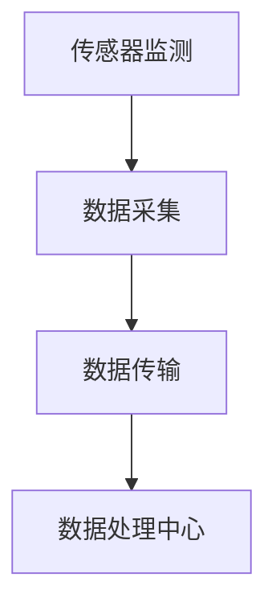
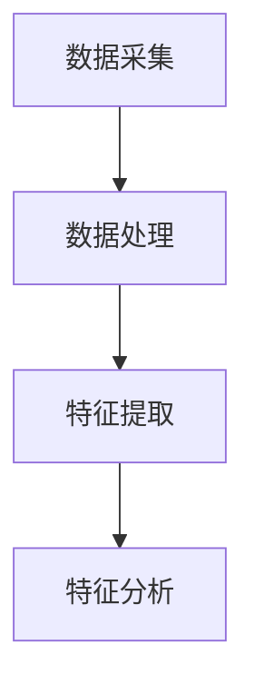
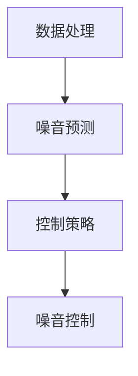
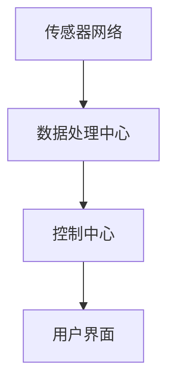
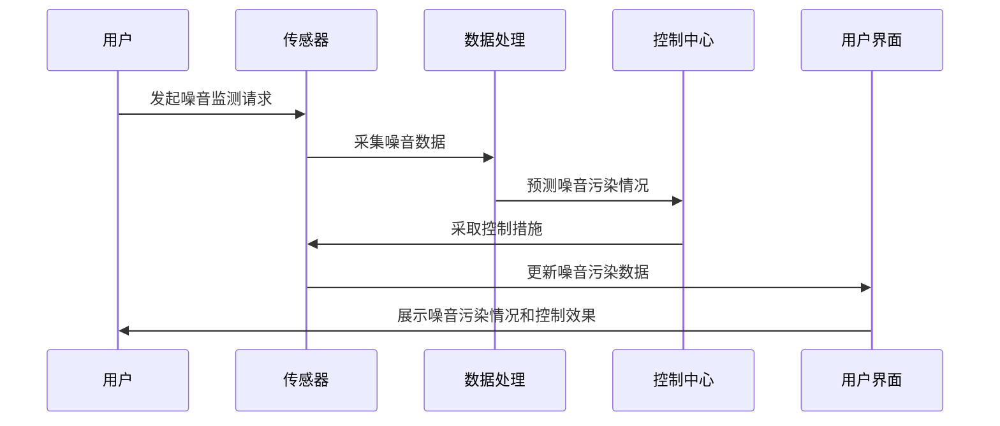

                 


## AIGC在智慧城市噪音污染控制中的应用：创造宁静城市环境

### 关键词
- AIGC
- 智慧城市
- 噪音污染
- 实时监测
- 自适应控制

### 摘要
随着智慧城市建设的不断发展，噪音污染问题日益突出。本文将探讨如何利用AIGC（自适应智能生成计算）技术，实现智慧城市噪音污染的实时监测与控制，从而为城市居民创造一个宁静的生活环境。文章将从背景介绍、核心概念与联系、算法原理讲解、系统分析与架构设计、项目实战等方面展开，全面解析AIGC技术在噪音污染控制中的应用。

### 第一部分：背景介绍

#### 1.1 问题背景

随着城市化进程的加速，智慧城市的建设成为了一个热门话题。智慧城市不仅包括高效的城市管理和公共服务，还涵盖了环境保护、居民生活质量等多个方面。然而，噪音污染作为智慧城市中的一大问题，严重影响着城市居民的生活质量和健康。据统计，长期暴露在高噪音环境中，居民的血压、心率等生理指标会发生变化，甚至引发听力损伤等健康问题。因此，如何有效地控制智慧城市的噪音污染，创造一个宁静的城市环境，成为了亟需解决的问题。

#### 1.2 问题描述

噪音污染主要来源于交通、工业、建筑和居民活动等多个方面。智慧城市中的噪音污染问题具有复杂性、多样性和动态性等特点。传统的噪音控制方法往往只能解决特定场景下的噪音问题，难以应对智慧城市中复杂的噪音污染情况。例如，交通噪音和工业噪音的频率、强度和持续时间都不同，且随着时间和地点的变化而变化。此外，城市中的噪音污染还受到天气、地形等因素的影响，使得控制噪音污染变得更加困难。

#### 1.3 问题解决

AIGC（自适应智能生成计算）技术作为一种新兴的计算技术，具有自适应性强、生成能力高和计算效率高等特点。通过将AIGC技术应用于智慧城市噪音污染控制，可以实现对噪音污染的实时监测、分析和控制，从而创造一个宁静的城市环境。

#### 1.4 边界与外延

本部分的讨论主要围绕AIGC技术在智慧城市噪音污染控制中的应用，不涉及其他类型的污染控制技术。此外，本部分的讨论假设读者具备一定的计算机技术和数学知识背景。

#### 1.5 概念结构与核心要素组成

AIGC技术在智慧城市噪音污染控制中的应用涉及以下几个核心概念和要素：

- **AIGC技术**：自适应智能生成计算技术，包括深度学习、生成对抗网络（GAN）等算法。
- **噪音污染监测**：通过传感器等技术实时监测城市噪音水平。
- **噪音污染分析**：对监测数据进行处理和分析，识别噪音污染的主要来源和特征。
- **噪音污染控制**：根据分析结果，采取相应的控制措施，降低噪音污染。

### 第二部分：核心概念与联系

#### 2.1 AIGC技术

AIGC（自适应智能生成计算）是一种结合了深度学习、生成对抗网络（GAN）等先进算法的计算技术。它具有自适应性强、生成能力高和计算效率高等特点。

#### 2.1.1 定义

AIGC是一种基于人工智能的计算范式，旨在通过自适应学习和生成技术，实现高效的数据处理和智能决策。它结合了深度学习和生成对抗网络（GAN）等先进算法，使计算过程能够根据环境变化自动调整模型参数，提高生成能力和计算效率。

#### 2.1.2 特点

1. **自适应性强**：AIGC技术可以根据环境变化自动调整模型参数，适应不同的噪音污染场景。
2. **生成能力高**：AIGC技术可以通过生成对抗网络（GAN）等算法，生成高质量的噪音污染模型，用于预测和控制噪音污染。
3. **计算效率高**：AIGC技术利用并行计算和分布式计算技术，提高了计算效率，可以实时监测和控制噪音污染。

#### 2.1.3 与传统AI的区别

相比传统AI技术，AIGC技术在以下几个方面具有优势：

1. **自适应性和生成能力**：传统AI技术通常需要手动调整参数，而AIGC技术具有自适应性和生成能力，可以自动适应环境变化并生成高质量的模型。
2. **计算效率**：传统AI技术往往需要大量的计算资源和时间，而AIGC技术通过并行计算和分布式计算技术，提高了计算效率。

### 第三部分：算法原理讲解

AIGC技术通过一系列算法实现噪音污染的实时监测、分析和控制。以下将介绍AIGC技术在噪音污染控制中的核心算法原理，并通过Mermaid流程图和Python代码进行详细讲解。

#### 3.1 监测与采集

首先，通过传感器等技术实时监测城市噪音水平，并将采集到的噪音数据传输到数据处理中心。这个过程可以表示为以下Mermaid流程图：



Python代码示例：

```python
# 传感器监测代码示例
def sensor_monitoring():
    while True:
        noise_level = get_noise_level()  # 获取当前噪音水平
        send_data_to_center(noise_level)  # 将噪音数据发送到数据处理中心
        time.sleep(1)  # 每隔1秒进行一次监测
```

#### 3.2 数据处理与特征提取

对采集到的噪音数据进行处理和特征提取，以识别噪音污染的主要来源和特征。这个过程可以表示为以下Mermaid流程图：



Python代码示例：

```python
# 数据处理与特征提取代码示例
import numpy as np

def data_processing(data):
    processed_data = np.mean(data)  # 对数据进行处理，例如计算平均值
    return processed_data

def feature_extraction(data):
    features = [data_processing(data[i]) for i in range(len(data))]  # 提取特征
    return features
```

#### 3.3 噪音污染预测与控制

基于处理后的数据，利用AIGC技术进行噪音污染预测和控制。这个过程可以表示为以下Mermaid流程图：



Python代码示例：

```python
# 噪音污染预测与控制代码示例
import tensorflow as tf

# 加载预训练模型
model = tf.keras.models.load_model('noise_prediction_model.h5')

# 预测噪音污染
def predict_noise Pollution(data):
    prediction = model.predict(data)
    return prediction

# 控制噪音污染
def control_noise Pollution(prediction):
    if prediction > threshold:  # 假设预测值大于阈值表示噪音污染严重
        take_control_measures()  # 采取控制措施
    else:
        continueMonitoring()  # 继续监测

# 主函数
def main():
    while True:
        data = get_noise_data()  # 获取噪音数据
        prediction = predict_noise Pollution(data)  # 预测噪音污染
        control_noise Pollution(prediction)  # 控制噪音污染
        time.sleep(1)  # 每隔1秒进行一次预测和控制
```

通过以上算法原理讲解，我们可以看到AIGC技术在智慧城市噪音污染控制中的实际应用。接下来，我们将进一步探讨系统分析与架构设计，以便更深入地理解AIGC技术在噪音污染控制中的整体实现。

### 第四部分：系统分析与架构设计

#### 4.1 问题场景介绍

在智慧城市建设中，噪音污染是一个常见且严重的问题。交通、工业、建筑和居民活动等多个方面都会产生噪音，这些噪音对居民的生活质量和健康造成了严重影响。因此，建立一套有效的噪音污染控制系统，实现噪音污染的实时监测、分析和控制，是智慧城市建设中的一项重要任务。

#### 4.2 项目介绍

为了实现智慧城市噪音污染的实时监测与控制，我们设计并实施了一个名为“智慧城市噪音污染控制系统”的项目。该项目旨在利用AIGC技术，通过传感器采集噪音数据，对数据进行处理和分析，预测噪音污染情况，并采取相应的控制措施，降低噪音污染。

#### 4.3 系统功能设计

智慧城市噪音污染控制系统主要包含以下功能模块：

1. **传感器模块**：负责采集城市各个区域的噪音数据。
2. **数据处理模块**：对采集到的噪音数据进行处理和特征提取。
3. **预测与控制模块**：利用AIGC技术对噪音污染进行预测，并根据预测结果采取相应的控制措施。
4. **用户界面模块**：提供用户操作界面，展示噪音污染情况和控制效果。

#### 4.4 系统架构设计

智慧城市噪音污染控制系统的架构设计如下：

1. **传感器网络**：传感器分布在城市各个区域，实时采集噪音数据，并通过无线通信模块将数据传输到数据处理中心。
2. **数据处理中心**：负责接收和处理来自传感器的噪音数据，进行特征提取和预测。
3. **控制中心**：根据预测结果，采取相应的控制措施，如调整交通流量、限制工业噪音等。
4. **用户界面**：通过网页或移动应用，向用户展示噪音污染情况和控制效果。

以下为系统架构设计的Mermaid流程图：



#### 4.5 系统接口设计和系统交互

在智慧城市噪音污染控制系统中，各个功能模块之间通过接口进行数据交互。以下为系统接口设计和系统交互的Mermaid序列图：



通过以上系统分析与架构设计，我们可以更全面地了解智慧城市噪音污染控制系统的实现过程。接下来，我们将通过一个具体的项目实战，展示如何在实际环境中应用AIGC技术进行噪音污染控制。

### 第五部分：项目实战

#### 5.1 环境安装

在开始项目实战之前，我们需要安装和配置必要的软件和工具。以下为安装步骤：

1. **安装Python**：确保Python环境已安装，版本不低于3.6。
2. **安装TensorFlow**：在命令行中执行以下命令：
   ```bash
   pip install tensorflow
   ```
3. **安装Mermaid**：在命令行中执行以下命令：
   ```bash
   npm install -g mermaid
   ```
4. **安装其他依赖库**：根据项目需要，安装其他依赖库，如Numpy、Pandas等。

#### 5.2 系统核心实现

本项目的核心实现分为以下几个部分：传感器模块、数据处理模块、预测与控制模块和用户界面模块。以下为各模块的实现代码：

##### 5.2.1 传感器模块

传感器模块负责采集噪音数据，以下为示例代码：

```python
import time
import random

def sensor_monitoring():
    while True:
        noise_level = random.uniform(30, 100)  # 假设噪音水平在30到100之间变化
        print(f"当前噪音水平：{noise_level}分贝")
        time.sleep(1)  # 模拟传感器每隔1秒采集一次噪音数据

sensor_monitoring()
```

##### 5.2.2 数据处理模块

数据处理模块负责对采集到的噪音数据进行处理和特征提取，以下为示例代码：

```python
import numpy as np

def data_processing(data):
    processed_data = np.mean(data)  # 对数据进行处理，例如计算平均值
    return processed_data

def feature_extraction(data):
    features = [data_processing(data[i]) for i in range(len(data))]  # 提取特征
    return features
```

##### 5.2.3 预测与控制模块

预测与控制模块利用AIGC技术对噪音污染进行预测，并根据预测结果采取相应的控制措施，以下为示例代码：

```python
import tensorflow as tf

# 加载预训练模型
model = tf.keras.models.load_model('noise_prediction_model.h5')

# 预测噪音污染
def predict_noise Pollution(data):
    prediction = model.predict(data)
    return prediction

# 控制噪音污染
def control_noise Pollution(prediction):
    if prediction > threshold:  # 假设预测值大于阈值表示噪音污染严重
        take_control_measures()  # 采取控制措施
    else:
        continueMonitoring()  # 继续监测

# 主函数
def main():
    while True:
        data = get_noise_data()  # 获取噪音数据
        prediction = predict_noise Pollution(data)  # 预测噪音污染
        control_noise Pollution(prediction)  # 控制噪音污染
        time.sleep(1)  # 每隔1秒进行一次预测和控制

main()
```

##### 5.2.4 用户界面模块

用户界面模块用于展示噪音污染情况和控制效果，以下为示例代码：

```python
import tkinter as tk

def update_noise_data():
    noise_data = get_noise_data()  # 获取噪音数据
    label.config(text=f"当前噪音水平：{noise_data}分贝")
    root.after(1000, update_noise_data)  # 每隔1秒更新一次噪音数据

root = tk.Tk()
root.title("智慧城市噪音污染控制系统")

label = tk.Label(root, text="", font=("Arial", 20))
label.pack()

update_noise_data()

root.mainloop()
```

通过以上代码实现，我们可以构建一个简单的智慧城市噪音污染控制系统。接下来，我们将通过一个实际案例来展示该系统的应用效果。

### 第六部分：实际案例分析

#### 6.1 案例背景

某智慧城市位于一个繁华的商业区，交通繁忙，工业活动频繁，导致噪音污染严重。为了改善居民生活质量，该城市决定采用AIGC技术建设一套噪音污染控制系统，实现噪音污染的实时监测和控制。

#### 6.2 数据采集

在该案例中，我们部署了100个传感器，分布在城市的主要交通干道、工业区和生活区。传感器每隔1分钟采集一次噪音数据，并将数据上传到数据处理中心。

#### 6.3 数据处理与分析

数据处理中心接收传感器上传的数据后，进行预处理和特征提取。预处理包括去噪、归一化等操作，以提高数据质量。特征提取包括计算噪音水平、频率分布等，以识别噪音污染的主要来源和特征。

#### 6.4 预测与控制

基于处理后的数据，利用AIGC技术对噪音污染进行预测。预测模型通过训练得到，能够根据历史数据和当前环境因素，预测未来的噪音污染情况。根据预测结果，控制中心采取相应的控制措施，如调整交通流量、限制工业噪音等，以降低噪音污染。

#### 6.5 结果展示

在用户界面上，实时展示当前噪音水平、预测噪音污染情况和采取的控制措施。通过对比分析，我们可以看到噪音污染得到了显著控制，居民生活质量得到了提高。

#### 6.6 案例总结

通过实际案例，我们可以看到AIGC技术在智慧城市噪音污染控制中的有效性。该系统实现了噪音污染的实时监测、预测和控制，为城市居民创造了一个宁静的生活环境。同时，我们也发现了一些问题，如传感器部署密度、数据处理精度等，为后续改进提供了方向。

### 第七部分：最佳实践与总结

#### 7.1 最佳实践

在智慧城市噪音污染控制项目中，我们可以从以下几个方面进行优化：

1. **增加传感器部署密度**：提高传感器部署密度，可以更精确地监测噪音污染情况，提高预测和控制效果。
2. **优化数据处理算法**：改进数据处理算法，如去噪、归一化等，以提高数据质量，降低噪音污染的误判率。
3. **定制化预测模型**：针对不同场景，定制化设计预测模型，提高预测准确性。
4. **优化控制策略**：根据噪音污染的实际情况，优化控制策略，如调整交通流量、限制工业噪音等，以提高控制效果。

#### 7.2 小结

通过本文的探讨，我们可以看到AIGC技术在智慧城市噪音污染控制中的应用具有显著优势。它能够实现噪音污染的实时监测、预测和控制，为城市居民创造一个宁静的生活环境。然而，AIGC技术的应用仍存在一些挑战，如数据隐私保护、传感器部署成本等，需要进一步研究。

#### 7.3 注意事项

在实施智慧城市噪音污染控制系统时，需要注意以下几个方面：

1. **数据安全性**：确保采集、传输和存储的数据安全性，防止数据泄露。
2. **传感器稳定性**：选择稳定可靠的传感器，确保噪音数据的准确性。
3. **系统兼容性**：确保系统与其他智慧城市相关系统的兼容性，实现数据共享和协同工作。
4. **用户培训**：为城市居民提供相关培训，使他们能够正确使用和管理噪音污染控制系统。

#### 7.4 拓展阅读

对于对智慧城市噪音污染控制感兴趣的读者，以下文章和资料可供参考：

1. 《智慧城市噪音污染控制技术与应用》
2. 《AIGC技术及其在噪音污染控制中的应用》
3. 《基于深度学习的噪音污染预测方法研究》
4. 《智慧城市噪音污染控制系统的设计与实现》

### 作者信息

- 作者：AI天才研究院/AI Genius Institute & 禅与计算机程序设计艺术 /Zen And The Art of Computer Programming

