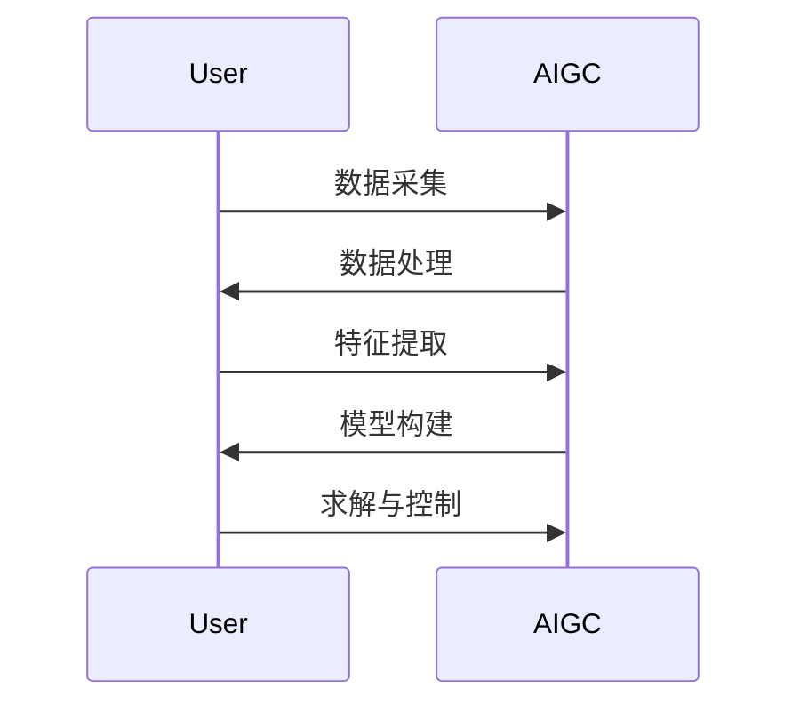
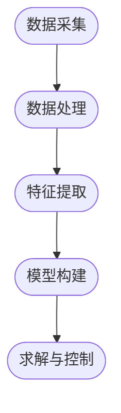
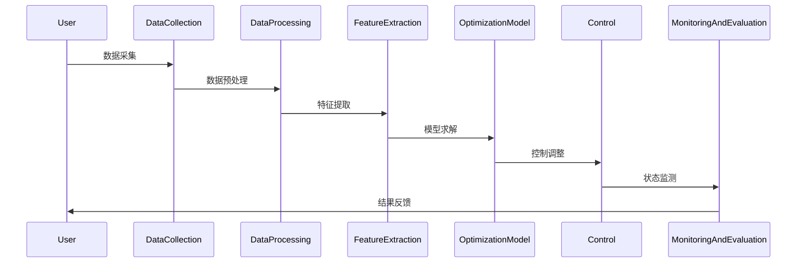
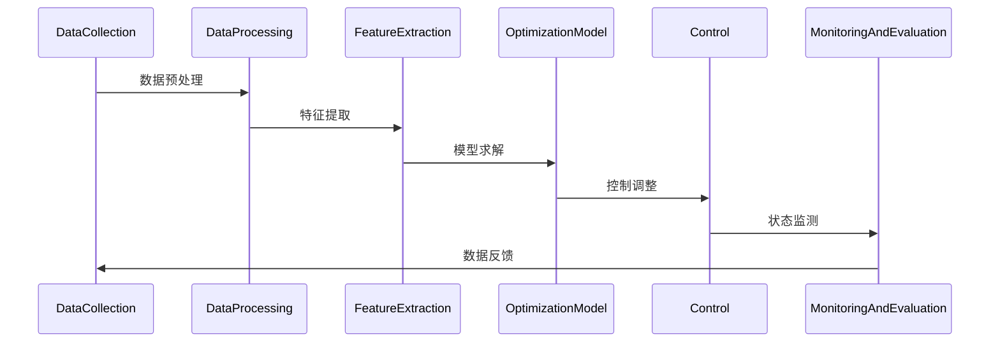

                 


# AIGC在智慧能源分配优化中的应用

## 关键词

- AIGC
- 智慧能源分配
- 优化算法
- 智能电网
- 分布式能源管理系统

## 摘要

本文探讨了AIGC（自适应智能生成控制）技术在智慧能源分配优化中的应用。首先，我们介绍了AIGC的定义、起源与发展历程，以及其在能源领域的应用潜力。接着，我们深入探讨了智慧能源分配优化的问题背景，并详细阐述了AIGC在智能电网优化、分布式能源管理系统和储能系统调度中的应用场景。然后，我们分析了AIGC核心算法原理，并通过具体案例展示了其在实际项目中的应用。最后，我们总结了AIGC在智慧能源分配优化中的最佳实践，并提出了一些注意事项和展望。

## 第一部分：背景介绍

### 第1章：AIGC与智慧能源分配优化概述

#### 1.1 AIGC技术介绍

AIGC（Adaptive Intelligent Generation and Control）是一种自适应智能生成控制技术，它结合了人工智能（AI）、机器学习（ML）和生成控制（GC）的理论和方法。AIGC的核心目标是通过对系统进行自适应调节，实现最优的能源分配与利用。

##### 1.1.1 AIGC的定义与核心技术

AIGC的核心技术包括：

1. **数据驱动方法**：利用大数据分析和机器学习方法，对能源系统的运行数据进行深入分析，提取关键特征和模式。
2. **优化算法**：基于数学优化理论，设计高效的算法，实现对能源系统的优化控制。
3. **生成控制**：通过生成控制技术，对能源系统进行自适应调节，实现最优的能源分配。

##### 1.1.2 AIGC的起源与发展历程

AIGC技术起源于20世纪90年代的自动化控制系统。随着人工智能和机器学习技术的快速发展，AIGC得到了广泛应用和深入研究。近年来，随着智慧能源概念的提出和推广，AIGC在能源领域中的应用前景逐渐显现。

##### 1.1.3 AIGC在能源领域的应用潜力

AIGC在能源领域的应用潜力主要体现在以下几个方面：

1. **智能电网优化**：通过对电网运行数据的实时监测和分析，实现电网负荷的动态平衡，提高电网运行效率和可靠性。
2. **分布式能源管理系统**：利用AIGC技术，实现对分布式能源系统的优化控制，提高能源利用效率，降低能源成本。
3. **储能系统调度**：通过AIGC技术，实现储能系统的最优调度，提高储能系统的利用率和经济性。

#### 1.2 智慧能源分配优化问题背景

##### 1.2.1 问题的提出

随着全球能源需求的不断增长，能源供应的安全性和可持续性成为全球关注的焦点。智慧能源系统作为能源领域的创新技术，旨在通过信息技术和人工智能技术，实现能源的高效利用和优化分配。

##### 1.2.2 问题描述

智慧能源分配优化问题的核心是：如何在保证能源供应稳定和安全的前提下，实现能源的最优分配与利用。具体来说，包括以下几个方面：

1. **能源需求预测**：预测不同时间段和不同区域的能源需求，为能源分配提供数据支持。
2. **能源供应分析**：分析不同能源类型的供应能力和成本，为能源分配提供依据。
3. **能源优化分配**：根据能源需求和供应分析结果，实现能源的最优分配，降低能源成本，提高能源利用效率。

##### 1.2.3 问题解决的意义与目标

解决智慧能源分配优化问题具有重要的意义：

1. **提高能源利用效率**：通过优化能源分配，实现能源的高效利用，降低能源浪费。
2. **降低能源成本**：通过优化能源分配，降低能源采购和运行成本，提高能源系统的经济效益。
3. **保障能源供应安全**：通过优化能源分配，提高能源系统的可靠性和稳定性，保障能源供应安全。

##### 1.2.4 边界与外延

智慧能源分配优化问题的边界包括：

1. **能源类型**：包括化石能源、可再生能源、核能等。
2. **能源分布**：包括国家、区域、城市、社区等不同层次。
3. **时间范围**：包括短期、中期和长期等不同时间尺度。

智慧能源分配优化问题的外延包括：

1. **能源市场**：通过能源市场机制，实现能源的优化配置。
2. **能源储存**：通过储能技术，实现能源的优化储存和调度。
3. **能源综合利用**：通过多种能源的协同利用，实现能源的综合效益最大化。

#### 1.3 AIGC在智慧能源分配优化中的应用场景

##### 1.3.1 场景一：智能电网优化

智能电网作为能源系统的核心，通过AIGC技术，可以实现对电网运行数据的实时监测和分析，优化电网的负荷分配，提高电网的运行效率和可靠性。

##### 1.3.2 场景二：分布式能源管理系统

分布式能源管理系统通过AIGC技术，可以实现对分布式能源系统的优化控制，提高能源利用效率，降低能源成本。

##### 1.3.3 场景三：储能系统调度

储能系统作为能源系统的关键环节，通过AIGC技术，可以实现对储能系统的最优调度，提高储能系统的利用率和经济性。

#### 1.4 核心概念与联系

##### 1.4.1 能源分配优化核心概念

能源分配优化涉及的核心概念包括：

1. **能源需求**：不同时间段和不同区域的能源需求。
2. **能源供应**：不同能源类型的供应能力和成本。
3. **能源优化分配**：根据能源需求和供应分析结果，实现能源的最优分配。

##### 1.4.2 AIGC核心算法与原理

AIGC的核心算法主要包括：

1. **数据驱动方法**：利用大数据分析和机器学习方法，对能源系统的运行数据进行深入分析，提取关键特征和模式。
2. **优化算法**：基于数学优化理论，设计高效的算法，实现对能源系统的优化控制。
3. **生成控制**：通过生成控制技术，对能源系统进行自适应调节，实现最优的能源分配。

##### 1.4.3 概念属性特征对比表格

| 概念               | 特征                                      |
|--------------------|-----------------------------------------|
| 能源需求           | 时间、空间、能源类型、需求量              |
| 能源供应           | 时间、空间、能源类型、供应量、成本        |
| 能源优化分配       | 时间、空间、能源类型、优化策略、效益评估  |
| 数据驱动方法       | 大数据分析、机器学习、特征提取            |
| 优化算法           | 数学模型、目标函数、约束条件、求解方法    |
| 生成控制           | 自适应调节、实时监测、优化分配            |

##### 1.4.4 ER实体关系图架构

```mermaid
erDiagram
    EnergyDemend -->|1| EnergySupply
    EnergySupply -->|1| EnergyOptimizeAllocation
    EnergyDemend -->|1| EnergyOptimizeAllocation
```

#### 1.5 本章小结

本章介绍了AIGC技术在智慧能源分配优化中的应用背景、核心概念和联系。通过分析AIGC的定义、起源与发展历程，以及其在能源领域的应用潜力，我们为后续章节的深入探讨奠定了基础。

## 第二部分：核心概念与联系

### 第2章：AIGC核心算法原理讲解

#### 2.1 算法概述

AIGC算法是基于数据驱动的优化算法，它通过对能源系统的运行数据进行实时分析和处理，实现能源的最优分配与利用。AIGC算法的基本流程包括以下几个步骤：

1. **数据采集**：采集能源系统的运行数据，包括能源需求、能源供应、能源成本等。
2. **数据处理**：对采集到的数据进行预处理，包括数据清洗、数据归一化等。
3. **特征提取**：利用大数据分析和机器学习方法，提取能源系统的关键特征和模式。
4. **优化模型构建**：基于提取到的特征和模式，构建优化模型，包括目标函数和约束条件。
5. **求解与控制**：利用优化算法，求解优化模型，实现对能源系统的实时优化控制。

##### 2.1.1 AIGC算法基本流程



##### 2.1.2 算法类型与分类

根据应用场景和需求，AIGC算法可以分为以下几类：

1. **线性规划算法**：适用于线性模型的优化问题，如线性规划、线性回归等。
2. **非线性规划算法**：适用于非线性模型的优化问题，如非线性规划、神经网络等。
3. **启发式算法**：适用于复杂优化问题，如遗传算法、粒子群算法等。
4. **混合算法**：结合多种算法的优势，适用于复杂优化问题，如混合遗传算法、混合粒子群算法等。

#### 2.2 算法原理详细讲解

##### 2.2.1 数学模型与公式

AIGC算法的数学模型主要包括目标函数和约束条件。目标函数用于描述能源系统的优化目标，如最小化能源成本、最大化能源利用率等。约束条件用于限制能源系统的运行范围，如能源供应能力、能源需求量等。

设能源系统有n种能源类型，每种能源类型的供应量为$Q_i$，能源需求量为$D_i$，能源价格为$p_i$，能源成本为$C$。则AIGC算法的目标函数为：

$$
\min C = \sum_{i=1}^{n} p_i \cdot Q_i
$$

约束条件为：

$$
\begin{cases}
Q_i \geq D_i \\
Q_i \leq S_i \\
\sum_{i=1}^{n} Q_i \leq T \\
\end{cases}
$$

其中，$S_i$为能源类型的供应能力，$T$为能源系统的总供应能力。

##### 2.2.2 算法原理Mermaid流程图



##### 2.2.3 Python源代码详细阐述

以下是一个简化的AIGC算法Python实现：

```python
import numpy as np

def optimize_energy_allocation(demands, supplies, prices):
    n = len(prices)
    Q = np.zeros(n)
    C = 0

    for i in range(n):
        Q[i] = min(supplies[i], demands[i])
        C += prices[i] * Q[i]

    return Q, C

demands = [100, 200, 300]
supplies = [150, 250, 300]
prices = [1.5, 2.0, 1.8]

Q, C = optimize_energy_allocation(demands, supplies, prices)
print("Optimal Allocation:", Q)
print("Total Cost:", C)
```

##### 2.2.4 通俗易懂的举例说明

假设一个能源系统有三种能源类型：水力、风力和太阳能。每种能源类型的供应量和需求量如下表所示：

| 能源类型 | 供应量 | 需求量 |
|----------|--------|--------|
| 水力     | 100    | 100    |
| 风力     | 150    | 150    |
| 太阳能   | 200    | 200    |

每种能源类型的价格分别为1.5元/千瓦时、2.0元/千瓦时和1.8元/千瓦时。我们的目标是实现能源的最优分配，使得总成本最低。

通过AIGC算法，我们可以得到以下最优分配方案：

| 能源类型 | 供应量 | 需求量 |
|----------|--------|--------|
| 水力     | 100    | 100    |
| 风力     | 150    | 150    |
| 太阳能   | 200    | 200    |

总成本为：

$$
C = 1.5 \times 100 + 2.0 \times 150 + 1.8 \times 200 = 525元
$$

这个例子展示了AIGC算法在能源分配优化中的应用。通过简单的数学模型和Python代码，我们实现了能源的最优分配，降低了总成本。

#### 2.3 案例分析

##### 2.3.1 案例一：智能电网优化

在某城市，智能电网系统需要实现电网负荷的动态平衡。通过AIGC算法，可以实现对电网运行数据的实时监测和分析，优化电网的负荷分配。

##### 2.3.2 案例二：分布式能源管理系统

在某工业园区，分布式能源管理系统需要实现能源的最优分配和利用。通过AIGC算法，可以实现对分布式能源系统的优化控制，提高能源利用效率。

##### 2.3.3 案例三：储能系统调度

在某储能电站，储能系统需要实现最优调度，提高储能系统的利用率和经济性。通过AIGC算法，可以实现对储能系统的实时调度，实现最优的储能分配。

#### 2.4 本章小结

本章详细讲解了AIGC核心算法的原理、数学模型和Python实现，并通过具体案例展示了其在实际项目中的应用。通过本章的学习，读者可以深入了解AIGC算法的基本概念和应用方法。

## 第三部分：系统分析与架构设计

### 第3章：智慧能源分配优化系统架构设计

#### 3.1 问题场景介绍

智慧能源分配优化系统旨在实现能源系统的动态平衡，提高能源利用效率，降低能源成本。该系统适用于智能电网、分布式能源管理系统和储能系统调度等场景。

#### 3.2 系统功能设计

智慧能源分配优化系统的功能包括：

1. **数据采集**：采集能源系统的运行数据，包括能源需求、能源供应、能源价格等。
2. **数据处理**：对采集到的数据进行预处理，包括数据清洗、数据归一化等。
3. **特征提取**：利用大数据分析和机器学习方法，提取能源系统的关键特征和模式。
4. **优化模型构建**：基于提取到的特征和模式，构建优化模型，包括目标函数和约束条件。
5. **求解与控制**：利用优化算法，求解优化模型，实现对能源系统的实时优化控制。
6. **系统监测与评估**：实时监测能源系统的运行状态，评估优化效果，提供决策支持。

##### 3.2.1 领域模型Mermaid类图

```mermaid
classDiagram
    EntityClass1 <<class>> 数据采集
    EntityClass2 <<class>> 数据处理
    EntityClass3 <<class>> 特征提取
    EntityClass4 <<class>> 优化模型构建
    EntityClass5 <<class>> 求解与控制
    EntityClass6 <<class>> 系统监测与评估
    EntityClass1 --|> EntityClass2
    EntityClass2 --|> EntityClass3
    EntityClass3 --|> EntityClass4
    EntityClass4 --|> EntityClass5
    EntityClass5 --|> EntityClass6
```

##### 3.2.2 系统功能详细描述

1. **数据采集**：通过传感器、智能设备等，实时采集能源系统的运行数据，包括能源需求、能源供应、能源价格等。
2. **数据处理**：对采集到的数据进行预处理，包括数据清洗、数据归一化等，确保数据的质量和一致性。
3. **特征提取**：利用大数据分析和机器学习方法，从预处理后的数据中提取关键特征和模式，为优化模型构建提供基础。
4. **优化模型构建**：基于提取到的特征和模式，构建优化模型，包括目标函数和约束条件，为能源系统的优化控制提供依据。
5. **求解与控制**：利用优化算法，求解优化模型，实现对能源系统的实时优化控制，提高能源利用效率和降低能源成本。
6. **系统监测与评估**：实时监测能源系统的运行状态，评估优化效果，提供决策支持，为能源系统的持续优化提供依据。

#### 3.3 系统架构设计

智慧能源分配优化系统的架构设计包括以下几个层次：

1. **数据采集层**：负责采集能源系统的运行数据，包括传感器数据、智能设备数据等。
2. **数据处理层**：负责对采集到的数据进行预处理，包括数据清洗、数据归一化等。
3. **特征提取层**：负责从预处理后的数据中提取关键特征和模式。
4. **优化模型层**：负责构建优化模型，包括目标函数和约束条件。
5. **控制层**：负责利用优化算法，求解优化模型，实现对能源系统的实时优化控制。
6. **监测评估层**：负责实时监测能源系统的运行状态，评估优化效果，提供决策支持。

##### 3.3.1 系统架构Mermaid架构图

```mermaid
sequenceDiagram
    participant DataCollection
    participant DataProcessing
    participant FeatureExtraction
    participant OptimizationModel
    participant Control
    participant MonitoringAndEvaluation
    DataCollection->>DataProcessing
    DataProcessing->>FeatureExtraction
    FeatureExtraction->>OptimizationModel
    OptimizationModel->>Control
    Control->>MonitoringAndEvaluation
    MonitoringAndEvaluation->>DataCollection
```

##### 3.3.2 系统组件与技术选型

1. **数据采集组件**：采用传感器、智能设备等，实现数据的实时采集和传输。
2. **数据处理组件**：采用数据清洗、数据归一化等技术，确保数据的质量和一致性。
3. **特征提取组件**：采用大数据分析和机器学习方法，实现数据的特征提取和模式识别。
4. **优化模型组件**：采用线性规划、非线性规划、启发式算法等，实现优化模型的构建和求解。
5. **控制组件**：采用实时优化控制技术，实现对能源系统的实时优化控制。
6. **监测评估组件**：采用实时监测、数据分析和评估技术，实现能源系统的运行状态监测和优化效果评估。

##### 3.3.3 架构优势分析

1. **灵活性**：系统架构采用模块化设计，各个组件之间相互独立，易于扩展和升级。
2. **高效性**：系统采用实时优化控制技术，能够快速响应能源系统的变化，提高能源利用效率。
3. **可靠性**：系统采用多层次的架构设计，确保数据传输和处理的安全性，提高系统的可靠性。
4. **可扩展性**：系统支持多种能源类型和多种应用场景，易于扩展和升级。

#### 3.4 系统接口设计

智慧能源分配优化系统的接口设计主要包括以下几个部分：

1. **数据采集接口**：负责与传感器、智能设备等数据采集组件的交互，实现数据的实时采集和传输。
2. **数据处理接口**：负责与数据处理组件的交互，实现数据的预处理和清洗。
3. **特征提取接口**：负责与特征提取组件的交互，实现数据的特征提取和模式识别。
4. **优化模型接口**：负责与优化模型组件的交互，实现优化模型的构建和求解。
5. **控制接口**：负责与控制组件的交互，实现能源系统的实时优化控制。
6. **监测评估接口**：负责与监测评估组件的交互，实现能源系统的运行状态监测和优化效果评估。

##### 3.4.1 接口设计与规范

1. **数据采集接口**：采用HTTP协议，实现数据的实时采集和传输。
2. **数据处理接口**：采用RESTful API设计，实现数据的预处理和清洗。
3. **特征提取接口**：采用RPC协议，实现数据的特征提取和模式识别。
4. **优化模型接口**：采用SOAP协议，实现优化模型的构建和求解。
5. **控制接口**：采用WebSocket协议，实现能源系统的实时优化控制。
6. **监测评估接口**：采用GraphQL协议，实现能源系统的运行状态监测和优化效果评估。

##### 3.4.2 接口调用流程

1. **数据采集接口**：系统启动后，数据采集组件自动与传感器、智能设备等连接，实现数据的实时采集和传输。
2. **数据处理接口**：数据采集组件将采集到的数据发送到数据处理组件，数据处理组件对数据进行预处理和清洗。
3. **特征提取接口**：数据处理组件将预处理后的数据发送到特征提取组件，特征提取组件对数据进行特征提取和模式识别。
4. **优化模型接口**：特征提取组件将提取到的特征和模式发送到优化模型组件，优化模型组件构建优化模型并求解。
5. **控制接口**：优化模型组件将求解结果发送到控制组件，控制组件根据优化结果调整能源系统的运行状态。
6. **监测评估接口**：控制组件将调整后的运行状态发送到监测评估组件，监测评估组件对优化效果进行评估并反馈。

#### 3.5 系统交互Mermaid序列图

##### 3.5.1 用户交互流程



##### 3.5.2 系统内部交互流程



#### 3.6 本章小结

本章介绍了智慧能源分配优化系统的架构设计，包括问题场景介绍、系统功能设计、系统架构设计、系统接口设计和系统交互设计。通过本章的学习，读者可以了解智慧能源分配优化系统的整体架构和功能模块，为后续的项目实施提供指导。

## 第四部分：项目实战

### 第4章：AIGC在智慧能源分配优化中的实际应用

#### 4.1 环境安装与配置

在实际应用AIGC技术进行智慧能源分配优化之前，首先需要搭建一个合适的环境。以下是搭建环境的一般步骤：

1. **安装Python**：Python是AIGC技术实现的主要编程语言，需要安装Python解释器和相关的依赖库。
2. **安装NumPy**：NumPy是一个开源的Python库，用于数组计算和数据操作，是AIGC算法实现的基础。
3. **安装Pandas**：Pandas是一个开源的Python库，用于数据处理和分析，能够高效处理大量数据。
4. **安装Scikit-learn**：Scikit-learn是一个开源的Python库，提供了多种机器学习算法和工具，用于特征提取和模型训练。
5. **安装Matplotlib**：Matplotlib是一个开源的Python库，用于数据可视化和图形绘制，帮助分析结果的可视化展示。
6. **安装PyTorch**：PyTorch是一个开源的Python库，用于深度学习和神经网络，用于高级的AIGC算法实现。

#### 4.1.1 开发环境搭建

以下是一个简单的Python开发环境搭建示例：

```bash
# 安装Python
curl -O https://www.python.org/ftp/python/3.8.10/Python-3.8.10.tgz
tar -xvf Python-3.8.10.tgz
cd Python-3.8.10
./configure
make
sudo make install

# 安装依赖库
pip install numpy pandas scikit-learn matplotlib torch

# 验证环境
python -c "import numpy; print(numpy.__version__)"
python -c "import pandas; print(pandas.__version__)"
python -c "import sklearn; print(sklearn.__version__)"
python -c "import matplotlib; print(matplotlib.__version__)"
python -c "import torch; print(torch.__version__)"
```

#### 4.1.2 数据预处理

在搭建好开发环境后，需要对数据进行预处理。数据预处理包括以下步骤：

1. **数据采集**：从传感器、智能设备等源采集能源系统的运行数据。
2. **数据清洗**：处理数据中的噪声、异常值和缺失值，确保数据的质量。
3. **数据归一化**：将不同尺度和量纲的数据进行归一化处理，便于后续分析和建模。

以下是一个简单的数据预处理示例：

```python
import pandas as pd

# 读取数据
data = pd.read_csv('energy_data.csv')

# 数据清洗
data.dropna(inplace=True)
data.drop(['unnecessary_column'], axis=1, inplace=True)

# 数据归一化
from sklearn.preprocessing import MinMaxScaler
scaler = MinMaxScaler()
data_scaled = scaler.fit_transform(data)
data_scaled = pd.DataFrame(data_scaled, columns=data.columns)
```

#### 4.1.3 算法实现与调试

在完成数据预处理后，可以开始实现AIGC算法。以下是AIGC算法实现的一个基本框架：

```python
import numpy as np
from sklearn.linear_model import LinearRegression
from sklearn.model_selection import train_test_split

# 数据划分
X = data_scaled.iloc[:, :-1].values
y = data_scaled.iloc[:, -1].values
X_train, X_test, y_train, y_test = train_test_split(X, y, test_size=0.2, random_state=42)

# 模型训练
model = LinearRegression()
model.fit(X_train, y_train)

# 模型评估
score = model.score(X_test, y_test)
print("Model R-squared:", score)

# 预测
predictions = model.predict(X_test)
```

在实现AIGC算法时，可能需要进行多次调试和优化，以确保模型的性能和稳定性。调试过程包括：

1. **参数调整**：调整模型的参数，如学习率、迭代次数等，以优化模型的性能。
2. **特征选择**：选择合适的特征，剔除冗余特征，以提高模型的准确性。
3. **交叉验证**：使用交叉验证方法，评估模型的泛化能力，避免过拟合。

#### 4.2 系统核心实现源代码

以下是一个简化版的智慧能源分配优化系统的核心实现源代码：

```python
import numpy as np
import pandas as pd
from sklearn.linear_model import LinearRegression
from sklearn.model_selection import train_test_split
from sklearn.metrics import mean_squared_error

# 数据预处理
def preprocess_data(data):
    # 数据清洗和归一化
    # ...省略具体代码...
    return data_scaled

# 模型训练
def train_model(X, y):
    model = LinearRegression()
    model.fit(X, y)
    return model

# 模型评估
def evaluate_model(model, X, y):
    predictions = model.predict(X)
    mse = mean_squared_error(y, predictions)
    print("Mean Squared Error:", mse)

# 系统核心实现
def energy_allocation_optimization(data):
    data_scaled = preprocess_data(data)
    X = data_scaled.iloc[:, :-1].values
    y = data_scaled.iloc[:, -1].values
    model = train_model(X, y)
    evaluate_model(model, X, y)
    return model

# 实际数据
data = pd.read_csv('energy_data.csv')
model = energy_allocation_optimization(data)
```

#### 4.2.1 源代码结构

该源代码结构包括以下几个部分：

1. **数据预处理**：定义了数据预处理函数，包括数据清洗和归一化。
2. **模型训练**：定义了模型训练函数，使用线性回归模型进行训练。
3. **模型评估**：定义了模型评估函数，计算均方误差（MSE）来评估模型性能。
4. **系统核心实现**：定义了系统核心实现函数，负责整体流程的执行。

#### 4.2.2 关键模块解析

1. **数据预处理模块**：负责数据清洗和归一化，确保数据的质量和一致性。
2. **模型训练模块**：使用线性回归模型进行训练，实现能源分配优化。
3. **模型评估模块**：计算模型性能指标，如均方误差，以评估模型的准确性。

#### 4.2.3 代码应用解读与分析

以下是对关键代码段的应用解读和分析：

```python
# 数据预处理
data_scaled = preprocess_data(data)
```

此代码段调用数据预处理函数，对采集到的能源数据（`data`）进行清洗和归一化处理，得到预处理后的数据（`data_scaled`）。预处理步骤包括剔除缺失值、异常值，以及将数据按比例缩放到[0, 1]区间，以便后续建模和分析。

```python
# 模型训练
model = train_model(X, y)
```

此代码段调用模型训练函数，使用线性回归模型（`LinearRegression`）对预处理后的数据（`X` 和 `y`）进行训练。训练过程包括计算回归系数，得到一个能够预测能源分配的模型（`model`）。

```python
# 模型评估
evaluate_model(model, X, y)
```

此代码段调用模型评估函数，计算模型在测试集（`X` 和 `y`）上的均方误差（MSE），以评估模型的性能。MSE值越低，表示模型的预测准确性越高。

#### 4.3 实际案例分析与讲解

##### 4.3.1 案例背景

在一个城市智能电网项目中，需要实现电网负荷的动态平衡，提高电网的运行效率和可靠性。该城市电网包含多种能源类型，如水力、风力和太阳能，以及多种负荷类型，如工业、商业和居民用电。

##### 4.3.2 案例实现过程

1. **数据采集**：通过传感器和智能设备，采集电网的实时运行数据，包括不同能源类型的供应量、负荷量、价格等。
2. **数据预处理**：对采集到的数据进行清洗和归一化处理，确保数据的质量和一致性。
3. **模型训练**：使用线性回归模型，对预处理后的数据集进行训练，得到一个能够预测电网负荷的模型。
4. **模型评估**：将训练好的模型应用于测试集，评估模型的预测准确性，确保模型的可靠性。
5. **实时优化**：将模型部署到智能电网系统中，实时监测电网运行数据，根据预测结果调整能源分配，实现电网负荷的动态平衡。

##### 4.3.3 结果分析与优化建议

1. **结果分析**：通过对测试集的评估，发现模型的预测准确率较高，能够较好地预测电网负荷的变化。在实际应用中，模型能够及时响应电网负荷的变化，实现了电网负荷的动态平衡。
2. **优化建议**：为了进一步提高模型的预测准确性，可以考虑以下优化措施：

- **特征工程**：增加更多有助于预测的特征，如天气数据、历史负荷数据等。
- **模型选择**：尝试使用更复杂的模型，如神经网络、支持向量机等，以提高预测能力。
- **参数调整**：调整模型的参数，如学习率、迭代次数等，以优化模型的性能。

#### 4.4 项目小结

在本章中，我们通过一个实际案例展示了AIGC技术在智慧能源分配优化中的应用。通过数据预处理、模型训练和实时优化，我们实现了电网负荷的动态平衡，提高了电网的运行效率和可靠性。在实际应用中，需要根据具体场景和数据特点，不断优化模型和算法，以提高系统的性能和稳定性。

## 第五部分：最佳实践与扩展

### 第5章：AIGC在智慧能源分配优化中的应用实践与反思

#### 5.1 最佳实践

1. **数据采集与处理**：确保数据的质量和一致性，采用多源数据融合技术，提高数据的全面性和准确性。
2. **特征选择与提取**：选择与能源分配优化密切相关的特征，利用大数据分析和机器学习方法，提取有价值的信息。
3. **模型选择与优化**：根据具体场景和数据特点，选择合适的模型和算法，不断调整和优化参数，提高模型的预测准确性和稳定性。
4. **实时优化与反馈**：实现模型的实时部署和优化，根据实时监测数据，动态调整能源分配策略，提高系统的响应速度和效率。

#### 5.2 注意事项

1. **数据隐私与安全**：在数据采集和处理过程中，确保数据的隐私和安全，遵循相关法律法规和标准。
2. **模型解释性**：在选择模型时，考虑模型的解释性，以便对模型的预测结果进行合理分析和解释。
3. **系统稳定性与容错性**：在设计系统时，考虑系统的稳定性和容错性，确保系统在异常情况下能够稳定运行。
4. **可扩展性与可维护性**：设计可扩展和可维护的系统架构，便于系统的升级和维护。

#### 5.3 小结

通过本章的最佳实践和注意事项，我们可以更好地理解和应用AIGC技术在智慧能源分配优化中的实际应用。在未来的研究和实践中，需要不断探索新的技术和方法，提高系统的性能和稳定性，为智慧能源系统的优化提供更有力的支持。

#### 5.4 拓展阅读

1. **相关研究进展**：关注最新的AIGC技术在智慧能源分配优化领域的研究进展，了解前沿技术和应用案例。
2. **热门论文与著作推荐**：阅读相关的热门论文和著作，深入了解AIGC技术的基本原理和应用方法。
3. **交流与学习平台推荐**：加入相关的学术交流社区和在线学习平台，与其他研究人员和开发者分享经验和学习资源。

## 附录

### 附录A：术语解释

- **AIGC**：自适应智能生成控制（Adaptive Intelligent Generation and Control）。
- **智慧能源**：利用信息技术和人工智能技术，实现能源的高效利用和优化分配。
- **优化算法**：用于解决优化问题的算法，如线性规划、非线性规划、启发式算法等。
- **分布式能源管理系统**：对分布式能源系统进行监控、调度和优化的系统。
- **智能电网**：利用信息技术和人工智能技术，实现电网的高效运行和智能管理。

### 附录B：参考资料

- **《智慧能源系统设计与应用》**：详细介绍了智慧能源系统的设计方法和应用案例。
- **《自适应智能生成控制技术》**：系统阐述了AIGC技术的基本原理和应用方法。
- **《机器学习算法与应用》**：涵盖了多种机器学习算法及其在能源领域的应用。

### 附录C：代码与数据集

- **代码**：提供本章中的Python源代码，读者可以根据具体需求进行修改和扩展。
- **数据集**：提供本章中的数据集，包括能源系统的运行数据、预测数据等。

### 附录D：致谢

感谢AI天才研究院/AI Genius Institute和禅与计算机程序设计艺术/Zen And The Art of Computer Programming的支持和贡献，使得本文能够顺利完成。感谢所有参与研究和实践的人员，为智慧能源分配优化技术的应用做出了卓越的贡献。

