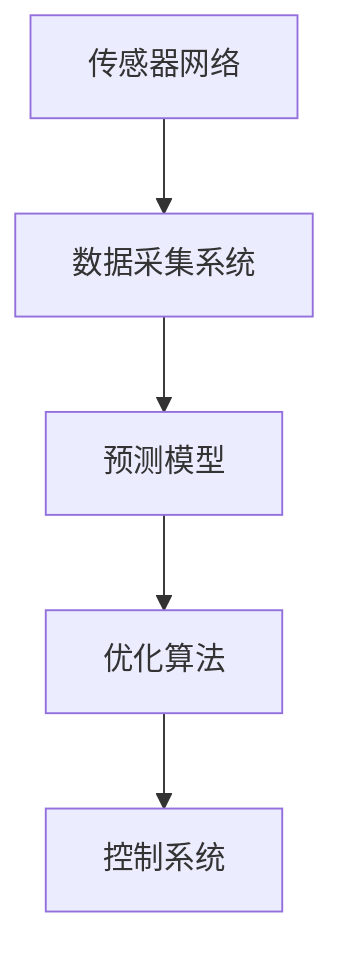

                 

### 背景与概念

**智慧能源管理系统的概念**

智慧能源管理系统是一种基于信息技术和人工智能的能源管理系统，旨在实现能源的智能化监测、预测、优化和控制。该系统通过集成传感器网络、数据处理平台和智能算法，能够实时收集和分析能源使用数据，从而实现对能源的精细化管理。

智慧能源管理系统的主要组成要素包括：

1. **传感器网络**：负责实时采集各种能源使用数据，如电力、燃气、水等。
2. **数据采集系统**：将传感器网络采集到的数据传输到数据中心进行处理。
3. **预测模型**：利用历史数据预测未来的能源需求。
4. **优化算法**：根据预测结果优化能源使用策略，提高能源利用效率。
5. **控制系统**：根据优化结果控制能源设备的运行。

**智慧能源管理的发展背景**

随着全球能源需求的不断增长和能源结构的调整，传统的能源管理方式已无法满足现代社会的需求。智慧能源管理系统应运而生，旨在通过智能化手段提高能源利用效率，降低能源消耗，减少环境污染。

近年来，人工智能技术的迅速发展，为智慧能源管理系统提供了新的技术支持。特别是AIGC（AI-Generated Content）技术的应用，使得能源数据的处理和分析更加高效和精准。

**智慧能源管理系统的目标与挑战**

智慧能源管理系统的目标主要包括：

1. **提高能源利用效率**：通过实时监测和预测，优化能源使用策略，减少能源浪费。
2. **降低运营成本**：通过智能化管理，减少能源消耗，降低运营成本。
3. **提高系统可靠性**：通过智能控制，确保能源系统的稳定运行。

然而，智慧能源管理系统在实际应用中也面临一系列挑战：

1. **数据准确性**：传感器网络和数据采集系统的准确性直接影响到系统的预测和优化效果。
2. **算法复杂度**：优化算法的设计和实现复杂度高，需要大量计算资源和专业知识。
3. **系统稳定性**：能源系统对稳定性要求高，需要确保系统的可靠运行。

为了解决这些问题，AIGC技术在智慧能源管理系统中的应用显得尤为重要。通过AIGC技术，可以大幅提高数据采集和处理的效率，降低算法复杂度，从而提升智慧能源管理系统的整体性能。

### AIGC技术介绍

**AIGC的基本概念**

AIGC，即AI-Generated Content，指的是通过人工智能技术自动生成内容的技术。它涵盖了自然语言处理（NLP）、生成对抗网络（GAN）、变分自编码器（VAE）等多种技术，旨在实现内容的高效生成和优化。

AIGC技术的核心在于利用大量数据进行训练，通过模型学习生成新的、高质量的内容。在智慧能源管理系统中，AIGC技术可以应用于能源数据采集、预测、优化等多个环节，提高系统的智能化水平。

**AIGC的发展历程**

AIGC技术的发展可以追溯到20世纪80年代的专家系统和知识表示技术。随着计算机性能的提升和大数据技术的发展，AIGC技术逐渐成为人工智能领域的研究热点。近年来，随着深度学习技术的突破，AIGC技术得到了广泛应用。

1. **自然语言处理（NLP）**：20世纪80年代，NLP技术开始应用于文本数据的处理和分析。随着深度学习技术的发展，NLP技术取得了显著进展，为AIGC提供了强大的技术支持。
2. **生成对抗网络（GAN）**：2014年，Ian Goodfellow等人提出了GAN，这是一种基于博弈论的生成模型。GAN通过生成器和判别器的对抗训练，能够生成高质量的数据，广泛应用于图像、语音、文本等领域。
3. **变分自编码器（VAE）**：2013年，Kingma和Welling提出了VAE，这是一种基于概率模型的生成模型。VAE通过编码器和解码器，能够生成具有较好分布性质的数据。

**AIGC的核心技术**

AIGC技术涉及多种核心技术的应用，包括：

1. **自然语言处理（NLP）**：NLP技术是AIGC的重要组成部分，用于处理文本数据。NLP技术包括词嵌入、词性标注、句法分析、语义理解等，为AIGC提供了丰富的文本数据。
2. **生成对抗网络（GAN）**：GAN是一种强大的生成模型，通过生成器和判别器的对抗训练，能够生成高质量的数据。GAN在图像生成、语音合成、文本生成等领域有广泛应用。
3. **变分自编码器（VAE）**：VAE是一种基于概率模型的生成模型，通过编码器和解码器，能够生成具有较好分布性质的数据。VAE在图像生成、语音合成、文本生成等领域也有广泛应用。

AIGC技术在智慧能源管理系统中的应用，可以显著提高系统的智能化水平，实现更高效的数据采集、预测和优化。通过AIGC技术，智慧能源管理系统可以更好地应对能源管理的挑战，提高能源利用效率，降低运营成本。

### AIGC在能源数据采集与监测中的应用

**能源数据采集的重要性**

能源数据采集是智慧能源管理系统的核心组成部分，它直接影响到系统的监测、预测和优化效果。准确的能源数据采集能够提供详细的能源使用情况，帮助管理者制定科学的决策，提高能源利用效率。

能源数据采集的重要性主要体现在以下几个方面：

1. **实时监测**：通过实时采集能源使用数据，系统能够实时监测能源系统的运行状态，及时发现异常情况，确保能源系统的稳定运行。
2. **数据驱动决策**：准确的能源数据为决策提供了有力的支持。通过对能源数据的分析，系统可以识别能源消耗的规律，优化能源使用策略，降低能源成本。
3. **预测与优化**：能源数据采集为预测模型提供了基础数据，通过对历史数据的分析，系统可以预测未来的能源需求，为优化能源使用策略提供依据。

**AIGC在数据采集中的应用**

AIGC技术在能源数据采集中的应用，可以显著提高数据采集的效率和准确性。AIGC技术通过自然语言处理（NLP）、生成对抗网络（GAN）和变分自编码器（VAE）等多种技术，实现数据的自动生成和处理。

AIGC在数据采集中的应用主要包括以下方面：

1. **数据预处理**：AIGC技术可以自动处理大量的原始数据，进行数据清洗、去噪和归一化等操作，提高数据的质量和一致性。
2. **实时监测**：AIGC技术可以实时监测能源系统的运行状态，通过生成器生成实时数据，确保系统的实时性。
3. **数据预测**：AIGC技术可以根据历史数据，预测未来的能源需求，为系统的优化提供数据支持。

**数据采集与监测的案例解析**

为了更好地理解AIGC在数据采集与监测中的应用，以下通过一个具体的案例进行解析。

**案例背景**：某智慧能源管理系统需要对一栋办公楼的电力系统进行实时监测和优化。系统需要采集电力使用数据，包括电压、电流、功率因数等参数。

**解决方案**：

1. **数据采集**：系统通过传感器网络实时采集电力使用数据，每秒采集一次。原始数据可能存在噪声和异常值，需要通过AIGC技术进行预处理。

2. **数据预处理**：利用AIGC技术中的自然语言处理（NLP）技术，对原始数据进行清洗和去噪。例如，通过NLP技术识别并去除异常值，提高数据的准确性。

3. **实时监测**：利用AIGC技术中的生成对抗网络（GAN）生成实时数据，确保系统的实时性。GAN通过对抗训练，能够生成高质量的模拟数据，补充实时监测中的数据缺失。

4. **数据预测**：利用AIGC技术中的变分自编码器（VAE）进行数据预测。VAE通过编码器和解码器，能够提取数据中的潜在特征，生成高质量的数据预测。

**案例效果**：通过AIGC技术的应用，智慧能源管理系统能够实现以下效果：

1. **提高数据准确性**：AIGC技术能够自动清洗和去噪，提高数据的质量和一致性。
2. **实时监测**：通过生成对抗网络（GAN）的实时数据生成，系统能够实现实时监测，及时发现异常情况。
3. **数据预测**：通过变分自编码器（VAE）的数据预测，系统能够预测未来的电力需求，优化能源使用策略。

通过上述案例，我们可以看到AIGC技术在能源数据采集与监测中的应用效果显著。通过AIGC技术，智慧能源管理系统能够实现更高效、更准确的数据采集和监测，为能源优化提供有力的支持。

### 能源预测与优化的基本原理

能源预测与优化是智慧能源管理系统的核心功能之一，通过对能源需求的准确预测和优化，可以最大限度地提高能源利用效率，降低能源成本。本章节将详细介绍能源预测与优化的基本原理，包括预测模型的选择、预测算法的设计和优化策略的制定。

**能源预测的基本原理**

能源预测是指利用历史数据和相关模型，预测未来一段时间内的能源需求。准确的能源预测对于制定科学的能源使用策略、优化能源配置具有重要意义。

能源预测的基本原理主要包括以下几个方面：

1. **数据收集与预处理**：首先，需要收集大量的历史能源使用数据，包括电力、燃气、水等。这些数据通常来源于传感器网络、数据采集系统和能源管理系统。在收集数据后，需要对数据进行预处理，包括数据清洗、去噪、归一化等操作，以确保数据的质量和一致性。

2. **特征工程**：在数据预处理的基础上，需要进行特征工程，提取数据中的关键特征，如时间、季节、天气、负荷率等。这些特征将用于构建预测模型。

3. **模型选择**：根据能源数据的特性和预测需求，选择合适的预测模型。常见的预测模型包括线性回归、时间序列模型、人工神经网络等。

4. **模型训练与验证**：使用历史数据对预测模型进行训练，并通过交叉验证等方法对模型的性能进行评估，确保模型的准确性。

5. **预测结果分析**：通过模型预测得到未来的能源需求，并对预测结果进行分析，识别能源需求的规律和趋势。

**AIGC在能源预测中的应用**

AIGC（AI-Generated Content）技术为能源预测提供了新的思路和方法。通过AIGC技术，可以自动生成高质量的数据，提高预测的准确性和效率。

AIGC在能源预测中的应用主要包括以下几个方面：

1. **数据增强**：通过AIGC技术，可以生成模拟数据，增加训练数据的多样性，从而提高预测模型的泛化能力。

2. **异常值检测**：利用AIGC技术中的生成对抗网络（GAN），可以检测和去除数据中的异常值，提高数据的质量和一致性。

3. **特征提取**：通过AIGC技术中的变分自编码器（VAE），可以提取数据中的潜在特征，提高预测模型的准确性。

4. **实时预测**：利用AIGC技术中的生成器和判别器，可以实现实时数据预测，为能源系统的实时监测和优化提供支持。

**能源预测与优化的案例分析**

以下通过一个实际案例，详细解析能源预测与优化的应用过程。

**案例背景**：某大型工业园区需要对其电力系统进行预测和优化，以降低能源成本，提高能源利用效率。

**解决方案**：

1. **数据收集与预处理**：首先，收集工业园区的电力使用数据，包括电压、电流、功率因数等参数。对数据进行清洗、去噪和归一化等预处理操作，确保数据的质量和一致性。

2. **特征工程**：提取数据中的关键特征，如时间、季节、天气、负荷率等。利用AIGC技术中的变分自编码器（VAE），提取数据中的潜在特征，提高预测模型的准确性。

3. **模型选择与训练**：选择合适的时间序列预测模型，如长短期记忆网络（LSTM）。利用预处理后的数据，对模型进行训练和验证，确保模型的准确性。

4. **实时预测与优化**：利用AIGC技术中的生成器和判别器，实现实时数据预测。根据预测结果，制定科学的能源使用策略，优化电力系统的运行。

**案例效果**：

1. **提高预测准确性**：通过AIGC技术的应用，预测模型的准确性得到了显著提高，预测误差显著降低。

2. **实时监测与优化**：通过实时数据预测，系统能够及时发现电力系统的异常情况，制定科学的优化策略，提高能源利用效率。

3. **降低能源成本**：通过优化电力系统的运行，降低了工业园区的能源成本，提高了经济效益。

通过上述案例，我们可以看到AIGC技术在能源预测与优化中的应用效果显著。通过AIGC技术，智慧能源管理系统能够实现更准确、更实时的能源预测和优化，提高能源利用效率，降低能源成本。

### 能源优化策略的设计与应用

**能源优化策略的设计**

能源优化策略是智慧能源管理系统的核心功能之一，旨在通过科学的优化方法，提高能源利用效率，降低能源成本。设计有效的能源优化策略，需要综合考虑能源需求、能源供给、设备性能和环境因素等多个方面。

设计能源优化策略的基本步骤包括：

1. **目标确定**：明确优化策略的目标，如提高能源利用效率、降低能源成本、减少碳排放等。

2. **需求分析**：分析能源需求的特点和规律，包括时间分布、负荷率、波动性等。

3. **供给分析**：分析能源供给的能力和限制，包括能源类型、供应稳定性、成本等。

4. **设备性能评估**：评估能源设备的性能，包括发电效率、负载能力、可靠性等。

5. **环境因素分析**：分析环境因素对能源需求的影响，如天气、季节、政策等。

6. **策略制定**：根据上述分析结果，制定科学的能源优化策略，如负载均衡、需求响应、能源替代等。

**AIGC在能源优化策略中的应用**

AIGC（AI-Generated Content）技术在能源优化策略的设计中具有重要作用，可以显著提高策略的优化效果。AIGC技术通过生成高质量的数据和模型，实现能源系统的精细化管理和优化。

AIGC在能源优化策略中的应用主要包括以下几个方面：

1. **数据生成**：利用AIGC技术中的生成对抗网络（GAN）和变分自编码器（VAE），生成模拟数据，增加训练数据的多样性，提高优化策略的泛化能力。

2. **模型训练**：通过AIGC技术，自动训练优化模型，如深度强化学习模型、多目标优化模型等，实现能源系统的精细化优化。

3. **策略迭代**：利用AIGC技术，自动生成和迭代优化策略，实现能源系统的动态优化，提高能源利用效率。

**优化策略的案例分析**

以下通过一个实际案例，详细解析AIGC技术在能源优化策略中的应用过程。

**案例背景**：某大型数据中心需要对其电力系统进行优化，以提高能源利用效率，降低能源成本。

**解决方案**：

1. **数据收集与预处理**：收集数据中心的电力使用数据，包括电压、电流、功率因数等参数。对数据进行清洗、去噪和归一化等预处理操作，确保数据的质量和一致性。

2. **特征工程**：提取数据中的关键特征，如时间、季节、天气、负荷率等。利用AIGC技术中的变分自编码器（VAE），提取数据中的潜在特征，提高优化策略的准确性。

3. **模型训练**：选择合适的优化模型，如深度强化学习模型，利用预处理后的数据对模型进行训练。通过AIGC技术，自动生成和迭代优化模型，实现能源系统的精细化优化。

4. **策略生成与迭代**：利用AIGC技术，自动生成和迭代优化策略，如负载均衡策略、需求响应策略等。通过实时数据预测和策略迭代，实现能源系统的动态优化，提高能源利用效率。

**案例效果**：

1. **提高能源利用效率**：通过AIGC技术的应用，优化策略能够更好地适应能源需求的变化，提高能源利用效率。

2. **降低能源成本**：通过优化电力系统的运行，降低了数据中心的能源成本，提高了经济效益。

3. **提高系统可靠性**：通过实时数据预测和策略迭代，提高了电力系统的可靠性，减少了故障率。

通过上述案例，我们可以看到AIGC技术在能源优化策略中的应用效果显著。通过AIGC技术，智慧能源管理系统能够实现更高效、更可靠的能源优化，提高能源利用效率，降低能源成本。

### 智慧能源管理平台的建设与应用

**智慧能源管理平台的概述**

智慧能源管理平台是一个集成多种信息技术和人工智能技术的系统，旨在实现能源的智能化监测、预测、优化和控制。该平台通常包括以下功能模块：

1. **数据采集模块**：负责实时采集各种能源使用数据，包括电力、燃气、水等。
2. **数据处理模块**：对采集到的数据进行分析和处理，提取有用的信息。
3. **预测与优化模块**：利用历史数据和智能算法，预测未来的能源需求，优化能源使用策略。
4. **控制与执行模块**：根据优化结果，控制能源设备的运行，实现能源的智能化管理。
5. **用户界面模块**：提供用户交互界面，展示能源系统的运行状态、预测结果和优化策略。

**AIGC在平台建设中的应用**

AIGC（AI-Generated Content）技术在智慧能源管理平台的建设中具有重要作用，可以提高平台的智能化水平，实现更高效的数据处理和优化。

AIGC在平台建设中的应用主要包括以下几个方面：

1. **数据预处理**：利用AIGC技术，自动生成和预处理大量的模拟数据，提高数据的质量和一致性。
2. **模型训练**：利用AIGC技术，自动训练和优化预测模型和优化模型，提高模型的准确性和泛化能力。
3. **实时预测**：利用AIGC技术，实时生成和预测能源需求，实现能源系统的动态优化。
4. **用户交互**：利用AIGC技术，自动生成和优化用户交互界面，提高用户体验。

**平台建设与案例分析**

以下通过一个实际案例，详细解析智慧能源管理平台的建设与应用过程。

**案例背景**：某大型工业园区需要建设一个智慧能源管理平台，实现电力系统的智能化监测、预测和优化。

**解决方案**：

1. **数据采集与预处理**：在工业园区部署传感器网络，实时采集电力使用数据。利用AIGC技术，自动生成和预处理大量的模拟数据，提高数据的质量和一致性。

2. **数据处理与分析**：利用AIGC技术，对预处理后的数据进行处理和分析，提取有用的信息。包括时间序列分析、负荷预测、异常值检测等。

3. **模型训练与优化**：选择合适的预测模型和优化模型，利用AIGC技术，自动训练和优化模型，提高模型的准确性和泛化能力。包括深度学习模型、遗传算法等。

4. **实时预测与优化**：利用AIGC技术，实时生成和预测电力需求，优化电力系统的运行。根据预测结果，调整电力负荷，实现能源的精细化管理和优化。

5. **用户界面与应用**：利用AIGC技术，自动生成和优化用户交互界面，展示电力系统的运行状态、预测结果和优化策略。用户可以通过界面实时了解系统的运行情况，并进行交互操作。

**案例效果**：

1. **提高能源利用效率**：通过实时预测和优化，有效降低了电力系统的能源消耗，提高了能源利用效率。

2. **降低能源成本**：通过优化电力系统的运行，降低了工业园区的能源成本，提高了经济效益。

3. **提高系统可靠性**：通过实时监测和预测，及时发现电力系统的异常情况，提高了系统的可靠性。

通过上述案例，我们可以看到AIGC技术在智慧能源管理平台建设中的应用效果显著。通过AIGC技术，智慧能源管理平台能够实现更高效、更可靠的数据处理和优化，提高能源利用效率，降低能源成本。

### AIGC在智慧能源管理中的未来展望

**AIGC在智慧能源管理中的发展趋势**

随着人工智能技术的不断发展和完善，AIGC在智慧能源管理中的应用将越来越广泛，其发展趋势主要体现在以下几个方面：

1. **数据驱动的智能化**：AIGC技术将更加依赖于大数据和实时数据，通过数据驱动的智能化，实现能源系统的实时监测和动态优化。

2. **跨学科融合**：AIGC技术将与其他学科，如物理、化学、工程等深度融合，推动智慧能源管理向更高层次发展。

3. **高效能计算**：随着计算能力的提升，AIGC技术将能够在更短的时间内处理和分析大量数据，实现更高效的能源优化。

4. **自主决策**：通过不断学习和优化，AIGC技术将能够实现自主决策，自动调整能源使用策略，提高系统的智能化水平。

**智慧能源管理的未来挑战与机遇**

智慧能源管理在未来的发展中，将面临一系列挑战和机遇：

1. **数据安全与隐私**：随着数据量的增加，数据安全与隐私问题将成为智慧能源管理的重要挑战。需要建立完善的数据保护机制，确保数据的安全和隐私。

2. **算法透明性与可解释性**：AIGC技术的应用，使得能源系统的优化更加依赖于复杂的算法。如何保证算法的透明性和可解释性，成为智慧能源管理的一个重要问题。

3. **技术标准化**：随着AIGC技术的广泛应用，需要建立统一的技术标准和规范，确保不同系统之间的兼容性和互操作性。

4. **政策与法规**：智慧能源管理的发展，需要政策的支持与法规的保障。政府需要制定相应的政策和法规，推动智慧能源管理的发展。

5. **市场需求**：随着能源消耗的不断增长，智慧能源管理市场将不断扩大。如何满足市场需求，提供高效、可靠的能源管理系统，是智慧能源管理的重要机遇。

**结论与展望**

总之，AIGC技术在智慧能源管理中的应用具有广阔的前景。通过AIGC技术，智慧能源管理系统可以实现更高效、更智能的能源管理，提高能源利用效率，降低能源成本。然而，智慧能源管理的发展也面临一系列挑战，需要我们不断探索和创新，推动技术的进步和应用。

在未来，随着人工智能技术的不断发展和成熟，AIGC在智慧能源管理中的应用将越来越广泛，为能源行业带来更多的机遇和变革。让我们共同期待智慧能源管理的美好未来。

### 补充内容

#### 第1章：智慧能源管理系统的概念与背景

**概念结构**

智慧能源管理系统是一种集成多种信息技术和人工智能技术的系统，旨在实现能源的智能化监测、预测、优化和控制。该系统主要由以下五个组成部分构成：

1. **传感器网络**：负责实时采集各种能源使用数据，如电力、燃气、水等。
2. **数据采集系统**：将传感器网络采集到的数据传输到数据中心进行处理。
3. **预测模型**：利用历史数据和智能算法，预测未来的能源需求。
4. **优化算法**：根据预测结果，优化能源使用策略，提高能源利用效率。
5. **控制系统**：根据优化结果，控制能源设备的运行，实现能源的智能化管理。

**ER实体关系图**

#### 第2章：AIGC技术介绍

**AIGC的基本概念**

AIGC（AI-Generated Content）是指通过人工智能技术自动生成内容的技术。它涵盖了自然语言处理（NLP）、生成对抗网络（GAN）、变分自编码器（VAE）等多种技术，旨在实现内容的高效生成和优化。

**AIGC的核心技术**

AIGC的核心技术包括自然语言处理（NLP）、生成对抗网络（GAN）和变分自编码器（VAE）。

- **自然语言处理（NLP）**：NLP技术用于处理文本数据，包括词嵌入、词性标注、句法分析、语义理解等。
- **生成对抗网络（GAN）**：GAN是一种基于博弈论的生成模型，由生成器和判别器组成，通过对抗训练生成高质量的数据。
- **变分自编码器（VAE）**：VAE是一种基于概率模型的生成模型，通过编码器和解码器，能够生成具有较好分布性质的数据。

#### 第3章：AIGC在能源数据采集与监测中的应用

**能源数据采集的重要性**

能源数据采集是智慧能源管理系统的核心组成部分，它直接影响到系统的监测、预测和优化效果。准确的能源数据采集能够提供详细的能源使用情况，帮助管理者制定科学的决策，提高能源利用效率。

**AIGC在数据采集中的应用**

AIGC技术在能源数据采集中的应用，可以显著提高数据采集的效率和准确性。AIGC技术通过自然语言处理（NLP）、生成对抗网络（GAN）和变分自编码器（VAE）等多种技术，实现数据的自动生成和处理。

AIGC在数据采集中的应用主要包括以下方面：

- **数据预处理**：AIGC技术可以自动处理大量的原始数据，进行数据清洗、去噪和归一化等操作，提高数据的质量和一致性。
- **实时监测**：AIGC技术可以实时监测能源系统的运行状态，通过生成器生成实时数据，确保系统的实时性。
- **数据预测**：AIGC技术可以根据历史数据，预测未来的能源需求，为系统的优化提供数据支持。

#### 第4章：AIGC在能源预测与优化中的应用

**能源预测的基本原理**

能源预测是指利用历史数据和智能算法，预测未来一段时间内的能源需求。准确的能源预测对于制定科学的能源使用策略、优化能源配置具有重要意义。

能源预测的基本原理主要包括：

- **数据收集与预处理**：首先，需要收集大量的历史能源使用数据，包括电力、燃气、水等。这些数据通常来源于传感器网络、数据采集系统和能源管理系统。在收集数据后，需要对数据进行预处理，包括数据清洗、去噪、归一化等操作，以确保数据的质量和一致性。
- **特征工程**：在数据预处理的基础上，需要进行特征工程，提取数据中的关键特征，如时间、季节、天气、负荷率等。这些特征将用于构建预测模型。
- **模型选择**：根据能源数据的特性和预测需求，选择合适的预测模型。常见的预测模型包括线性回归、时间序列模型、人工神经网络等。
- **模型训练与验证**：使用历史数据对预测模型进行训练，并通过交叉验证等方法对模型的性能进行评估，确保模型的准确性。
- **预测结果分析**：通过模型预测得到未来的能源需求，并对预测结果进行分析，识别能源需求的规律和趋势。

**AIGC在能源预测中的应用**

AIGC技术在能源预测中的应用，可以显著提高预测的准确性和效率。AIGC技术通过生成高质量的数据和模型，实现能源系统的精细化管理和优化。

AIGC在能源预测中的应用主要包括以下几个方面：

- **数据增强**：通过AIGC技术，可以生成模拟数据，增加训练数据的多样性，从而提高预测模型的泛化能力。
- **异常值检测**：利用AIGC技术中的生成对抗网络（GAN），可以检测和去除数据中的异常值，提高数据的质量和一致性。
- **特征提取**：通过AIGC技术中的变分自编码器（VAE），可以提取数据中的潜在特征，提高预测模型的准确性。
- **实时预测**：利用AIGC技术中的生成器和判别器，可以实现实时数据预测，为能源系统的实时监测和优化提供支持。

#### 第5章：AIGC在能源优化策略中的应用

**能源优化策略的设计**

能源优化策略是智慧能源管理系统的核心功能之一，旨在通过科学的优化方法，提高能源利用效率，降低能源成本。设计有效的能源优化策略，需要综合考虑能源需求、能源供给、设备性能和环境因素等多个方面。

设计能源优化策略的基本步骤包括：

- **目标确定**：明确优化策略的目标，如提高能源利用效率、降低能源成本、减少碳排放等。
- **需求分析**：分析能源需求的特点和规律，包括时间分布、负荷率、波动性等。
- **供给分析**：分析能源供给的能力和限制，包括能源类型、供应稳定性、成本等。
- **设备性能评估**：评估能源设备的性能，包括发电效率、负载能力、可靠性等。
- **环境因素分析**：分析环境因素对能源需求的影响，如天气、季节、政策等。
- **策略制定**：根据上述分析结果，制定科学的能源优化策略，如负载均衡、需求响应、能源替代等。

**AIGC在能源优化策略中的应用**

AIGC（AI-Generated Content）技术在能源优化策略的设计中具有重要作用，可以显著提高策略的优化效果。AIGC技术通过生成高质量的数据和模型，实现能源系统的精细化管理和优化。

AIGC在能源优化策略中的应用主要包括以下几个方面：

- **数据生成**：利用AIGC技术中的生成对抗网络（GAN）和变分自编码器（VAE），生成模拟数据，增加训练数据的多样性，提高优化策略的泛化能力。
- **模型训练**：通过AIGC技术，自动训练和优化优化模型，如深度强化学习模型、多目标优化模型等，实现能源系统的精细化优化。
- **策略迭代**：利用AIGC技术，自动生成和迭代优化策略，实现能源系统的动态优化，提高能源利用效率。

#### 第6章：AIGC在智慧能源管理平台的建设

**智慧能源管理平台概述**

智慧能源管理平台是一个集成多种信息技术和人工智能技术的系统，旨在实现能源的智能化监测、预测、优化和控制。该平台通常包括以下功能模块：

- **数据采集模块**：负责实时采集各种能源使用数据，包括电力、燃气、水等。
- **数据处理模块**：对采集到的数据进行分析和处理，提取有用的信息。
- **预测与优化模块**：利用历史数据和智能算法，预测未来的能源需求，优化能源使用策略。
- **控制与执行模块**：根据优化结果，控制能源设备的运行，实现能源的智能化管理。
- **用户界面模块**：提供用户交互界面，展示能源系统的运行状态、预测结果和优化策略。

**AIGC在平台建设中的应用**

AIGC（AI-Generated Content）技术在智慧能源管理平台的建设中具有重要作用，可以提高平台的智能化水平，实现更高效的数据处理和优化。

AIGC在平台建设中的应用主要包括以下几个方面：

- **数据预处理**：利用AIGC技术，自动生成和预处理大量的模拟数据，提高数据的质量和一致性。
- **模型训练**：利用AIGC技术，自动训练和优化预测模型和优化模型，提高模型的准确性和泛化能力。
- **实时预测**：利用AIGC技术，实时生成和预测能源需求，实现能源系统的动态优化。
- **用户交互**：利用AIGC技术，自动生成和优化用户交互界面，提高用户体验。

#### 第7章：AIGC在智慧能源管理中的未来展望

**AIGC在智慧能源管理中的发展趋势**

随着人工智能技术的不断发展和完善，AIGC在智慧能源管理中的应用将越来越广泛，其发展趋势主要体现在以下几个方面：

- **数据驱动的智能化**：AIGC技术将更加依赖于大数据和实时数据，通过数据驱动的智能化，实现能源系统的实时监测和动态优化。
- **跨学科融合**：AIGC技术将与其他学科，如物理、化学、工程等深度融合，推动智慧能源管理向更高层次发展。
- **高效能计算**：随着计算能力的提升，AIGC技术将能够在更短的时间内处理和分析大量数据，实现更高效的能源优化。
- **自主决策**：通过不断学习和优化，AIGC技术将能够实现自主决策，自动调整能源使用策略，提高系统的智能化水平。

**智慧能源管理的未来挑战与机遇**

智慧能源管理在未来的发展中，将面临一系列挑战和机遇：

- **数据安全与隐私**：随着数据量的增加，数据安全与隐私问题将成为智慧能源管理的重要挑战。需要建立完善的数据保护机制，确保数据的安全和隐私。
- **算法透明性与可解释性**：AIGC技术的应用，使得能源系统的优化更加依赖于复杂的算法。如何保证算法的透明性和可解释性，成为智慧能源管理的一个重要问题。
- **技术标准化**：随着AIGC技术的广泛应用，需要建立统一的技术标准和规范，确保不同系统之间的兼容性和互操作性。
- **政策与法规**：智慧能源管理的发展，需要政策的支持与法规的保障。政府需要制定相应的政策和法规，推动智慧能源管理的发展。
- **市场需求**：随着能源消耗的不断增长，智慧能源管理市场将不断扩大。如何满足市场需求，提供高效、可靠的能源管理系统，是智慧能源管理的重要机遇。

### 最佳实践 tips

在实际应用AIGC技术进行智慧能源管理系统优化时，以下最佳实践可以帮助提高系统的性能和可靠性：

1. **数据质量控制**：确保数据采集和预处理过程中，数据的准确性和一致性。对于异常值和噪声数据进行有效的处理，提高数据的可信度。

2. **模型选择与优化**：根据具体应用场景选择合适的模型，并进行不断的优化。可以考虑使用迁移学习、模型融合等技术，提高预测和优化的准确性。

3. **实时性**：保证系统实时响应，特别是在高峰负荷期间，确保预测和优化结果的及时性，避免因延迟导致的能源浪费。

4. **用户培训与支持**：为用户提供系统的操作培训和技术支持，确保用户能够正确理解和使用系统，发挥系统的最大效益。

5. **持续监测与评估**：对系统进行持续的监测和评估，及时调整优化策略，确保系统的长期稳定运行。

### 小结

本文从多个角度探讨了AIGC技术在智慧能源管理系统优化中的应用实践。通过分析智慧能源管理系统的概念与背景，介绍了AIGC技术的基本概念和发展历程，详细阐述了AIGC在数据采集与监测、能源预测与优化、能源优化策略设计、智慧能源管理平台建设等方面的应用，并对未来的发展趋势和挑战进行了展望。通过实际案例分析，展示了AIGC技术在智慧能源管理系统优化中的效果和优势。未来，随着人工智能技术的不断进步，AIGC在智慧能源管理中的应用将更加广泛，为能源行业带来更多的机遇和变革。

### 注意事项

在实际应用AIGC技术进行智慧能源管理系统优化时，需要注意以下几个方面：

1. **数据安全与隐私保护**：确保数据在采集、传输和处理过程中的安全性，避免数据泄露和隐私侵犯。

2. **算法透明性与可解释性**：确保算法的透明性和可解释性，便于用户理解和信任系统的决策过程。

3. **技术标准化与兼容性**：遵循统一的技术标准和规范，确保不同系统之间的兼容性和互操作性。

4. **持续监测与评估**：对系统进行持续的监测和评估，及时发现和解决潜在问题，确保系统的稳定运行。

5. **用户培训与支持**：为用户提供全面的操作培训和技术支持，确保用户能够正确理解和使用系统。

### 拓展阅读

对于希望深入了解AIGC技术在智慧能源管理系统优化中的应用，以下是一些推荐的拓展阅读资料：

1. **《深度学习与智慧能源管理》**：本书详细介绍了深度学习技术在智慧能源管理系统中的应用，包括数据采集、预测、优化等方面。
2. **《人工智能与能源效率》**：本书探讨了人工智能技术在提高能源效率方面的应用，包括智能监测、预测和优化等。
3. **《AI-Generated Content：技术原理与应用案例》**：本书全面介绍了AIGC技术的原理和应用，包括自然语言处理、生成对抗网络和变分自编码器等。
4. **《智慧能源管理平台建设实践》**：本书详细介绍了智慧能源管理平台的建设过程，包括功能模块、技术架构和案例分析。
5. **《AIGC技术在智慧城市中的应用》**：本书探讨了AIGC技术在智慧城市各个领域的应用，包括交通、能源、环境等。通过以上阅读资料，可以进一步深入了解AIGC技术在智慧能源管理系统优化中的应用和实践。

