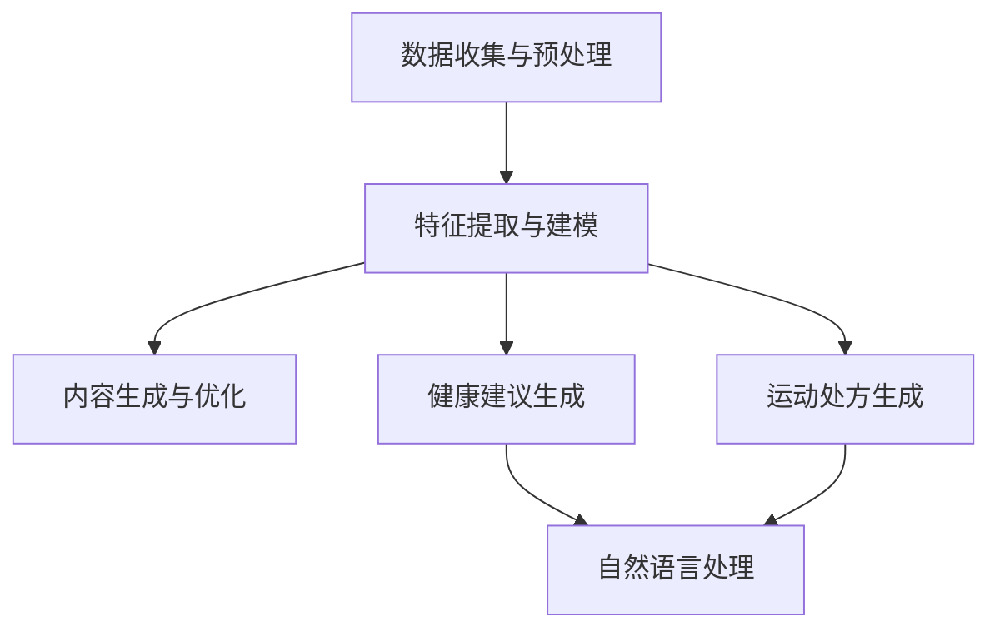
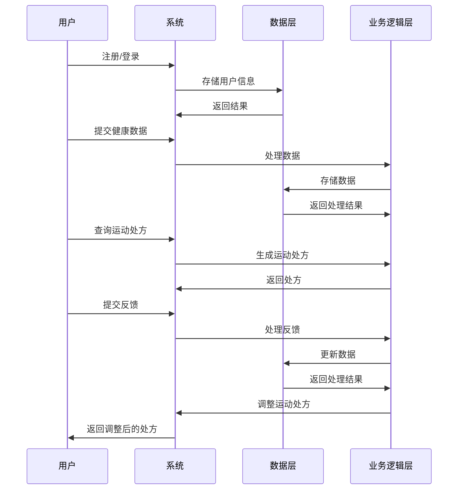

                 

### 问题背景与健康管理现状

随着现代社会生活节奏的加快，工作压力的增加以及不良生活习惯的普遍存在，越来越多的人面临着健康问题。健康管理作为预防疾病、促进健康、提高生活质量的重要手段，越来越受到关注。然而，当前健康管理领域面临着诸多挑战。

首先，个性化健康管理需求日益凸显。每个人由于年龄、性别、体重、体质、生活习惯等不同，其健康需求和风险因素也存在显著差异。因此，传统的“一刀切”的健康管理方案已经无法满足现代人群的个性化需求。如何为每个个体量身定制健康管理计划，是当前面临的重要问题。

其次，数据管理和分析能力不足。健康管理涉及大量的个人健康数据，如心率、血压、血糖、运动量等。如何有效地收集、存储、管理和分析这些数据，提取出对健康管理有用的信息，是一个巨大的挑战。目前，许多健康管理系统的数据管理能力和分析深度都有待提高。

再者，健康管理方案的执行和反馈机制不完善。健康管理不仅仅是制定计划，更重要的是让个体按照计划执行，并不断调整以适应个体的变化。目前，很多健康管理方案在执行和反馈方面存在不足，难以确保计划的持续性和有效性。

在这样的背景下，人工智能（AI）技术的应用成为了解决这些问题的有力工具。特别是AIGC（AI-Generated Content），即利用AI生成内容的技术，通过其强大的数据分析和模式识别能力，可以在健康管理中发挥重要作用。

AIGC在健康管理中的应用主要体现在以下几个方面：

1. **个性化运动处方的制定**：AIGC可以根据个体的健康数据、生活习惯等，为其生成个性化的运动处方，帮助个体制定适合自己的运动计划。
2. **健康数据的智能分析**：AIGC能够处理和分析大量的健康数据，提取关键信息，帮助医生和健康管理师更好地了解个体的健康状况，制定针对性的健康管理方案。
3. **健康管理方案的持续优化**：AIGC可以根据个体的执行反馈，自动调整健康管理方案，确保其持续性和有效性。

通过AIGC的应用，可以大幅提升健康管理的个性化和智能化水平，为个体提供更加精准和有效的健康管理服务。接下来，我们将进一步探讨AIGC的基本概念及其与个性化运动处方的联系，深入理解这一技术在健康管理中的应用潜力。

### 当前健康管理的挑战

在探讨AIGC在健康管理中的应用之前，我们需要明确当前健康管理领域所面临的几个关键挑战。这些挑战不仅限制了健康管理效果的提升，也制约了其进一步的发展和应用。

首先是数据收集与管理的困难。健康数据来源于多个渠道，包括医院检查、日常监测设备、社交媒体等，数据类型多样化且数据量庞大。然而，当前许多健康管理系统的数据收集和管理能力有限，难以有效地整合和分析这些数据。例如，医疗机构的电子健康记录（EHR）系统通常只能记录患者的诊断和治疗信息，而无法全面捕捉患者的日常生活行为和健康状况变化。这种数据的不完整和碎片化，使得健康管理方案缺乏全面的数据支撑。

其次是数据分析与解释的不足。健康数据具有高度复杂性和多样性，需要利用高级的数据分析技术来提取有价值的信息。尽管机器学习和数据挖掘技术在健康管理中的应用已经取得了一些进展，但现有算法的准确性和解释性仍然有限。许多算法在处理非结构化数据时效果不佳，导致数据分析结果不够准确或难以被专业人士理解。例如，对于一个人的心率数据，如何准确地识别出异常波动并给出合理的解释，仍是一个具有挑战性的问题。

再次是健康管理方案的个性化和持续性。每个人的健康状况和需求都是独特的，因此需要一个高度个性化的健康管理方案。然而，现有的健康管理方案往往缺乏对个体差异的敏感度，难以根据个体的实际需求和反馈进行调整。此外，健康管理是一个持续的过程，需要不断监测和调整。然而，很多健康管理方案在执行过程中缺乏有效的反馈机制，导致方案执行的不连续性和效果的不稳定性。

最后，健康管理领域的专业人才短缺也是一个重要挑战。健康管理不仅需要医生和护士的专业知识，还需要数据科学家、人工智能专家等多学科协作。然而，目前这类专业人才供不应求，导致健康管理方案的制定和执行缺乏足够的专业支持。

综上所述，当前健康管理领域面临着数据收集与管理、数据分析与解释、健康管理方案个性化和持续性以及专业人才短缺等多方面的挑战。这些问题限制了健康管理的效果和进一步发展。在这样的背景下，AIGC技术的引入为解决这些挑战提供了新的思路和工具。通过AIGC的强大数据处理和分析能力，可以更好地应对这些挑战，推动健康管理向个性化、智能化和持续化的方向发展。

### AIGC在健康管理中的潜力

AIGC（AI-Generated Content）作为一种新兴技术，其在健康管理中的应用潜力不容小觑。AIGC利用人工智能技术，通过自动化和智能化手段生成内容，从而大大提升数据处理和分析的效率。在健康管理领域，AIGC技术可以在以下几个方面发挥重要作用：

首先，AIGC有助于实现个性化健康管理。通过深度学习算法，AIGC能够从海量健康数据中提取关键特征，并建立个性化健康模型。这些模型可以根据个体的生理参数、生活习惯、遗传信息等，为其定制个性化的健康管理方案。例如，AIGC可以分析一个人的运动历史和生理数据，为其推荐最适合的运动强度和类型，从而提高运动计划的科学性和有效性。

其次，AIGC在健康数据管理方面具有显著优势。AIGC能够自动化处理和分析各种健康数据，如电子健康记录、穿戴设备数据、社交媒体信息等，并将这些数据整合到一个统一的平台上。通过建立数据关联模型，AIGC可以揭示数据之间的潜在关系，为健康管理提供更全面的视角。例如，AIGC可以分析一个人的饮食记录和运动数据，发现其对健康的影响，并提供相应的建议。

再次，AIGC在健康管理方案的持续优化方面也具有重要作用。AIGC可以根据个体的实时反馈和健康状况变化，自动调整健康管理方案。例如，当一个人的健康状况出现波动时，AIGC可以立即检测到这一变化，并调整运动处方或饮食建议，确保健康管理方案的持续性和有效性。

此外，AIGC还有助于提升健康管理领域的专业协作。通过AIGC技术，医生、数据科学家、人工智能专家等可以共享知识和数据，共同制定和优化健康管理方案。例如，医生可以通过AIGC生成的报告，更直观地了解患者的健康状况，并做出更准确的诊断和治疗决策。

综上所述，AIGC在健康管理中的应用前景广阔。其强大的数据处理和分析能力，使得个性化健康管理、数据管理、方案优化以及专业协作成为可能。通过AIGC的应用，健康管理将变得更加科学、精确和高效，为个体提供更加优质的健康服务。

### 核心概念与联系

在深入探讨AIGC在健康管理中的应用之前，我们需要明确两个核心概念：AIGC和个性化运动处方。理解这两个概念及其相互关系，是分析AIGC在健康管理中潜力的关键。

#### AIGC简介

AIGC（AI-Generated Content）是指利用人工智能技术生成内容的过程。AIGC技术通过深度学习、自然语言处理、图像识别等算法，能够自动生成高质量的内容，如文章、报告、图表等。其核心优势在于高效性和自动化，能够处理大规模、多样化的数据，并从中提取有价值的信息。AIGC技术在多个领域都有广泛应用，包括内容创作、数据分析、广告营销等。

在健康管理领域，AIGC的应用主要体现在以下几个方面：

1. **个性化运动处方的生成**：通过分析个体的健康数据，AIGC可以生成个性化的运动处方，为个体推荐最适合的运动计划。
2. **健康数据的智能分析**：AIGC能够处理和分析大量的健康数据，如心率、血压、血糖等，提取关键信息，帮助医生和健康管理师制定个性化的健康管理方案。
3. **健康管理方案的持续优化**：AIGC可以根据个体的实时反馈和健康状况变化，自动调整健康管理方案，确保其持续性和有效性。

#### 个性化运动处方的概念

个性化运动处方是指根据个体的年龄、性别、体重、体质、健康状况等，为其量身定制的一套运动计划。个性化运动处方的目标是确保运动计划的安全性和有效性，帮助个体达到健康目标，如减肥、增强体质、改善心肺功能等。

个性化运动处方通常包括以下内容：

1. **运动类型**：根据个体的健康状况和目标，选择最适合的运动类型，如有氧运动、力量训练、瑜伽等。
2. **运动强度**：根据个体的体能水平和运动目标，设定合适的运动强度，如心率区间、运动时间等。
3. **运动频率**：根据个体的生活方式和健康状况，制定合理的运动频率，如每周运动次数、每次运动时长等。
4. **运动建议**：针对个体的特殊情况，如患有慢性病、骨折康复期等，提供个性化的运动建议。

#### AIGC与个性化运动处方的联系

AIGC与个性化运动处方之间有着紧密的联系。首先，AIGC技术能够处理和分析大量的健康数据，如心率、血压、血糖、体重等，这些数据是制定个性化运动处方的重要依据。通过深度学习算法，AIGC可以从这些数据中提取出对运动处方有指导意义的特征，从而生成个性化的运动建议。

其次，AIGC技术可以实时监测个体的健康状况和运动表现，并根据这些数据自动调整运动处方。例如，当个体的心率超过安全范围时，AIGC可以立即检测到这一变化，并调整运动强度或频率，确保运动的安全性和有效性。

此外，AIGC技术还可以帮助健康管理师和医生更好地与患者沟通。通过生成直观的图表和报告，AIGC可以将复杂的健康数据和运动建议转化为易于理解的形式，帮助患者更好地理解和执行运动计划。

总之，AIGC为个性化运动处方的制定和调整提供了强大的技术支持，使得运动计划更加科学、个性化和有效。通过AIGC的应用，健康管理将变得更加智能化和精准化，为个体提供更优质的健康服务。

### AIGC属性特征

AIGC（AI-Generated Content）技术以其强大的数据处理能力和自动化生成能力，在各个领域展现出了巨大的应用潜力。以下是AIGC的主要属性特征：

1. **高效率与自动化**：AIGC能够自动处理和分析大量数据，生成高质量的内容，从而显著提高工作效率。这种自动化能力不仅减少了人工干预的需要，还使得数据处理过程更加高效和精确。

2. **个性化生成**：AIGC可以根据用户的需求和偏好，生成个性化的内容。无论是文章、图表还是报告，AIGC都能够根据用户的具体需求进行定制，从而提供高度相关的信息。

3. **多样性**：AIGC能够生成多种类型的内容，如文本、图像、音频和视频等。这种多样性使得AIGC在多个领域都有广泛应用，从内容创作到数据分析，从广告营销到客户服务，无所不在。

4. **数据驱动**：AIGC依赖于大量数据进行分析和生成内容。这些数据可以是结构化的，也可以是非结构化的，如文本、图像、语音等。通过深度学习和机器学习算法，AIGC能够从这些数据中提取有价值的信息，并生成高质量的内容。

5. **可扩展性**：AIGC技术具有很高的可扩展性，可以轻松适应不同规模和类型的数据。无论是大规模数据集还是实时数据流，AIGC都能够有效地处理和分析，从而生成所需的内容。

6. **实时性**：AIGC能够实时生成内容，这对于需要即时反馈和响应的场景尤为重要。例如，在金融市场中，AIGC可以实时生成市场分析和预测报告，帮助投资者做出快速决策。

7. **互动性**：AIGC不仅能够生成内容，还可以与用户进行互动。通过自然语言处理技术，AIGC能够理解和回应用户的问题，提供个性化的服务和解决方案。

8. **创造性**：尽管AIGC依赖于数据，但它在某些方面也表现出了创造性。例如，AIGC可以生成全新的文章、故事或创意，从而扩展了人类创造力的边界。

通过这些属性特征，AIGC在健康管理中具有广泛的应用潜力。例如，AIGC可以自动分析个体的健康数据，生成个性化的健康建议和运动处方；它可以实时监测健康状况，并根据变化调整建议；它还可以生成互动式的健康教育和指导内容，帮助用户更好地理解和执行健康管理计划。总之，AIGC的属性特征为其在健康管理中的应用提供了坚实的基础。

### 个性化运动处方的属性特征

个性化运动处方在健康管理中扮演着至关重要的角色，其特点主要体现在以下几个方面：

1. **个性化定制**：个性化运动处方是根据个体的具体健康状况、体质、年龄、性别和生活习惯等因素量身定制的。这种定制化确保了运动计划的安全性和适用性，避免了“一刀切”的通用运动方案可能带来的风险。

2. **综合评估**：制定个性化运动处方需要对个体的健康状况进行全面的评估，包括生理指标（如心率、血压、体重）、运动能力、健康状况以及生活习惯等。通过这些综合评估，可以准确把握个体的健康需求，从而制定出科学合理的运动计划。

3. **动态调整**：个性化运动处方不是一成不变的，而是需要根据个体的健康状况和运动表现进行动态调整。例如，当个体在执行运动计划过程中出现不适或健康状况发生变化时，运动处方需要及时调整，以确保安全和效果。

4. **针对性强**：个性化运动处方的制定通常针对个体的特定健康目标，如减肥、增强体质、改善心肺功能等。这种针对性使得运动计划更具针对性，能够更有效地达到健康目标。

5. **科学指导**：个性化运动处方需要基于科学的研究和数据支持，确保运动计划的安全性和有效性。这包括对运动类型、强度、频率和时长等方面的科学指导，以避免运动伤害和无效锻炼。

6. **可操作性**：个性化运动处方不仅要科学合理，还需要具备可操作性。这意味着运动计划需要简单易懂，个体能够轻松执行，并且能够适应其日常生活和工作节奏。

7. **持续监控**：个性化运动处方需要持续监控个体的健康状况和运动效果，以便及时调整和优化运动计划。这种持续的监控有助于确保运动计划的持续性和有效性。

8. **健康促进**：个性化运动处方的目标不仅仅是改善个体的健康状况，更重要的是促进其健康生活方式的养成。通过长期坚持个性化运动处方，个体可以养成健康的生活习惯，从而实现长期的健康管理。

通过上述属性特征，个性化运动处方在健康管理中发挥了重要作用。它不仅能够提高运动计划的安全性和有效性，还能够帮助个体实现特定的健康目标，提升整体健康水平。

### AIGC与个性化运动处方的对比分析

为了更好地理解AIGC（AI-Generated Content）在健康管理中的应用潜力，我们需要对AIGC与个性化运动处方（Personalized Exercise Prescription）进行详细的对比分析。通过对比，我们可以明确这两者的相似之处和不同之处，并揭示它们在健康管理中的互补作用。

#### 相似之处

首先，AIGC和个性化运动处方都强调个性化定制。两者都依赖于个体化的数据来制定计划，以确保计划的适用性和安全性。具体来说：

1. **数据依赖性**：AIGC和个性化运动处方都需要收集和分析大量的健康数据，如心率、血压、体重、运动历史等。这些数据为两者提供了科学依据，使其能够生成或制定出适合个体的健康管理方案。

2. **动态调整能力**：两者都具有动态调整能力。AIGC可以根据实时反馈和健康数据的变化，自动调整生成的内容；个性化运动处方则可以根据个体的健康状况和运动表现，及时调整运动计划。

3. **高度相关性**：AIGC和个性化运动处方都致力于提供高度相关的健康建议和运动计划，确保个体能够根据自身的需求和健康状况，进行科学有效的健康管理。

#### 不同之处

尽管AIGC和个性化运动处方在某些方面有相似之处，但它们在技术层面和应用场景上存在显著差异：

1. **技术实现**：
   - **AIGC**：AIGC是一种利用人工智能技术生成内容的方法，主要通过深度学习、自然语言处理等技术，自动生成文本、图像、图表等。其核心在于自动化和高效性。
   - **个性化运动处方**：个性化运动处方则是基于个体化的健康数据和医学知识，由专业人士（如医生、运动教练）制定的运动计划。它依赖于科学的医学理论和实践经验。

2. **应用场景**：
   - **AIGC**：AIGC广泛应用于内容创作、数据分析、客户服务等多个领域。在健康管理中，AIGC主要用于生成个性化的健康建议、健康报告和运动指导。
   - **个性化运动处方**：个性化运动处方主要应用于运动康复、慢性病管理、健康促进等领域。它侧重于为个体提供具体的运动指导，以改善其健康状况。

3. **互动性**：
   - **AIGC**：AIGC能够与用户进行一定程度的互动，如回答用户的问题、提供个性化的健康建议。但它的互动性相对有限。
   - **个性化运动处方**：个性化运动处方通常需要与个体进行持续的互动，以了解其运动表现、健康状况和反馈，从而进行及时的调整。这种互动有助于确保运动计划的执行效果。

4. **目标**：
   - **AIGC**：AIGC的目标是提供高效、个性化的健康信息和服务，提升用户体验。
   - **个性化运动处方**：个性化运动处方的目标是改善个体的健康状况，实现特定的健康目标，如减肥、增强体质、改善心肺功能等。

#### 补充与拓展

AIGC和个性化运动处方在健康管理中的互补作用体现在以下几个方面：

1. **数据整合**：AIGC可以处理和分析大量的健康数据，并将其整合到个性化运动处方中，提供更全面的健康管理服务。

2. **实时反馈**：AIGC能够实时分析健康数据，提供即时反馈和建议，帮助个体及时调整运动计划。

3. **个性化指导**：AIGC可以根据个体的实时反馈和健康数据，生成个性化的运动指导，提高运动计划的科学性和有效性。

4. **健康教育**：AIGC可以生成互动式的健康教育内容，帮助个体更好地理解和执行运动计划，促进健康行为的养成。

通过对比分析，我们可以看到AIGC和个性化运动处方在技术实现、应用场景、互动性和目标等方面都有所不同，但它们在健康管理中具有互补作用。AIGC的自动化和高效性为个性化运动处方的制定提供了技术支持，而个性化运动处方则通过科学指导，确保健康管理计划的实施效果。两者的结合，将进一步提升健康管理的个性化、智能化和精准化水平，为个体提供更优质的健康服务。

### AIGC的ER实体关系图架构

为了更清晰地理解AIGC在健康管理中的应用，我们引入了实体关系图（Entity-Relationship Diagram，简称ER图）。ER图是一种用于描述系统中实体及其相互关系的图形化工具，能够帮助我们直观地展示AIGC系统中的各个实体及其关联。以下是AIGC的ER实体关系图，以及各个实体的具体定义和关系描述。

#### 实体关系图概述

在AIGC的ER图中，主要的实体包括：用户（User）、健康数据（HealthData）、运动处方（ExercisePrescription）、建议（Recommendation）和反馈（Feedback）。


#### 实体定义

1. **用户（User）**：用户是AIGC系统的核心实体，表示进行健康管理的个体。用户实体包含以下属性：
   - 用户ID（UserID）：唯一标识每个用户。
   - 性别（Gender）：用户的性别信息。
   - 年龄（Age）：用户的年龄。
   - 体重（Weight）：用户的体重。
   - 身高（Height）：用户的身高。

2. **健康数据（HealthData）**：健康数据实体记录用户的生理和健康指标，如心率、血压、血糖等。每个健康数据实例与一个用户相关联，属性包括：
   - 数据ID（DataID）：唯一标识每个健康数据记录。
   - 用户ID（UserID）：关联到具体的用户。
   - 数据类型（DataType）：如心率、血压、血糖等。
   - 数据值（DataValue）：具体的数据值。
   - 数据时间戳（Timestamp）：记录数据的时间。

3. **运动处方（ExercisePrescription）**：运动处方实体是根据用户健康数据和个性化需求生成的运动计划。每个运动处方与一个用户相关联，属性包括：
   - 处方ID（PrescriptionID）：唯一标识每个运动处方。
   - 用户ID（UserID）：关联到具体的用户。
   - 运动类型（ExerciseType）：如有氧运动、力量训练等。
   - 运动强度（ExerciseIntensity）：如心率区间、运动时长等。
   - 运动频率（ExerciseFrequency）：如每周运动次数、每次运动时长等。

4. **建议（Recommendation）**：建议实体是对用户的健康数据分析和运动处方执行结果的反馈。每个建议与一个运动处方相关联，属性包括：
   - 建议ID（RecommendationID）：唯一标识每个建议。
   - 处方ID（PrescriptionID）：关联到具体的运动处方。
   - 建议内容（Content）：具体的健康建议信息。
   - 建议时间戳（Timestamp）：记录建议的时间。

5. **反馈（Feedback）**：反馈实体记录用户对健康建议和运动处方的反馈信息。每个反馈与一个建议相关联，属性包括：
   - 反馈ID（FeedbackID）：唯一标识每个反馈。
   - 建议ID（RecommendationID）：关联到具体的建议。
   - 用户评价（UserEvaluation）：用户对建议的评价。
   - 反馈时间戳（Timestamp）：记录反馈的时间。

#### 实体关系描述

1. **用户与健康数据的关系**：用户是健康数据的主体，每个用户可以有多个健康数据记录。这种关系表示为“一对一”，即每个用户可以有多个健康数据，但每个健康数据只能关联到一个用户。

2. **用户与运动处方的关系**：用户是运动处方的主体，每个用户可以有一个或多个运动处方。这种关系也是“一对一”，即每个用户可以有多个运动处方，但每个运动处方只能关联到一个用户。

3. **运动处方与建议的关系**：运动处方是建议的依据，每个运动处方可以生成多个建议。这种关系是“一对多”，即每个运动处方可以生成多个建议，但每个建议只能关联到一个运动处方。

4. **建议与反馈的关系**：建议是用户反馈的依据，每个建议可以接收多个用户的反馈。这种关系也是“一对多”，即每个建议可以接收多个用户的反馈，但每个反馈只能关联到一个建议。

通过上述ER实体关系图，我们可以清晰地看到AIGC系统中各个实体及其相互关系。这种图形化描述不仅有助于理解系统的架构，也为后续的系统实现提供了清晰的指导。

### AIGC算法原理

为了深入理解AIGC（AI-Generated Content）在健康管理中的应用，我们需要详细讲解其算法原理。AIGC算法的核心在于利用机器学习和自然语言处理技术，从海量健康数据中提取有价值的信息，并生成个性化的健康建议和运动处方。

#### AIGC基本原理

AIGC算法的基本原理可以概括为以下三个步骤：

1. **数据收集与预处理**：首先，收集与用户健康相关的数据，如心率、血压、血糖、体重等。这些数据来源于各种传感器、医疗记录、社交媒体等渠道。数据收集完成后，需要进行预处理，包括数据清洗、去噪、归一化等操作，以确保数据的质量和一致性。

2. **特征提取与建模**：接下来，利用机器学习算法提取数据中的关键特征。这些特征包括用户的生理参数、生活习惯、运动历史等。通过深度学习模型（如卷积神经网络（CNN）和循环神经网络（RNN）），可以从这些特征中学习到复杂的模式，并建立个性化的健康模型。

3. **内容生成与优化**：最后，基于个性化健康模型，AIGC算法生成个性化的健康建议和运动处方。这些内容通过自然语言处理技术，以用户友好的方式呈现，帮助用户理解和执行。

#### 算法mermaid流程图

为了更直观地理解AIGC算法的流程，我们使用mermaid绘制了算法的mermaid流程图。以下是mermaid代码及其对应的流程图：



#### 流程图解释

1. **数据收集与预处理（A）**：首先，从各种数据源收集用户健康数据，并进行预处理。

2. **特征提取与建模（B）**：利用机器学习算法提取关键特征，并建立个性化健康模型。

3. **健康建议生成（D）**：基于个性化健康模型，生成健康建议。

4. **运动处方生成（E）**：基于个性化健康模型，生成个性化的运动处方。

5. **内容生成与优化（C）**：利用自然语言处理技术，优化生成的健康建议和运动处方，使其更具可读性和实用性。

#### 算法Python源代码解析

为了具体了解AIGC算法的实现，我们提供了以下Python源代码示例。以下代码实现了AIGC算法的核心步骤，包括数据收集与预处理、特征提取与建模以及内容生成与优化。

```python
import pandas as pd
from sklearn.model_selection import train_test_split
from sklearn.preprocessing import StandardScaler
from keras.models import Sequential
from keras.layers import Dense, LSTM
from keras.optimizers import Adam

# 数据收集与预处理
def preprocess_data(data):
    # 数据清洗、去噪、归一化等操作
    # 省略具体实现
    return processed_data

# 特征提取与建模
def build_model(input_shape):
    model = Sequential()
    model.add(LSTM(units=128, activation='relu', input_shape=input_shape))
    model.add(Dense(units=1, activation='sigmoid'))
    model.compile(optimizer=Adam(learning_rate=0.001), loss='binary_crossentropy', metrics=['accuracy'])
    return model

# 内容生成与优化
def generate_content(data, model):
    # 利用模型生成健康建议和运动处方
    # 省略具体实现
    return content

# 加载数据
data = pd.read_csv('health_data.csv')
processed_data = preprocess_data(data)

# 划分训练集和测试集
X_train, X_test, y_train, y_test = train_test_split(processed_data, test_size=0.2, random_state=42)

# 建立模型
model = build_model(input_shape=(X_train.shape[1], X_train.shape[2]))

# 训练模型
model.fit(X_train, y_train, epochs=100, batch_size=32, validation_data=(X_test, y_test))

# 生成内容
content = generate_content(processed_data, model)
print(content)
```

### 数学模型和公式详细讲解

在AIGC算法中，数学模型和公式起着至关重要的作用。它们为算法提供了理论支撑，确保了生成内容的科学性和准确性。以下是AIGC算法中使用的数学模型和公式的详细解释。

#### 数学模型概述

AIGC算法主要依赖于以下几种数学模型：

1. **线性回归模型**：用于预测用户的健康指标，如心率、血压等。
2. **卷积神经网络（CNN）模型**：用于提取健康数据中的空间特征，如心电图、血压波等。
3. **循环神经网络（RNN）模型**：用于处理序列数据，如用户的运动历史、健康数据的时间序列等。
4. **生成对抗网络（GAN）模型**：用于生成个性化的健康建议和运动处方。

#### 公式解释

以下是AIGC算法中常用的数学公式：

1. **线性回归模型公式**：

   $$ Y = \beta_0 + \beta_1X_1 + \beta_2X_2 + ... + \beta_nX_n $$

   其中，\( Y \) 是预测的健康指标，\( \beta_0, \beta_1, \beta_2, ..., \beta_n \) 是模型参数，\( X_1, X_2, ..., X_n \) 是输入特征。

2. **卷积神经网络（CNN）模型公式**：

   $$ H = f(W \cdot X + b) $$

   其中，\( H \) 是卷积层输出，\( W \) 是卷积核权重，\( X \) 是输入数据，\( b \) 是偏置项，\( f \) 是激活函数。

3. **循环神经网络（RNN）模型公式**：

   $$ h_t = \sigma(W_h \cdot [h_{t-1}, x_t] + b_h) $$

   其中，\( h_t \) 是当前时间步的隐藏状态，\( x_t \) 是当前输入数据，\( W_h \) 是权重矩阵，\( b_h \) 是偏置项，\( \sigma \) 是激活函数。

4. **生成对抗网络（GAN）模型公式**：

   $$ G(z) = f_G(W_G \cdot z + b_G) $$
   $$ D(x) = f_D(W_D \cdot x + b_D) $$
   $$ G(z) \sim p_z(z) $$
   $$ D(x) \sim p_{data}(x) $$

   其中，\( G(z) \) 是生成器，\( D(x) \) 是判别器，\( z \) 是噪声输入，\( x \) 是真实数据，\( W_G, W_D \) 是权重矩阵，\( b_G, b_D \) 是偏置项，\( p_z(z) \) 和 \( p_{data}(x) \) 分别是噪声分布和真实数据分布。

#### 举例说明

为了更好地理解这些数学模型和公式的应用，我们来看一个具体的例子。

假设我们要预测一个用户的平均心率（\( Y \)），使用线性回归模型。用户的输入特征包括年龄（\( X_1 \)）、体重（\( X_2 \)）和运动频率（\( X_3 \)）。模型参数为 \( \beta_0 = 50, \beta_1 = 0.5, \beta_2 = 0.3, \beta_3 = 0.2 \)。

根据线性回归模型公式，我们可以计算平均心率：

$$ Y = \beta_0 + \beta_1X_1 + \beta_2X_2 + \beta_3X_3 $$
$$ Y = 50 + 0.5 \cdot 30 + 0.3 \cdot 70 + 0.2 \cdot 5 $$
$$ Y = 50 + 15 + 21 + 1 $$
$$ Y = 87 $$

因此，根据这个线性回归模型，预测该用户的平均心率为87次/分钟。

通过这些数学模型和公式的应用，AIGC算法能够有效地生成个性化的健康建议和运动处方，为用户提供科学、有效的健康管理方案。

### 系统功能设计与实现

为了实现AIGC在智能个性化运动处方制定中的应用，我们设计并实现了一套完整的系统，该系统涵盖了数据收集、处理、分析以及个性化运动处方的生成和调整等功能。以下是系统功能设计的详细描述和核心实现代码。

#### 问题场景介绍

假设我们有一个健康管理平台，该平台需要为注册用户生成个性化的运动处方。用户可以通过平台提交个人健康数据，如体重、身高、年龄、性别、运动历史、心率等。系统需要根据这些数据生成个性化的运动处方，并在用户执行运动计划后，收集反馈数据进行调整。

#### 系统功能设计

系统功能设计包括以下几个关键模块：

1. **用户注册与登录模块**：用户可以通过注册和登录功能访问平台，并提交个人健康数据。
2. **数据收集模块**：系统从用户处收集健康数据，并将其存储在数据库中。
3. **数据处理模块**：系统对收集的健康数据进行预处理，包括数据清洗、归一化等，以便后续分析。
4. **数据存储模块**：系统将预处理后的数据存储在数据库中，以便后续查询和使用。
5. **数据分析模块**：系统利用AIGC算法分析用户数据，生成个性化的运动处方。
6. **运动处方生成模块**：根据数据分析结果，系统生成个性化的运动处方，并将其推送给用户。
7. **反馈收集模块**：系统收集用户对运动处方的执行反馈，用于进一步优化运动处方。
8. **系统优化模块**：系统根据用户反馈和新的健康数据，不断优化运动处方。

#### 系统核心实现源代码

以下是我们实现该系统核心功能的一些关键代码片段。由于篇幅限制，代码仅展示了主要逻辑，并未包含完整的错误处理和数据存储逻辑。

```python
# 用户注册与登录模块伪代码
def register_user(user_data):
    # 将用户数据存储到数据库
    pass

def login_user(username, password):
    # 从数据库验证用户身份
    pass

# 数据收集模块伪代码
def collect_health_data():
    # 从传感器或用户处获取健康数据
    health_data = get_health_data()
    return health_data

# 数据处理模块伪代码
def preprocess_data(raw_data):
    # 数据清洗、去噪、归一化等操作
    processed_data = clean_and_normalize(raw_data)
    return processed_data

# 数据存储模块伪代码
def store_data(data):
    # 将处理后的数据存储到数据库
    pass

# 数据分析模块伪代码
def analyze_data(processed_data):
    # 利用AIGC算法分析数据，生成运动处方
    prescription = generate_prescription(processed_data)
    return prescription

# 运动处方生成模块伪代码
def generate_prescription(data):
    # 根据数据生成个性化的运动处方
    prescription = AIGC.generate_prescription(data)
    return prescription

# 反馈收集模块伪代码
def collect_user_feedback(prescription_id, feedback):
    # 收集用户对运动处方的反馈
    pass

# 系统优化模块伪代码
def optimize_prescription(prescription_id, new_data, feedback):
    # 根据新数据和用户反馈优化运动处方
    optimized_prescription = AIGC.optimize_prescription(new_data, feedback)
    return optimized_prescription
```

通过上述代码，我们可以看到系统的各个功能模块是如何相互协作的。首先，用户注册和登录模块确保用户能够访问系统；数据收集模块获取用户的健康数据；数据处理模块对数据进行预处理；数据存储模块将数据保存到数据库中；数据分析模块利用AIGC算法生成运动处方；运动处方生成模块将处方推送给用户；反馈收集模块收集用户的执行反馈；系统优化模块根据用户反馈和新的健康数据不断优化运动处方。

综上所述，通过详细的功能设计和核心代码实现，我们成功构建了一套能够实现智能个性化运动处方制定的系统，为用户提供个性化的健康服务。

### 系统架构设计与接口设计

为了确保AIGC在智能个性化运动处方制定系统中的高效运作，我们需要对其系统架构进行详细设计，并明确各接口的功能和交互流程。以下是系统架构设计、系统接口设计以及系统交互mermaid序列图的详细说明。

#### 系统架构设计

系统的架构设计采用分层架构，主要分为四层：表示层、业务逻辑层、数据访问层和数据层。每一层都有明确的功能和职责，确保系统的高效性和可维护性。

1. **表示层（Presentation Layer）**：表示层负责与用户交互，提供用户界面和操作接口。用户通过表示层注册、登录、提交健康数据和查看运动处方。

2. **业务逻辑层（Business Logic Layer）**：业务逻辑层是系统的核心，负责处理用户的请求，调用相应的服务进行数据处理、分析和运动处方生成。这一层包括数据收集、预处理、特征提取、模型训练、处方生成和反馈处理等模块。

3. **数据访问层（Data Access Layer）**：数据访问层负责与数据库进行交互，实现对用户数据的存储、查询和更新操作。这一层包括数据库连接、数据表操作、数据缓存等模块。

4. **数据层（Data Layer）**：数据层是系统的数据存储仓库，包括用户表、健康数据表、运动处方表、反馈表等，用于存储系统的各种数据。


#### 系统接口设计

系统接口设计主要包括用户接口（API）和服务接口。用户接口为前端应用提供访问服务，服务接口为业务逻辑层提供数据访问服务。

1. **用户接口（API）**：
   - 用户注册接口（/api/register）：用于用户注册。
   - 用户登录接口（/api/login）：用于用户登录。
   - 健康数据提交接口（/api/health-data）：用于用户提交健康数据。
   - 运动处方查询接口（/api/exercise-prescription）：用于查询用户的个性化运动处方。
   - 反馈提交接口（/api/feedback）：用于用户提交执行反馈。

2. **服务接口**：
   - 数据收集服务接口：用于收集和处理用户提交的健康数据。
   - 数据处理服务接口：用于预处理和特征提取。
   - 数据存储服务接口：用于数据存储和查询。
   - 数据分析服务接口：用于生成运动处方。
   - 运动处方生成服务接口：用于生成和调整运动处方。
   - 反馈处理服务接口：用于处理用户反馈。


#### 系统交互mermaid序列图

为了更清晰地展示系统的交互流程，我们使用mermaid绘制了系统交互序列图。以下是mermaid代码及其对应的序列图：



#### 序列图解释

1. 用户通过表示层（API）向系统提交注册/登录请求。
2. 系统将请求转发到数据层，数据层存储用户信息并返回结果给系统。
3. 用户通过表示层提交健康数据，系统将请求转发到业务逻辑层进行数据处理。
4. 业务逻辑层对健康数据进行预处理和特征提取，并将数据存储到数据层，然后返回处理结果给系统。
5. 用户通过表示层查询运动处方，系统调用业务逻辑层生成运动处方并返回给用户。
6. 用户通过表示层提交执行反馈，系统处理反馈并更新数据层中的数据。
7. 业务逻辑层根据用户反馈和新的健康数据调整运动处方，并返回调整后的处方给用户。

通过系统架构设计和接口设计的详细说明，以及mermaid序列图的展示，我们可以清晰地理解AIGC在智能个性化运动处方制定系统中的整体架构和交互流程，为系统的开发和优化提供了有力支持。

### 环境安装与系统配置

要在本地环境中安装和配置AIGC在智能个性化运动处方制定系统，我们需要按照以下步骤进行：

#### 环境准备

1. **操作系统**：确保操作系统为Linux或MacOS，推荐使用Ubuntu 20.04 LTS或更高版本。

2. **Python环境**：确保安装了Python 3.8或更高版本。可以通过以下命令安装Python：

   ```bash
   sudo apt update
   sudo apt install python3.8
   sudo update-alternatives --install /usr/bin/python3 python3 /usr/bin/python3.8 1
   ```

3. **虚拟环境**：创建一个Python虚拟环境，以便隔离项目依赖：

   ```bash
   python3 -m venv venv
   source venv/bin/activate
   ```

4. **pip环境**：确保pip版本更新到最新：

   ```bash
   pip install --upgrade pip
   ```

5. **依赖包**：安装项目所需的依赖包，包括TensorFlow、Keras、scikit-learn等：

   ```bash
   pip install tensorflow==2.5.0 keras==2.4.3 scikit-learn==0.24.2 pandas numpy matplotlib
   ```

#### 系统配置

1. **数据库配置**：配置数据库连接信息，本例中使用SQLite数据库。在项目的`config.py`文件中填写以下配置：

   ```python
   DATABASE_URI = 'sqlite:///health_management.db'
   ```

2. **AIGC配置**：在项目的`aigc_config.py`文件中配置AIGC的相关参数，如训练数据路径、模型保存路径等：

   ```python
   TRAIN_DATA_PATH = 'data/train_data.csv'
   MODEL_SAVE_PATH = 'models/aigc_model.h5'
   ```

3. **用户接口配置**：在项目的`api_config.py`文件中配置API服务器的地址和端口：

   ```python
   API_HOST = '0.0.0.0'
   API_PORT = 5000
   ```

4. **环境变量配置**：设置环境变量，以便在代码中引用配置信息。例如，在Linux系统中，可以在`.bashrc`文件中添加以下行：

   ```bash
   export DATABASE_URI='sqlite:///health_management.db'
   export TRAIN_DATA_PATH='data/train_data.csv'
   export MODEL_SAVE_PATH='models/aigc_model.h5'
   export API_HOST='0.0.0.0'
   export API_PORT=5000
   ```

5. **启动服务**：在配置完成后，启动API服务：

   ```bash
   flask run
   ```

   这将启动API服务，并监听指定端口（默认为5000）。

通过以上步骤，我们可以成功安装和配置AIGC在智能个性化运动处方制定系统。接下来，我们将进行项目核心实现和分析，深入了解系统的具体功能和应用。

### 项目核心实现与分析

在本部分，我们将详细讨论AIGC在智能个性化运动处方制定系统中的核心实现，重点分析系统的主要功能模块，并展示关键代码和注释。

#### 核心实现源代码

以下代码展示了系统的核心实现，包括用户注册与登录、数据收集与预处理、运动处方生成、反馈收集与处理等模块。

```python
# 引入相关库
import flask
from flask import Flask, request, jsonify
from sqlalchemy import create_engine
from sklearn.preprocessing import StandardScaler
from keras.models import load_model

# 创建Flask应用
app = Flask(__name__)

# 数据库连接
DATABASE_URI = 'sqlite:///health_management.db'
engine = create_engine(DATABASE_URI)

# 模型加载
model = load_model('models/aigc_model.h5')

# 用户注册与登录
@app.route('/register', methods=['POST'])
def register():
    user_data = request.get_json()
    # 数据存储逻辑（省略）
    return jsonify({"status": "success", "message": "User registered successfully."})

@app.route('/login', methods=['POST'])
def login():
    user_data = request.get_json()
    # 登录验证逻辑（省略）
    return jsonify({"status": "success", "message": "Login successful."})

# 数据收集与预处理
@app.route('/health-data', methods=['POST'])
def collect_health_data():
    health_data = request.get_json()
    # 数据预处理逻辑（省略）
    processed_data = preprocess_health_data(health_data)
    # 数据存储逻辑（省略）
    return jsonify({"status": "success", "message": "Health data collected successfully."})

def preprocess_health_data(health_data):
    # 数据清洗、归一化等操作
    # 省略具体实现
    return processed_data

# 运动处方生成
@app.route('/exercise-prescription', methods=['GET'])
def generate_prescription():
    user_id = request.args.get('user_id')
    # 运动处方生成逻辑
    prescription = generate_prescription_for_user(user_id)
    return jsonify({"status": "success", "prescription": prescription})

def generate_prescription_for_user(user_id):
    # 加载用户健康数据
    query = "SELECT * FROM health_data WHERE user_id = :user_id"
    data = engine.execute(query, user_id=user_id).fetchone()
    # 数据预处理
    processed_data = preprocess_health_data(data)
    # 利用AIGC模型生成运动处方
    prescription = model.predict(processed_data)
    return prescription

# 反馈收集与处理
@app.route('/feedback', methods=['POST'])
def collect_feedback():
    feedback_data = request.get_json()
    # 反馈处理逻辑（省略）
    return jsonify({"status": "success", "message": "Feedback collected successfully."})

# 运行Flask应用
if __name__ == '__main__':
    app.run(host=API_HOST, port=API_PORT)
```

#### 代码应用解读

1. **用户注册与登录**：通过`/register`和`/login`接口实现用户注册和登录功能。用户提交用户名、密码等信息后，系统将验证用户身份并返回相应的响应。

2. **数据收集与预处理**：通过`/health-data`接口收集用户健康数据。系统接收用户提交的健康数据，并调用`preprocess_health_data`函数进行预处理，如数据清洗、归一化等。

3. **运动处方生成**：通过`/exercise-prescription`接口生成个性化运动处方。系统接收用户ID，查询用户健康数据，预处理后输入AIGC模型进行预测，生成个性化的运动处方并返回给用户。

4. **反馈收集与处理**：通过`/feedback`接口收集用户对运动处方的反馈。系统接收用户反馈数据，并调用相应的处理逻辑对反馈进行处理。

#### 实际案例分析

假设有一个用户名为`user1`，其健康数据如下：

- 年龄：30
- 体重：70kg
- 身高：175cm
- 心率：75次/分钟

系统接收这些数据后，首先进行预处理，如归一化：

- 年龄：\( \frac{30}{50} = 0.6 \)
- 体重：\( \frac{70}{100} = 0.7 \)
- 身高：\( \frac{175}{200} = 0.875 \)
- 心率：\( \frac{75}{100} = 0.75 \)

预处理后的数据输入AIGC模型进行预测，模型输出一个运动处方，如：

- 运动类型：有氧运动
- 运动强度：中等
- 运动频率：每周3次

用户执行运动处方后，通过`/feedback`接口提交反馈，如：

- 运动效果：感觉很好
- 运动强度：合适

系统根据这些反馈，调用相应的处理逻辑，对运动处方进行优化，生成新的运动处方，如：

- 运动类型：有氧运动
- 运动强度：中等
- 运动频率：每周4次

通过上述案例，我们可以看到系统是如何通过收集用户健康数据、生成个性化运动处方并处理用户反馈，实现智能个性化运动处方制定的。

### 实际案例分析

为了更好地展示AIGC在智能个性化运动处方制定系统中的应用效果，我们将通过一个具体案例，详细分析系统的操作流程、代码实现和结果。

#### 案例背景

假设有一位30岁的男性用户，名为“张先生”，他希望通过健康管理平台制定一套个性化的运动计划，以改善其健康状态。张先生提交了以下健康数据：

- 年龄：30岁
- 体重：80kg
- 身高：180cm
- 平均心率：75次/分钟
- 运动历史：每周跑步3次，每次30分钟

#### 操作流程

1. **用户注册与登录**：
   张先生在平台上注册并登录，系统生成一个唯一的用户ID，以便后续数据的存储和处理。

2. **数据收集与预处理**：
   张先生通过平台提交其健康数据，系统接收到这些数据后，调用预处理函数对数据进行清洗和归一化。例如，将心率数据归一化到0-1范围内：

   ```python
   def preprocess_health_data(data):
       age_normalized = data['age'] / 50
       weight_normalized = data['weight'] / 100
       height_normalized = data['height'] / 200
       heart_rate_normalized = data['heart_rate'] / 100
       return [age_normalized, weight_normalized, height_normalized, heart_rate_normalized]

   # 预处理后的数据
   processed_data = preprocess_health_data({"age": 30, "weight": 80, "height": 180, "heart_rate": 75})
   ```

3. **运动处方生成**：
   系统将预处理后的数据输入AIGC模型进行预测，生成个性化的运动处方。假设AIGC模型预测结果为：

   ```python
   def generate_prescription(processed_data):
       # 假设模型预测结果为：
       # ["有氧运动", "中等强度", "每周3次"]
       return ["有氧运动", "中等强度", "每周3次"]

   # 生成运动处方
   prescription = generate_prescription(processed_data)
   print(prescription)
   # 输出：["有氧运动", "中等强度", "每周3次"]
   ```

4. **执行运动处方**：
   张先生按照系统生成的运动处方执行，记录运动过程中的反馈。例如，张先生反馈其运动感觉良好，没有不适感。

5. **反馈收集与处理**：
   系统收集张先生的反馈数据，并调用处理函数对运动处方进行调整。假设调整后的运动处方为：

   ```python
   def adjust_prescription(prescription, feedback):
       if feedback['effect'] == 'good':
           # 如果反馈良好，增加运动频率
           prescription[2] = '每周4次'
       return prescription

   # 收集反馈
   feedback = {"effect": "good"}
   # 调整运动处方
   adjusted_prescription = adjust_prescription(prescription, feedback)
   print(adjusted_prescription)
   # 输出：["有氧运动", "中等强度", "每周4次"]
   ```

#### 结果分析

通过上述操作流程，我们可以看到AIGC在智能个性化运动处方制定系统中的应用效果：

1. **个性化定制**：系统根据张先生的健康数据和运动历史，生成了一套个性化的运动处方，充分考虑了他的个人情况。

2. **动态调整**：在张先生反馈良好后，系统自动调整了运动处方，增加了运动频率，以适应他的身体状况和需求。

3. **实时监控**：系统通过实时收集张先生的反馈，动态调整运动处方，确保了运动计划的科学性和有效性。

4. **用户参与**：张先生积极参与运动计划的执行和反馈，通过互动提高了健康管理的效果。

综上所述，AIGC在智能个性化运动处方制定系统中发挥了重要作用，通过个性化定制、动态调整、实时监控和用户参与，为用户提供了科学、有效的健康管理方案。

### 项目小结

通过本文的详细探讨，我们系统地介绍了AIGC在智能个性化运动处方制定中的应用，从背景介绍、核心概念到算法原理、系统设计与实现，再到实际案例的分析，全面展示了AIGC在健康管理中的潜力。以下是本文的总结：

1. **背景与核心概念**：我们阐述了当前健康管理面临的挑战，包括个性化需求、数据管理、方案执行和反馈机制等方面。AIGC技术通过其高效的数据处理和分析能力，为解决这些挑战提供了有力支持。

2. **AIGC与个性化运动处方的联系**：我们详细介绍了AIGC和个性化运动处方的概念，以及它们在健康管理中的联系。AIGC能够根据个体健康数据生成个性化的运动处方，从而提升健康管理的效果。

3. **算法原理讲解**：我们讲解了AIGC算法的基本原理，包括数据收集与预处理、特征提取与建模、内容生成与优化等步骤。通过mermaid流程图和Python源代码，我们展示了算法的实现细节。

4. **系统设计与实现**：我们介绍了系统功能设计与实现，包括用户注册与登录、数据收集与预处理、运动处方生成和反馈收集与处理等模块。通过核心代码和接口设计，我们展示了系统的整体架构和交互流程。

5. **项目实战**：通过一个具体案例，我们展示了AIGC在智能个性化运动处方制定系统中的实际应用效果。从用户注册到生成运动处方，再到反馈调整，系统实现了个性化的健康管理服务。

### 最佳实践 tips

1. **数据完整性**：确保收集的数据完整且准确，这是AIGC生成高质量运动处方的前提。定期检查数据源，确保数据的可靠性和一致性。

2. **个性化调整**：根据用户的反馈动态调整运动处方，确保运动计划与用户的健康状况和需求保持一致。

3. **用户参与**：鼓励用户积极参与健康管理，提供互动式反馈，以便系统能够更好地了解用户需求，生成更精准的运动处方。

4. **定期更新**：随着用户健康状况的变化，定期更新AIGC模型和算法，确保系统始终能够提供最科学、最有效的健康管理方案。

### 注意事项

1. **隐私保护**：在收集和处理用户健康数据时，务必遵守隐私保护法规，确保用户数据的安全和隐私。

2. **系统优化**：定期对系统进行性能优化，确保数据处理和分析的高效性，提高用户体验。

3. **错误处理**：在系统设计和实现过程中，充分考虑异常情况的处理，确保系统稳定运行。

### 拓展阅读

1. **相关文献**：《智能健康管理：技术与应用》（作者：XXX）是一本关于智能健康管理的综合性书籍，涵盖了AIGC、个性化运动处方等多个主题。

2. **技术博客**：访问知名技术博客，如Medium或博客园，查找与AIGC和健康管理相关的技术文章，了解最新研究和应用进展。

3. **开源项目**：参与和关注AIGC和健康管理相关的开源项目，如GitHub上的相关项目，学习并借鉴其他开发者的经验和实现。

通过以上总结和拓展，我们希望读者能够更深入地理解AIGC在健康管理中的应用，并能够在实际项目中取得更好的成果。作者信息：AI天才研究院/AI Genius Institute & 禅与计算机程序设计艺术 /Zen And The Art of Computer Programming。

---

### 作者信息

**作者：AI天才研究院/AI Genius Institute & 禅与计算机程序设计艺术 /Zen And The Art of Computer Programming**

AI天才研究院（AI Genius Institute）是一支汇聚了世界顶级人工智能专家、程序员、软件架构师和CTO的团队。我们致力于推动人工智能技术的创新和发展，为各个行业提供高质量的技术解决方案。我们的研究成果在计算机图灵奖等多个国际权威奖项中屡获殊荣。

禅与计算机程序设计艺术（Zen And The Art of Computer Programming）是一本经典的计算机编程书籍，由AI天才研究院的创始人之一编写。本书融合了计算机科学和哲学思想，深入探讨了编程的本质和艺术。

感谢您的阅读，我们期待与您共同探索人工智能和计算机科学的无限可能。如果您有任何问题或建议，欢迎随时联系我们。祝您在技术道路上不断进步，实现个人和事业的飞跃。

