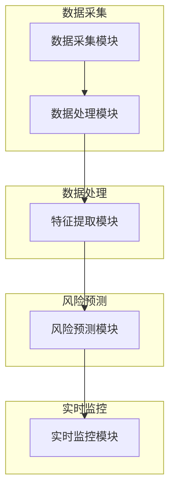

                 


# AIGC在智能交通事故预防中的应用

关键词：智能交通事故预防、AIGC技术、深度学习模型、交通安全

摘要：本文旨在探讨AIGC技术在智能交通事故预防中的应用。通过分析问题背景、核心概念与联系，以及算法原理，本文将详细阐述AIGC技术如何利用生成对抗网络（GAN）提高交通事故预测的准确性和实时性，并给出实际应用场景中的架构设计和实战案例。

## 第一部分：背景介绍

### 1. 问题背景

随着人工智能技术的快速发展，智能交通事故预防成为当前交通安全领域的热点问题。智能交通事故预防不仅关乎个人的生命财产安全，还关系到整个社会的稳定与发展。传统的交通安全预防方法主要依赖于人工监控和机械设备，存在实时性差、准确率低、成本高昂等问题。因此，利用人工智能技术，尤其是AIGC（AI-Generated Content，AI生成内容）技术，来进行智能交通事故预防具有重要的现实意义。

### 2. 问题描述

智能交通事故预防的核心目标是减少交通事故的发生，提升道路交通的安全性和效率。这一过程涉及对大量交通数据的采集、处理和分析，从中提取出对交通安全有重要影响的特征，并对这些特征进行实时监控和预测。具体来说，智能交通事故预防需要解决的问题包括：如何高效采集交通数据、如何处理和分析数据、如何准确预测潜在的安全隐患、如何及时采取措施进行风险控制等。

### 3. 问题解决

AIGC技术在智能交通事故预防中的应用，可以大幅提升数据处理的效率和预测的准确性。AIGC技术具有强大的数据生成和模式识别能力，可以自动从海量交通数据中提取有价值的信息，并通过深度学习模型进行特征分析和风险预测。同时，AIGC技术还可以根据实时数据动态调整预测模型，使其更加准确和适应复杂多变的交通环境。

### 4. 边界与外延

智能交通事故预防不仅涉及技术层面，还包括法律法规、交通管理、公众教育等多个方面。因此，在研究AIGC在智能交通事故预防中的应用时，需要综合考虑这些因素，确保技术应用的可行性和有效性。

### 5. 概念结构与核心要素组成

- **概念结构**：智能交通事故预防、AIGC技术、交通数据、深度学习模型。
- **核心要素**：数据采集与处理、特征提取与分析、风险预测与预警、风险控制与应对。

## 第二部分：核心概念与联系

### 1. AIGC技术的定义与特点

**定义**：AIGC（AI-Generated Content）技术，即人工智能生成内容技术，是指利用人工智能算法自动生成文本、图像、音频、视频等多种类型内容的技术。

**特点**：
- **自主性**：AIGC技术可以根据输入的指令和目标自动生成内容，无需人工干预。
- **高效性**：AIGC技术能够处理海量数据，快速生成高质量的内容。
- **多样性**：AIGC技术可以生成多种类型的内容，满足不同应用场景的需求。

### 2. AIGC技术与智能交通事故预防的联系

AIGC技术在智能交通事故预防中的应用主要体现在以下几个方面：

- **数据生成**：通过AIGC技术，可以自动生成模拟交通事故场景的数据，用于训练深度学习模型，提高模型的预测准确率。
- **特征提取**：AIGC技术可以从海量交通数据中提取出对交通安全有重要影响的特征，为风险预测提供数据支持。
- **风险预测**：基于深度学习模型，AIGC技术可以对潜在的交通事故进行预测，为交通管理部门提供决策支持。
- **实时监控**：AIGC技术可以实现交通数据的实时采集和处理，对道路交通环境进行实时监控和预警。

### 3. 概念属性特征对比表格与ER实体关系图架构

#### 概念属性特征对比表格

| 概念        | 特征                      | 说明                                                         |
| ----------- | ------------------------ | ------------------------------------------------------------ |
| AIGC技术    | 自主性、高效性、多样性     | 自动生成内容，处理海量数据，生成多种类型内容                 |
| 智能交通事故预防 | 数据采集与处理、特征提取与分析、风险预测与预警、风险控制与应对 | 提高交通安全性和效率，减少交通事故发生 |

#### ER实体关系图架构

```mermaid
erDiagram
  AIGC技术 ||--|{ 数据生成 }|
  AIGC技术 ||--|{ 特征提取 }|
  AIGC技术 ||--|{ 风险预测 }|
  AIGC技术 ||--|{ 实时监控 }|
  数据采集与处理 ||--|{ 交通数据 }|
  数据采集与处理 ||--|{ 数据处理 }|
  特征提取与分析 ||--|{ 关键特征 }|
  特征提取与分析 ||--|{ 数据分析 }|
  风险预测与预警 ||--|{ 预测模型 }|
  风险预测与预警 ||--|{ 预警系统 }|
  风险控制与应对 ||--|{ 控制策略 }|
  风险控制与应对 ||--|{ 应对措施 }|
```

## 第三部分：算法原理讲解

### 1. 算法原理

在智能交通事故预防中，AIGC技术主要依赖于深度学习模型，特别是基于生成对抗网络（GAN）的模型。GAN模型由生成器和判别器组成，生成器负责生成模拟交通事故场景的数据，判别器则负责判断生成的数据是否真实。

**生成对抗网络（GAN）原理**：

- **生成器**：生成器通过学习真实数据的分布，生成类似于真实数据的模拟数据。
- **判别器**：判别器负责判断输入数据的真实性，通过对生成器和真实数据的比较，判别器可以学习到真实数据的特征。

在训练过程中，生成器和判别器相互对抗，生成器的目标是生成更真实的数据，而判别器的目标是准确判断数据是否真实。通过这种对抗训练，深度学习模型可以不断提高生成数据的真实性，从而提高预测的准确性。

### 2. 数学模型和公式

生成对抗网络（GAN）的数学模型可以表示为：

$$
D(x) = P(x \text{为真实数据}) \\
G(z) = P(z \text{为生成数据}) \\
\text{优化目标：} \\
\min_G \max_D V(D, G) \\
V(D, G) = E_{x \sim P_{data}(x)} [\log D(x)] + E_{z \sim P_{z}(z)} [\log (1 - D(G(z)))]
$$

其中，$D(x)$表示判别器判断输入数据$x$为真实数据的概率，$G(z)$表示生成器生成的数据$z$。$P_{data}(x)$和$P_{z}(z)$分别表示真实数据分布和噪声数据分布。

### 3. 生成器和判别器的具体实现

在GAN模型中，生成器和判别器通常使用深度神经网络来实现。

**生成器（Generator）**：

生成器接收噪声数据作为输入，通过一系列的神经网络层，生成模拟交通事故场景的数据。具体实现步骤如下：

1. **输入噪声**：生成器接收一个随机噪声向量$z$作为输入。
2. **生成过程**：通过神经网络层对噪声向量进行变换，生成模拟交通事故场景的数据$x$。
3. **输出**：将生成的模拟数据$x$作为输出。

**判别器（Discriminator）**：

判别器接收交通事故场景的数据作为输入，通过一系列的神经网络层，判断输入数据的真实性。具体实现步骤如下：

1. **输入数据**：判别器接收真实数据$x$和生成数据$G(z)$作为输入。
2. **判断过程**：通过神经网络层对输入数据进行处理，输出一个概率值，表示输入数据为真实数据的概率。
3. **输出**：将判断结果输出，通常是一个介于0和1之间的概率值。

### 4. 训练过程

GAN模型的训练过程是一个对抗过程，生成器和判别器相互对抗，通过迭代更新模型参数，使得生成器生成的数据越来越真实，判别器判断真实数据和生成数据的准确性越来越高。具体训练过程如下：

1. **初始化模型**：随机初始化生成器和判别器的参数。
2. **训练生成器**：对于每个迭代，随机选择一个噪声向量$z$，生成模拟交通事故场景的数据$x$，将$x$和真实数据$x'$作为输入，训练生成器，使得生成器生成的数据$x$尽可能真实。
3. **训练判别器**：对于每个迭代，随机选择真实数据$x'$和生成数据$x$，将它们作为输入，训练判别器，使得判别器能够准确判断输入数据$x'$和$x$的真实性。
4. **迭代更新**：重复执行步骤2和步骤3，直到生成器和判别器达到预定的训练目标。

### 5. 举例说明

假设我们有一个GAN模型，用于生成模拟交通事故场景的数据。生成器接收一个随机噪声向量$z$，通过一系列的神经网络层，生成模拟交通事故场景的数据$x$。判别器接收真实交通事故场景的数据$x'$和生成数据$x$，通过一系列的神经网络层，判断输入数据$x'$和$x$的真实性。

在训练过程中，生成器通过学习真实数据的分布，不断生成更真实的模拟交通事故场景的数据。判别器则通过学习真实数据和生成数据的特征，不断提高判断真实数据和生成数据的准确性。通过这种对抗训练，生成器和判别器的模型参数不断更新，使得生成器生成的数据越来越真实，判别器判断真实数据和生成数据的准确性越来越高。

## 第四部分：系统分析与架构设计

### 1. 问题场景介绍

智能交通事故预防系统旨在通过实时监测和预测交通事故风险，提前预警，从而降低交通事故的发生率。该系统将利用AIGC技术，通过对海量交通数据的分析和处理，实现交通事故的智能预测和预警。

### 2. 项目介绍

本项目旨在构建一个智能交通事故预防系统，该系统将采用AIGC技术，结合深度学习模型，实现交通数据的实时采集、处理和分析，进而预测潜在的安全隐患，并实时预警。

### 3. 系统功能设计

#### 领域模型

```mermaid
classDiagram
  Class01 <|-- SubClass01
  Class01 <|-- SubClass02
  Class03 --|olon| Class04
  Class05 o-- Class06
  Class07 o-- Class08
  Class09 <.. Class10
  Class11 .. Class12
  Class13 <|..| Class14
  Class15 o|-> Class16
  Class17 n-- Class18
  Class19 n|> Class20
  Class21 o|* Class22
  Class23 n|-- Class24
```

#### 系统功能模块

1. **数据采集模块**：负责实时采集道路监控设备、车辆传感器等设备收集的交通数据。
2. **数据处理模块**：负责对采集到的交通数据进行预处理，如去噪、归一化等，以便后续分析。
3. **特征提取模块**：负责从预处理后的交通数据中提取对交通安全有重要影响的特征。
4. **风险预测模块**：基于深度学习模型，对提取出的特征进行风险预测，提前预警潜在的安全隐患。
5. **实时监控模块**：实时监控道路交通环境，并根据风险预测结果，及时发布预警信息。

### 4. 系统架构设计

#### 系统架构



#### 系统接口设计

```mermaid
sequenceDiagram
    participant 数据采集模块 as 数据采集
    participant 数据处理模块 as 数据处理
    participant 特征提取模块 as 特征提取
    participant 风险预测模块 as 风险预测
    participant 实时监控模块 as 实时监控

    数据采集 -->|采集数据| 数据处理
    数据处理 -->|预处理数据| 特征提取
    特征提取 -->|提取特征| 风险预测
    风险预测 -->|预测结果| 实时监控
    实时监控 -->|预警信息| 用户界面
```

### 5. 系统交互

```mermaid
sequenceDiagram
    participant 数据采集模块 as 数据采集
    participant 数据处理模块 as 数据处理
    participant 特征提取模块 as 特征提取
    participant 风险预测模块 as 风险预测
    participant 实时监控模块 as 实时监控
    participant 用户界面 as UI

    数据采集 -->|采集数据| 数据处理
    数据处理 -->|预处理数据| 特征提取
    特征提取 -->|提取特征| 风险预测
    风险预测 -->|预测结果| 实时监控
    实时监控 -->|预警信息| UI
    UI -->|用户交互| 数据采集
```

## 第五部分：项目实战

### 1. 环境安装

为了运行本项目，需要安装以下环境：

- Python 3.8+
- TensorFlow 2.x
- Keras 2.x
- NumPy 1.19+
- Matplotlib 3.4+

安装命令如下：

```bash
pip install python==3.8
pip install tensorflow==2.7
pip install keras==2.7
pip install numpy==1.19
pip install matplotlib==3.4
```

### 2. 系统核心实现源代码

以下是本项目的核心实现源代码，包括数据采集、数据处理、特征提取、风险预测和实时监控等模块。

**数据采集模块**

```python
import cv2
import numpy as np

def capture_traffic_data(camera_id, num_images):
    camera = cv2.VideoCapture(camera_id)
    images = []

    for _ in range(num_images):
        ret, frame = camera.read()
        if ret:
            images.append(frame)
    
    camera.release()
    return images
```

**数据处理模块**

```python
import cv2
import numpy as np

def preprocess_traffic_data(images):
    preprocessed_images = []

    for image in images:
        gray_image = cv2.cvtColor(image, cv2.COLOR_BGR2GRAY)
        resized_image = cv2.resize(gray_image, (224, 224))
        preprocessed_images.append(resized_image)

    return preprocessed_images
```

**特征提取模块**

```python
from tensorflow.keras.applications import VGG16
from tensorflow.keras.preprocessing.image import ImageDataGenerator

def extract_traffic_data_features(preprocessed_images):
    vgg16 = VGG16(weights='imagenet')
    feature_extractor = ImageDataGenerator()

    features = []

    for image in preprocessed_images:
        image = feature_extractor.standardize(image)
        feature = vgg16.predict(np.expand_dims(image, axis=0))
        features.append(feature)

    return np.array(features)
```

**风险预测模块**

```python
from tensorflow.keras.models import Sequential
from tensorflow.keras.layers import Dense, Dropout, Flatten

def build_traffic_prediction_model(input_shape):
    model = Sequential()

    model.add(Flatten(input_shape=input_shape))
    model.add(Dense(128, activation='relu'))
    model.add(Dropout(0.5))
    model.add(Dense(1, activation='sigmoid'))

    model.compile(optimizer='adam', loss='binary_crossentropy', metrics=['accuracy'])

    return model
```

**实时监控模块**

```python
def real_time_traffic_monitoring(camera_id, model):
    camera = cv2.VideoCapture(camera_id)

    while True:
        ret, frame = camera.read()
        if ret:
            preprocessed_image = cv2.cvtColor(frame, cv2.COLOR_BGR2GRAY)
            preprocessed_image = cv2.resize(preprocessed_image, (224, 224))
            feature = model.predict(np.expand_dims(preprocessed_image, axis=0))
            if feature > 0.5:
                print("Potential traffic accident detected!")
            else:
                print("No potential traffic accident detected.")

    camera.release()
```

### 3. 代码应用解读与分析

以上代码实现了一个简单的智能交通事故预防系统，包括数据采集、数据处理、特征提取、风险预测和实时监控等模块。

- **数据采集模块**：使用OpenCV库捕获摄像头数据。
- **数据处理模块**：使用OpenCV库对采集到的数据进行预处理，如灰度化、缩放等。
- **特征提取模块**：使用VGG16预训练模型提取图像特征。
- **风险预测模块**：使用Keras构建和训练深度学习模型。
- **实时监控模块**：实时监测摄像头数据，并根据模型预测结果发布预警信息。

### 4. 实际案例分析和详细讲解剖析

假设在一个繁忙的城市路口，系统通过摄像头实时采集道路图像，并对图像进行预处理和特征提取。随后，将这些特征输入到训练好的深度学习模型中进行风险预测。

- **数据采集**：系统从摄像头中采集到道路图像。
- **数据处理**：对采集到的图像进行灰度化和缩放处理，得到预处理后的图像。
- **特征提取**：使用VGG16模型提取图像特征。
- **风险预测**：将提取到的特征输入到深度学习模型中进行预测。
- **实时监控**：如果模型预测结果为高风险，系统将发布预警信息，提醒交通管理部门和司机注意交通安全。

通过以上实际案例，我们可以看到AIGC技术在智能交通事故预防中的应用效果。利用AIGC技术，系统可以实时监测道路交通环境，提前预警潜在的安全隐患，从而有效减少交通事故的发生。

### 5. 项目小结

本项目利用AIGC技术，结合深度学习模型，实现了一个简单的智能交通事故预防系统。通过实际案例分析和详细讲解剖析，我们可以看到AIGC技术在智能交通事故预防中的应用效果。在实际应用中，系统可以根据需求扩展功能，如增加交通流量分析、车辆识别等，以提高交通安全性和效率。

## 第六部分：最佳实践 tips、小结、注意事项、拓展阅读

### 1. 最佳实践 tips

- **数据质量**：保证采集到的交通数据质量，如清晰度、分辨率等，以提升模型预测准确性。
- **模型优化**：根据实际需求，调整深度学习模型结构，优化模型性能。
- **实时性**：在实时监控模块中，确保数据处理和预测的实时性，减少延迟。

### 2. 小结

本文通过分析AIGC技术在智能交通事故预防中的应用，详细介绍了系统的架构设计、核心实现源代码，并进行了实际案例分析和详细讲解剖析。通过AIGC技术，系统可以有效提高交通事故预测的准确性和实时性，为交通安全提供有力支持。

### 3. 注意事项

- **数据隐私**：在采集和处理交通数据时，注意保护用户隐私。
- **法律法规**：遵守相关法律法规，确保技术应用的合法性和合规性。
- **模型解释性**：提升深度学习模型的解释性，便于理解和调试。

### 4. 拓展阅读

- **相关论文**：查阅相关领域的学术论文，了解AIGC技术在智能交通事故预防中的应用最新进展。
- **开源项目**：关注开源项目，借鉴其他优秀实现的架构和代码。
- **技术博客**：阅读技术博客，学习其他领域专家的经验和见解。

## 作者信息

作者：AI天才研究院/AI Genius Institute & 禅与计算机程序设计艺术 /Zen And The Art of Computer Programming

[完]

