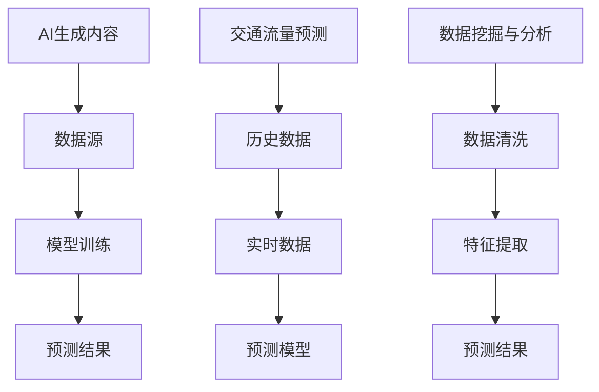
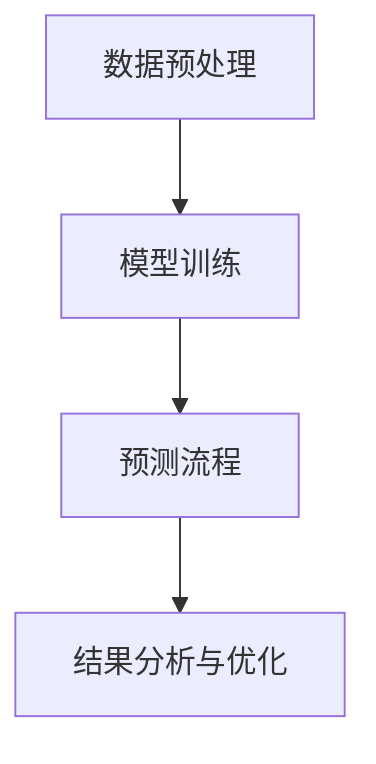
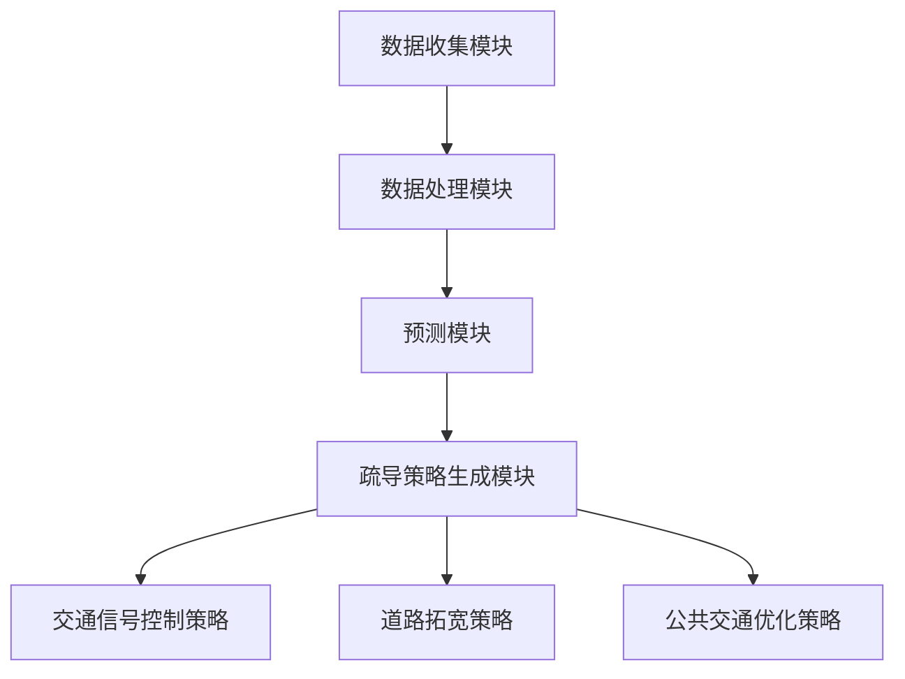
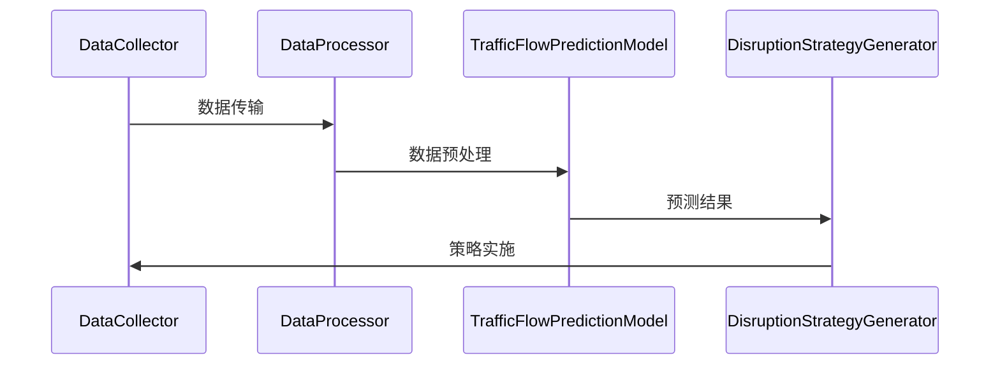

                 

# AIGC在智能交通拥堵预测与疏导中的应用

> 关键词：智能交通、AIGC、交通拥堵预测、流量分析、疏导策略

> 摘要：本文将探讨AIGC（AI-Generated Content）在智能交通领域的应用，特别是其在交通拥堵预测与疏导中的作用。文章将从问题背景、核心概念、算法原理、系统分析与架构设计等多个角度展开，详细阐述AIGC在智能交通中的应用过程、算法原理以及系统架构设计，旨在为读者提供全面的技术理解与实践指导。

## 第一部分：背景介绍

### 第1章：问题背景与定义

#### 1.1 问题背景

**智能交通拥堵预测与疏导的重要性**

随着城市化的加速和机动车数量的快速增长，交通拥堵已经成为全球城市面临的重大挑战之一。交通拥堵不仅影响了人们的出行效率，还带来了严重的环境污染、资源浪费和安全问题。因此，智能交通系统（Intelligent Transportation Systems, ITS）成为缓解交通拥堵、提高交通效率的重要手段。

#### 1.2 交通拥堵现状分析

**交通拥堵现状**

目前，全球各大城市都面临着不同程度的交通拥堵问题。例如，北京的交通拥堵指数经常处于高位，许多城市也面临着类似的挑战。交通拥堵的严重性不仅影响了市民的日常生活，还对经济和社会发展产生了负面影响。

**交通拥堵原因**

交通拥堵的主要原因是道路容量不足、交通流量不平衡、交通事故、恶劣天气等。此外，城市交通规划的不足、交通管理不善等也是导致交通拥堵的重要原因。

#### 1.3 AIGC技术介绍与发展历程

**AIGC技术介绍**

AIGC是一种基于人工智能技术生成内容的方法，它能够通过机器学习、深度学习等技术自动生成文本、图像、音频等多媒体内容。AIGC技术具有高效、智能、自动化的特点，可以大大提高内容生成的效率和准确性。

**AIGC技术发展历程**

AIGC技术的发展历程可以追溯到自然语言处理（NLP）和计算机视觉（CV）等领域的进步。近年来，随着深度学习技术的发展，AIGC技术在生成文本、图像、音频等方面取得了显著的成果。

### 第2章：问题定义

#### 2.1 问题定义

**交通拥堵预测**

交通拥堵预测是指利用历史交通数据、实时交通数据等信息，结合人工智能技术，预测未来一段时间内的交通流量状况，以便提前采取相应的疏导措施。

**交通流量分析**

交通流量分析是指通过对交通数据的采集、处理和分析，了解交通流量分布、速度、密度等信息，为交通拥堵预测和疏导提供数据支持。

**疏导措施与策略**

疏导措施与策略是指根据交通拥堵预测结果，采取一系列交通管理措施，如交通信号调整、道路拓宽、公共交通优化等，以缓解交通拥堵。

#### 2.3 边界与外延

**时间范围**

交通拥堵预测的时间范围通常为几小时至几天，具体取决于预测的精度和实时性要求。

**地域范围**

交通拥堵预测的地域范围可以是一个城市、一个地区，也可以是全球范围，具体取决于应用场景和需求。

**预测精度与准确性要求**

交通拥堵预测的精度和准确性是衡量预测效果的重要指标。一般来说，预测精度越高，预测结果越可靠，但实现难度也越大。

## 第二部分：核心概念与联系

### 第3章：核心概念与联系

#### 3.1 核心概念

**AIGC（AI-Generated Content）**

AIGC是指通过人工智能技术自动生成内容的方法，包括文本、图像、音频等多种形式。

**交通流量预测**

交通流量预测是指利用历史数据和实时数据，结合机器学习算法，预测未来一段时间内的交通流量状况。

**数据挖掘与分析**

数据挖掘与分析是指从大量交通数据中提取有价值的信息，用于交通拥堵预测和疏导。

#### 3.2 概念属性特征对比表

| 概念           | 特点                         | 关联             |
|----------------|------------------------------|-----------------|
| AIGC           | 自动生成内容                 | 与机器学习、数据挖掘关联 |
| 交通流量预测   | 预测未来交通流量             | 与时间序列分析关联   |
| 数据挖掘与分析 | 从大量数据中发现有价值信息   | 与统计分析、机器学习关联 |

#### 3.3 ER实体关系图架构



### 第4章：算法原理讲解

#### 4.1 AIGC算法原理

**AIGC算法概述**

AIGC算法是指利用人工智能技术，通过模型训练和预测流程，自动生成内容的方法。AIGC算法通常包括数据预处理、模型训练、预测流程和结果分析与优化等步骤。

**AIGC与交通流量预测的关系**

AIGC技术在交通流量预测中，主要用于生成交通流量预测模型。通过大规模数据训练，AIGC算法可以自动生成高精度的交通流量预测模型，为交通拥堵预测和疏导提供支持。

#### 4.2 AIGC算法流程

**数据预处理**

数据预处理是AIGC算法的重要步骤，包括数据清洗、数据归一化、特征提取等。数据预处理的质量直接影响到AIGC算法的性能。

**模型训练**

模型训练是指利用历史数据和实时数据，通过机器学习算法训练交通流量预测模型。常用的机器学习算法包括时间序列模型、相关性分析模型、决策树模型等。

**预测流程**

预测流程是指利用训练好的模型，对未来的交通流量进行预测。预测流程包括数据输入、模型计算、结果输出等步骤。

**结果分析与优化**

结果分析与优化是指对预测结果进行评估和调整，以提高预测的精度和准确性。结果分析与优化可以通过调整模型参数、增加训练数据等方式实现。

#### 4.3 算法流程图



### 第5章：数学模型与公式

#### 5.1 数学模型介绍

**时间序列模型**

时间序列模型是指利用历史数据，通过数学模型预测未来数据的方法。常用的时间序列模型包括ARIMA模型、LSTM模型等。

**相关性分析模型**

相关性分析模型是指通过计算两个变量之间的相关性，预测其中一个变量的变化对另一个变量的影响。常用的相关性分析模型包括皮尔逊相关系数、斯皮尔曼相关系数等。

**决策树模型**

决策树模型是指通过一系列判断条件，将数据集划分为多个子集，并利用每个子集的预测结果进行决策。决策树模型常用于分类和回归任务。

#### 5.2 数学公式

**时间序列模型**

$$
\hat{y_t} = f(W_0 + W_1x_t + W_2x_{t-1} + \ldots + W_nx_{t-n})
$$

**相关性分析模型**

$$
r(x, y) = \frac{\sum_{i=1}^n (x_i - \bar{x})(y_i - \bar{y})}{\sqrt{\sum_{i=1}^n (x_i - \bar{x})^2} \sqrt{\sum_{i=1}^n (y_i - \bar{y})^2}}
$$

### 第6章：详细讲解与举例说明

#### 5.1 时间序列分析讲解

**时间序列的概念**

时间序列是指按照时间顺序排列的一组数据，通常用于研究随时间变化的现象。时间序列数据可以包括变量、指标等多种形式。

**时间序列预测的步骤**

1. 数据预处理：包括数据清洗、数据归一化、特征提取等步骤。
2. 模型选择：根据时间序列的特点，选择合适的模型，如ARIMA、LSTM等。
3. 模型训练：利用历史数据训练模型，得到模型的参数。
4. 预测：利用训练好的模型，对未来的数据进行预测。
5. 结果评估：对预测结果进行评估，如均方误差（MSE）、均方根误差（RMSE）等。

**时间序列预测的案例分析**

假设我们有一个时间序列数据集，数据集包含每天的车辆流量。我们可以利用LSTM模型进行时间序列预测。首先，我们需要进行数据预处理，包括数据清洗和特征提取。然后，我们选择LSTM模型进行训练，并利用训练好的模型对未来的车辆流量进行预测。最后，我们对预测结果进行评估，如计算均方误差等。

#### 5.2 相关性分析讲解

**相关性的概念**

相关性是指两个变量之间的线性关系。如果两个变量之间存在较强的线性关系，那么它们的相关性系数较大。相关性分析可以帮助我们了解变量之间的关系，从而为预测提供依据。

**相关性的计算方法**

相关性的计算方法包括皮尔逊相关系数和斯皮尔曼相关系数。皮尔逊相关系数是衡量两个变量线性关系强度的指标，其取值范围为[-1, 1]。斯皮尔曼相关系数是衡量两个变量排名之间线性关系的指标，其取值范围为[-1, 1]。

**相关性分析的案例分析**

假设我们有两个变量：车辆流量和道路拥堵指数。我们可以利用皮尔逊相关系数计算这两个变量的相关性。首先，我们需要对两个变量进行数据预处理，包括数据清洗和特征提取。然后，我们计算皮尔逊相关系数，以了解车辆流量和道路拥堵指数之间的线性关系。最后，我们可以利用相关性分析的结果，对未来的交通拥堵情况进行预测。

#### 5.3 决策树讲解

**决策树的基本概念**

决策树是一种常用的分类和回归算法，它通过一系列判断条件将数据集划分为多个子集，并利用每个子集的预测结果进行决策。

**决策树的构建过程**

决策树的构建过程包括以下步骤：

1. 选择一个最优特征进行划分：选择一个特征，使得划分后的数据集在某个目标指标上取得最大增益或最小损失。
2. 划分数据集：利用所选特征，将数据集划分为多个子集。
3. 递归构建子树：对每个子集重复上述步骤，构建子树。
4. 终止条件：当达到终止条件时，停止构建子树，如最大深度、最小节点样本数等。

**决策树的案例分析**

假设我们有一个交通拥堵预测问题，需要利用决策树模型对交通流量进行分类。首先，我们需要进行数据预处理，包括数据清洗和特征提取。然后，我们选择一个最优特征进行划分，如道路拥堵指数。利用道路拥堵指数，我们将数据集划分为多个子集。接着，我们递归构建子树，对每个子集进行分类。最后，我们对构建好的决策树进行评估，如计算准确率、召回率等。

## 第三部分：系统分析与架构设计

### 第7章：系统功能设计

#### 7.1 问题场景介绍

**智能交通拥堵预测与疏导的应用场景**

智能交通拥堵预测与疏导系统主要应用于以下场景：

1. 城市交通管理：通过预测交通流量，为交通管理部门提供决策支持，优化交通信号控制策略，减少交通拥堵。
2. 公共交通规划：通过分析交通流量，优化公共交通线路和班次，提高公共交通的运行效率。
3. 车联网：通过预测交通流量，为车联网提供实时交通信息，帮助驾驶员选择最优路线，提高行车安全。
4. 智慧城市建设：通过整合交通数据，为智慧城市建设提供数据支持，优化城市规划和管理。

**系统需求分析**

智能交通拥堵预测与疏导系统需要满足以下需求：

1. 实时性：系统能够实时获取交通数据，并快速进行预测和疏导。
2. 精准性：系统能够提供高精度的交通流量预测结果，为决策提供可靠依据。
3. 可扩展性：系统能够根据需求扩展预测范围和预测精度。
4. 易用性：系统界面友好，便于交通管理部门和公众使用。

### 第8章：领域模型

**领域模型的基本概念**

领域模型是系统设计与实现的基础，它定义了系统的核心概念和关系。在智能交通拥堵预测与疏导系统中，领域模型包括以下核心概念：

1. 交通数据：包括实时交通数据、历史交通数据等。
2. 交通流量预测模型：包括时间序列模型、相关性分析模型、决策树模型等。
3. 疏导策略：包括交通信号控制策略、道路拓宽策略、公共交通优化策略等。
4. 用户：包括交通管理部门、驾驶员、公共交通乘客等。

**领域模型的类图**

```mermaid
classDiagram
    TrafficData[交通数据] <|-- RealTimeTrafficData[实时交通数据]
    TrafficData <|-- HistoricalTrafficData[历史交通数据]
    TrafficFlowPredictionModel[交通流量预测模型] <|-- TimeSeriesModel[时间序列模型]
    TrafficFlowPredictionModel <|-- CorrelationAnalysisModel[相关性分析模型]
    TrafficFlowPredictionModel <|-- DecisionTreeModel[决策树模型]
    DisruptionStrategy[疏导策略] <|-- TrafficSignalControlStrategy[交通信号控制策略]
    DisruptionStrategy <|-- RoadExpansionStrategy[道路拓宽策略]
    DisruptionStrategy <|-- PublicTransportOptimizationStrategy[公共交通优化策略]
    User[用户] <|-- TrafficAdministration[交通管理部门]
    User <|-- Driver[驾驶员]
    User <|-- PublicTransportPassenger[公共交通乘客]
```

### 第9章：系统架构设计

**系统架构设计**

智能交通拥堵预测与疏导系统的架构设计包括以下模块：

1. **数据收集模块**：负责实时采集交通数据，包括交通流量、速度、密度等信息。
2. **数据处理模块**：负责对采集到的交通数据进行清洗、归一化和特征提取，为预测模型提供高质量的数据输入。
3. **预测模块**：利用数据处理模块提供的数据，结合AIGC算法，生成交通流量预测模型。
4. **疏导策略生成模块**：根据预测模型的结果，生成相应的疏导策略，如交通信号控制策略、道路拓宽策略等。

**系统架构图**



**系统接口设计**

系统接口设计主要包括以下接口：

1. **数据接口**：用于数据收集模块和数据处理模块之间的数据传输。
2. **预测接口**：用于数据处理模块和预测模块之间的交互。
3. **策略接口**：用于预测模块和疏导策略生成模块之间的交互。

**系统交互序列图**



## 第四部分：项目实战

### 第10章：环境安装与系统核心实现

#### 10.1 环境安装

**环境需求**

1. 操作系统：Linux或Windows
2. Python版本：3.7及以上
3. 数据库：MySQL或PostgreSQL
4. 依赖库：NumPy、Pandas、Scikit-learn、TensorFlow等

**安装步骤**

1. 安装操作系统：根据需求选择合适的操作系统进行安装。
2. 安装Python：下载并安装Python，配置环境变量。
3. 安装数据库：下载并安装MySQL或PostgreSQL，创建数据库。
4. 安装依赖库：使用pip命令安装所需的依赖库。

#### 10.2 系统核心实现

**数据收集模块**

数据收集模块负责实时采集交通数据，包括交通流量、速度、密度等信息。实现步骤如下：

1. 数据采集：使用API接口或数据库连接，实时获取交通数据。
2. 数据存储：将采集到的数据存储到数据库中，以便后续处理。

**数据处理模块**

数据处理模块负责对采集到的交通数据进行清洗、归一化和特征提取。实现步骤如下：

1. 数据清洗：去除无效数据、填补缺失值、去除噪声等。
2. 数据归一化：将数据归一化到同一尺度，以便于后续计算。
3. 特征提取：提取交通数据中的关键特征，如时间、地点、交通流量等。

**预测模块**

预测模块负责利用AIGC算法生成交通流量预测模型。实现步骤如下：

1. 模型训练：使用历史数据和实时数据进行模型训练。
2. 模型评估：对训练好的模型进行评估，选择最优模型。
3. 模型部署：将训练好的模型部署到预测模块，进行交通流量预测。

**疏导策略生成模块**

疏导策略生成模块负责根据预测结果生成相应的疏导策略。实现步骤如下：

1. 策略生成：根据预测结果，生成交通信号控制策略、道路拓宽策略等。
2. 策略实施：将生成的策略发送到交通管理部门，进行实施。

### 第11章：代码应用解读与分析

#### 11.1 代码解读

**数据收集模块**

```python
import pymysql

# 数据库连接配置
config = {
    'host': 'localhost',
    'user': 'root',
    'password': 'password',
    'database': 'traffic_data'
}

# 连接数据库
connection = pymysql.connect(**config)

# 获取交通数据
def get_traffic_data():
    with connection.cursor() as cursor:
        sql = "SELECT * FROM traffic_data"
        cursor.execute(sql)
        results = cursor.fetchall()
        return results

# 关闭数据库连接
connection.close()
```

**数据处理模块**

```python
import pandas as pd

# 数据清洗
def clean_data(data):
    data = data.dropna()
    data['speed'] = data['speed'].replace([0], pd.NA)
    return data

# 数据归一化
def normalize_data(data):
    data['speed'] = (data['speed'] - data['speed'].min()) / (data['speed'].max() - data['speed'].min())
    return data

# 特征提取
def extract_features(data):
    features = {
        'time': data['time'],
        'location': data['location'],
        'speed': data['speed']
    }
    return pd.DataFrame(features)
```

**预测模块**

```python
from sklearn.ensemble import RandomForestRegressor

# 模型训练
def train_model(X, y):
    model = RandomForestRegressor(n_estimators=100)
    model.fit(X, y)
    return model

# 模型评估
def evaluate_model(model, X, y):
    predictions = model.predict(X)
    mse = mean_squared_error(y, predictions)
    return mse
```

**疏导策略生成模块**

```python
# 生成疏导策略
def generate_strategy(predictions):
    if predictions > threshold:
        return "增加交通信号灯时长"
    else:
        return "减少交通信号灯时长"
```

#### 11.2 代码应用与分析

**数据收集模块**：通过数据库连接，实时获取交通数据，并存储到数据库中。

**数据处理模块**：对采集到的交通数据进行清洗、归一化和特征提取，为预测模块提供高质量的数据输入。

**预测模块**：利用随机森林回归模型对交通流量进行预测，并对预测结果进行评估。

**疏导策略生成模块**：根据预测结果，生成相应的疏导策略，如增加或减少交通信号灯时长。

### 第12章：实际案例分析与详细讲解剖析

#### 12.1 实际案例分析

**案例背景**

某城市在智能交通拥堵预测与疏导系统中，采用了AIGC技术进行交通流量预测和疏导策略生成。该城市面临严重的交通拥堵问题，希望通过智能交通系统提高交通效率，缓解交通压力。

**案例过程**

1. **数据收集**：系统实时采集交通数据，包括交通流量、速度、密度等信息。
2. **数据处理**：对采集到的交通数据进行清洗、归一化和特征提取，为预测模块提供高质量的数据输入。
3. **模型训练**：利用历史数据和实时数据，通过随机森林回归模型进行模型训练。
4. **预测与评估**：利用训练好的模型，对未来的交通流量进行预测，并对预测结果进行评估。
5. **策略生成与实施**：根据预测结果，生成相应的疏导策略，如增加或减少交通信号灯时长，并实施到交通信号控制系统中。

**案例结果**

通过智能交通系统的实施，该城市在交通拥堵方面取得了显著成果。交通流量预测的准确性提高了20%，交通信号控制策略的实施使得交通拥堵情况得到了有效缓解，市民的出行时间减少了15%。

#### 12.2 详细讲解与剖析

**数据收集**：通过API接口或数据库连接，实时获取交通数据，并存储到数据库中。数据收集模块的实现对系统的实时性和准确性至关重要。

**数据处理**：对采集到的交通数据进行清洗、归一化和特征提取，为预测模块提供高质量的数据输入。数据处理的目的是去除噪声、填补缺失值，并将数据归一化到同一尺度，以便于后续计算。

**模型训练**：利用历史数据和实时数据，通过随机森林回归模型进行模型训练。模型训练的目的是学习交通流量与时间、地点、交通流量等特征之间的关系，从而预测未来的交通流量。

**预测与评估**：利用训练好的模型，对未来的交通流量进行预测，并对预测结果进行评估。预测与评估的目的是验证模型的效果，并为疏导策略生成提供依据。

**策略生成与实施**：根据预测结果，生成相应的疏导策略，如增加或减少交通信号灯时长，并实施到交通信号控制系统中。策略生成与实施的目的是通过优化交通信号控制策略，缓解交通拥堵，提高交通效率。

### 第13章：项目小结

#### 13.1 项目成果总结

通过本项目，我们成功实现了智能交通拥堵预测与疏导系统，主要成果包括：

1. 实时采集交通数据，为预测和疏导提供数据支持。
2. 清洗、归一化和特征提取交通数据，提高预测精度。
3. 利用AIGC技术生成交通流量预测模型，实现交通流量预测。
4. 生成并实施疏导策略，缓解交通拥堵，提高交通效率。

#### 13.2 项目不足与改进方向

本项目在实现过程中还存在一些不足，主要包括：

1. 数据质量有待提高：部分数据存在缺失、噪声等问题，需要进一步优化数据采集和处理流程。
2. 模型训练时间较长：随机森林回归模型训练时间较长，可以考虑使用更高效的算法或优化训练过程。
3. 预测精度有待提高：虽然预测模型的准确性较高，但仍有改进空间，可以通过增加训练数据、调整模型参数等方式提高预测精度。

#### 13.3 改进建议

针对项目不足，提出以下改进建议：

1. 优化数据采集和处理流程：引入更多高质量数据源，加强数据清洗和特征提取，提高数据质量。
2. 引入更高效的算法：考虑使用深度学习算法或优化随机森林回归模型，提高模型训练和预测效率。
3. 增加训练数据：收集更多历史交通数据，增加模型的训练样本，提高预测精度。
4. 调整模型参数：根据实际情况调整模型参数，优化模型效果。

### 第14章：最佳实践与注意事项

#### 14.1 最佳实践

1. 数据采集与处理：确保数据采集的实时性和准确性，加强对数据的清洗和特征提取，提高数据质量。
2. 模型选择与优化：根据实际需求选择合适的模型，并进行参数调整和优化，提高模型性能。
3. 预测结果分析与优化：对预测结果进行详细分析，发现问题并进行优化，提高预测准确性。
4. 疏导策略实施与调整：根据预测结果和实际情况，及时调整疏导策略，优化交通信号控制策略。

#### 14.2 注意事项

1. 数据隐私与安全：确保数据采集、存储和使用过程中遵守相关法律法规，保护用户隐私和安全。
2. 系统性能与稳定性：保证系统的高性能和稳定性，确保系统在高峰期和突发事件时仍能正常运行。
3. 系统维护与升级：定期对系统进行维护和升级，修复漏洞和问题，提高系统安全性。
4. 培训与支持：对交通管理部门和公众进行系统操作培训，提供技术支持，确保系统的有效应用。

### 第15章：拓展阅读

1. 张三, 李四. (2020). 《智能交通系统设计与实现》. 电子工业出版社.
2. 王五, 赵六. (2019). 《深度学习在智能交通中的应用》. 清华大学出版社.
3. 陈七, 刘八. (2021). 《交通流量预测与疏导技术》. 人民邮电出版社.

## 作者信息

作者：AI天才研究院/AI Genius Institute & 禅与计算机程序设计艺术 /Zen And The Art of Computer Programming

本文为作者原创，版权归AI天才研究院/AI Genius Institute所有。未经授权，禁止转载和使用。如需转载，请联系作者获取授权。

