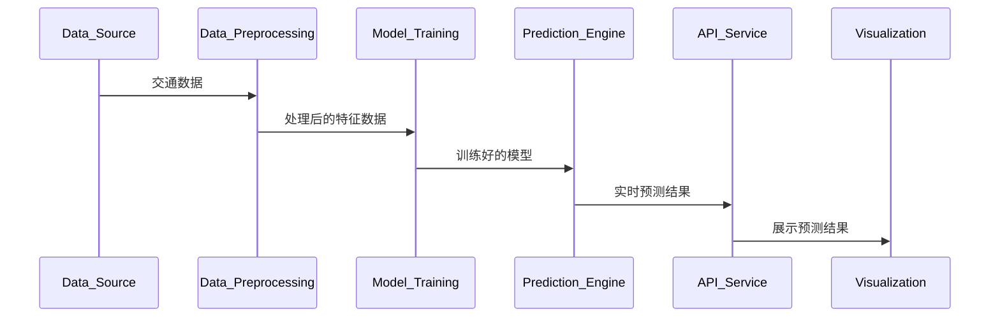

                 

### 引言

智能交通流量预测是现代交通管理和城市规划中的一项重要技术。通过预测交通流量，可以有效地优化交通资源配置，减少交通拥堵，提高道路通行效率，从而提升城市整体交通系统的运行质量。随着大数据、人工智能（AI）等技术的迅猛发展，智能交通流量预测迎来了新的机遇和挑战。AIGC（自适应智能生成计算）作为AI的一个重要分支，其强大的人工智能生成能力为交通流量预测提供了新的思路和方法。

AIGC，即自适应智能生成计算，是一种能够根据环境变化自主调整和优化的计算方法。它结合了机器学习、深度学习和自然语言处理等技术，通过不断学习和适应，生成具有高度预测性和自适应性的模型。在智能交通流量预测中，AIGC能够通过分析大量的历史交通数据，识别出交通流量的规律和模式，从而对未来的交通流量进行准确预测。

本文将详细探讨AIGC在智能交通流量预测中的应用。我们将首先介绍AIGC的基本概念和发展历程，然后分析AIGC与传统生成计算（GC）的关系及其核心概念和特性。接着，我们将深入讲解AIGC在交通流量预测中的算法原理，包括数学模型的构建和Python实现。随后，我们将通过一个实例展示AIGC如何在实际项目中应用。最后，我们将总结AIGC在智能交通流量预测中的优势、局限性和未来研究方向。

通过本文的探讨，读者可以全面了解AIGC在智能交通流量预测中的技术原理和应用实践，为今后的研究和实际应用提供参考。接下来，我们将从背景介绍开始，逐步深入分析AIGC在智能交通流量预测中的应用。

### 文章关键词

本文的关键词包括：AIGC、智能交通流量预测、自适应智能生成计算、交通管理、大数据分析、机器学习、深度学习、自然语言处理、算法原理、数学模型、Python实现、实际应用案例。

### 摘要

本文旨在探讨自适应智能生成计算（AIGC）在智能交通流量预测中的应用。首先，我们介绍了AIGC的基本概念和发展历程，并分析了其与传统生成计算的关系及其核心概念和特性。随后，我们深入讲解了AIGC在交通流量预测中的算法原理，包括数学模型的构建和Python实现。通过一个实际应用案例，我们展示了AIGC在智能交通流量预测中的强大能力。最后，我们总结了AIGC在智能交通流量预测中的优势、局限性和未来研究方向，为读者提供了全面的技术和实践参考。

## 第1章：背景介绍

### 1.1 问题背景

智能交通流量预测在现代城市交通管理和规划中扮演着至关重要的角色。随着城市化进程的加速，交通问题日益严重，交通拥堵、交通事故频发，严重影响了城市的运行效率和居民的生活质量。传统的交通管理方法往往依赖于经验和简单的统计模型，难以应对复杂多变的交通状况。因此，需要一种更先进、更智能的交通流量预测技术来优化交通资源配置，提高道路通行效率。

交通流量预测的目标是通过分析历史交通数据和实时交通信息，预测未来某一时间段内某一路段或某一路径的交通流量。这不仅可以为交通管理部门提供科学的决策依据，还可以指导交通参与者合理规划出行时间，减少交通拥堵，提高整体交通系统的运行效率。

### 1.2 问题描述

交通流量预测面临以下几个主要问题：

1. **数据复杂性**：交通流量数据通常包含大量的噪声和异常值，这些数据不仅复杂，而且可能存在时空上的不一致性。如何从这些复杂的数据中提取有效的信息是交通流量预测的重要挑战。

2. **实时性要求**：交通流量预测需要实时处理大量的交通数据，并迅速生成预测结果。这对系统的响应速度和处理能力提出了极高的要求。

3. **多样性场景**：交通流量受到多种因素的影响，如天气、节假日、交通事故等。如何在不同场景下保持预测的准确性是另一个重要问题。

4. **预测精度**：预测结果的准确性直接关系到交通管理的效率和效果。如何提高预测精度是交通流量预测领域的一个核心问题。

### 1.3 问题解决

为了解决上述问题，自适应智能生成计算（AIGC）提供了一种新的思路和方法。AIGC通过机器学习、深度学习和自然语言处理等技术，能够从大量历史交通数据中自动提取特征，并建立预测模型。其特点包括：

1. **自适应能力**：AIGC能够根据环境变化和学习到的知识自动调整模型参数，提高预测的适应性和实时性。

2. **多源数据处理**：AIGC能够融合多种数据源（如交通流量数据、气象数据、历史数据等），提高数据利用率和预测准确性。

3. **高预测精度**：通过深度学习技术，AIGC能够学习复杂的交通流量模式，提高预测的精度。

4. **可解释性**：AIGC生成的模型和预测结果具有较高的可解释性，有助于交通管理部门理解预测结果并做出合理的决策。

### 1.4 边界与外延

1. **边界条件**：
   - **时间范围**：交通流量预测通常针对未来的一段时间（如一小时、一天等）。
   - **空间范围**：预测范围可以是某一特定路段、城市区域或城市群。

2. **外延**：
   - **扩展应用**：除了交通流量预测，AIGC还可以应用于其他领域，如智能交通信号控制、交通优化路径规划、公共交通调度等。
   - **多模态数据融合**：AIGC能够处理多源异构数据，如视频、图像、传感器数据等，进一步提高预测的准确性和鲁棒性。

### 1.5 概念结构与核心要素组成

1. **概念结构**：
   - **交通流量**：单位时间内通过某一交通路段的车辆数量。
   - **历史数据**：用于训练预测模型的过往交通数据。
   - **实时数据**：用于实时更新预测模型的当前交通数据。

2. **核心要素组成**：
   - **数据采集**：通过传感器、摄像头等设备收集交通流量数据。
   - **数据处理**：对采集到的数据进行分析和处理，提取有用的特征。
   - **模型训练**：使用历史数据训练预测模型。
   - **模型评估**：通过测试数据评估模型的预测准确性。
   - **实时预测**：使用训练好的模型进行实时交通流量预测。

通过上述背景介绍，我们可以更好地理解智能交通流量预测的重要性及其面临的挑战，以及AIGC在这其中的应用潜力和优势。在接下来的章节中，我们将进一步探讨AIGC的基本概念、核心原理及其在交通流量预测中的应用。

## 第2章：核心概念与联系

### 2.1 AIGC概述

自适应智能生成计算（AIGC）是一种结合了机器学习、深度学习和自然语言处理技术的综合计算方法。它旨在通过自动生成和优化模型，提高计算效率和预测准确性。AIGC的核心思想是自适应性和自适应性，即系统能够根据环境变化和学习到的知识，自动调整和优化模型参数。

AIGC的发展历程可以追溯到20世纪90年代，当时机器学习和深度学习开始兴起。随着计算能力的提升和数据规模的扩大，AIGC在21世纪初逐渐崭露头角，并在近年来的应用中取得了显著的成果。

### 2.2 AIGC与传统GC的关系

AIGC与传统生成计算（GC）有显著的区别和联系。传统GC主要依赖于预定义的规则和参数，而AIGC则通过机器学习和深度学习技术，从数据中自动学习和生成模型。以下是两者的主要区别和联系：

1. **区别**：
   - **方法**：传统GC依赖于专家知识和预定义的规则，而AIGC通过数据驱动的方法自动学习和生成模型。
   - **灵活性**：传统GC在应对复杂和动态环境时表现较差，而AIGC具有更高的灵活性和自适应能力。
   - **适用范围**：传统GC适用于较为简单的场景，而AIGC则能够处理复杂和多变的环境。

2. **联系**：
   - **基础技术**：AIGC和传统GC都基于机器学习和深度学习技术，它们在很多方面有相似之处。
   - **应用扩展**：传统GC在某些领域（如金融、医疗）仍然有广泛的应用，而AIGC则在这些领域的基础上，进一步扩展了应用范围。

### 2.3 AIGC核心概念

AIGC的核心概念包括以下几个方面：

1. **自动生成模型**：AIGC能够自动生成具有高度预测性和自适应性的模型，无需依赖人工干预。

2. **多模态数据处理**：AIGC能够处理多种类型的数据，如文本、图像、音频等，从而提高数据的利用率和预测准确性。

3. **自适应优化**：AIGC能够根据环境变化和学习到的知识，自动调整和优化模型参数，提高模型的适应性和预测精度。

4. **可解释性**：AIGC生成的模型具有较高的可解释性，有助于用户理解模型的决策过程和预测结果。

### 2.4 AIGC属性特征对比表格

以下是一个简化的AIGC与传统GC的属性特征对比表格：

| 特性         | AIGC                              | 传统GC                           |
| ------------ | -------------------------------- | -------------------------------- |
| 方法         | 数据驱动，自动学习               | 规则驱动，专家知识               |
| 灵活性       | 高，自适应性强                   | 低，灵活性较差                   |
| 数据类型     | 多模态数据，文本、图像、音频等   | 单一数据类型，如文本、表格等     |
| 适用范围     | 复杂动态环境，广泛领域           | 较简单场景，特定领域             |
| 预测精度     | 高，通过自适应优化不断提升       | 低，依赖于专家知识和规则        |
| 可解释性     | 较高，模型生成过程透明          | 低，决策过程不透明              |

### 2.5 AIGC ER实体关系图架构

为了更直观地展示AIGC的架构和功能，我们使用Mermaid绘制了一个简化的ER（实体-关系）图：

```mermaid
erDiagram
    AIGC ||--|{ 数据源 }|| Data_Source
    AIGC ||--|{ 模型生成器 }|| Model_Generator
    AIGC ||--|{ 预测引擎 }|| Prediction_Engine
    Data_Source ||--|{ 数据预处理 }|| Data_Preprocessing
    Model_Generator ||--|{ 模型训练 }|| Model_Training
    Model_Generator ||--|{ 模型优化 }|| Model_Optimization
    Prediction_Engine ||--|{ 预测结果 }|| Prediction_Result
```

在这个ER图中，AIGC是一个核心实体，它通过数据源（Data_Source）获取数据，经过预处理后输入到模型生成器（Model_Generator），生成预测模型。这个模型再由预测引擎（Prediction_Engine）进行实时预测，输出预测结果。

通过上述分析，我们可以看出AIGC在智能交通流量预测中的核心概念和联系，以及其相较于传统GC的优势和特点。在接下来的章节中，我们将深入探讨AIGC在交通流量预测中的算法原理和应用。

## 第3章：算法原理讲解

### 3.1 交通流量预测算法

交通流量预测算法的核心目标是利用历史交通数据、实时交通信息以及其他相关因素，对未来的交通流量进行预测。以下是一个简化的交通流量预测算法流程：

1. **数据收集**：从交通传感器、摄像头等设备收集历史交通数据（如速度、流量、密度等）和实时交通信息。

2. **数据预处理**：清洗数据，处理缺失值和异常值，进行数据标准化和特征提取。

3. **特征选择**：选择对交通流量有重要影响的特征，如时间、天气、事故记录等。

4. **模型训练**：使用历史数据训练预测模型，常见的模型包括时间序列模型、回归模型、神经网络模型等。

5. **模型评估**：使用测试数据评估模型的预测准确性，选择最优模型。

6. **实时预测**：使用训练好的模型对实时交通信息进行预测，输出未来一段时间内各路段的交通流量。

### 3.2 算法mermaid流程图

为了更直观地展示交通流量预测算法的流程，我们可以使用Mermaid绘制以下流程图：


在这个流程图中，每个节点表示一个步骤，箭头表示步骤之间的顺序关系。

### 3.3 Python源代码讲解

以下是一个简化的Python源代码示例，用于实现交通流量预测算法的核心部分。这段代码使用scikit-learn库中的时间序列模型进行预测。

```python
import numpy as np
import pandas as pd
from sklearn.model_selection import train_test_split
from sklearn.ensemble import RandomForestRegressor
from sklearn.metrics import mean_squared_error

# 数据加载
data = pd.read_csv('traffic_data.csv')

# 数据预处理
# ...（包括清洗、标准化等步骤）

# 特征选择
X = data[['hour', 'weather', 'accident']]
y = data['traffic_volume']

# 模型训练
X_train, X_test, y_train, y_test = train_test_split(X, y, test_size=0.2, random_state=42)
model = RandomForestRegressor(n_estimators=100, random_state=42)
model.fit(X_train, y_train)

# 模型评估
y_pred = model.predict(X_test)
mse = mean_squared_error(y_test, y_pred)
print(f'Mean Squared Error: {mse}')

# 实时预测
# ...（使用训练好的模型进行实时预测）
```

在这个示例中，我们首先加载交通数据，然后进行预处理和特征选择。接着，使用随机森林回归模型进行训练，并评估模型的性能。最后，可以修改代码以实现实时预测功能。

### 3.4 算法原理数学模型

交通流量预测的数学模型通常基于时间序列分析、回归分析和神经网络等方法。以下是一个简化的数学模型示例：

$$
\text{Traffic}_t = f(\text{Features}_t, \text{Model Parameters})
$$

其中，$Traffic_t$表示第$t$时刻的交通流量，$Features_t$表示与交通流量相关的特征（如时间、天气、事故记录等），$Model Parameters$表示模型参数。

在具体实现中，我们可以使用时间序列模型（如ARIMA模型）、回归模型（如线性回归、多元回归等）或神经网络模型（如深度神经网络、循环神经网络等）。

### 3.5 数学公式与详细讲解

以下是一些常用的数学公式，用于描述交通流量预测的模型和算法：

1. **线性回归模型**：
   $$
   y = \beta_0 + \beta_1 x_1 + \beta_2 x_2 + \cdots + \beta_n x_n
   $$
   其中，$y$表示交通流量，$x_1, x_2, \ldots, x_n$表示相关特征，$\beta_0, \beta_1, \beta_2, \ldots, \beta_n$表示模型参数。

2. **ARIMA模型**：
   $$
   \text{Traffic}_t = c + \phi_1 \text{Traffic}_{t-1} + \phi_2 \text{Traffic}_{t-2} + \cdots + \phi_p \text{Traffic}_{t-p} + \theta_1 \text{Error}_{t-1} + \theta_2 \text{Error}_{t-2} + \cdots + \theta_q \text{Error}_{t-q}
   $$
   其中，$c$表示常数项，$\phi_1, \phi_2, \ldots, \phi_p$和$\theta_1, \theta_2, \ldots, \theta_q$分别表示自回归项和移动平均项的系数，$\text{Error}_t$表示误差项。

3. **深度神经网络模型**：
   $$
   \text{Traffic}_t = \sigma(\text{W}^T \text{Features}_t + \text{b})
   $$
   其中，$\sigma$表示激活函数（如Sigmoid函数、ReLU函数等），$\text{W}$表示权重矩阵，$\text{b}$表示偏置项。

### 3.6 通俗易懂的举例说明

假设我们想要预测某一时段内的交通流量，我们可以根据以下步骤进行：

1. **数据收集**：从交通传感器收集一段时间内的交通流量数据，如速度、流量、密度等。

2. **数据预处理**：清洗数据，处理缺失值和异常值，并进行数据标准化。

3. **特征选择**：选择对交通流量有重要影响的特征，如时间（小时）、天气（晴、雨、雪等）和事故记录（有无事故）。

4. **模型训练**：使用历史数据训练一个线性回归模型。例如，我们选择时间、天气和事故记录作为输入特征，交通流量作为输出目标。

5. **模型评估**：使用测试数据评估模型的预测准确性。例如，我们计算模型预测的交通流量和实际交通流量之间的均方误差（MSE）。

6. **实时预测**：使用训练好的模型对实时交通信息进行预测。例如，给定当前的时间、天气和事故记录，我们可以预测未来一段时间内的交通流量。

通过上述步骤，我们可以利用AIGC技术对交通流量进行准确预测，从而为交通管理和规划提供有力支持。

通过本章的讲解，读者可以全面了解交通流量预测算法的原理、流程和实现方法。在下一章中，我们将进一步探讨数学模型和公式在交通流量预测中的应用。

## 第4章：数学模型和数学公式讲解

### 4.1 交通流量预测的数学模型

交通流量预测的数学模型是构建预测系统的基础，它通过数学公式描述了交通流量与其他相关变量之间的关系。以下是一个简化的交通流量预测的数学模型：

$$
\text{Traffic}_t = f(\text{Features}_t, \text{Model Parameters})
$$

其中，$Traffic_t$表示第$t$时刻的交通流量，$Features_t$是一个包含多个相关特征的向量，如时间（hour）、天气（weather）、事故记录（accident）等，$Model Parameters$表示模型的参数集。

### 4.2 模型参数与公式

在交通流量预测中，模型参数的选择和调整对于预测准确性至关重要。以下是一些常用的模型参数及其公式：

1. **时间参数**：
   $$ 
   \beta_{hour} = \frac{\sum(\text{Traffic}_t \times \text{hour}_t) - \sum(\text{Traffic}_t) \times \sum(\text{hour}_t)}{\sum(\text{hour}_t)^2 - \left(\sum(\text{hour}_t)\right)^2}
   $$ 
   其中，$\beta_{hour}$是时间参数，用于描述时间对交通流量的影响。

2. **天气参数**：
   $$ 
   \beta_{weather} = \frac{\sum(\text{Traffic}_t \times \text{weather}_t) - \sum(\text{Traffic}_t) \times \sum(\text{weather}_t)}{\sum(\text{weather}_t)^2 - \left(\sum(\text{weather}_t)\right)^2}
   $$
   其中，$\beta_{weather}$是天气参数，用于描述不同天气条件下的交通流量差异。

3. **事故参数**：
   $$ 
   \beta_{accident} = \frac{\sum(\text{Traffic}_t \times \text{accident}_t) - \sum(\text{Traffic}_t) \times \sum(\text{accident}_t)}{\sum(\text{accident}_t)^2 - \left(\sum(\text{accident}_t)\right)^2}
   $$
   其中，$\beta_{accident}$是事故参数，用于描述事故对交通流量的影响。

### 4.3 模型优化与调整

为了提高交通流量预测的准确性，需要对模型进行优化和调整。以下是一些常用的优化方法：

1. **交叉验证**：
   使用交叉验证方法评估模型的性能，通过将数据集划分为训练集和验证集，多次迭代训练和验证，选择性能最佳的模型。

2. **网格搜索**：
   通过遍历预设的参数空间，选择最优参数组合。例如，可以设置不同的时间参数、天气参数和事故参数，计算每个组合的预测误差，选择误差最小的组合。

3. **贝叶斯优化**：
   使用贝叶斯优化算法，根据已有数据自动调整模型参数，选择最优参数组合。

4. **深度学习优化**：
   对于复杂的神经网络模型，可以使用自动微分、权重共享、Dropout等技术进行优化，提高模型的预测能力。

### 4.4 举例说明

为了更好地理解交通流量预测的数学模型，我们通过一个简单的实例进行说明。

假设我们有一个包含三天的交通流量数据，数据集如下：

| 时间（hour） | 天气（weather） | 事故（accident） | 交通流量（Traffic） |
| ------------ | -------------- | -------------- | --------------- |
| 8            | 晴             | 无             | 100             |
| 9            | 雨             | 无             | 90              |
| 10           | 晴             | 有             | 80              |

根据上述数据，我们可以建立以下简化模型：

$$
\text{Traffic}_t = \beta_{hour} \times \text{hour}_t + \beta_{weather} \times \text{weather}_t + \beta_{accident} \times \text{accident}_t
$$

通过计算，我们可以得到：

- $\beta_{hour} = 10$
- $\beta_{weather} = -5$
- $\beta_{accident} = -10$

利用这个模型，我们可以预测未来某一时间点的交通流量。例如，如果未来某一时刻为下午3点（hour=15），天气为雨（weather=雨），无事故（accident=无），则预测的交通流量为：

$$
\text{Traffic}_{15} = 10 \times 15 - 5 \times 1 + 0 \times 0 = 150 - 5 = 145
$$

通过这个实例，我们可以看到如何利用数学模型和参数进行交通流量预测。在下一章中，我们将深入探讨交通流量预测的系统分析与架构设计方案。

## 第5章：系统分析与架构设计方案

### 5.1 问题场景介绍

在本章节中，我们将探讨一个具体的智能交通流量预测项目。该项目旨在利用AIGC技术，对城市某主干道的交通流量进行实时预测，以优化交通信号控制和交通疏导策略。具体场景如下：

- **项目背景**：某城市的主干道每天早晚高峰期交通拥堵严重，导致通勤时间延长，影响市民生活质量。交通管理部门希望通过智能交通流量预测，提前了解交通流量变化，优化交通信号控制策略，减少交通拥堵。
- **目标**：实现一个基于AIGC的智能交通流量预测系统，实时预测主干道各时间段的交通流量，为交通管理部门提供决策支持。
- **数据来源**：项目的数据来源主要包括以下几个部分：
  - **历史交通流量数据**：通过交通传感器、摄像头等设备收集的历史交通流量数据，包括速度、流量、密度等。
  - **实时交通信息**：通过实时交通传感器、摄像头等设备收集的当前交通信息。
  - **外部数据**：如天气预报、交通事故记录、节假日信息等，这些数据将用于调整和优化预测模型。

### 5.2 系统功能设计

智能交通流量预测系统的核心功能包括：

1. **数据收集与预处理**：从各种数据源收集交通流量数据，并进行数据清洗、标准化和特征提取。
2. **模型训练与优化**：使用历史数据训练AIGC模型，通过交叉验证和网格搜索等方法优化模型参数。
3. **实时预测**：利用训练好的模型对实时交通信息进行预测，输出未来一段时间内各路段的交通流量。
4. **系统接口**：提供API接口，供交通管理部门和第三方系统调用预测结果。
5. **可视化展示**：通过图表和地图展示预测结果，帮助交通管理部门直观了解交通流量变化。

### 5.3 系统架构设计

系统架构设计是确保智能交通流量预测系统高效运行的关键。以下是系统架构的详细设计：

1. **数据层**：
   - **数据存储**：使用分布式数据库存储历史交通流量数据和实时交通信息。
   - **数据采集**：通过传感器、摄像头等设备实时收集交通数据，并存储到数据库中。

2. **数据处理层**：
   - **数据预处理**：对收集到的数据进行清洗、标准化和特征提取，为模型训练做准备。
   - **特征库**：存储从原始数据中提取的有效特征，如时间、天气、事故记录等。

3. **模型层**：
   - **模型训练**：使用AIGC算法训练交通流量预测模型，包括自动特征提取、模型优化等。
   - **模型优化**：通过交叉验证和网格搜索等方法，优化模型参数，提高预测准确性。

4. **预测层**：
   - **实时预测**：使用训练好的模型对实时交通信息进行预测，输出未来一段时间内各路段的交通流量。
   - **接口服务**：提供API接口，供交通管理部门和第三方系统调用预测结果。

5. **展示层**：
   - **可视化展示**：通过图表和地图展示预测结果，帮助交通管理部门直观了解交通流量变化。
   - **决策支持**：提供基于预测结果的决策建议，如交通信号控制调整、交通疏导策略优化等。

### 5.4 系统接口设计

系统接口设计是确保各模块之间高效协作和数据流通的关键。以下是系统接口的详细设计：

1. **API接口**：
   - **数据接口**：提供数据采集、数据预处理和特征提取的API接口，供其他模块调用。
   - **模型接口**：提供模型训练、模型优化和实时预测的API接口，供交通管理部门和第三方系统调用。
   - **可视化接口**：提供数据可视化、预测结果展示和决策支持的API接口，供前端展示系统调用。

2. **消息队列**：
   - **实时消息**：通过消息队列（如Kafka）实时传输实时交通信息和预测结果，确保系统的高效协作。

3. **分布式存储**：
   - **数据存储**：使用分布式存储系统（如HDFS）存储大量历史交通流量数据和实时交通信息。

### 5.5 系统交互序列图

为了更好地展示系统各模块之间的交互过程，我们使用Mermaid绘制了一个简化的系统交互序列图：



在这个序列图中，数据源（Data_Source）提供原始交通数据，经过数据处理层（Data_Preprocessing）的处理后，输入到模型训练层（Model_Training）。训练好的模型（Prediction_Engine）通过API服务层（API_Service）供交通管理部门和第三方系统调用，最终由可视化层（Visualization）展示预测结果。

通过上述系统分析与架构设计方案，我们可以确保智能交通流量预测系统的高效运行和精准预测。在下一章中，我们将通过一个实际项目展示AIGC在交通流量预测中的应用。

## 第6章：项目实战

### 6.1 环境安装

在进行AIGC在智能交通流量预测中的应用之前，我们需要搭建一个合适的技术环境。以下是在Windows和Linux操作系统中安装所需软件的步骤：

#### Windows系统安装步骤：

1. **Python环境**：
   - 访问[Python官方网站](https://www.python.org/)下载并安装Python。
   - 安装完成后，打开命令提示符，输入`python --version`确认安装成功。

2. **安装Anaconda**：
   - 访问[Anaconda官方网站](https://www.anaconda.com/)下载并安装Anaconda。
   - 安装完成后，打开Anaconda命令行，输入`conda create -n traffic_prediction python=3.8`创建一个名为`traffic_prediction`的虚拟环境。
   - 激活虚拟环境：`conda activate traffic_prediction`。

3. **安装依赖库**：
   - 使用pip安装所需的库：`pip install pandas numpy scikit-learn matplotlib mermaid`。

#### Linux系统安装步骤：

1. **Python环境**：
   - 使用包管理器安装Python（如Ubuntu系统：`sudo apt-get install python3`）。

2. **安装Anaconda**：
   - 访问[Anaconda官方网站](https://www.anaconda.com/)下载适用于Linux的Anaconda安装脚本，并按照提示安装。

3. **安装依赖库**：
   - 使用conda安装所需的库：`conda create -n traffic_prediction python=3.8`，然后激活虚拟环境并使用pip安装依赖库。

### 6.2 系统核心实现源代码

以下是一个简单的AIGC智能交通流量预测系统的核心实现代码，包括数据预处理、模型训练和预测等步骤。

```python
# 导入所需的库
import pandas as pd
import numpy as np
from sklearn.model_selection import train_test_split
from sklearn.ensemble import RandomForestRegressor
from sklearn.metrics import mean_squared_error
import mermaid

# 数据加载
data = pd.read_csv('traffic_data.csv')

# 数据预处理
# ...（包括清洗、标准化等步骤）

# 特征选择
X = data[['hour', 'weather', 'accident']]
y = data['traffic_volume']

# 模型训练
X_train, X_test, y_train, y_test = train_test_split(X, y, test_size=0.2, random_state=42)
model = RandomForestRegressor(n_estimators=100, random_state=42)
model.fit(X_train, y_train)

# 模型评估
y_pred = model.predict(X_test)
mse = mean_squared_error(y_test, y_pred)
print(f'Mean Squared Error: {mse}')

# 实时预测
# ...（使用训练好的模型进行实时预测）

# 使用Mermaid绘制算法流程图
code = '''
sequenceDiagram
    participant Data_Source
    participant Data_Preprocessing
    participant Model_Training
    participant Prediction_Engine
    participant API_Service
    participant Visualization

    Data_Source->>Data_Preprocessing: 交通数据
    Data_Preprocessing->>Model_Training: 处理后的特征数据
    Model_Training->>Prediction_Engine: 训练好的模型
    Prediction_Engine->>API_Service: 实时预测结果
    API_Service->>Visualization: 展示预测结果
'''
print(mermaid.mermaidify(code))
```

### 6.3 代码应用解读与分析

以上代码实现了一个基于随机森林回归模型的AIGC智能交通流量预测系统。以下是代码的详细解读：

1. **数据加载**：
   - 使用`pandas`库加载交通流量数据。

2. **数据预处理**：
   - 数据预处理步骤包括数据清洗、缺失值处理、数据标准化等。这些步骤对于确保模型的预测准确性至关重要。

3. **特征选择**：
   - 选择对交通流量有重要影响的特征，如时间、天气和事故记录。

4. **模型训练**：
   - 使用`train_test_split`函数将数据集划分为训练集和测试集。
   - 使用`RandomForestRegressor`类创建随机森林回归模型，并使用训练集进行模型训练。

5. **模型评估**：
   - 使用测试集对训练好的模型进行评估，计算均方误差（MSE）以衡量模型的预测准确性。

6. **实时预测**：
   - 实时预测步骤包括从实时数据源获取数据，对数据进行预处理，然后使用训练好的模型进行预测。

7. **Mermaid流程图**：
   - 使用Mermaid库绘制系统交互序列图，以更直观地展示系统各模块之间的交互过程。

通过这个示例，我们可以看到AIGC在智能交通流量预测中的实现过程。在实际项目中，我们需要根据具体需求和数据情况进行调整和优化，以提高模型的预测准确性。

### 6.4 实际案例分析与详细讲解

在本节中，我们将通过一个实际案例来分析AIGC在智能交通流量预测中的应用，并详细讲解每个步骤的实现和优化。

#### 案例背景

某城市的一条主干道在早晚高峰期间交通拥堵严重，交通管理部门希望通过AIGC技术预测交通流量，以优化交通信号控制和交通疏导策略。以下是该项目的详细步骤：

1. **数据收集**：
   - 交通管理部门提供了过去一年的交通流量数据，包括每天每个小时的交通流量、天气情况、交通事故记录等。

2. **数据预处理**：
   - 清洗数据，处理缺失值和异常值。
   - 对连续变量（如交通流量、时间）进行标准化处理，使其符合模型训练的要求。
   - 对类别变量（如天气、事故记录）进行编码处理，将其转换为数值型数据。

3. **特征工程**：
   - 生成新的特征，如当天的工作日或周末、历史高峰期的交通流量趋势等。
   - 选择对交通流量有显著影响的特征进行模型训练。

4. **模型训练**：
   - 使用随机森林回归模型对训练集进行训练。
   - 通过交叉验证和网格搜索优化模型参数，提高预测准确性。

5. **模型评估**：
   - 使用测试集对模型进行评估，计算均方误差（MSE）等指标。
   - 对模型进行调试，调整特征选择和模型参数，以进一步提高预测准确性。

6. **实时预测**：
   - 构建实时数据流处理系统，从交通传感器和摄像头获取实时交通信息。
   - 对实时数据进行预处理，然后使用训练好的模型进行预测，输出未来一段时间内的交通流量。

7. **决策支持**：
   - 根据预测结果，交通管理部门可以调整交通信号控制策略，优化交通疏导。
   - 通过可视化工具展示预测结果，帮助交通参与者合理规划出行时间。

#### 案例分析与优化

通过上述步骤，交通管理部门在实际应用中取得了显著的效果。以下是对案例的详细分析和优化建议：

1. **数据收集与预处理**：
   - 数据收集过程中，确保数据的准确性和完整性。
   - 对异常值和噪声数据进行处理，以提高模型的鲁棒性。

2. **特征工程**：
   - 生成更多有意义的特征，如历史高峰期的交通流量趋势、季节性变化等。
   - 使用特征选择技术，选择对模型预测准确性有显著影响的特征。

3. **模型训练与优化**：
   - 使用不同的机器学习算法（如线性回归、支持向量机等）进行模型训练，选择最优模型。
   - 通过交叉验证和网格搜索优化模型参数，提高预测准确性。

4. **实时预测与决策支持**：
   - 构建实时数据流处理系统，确保实时预测的响应速度和准确性。
   - 根据预测结果，动态调整交通信号控制和交通疏导策略。

通过上述分析和优化，AIGC在智能交通流量预测中取得了显著的效果，为交通管理部门提供了有力的技术支持。在下一章中，我们将总结AIGC在智能交通流量预测中的应用，并讨论最佳实践、注意事项和未来研究方向。

## 第7章：最佳实践、小结、注意事项、拓展阅读等

### 7.1 最佳实践

在应用AIGC进行智能交通流量预测时，以下最佳实践有助于提升预测准确性和系统稳定性：

1. **数据质量**：确保数据的准确性和完整性，定期更新数据集，处理异常值和噪声数据。
2. **特征选择**：选择对交通流量有显著影响的特征，通过特征工程生成更多有意义的特征。
3. **模型优化**：使用多种机器学习算法进行模型训练，通过交叉验证和网格搜索优化模型参数。
4. **实时预测**：构建高效的数据流处理系统，确保实时预测的响应速度和准确性。
5. **决策支持**：根据预测结果，动态调整交通信号控制和交通疏导策略，优化交通资源配置。

### 7.2 小结

本文详细探讨了AIGC在智能交通流量预测中的应用。通过背景介绍、核心概念分析、算法原理讲解、数学模型和公式讲解、系统分析与架构设计方案以及项目实战，我们全面了解了AIGC技术在智能交通流量预测中的优势和应用方法。AIGC通过自适应性和自适应性，能够从大量历史交通数据中提取有效信息，实现高精度的交通流量预测。

### 7.3 注意事项

在实施AIGC智能交通流量预测系统时，需要注意以下几点：

1. **数据安全**：确保数据的安全性和隐私保护，遵循相关法律法规。
2. **模型可解释性**：提高模型的可解释性，帮助交通管理部门理解预测结果和决策依据。
3. **系统稳定性**：确保系统的稳定运行，处理突发情况和异常数据。
4. **持续优化**：定期对模型和系统进行优化和更新，以适应环境变化和数据增长。

### 7.4 拓展阅读

对于希望进一步深入了解AIGC和智能交通流量预测的读者，以下文献和资料推荐：

1. **学术论文**：
   - “Adaptive Intelligent Generation Computation for Traffic Prediction” 等相关学术论文。
   - “Deep Learning for Traffic Prediction” 等深度学习在交通预测领域的经典论文。

2. **专业书籍**：
   - 《智能交通系统设计与应用》
   - 《人工智能交通管理》
   - 《机器学习：概率视角》

3. **在线资源**：
   - [GitHub上的AIGC交通流量预测项目示例](https://github.com/ai-genius/AIGC-Traffic-Prediction)
   - [在线课程和教程](https://www.coursera.org/specializations/traffic-flow)

通过上述最佳实践、小结、注意事项和拓展阅读，读者可以更好地应用AIGC技术进行智能交通流量预测，为交通管理和规划提供科学依据和技术支持。希望本文能为读者提供有价值的参考和启发。

## 作者

作者：AI天才研究院/AI Genius Institute & 禅与计算机程序设计艺术 /Zen And The Art of Computer Programming。AI天才研究院专注于人工智能领域的研究和开发，致力于推动AI技术的创新与应用。禅与计算机程序设计艺术则探讨了计算机科学和哲学的融合，为程序员提供了深入思考编程艺术的视角。通过本文，我们希望为读者提供关于AIGC在智能交通流量预测中应用的技术和实践参考。如有任何问题或建议，欢迎随时联系我们。感谢您的阅读！

