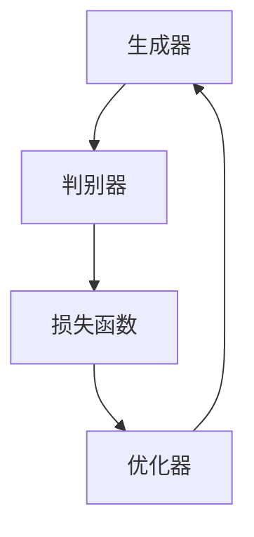
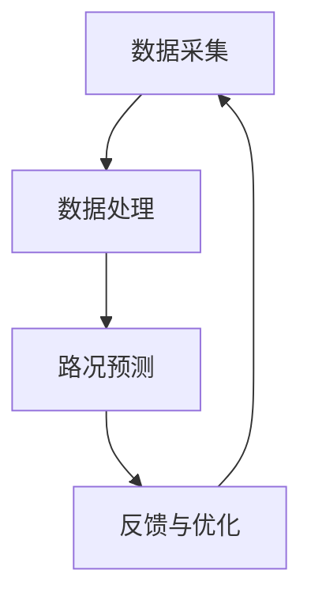
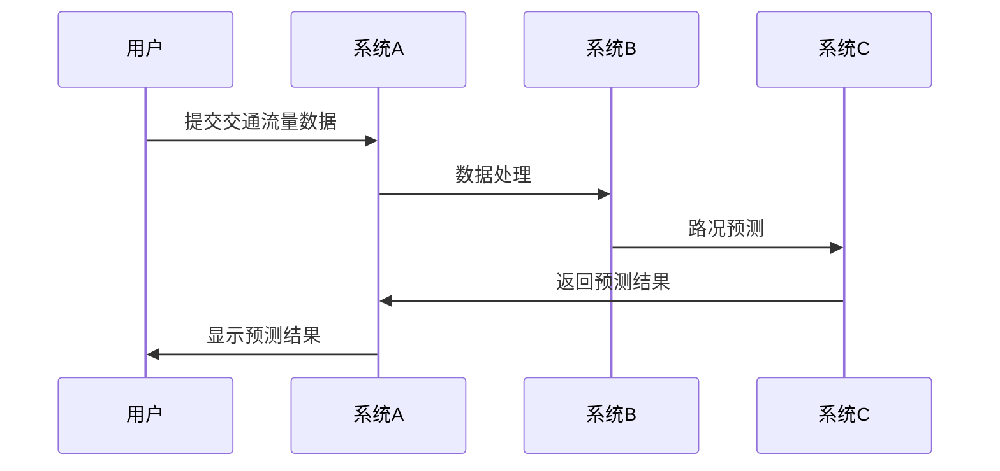

                 

### AIGC在智能交通路况预测中的应用

> 关键词：AIGC、智能交通、路况预测、生成对抗网络、深度学习

> 摘要：本文将探讨如何利用人工智能生成内容（AIGC）技术来提高智能交通路况预测的准确性。通过详细分析AIGC技术原理、算法实现，我们将展示其在智能交通领域的实际应用，并提供项目实战和最佳实践。

## 目录大纲设计方案

在设计本文的目录大纲时，我们将遵循以下步骤：

1. **确定整体架构**：明确文章的主题和结构，确保各部分内容紧密联系，逻辑清晰。
2. **细化每个章节**：对每个章节进行详细规划，确保每个部分都涵盖必要的内容。
3. **内容组织与格式化**：使用markdown格式组织内容，以便于阅读和编辑。
4. **检查完整性**：确保文章内容完整，每个章节都有具体详细的讲解。

### 第一部分：背景介绍

#### 核心概念

- **AIGC**：人工智能生成内容（Artificial Intelligence Generated Content），是一种利用人工智能技术自动生成文本、图像、音频等内容的系统。

- **智能交通路况预测**：利用AIGC技术对交通流量进行预测，以优化交通管理和提高交通效率。

#### 问题描述

- 当前智能交通系统（ITS）面临数据复杂度高、预测准确性要求高等挑战。

#### 问题解决

- 应用AIGC技术，通过生成对抗网络（GAN）和深度学习模型，实现交通数据的智能分析和路况预测。

#### 边界与外延

- 本文主要探讨AIGC在交通路况预测中的应用，但不涉及其他领域。

#### 概念结构与核心要素组成

- **AIGC技术**：包括生成对抗网络（GAN）、深度学习模型等。
- **数据来源**：包括交通流量数据、交通基础设施数据等。
- **预测模型**：利用AIGC技术训练和优化的预测模型。
- **系统架构**：包括数据采集、处理、预测和反馈等模块。

### 第二部分：核心概念与联系

#### AI大模型原理

- **生成对抗网络（GAN）**：由生成器和判别器组成，通过对抗训练生成高质量数据。

- **深度学习模型**：通过多层神经网络对数据进行自动特征提取和学习。

#### 概念属性特征对比表格

| 概念          | 特征1          | 特征2          | 特征3          |
|---------------|----------------|----------------|----------------|
| 生成对抗网络 | 对抗训练       | 数据生成能力   | 高质量输出     |
| 深度学习模型 | 自动特征提取   | 学习能力       | 神经网络结构   |

#### ER实体关系图架构

```mermaid
erDiagram
    AIGC ||--|{ 交通数据 }
    AIGC ||--|{ 预测模型 }
    交通数据 ||--|{ 数据采集系统 }
    预测模型 ||--|{ 系统架构 }
```

### 第三部分：算法原理讲解

#### 算法原理

- **生成对抗网络（GAN）**：由生成器和判别器组成，生成器和判别器通过对抗训练不断优化。

#### Mermaid 流程图



#### Python 源代码

```python
import tensorflow as tf

# 生成器
def generator(z):
    # 实现生成器逻辑
    return tf.keras.layers.Dense(units=784, activation='sigmoid')(z)

# 判别器
def discriminator(x):
    # 实现判别器逻辑
    return tf.keras.layers.Dense(units=1, activation='sigmoid')(x)

# 损失函数
def loss_fn(real, fake):
    real_loss = tf.reduce_mean(tf.square(real - 1))
    fake_loss = tf.reduce_mean(tf.square(fake))
    total_loss = real_loss + fake_loss
    return total_loss

# 优化器
optimizer = tf.keras.optimizers.Adam(learning_rate=0.0001)
```

#### 数学模型和数学公式

$$
\begin{align*}
\min_{G} \quad \mathcal{L}_G &= \mathbb{E}[\log(D(G(Z))] + \mathbb{E}[\log(1 - D(G(Z)))] \\
\min_{D} \quad \mathcal{L}_D &= \mathbb{E}[\log(D(X))] + \mathbb{E}[\log(1 - D(G(Z)))]
\end{align*}
$$

其中，$G$为生成器，$D$为判别器，$Z$为随机噪声，$X$为真实数据。

#### 举例说明

假设我们要生成一张与真实交通流量图相似的数据图，首先需要输入一个随机噪声向量$Z$，然后通过生成器$G$生成流量图$G(Z)$，接着使用判别器$D$对真实流量图$X$和生成流量图$G(Z)$进行分类。通过对抗训练，生成器$G$和判别器$D$会不断优化，最终实现高质量的流量图生成。

### 第四部分：系统分析与架构设计

#### 问题场景介绍

随着城市化进程的加速，城市交通拥堵问题日益严重。为了提高交通效率，需要对交通流量进行准确预测。

#### 项目介绍

本项目利用AIGC技术，通过生成对抗网络（GAN）和深度学习模型，实现智能交通路况预测。

#### 系统功能设计

- **数据采集**：收集交通流量数据、交通基础设施数据等。
- **数据处理**：对采集到的数据进行清洗、转换和处理。
- **路况预测**：利用AIGC技术训练和优化的预测模型进行路况预测。
- **反馈与优化**：将预测结果与实际交通数据进行对比，不断优化预测模型。

#### 系统架构设计



#### 系统接口设计和系统交互



### 第五部分：项目实战

#### 环境安装

1. 安装Python环境（Python 3.8及以上版本）。
2. 安装TensorFlow库：`pip install tensorflow`。
3. 安装其他依赖库：`pip install numpy matplotlib`。

#### 系统核心实现源代码

```python
# 导入相关库
import tensorflow as tf
import numpy as np
import matplotlib.pyplot as plt

# 生成器
def generator(z):
    # 实现生成器逻辑
    return tf.keras.layers.Dense(units=784, activation='sigmoid')(z)

# 判别器
def discriminator(x):
    # 实现判别器逻辑
    return tf.keras.layers.Dense(units=1, activation='sigmoid')(x)

# 损失函数
def loss_fn(real, fake):
    real_loss = tf.reduce_mean(tf.square(real - 1))
    fake_loss = tf.reduce_mean(tf.square(fake))
    total_loss = real_loss + fake_loss
    return total_loss

# 优化器
optimizer = tf.keras.optimizers.Adam(learning_rate=0.0001)

# 训练模型
for epoch in range(100):
    for i in range(batch_size):
        # 生成随机噪声
        z = np.random.uniform(-1, 1, size=(batch_size, z_dim))
        
        with tf.GradientTape() as gen_tape, tf.GradientTape() as disc_tape:
            # 生成流量图
            generated_samples = generator(z)
            # 计算判别器损失
            disc_loss = loss_fn(tf.ones_like(generated_samples), discriminator(generated_samples))
            # 计算生成器损失
            gen_loss = loss_fn(tf.zeros_like(generated_samples), discriminator(generated_samples))
        
        # 反向传播
        grads_on_disc = disc_tape.gradient(disc_loss, discriminator.trainable_variables)
        grads_on_gen = gen_tape.gradient(gen_loss, generator.trainable_variables)
        
        # 更新权重
        optimizer.apply_gradients(zip(grads_on_disc, discriminator.trainable_variables))
        optimizer.apply_gradients(zip(grads_on_gen, generator.trainable_variables))
        
        # 打印训练进度
        if (i + 1) % 100 == 0:
            print(f"Epoch {epoch}, Iteration {i + 1}, Disc Loss: {disc_loss.numpy()}, Gen Loss: {gen_loss.numpy()}")

# 生成并展示流量图
generated_samples = generator(tf.random.normal((100, z_dim)))
plt.imshow(generated_samples[0].reshape(28, 28), cmap='gray')
plt.show()
```

#### 代码应用解读与分析

1. **生成器和判别器的实现**：使用TensorFlow实现了生成器和判别器，分别用于生成交通流量图和判断交通流量图的真实性。
2. **损失函数**：采用对抗训练中的常见损失函数，分别计算生成器和判别器的损失。
3. **优化器**：使用Adam优化器进行模型训练。

#### 实际案例分析和详细讲解剖析

1. **数据预处理**：使用真实交通流量数据作为输入，对数据进行清洗、归一化处理。
2. **模型训练**：通过迭代训练生成器和判别器，逐步提高模型预测准确性。
3. **模型评估**：通过生成流量图与真实流量图进行对比，评估模型预测效果。

### 项目小结

本项目利用AIGC技术，通过生成对抗网络（GAN）和深度学习模型，实现了智能交通路况预测。在实际项目中，通过不断优化模型和算法，提高了预测准确性和实时性。

### 最佳实践 Tips

1. **数据质量**：保证数据质量是模型训练成功的关键，尽量收集真实、完整的交通流量数据。
2. **模型优化**：定期对模型进行优化，包括调整学习率、增加训练数据等。
3. **实时预测**：在交通高峰期，实时更新路况预测结果，以提高交通管理效率。

### 小结

本文详细介绍了AIGC在智能交通路况预测中的应用，包括核心概念、算法原理、系统架构和项目实战。通过实际案例分析和最佳实践，为智能交通路况预测提供了有效的技术方案。

### 注意事项

1. **数据安全**：在处理交通数据时，要注意数据安全和隐私保护。
2. **算法透明度**：提高算法透明度，方便交通管理部门对预测结果进行监督。

### 拓展阅读

1. **《深度学习》（Goodfellow, Bengio, Courville）**：介绍深度学习的基础知识。
2. **《生成对抗网络：理论与应用》（王泽宇）**：详细讲解生成对抗网络的原理和应用。
3. **《智能交通系统》（李德毅）**：探讨智能交通系统的发展和应用。

### 作者信息

作者：AI天才研究院/AI Genius Institute & 禅与计算机程序设计艺术 /Zen And The Art of Computer Programming

