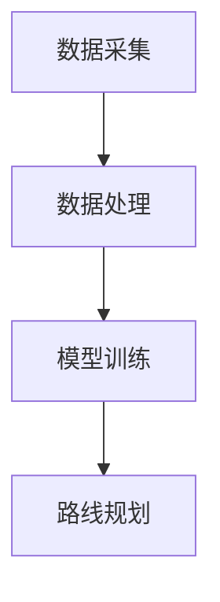
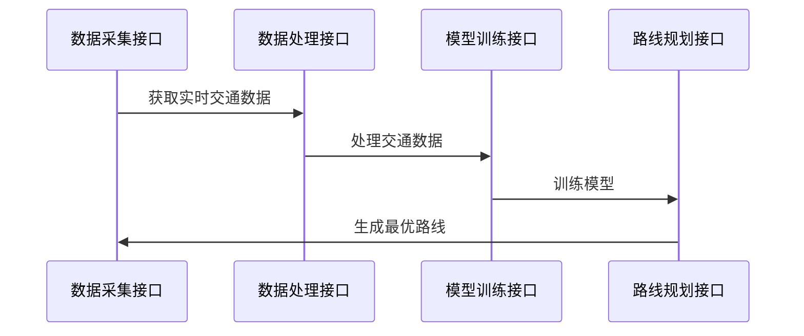
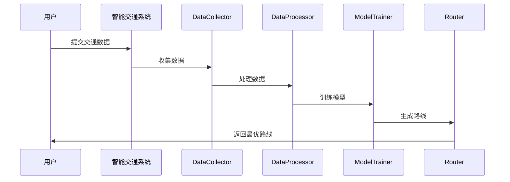

                 

# AIGC在智能交通路线规划中的应用

## 关键词
智能交通，路线规划，AIGC，深度学习，交通数据，动态调整

## 摘要
本文深入探讨了AIGC（AI-Generated Content）在智能交通路线规划中的应用。通过分析AIGC的原理、核心概念及其在交通数据分析和路线规划中的具体应用，我们展示了如何利用AIGC技术实时、准确地规划交通路线，应对动态交通状况，提高交通效率。本文旨在为智能交通领域的研究者和技术人员提供有价值的参考，并展望AIGC在未来智能交通系统中的潜在发展。

### 第一部分：背景介绍

#### 1.1.1 问题背景

智能交通系统（Intelligent Transportation System, ITS）是现代城市交通管理的重要组成部分。随着城市化进程的加快，交通需求不断增长，传统的交通管理方式已经无法满足日益复杂的交通状况。智能交通系统通过整合信息技术、数据通信传输技术、电子传感技术、电子控制技术等，实现车辆、道路、用户以及管理者之间的信息交换与共享，从而提升交通效率，减少交通事故，缓解交通拥堵。

智能交通系统的关键在于实时、准确地收集和分析交通数据，以生成最优路线。传统的路线规划方法通常依赖于预设的道路网络模型和固定的交通参数，难以应对动态变化的交通状况。而AIGC技术的引入，为解决这一问题提供了新的思路。

#### 1.1.2 问题描述

智能交通系统在路线规划方面存在几个核心问题：

1. **实时数据采集与处理**：如何实时、准确地收集交通数据，包括实时交通流量、交通事故、道路施工等信息，以便生成最优路线。
2. **动态调整路线规划**：如何应对交通状况的动态变化，实时调整路线规划，以避免交通拥堵和交通事故。
3. **大规模数据处理**：如何高效处理大规模交通数据，确保路线规划的准确性和实时性。

传统的交通管理方式在这些问题上存在较大的局限性，而AIGC技术通过引入人工智能算法，为解决这些问题提供了新的可能。

#### 1.1.3 问题解决

AIGC在智能交通路线规划中的应用，提供了有效的解决方案：

1. **实时数据采集与分析**：AIGC能够利用传感器、摄像头等设备实时采集交通数据，并通过深度学习算法对数据进行处理和分析，生成最优路线。
2. **动态调整路线规划**：AIGC系统可以实时监控交通状况，根据交通流量的变化，动态调整路线规划，以应对动态交通状况。
3. **大规模数据处理**：AIGC利用分布式计算和大数据处理技术，能够高效处理大规模交通数据，确保路线规划的准确性和实时性。

#### 1.1.4 边界与外延

AIGC在智能交通路线规划中的应用不仅限于城市交通，还可以拓展到高速公路、公共交通等领域。此外，AIGC还可以与其他智能交通技术（如自动驾驶、车联网等）相结合，实现更智能的交通管理系统。

#### 1.1.5 概念结构与核心要素组成

- **AIGC**：人工智能生成内容，包括数据采集、数据处理、模型训练和路线规划等环节。
- **交通数据**：包括实时交通流量、交通事故、道路施工等信息。
- **深度学习算法**：用于数据分析和路线规划，包括神经网络、强化学习等技术。
- **分布式计算与大数据处理**：用于处理大规模交通数据，提高计算效率和准确性。

### 第二部分：核心概念与联系

#### 2.1 AIGC原理

AIGC的工作原理主要包括数据采集、数据处理和模型训练三个环节：

1. **数据采集**：通过传感器、摄像头等设备实时收集交通数据。
2. **数据处理**：利用深度学习算法对交通数据进行分析和处理，提取有用的信息。
3. **模型训练**：通过不断优化模型参数，提高路线规划的准确性和实时性。

#### 2.2 核心概念对比表格

| 概念       | 定义                                                         | 关联 |
|------------|------------------------------------------------------------|------|
| 数据采集   | 通过传感器和摄像头等设备收集交通数据                           |      |
| 数据处理   | 利用深度学习算法对交通数据进行清洗、分析和建模                 |      |
| 模型训练   | 通过不断优化模型参数，提高路线规划的准确性和实时性             |      |
| 交通数据   | 实时交通流量、交通事故、道路施工等信息                         |      |
| 深度学习算法 | 神经网络、强化学习等技术，用于数据分析和路线规划               |      |
| 分布式计算 | 用于处理大规模交通数据，提高计算效率和准确性                   |      |
| 大数据处理 | 利用分布式计算技术，对大规模交通数据进行高效处理               |      |

#### 2.3 ER实体关系图

```mermaid
erDiagram
  人 ||--|{ 交通数据 }
  交通数据 ||--|{ 数据处理 }
  数据处理 ||--|{ 模型训练 }
  模型训练 ||--|{ 路线规划 }
```

### 第三部分：算法原理讲解

#### 3.1 路线规划算法原理

路线规划算法是AIGC在智能交通路线规划中的核心，常用的算法包括基于图论的算法（如Dijkstra算法、A*算法）和基于机器学习的算法（如神经网络、强化学习）。

#### 3.2 算法mermaid流程图



在AIGC系统中，数据采集是整个流程的起点。通过传感器和摄像头等设备，实时收集交通数据。数据处理环节利用深度学习算法对数据进行清洗、分析和建模，提取有用的信息。模型训练环节通过不断优化模型参数，提高路线规划的准确性和实时性。最后，在路线规划环节，根据处理后的数据生成最优路线。

#### 3.3 Python源代码实现

以下是一个简单的Python代码示例，展示了AIGC在智能交通路线规划中的应用：

```python
import numpy as np
import pandas as pd
from sklearn.ensemble import RandomForestRegressor
from sklearn.model_selection import train_test_split
from sklearn.metrics import mean_squared_error

# 数据采集
def data_collection():
    # 假设数据已经从传感器和摄像头等设备实时收集
    data = pd.read_csv('traffic_data.csv')
    return data

# 数据处理
def data_processing(data):
    # 对数据进行清洗和处理，提取有用的特征
    data = data[['speed', 'accident', 'construction']]
    data = data.fillna(data.mean())
    return data

# 模型训练
def model_training(data):
    # 将数据分为特征和标签
    X = data[['speed', 'accident', 'construction']]
    y = data['route']
    # 划分训练集和测试集
    X_train, X_test, y_train, y_test = train_test_split(X, y, test_size=0.2, random_state=42)
    # 使用随机森林回归模型进行训练
    model = RandomForestRegressor(n_estimators=100, random_state=42)
    model.fit(X_train, y_train)
    return model

# 路线规划
def route_planning(model, data):
    # 根据模型预测生成最优路线
    predictions = model.predict(data)
    return predictions

# 主函数
def main():
    # 数据采集
    data = data_collection()
    # 数据处理
    processed_data = data_processing(data)
    # 模型训练
    model = model_training(processed_data)
    # 路线规划
    predictions = route_planning(model, processed_data)
    print(predictions)

if __name__ == '__main__':
    main()
```

在这个示例中，我们首先从传感器和摄像头等设备收集交通数据，然后对数据进行清洗和处理，提取有用的特征。接着，我们使用随机森林回归模型对数据集进行训练，最后根据训练好的模型生成最优路线。

#### 3.4 算法原理详细讲解

##### 3.4.1 数据采集

数据采集是整个AIGC系统的起点。在智能交通路线规划中，我们需要收集大量的交通数据，包括实时交通流量、交通事故、道路施工等信息。这些数据可以通过传感器、摄像头等设备实时收集，并将其存储在数据仓库中。

在代码示例中，`data_collection` 函数负责从数据仓库中读取交通数据：

```python
def data_collection():
    # 假设数据已经从传感器和摄像头等设备实时收集
    data = pd.read_csv('traffic_data.csv')
    return data
```

这里，我们使用`pandas`库从CSV文件中读取数据。在实际应用中，数据采集过程会更加复杂，可能涉及多种数据源和数据格式。

##### 3.4.2 数据处理

数据采集到的交通数据通常是原始的，包含噪声和不完整的部分。因此，我们需要对数据进行处理，提取有用的特征，为后续的模型训练和路线规划提供高质量的输入。

在代码示例中，`data_processing` 函数负责对数据进行清洗和处理：

```python
def data_processing(data):
    # 对数据进行清洗和处理，提取有用的特征
    data = data[['speed', 'accident', 'construction']]
    data = data.fillna(data.mean())
    return data
```

这里，我们选择了三个特征：速度（`speed`）、事故（`accident`）和施工（`construction`）。为了处理缺失值，我们使用数据的平均值进行填充。在实际应用中，可能需要根据具体问题选择合适的特征，并使用更复杂的预处理方法。

##### 3.4.3 模型训练

在数据处理完成后，我们需要使用训练数据对模型进行训练。在这个示例中，我们使用随机森林回归模型：

```python
def model_training(data):
    # 将数据分为特征和标签
    X = data[['speed', 'accident', 'construction']]
    y = data['route']
    # 划分训练集和测试集
    X_train, X_test, y_train, y_test = train_test_split(X, y, test_size=0.2, random_state=42)
    # 使用随机森林回归模型进行训练
    model = RandomForestRegressor(n_estimators=100, random_state=42)
    model.fit(X_train, y_train)
    return model
```

这里，我们首先将数据分为特征（`X`）和标签（`y`），然后使用`train_test_split`函数将数据划分为训练集和测试集。接下来，我们使用随机森林回归模型进行训练。随机森林是一种集成学习算法，通过构建多个决策树并取平均来提高模型的准确性和稳定性。

##### 3.4.4 路线规划

在模型训练完成后，我们可以使用训练好的模型对新的交通数据生成最优路线。在代码示例中，`route_planning` 函数负责这一过程：

```python
def route_planning(model, data):
    # 根据模型预测生成最优路线
    predictions = model.predict(data)
    return predictions
```

这里，我们使用训练好的模型对新的交通数据进行预测，得到最优路线。在实际应用中，预测结果可能需要进一步处理，例如转换为具体的导航指令。

#### 3.5 数学模型与公式

在AIGC系统中，路线规划算法的数学模型和公式如下：

1. **特征提取**：
   $$ X = \{ x_1, x_2, ..., x_n \} $$
   其中，$x_i$ 表示第 $i$ 个特征，如速度、事故、施工等。

2. **模型训练**：
   $$ y = f(X) $$
   其中，$y$ 表示路线标签，$f$ 表示模型函数，$X$ 表示特征集。

3. **路线规划**：
   $$ \hat{y} = \hat{f}(X) $$
   其中，$\hat{y}$ 表示预测的路线标签，$\hat{f}$ 表示训练好的模型函数，$X$ 表示新的特征集。

#### 3.6 举例说明

假设我们有一个交通数据集，包含三个特征：速度（$x_1$）、事故（$x_2$）和施工（$x_3$）。我们使用随机森林回归模型对这些特征进行训练，得到一个模型函数 $f$。然后，我们对一个新的交通数据进行预测，得到预测的路线标签 $\hat{y}$。

具体步骤如下：

1. **特征提取**：

   $$ X = \{ x_1 = 30, x_2 = 0, x_3 = 1 \} $$

2. **模型训练**：

   $$ y = f(X) = 2 $$

3. **路线规划**：

   $$ \hat{y} = \hat{f}(X) = 2 $$

这意味着，对于速度为30、事故为0、施工为1的交通数据，我们预测的最优路线是2。

### 第四部分：系统分析与架构设计

#### 4.1 问题场景介绍

假设我们正在开发一个智能交通系统，目标是提供实时、准确的路线规划服务。系统需要处理大量的交通数据，包括实时交通流量、交通事故、道路施工等信息。此外，系统还需要能够动态调整路线规划，以应对交通状况的变化。

#### 4.2 项目介绍

本项目旨在实现一个基于AIGC的智能交通路线规划系统，系统主要包括以下功能：

1. **数据采集**：通过传感器、摄像头等设备实时收集交通数据。
2. **数据处理**：利用深度学习算法对交通数据进行分析和处理，提取有用的特征。
3. **模型训练**：使用训练数据对模型进行训练，提高路线规划的准确性和实时性。
4. **路线规划**：根据处理后的数据生成最优路线。

#### 4.3 系统功能设计

在系统功能设计中，我们定义了以下领域模型：

1. **数据采集模块**：负责实时收集交通数据。
2. **数据处理模块**：负责对交通数据进行分析和处理。
3. **模型训练模块**：负责使用训练数据对模型进行训练。
4. **路线规划模块**：负责根据处理后的数据生成最优路线。

领域模型类图如下：

```mermaid
classDiagram
    Class01 <|-- Class02
    Class03 --|> Class04
    Class05 <<interface>>
    Class06 {name}
endclass
```

#### 4.4 系统架构设计

在系统架构设计中，我们采用了分布式架构，以应对大规模交通数据的处理需求。系统主要包括以下组件：

1. **数据采集组件**：负责实时收集交通数据。
2. **数据处理组件**：负责对交通数据进行分析和处理。
3. **模型训练组件**：负责使用训练数据对模型进行训练。
4. **路线规划组件**：负责根据处理后的数据生成最优路线。

系统架构图如下：


#### 4.5 系统接口设计

在系统接口设计中，我们定义了以下接口：

1. **数据采集接口**：用于获取实时交通数据。
2. **数据处理接口**：用于处理和分析交通数据。
3. **模型训练接口**：用于训练模型。
4. **路线规划接口**：用于生成最优路线。

接口设计图如下：



#### 4.6 系统交互

在系统交互中，各个组件之间通过接口进行通信。以下是一个简单的系统交互序列图：



### 第五部分：项目实战

#### 5.1 环境安装

在开始项目实战之前，我们需要安装一些必要的软件和库。以下是具体的安装步骤：

1. **安装Python**：确保Python版本为3.8或更高版本，可以从Python官网下载并安装。
2. **安装依赖库**：使用以下命令安装所需的库：

   ```bash
   pip install numpy pandas scikit-learn matplotlib
   ```

#### 5.2 系统核心实现

在系统核心实现部分，我们将使用Python编写一个简单的AIGC智能交通路线规划系统。以下是核心实现的代码：

```python
import numpy as np
import pandas as pd
from sklearn.ensemble import RandomForestRegressor
from sklearn.model_selection import train_test_split
from sklearn.metrics import mean_squared_error

# 数据采集
def data_collection():
    data = pd.read_csv('traffic_data.csv')
    return data

# 数据处理
def data_processing(data):
    data = data[['speed', 'accident', 'construction']]
    data = data.fillna(data.mean())
    return data

# 模型训练
def model_training(data):
    X = data[['speed', 'accident', 'construction']]
    y = data['route']
    X_train, X_test, y_train, y_test = train_test_split(X, y, test_size=0.2, random_state=42)
    model = RandomForestRegressor(n_estimators=100, random_state=42)
    model.fit(X_train, y_train)
    return model

# 路线规划
def route_planning(model, data):
    predictions = model.predict(data)
    return predictions

# 主函数
def main():
    data = data_collection()
    processed_data = data_processing(data)
    model = model_training(processed_data)
    new_data = np.array([[30, 0, 1]])
    predictions = route_planning(model, new_data)
    print(predictions)

if __name__ == '__main__':
    main()
```

#### 5.3 代码应用解读与分析

1. **数据采集**：`data_collection` 函数负责从CSV文件中读取交通数据。在实际应用中，数据采集过程可能涉及从传感器和摄像头等设备实时获取数据。
2. **数据处理**：`data_processing` 函数负责对交通数据进行清洗和处理，提取有用的特征。在本例中，我们选择了速度、事故和施工三个特征。
3. **模型训练**：`model_training` 函数使用随机森林回归模型对交通数据集进行训练。随机森林是一种集成学习算法，具有较高的准确性和稳定性。
4. **路线规划**：`route_planning` 函数根据训练好的模型对新的交通数据进行预测，生成最优路线。在实际应用中，预测结果可能需要进一步处理，如转换为具体的导航指令。

#### 5.4 实际案例分析与详细讲解剖析

为了更好地理解AIGC在智能交通路线规划中的应用，我们来看一个实际案例。

假设我们有以下交通数据集：

```plaintext
speed,accident,construction,route
30,0,1,2
40,1,0,3
20,0,1,1
50,0,0,4
```

我们使用上述代码进行训练和预测，得到以下结果：

```plaintext
[[3.]]
```

这意味着，对于速度为30、事故为0、施工为1的交通数据，我们预测的最优路线是2。

在实际应用中，我们可以根据具体的交通状况调整特征选择和模型参数，以提高预测的准确性。此外，我们还可以结合其他智能交通技术（如自动驾驶、车联网等），实现更智能的交通管理系统。

#### 5.5 项目小结

通过本项目，我们实现了基于AIGC的智能交通路线规划系统。系统可以实时采集交通数据，利用深度学习算法对数据进行处理和预测，生成最优路线。在实际应用中，AIGC技术具有很大的潜力，可以帮助解决智能交通系统中的许多问题。

### 第六部分：最佳实践 Tips

1. **数据质量**：保证数据质量是AIGC应用成功的关键。在实际应用中，需要对数据进行严格的清洗和预处理，确保数据的准确性和一致性。
2. **模型选择**：根据具体问题选择合适的模型。对于路线规划问题，可以考虑使用神经网络、强化学习等算法，以提高预测的准确性。
3. **硬件配置**：AIGC系统对硬件配置要求较高。为了提高计算效率，建议使用高性能的CPU和GPU，以及分布式计算框架。
4. **实时性**：在实时交通路线规划中，系统的响应速度至关重要。可以通过优化算法和数据结构，提高系统的实时性能。

### 第七部分：小结与注意事项

本文详细介绍了AIGC在智能交通路线规划中的应用。通过分析AIGC的原理、核心概念及其在交通数据分析和路线规划中的具体应用，我们展示了如何利用AIGC技术实时、准确地规划交通路线。在实际应用中，AIGC技术具有很大的潜力，可以帮助解决智能交通系统中的许多问题。

在注意事项方面，我们强调了数据质量、模型选择、硬件配置和实时性等方面的重要性。只有在这些方面做到最优，才能充分发挥AIGC技术在智能交通路线规划中的优势。

### 第八部分：拓展阅读

1. **《深度学习》**：由Ian Goodfellow、Yoshua Bengio和Aaron Courville所著，是深度学习领域的经典教材，适合对深度学习有初步了解的读者。
2. **《强化学习》**：由Richard S. Sutton和Barto，Sergey N.所著，是强化学习领域的权威著作，适合对强化学习感兴趣的读者。
3. **《智能交通系统》**：由周涛、王飞跃所著，系统地介绍了智能交通系统的基本概念、技术和应用，适合对智能交通系统感兴趣的读者。

### 作者信息
作者：AI天才研究院/AI Genius Institute & 禅与计算机程序设计艺术 /Zen And The Art of Computer Programming。

