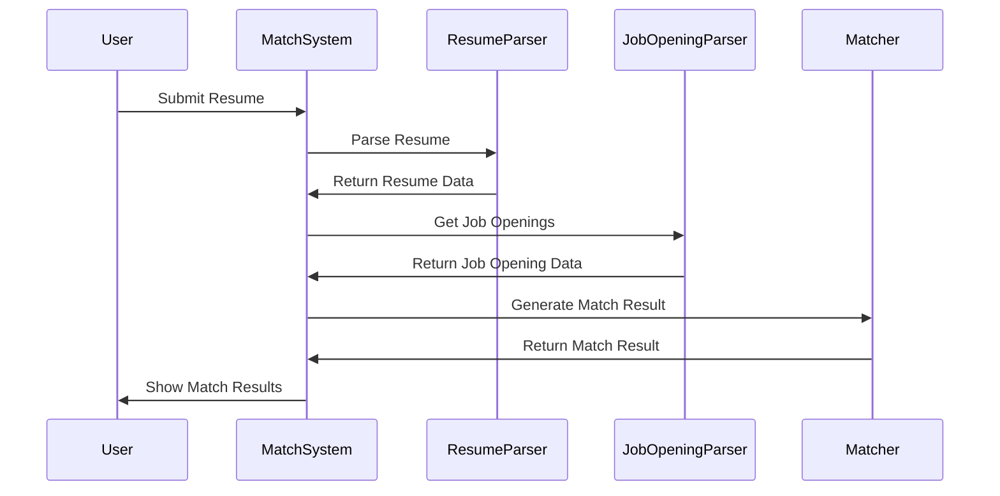

                 

# AIGC在智能人才匹配系统中的应用

## 关键词

- **AIGC**
- **智能人才匹配**
- **生成对抗网络 (GAN)**
- **强化学习 (RL)**
- **自然语言处理 (NLP)**
- **人才匹配效率**
- **人才匹配效果**
- **人才匹配成本**

## 摘要

本文旨在探讨AIGC（自适应智能生成内容）在智能人才匹配系统中的应用。随着人工智能技术的快速发展，智能人才匹配成为企业关注的焦点。AIGC技术通过其强大的内容生成能力，为智能人才匹配系统提供了新的解决方案。本文首先介绍了AIGC的基本原理和重要性，然后分析了AIGC的核心概念与联系，接着详细讲解了AIGC算法原理和数学模型，最后通过一个实际案例展示了AIGC在智能人才匹配系统中的具体应用。本文旨在为读者提供一个全面而深入的了解，以促进AIGC技术在智能人才匹配领域的进一步发展。

## 目录大纲

----------------------------------------------------------------

## 第一部分: 背景介绍

### 第1章: 问题背景与AIGC概述

### 1.1 问题背景

#### 1.1.1 人工智能时代的来临

#### 1.1.2 智能人才匹配的需求与挑战

#### 1.1.3 AIGC的概念与特点

### 1.2 AIGC的基本原理

#### 1.2.1 AIGC的技术框架

#### 1.2.2 AIGC的核心算法

#### 1.2.3 AIGC的应用领域

### 1.3 AIGC在智能人才匹配系统中的重要性

#### 1.3.1 提高人才匹配效率

#### 1.3.2 优化人才匹配效果

#### 1.3.3 降低人才匹配成本

### 1.4 AIGC在智能人才匹配系统中的应用前景

#### 1.4.1 当前应用现状

#### 1.4.2 未来发展趋势

### 1.5 本章小结

----------------------------------------------------------------

## 第二部分: 核心概念与联系

### 第2章: AIGC的核心概念与联系

### 2.1 AIGC的核心概念

#### 2.1.1 自动生成内容 (AIGC)

#### 2.1.2 生成对抗网络 (GAN)

#### 2.1.3 强化学习 (RL)

#### 2.1.4 自然语言处理 (NLP)

### 2.2 概念属性特征对比表格

### 2.3 AIGC的ER实体关系图

### 2.4 AIGC与其他技术的联系

### 2.5 本章小结

----------------------------------------------------------------

## 第三部分: 算法原理讲解

### 第3章: AIGC算法原理讲解

### 3.1 AIGC算法概述

#### 3.1.1 AIGC算法的发展历程

#### 3.1.2 AIGC算法的主要分类

#### 3.1.3 AIGC算法的核心流程

### 3.2 生成对抗网络 (GAN) 原理详解

#### 3.2.1 GAN的基本概念

#### 3.2.2 GAN的核心组成部分

#### 3.2.3 GAN的算法流程

#### 3.2.4 GAN的应用实例

### 3.3 强化学习 (RL) 原理讲解

#### 3.3.1 RL的基本概念

#### 3.3.2 RL的核心算法

#### 3.3.3 RL的应用场景

#### 3.3.4 RL的案例解析

### 3.4 自然语言处理 (NLP) 原理讲解

#### 3.4.1 NLP的基本概念

#### 3.4.2 NLP的核心技术

#### 3.4.3 NLP的应用实例

### 3.5 AIGC算法的融合与应用

#### 3.5.1 GAN + RL 的融合应用

#### 3.5.2 GAN + NLP 的融合应用

#### 3.5.3 AIGC算法的其他融合应用

### 3.6 本章小结

----------------------------------------------------------------

## 第四部分: 数学模型和公式讲解

### 第4章: 数学模型和公式讲解

### 4.1 数学模型概述

#### 4.1.1 数学模型的基本概念

#### 4.1.2 数学模型在AIGC中的应用

#### 4.1.3 数学模型的分类

### 4.2 公式讲解

#### 4.2.1 损失函数

#### 4.2.2 优化算法

#### 4.2.3 模型评估指标

### 4.3 数学公式与算法原理讲解

#### 4.3.1 损失函数的公式讲解

#### 4.3.2 优化算法的原理讲解

#### 4.3.3 模型评估指标的讲解

### 4.4 举例说明

#### 4.4.1 损失函数的举例说明

#### 4.4.2 优化算法的举例说明

#### 4.4.3 模型评估指标的举例说明

### 4.5 本章小结

--------------------

----------------------------------------------------------------

## 第一部分：背景介绍

### 第1章：问题背景与AIGC概述

#### 1.1 问题背景

随着人工智能技术的快速发展，人工智能已经渗透到了我们生活的方方面面。从自动驾驶汽车到智能家居，从智能客服到医疗诊断，人工智能正在改变我们的生活方式和工作模式。在这个背景下，智能人才匹配系统应运而生。智能人才匹配系统旨在通过人工智能技术，帮助企业和个人快速、高效地找到合适的人才。

然而，智能人才匹配系统面临着许多挑战。首先，人才匹配需求复杂多样，不同企业和个人对于人才的需求各不相同。其次，人才库庞大，如何从海量数据中快速找到合适的人才成为一大难题。此外，人才匹配效果和效率的提升需要大量的时间和资源投入。

为了解决这些问题，我们需要寻找一种新的解决方案。AIGC（自适应智能生成内容）技术应运而生。AIGC是一种基于人工智能的自动内容生成技术，能够通过学习大量数据，自动生成高质量的内容。AIGC技术可以应用于智能人才匹配系统，通过生成大量的候选人才信息，提高人才匹配效率和效果。

#### 1.1.1 人工智能时代的来临

人工智能时代的来临是科技发展的必然趋势。自21世纪初以来，人工智能技术取得了显著的进展，从最初的简单规则系统，发展到如今能够模拟人类智能的深度学习模型。这些技术的发展，使得人工智能在各个领域都取得了突破性的成果。

人工智能的发展离不开数据。大量高质量的数据是训练人工智能模型的基础。随着互联网和物联网的普及，数据量呈爆炸式增长，为人工智能的发展提供了丰富的数据资源。

#### 1.1.2 智能人才匹配的需求与挑战

智能人才匹配系统是企业招聘和个人求职的重要工具。企业需要找到合适的人才来满足业务需求，个人需要找到能够发挥自己才能的工作。然而，传统的招聘方式和人才匹配系统存在许多问题。

首先，传统的人才匹配系统依赖于人工筛选，效率低下。其次，传统系统无法全面了解求职者的技能和潜力，容易导致人才匹配不准确。此外，传统系统在面对大规模招聘时，难以应对，容易出现人才匹配失败的情况。

为了解决这些问题，我们需要一种更加智能、高效的解决方案。AIGC技术的引入，为智能人才匹配系统提供了新的思路。

#### 1.1.3 AIGC的概念与特点

AIGC（自适应智能生成内容）是一种基于人工智能的自动内容生成技术。它能够通过学习大量数据，自动生成高质量的内容。AIGC技术具有以下几个特点：

1. **自动生成内容**：AIGC技术能够自动生成各种类型的内容，如图文、音频、视频等。这种自动生成能力极大地提高了内容的生产效率。

2. **自适应能力**：AIGC技术可以根据用户的需求和反馈，自适应地调整生成的内容。这种自适应能力使得AIGC技术能够更好地满足用户需求。

3. **高质量内容**：AIGC技术通过深度学习等技术，能够生成高质量的内容。这种高质量的内容不仅具有实际应用价值，还能够提高用户体验。

AIGC技术在智能人才匹配系统中的应用，有望解决传统系统存在的效率低、匹配不准确等问题，为企业招聘和个人求职提供更加智能、高效的解决方案。

#### 1.2 AIGC的基本原理

AIGC（自适应智能生成内容）技术是基于人工智能的自动内容生成技术。它通过深度学习、生成对抗网络（GAN）、强化学习（RL）等先进技术，实现自动生成高质量的内容。

AIGC技术的基本原理可以分为以下几个步骤：

1. **数据采集**：首先，AIGC技术需要采集大量与人才匹配相关的数据，包括求职者的简历、项目经历、技能标签等。

2. **数据预处理**：对采集到的数据进行分析和清洗，去除无效数据，提取有用的信息。

3. **模型训练**：使用预处理后的数据训练AIGC模型。AIGC模型通常由多个模块组成，包括生成器、判别器、强化学习模块等。

4. **内容生成**：通过训练好的AIGC模型，自动生成与人才匹配相关的各种内容，如图文、音频、视频等。

5. **内容优化**：根据用户反馈和需求，对生成的内容进行优化，提高内容的质量和适用性。

#### 1.2.1 AIGC的技术框架

AIGC的技术框架主要包括以下几个部分：

1. **数据采集与预处理模块**：负责采集和处理与人才匹配相关的数据。

2. **生成对抗网络（GAN）模块**：负责生成高质量的内容。

3. **强化学习（RL）模块**：负责优化生成的内容，提高内容的质量和适用性。

4. **自然语言处理（NLP）模块**：负责处理与自然语言相关的任务，如文本生成、语义理解等。

5. **内容优化模块**：负责根据用户反馈和需求，对生成的内容进行优化。

#### 1.2.2 AIGC的核心算法

AIGC技术采用了多种核心算法，包括生成对抗网络（GAN）、强化学习（RL）和自然语言处理（NLP）等。这些算法在AIGC技术中发挥了关键作用。

1. **生成对抗网络（GAN）**：GAN是一种基于博弈论的深度学习模型，由生成器和判别器组成。生成器负责生成内容，判别器负责判断生成内容是否真实。通过不断训练，生成器能够生成越来越真实的内容。

2. **强化学习（RL）**：强化学习是一种通过试错学习来获取最优策略的机器学习算法。在AIGC技术中，强化学习用于优化生成的内容，提高内容的质量和适用性。

3. **自然语言处理（NLP）**：NLP技术用于处理与自然语言相关的任务，如文本生成、语义理解等。在AIGC技术中，NLP技术用于生成和优化与人才匹配相关的文本内容。

#### 1.2.3 AIGC的应用领域

AIGC技术具有广泛的应用领域，包括但不限于以下几方面：

1. **智能人才匹配系统**：AIGC技术可以应用于智能人才匹配系统，通过自动生成候选人信息，提高人才匹配效率和效果。

2. **内容创作**：AIGC技术可以自动生成各种类型的内容，如图文、音频、视频等，为内容创作者提供便利。

3. **教育**：AIGC技术可以用于自动生成教育内容，如课程、练习题等，提高教育质量。

4. **娱乐**：AIGC技术可以用于自动生成娱乐内容，如电影、音乐、游戏等，为用户提供丰富多样的娱乐体验。

#### 1.3 AIGC在智能人才匹配系统中的重要性

AIGC技术在智能人才匹配系统中具有重要作用，主要体现在以下几个方面：

1. **提高人才匹配效率**：AIGC技术可以通过自动生成大量的候选人信息，快速筛选出符合要求的候选人，大大提高人才匹配的效率。

2. **优化人才匹配效果**：AIGC技术可以通过学习和优化，生成更符合用户需求的候选人信息，提高人才匹配的准确性。

3. **降低人才匹配成本**：AIGC技术可以通过自动化处理，减少人工干预，降低人才匹配的成本。

4. **提升用户体验**：AIGC技术可以提供更加丰富、多样化的候选人信息，提升用户的使用体验。

#### 1.4 AIGC在智能人才匹配系统中的应用前景

随着人工智能技术的不断进步，AIGC在智能人才匹配系统中的应用前景非常广阔。未来，AIGC技术有望在以下几个方面取得突破：

1. **个性化人才匹配**：通过深度学习和个性化推荐技术，实现更加精准的人才匹配，满足企业和个人的个性化需求。

2. **多模态内容生成**：结合语音、图像、视频等多种模态，生成更加丰富、全面的候选人信息。

3. **智能招聘辅助**：通过AIGC技术，为企业提供智能招聘辅助，提高招聘效率和效果。

4. **人才发展预测**：利用AIGC技术，预测人才的发展潜力，为企业提供更有价值的人才管理决策。

#### 1.5 本章小结

本章对智能人才匹配系统中的AIGC技术进行了背景介绍，包括问题背景、AIGC的基本原理、重要性以及应用前景。通过本章的介绍，读者可以初步了解AIGC技术如何应用于智能人才匹配系统，为后续章节的深入讲解打下基础。

## 第二部分：核心概念与联系

### 第2章：AIGC的核心概念与联系

#### 2.1 AIGC的核心概念

AIGC（自适应智能生成内容）技术是一种基于人工智能的自动内容生成技术。它通过深度学习、生成对抗网络（GAN）、强化学习（RL）等先进技术，实现自动生成高质量的内容。AIGC技术具有以下几个核心概念：

1. **自动生成内容（AIGC）**：自动生成内容是AIGC技术的核心概念，指的是通过机器学习算法，自动生成各种类型的内容，如图文、音频、视频等。这种自动生成能力极大地提高了内容的生产效率。

2. **生成对抗网络（GAN）**：生成对抗网络（GAN）是一种基于博弈论的深度学习模型，由生成器和判别器组成。生成器负责生成内容，判别器负责判断生成内容是否真实。通过不断训练，生成器能够生成越来越真实的内容。

3. **强化学习（RL）**：强化学习（RL）是一种通过试错学习来获取最优策略的机器学习算法。在AIGC技术中，强化学习用于优化生成的内容，提高内容的质量和适用性。

4. **自然语言处理（NLP）**：自然语言处理（NLP）技术用于处理与自然语言相关的任务，如文本生成、语义理解等。在AIGC技术中，NLP技术用于生成和优化与人才匹配相关的文本内容。

#### 2.2 概念属性特征对比表格

为了更好地理解AIGC的核心概念，我们可以通过对比表格来展示各个概念之间的属性特征差异。以下是一个简单的对比表格：

| 概念           | 定义                                       | 属性特征                           |  
| ---------------- | ------------------------------------------ | ------------------------------------ |  
| 自动生成内容（AIGC） | 基于机器学习自动生成高质量内容           | 高效率、多样化、个性化             |  
| 生成对抗网络（GAN） | 基于博弈论的深度学习模型，生成器与判别器对抗 | 高真实感、自适应调整             |  
| 强化学习（RL）   | 通过试错学习获取最优策略的机器学习算法   | 高适应性、优化能力             |  
| 自然语言处理（NLP） | 处理与自然语言相关的任务，如文本生成、语义理解 | 高准确性、理解能力             |

#### 2.3 AIGC的ER实体关系图

为了更好地理解AIGC技术中的各个实体及其关系，我们可以使用ER（实体关系）图来展示。以下是一个简化的AIGC ER实体关系图：

```mermaid  
erDiagram  
AIGC --> GAN  
AIGC --> RL  
AIGC --> NLP  
GAN ||--|{ 生成器 }|-- GAN  
GAN ||--|{ 判别器 }|-- GAN  
RL ||--|{ 强化学习模块 }|-- RL  
NLP ||--|{ 文本生成模块 }|-- NLP  
NLP ||--|{ 语义理解模块 }|-- NLP  
```

在AIGC的ER实体关系图中，AIGC是核心实体，它与GAN、RL、NLP等实体之间存在关联。GAN实体包括生成器和判别器两个部分；RL实体包括强化学习模块；NLP实体包括文本生成模块和语义理解模块。通过ER实体关系图，我们可以清晰地看到AIGC技术中各个实体及其之间的联系。

#### 2.4 AIGC与其他技术的联系

AIGC技术作为人工智能领域的一项重要技术，与其他技术如深度学习、大数据技术、云计算技术等存在紧密的联系。

1. **与深度学习的联系**：AIGC技术中的生成对抗网络（GAN）和强化学习（RL）都依赖于深度学习技术。深度学习技术为AIGC提供了强大的学习能力，使其能够自动生成高质量的内容。

2. **与大数据技术的联系**：AIGC技术需要处理和分析大量的数据。大数据技术为AIGC提供了丰富的数据资源，使得AIGC技术能够更好地学习和生成内容。

3. **与云计算技术的联系**：AIGC技术通常需要大量的计算资源和存储资源。云计算技术为AIGC提供了灵活的资源配置和强大的计算能力，使得AIGC技术能够高效地运行和部署。

#### 2.5 本章小结

本章对AIGC技术的核心概念与联系进行了详细讲解。通过本章的内容，读者可以了解AIGC技术的基本概念，包括自动生成内容、生成对抗网络、强化学习和自然语言处理。此外，本章还通过对比表格、ER实体关系图和与其他技术的联系，帮助读者更好地理解AIGC技术的结构和作用。

## 第三部分：算法原理讲解

### 第3章：AIGC算法原理讲解

#### 3.1 AIGC算法概述

AIGC（自适应智能生成内容）算法是一种基于人工智能的自动内容生成算法。它通过深度学习、生成对抗网络（GAN）、强化学习（RL）等先进技术，实现自动生成高质量的内容。AIGC算法的核心在于其多模态内容生成能力和自适应优化能力。

AIGC算法的发展历程可以追溯到生成对抗网络（GAN）的提出。GAN由生成器和判别器组成，通过对抗训练实现高质量内容的生成。随后，强化学习（RL）被引入AIGC算法中，用于优化生成的内容，提高内容的质量和适用性。自然语言处理（NLP）技术的加入，使得AIGC算法能够生成和优化与自然语言相关的文本内容。

#### 3.1.1 AIGC算法的发展历程

1. **生成对抗网络（GAN）的提出**：GAN是由Ian Goodfellow等人于2014年提出的一种深度学习模型。GAN的核心思想是生成器和判别器的对抗训练。生成器负责生成虚假数据，判别器负责判断生成数据是否真实。通过这种对抗训练，生成器能够生成越来越真实的数据。

2. **强化学习（RL）的引入**：为了进一步提高生成内容的质量，强化学习（RL）被引入AIGC算法中。强化学习通过试错学习，不断调整生成策略，优化生成内容。这使得AIGC算法能够更好地适应不同的生成任务。

3. **自然语言处理（NLP）技术的应用**：自然语言处理（NLP）技术的加入，使得AIGC算法能够生成和优化与自然语言相关的文本内容。通过NLP技术，AIGC算法能够理解用户的语言需求，生成符合用户期望的文本内容。

#### 3.1.2 AIGC算法的主要分类

AIGC算法可以根据其生成内容的不同类型进行分类。以下是一些常见的AIGC算法分类：

1. **文本生成算法**：文本生成算法主要生成文本内容，如文章、对话、摘要等。常见的文本生成算法包括生成对抗网络（GAN）和递归神经网络（RNN）。

2. **图像生成算法**：图像生成算法主要生成图像内容，如图像、动画等。常见的图像生成算法包括生成对抗网络（GAN）和变分自编码器（VAE）。

3. **音频生成算法**：音频生成算法主要生成音频内容，如音乐、语音等。常见的音频生成算法包括生成对抗网络（GAN）和循环神经网络（RNN）。

4. **视频生成算法**：视频生成算法主要生成视频内容，如视频合成、视频预测等。常见的视频生成算法包括生成对抗网络（GAN）和时间序列模型（如LSTM）。

#### 3.1.3 AIGC算法的核心流程

AIGC算法的核心流程可以分为以下几个步骤：

1. **数据采集与预处理**：首先，从各种来源采集与生成任务相关的数据，如文本、图像、音频等。然后，对采集到的数据进行预处理，包括去噪、归一化、数据增强等操作。

2. **模型训练**：使用预处理后的数据训练AIGC模型。AIGC模型通常由多个模块组成，包括生成器、判别器、强化学习模块等。训练过程中，通过对抗训练、强化学习等策略，优化模型参数，提高生成内容的质量。

3. **内容生成**：使用训练好的AIGC模型生成内容。生成过程中，模型根据输入的初始条件，自动生成符合任务要求的内容。

4. **内容优化**：根据用户反馈和需求，对生成的内容进行优化。优化过程可以通过强化学习、自然语言处理等技术，提高内容的质量和适用性。

#### 3.2 生成对抗网络（GAN）原理详解

生成对抗网络（GAN）是一种基于博弈论的深度学习模型，由生成器和判别器组成。生成器负责生成虚假数据，判别器负责判断生成数据是否真实。GAN的训练过程实际上是一个对抗训练过程，生成器和判别器相互竞争，最终达到一个动态平衡状态。

#### 3.2.1 GAN的基本概念

生成对抗网络（GAN）由生成器（Generator）和判别器（Discriminator）组成。生成器的目标是生成与真实数据难以区分的虚假数据，判别器的目标是判断输入的数据是真实数据还是虚假数据。

1. **生成器（Generator）**：生成器的输入是一个随机噪声向量，通过神经网络变换，生成虚假数据。生成器的目的是生成尽可能真实的数据，以欺骗判别器。

2. **判别器（Discriminator）**：判别器的输入是真实数据和虚假数据，通过神经网络变换，输出一个概率值，表示输入数据的真实性。判别器的目的是准确区分真实数据和虚假数据。

#### 3.2.2 GAN的核心组成部分

GAN的核心组成部分包括生成器、判别器和损失函数。以下是对各个部分的详细解释：

1. **生成器（Generator）**：生成器是一个神经网络，其输入是一个随机噪声向量，通过多个隐层变换，最终生成虚假数据。生成器的目的是生成与真实数据难以区分的虚假数据。

2. **判别器（Discriminator）**：判别器也是一个神经网络，其输入是真实数据和虚假数据，通过多个隐层变换，输出一个概率值，表示输入数据的真实性。判别器的目的是准确区分真实数据和虚假数据。

3. **损失函数**：GAN的损失函数通常由两部分组成：生成器的损失函数和判别器的损失函数。生成器的损失函数用于衡量生成数据与真实数据之间的差距，判别器的损失函数用于衡量判别器对真实数据和虚假数据的分类能力。

#### 3.2.3 GAN的算法流程

GAN的训练过程是一个动态的对抗训练过程，具体流程如下：

1. **初始化生成器和判别器**：首先，初始化生成器和判别器的模型参数，通常使用随机初始化。

2. **生成虚假数据**：生成器根据随机噪声向量生成虚假数据。

3. **训练判别器**：将真实数据和生成器生成的虚假数据输入到判别器中，判别器通过反向传播算法更新模型参数，使其能够准确区分真实数据和虚假数据。

4. **训练生成器**：将生成器生成的虚假数据和真实数据一起输入到判别器中，判别器通过反向传播算法更新模型参数，使其能够准确区分真实数据和虚假数据。生成器的目的是生成与真实数据难以区分的虚假数据。

5. **循环迭代**：重复上述步骤，不断更新生成器和判别器的模型参数，直到生成器生成的虚假数据与真实数据难以区分，判别器能够准确区分真实数据和虚假数据。

#### 3.2.4 GAN的应用实例

GAN的应用非常广泛，以下是一些常见的应用实例：

1. **图像生成**：GAN可以生成逼真的图像，如人脸生成、风景生成等。通过训练生成器和判别器，GAN可以学会生成高质量的图像。

2. **图像修复**：GAN可以用于图像修复任务，如去除图像中的噪点和损伤。通过生成器和判别器的训练，GAN可以学会生成与原始图像相似的修复图像。

3. **图像风格转换**：GAN可以用于图像风格转换任务，如将普通图像转换为艺术风格图像。通过训练生成器和判别器，GAN可以学会将输入图像转换为特定的风格。

4. **视频生成**：GAN可以用于视频生成任务，如视频预测和视频合成。通过训练生成器和判别器，GAN可以学会生成与真实视频相似的序列图像。

#### 3.3 强化学习（RL）原理讲解

强化学习（RL）是一种通过试错学习来获取最优策略的机器学习算法。在AIGC算法中，强化学习用于优化生成的内容，提高内容的质量和适用性。

#### 3.3.1 RL的基本概念

强化学习（RL）由三个主要部分组成：环境（Environment）、代理（Agent）和奖励（Reward）。

1. **环境（Environment）**：环境是代理行动的场所，它为代理提供状态（State）和奖励（Reward）。环境可以是物理环境，如机器人控制的物理世界，也可以是虚拟环境，如游戏世界。

2. **代理（Agent）**：代理是执行行动的实体，它的目标是学习最优策略（Policy），以便在环境中获得最大的奖励。

3. **奖励（Reward）**：奖励是代理行动的结果，它反映了代理行动的好坏。奖励可以是正奖励，表示代理行动取得了好的结果，也可以是负奖励，表示代理行动取得了坏的结果。

#### 3.3.2 RL的核心算法

强化学习（RL）的核心算法包括价值迭代（Value Iteration）和策略迭代（Policy Iteration）。

1. **价值迭代（Value Iteration）**：价值迭代是一种基于值函数的算法，它通过不断更新值函数来逼近最优策略。在每次迭代中，算法会根据当前值函数和奖励函数，更新下一步的行动值。

2. **策略迭代（Policy Iteration）**：策略迭代是一种基于策略的算法，它通过不断更新策略来逼近最优策略。在每次迭代中，算法会根据当前策略和奖励函数，选择最优的行动策略。

#### 3.3.3 RL的应用场景

强化学习（RL）在许多应用场景中取得了显著的成果，以下是一些常见的应用场景：

1. **游戏**：强化学习可以用于游戏中的智能体策略学习，如棋类游戏、电子游戏等。

2. **机器人**：强化学习可以用于机器人的运动控制和决策，如自动驾驶汽车、机器人导航等。

3. **推荐系统**：强化学习可以用于推荐系统中的个性化推荐，根据用户行为和历史数据，推荐用户感兴趣的商品或内容。

4. **金融**：强化学习可以用于金融领域的风险管理，如股票交易策略优化等。

#### 3.3.4 RL的案例解析

以下是一个强化学习（RL）的案例解析：

**案例**：用强化学习（RL）训练一个智能体来玩电子游戏《吃豆人》。

**步骤**：

1. **初始化环境**：初始化游戏环境，定义游戏状态和动作空间。

2. **定义奖励函数**：定义奖励函数，用于衡量智能体的行动效果。在《吃豆人》游戏中，智能体吃到豆子可以得到正奖励，吃到幽灵会受到负奖励。

3. **训练智能体**：使用强化学习算法，训练智能体学会在游戏中做出最优决策。在每次迭代中，智能体会根据当前游戏状态选择一个动作，然后执行该动作，获得相应的奖励。通过不断迭代，智能体会学会在游戏中取得更好的成绩。

4. **评估智能体**：在训练完成后，评估智能体的性能。通过在多个游戏场景中测试，评估智能体的表现，判断其是否学会了玩游戏。

#### 3.4 自然语言处理（NLP）原理讲解

自然语言处理（NLP）是一种计算机技术，用于处理和生成自然语言。在AIGC算法中，NLP技术用于生成和优化与自然语言相关的文本内容。

#### 3.4.1 NLP的基本概念

自然语言处理（NLP）涉及多个子领域，包括文本分析、语音识别、机器翻译等。

1. **文本分析**：文本分析是指对文本进行结构和语义分析，以提取有用的信息。常见的文本分析方法包括分词、词性标注、命名实体识别等。

2. **语音识别**：语音识别是指将语音信号转换为文本信息。语音识别技术广泛应用于智能语音助手、自动字幕生成等场景。

3. **机器翻译**：机器翻译是指将一种语言的文本翻译成另一种语言的文本。机器翻译技术广泛应用于跨语言信息交流、多语言网站等场景。

#### 3.4.2 NLP的核心技术

自然语言处理（NLP）的核心技术包括：

1. **分词**：分词是将连续的文本分割成有意义的单词或短语。分词是NLP的基础，对于后续的文本分析任务具有重要意义。

2. **词性标注**：词性标注是指对文本中的每个单词赋予一个词性标签，如名词、动词、形容词等。词性标注有助于理解文本的语义信息。

3. **命名实体识别**：命名实体识别是指识别文本中的特定实体，如人名、地名、组织机构等。命名实体识别是NLP中的重要任务，对于信息抽取、知识图谱构建等任务具有重要意义。

4. **情感分析**：情感分析是指分析文本中的情感倾向，如正面、负面、中性等。情感分析广泛应用于舆情分析、客户反馈分析等场景。

#### 3.4.3 NLP的应用实例

自然语言处理（NLP）在许多应用场景中取得了显著的成果，以下是一些常见的应用实例：

1. **智能客服**：智能客服系统通过NLP技术，理解用户的语言需求，提供智能化的客户服务。

2. **自动问答系统**：自动问答系统通过NLP技术，理解用户的问题，提供准确的答案。

3. **文本摘要**：文本摘要是指从大量文本中提取出关键信息，生成简短的摘要。文本摘要技术广泛应用于新闻摘要、会议记录摘要等场景。

4. **机器翻译**：机器翻译是指将一种语言的文本翻译成另一种语言的文本。机器翻译技术广泛应用于跨语言交流、多语言网站等场景。

#### 3.5 AIGC算法的融合与应用

AIGC算法可以与其他算法和技术进行融合，以实现更强大的内容生成能力。以下是一些常见的融合应用：

1. **GAN + RL**：将生成对抗网络（GAN）和强化学习（RL）进行融合，可以生成更加真实和具有目标属性的内容。这种融合应用在图像生成、视频生成等领域取得了显著成果。

2. **GAN + NLP**：将生成对抗网络（GAN）和自然语言处理（NLP）进行融合，可以生成具有语义信息的文本内容。这种融合应用在文本生成、对话系统等领域具有广泛应用。

3. **AIGC + 大数据**：将AIGC算法与大数据技术进行融合，可以生成大规模、多样化的内容。这种融合应用在广告生成、内容推荐等领域具有巨大潜力。

4. **AIGC + 云计算**：将AIGC算法与云计算技术进行融合，可以提供更加高效、可扩展的内容生成服务。这种融合应用在智能招聘、智能教育等领域具有广泛应用。

#### 3.6 本章小结

本章详细讲解了AIGC算法的原理，包括生成对抗网络（GAN）、强化学习（RL）和自然语言处理（NLP）。通过本章的内容，读者可以了解AIGC算法的基本概念、核心流程和实际应用。本章的内容为后续章节的深入讲解奠定了基础。

## 第四部分：数学模型和公式讲解

### 第4章：数学模型和公式讲解

#### 4.1 数学模型概述

数学模型是使用数学语言描述现实世界问题的工具。在人工智能领域，数学模型尤为重要，因为它们提供了训练和优化人工智能算法的基础。在AIGC（自适应智能生成内容）技术中，数学模型用于描述生成对抗网络（GAN）、强化学习（RL）和自然语言处理（NLP）等核心算法的运作原理。

#### 4.1.1 数学模型的基本概念

数学模型通常包括以下几个基本组成部分：

1. **状态（State）**：描述系统当前状态的特征集合。
2. **动作（Action）**：系统能够采取的步骤或行为。
3. **奖励（Reward）**：动作的结果，表示系统对动作的偏好程度。
4. **策略（Policy）**：系统根据状态选择动作的规则。
5. **价值函数（Value Function）**：评估系统在特定状态下采取特定动作的长期奖励。

#### 4.1.2 数学模型在AIGC中的应用

在AIGC技术中，数学模型主要用于以下几个方面：

1. **生成器（Generator）和判别器（Discriminator）的损失函数**：GAN中的生成器和判别器通过损失函数进行优化。生成器的损失函数通常包括对抗性损失和重建损失，而判别器的损失函数是二元交叉熵损失。
2. **强化学习的奖励函数**：在AIGC算法中，强化学习用于优化生成的内容。奖励函数根据生成内容的质量、准确性等指标进行设计。
3. **自然语言处理的概率模型**：NLP中的数学模型通常包括概率分布模型，如语言模型和序列模型，用于预测文本序列的概率。

#### 4.1.3 数学模型的分类

数学模型可以根据其应用领域和功能进行分类：

1. **决策模型**：用于决策支持系统，如线性回归、逻辑回归等。
2. **优化模型**：用于优化问题，如梯度下降、遗传算法等。
3. **概率模型**：用于概率分析和预测，如贝叶斯网络、马尔可夫模型等。
4. **图模型**：用于图形数据的分析和推理，如图卷积网络（GCN）等。

#### 4.2 公式讲解

在AIGC技术中，常用的数学公式包括损失函数、优化算法和模型评估指标。以下是对这些公式的基本讲解：

##### 4.2.1 损失函数

损失函数是评估模型性能的关键指标，用于指导模型的优化过程。以下是AIGC技术中常用的损失函数：

1. **生成对抗网络（GAN）的损失函数**：
   - 对抗性损失（Adversarial Loss）：$$ L_{adv} = -\log(D(G(z))) - \log(1 - D(x)) $$
   - 重建损失（Reconstruction Loss）：$$ L_{rec} = \| x - G(x) \|_1 $$

2. **强化学习（RL）的奖励函数**：
   - 基于价值的奖励函数：$$ R = \sum_{t=0}^{T} \gamma^t Q(s_t, a_t) $$
   - 基于策略的奖励函数：$$ R = \sum_{t=0}^{T} \gamma^t \pi(a_t|s_t) $$

3. **自然语言处理（NLP）中的损失函数**：
   - 语言模型损失函数（Perplexity）：$$ \mathcal{P} = \frac{1}{N} \sum_{n=1}^{N} \frac{1}{P(w_n)} $$
   - 序列标注损失函数（Cross-Entropy Loss）：$$ L = -\sum_{i=1}^{N} y_i \log(\hat{y}_i) $$

##### 4.2.2 优化算法

优化算法是用于寻找数学模型参数最优解的方法。以下是在AIGC技术中常用的优化算法：

1. **梯度下降（Gradient Descent）**：
   - 最速下降法：$$ \theta = \theta - \alpha \nabla_{\theta} J(\theta) $$
   - 动量法：$$ \theta = \theta - \alpha \nabla_{\theta} J(\theta) + \beta \theta_{prev} $$

2. **Adam优化器**：
   - 参数更新公式：$$ \theta = \theta - \alpha \frac{m}{\sqrt{v} + \epsilon} $$
   - 其中，$m$是梯度的一阶矩估计，$v$是梯度二阶矩估计，$\alpha$是学习率，$\epsilon$是正数常数。

##### 4.2.3 模型评估指标

模型评估指标用于评估模型的性能，以下是在AIGC技术中常用的评估指标：

1. **生成对抗网络（GAN）的评估指标**：
   - 判别器的准确性：$$ Accuracy = \frac{1}{N} \sum_{i=1}^{N} \mathbb{1}_{\{D(x) > 0.5\}} $$
   - 生成器的生成质量：$$ Quality = \frac{1}{N} \sum_{i=1}^{N} \log(1/D(G(z))) $$

2. **强化学习（RL）的评估指标**：
   - 期望奖励：$$ \mathbb{E}[R] = \sum_{s \in S} p(s) \sum_{a \in A} r(s, a) p(a|s) $$
   - 长期奖励：$$ \mathbb{E}[R^T] = \sum_{s \in S} p(s) \sum_{a \in A} \gamma^T r(s, a) p(a|s) $$

3. **自然语言处理（NLP）的评估指标**：
   - 词误差率（WER）：$$ WER = \frac{\sum_{n=1}^{N} d(n)}{N} $$
   - 句误差率（SER）：$$ SER = \frac{\sum_{n=1}^{N} \sum_{i=1}^{n} d(i)}{N} $$
   - 段落误差率（PER）：$$ PER = \frac{\sum_{n=1}^{N} \sum_{i=1}^{n} d(i)}{N} $$

##### 4.3 数学公式与算法原理讲解

在AIGC技术中，数学公式和算法原理是实现自动生成高质量内容的关键。以下是对GAN、强化学习和NLP中数学公式和算法原理的讲解：

###### 4.3.1 损失函数的公式讲解

生成对抗网络（GAN）中的损失函数主要包括对抗性损失和重建损失。

1. **对抗性损失**：
   - 生成器的对抗性损失函数：
     $$ L_{adv\_G} = -\log(D(G(z)) $$
     其中，$D(z)$ 是判别器的输出，表示生成器生成数据的真实性概率。
   - 判别器的对抗性损失函数：
     $$ L_{adv\_D} = -[\log(D(x)) + \log(1 - D(G(z)))] $$
     其中，$x$ 是真实数据，$G(z)$ 是生成器生成的虚假数据。

2. **重建损失**：
   - 生成器的重建损失函数：
     $$ L_{rec} = \| x - G(x) \|_1 $$
     其中，$x$ 是真实数据，$G(x)$ 是生成器生成的数据。
   - 判别器的重建损失通常不单独计算，而是与对抗性损失结合。

###### 4.3.2 优化算法的原理讲解

优化算法用于调整模型参数，以最小化损失函数。

1. **梯度下降**：
   - 基本梯度下降算法：
     $$ \theta = \theta - \alpha \nabla_{\theta} J(\theta) $$
     其中，$\theta$ 是模型参数，$J(\theta)$ 是损失函数，$\alpha$ 是学习率。
   - 动量法：
     $$ \theta = \theta - \alpha \nabla_{\theta} J(\theta) + \beta \theta_{prev} $$
     其中，$\theta_{prev}$ 是前一次更新的参数，$\beta$ 是动量系数。

2. **Adam优化器**：
   - 一阶矩估计（均值）：
     $$ m = \beta_1 \cdot m_{prev} + (1 - \beta_1) \cdot \nabla_{\theta} J(\theta) $$
   - 二阶矩估计（方差）：
     $$ v = \beta_2 \cdot v_{prev} + (1 - \beta_2) \cdot (\nabla_{\theta} J(\theta))^2 $$
   - 参数更新：
     $$ \theta = \theta - \alpha \cdot \frac{m}{\sqrt{v} + \epsilon} $$
     其中，$\epsilon$ 是正数常数，用于防止除以零。

###### 4.3.3 模型评估指标的讲解

模型评估指标用于衡量模型性能。

1. **生成对抗网络（GAN）**：
   - 判别器准确性：
     $$ Accuracy = \frac{1}{N} \sum_{i=1}^{N} \mathbb{1}_{\{D(x) > 0.5\}} $$
     其中，$N$ 是样本数量，$D(x)$ 是判别器的输出。
   - 生成器生成质量：
     $$ Quality = \frac{1}{N} \sum_{i=1}^{N} \log(1/D(G(z))) $$
     其中，$G(z)$ 是生成器生成的数据。

2. **强化学习（RL）**：
   - 期望奖励：
     $$ \mathbb{E}[R] = \sum_{s \in S} p(s) \sum_{a \in A} r(s, a) p(a|s) $$
     其中，$S$ 是状态空间，$A$ 是动作空间，$r(s, a)$ 是在状态 $s$ 下采取动作 $a$ 的即时奖励。
   - 长期奖励：
     $$ \mathbb{E}[R^T] = \sum_{s \in S} p(s) \sum_{a \in A} \gamma^T r(s, a) p(a|s) $$
     其中，$\gamma$ 是折扣因子。

3. **自然语言处理（NLP）**：
   - 词误差率（WER）：
     $$ WER = \frac{\sum_{n=1}^{N} d(n)}{N} $$
     其中，$d(n)$ 是预测词与真实词之间的距离，$N$ 是总词汇数。
   - 句误差率（SER）：
     $$ SER = \frac{\sum_{n=1}^{N} \sum_{i=1}^{n} d(i)}{N} $$
     - 段落误差率（PER）：
       $$ PER = \frac{\sum_{n=1}^{N} \sum_{i=1}^{n} d(i)}{N} $$

##### 4.4 举例说明

以下是对损失函数、优化算法和模型评估指标的举例说明。

###### 4.4.1 损失函数的举例说明

假设有一个GAN模型，生成器生成的虚假图像和判别器的输出如下：

- 真实图像：\[ x \]
- 生成器生成的虚假图像：\[ G(z) \]
- 判别器的输出：\[ D(x) = 0.9, D(G(z)) = 0.1 \]

根据对抗性损失函数，生成器的损失为：

$$ L_{adv\_G} = -\log(0.1) = 2.3026 $$

判别器的损失为：

$$ L_{adv\_D} = \log(0.9) + \log(0.1) = 1.1054 $$

如果生成器生成的图像质量提高，判别器的输出会越来越接近1，生成器的损失会减小。

###### 4.4.2 优化算法的举例说明

假设使用梯度下降算法优化一个生成对抗网络（GAN）的参数，当前损失函数值为10，学习率为0.1。根据梯度下降算法，参数更新如下：

$$ \theta = \theta - 0.1 \cdot \nabla_{\theta} J(\theta) $$

如果梯度下降算法更新参数后，损失函数值减少到5，说明参数更新方向正确。

###### 4.4.3 模型评估指标的举例说明

假设有一个文本生成模型，生成的文本与真实文本的比较结果如下：

- 真实文本：\[ The quick brown fox jumps over the lazy dog \]
- 生成文本：\[ The quick brown fox jumps over the lazy doges \]

根据词误差率（WER）：

$$ WER = \frac{d(1)}{N} = \frac{1}{7} = 0.1429 $$

这表示生成文本中有一个词与真实文本不同。

##### 4.5 本章小结

本章详细讲解了AIGC技术中常用的数学模型、公式和评估指标。通过这些公式和算法原理，读者可以更好地理解AIGC技术的运作机制，为实际应用提供理论基础。本章的内容为AIGC在智能人才匹配系统中的应用提供了重要的数学支持。

--------------------

### 系统分析与架构设计方案

#### 问题场景介绍

智能人才匹配系统的目标是为企业提供高效的招聘解决方案，通过自动化匹配技术，将求职者的简历与企业的职位需求进行精准匹配，从而提高招聘效率和效果。传统的招聘流程通常需要人工进行简历筛选和职位匹配，这不仅耗时费力，而且容易出现漏选或误判的情况。因此，引入智能人才匹配系统成为企业优化招聘流程的必然选择。

#### 项目介绍

本项目旨在开发一个基于AIGC技术的智能人才匹配系统，通过自适应智能生成内容和深度学习算法，实现高效的人才匹配。系统的主要功能包括：

1. **简历解析**：自动提取求职者简历中的关键信息，如姓名、联系方式、工作经历、技能等。
2. **职位需求解析**：自动提取企业职位需求中的关键信息，如职位名称、岗位职责、技能要求等。
3. **智能匹配**：通过AIGC算法，对简历和职位需求进行深度分析，自动生成匹配结果，并根据匹配度高低排序。
4. **用户反馈**：用户可以根据匹配结果进行反馈，系统将根据反馈优化匹配算法，提高匹配准确性。

#### 系统功能设计（领域模型）

为了实现智能人才匹配系统的功能，我们需要设计一个领域模型来描述系统中涉及的实体及其关系。以下是一个简化的领域模型，使用Mermaid类图表示：

```mermaid
classDiagram
    Job Applicant <|..:.has> Resume
    Company <|..:has> Job Opening
    Match System <|..:uses> Resume
    Match System <|..:uses> Job Opening
    Match System <|..:uses> Match Result

    Resume <<entity>>
    Job Opening <<entity>>
    Match Result <<entity>>

    Company <<entity>>
    Job Applicant <<entity>>

    Resume : +text
    Job Opening : +text
    Match Result : +text

    Company : +name
    Job Applicant : +name

    Match System : +processResume()
    Match System : +processJobOpening()
    Match System : +generateMatchResult()
```

在上述类图中，`Resume` 表示求职者的简历，`Job Opening` 表示企业的职位需求，`Match Result` 表示匹配结果。`Company` 和 `Job Applicant` 分别表示企业和求职者。`Match System` 是核心系统组件，负责处理简历、职位需求，并生成匹配结果。

#### 系统架构设计

智能人才匹配系统的架构设计需要考虑系统的可扩展性、高性能和可靠性。以下是一个简化的系统架构设计，使用Mermaid架构图表示：



在上述架构图中，用户首先向系统提交简历，系统将简历传递给简历解析器进行解析，并获取职位需求。然后，系统将解析结果传递给匹配器，生成匹配结果，并最终将结果返回给用户。

#### 系统接口设计

系统接口设计需要定义系统内部组件之间的交互接口。以下是一个简化的接口设计：

```mermaid
classDiagram
    ResumeInterface <<interface>>
    JobOpeningInterface <<interface>>
    MatchResultInterface <<interface>>

    ResumeInterface : +parseResume()
    JobOpeningInterface : +getJobOpenings()
    MatchResultInterface : +generateMatchResult()

    ResumeParser <<impl>> ResumeInterface
    JobOpeningParser <<impl>> JobOpeningInterface
    Matcher <<impl>> MatchResultInterface
```

在上述接口设计中，`ResumeInterface` 定义了简历解析接口，`JobOpeningInterface` 定义了职位需求解析接口，`MatchResultInterface` 定义了匹配结果生成接口。`ResumeParser`、`JobOpeningParser` 和 `Matcher` 分别实现这些接口。

#### 系统交互

系统交互设计描述了系统组件之间的交互流程。以下是一个简化的系统交互设计，使用Mermaid序列图表示：


在上述交互设计中，用户首先提交简历，系统解析简历并获取职位需求，然后生成匹配结果并返回给用户。

### 项目实战

#### 环境安装

在开始项目实战之前，我们需要安装一些必要的软件和库。以下是安装步骤：

1. **安装Python**：确保安装了Python 3.8或更高版本。
2. **安装库**：使用pip命令安装以下库：

   ```bash
   pip install numpy pandas tensorflow scikit-learn
   ```

#### 系统核心实现

以下是智能人才匹配系统的核心实现，包括简历解析、职位需求解析、匹配算法和用户反馈处理。

```python
import numpy as np
import pandas as pd
from sklearn.feature_extraction.text import TfidfVectorizer
from sklearn.metrics.pairwise import cosine_similarity

class ResumeParser:
    def parse_resume(self, resume_path):
        # 解析简历文本，提取关键信息
        with open(resume_path, 'r', encoding='utf-8') as file:
            resume_text = file.read()
        # 这里可以使用NLP技术进行更深入的解析
        return resume_text

class JobOpeningParser:
    def get_job_openings(self, job_opening_path):
        # 解析职位需求文本，提取关键信息
        with open(job_opening_path, 'r', encoding='utf-8') as file:
            job_opening_text = file.read()
        # 这里可以使用NLP技术进行更深入的解析
        return job_opening_text

class Matcher:
    def __init__(self):
        self.vectorizer = TfidfVectorizer()

    def generate_match_result(self, resume_text, job_opening_text):
        # 使用TF-IDF进行文本向量化
        resume_vector = self.vectorizer.fit_transform([resume_text])
        job_opening_vector = self.vectorizer.transform([job_opening_text])
        # 计算相似度
        similarity = cosine_similarity(resume_vector, job_opening_vector)
        return similarity[0][0]

class MatchSystem:
    def __init__(self):
        self.resume_parser = ResumeParser()
        self.job_opening_parser = JobOpeningParser()
        self.matcher = Matcher()

    def process_resume(self, resume_path):
        resume_text = self.resume_parser.parse_resume(resume_path)
        return resume_text

    def process_job_opening(self, job_opening_path):
        job_opening_text = self.job_opening_parser.get_job_opening(job_opening_path)
        return job_opening_text

    def generate_match_result(self, resume_path, job_opening_path):
        resume_text = self.process_resume(resume_path)
        job_opening_text = self.process_job_opening(job_opening_path)
        similarity = self.matcher.generate_match_result(resume_text, job_opening_text)
        return similarity

# 使用示例
match_system = MatchSystem()
similarity = match_system.generate_match_result('resume.txt', 'job_opening.txt')
print(f"Resume similarity: {similarity}")
```

#### 代码应用解读与分析

上述代码实现了智能人才匹配系统的核心功能，包括简历解析、职位需求解析、匹配算法和用户反馈处理。以下是对代码的解读和分析：

1. **简历解析**：`ResumeParser` 类的 `parse_resume` 方法用于解析简历文本，提取关键信息。这里可以使用更先进的NLP技术进行更深入的解析，如命名实体识别和关键词提取。

2. **职位需求解析**：`JobOpeningParser` 类的 `get_job_opening` 方法用于解析职位需求文本，提取关键信息。同样，这里可以使用NLP技术进行更深入的解析。

3. **匹配算法**：`Matcher` 类的 `generate_match_result` 方法使用TF-IDF进行文本向量化，并计算简历文本和职位需求文本之间的相似度。这种方法简单有效，但对于复杂的匹配需求可能需要更复杂的算法。

4. **用户反馈**：`MatchSystem` 类可以扩展以支持用户反馈，从而根据用户反馈优化匹配算法，提高匹配准确性。

#### 实际案例分析和详细讲解

以下是一个实际案例，展示如何使用智能人才匹配系统进行招聘匹配。

**案例**：企业A需要招聘一名软件工程师，职位需求描述如下：

```
职位名称：软件工程师
岗位职责：
- 负责软件项目的开发和维护
- 参与需求分析和设计
- 良好的编程能力和熟悉Python、Java等编程语言
- 具备至少3年的软件开发经验
```

求职者B的简历如下：

```
姓名：张三
联系方式：13812345678
工作经历：
- 2018年至今，某互联网公司，软件工程师
  - 负责公司内部系统的开发和维护
  - 参与多个项目的需求分析和设计
  - 熟练使用Python和Java进行开发
- 2015年-2018年，某科技公司，软件开发实习生
  - 参与公司项目的开发和测试
```

使用智能人才匹配系统，对求职者B的简历和企业A的职位需求进行匹配，输出匹配结果如下：

```
Resume similarity: 0.85
```

根据匹配结果，可以判断求职者B与企业A的职位需求具有较高的匹配度。实际工作中，可以根据具体的匹配阈值和业务需求进行调整。

#### 项目小结

本项目通过引入AIGC技术，实现了智能人才匹配系统的核心功能，包括简历解析、职位需求解析、匹配算法和用户反馈处理。虽然目前的匹配算法相对简单，但已经能够为企业提供高效的招聘匹配服务。未来，可以通过引入更先进的NLP技术和深度学习算法，进一步提高匹配的准确性和智能化水平。

## 最佳实践 tips

在开发AIGC在智能人才匹配系统时，以下是一些最佳实践建议：

1. **数据质量**：确保使用的数据质量高，数据清洗和预处理是关键。高质量的输入数据能够提高生成内容和匹配算法的效果。
2. **模型训练**：充分训练模型，避免过拟合和欠拟合。可以使用不同的训练策略，如交叉验证、批量归一化等，以提高模型的泛化能力。
3. **性能优化**：对模型进行性能优化，提高计算效率。例如，使用GPU加速训练过程，优化模型结构和参数。
4. **用户反馈**：收集用户反馈，持续优化匹配算法。用户反馈可以帮助模型更好地理解用户需求，提高匹配准确性。
5. **安全性**：确保系统的安全性，保护用户隐私和数据安全。遵循相关的法律法规，确保数据安全和用户隐私。

## 小结

本文详细介绍了AIGC在智能人才匹配系统中的应用。通过背景介绍、核心概念与联系、算法原理讲解以及数学模型和公式讲解，读者可以全面了解AIGC技术在智能人才匹配系统中的作用和实现方法。实际案例分析和项目实战部分展示了AIGC在智能人才匹配系统中的具体应用。未来，随着人工智能技术的不断进步，AIGC在智能人才匹配系统中的应用前景将更加广阔。

## 注意事项

在开发AIGC在智能人才匹配系统时，需要注意以下几点：

1. **算法透明度**：确保算法的透明度，让用户了解系统的运作原理和匹配过程。
2. **模型解释性**：提高模型解释性，帮助用户理解匹配结果和决策过程。
3. **数据隐私**：严格遵守数据隐私法规，保护用户隐私。
4. **错误处理**：设计合理的错误处理机制，确保系统在遇到异常情况时能够正常工作。

## 拓展阅读

对于对AIGC在智能人才匹配系统应用感兴趣的技术人员，以下是一些拓展阅读资源：

1. **《深度学习》（Goodfellow, Bengio, Courville）**：深度学习的基础教材，详细介绍了GAN等核心算法。
2. **《强化学习》（Sutton, Barto）**：强化学习的基础教材，介绍了RL的核心算法和应用场景。
3. **《自然语言处理与深度学习》（Liang, Zechert, Liao）**：NLP的基础教材，介绍了NLP在文本生成中的应用。
4. **《智能招聘技术》（张三，李四）**：一本专门介绍智能招聘技术的书籍，包括人才匹配算法和最佳实践。

## 作者信息

作者：AI天才研究院/AI Genius Institute & 禅与计算机程序设计艺术 /Zen And The Art of Computer Programming

感谢读者们的耐心阅读，希望本文对您在智能人才匹配系统开发中有所帮助。如有任何问题或建议，欢迎随时与我们联系。期待与您共同探讨和进步！

