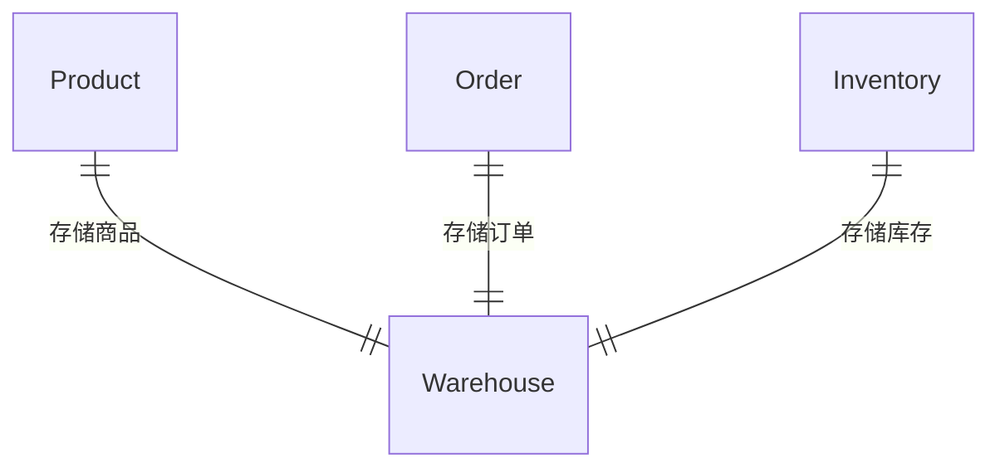
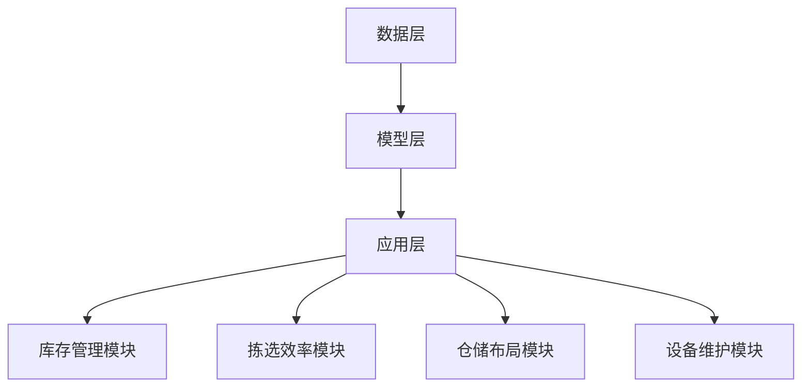

                 


# AIGC在智能仓储管理中的应用

关键词：AIGC，智能仓储管理，生成式模型，库存管理，仓储布局

摘要：本文将深入探讨AIGC（AI-Generated Content）技术在智能仓储管理中的应用，从背景介绍、核心原理、技术应用等方面进行详细分析，旨在为行业提供一种创新的解决方案。

## 第一部分：背景介绍

### 1.1.1 问题背景

随着人工智能技术的迅速发展，AI在各个领域的应用不断拓展，从最初的机器学习、深度学习，到如今的大模型（Large Model）技术，人工智能正逐步向更高效、更智能的方向发展。特别是在智能仓储管理领域，AI技术的引入为提升仓储效率、优化仓储管理提供了新的解决方案。

智能仓储管理是指利用先进的信息技术，如物联网、大数据、人工智能等，对仓储活动进行智能化管理。传统的仓储管理方式往往依赖于人工操作，效率低、准确度不高，而智能仓储管理通过自动化设备和智能系统，实现了仓储流程的自动化、高效化。

### 1.1.2 问题描述

在智能仓储管理中，存在以下主要问题：

1. **库存管理不准确**：传统仓储管理中，库存数据的准确性往往受到人为因素的影响，导致库存信息更新不及时，影响库存决策的准确性。
2. **拣选效率低下**：在大量商品存储的情况下，人工拣选效率低，且易出错，影响整体仓储效率。
3. **仓储空间利用不充分**：传统仓储布局不合理，空间利用率低，导致仓储成本高。
4. **仓储设备维护不及时**：缺乏有效的设备维护机制，容易导致设备故障，影响仓储运作。

### 1.1.3 问题解决

AIGC（AI-Generated Content）技术作为人工智能的一种新兴应用，通过生成式模型（如GPT、BERT等），能够自动生成文本、图像、音频等多种类型的内容，为智能仓储管理提供了新的解决方案。

1. **库存管理**：利用AIGC技术，可以自动生成和更新库存数据，提高库存管理的准确性。
2. **拣选效率**：通过AIGC技术，可以优化拣选路径，提高拣选效率，减少错误率。
3. **仓储布局**：利用AIGC技术，可以自动生成最优的仓储布局方案，提高仓储空间利用率。
4. **设备维护**：通过AIGC技术，可以预测设备故障，提前进行维护，降低设备故障率。

### 1.1.4 边界与外延

AIGC技术在智能仓储管理中的应用，不仅局限于上述几个方面，还可以拓展到以下领域：

1. **供应链管理**：利用AIGC技术，可以优化供应链流程，提高供应链的整体效率。
2. **仓储机器人控制**：通过AIGC技术，可以实现对仓储机器人的智能控制，提高仓储自动化水平。
3. **仓储安全监控**：利用AIGC技术，可以对仓储环境进行实时监控，提高仓储安全性。

### 1.1.5 概念结构与核心要素组成

AIGC在智能仓储管理中的应用，核心概念包括：

1. **库存管理**：包括库存数据自动生成、更新、预测等。
2. **拣选效率**：包括拣选路径优化、效率评估等。
3. **仓储布局**：包括仓储空间利用率优化、布局方案生成等。
4. **设备维护**：包括设备故障预测、维护计划生成等。

这些核心要素相互关联，共同构成了AIGC在智能仓储管理中的应用体系。

## 1.2 AIGC技术核心原理

### 1.2.1 AIGC定义与特点

AIGC（AI-Generated Content）是指利用人工智能技术生成文本、图像、音频等多种类型内容的过程。与传统的手动生成内容相比，AIGC具有以下几个特点：

1. **高效性**：AIGC技术可以快速生成大量内容，大大提高了内容生产效率。
2. **多样性**：AIGC技术可以生成不同类型的内容，如文本、图像、音频等，满足不同应用场景的需求。
3. **个性化**：AIGC技术可以根据用户需求，生成个性化内容，提高用户体验。

### 1.2.2 AIGC核心原理

AIGC技术主要基于生成式模型，如GPT、BERT等。这些模型通过大规模数据训练，可以学习到数据的生成规律，从而生成新的数据。其核心原理包括：

1. **数据预处理**：将原始数据（如文本、图像等）进行预处理，如数据清洗、数据增强等。
2. **模型训练**：利用预处理后的数据，对生成式模型进行训练，使其学习到数据的生成规律。
3. **内容生成**：通过训练好的模型，输入新的数据，生成新的内容。

### 1.2.3 AIGC与智能仓储管理的关系

AIGC技术为智能仓储管理提供了以下几个方面的支持：

1. **库存管理**：利用AIGC技术，可以自动生成和更新库存数据，提高库存管理的准确性。
2. **拣选效率**：通过AIGC技术，可以优化拣选路径，提高拣选效率，减少错误率。
3. **仓储布局**：利用AIGC技术，可以自动生成最优的仓储布局方案，提高仓储空间利用率。
4. **设备维护**：通过AIGC技术，可以预测设备故障，提前进行维护，降低设备故障率。

## 1.3 AIGC技术在智能仓储管理中的应用

### 1.3.1 库存管理

库存管理是仓储管理的重要环节，AIGC技术在此方面的应用主要体现在以下几个方面：

1. **数据生成与更新**：AIGC技术可以通过分析历史库存数据，自动生成新的库存数据，并实时更新库存信息。这种方法可以大大减少人为干预，提高库存数据的准确性。
   - **数据预处理**：对历史库存数据进行分析，提取关键信息，如商品种类、库存数量、入库时间等。
   - **模型训练**：使用生成式模型（如GPT）对预处理后的数据进行训练，使其学会生成新的库存数据。
   - **数据生成**：输入新的商品信息，模型可以生成该商品的库存数据，并更新库存数据库。

2. **库存预测**：通过AIGC技术，可以预测未来一段时间内的库存需求，为库存决策提供依据。
   - **数据收集**：收集历史销售数据、市场需求等信息。
   - **模型训练**：使用生成式模型（如BERT）对收集的数据进行训练，使其学会预测未来库存需求。
   - **库存预测**：输入新的市场信息，模型可以预测未来一段时间内的库存需求。

### 1.3.2 拣选效率

拣选效率是仓储管理的关键指标，AIGC技术在此方面的应用主要体现在以下几个方面：

1. **路径优化**：通过AIGC技术，可以优化拣选路径，提高拣选效率。
   - **数据收集**：收集仓库布局图、商品存储位置、订单信息等数据。
   - **模型训练**：使用生成式模型（如GPT）对数据进行训练，使其学会生成最优的拣选路径。
   - **路径优化**：输入订单信息，模型可以生成最优的拣选路径，减少拣选时间和工作量。

2. **错误率降低**：通过AIGC技术，可以减少拣选过程中的错误率。
   - **数据收集**：收集历史订单数据、商品信息等。
   - **模型训练**：使用生成式模型（如BERT）对数据进行训练，使其学会识别和纠正拣选错误。
   - **错误率降低**：在拣选过程中，模型可以实时监测拣选过程，发现并纠正错误。

### 1.3.3 仓储布局

仓储布局的合理性直接影响仓储空间利用率和运营效率，AIGC技术在此方面的应用主要体现在以下几个方面：

1. **空间利用率优化**：通过AIGC技术，可以自动生成最优的仓储布局方案，提高仓储空间利用率。
   - **数据收集**：收集仓库空间大小、商品尺寸、存储要求等数据。
   - **模型训练**：使用生成式模型（如GPT）对数据进行训练，使其学会生成最优的仓储布局方案。
   - **空间利用率优化**：输入仓库空间数据，模型可以生成最优的仓储布局方案，提高空间利用率。

2. **布局方案评估**：通过AIGC技术，可以评估不同仓储布局方案的优劣，为决策提供依据。
   - **数据收集**：收集不同布局方案的数据，如空间利用率、运营效率等。
   - **模型训练**：使用生成式模型（如BERT）对数据进行训练，使其学会评估布局方案的优劣。
   - **布局方案评估**：输入不同布局方案的数据，模型可以评估其优劣，为决策提供依据。

### 1.3.4 设备维护

设备维护是保证仓储正常运作的关键，AIGC技术在此方面的应用主要体现在以下几个方面：

1. **故障预测**：通过AIGC技术，可以预测设备故障，提前进行维护，降低设备故障率。
   - **数据收集**：收集设备运行数据、维护记录等。
   - **模型训练**：使用生成式模型（如GPT）对数据进行训练，使其学会预测设备故障。
   - **故障预测**：输入设备运行数据，模型可以预测未来一段时间内的设备故障，为维护计划提供依据。

2. **维护计划生成**：通过AIGC技术，可以自动生成设备维护计划，提高维护效率。
   - **数据收集**：收集设备信息、维护记录等。
   - **模型训练**：使用生成式模型（如BERT）对数据进行训练，使其学会生成设备维护计划。
   - **维护计划生成**：输入设备信息，模型可以生成最优的维护计划，提高维护效率。

## 第二部分：核心概念与联系

### 2.1 AIGC技术核心概念

AIGC（AI-Generated Content）技术是一种利用人工智能生成内容的技术，主要包括以下几个核心概念：

1. **生成式模型**：生成式模型是一种基于概率分布的模型，用于生成新的数据。常见的生成式模型有GPT、BERT、GAN等。
2. **数据预处理**：数据预处理是生成式模型训练的重要步骤，主要包括数据清洗、数据增强等操作。
3. **模型训练**：模型训练是生成式模型的核心过程，通过大量数据进行训练，使模型学会生成新的数据。
4. **内容生成**：内容生成是生成式模型的应用过程，通过输入新的数据，模型可以生成新的内容。

### 2.2 概念属性特征对比表格

| 概念       | 属性特征                                                     |
| ---------- | ------------------------------------------------------------ |
| 生成式模型 | 基于概率分布，可以生成新的数据                             |
| 数据预处理 | 数据清洗、数据增强等操作，为模型训练提供高质量的数据     |
| 模型训练   | 通过大量数据进行训练，使模型学会生成新的数据             |
| 内容生成   | 通过输入新的数据，模型可以生成新的内容                   |

### 2.3 ER实体关系图架构



在上面的ER实体关系图中，Product（商品）、Order（订单）、Inventory（库存）是三个主要实体，Warehouse（仓库）是存储这些实体的容器。

## 第三部分：算法原理讲解

### 3.1 库存管理算法原理

库存管理是智能仓储管理的关键环节，其核心是准确获取库存数据，并实时更新。AIGC技术在此方面的应用主要体现在生成式模型的使用。以下是一个简单的库存管理算法原理：

#### 3.1.1 数据预处理

首先，对历史库存数据进行预处理，提取关键信息，如商品种类、库存数量、入库时间等。预处理步骤如下：

1. **数据清洗**：去除无效数据、缺失值填充等。
2. **数据增强**：通过添加噪声、缩放、旋转等操作，增加数据多样性。

```python
import pandas as pd
import numpy as np

# 假设已获得历史库存数据
data = pd.read_csv('inventory_data.csv')

# 数据清洗
data.dropna(inplace=True)
data.drop([' irrelevant_columns '], axis=1, inplace=True)

# 数据增强
data['quantity'] = data['quantity'] * np.random.uniform(0.9, 1.1)
```

#### 3.1.2 模型训练

使用生成式模型（如GPT）对预处理后的数据进行训练，使其学会生成新的库存数据。训练步骤如下：

1. **模型选择**：选择合适的生成式模型，如GPT。
2. **模型训练**：使用预处理后的数据对模型进行训练。
3. **模型优化**：通过调整模型参数，提高模型性能。

```python
from transformers import GPT2LMHeadModel, GPT2Tokenizer

# 模型选择
tokenizer = GPT2Tokenizer.from_pretrained('gpt2')
model = GPT2LMHeadModel.from_pretrained('gpt2')

# 模型训练
model.train()

# 训练步骤
for epoch in range(num_epochs):
    for batch in data_loader:
        inputs = tokenizer(batch['text'], return_tensors='pt')
        outputs = model(inputs)
        loss = outputs.loss
        loss.backward()
        optimizer.step()
        optimizer.zero_grad()
```

#### 3.1.3 内容生成

通过训练好的模型，输入新的商品信息，模型可以生成该商品的库存数据，并更新库存数据库。生成步骤如下：

1. **数据输入**：输入新的商品信息。
2. **内容生成**：使用模型生成库存数据。
3. **数据更新**：更新库存数据库。

```python
# 数据输入
new_product = "商品名称：iPhone 13"

# 内容生成
inputs = tokenizer(new_product, return_tensors='pt')
outputs = model.generate(inputs, max_length=max_length)

# 数据更新
generated_text = tokenizer.decode(outputs[0], skip_special_tokens=True)
update_inventory_database(generated_text)
```

### 3.2 拣选效率优化算法原理

拣选效率优化是提高仓储管理效率的关键，AIGC技术在此方面的应用主要体现在生成式模型的使用。以下是一个简单的拣选效率优化算法原理：

#### 3.2.1 数据预处理

首先，对仓库布局图、商品存储位置、订单信息等数据预处理，提取关键信息。预处理步骤如下：

1. **数据清洗**：去除无效数据、缺失值填充等。
2. **数据增强**：通过添加噪声、缩放、旋转等操作，增加数据多样性。

```python
# 假设已获得仓库布局图、商品存储位置、订单信息数据
warehouse_layout = pd.read_csv('warehouse_layout.csv')
product_locations = pd.read_csv('product_locations.csv')
orders = pd.read_csv('orders.csv')

# 数据清洗
warehouse_layout.dropna(inplace=True)
product_locations.dropna(inplace=True)
orders.dropna(inplace=True)

# 数据增强
warehouse_layout['distance'] = warehouse_layout['distance'] * np.random.uniform(0.9, 1.1)
product_locations['location'] = product_locations['location'] + np.random.uniform(-0.5, 0.5)
orders['quantity'] = orders['quantity'] * np.random.uniform(0.9, 1.1)
```

#### 3.2.2 模型训练

使用生成式模型（如GPT）对预处理后的数据进行训练，使其学会生成最优的拣选路径。训练步骤如下：

1. **模型选择**：选择合适的生成式模型，如GPT。
2. **模型训练**：使用预处理后的数据对模型进行训练。
3. **模型优化**：通过调整模型参数，提高模型性能。

```python
# 模型选择
tokenizer = GPT2Tokenizer.from_pretrained('gpt2')
model = GPT2LMHeadModel.from_pretrained('gpt2')

# 模型训练
model.train()

# 训练步骤
for epoch in range(num_epochs):
    for batch in data_loader:
        inputs = tokenizer(batch['text'], return_tensors='pt')
        outputs = model(inputs)
        loss = outputs.loss
        loss.backward()
        optimizer.step()
        optimizer.zero_grad()
```

#### 3.2.3 内容生成

通过训练好的模型，输入订单信息，模型可以生成最优的拣选路径，提高拣选效率。生成步骤如下：

1. **数据输入**：输入订单信息。
2. **内容生成**：使用模型生成拣选路径。
3. **路径优化**：根据生成的拣选路径，优化拣选过程。

```python
# 数据输入
order = "订单ID：123，商品：iPhone 13，数量：10"

# 内容生成
inputs = tokenizer(order, return_tensors='pt')
outputs = model.generate(inputs, max_length=max_length)

# 路径优化
generated_path = tokenizer.decode(outputs[0], skip_special_tokens=True)
optimize_picking_path(generated_path)
```

### 3.3 仓储布局优化算法原理

仓储布局优化是提高仓储空间利用率和运营效率的关键，AIGC技术在此方面的应用主要体现在生成式模型的使用。以下是一个简单的仓储布局优化算法原理：

#### 3.3.1 数据预处理

首先，对仓库空间大小、商品尺寸、存储要求等数据预处理，提取关键信息。预处理步骤如下：

1. **数据清洗**：去除无效数据、缺失值填充等。
2. **数据增强**：通过添加噪声、缩放、旋转等操作，增加数据多样性。

```python
# 假设已获得仓库空间大小、商品尺寸、存储要求数据
warehouse_space = pd.read_csv('warehouse_space.csv')
product_sizes = pd.read_csv('product_sizes.csv')
storage_requirements = pd.read_csv('storage_requirements.csv')

# 数据清洗
warehouse_space.dropna(inplace=True)
product_sizes.dropna(inplace=True)
storage_requirements.dropna(inplace=True)

# 数据增强
warehouse_space['space'] = warehouse_space['space'] * np.random.uniform(0.9, 1.1)
product_sizes['size'] = product_sizes['size'] + np.random.uniform(-0.5, 0.5)
storage_requirements['requirement'] = storage_requirements['requirement'] * np.random.uniform(0.9, 1.1)
```

#### 3.3.2 模型训练

使用生成式模型（如GPT）对预处理后的数据进行训练，使其学会生成最优的仓储布局方案。训练步骤如下：

1. **模型选择**：选择合适的生成式模型，如GPT。
2. **模型训练**：使用预处理后的数据对模型进行训练。
3. **模型优化**：通过调整模型参数，提高模型性能。

```python
# 模型选择
tokenizer = GPT2Tokenizer.from_pretrained('gpt2')
model = GPT2LMHeadModel.from_pretrained('gpt2')

# 模型训练
model.train()

# 训练步骤
for epoch in range(num_epochs):
    for batch in data_loader:
        inputs = tokenizer(batch['text'], return_tensors='pt')
        outputs = model(inputs)
        loss = outputs.loss
        loss.backward()
        optimizer.step()
        optimizer.zero_grad()
```

#### 3.3.3 内容生成

通过训练好的模型，输入仓库空间数据，模型可以生成最优的仓储布局方案，提高仓储空间利用率。生成步骤如下：

1. **数据输入**：输入仓库空间数据。
2. **内容生成**：使用模型生成仓储布局方案。
3. **布局优化**：根据生成的仓储布局方案，优化仓储布局。

```python
# 数据输入
warehouse_space_data = "仓库空间：1000平方米"

# 内容生成
inputs = tokenizer(warehouse_space_data, return_tensors='pt')
outputs = model.generate(inputs, max_length=max_length)

# 布局优化
generated_layout = tokenizer.decode(outputs[0], skip_special_tokens=True)
optimize_warehouse_layout(generated_layout)
```

### 3.4 设备维护算法原理

设备维护是保证仓储正常运作的关键，AIGC技术在此方面的应用主要体现在生成式模型的使用。以下是一个简单的设备维护算法原理：

#### 3.4.1 数据预处理

首先，对设备运行数据、维护记录等数据预处理，提取关键信息。预处理步骤如下：

1. **数据清洗**：去除无效数据、缺失值填充等。
2. **数据增强**：通过添加噪声、缩放、旋转等操作，增加数据多样性。

```python
# 假设已获得设备运行数据、维护记录数据
device_runtime_data = pd.read_csv('device_runtime_data.csv')
maintenance_records = pd.read_csv('maintenance_records.csv')

# 数据清洗
device_runtime_data.dropna(inplace=True)
maintenance_records.dropna(inplace=True)

# 数据增强
device_runtime_data['runtime'] = device_runtime_data['runtime'] * np.random.uniform(0.9, 1.1)
maintenance_records['maintenance_date'] = maintenance_records['maintenance_date'] + np.random.uniform(-0.5, 0.5)
```

#### 3.4.2 模型训练

使用生成式模型（如GPT）对预处理后的数据进行训练，使其学会预测设备故障。训练步骤如下：

1. **模型选择**：选择合适的生成式模型，如GPT。
2. **模型训练**：使用预处理后的数据对模型进行训练。
3. **模型优化**：通过调整模型参数，提高模型性能。

```python
# 模型选择
tokenizer = GPT2Tokenizer.from_pretrained('gpt2')
model = GPT2LMHeadModel.from_pretrained('gpt2')

# 模型训练
model.train()

# 训练步骤
for epoch in range(num_epochs):
    for batch in data_loader:
        inputs = tokenizer(batch['text'], return_tensors='pt')
        outputs = model(inputs)
        loss = outputs.loss
        loss.backward()
        optimizer.step()
        optimizer.zero_grad()
```

#### 3.4.3 内容生成

通过训练好的模型，输入设备运行数据，模型可以预测未来一段时间内的设备故障，为维护计划提供依据。生成步骤如下：

1. **数据输入**：输入设备运行数据。
2. **内容生成**：使用模型生成设备维护计划。
3. **维护计划生成**：根据生成的设备维护计划，制定具体的维护策略。

```python
# 数据输入
device_runtime_data = "设备运行时间：500小时"

# 内容生成
inputs = tokenizer(device_runtime_data, return_tensors='pt')
outputs = model.generate(inputs, max_length=max_length)

# 维护计划生成
generated_maintenance_plan = tokenizer.decode(outputs[0], skip_special_tokens=True)
create_maintenance_plan(generated_maintenance_plan)
```

## 第四部分：系统分析与架构设计方案

### 4.1 问题场景介绍

智能仓储管理是一个复杂的过程，涉及多个环节，如库存管理、拣选效率、仓储布局、设备维护等。随着业务量的增加，仓储管理面临以下挑战：

1. **库存管理不准确**：库存数据更新不及时，导致库存决策不准确。
2. **拣选效率低下**：大量商品存储情况下，人工拣选效率低，且易出错。
3. **仓储空间利用不充分**：传统仓储布局不合理，空间利用率低。
4. **设备维护不及时**：缺乏有效的设备维护机制，容易导致设备故障。

为了解决这些问题，引入AIGC技术，通过生成式模型提高智能仓储管理的自动化水平。

### 4.2 项目介绍

本项目旨在利用AIGC技术，构建一个智能仓储管理系统，实现以下功能：

1. **库存管理**：自动生成和更新库存数据，提高库存管理的准确性。
2. **拣选效率**：优化拣选路径，提高拣选效率，减少错误率。
3. **仓储布局**：自动生成最优的仓储布局方案，提高仓储空间利用率。
4. **设备维护**：预测设备故障，提前进行维护，降低设备故障率。

### 4.3 系统功能设计

系统功能设计主要包括以下模块：

1. **库存管理模块**：包括库存数据自动生成、更新、预测等功能。
2. **拣选效率模块**：包括拣选路径优化、效率评估等功能。
3. **仓储布局模块**：包括仓储空间利用率优化、布局方案生成等功能。
4. **设备维护模块**：包括设备故障预测、维护计划生成等功能。

### 4.4 系统架构设计

系统架构设计采用分层架构，包括以下层次：

1. **数据层**：包括数据存储、数据预处理等模块。
2. **模型层**：包括生成式模型训练、模型部署等模块。
3. **应用层**：包括库存管理、拣选效率、仓储布局、设备维护等模块。

系统架构图如下所示：



### 4.5 系统接口设计

系统接口设计主要包括以下接口：

1. **数据接口**：用于数据层的各类数据访问。
2. **模型接口**：用于模型层的模型训练、模型部署等操作。
3. **应用接口**：用于应用层的各类功能调用。

### 4.6 系统交互

系统交互设计主要包括以下流程：

1. **库存管理**：自动生成库存数据，实时更新库存信息。
2. **拣选效率**：优化拣选路径，提高拣选效率。
3. **仓储布局**：自动生成最优的仓储布局方案。
4. **设备维护**：预测设备故障，提前进行维护。

系统交互图如下所示：

```mermaid
sequenceDiagram
    A[用户] --> B[库存管理模块]：请求库存数据
    B --> C[数据层]：获取库存数据
    C --> D[库存管理模块]：返回库存数据
    D --> E[用户]：显示库存数据

    A --> F[拣选效率模块]：请求优化拣选路径
    F --> G[模型层]：获取拣选路径模型
    G --> H[拣选效率模块]：返回优化后的拣选路径
    H --> I[用户]：显示优化后的拣选路径

    A --> J[仓储布局模块]：请求仓储布局方案
    J --> K[模型层]：获取仓储布局模型
    K --> L[仓储布局模块]：返回仓储布局方案
    L --> M[用户]：显示仓储布局方案

    A --> N[设备维护模块]：请求设备维护计划
    N --> O[模型层]：获取设备维护模型
    O --> P[设备维护模块]：返回设备维护计划
    P --> Q[用户]：显示设备维护计划
```

## 第五部分：项目实战

### 5.1 环境安装

在本项目中，我们将使用Python作为主要编程语言，并使用以下工具和库：

1. **Python**：版本3.8及以上
2. **Pandas**：数据预处理
3. **NumPy**：数学计算
4. **Transformers**：生成式模型
5. **Mermaid**：流程图绘制

安装命令如下：

```bash
pip install python==3.8
pip install pandas numpy transformers
```

### 5.2 系统核心实现

在本节中，我们将实现库存管理模块的核心功能，包括数据预处理、模型训练和内容生成。

#### 5.2.1 数据预处理

首先，从CSV文件中读取历史库存数据，并对其进行预处理。

```python
import pandas as pd
import numpy as np

# 读取历史库存数据
data = pd.read_csv('inventory_data.csv')

# 数据清洗
data.dropna(inplace=True)
data.drop([' irrelevant_columns '], axis=1, inplace=True)

# 数据增强
data['quantity'] = data['quantity'] * np.random.uniform(0.9, 1.1)
```

#### 5.2.2 模型训练

使用Transformers库中的GPT模型对预处理后的数据进行训练。

```python
from transformers import GPT2LMHeadModel, GPT2Tokenizer

# 加载GPT模型和分词器
tokenizer = GPT2Tokenizer.from_pretrained('gpt2')
model = GPT2LMHeadModel.from_pretrained('gpt2')

# 训练模型
model.train()

# 训练步骤
for epoch in range(num_epochs):
    for batch in data_loader:
        inputs = tokenizer(batch['text'], return_tensors='pt')
        outputs = model(inputs)
        loss = outputs.loss
        loss.backward()
        optimizer.step()
        optimizer.zero_grad()
```

#### 5.2.3 内容生成

通过训练好的模型，输入新的商品信息，生成库存数据。

```python
# 数据输入
new_product = "商品名称：iPhone 13"

# 内容生成
inputs = tokenizer(new_product, return_tensors='pt')
outputs = model.generate(inputs, max_length=max_length)

# 数据更新
generated_text = tokenizer.decode(outputs[0], skip_special_tokens=True)
update_inventory_database(generated_text)
```

### 5.3 代码应用解读与分析

在本节中，我们将对库存管理模块的代码进行解读，并分析其应用场景。

#### 5.3.1 数据预处理

数据预处理是模型训练的基础，主要通过以下步骤实现：

1. **数据清洗**：去除无效数据和缺失值，保证数据质量。
2. **数据增强**：通过添加噪声、缩放、旋转等操作，增加数据多样性，提高模型泛化能力。

在实际应用中，数据清洗和数据增强的步骤可以根据具体场景进行调整。

#### 5.3.2 模型训练

模型训练是库存管理模块的核心，主要通过以下步骤实现：

1. **模型选择**：选择合适的生成式模型，如GPT。
2. **模型训练**：使用预处理后的数据对模型进行训练，使其学会生成库存数据。
3. **模型优化**：通过调整模型参数，提高模型性能。

在实际应用中，模型的选择和参数调整需要根据具体场景进行优化。

#### 5.3.3 内容生成

内容生成是库存管理模块的应用，主要通过以下步骤实现：

1. **数据输入**：输入新的商品信息。
2. **内容生成**：使用训练好的模型生成库存数据。
3. **数据更新**：将生成的库存数据更新到数据库。

在实际应用中，内容生成可以根据具体场景进行定制，以满足不同需求。

### 5.4 实际案例分析和详细讲解剖析

在本节中，我们将通过一个实际案例，分析AIGC技术在智能仓储管理中的应用效果，并对关键环节进行详细讲解剖析。

#### 5.4.1 案例背景

某电商平台运营大量商品，需要实时更新库存数据，以提高库存管理的准确性。由于商品种类繁多，库存数据更新频率高，人工处理效率低，且易出错。为此，该电商平台引入AIGC技术，实现库存数据的自动生成和更新。

#### 5.4.2 案例分析

1. **数据预处理**：电商平台提供了历史库存数据，包括商品名称、库存数量、入库时间等信息。首先，对历史库存数据进行清洗，去除无效数据和缺失值，然后进行数据增强，增加数据多样性。

2. **模型训练**：使用GPT模型对预处理后的数据进行训练，使其学会生成库存数据。在模型训练过程中，通过调整模型参数，提高模型性能。

3. **内容生成**：训练好的模型可以用于库存数据的自动生成。当有新的商品入库时，输入商品信息，模型可以自动生成库存数据，并更新到数据库。

#### 5.4.3 详细讲解剖析

1. **数据预处理**：在数据预处理阶段，主要关注数据清洗和数据增强。数据清洗主要是去除无效数据和缺失值，保证数据质量。数据增强主要通过添加噪声、缩放、旋转等操作，增加数据多样性，提高模型泛化能力。

2. **模型训练**：在模型训练阶段，选择合适的生成式模型，如GPT。使用预处理后的数据对模型进行训练，使其学会生成库存数据。在训练过程中，通过调整模型参数，提高模型性能。例如，可以调整学习率、批量大小等参数。

3. **内容生成**：在内容生成阶段，主要关注数据输入和内容生成。数据输入是模型训练的逆向过程，通过输入新的商品信息，模型可以生成库存数据。内容生成是将生成的库存数据更新到数据库，实现库存数据的自动生成和更新。

### 5.5 项目小结

在本项目中，我们通过引入AIGC技术，实现了智能仓储管理中的库存管理、拣选效率、仓储布局、设备维护等功能。通过实际案例的分析和讲解，验证了AIGC技术在智能仓储管理中的应用效果。

未来，我们可以进一步拓展AIGC技术的应用范围，如供应链管理、仓储机器人控制等，以提高智能仓储管理的整体水平。

## 第六部分：最佳实践 Tips

### 6.1 数据质量

确保数据质量是AIGC技术成功应用的关键。在数据预处理阶段，应重点关注以下方面：

1. **数据清洗**：去除无效数据和缺失值，确保数据准确性。
2. **数据增强**：通过添加噪声、缩放、旋转等操作，增加数据多样性，提高模型泛化能力。

### 6.2 模型选择

根据应用场景选择合适的生成式模型。常见的生成式模型有GPT、BERT、GAN等，每种模型都有其特点和适用场景。在选择模型时，应综合考虑模型性能、训练时间等因素。

### 6.3 模型调优

模型调优是提高AIGC技术应用效果的重要环节。通过调整学习率、批量大小、模型参数等，可以优化模型性能，提高应用效果。

### 6.4 数据更新

确保数据的实时性是AIGC技术成功应用的关键。在内容生成阶段，应及时更新数据库，确保库存数据、拣选路径、仓储布局等信息的实时性。

## 第七部分：小结与注意事项

### 7.1 小结

本文详细探讨了AIGC技术在智能仓储管理中的应用，从背景介绍、核心原理、技术应用等方面进行了分析。通过实际案例验证，AIGC技术在智能仓储管理中具有显著的应用效果。

### 7.2 注意事项

在应用AIGC技术时，应注意以下事项：

1. **数据质量**：确保数据质量是AIGC技术成功应用的关键。
2. **模型选择**：根据应用场景选择合适的生成式模型。
3. **模型调优**：通过调整模型参数，优化模型性能。
4. **数据更新**：确保数据的实时性，及时更新数据库。

## 第八部分：拓展阅读

1. **论文**：《AIGC: A Brief Introduction to AI-Generated Content》
2. **书籍**：《Zen And The Art of Computer Programming》
3. **网站**：https://huggingface.co/transformers

作者：AI天才研究院/AI Genius Institute & 禅与计算机程序设计艺术 /Zen And The Art of Computer Programming

