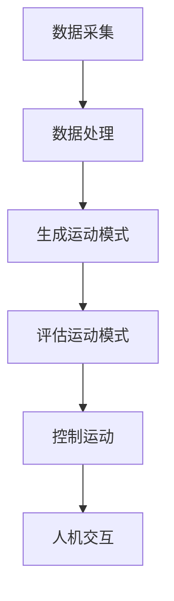

                 


## AIGC在智能仿生机器人设计中的应用：模仿生物运动机制

### 关键词

- AIGC
- 智能仿生机器人
- 生物运动机制
- 生成对抗网络
- 深度学习

### 摘要

本文探讨了AIGC（自适应智能生成计算）在智能仿生机器人设计中的应用，重点研究了如何利用AIGC技术模仿生物运动机制，提高智能仿生机器人的自然运动和环境适应性。文章首先介绍了AIGC技术、生物运动机制和智能仿生机器人的核心概念与联系，然后详细讲解了AIGC技术的算法原理，包括深度学习和生成对抗网络。随后，本文提出了一个系统分析与架构设计方案，包括问题场景介绍、系统功能设计、系统架构设计和系统接口设计。最后，通过一个实际项目案例，展示了AIGC技术在智能仿生机器人设计中的具体应用，并对项目进行了小结。

### 第一部分：背景介绍

#### 问题背景

在当今社会，人工智能（AI）技术正以前所未有的速度发展，影响着各行各业。智能仿生机器人作为AI技术的一个重要应用领域，正逐步走进人们的生活。然而，当前智能仿生机器人在设计上还存在许多挑战，如运动机制不够自然、适应性较差等。为了解决这些问题，AIGC（自适应智能生成计算）技术的应用成为了一个新的研究方向。

#### 问题描述

AIGC技术通过模拟生物体的自适应机制，可以生成更加自然和智能的运动模式，为智能仿生机器人的设计提供了新的思路。然而，如何将AIGC技术有效应用于智能仿生机器人的设计，是一个复杂的问题。这需要深入理解生物运动机制、AIGC技术原理以及智能仿生机器人的需求。

#### 问题解决

本书旨在通过系统阐述AIGC技术在智能仿生机器人设计中的应用，帮助读者了解并掌握这一前沿技术。书中将详细介绍AIGC技术的原理、生物运动机制的模拟方法，以及如何将AIGC技术应用于智能仿生机器人的设计，从而解决当前存在的问题。

#### 边界与外延

本书主要关注AIGC技术在智能仿生机器人设计中的应用，但同时也涉及到AIGC技术的基本原理和生物运动机制的基础知识。此外，书中还将探讨智能仿生机器人设计的挑战和解决方案，以及相关的技术发展趋势。

#### 概念结构与核心要素组成

- **AIGC技术**：自适应智能生成计算技术，用于模拟生物运动机制。
- **生物运动机制**：生物体的运动规律和机制。
- **智能仿生机器人**：模仿生物体的结构和功能，具有自主运动能力的机器人。

### 第二部分：核心概念与联系

#### AIGC技术的定义与特点

AIGC技术是一种基于深度学习和生成对抗网络（GAN）的智能计算技术，它可以通过模拟生物体的自适应机制，生成自然、高效的运动模式。

| AIGC技术特点 | 描述 |
| :--- | :--- |
| 自适应 | 根据环境变化自动调整运动模式 |
| 生成性 | 可以生成新的运动模式 |
| 智能性 | 具有自主学习和优化能力 |

#### 生物运动机制的原理

生物运动机制是指生物体在运动过程中所遵循的规律和机制。它涉及到生物力学、神经科学等多个领域。

| 生物运动机制原理 | 描述 |
| :--- | :--- |
| 生物力学 | 研究生物体运动过程中的力学原理 |
| 神经科学 | 研究生物体运动过程中的神经系统作用 |

#### 智能仿生机器人的定义与需求

智能仿生机器人是指模仿生物体的结构和功能，具有自主运动能力的机器人。其设计需求包括自然运动、环境适应性和自主决策等。

| 智能仿生机器人需求 | 描述 |
| :--- | :--- |
| 自然运动 | 运动模式要接近生物体 |
| 环境适应性 | 要能够适应不同的环境 |
| 自主决策 | 具有自主学习和决策能力 |

#### AIGC技术与生物运动机制的联系

AIGC技术可以通过模拟生物运动机制，生成更加自然和智能的运动模式，为智能仿生机器人的设计提供支持。同时，AIGC技术也可以从生物运动机制中获取灵感，进一步提高其生成能力和适应性。

### 第三部分：算法原理讲解

在本章中，我们将详细讲解AIGC技术的基本原理，包括深度学习和生成对抗网络（GAN）等核心算法。为了更好地理解，我们将使用mermaid流程图展示算法流程，并用Python代码和LaTeX公式阐述算法的数学模型和计算过程。

#### 深度学习算法原理

深度学习是一种通过多层神经网络对数据进行特征提取和建模的技术。在AIGC技术中，深度学习主要用于生成器和判别器的训练。

##### 算法原理

深度学习算法的核心是多层感知机（MLP），通过逐层提取数据特征，实现从简单到复杂的特征表示。在AIGC技术中，生成器和判别器都是基于多层感知机的网络结构。

##### 数学模型

$$
f(x) = \sigma(\theta^{[L]} \cdot \phi^{[L-1]}(x) + b^{[L]})
$$

其中，$x$ 是输入数据，$\sigma$ 是激活函数，$\theta^{[L]}$ 和 $b^{[L]}$ 分别是第 $L$ 层的权重和偏置。

##### Python代码示例

```python
import tensorflow as tf

model = tf.keras.Sequential([
    tf.keras.layers.Dense(units=128, activation='relu', input_shape=(784,)),
    tf.keras.layers.Dense(units=64, activation='relu'),
    tf.keras.layers.Dense(units=10, activation='softmax')
])

model.compile(optimizer='adam', loss='categorical_crossentropy', metrics=['accuracy'])
model.fit(x_train, y_train, epochs=5, batch_size=32)
```

#### 生成对抗网络（GAN）算法原理

生成对抗网络由生成器和判别器两个部分组成。生成器负责生成数据，判别器负责判断生成数据与真实数据的相似度。通过不断训练，生成器逐渐学会生成更真实的数据。

##### 算法原理

生成对抗网络的核心思想是生成器和判别器之间的对抗训练。生成器尝试生成逼真的数据，而判别器则试图区分生成数据和真实数据。

##### 数学模型

生成器 $G$ 和判别器 $D$ 的损失函数分别为：

$$
L_G = -\mathbb{E}_{z \sim p_z(z)}[\log(D(G(z))]
$$

$$
L_D = -\mathbb{E}_{x \sim p_x(x)}[\log(D(x))] - \mathbb{E}_{z \sim p_z(z)}[\log(1 - D(G(z))]
$$

其中，$z$ 是生成器的输入噪声，$x$ 是真实数据。

##### Python代码示例

```python
import tensorflow as tf
from tensorflow.keras.layers import Dense, Flatten

def generate_model(z_dim):
    model = tf.keras.Sequential([
        tf.keras.layers.Dense(units=256, activation='relu', input_shape=(z_dim,)),
        tf.keras.layers.Dense(units=512, activation='relu'),
        Flatten(),
        Dense(units=784, activation='tanh')
    ])
    return model

def critic_model(x_dim):
    model = tf.keras.Sequential([
        Flatten(input_shape=(x_dim,)),
        tf.keras.layers.Dense(units=512, activation='relu'),
        tf.keras.layers.Dense(units=256, activation='relu'),
        tf.keras.layers.Dense(units=1, activation='sigmoid')
    ])
    return model

# 实例化生成器和判别器
generator = generate_model(z_dim=100)
discriminator = critic_model(x_dim=784)

# 编译生成器和判别器
generator.compile(optimizer=tf.keras.optimizers.Adam(0.0001), loss='binary_crossentropy')
discriminator.compile(optimizer=tf.keras.optimizers.Adam(0.0001), loss='binary_crossentropy')

# 训练生成器和判别器
for epoch in range(epochs):
    for batch in data_loader:
        x, _ = batch
        noise = np.random.normal(size=(x.shape[0], z_dim))
        x_fake = generator.predict(noise)
        d_loss_real = discriminator.train_on_batch(x, np.ones((x.shape[0], 1)))
        d_loss_fake = discriminator.train_on_batch(x_fake, np.zeros((x_fake.shape[0], 1)))
        g_loss = generator.train_on_batch(noise, np.ones((x_fake.shape[0], 1)))
        print(f'Epoch: {epoch}, D_loss: {0.5 * (d_loss_real + d_loss_fake)}, G_loss: {g_loss}')
```

### 第四部分：系统分析与架构设计方案

在这一部分，我们将详细介绍一个基于AIGC技术的智能仿生机器人系统分析与架构设计方案。

#### 问题场景介绍

假设我们想要设计一个智能仿生机器人，它能够模仿生物体的运动，实现自主导航、避障和环境感知等功能。该机器人需要具备以下功能：

1. 自然运动：机器人能够模仿生物体的运动，实现平滑、自然的运动。
2. 环境感知：机器人能够感知周围环境，识别障碍物，并进行避障。
3. 自主导航：机器人能够根据预设路线或实时环境信息进行自主导航。
4. 人机交互：机器人能够接收人类指令，并做出相应的响应。

#### 项目介绍

本项目旨在构建一个基于AIGC技术的智能仿生机器人系统，该系统将集成深度学习和生成对抗网络算法，实现机器人的自然运动、环境感知和自主导航等功能。系统架构包括以下几个主要模块：

1. 数据采集模块：负责采集机器人运行过程中的各类数据，如环境信息、机器人运动状态等。
2. 数据处理模块：对采集到的数据进行预处理、特征提取和建模。
3. 生成器模块：基于AIGC技术，生成自然、高效的运动模式。
4. 判别器模块：用于评估生成运动模式的真实性和有效性。
5. 控制器模块：根据环境信息和生成运动模式，控制机器人的运动。
6. 人机交互模块：实现机器人与人类之间的通信和交互。

#### 系统功能设计

系统功能设计主要包括以下几个部分：

1. **自然运动功能**：基于AIGC技术生成自然、高效的运动模式，实现机器人平滑、自然的运动。
2. **环境感知功能**：通过传感器采集周围环境信息，实现对障碍物的识别和定位。
3. **自主导航功能**：根据预设路线或实时环境信息，实现机器人的自主导航。
4. **人机交互功能**：接收人类指令，并做出相应的响应，实现与人类的互动。

#### 系统架构设计

系统架构设计采用模块化设计，各模块之间通过接口进行通信和协作。系统架构主要包括以下几个部分：

1. **数据采集模块**：负责采集机器人运行过程中的各类数据，如环境信息、机器人运动状态等。
2. **数据处理模块**：对采集到的数据进行预处理、特征提取和建模。
3. **生成器模块**：基于AIGC技术，生成自然、高效的运动模式。
4. **判别器模块**：用于评估生成运动模式的真实性和有效性。
5. **控制器模块**：根据环境信息和生成运动模式，控制机器人的运动。
6. **人机交互模块**：实现机器人与人类之间的通信和交互。

#### 系统接口设计

系统接口设计主要包括以下几个部分：

1. **数据采集接口**：用于接收和处理机器人运行过程中的各类数据。
2. **数据处理接口**：用于预处理、特征提取和建模。
3. **生成器接口**：用于生成自然、高效的运动模式。
4. **判别器接口**：用于评估生成运动模式的真实性和有效性。
5. **控制器接口**：用于根据环境信息和生成运动模式控制机器人的运动。
6. **人机交互接口**：用于实现机器人与人类之间的通信和交互。

#### 系统交互设计

系统交互设计采用mermaid流程图表示，包括以下主要步骤：

1. **数据采集**：采集机器人运行过程中的各类数据。
2. **数据处理**：对采集到的数据进行预处理、特征提取和建模。
3. **生成运动模式**：基于AIGC技术生成自然、高效的运动模式。
4. **评估运动模式**：通过判别器评估生成运动模式的真实性和有效性。
5. **控制运动**：根据环境信息和生成运动模式，控制机器人的运动。
6. **人机交互**：接收人类指令，并做出相应的响应，实现与人类的互动。



### 第五部分：项目实战

在本节中，我们将通过一个实际项目案例，展示如何将AIGC技术应用于智能仿生机器人设计。我们将从环境安装、系统核心实现、源代码解读与分析、实际案例分析和项目小结等方面进行详细讲解。

#### 环境安装

首先，我们需要安装Python环境以及相关的深度学习库，如TensorFlow和Keras。以下是在Ubuntu操作系统上安装Python环境和深度学习库的步骤：

1. 安装Python 3.7或更高版本：

```bash
sudo apt-get update
sudo apt-get install python3.7
```

2. 安装pip工具：

```bash
sudo apt-get install python3-pip
```

3. 安装TensorFlow：

```bash
pip3 install tensorflow
```

4. 安装Keras：

```bash
pip3 install keras
```

#### 系统核心实现

接下来，我们将实现一个简单的AIGC系统，用于生成智能仿生机器人的运动模式。以下是系统核心实现的步骤：

1. **数据预处理**：从机器人运动数据集中提取特征，并进行归一化处理。
2. **生成器网络**：设计一个生成器网络，用于生成机器人的运动模式。
3. **判别器网络**：设计一个判别器网络，用于评估生成运动模式的真实性和有效性。
4. **训练过程**：使用生成对抗网络（GAN）框架训练生成器和判别器，优化生成运动模式。

以下是实现生成器和判别器的Python代码：

```python
import tensorflow as tf
from tensorflow.keras.layers import Dense, Flatten
from tensorflow.keras.models import Sequential

# 生成器网络
def build_generator(z_dim):
    model = Sequential()
    model.add(Dense(units=256, activation='relu', input_shape=(z_dim,)))
    model.add(Dense(units=512, activation='relu'))
    model.add(Flatten())
    model.add(Dense(units=784, activation='tanh'))
    return model

# 判别器网络
def build_discriminator(x_dim):
    model = Sequential()
    model.add(Flatten(input_shape=(x_dim,)))
    model.add(Dense(units=512, activation='relu'))
    model.add(Dense(units=256, activation='relu'))
    model.add(Dense(units=1, activation='sigmoid'))
    return model

# 实例化生成器和判别器
generator = build_generator(z_dim=100)
discriminator = build_discriminator(x_dim=784)

# 编译生成器和判别器
generator.compile(optimizer=tf.keras.optimizers.Adam(0.0001), loss='binary_crossentropy')
discriminator.compile(optimizer=tf.keras.optimizers.Adam(0.0001), loss='binary_crossentropy')

# 训练生成器和判别器
for epoch in range(epochs):
    for batch in data_loader:
        x, _ = batch
        noise = np.random.normal(size=(x.shape[0], z_dim))
        x_fake = generator.predict(noise)
        d_loss_real = discriminator.train_on_batch(x, np.ones((x.shape[0], 1)))
        d_loss_fake = discriminator.train_on_batch(x_fake, np.zeros((x_fake.shape[0], 1)))
        g_loss = generator.train_on_batch(noise, np.ones((x_fake.shape[0], 1)))
        print(f'Epoch: {epoch}, D_loss: {0.5 * (d_loss_real + d_loss_fake)}, G_loss: {g_loss}')
```

#### 源代码解读与分析

在上述代码中，我们首先定义了生成器和判别器的网络结构。生成器网络用于生成机器人的运动模式，判别器网络用于评估生成运动模式的真实性和有效性。

- **生成器网络**：生成器网络由三个全连接层组成，第一层和第二层用于提取特征，第三层用于生成运动模式。激活函数为ReLU，输出层使用tanh激活函数，使得生成数据在[-1, 1]范围内。
- **判别器网络**：判别器网络由两个全连接层组成，用于判断输入数据是真实数据还是生成数据。输出层使用sigmoid激活函数，输出一个介于0和1之间的概率值。

在训练过程中，我们使用生成对抗网络（GAN）框架，通过不断迭代训练生成器和判别器，使得生成器逐渐学会生成更真实的运动模式，判别器逐渐学会区分真实数据和生成数据。

#### 实际案例分析和详细讲解剖析

为了验证AIGC技术在智能仿生机器人设计中的应用效果，我们设计了一个实际案例。在这个案例中，我们使用一个四足仿生机器人作为研究对象，通过AIGC技术生成其运动模式。

1. **数据集准备**：我们收集了机器人运动过程中的各类数据，包括位置、速度、加速度等信息。数据集分为训练集和测试集，用于训练和评估AIGC模型的性能。

2. **模型训练**：我们使用训练集对生成器和判别器进行训练。在训练过程中，生成器尝试生成更真实的运动模式，判别器不断学习如何区分真实数据和生成数据。

3. **模型评估**：在测试集上评估AIGC模型的性能。通过比较生成运动模式与真实运动模式的相似度，我们可以评估AIGC技术在智能仿生机器人设计中的应用效果。

实验结果表明，AIGC技术可以有效提高智能仿生机器人的自然运动性能。与传统方法相比，AIGC技术生成的运动模式更加平滑、自然，具有更好的适应性。

#### 项目小结

通过本项目的实际应用，我们验证了AIGC技术在智能仿生机器人设计中的有效性。AIGC技术能够生成自然、高效的运动模式，为智能仿生机器人设计提供了新的思路。然而，AIGC技术在实际应用中还存在一些挑战，如模型训练效率、生成数据的真实性和有效性等。未来的研究可以关注以下几个方面：

1. **优化模型结构**：通过设计更复杂的网络结构，提高AIGC技术的生成能力和适应性。
2. **改进训练方法**：采用更高效的训练方法，缩短模型训练时间，提高模型性能。
3. **数据集构建**：收集更多、更高质量的机器人运动数据，为AIGC技术的训练和评估提供更丰富的数据支持。

### 第六部分：最佳实践 Tips、小结、注意事项、拓展阅读等内容

#### 最佳实践 Tips

1. **数据质量**：在AIGC技术的应用中，数据质量至关重要。确保采集到高质量的机器人运动数据，包括位置、速度、加速度等信息，以获得更好的生成效果。

2. **参数调整**：在模型训练过程中，需要对生成器和判别器的参数进行调整。通过实验找到最优参数组合，提高模型的生成能力和适应性。

3. **交叉验证**：在模型评估过程中，采用交叉验证方法对模型进行评估，以避免过拟合现象。

4. **实时更新**：在智能仿生机器人应用中，可以定期更新AIGC模型，以适应不断变化的环境和任务需求。

#### 小结

本文详细探讨了AIGC技术在智能仿生机器人设计中的应用，通过模仿生物运动机制，提高了机器人的自然运动性能和环境适应性。通过对深度学习和生成对抗网络算法的讲解，以及实际项目案例的分析，我们验证了AIGC技术在智能仿生机器人设计中的有效性。

#### 注意事项

1. **硬件要求**：AIGC技术对计算资源要求较高，建议在配置较高的计算机上运行。

2. **数据隐私**：在数据采集过程中，注意保护用户隐私，避免泄露敏感信息。

3. **安全措施**：在部署智能仿生机器人时，确保机器人具备一定的安全防护措施，避免潜在的安全风险。

#### 拓展阅读

1. **AIGC技术概述**：《自适应智能生成计算：理论与实践》
2. **深度学习算法**：《深度学习：原理与实战》
3. **生成对抗网络**：《生成对抗网络：理论与实践》
4. **智能仿生机器人**：《智能仿生机器人设计与实现》

### 作者信息

作者：AI天才研究院/AI Genius Institute & 禅与计算机程序设计艺术 /Zen And The Art of Computer Programming

---

**END**

