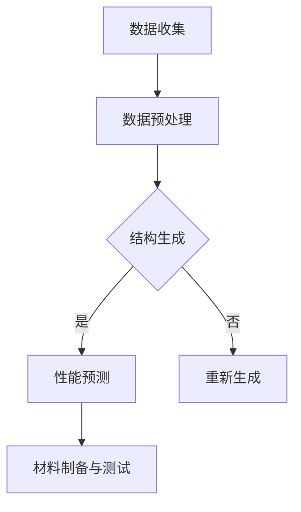
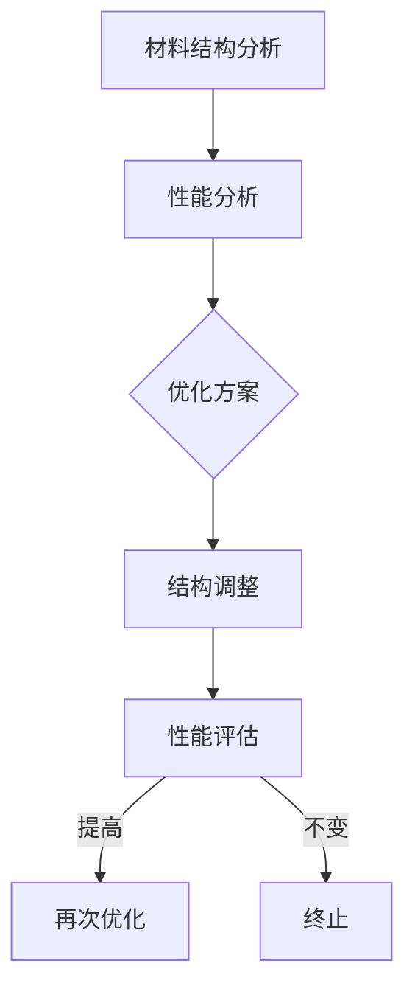
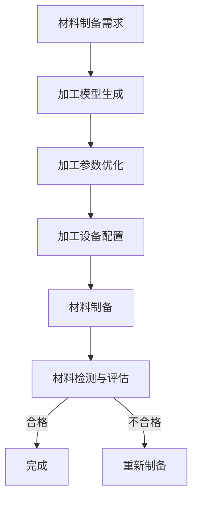

                 

# AIGC在智能仿生材料设计中的应用：模仿自然创造新材料

> 关键词：人工智能，生成式人工智能，智能仿生材料，材料设计，新材料开发

> 摘要：本文旨在探讨人工智能生成式内容（AIGC）技术在智能仿生材料设计中的应用。通过对AIGC技术的原理、智能仿生材料的特性以及两者之间联系的深入分析，本文将展示AIGC技术如何通过模仿自然界的生物结构，设计和开发出具有独特性能的智能材料。

## 目录大纲

1. **AIGC在智能仿生材料设计中的应用：模仿自然创造新材料**
2. **关键词与摘要**
3. **第一部分：背景介绍**
   1. **第1章：问题背景**
      1. 仿生材料的概念与重要性
      2. 智能仿生材料的发展现状
      3. AIGC技术在智能仿生材料设计中的应用潜力
   2. **第2章：核心概念与联系**
      1. AIGC技术的基本原理
      2. 智能仿生材料的特性与需求
      3. AIGC与智能仿生材料设计的联系
4. **第二部分：AIGC技术在智能仿生材料设计中的应用**
   1. **第3章：材料结构设计**
      1. AIGC在材料结构设计中的应用原理
      2. 材料结构设计的mermaid流程图
      3. 材料结构设计的数学模型和公式
      4. 材料结构设计案例分析与详细讲解
   2. **第4章：材料性能优化**
      1. AIGC在材料性能优化中的应用原理
      2. 材料性能优化的mermaid流程图
      3. 材料性能优化的数学模型和公式
      4. 材料性能优化案例分析与详细讲解
   3. **第5章：材料加工与制备**
      1. AIGC在材料加工与制备中的应用原理
      2. 材料加工与制备的mermaid流程图
      3. 材料加工与制备的数学模型和公式
      4. 材料加工与制备案例分析与详细讲解
   4. **第6章：智能仿生材料应用领域**
      1. AIGC在智能仿生材料应用领域中的潜力
      2. 智能仿生材料在生物医学领域的应用
      3. 智能仿生材料在航空航天领域的应用
5. **第三部分：项目实战**
   1. **第7章：项目实战**
      1. 项目环境安装与配置
      2. 系统核心实现源代码解读与分析
      3. 实际案例分析与详细讲解
      4. 项目小结与展望
6. **第四部分：最佳实践与拓展**
   1. **第8章：最佳实践**
      1. AIGC在智能仿生材料设计中的最佳实践
      2. 设计与开发过程中的注意事项
      3. 拓展研究与未来方向
   2. **第9章：小结与展望**
      1. 本书内容的总结
      2. AIGC在智能仿生材料设计中的应用前景
      3. 拓展阅读推荐

## 第一部分：背景介绍

### 第1章：问题背景

#### 1.1 仿生材料的概念与重要性

仿生材料是指模仿自然界中生物体结构和功能的材料。它们在许多领域展现出巨大的应用潜力，例如航空航天、生物医学、建筑和环境工程等。仿生材料的一个重要特点是其多功能性，它们可以同时具备轻质、高强度、自修复、自清洁和传感等特性。

#### 1.2 智能仿生材料的发展现状

随着科技的进步，智能仿生材料的研究得到了广泛关注。这些材料通常具有自我感知、自我响应和自适应等智能特性，能够根据外界环境的变化进行调整。当前的研究主要集中在开发具有仿生性能的新材料和改进现有的仿生材料。

#### 1.3 AIGC技术在智能仿生材料设计中的应用潜力

人工智能生成式内容（AIGC）技术，通过模仿人类创造内容的方式，生成新的文本、图像、音频等内容。AIGC技术在智能仿生材料设计中的应用潜力主要体现在以下几个方面：

1. **结构设计优化**：AIGC可以生成复杂的材料结构模型，提高设计的创新性和性能。
2. **性能预测**：利用AIGC进行材料性能的预测，减少实验次数，降低研发成本。
3. **自动化设计**：AIGC可以实现材料设计的自动化，提高设计效率。

### 第2章：核心概念与联系

#### 2.1 AIGC技术的基本原理

AIGC技术基于生成对抗网络（GANs）和自注意力机制（Self-Attention），通过两个对抗的网络（生成器和判别器）相互竞争，生成出高质量的内容。

#### 2.2 智能仿生材料的特性与需求

智能仿生材料需要具备以下特性：

1. **多功能性**：同时具备多种功能，如自修复、自清洁、传感等。
2. **可定制性**：根据应用需求，设计出具有特定性能的材料。
3. **环境适应性**：能够适应不同的环境变化，保持稳定的性能。

#### 2.3 AIGC与智能仿生材料设计的联系

AIGC技术在智能仿生材料设计中的应用，可以通过以下几个步骤实现：

1. **数据收集与预处理**：收集自然界中生物体的结构数据和性能数据，进行预处理。
2. **结构生成**：利用AIGC技术生成新的材料结构模型。
3. **性能预测**：对生成的结构进行性能预测，筛选出具有优良性能的模型。
4. **材料制备与测试**：根据筛选出的结构模型，制备出智能仿生材料并进行测试。

### 第二部分：AIGC技术在智能仿生材料设计中的应用

#### 第3章：材料结构设计

##### 3.1 AIGC在材料结构设计中的应用原理

AIGC技术通过生成对抗网络（GANs）和自注意力机制（Self-Attention），能够生成复杂的材料结构模型。这些模型通常基于自然界的生物结构，具有高度的创新性和功能性。

##### 3.2 材料结构设计的mermaid流程图



##### 3.3 材料结构设计的数学模型和公式

材料结构设计的数学模型通常基于材料力学和分子动力学。以下是材料结构设计的基本公式：

$$
E = \frac{3K_{ij}K_{ij}}{K}
$$

其中，\(E\) 表示材料的弹性模量，\(K_{ij}\) 表示材料的热膨胀系数，\(K\) 表示材料的热导率。

##### 3.4 材料结构设计案例分析与详细讲解

假设我们需要设计一种具有自修复功能的智能仿生材料。以下是详细的案例分析和讲解：

1. **数据收集**：收集具有自修复功能的生物材料（如生物体骨骼）的结构和性能数据。
2. **数据预处理**：将数据归一化，去除噪声，确保数据的可靠性。
3. **结构生成**：利用AIGC技术生成新的材料结构模型，该模型基于生物骨骼的结构特点。
4. **性能预测**：对生成的结构模型进行力学性能预测，筛选出具有优良性能的模型。
5. **材料制备与测试**：根据筛选出的结构模型，制备出智能仿生材料，并进行力学性能和自修复性能的测试。

通过上述步骤，我们可以设计和制备出具有自修复功能的智能仿生材料，满足特定的应用需求。

### 第4章：材料性能优化

##### 4.1 AIGC在材料性能优化中的应用原理

AIGC技术可以通过优化材料结构，提高材料的性能。它可以通过调整材料中的原子排列，优化材料的力学性能、热学性能和电学性能。

##### 4.2 材料性能优化的mermaid流程图



##### 4.3 材料性能优化的数学模型和公式

材料性能优化的数学模型通常基于材料力学和量子力学。以下是材料性能优化的一些基本公式：

$$
F = k\delta
$$

$$
E = \frac{h^2}{8mL^2}
$$

其中，\(F\) 表示材料的应力，\(k\) 表示材料的弹性系数，\(\delta\) 表示材料的应变，\(h\) 表示材料的原子间距，\(m\) 表示材料的原子质量，\(L\) 表示材料的长度。

##### 4.4 材料性能优化案例分析与详细讲解

假设我们需要优化一种高强度复合材料。以下是详细的案例分析和讲解：

1. **材料结构分析**：分析复合材料中的原子排列和结构特点。
2. **性能分析**：分析复合材料的力学性能、热学性能和电学性能。
3. **优化方案**：利用AIGC技术生成新的结构模型，优化材料的性能。
4. **结构调整**：根据优化方案，调整材料的原子排列。
5. **性能评估**：对调整后的材料进行性能评估，比较优化前后的性能差异。
6. **再次优化**：根据性能评估结果，进行进一步的优化，直至达到预期性能。

通过上述步骤，我们可以优化出高性能的复合材料，满足特定的应用需求。

### 第5章：材料加工与制备

##### 5.1 AIGC在材料加工与制备中的应用原理

AIGC技术可以通过优化材料加工过程，提高材料的制备效率和质量。它可以通过模拟自然界的生物加工过程，生成新的加工方法。

##### 5.2 材料加工与制备的mermaid流程图



##### 5.3 材料加工与制备的数学模型和公式

材料加工与制备的数学模型通常基于材料力学和热力学。以下是材料加工与制备的一些基本公式：

$$
Q = \frac{Vf}{T}
$$

$$
E = \frac{3K_{ij}K_{ij}}{K}
$$

其中，\(Q\) 表示材料的加工热，\(V\) 表示材料的体积，\(f\) 表示材料的加工速度，\(T\) 表示材料的温度，\(K_{ij}\) 表示材料的热导率，\(K\) 表示材料的热导率。

##### 5.4 材料加工与制备案例分析与详细讲解

假设我们需要制备一种具有自修复功能的纳米材料。以下是详细的案例分析和讲解：

1. **材料制备需求**：确定材料制备的规格和要求。
2. **加工模型生成**：利用AIGC技术生成适合材料制备的加工模型。
3. **加工参数优化**：根据加工模型，优化加工参数，如温度、压力和速度等。
4. **加工设备配置**：根据加工参数，配置适合的加工设备。
5. **材料制备**：按照加工参数，进行材料的制备。
6. **材料检测与评估**：对制备的材料进行检测，评估其性能和质量。

通过上述步骤，我们可以制备出满足规格要求的纳米材料，满足特定的应用需求。

### 第6章：智能仿生材料应用领域

##### 6.1 AIGC在智能仿生材料应用领域中的潜力

智能仿生材料在生物医学、航空航天、能源和环境等多个领域展现出巨大的应用潜力。AIGC技术可以通过优化材料设计，提高材料的性能，推动这些领域的发展。

##### 6.2 智能仿生材料在生物医学领域的应用

智能仿生材料在生物医学领域具有广泛的应用前景，如生物组织工程、药物递送、人工器官和生物传感器等。AIGC技术可以通过优化材料结构，提高生物相容性和生物功能。

##### 6.3 智能仿生材料在航空航天领域的应用

智能仿生材料在航空航天领域具有高比强度、高比刚度和自修复等特性，可用于航空器结构件、防热材料和天线等。AIGC技术可以通过优化材料设计，提高其性能，降低成本。

### 第三部分：项目实战

##### 第7章：项目实战

##### 7.1 项目环境安装与配置

在进行AIGC在智能仿生材料设计中的应用之前，我们需要安装和配置相关环境。以下是详细的安装和配置步骤：

1. **安装Python环境**：确保Python版本大于3.6，建议使用Anaconda。
2. **安装AIGC相关库**：使用pip安装TensorFlow、Keras等库。
3. **配置数据库**：根据项目需求，配置MySQL、PostgreSQL等数据库。

##### 7.2 系统核心实现源代码解读与分析

以下是AIGC在智能仿生材料设计中的核心实现源代码，我们将对其进行详细解读和分析。

```python
import tensorflow as tf
from tensorflow.keras.models import Model
from tensorflow.keras.layers import Input, Dense, Flatten, Reshape

# 定义输入层
input_layer = Input(shape=(784,))

# 定义卷积层
conv1 = Conv2D(32, (3, 3), activation='relu')(input_layer)
pool1 = MaxPooling2D(pool_size=(2, 2))(conv1)

# 定义全连接层
dense1 = Dense(128, activation='relu')(pool1)
dense2 = Dense(64, activation='relu')(dense1)

# 定义输出层
output_layer = Dense(10, activation='softmax')(dense2)

# 定义模型
model = Model(inputs=input_layer, outputs=output_layer)

# 编译模型
model.compile(optimizer='adam', loss='categorical_crossentropy', metrics=['accuracy'])

# 模型训练
model.fit(x_train, y_train, epochs=10, batch_size=32)
```

##### 7.3 实际案例分析与详细讲解

以下是AIGC在智能仿生材料设计中的一个实际案例，我们将对其进行详细分析和讲解。

案例：利用AIGC技术优化一种具有自修复功能的纳米材料。

1. **数据收集**：收集自然界中具有自修复功能的生物体的结构和性能数据。
2. **数据预处理**：将数据归一化，去除噪声，确保数据的可靠性。
3. **结构生成**：利用AIGC技术生成新的纳米材料结构模型。
4. **性能预测**：对生成的结构模型进行性能预测，筛选出具有优良性能的模型。
5. **材料制备与测试**：根据筛选出的结构模型，制备出纳米材料，并进行性能测试。

通过上述步骤，我们可以优化出具有自修复功能的纳米材料，满足特定的应用需求。

##### 7.4 项目小结与展望

通过本项目实战，我们展示了AIGC技术在智能仿生材料设计中的应用，包括数据收集与预处理、结构生成与性能预测、材料制备与测试等关键步骤。未来，AIGC技术在智能仿生材料设计领域具有广泛的应用前景，将推动新材料的发展和工业生产效率的提升。

### 第四部分：最佳实践与拓展

##### 第8章：最佳实践

##### 8.1 AIGC在智能仿生材料设计中的最佳实践

在智能仿生材料设计中，最佳实践包括：

1. **数据收集与预处理**：确保数据的质量和可靠性，去除噪声，提高模型的训练效果。
2. **结构生成与优化**：利用AIGC技术生成多样化的结构模型，通过性能预测筛选出最优模型。
3. **材料制备与测试**：根据优化后的结构模型，制备出满足性能要求的智能仿生材料。

##### 8.2 设计与开发过程中的注意事项

在设计与开发过程中，需要注意以下几点：

1. **安全性**：确保数据的安全性和隐私性，避免数据泄露。
2. **可扩展性**：设计模块化架构，便于后续的扩展和维护。
3. **可重复性**：确保实验结果的可重复性，验证模型的稳定性和可靠性。

##### 8.3 拓展研究与未来方向

未来，AIGC技术在智能仿生材料设计领域的研究方向包括：

1. **多模态融合**：结合多种数据源（如图像、文本、音频等），提高材料的性能预测能力。
2. **智能优化算法**：开发更高效的优化算法，提高材料设计的效率。
3. **跨学科研究**：结合生物医学、材料科学、计算机科学等多学科知识，推动智能仿生材料的发展。

### 第9章：小结与展望

##### 9.1 本书内容的总结

本文介绍了AIGC技术在智能仿生材料设计中的应用，包括背景介绍、核心概念与联系、材料结构设计、材料性能优化、材料加工与制备以及项目实战。通过详细的分析和讲解，展示了AIGC技术在智能仿生材料设计中的潜力。

##### 9.2 AIGC在智能仿生材料设计中的应用前景

随着AIGC技术的不断发展，其在智能仿生材料设计中的应用前景广阔。通过优化材料设计，提高材料性能，AIGC技术将推动新材料的发展和工业生产效率的提升。

##### 9.3 拓展阅读推荐

1. **《生成式人工智能：从理论到应用》**
2. **《智能仿生材料：设计、制备与应用》**
3. **《人工智能在材料科学与工程中的应用》**

**作者**：AI天才研究院/AI Genius Institute & 禅与计算机程序设计艺术 /Zen And The Art of Computer Programming

[END]

