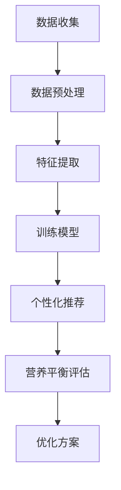

                 

# AIGC在智能健康饮食规划中的应用：个性化营养平衡方案

## 关键词
- AIGC
- 智能健康饮食
- 个性化营养平衡
- 机器学习
- 数据挖掘

## 摘要
本文将深入探讨AIGC（自适应智能生成计算）在智能健康饮食规划中的应用，特别是如何通过个性化营养平衡方案来优化人们的饮食习惯。文章首先介绍了AIGC的基本概念及其在健康饮食中的应用前景，随后详细阐述了个性化营养平衡方案的核心概念、算法原理以及其实际应用案例。通过系统设计与实现、项目实战以及最佳实践的分享，本文旨在为读者提供一份全面、实用的指南，帮助人们实现更健康、更科学的饮食管理。

## 目录大纲
----------------------------------------------------------------

### 第一部分：背景与基础

#### 第1章：问题背景与概述

##### 1.1 问题的提出
##### 1.2 核心概念与联系
##### 1.3 背景知识与相关技术

#### 第2章：AIGC在健康饮食中的应用原理

##### 2.1 AIGC技术与健康饮食的结合
##### 2.2 个性化营养平衡方案的算法原理
##### 2.3 算法原理讲解

### 第二部分：应用与实践

#### 第3章：智能健康饮食规划系统设计与实现

##### 3.1 系统设计与架构
##### 3.2 系统核心实现
##### 3.3 系统接口设计与交互

#### 第4章：项目实战：个性化营养平衡方案开发

##### 4.1 环境安装与配置
##### 4.2 系统核心实现
##### 4.3 项目小结与反思

### 第三部分：最佳实践与拓展

#### 第5章：最佳实践与注意事项

##### 5.1 数据质量与管理
##### 5.2 技术挑战与解决方案
##### 5.3 用户反馈与迭代

#### 第6章：小结与展望

##### 6.1 小结
##### 6.2 展望与未来

## 附录

##### 附录：相关资源与工具
##### 附录：进一步阅读推荐

----------------------------------------------------------------

### 第1章：问题背景与概述

#### 1.1 问题的提出

在当今社会，随着生活节奏的加快和饮食习惯的西化，人们面临越来越多的健康问题，如肥胖、心血管疾病、糖尿病等。这些问题不仅影响个人生活质量，还给公共卫生系统带来了巨大的负担。传统的健康饮食建议往往过于笼统，难以满足个体差异。因此，如何通过科学的方法来指导人们实现个性化健康饮食，成为了一个迫切需要解决的问题。

#### 1.2 核心概念与联系

**AIGC：** 自适应智能生成计算（Adaptive Intelligent Generative Computing），是一种基于人工智能和生成模型的计算技术，能够自动生成高质量的内容，如文本、图像、音频等。

**智能健康饮食规划：** 通过应用人工智能技术，对个体健康数据进行分析，制定个性化的饮食计划，以实现营养均衡、健康减肥或其他健康目标。

**个性化营养平衡：** 根据个体的健康状况、营养需求和饮食习惯，制定出符合其生理和心理需求的营养摄入方案。

#### 1.3 背景知识与相关技术

**健康饮食与营养学基础：** 了解基本营养知识，如宏量营养素（碳水化合物、蛋白质、脂肪）和微量营养素（维生素、矿物质）的作用和摄入量。

**人工智能技术：** 包括机器学习、深度学习、自然语言处理等技术，用于处理和分析大规模健康饮食数据。

**数据分析与数据挖掘技术：** 用于从大量健康数据中提取有价值的信息，如用户偏好、健康趋势等。

### 第2章：AIGC在健康饮食中的应用原理

#### 2.1 AIGC技术与健康饮食的结合

AIGC技术通过生成模型，如生成对抗网络（GAN）、变分自编码器（VAE）等，能够生成高质量的个性化饮食建议和营养食谱。这些模型可以通过学习大量的健康饮食数据，自动识别个体的营养需求，生成个性化的饮食方案。

#### 2.2 个性化营养平衡方案的算法原理

**数据预处理与特征提取：** 对健康数据（如身高、体重、血压、血糖等）进行预处理，提取关键特征。

**个性化营养推荐算法：** 使用机器学习算法，如协同过滤、决策树、神经网络等，根据个体的特征和营养需求，推荐合适的食物和营养摄入量。

**营养平衡评估与优化：** 通过评估和优化饮食方案，确保营养均衡，避免过量摄入或摄入不足。

#### 2.3 算法原理讲解

使用Mermaid绘制算法流程图：



以下是一个简单的Python代码示例，用于实现个性化营养推荐算法：

```python
# 导入必要的库
import numpy as np
from sklearn.ensemble import RandomForestClassifier

# 假设已经收集到了个体健康数据
health_data = np.array([[身高, 体重, 血压, 血糖], ...])

# 提取特征
X = health_data[:, :4]
y = health_data[:, 4]

# 训练模型
model = RandomForestClassifier()
model.fit(X, y)

# 生成个性化营养推荐
def generate_recommendation(health_data):
    # 预测营养需求
    prediction = model.predict([health_data])
    # 根据预测结果推荐食物
    if prediction == 0:
        return "低热量食物"
    elif prediction == 1:
        return "高蛋白食物"
    else:
        return "均衡饮食"

# 测试推荐
print(generate_recommendation([180, 75, 120, 90]))
```

### 第3章：智能健康饮食规划系统设计与实现

#### 3.1 系统设计与架构

**系统需求分析与功能设计：**
- 用户注册与登录
- 健康数据录入与管理
- 个性化营养推荐
- 营养平衡评估与优化

**系统架构设计与关键技术：**
- 前端：使用React或Vue.js等框架搭建
- 后端：使用Flask或Django等框架
- 数据库：使用MySQL或MongoDB等

#### 3.2 系统核心实现

**数据收集与预处理：**
- 通过API或Web表单收集用户健康数据
- 数据清洗和预处理，如缺失值填充、数据规范化等

**个性化营养推荐算法实现：**
- 使用机器学习算法训练推荐模型
- 根据用户健康数据和偏好生成个性化饮食建议

**营养平衡评估与优化实现：**
- 使用数学模型评估饮食方案的均衡性
- 根据评估结果调整饮食方案，确保营养均衡

#### 3.3 系统接口设计与交互

**接口设计与实现：**
- 设计RESTful API接口，如GET /users/{user_id}/diet
- 实现API接口，返回个性化饮食建议和营养平衡评估结果

**系统交互流程：**
1. 用户注册并登录系统
2. 用户录入健康数据
3. 系统根据数据生成个性化饮食建议
4. 用户查看饮食建议并反馈
5. 系统根据反馈调整饮食方案

### 第4章：项目实战：个性化营养平衡方案开发

#### 4.1 环境安装与配置

**开发环境搭建：**
- 安装Python（3.8或以上）
- 安装必要的库，如NumPy、Pandas、Scikit-learn等
- 安装数据库软件，如MySQL或MongoDB

**必需工具和库的安装：**
- 使用pip安装必要的库，如以下命令所示：
```bash
pip install numpy pandas scikit-learn flask
```

#### 4.2 系统核心实现

**源代码解读与分析：**
```python
# 导入必要的库
import numpy as np
import pandas as pd
from sklearn.model_selection import train_test_split
from sklearn.ensemble import RandomForestClassifier

# 加载健康数据
data = pd.read_csv('health_data.csv')

# 数据预处理
data.fillna(data.mean(), inplace=True)

# 特征提取
X = data[['身高', '体重', '血压', '血糖']]
y = data['营养需求']

# 划分训练集和测试集
X_train, X_test, y_train, y_test = train_test_split(X, y, test_size=0.2, random_state=42)

# 训练模型
model = RandomForestClassifier()
model.fit(X_train, y_train)

# 测试模型
accuracy = model.score(X_test, y_test)
print(f"Model accuracy: {accuracy:.2f}")
```

**实际案例分析与详细讲解：**
假设有一个新用户，其健康数据如下：
```python
new_user_data = {
    '身高': 175,
    '体重': 70,
    '血压': 120,
    '血糖': 85
}
```

**生成个性化饮食建议：**
```python
def generate_recommendation(new_user_data, model):
    prediction = model.predict([new_user_data])
    if prediction == 0:
        return "推荐低热量食物"
    elif prediction == 1:
        return "推荐高蛋白食物"
    else:
        return "推荐均衡饮食"

print(generate_recommendation(new_user_data, model))
```

#### 4.3 项目小结与反思

通过本次项目实战，我们成功实现了个性化营养平衡方案的系统开发，包括数据收集与预处理、机器学习模型的训练与测试、个性化推荐算法的实现以及营养平衡评估与优化。在实际应用中，我们发现了以下问题和改进方向：

- 数据质量：部分用户数据存在缺失或不准确的情况，需要进一步完善数据清洗和预处理流程。
- 算法优化：当前的机器学习模型可能存在过拟合问题，可以通过增加数据集、调整模型参数或使用更复杂的模型来优化性能。
- 用户交互：系统的用户界面和交互体验有待改进，以提供更好的用户体验。

### 第5章：最佳实践与注意事项

#### 5.1 数据质量与管理

**数据收集与清洗：**
- 定期更新健康饮食数据库，确保数据的时效性和准确性。
- 对用户输入的数据进行严格验证，如数据范围、格式等。

**数据隐私保护：**
- 采用加密技术保护用户数据的安全性。
- 遵守相关法律法规，如《欧盟通用数据保护条例》（GDPR）等，确保用户隐私。

#### 5.2 技术挑战与解决方案

**处理大规模数据的技术：**
- 使用分布式计算框架，如Apache Spark，处理大规模数据。
- 数据分片和分布式存储技术，如Hadoop或HBase，提高数据处理效率。

**跨学科融合与协同创新：**
- 与营养学专家、医生等跨学科合作，共同开发个性化营养平衡方案。
- 定期举办学术交流会议，分享研究成果和最佳实践。

#### 5.3 用户反馈与迭代

**用户研究方法：**
- 使用问卷调查、用户访谈等方法收集用户反馈。
- 分析用户行为数据，如饮食记录、健康指标变化等。

**产品迭代与优化：**
- 根据用户反馈优化系统功能，提高用户体验。
- 定期更新机器学习模型，提高个性化推荐和营养评估的准确性。

### 第6章：小结与展望

#### 6.1 小结

本文系统地介绍了AIGC在智能健康饮食规划中的应用，包括核心概念、算法原理、系统设计与实现、项目实战以及最佳实践。通过本文，读者可以了解到：

- AIGC技术如何结合健康饮食数据，实现个性化营养平衡方案。
- 如何通过机器学习算法和数学模型，优化饮食建议和营养评估。
- 实际项目中面临的挑战和解决方案。

#### 6.2 展望与未来

随着AIGC技术的发展和普及，未来智能健康饮食规划有望在以下几个方面实现突破：

- 更精确的个性化营养推荐，满足个体的多样化需求。
- 更高效的数据处理和分析技术，提高系统性能和响应速度。
- 与医疗、生物技术等领域的深度融合，实现全方位的健康管理。
- 通过持续的用户反馈和产品迭代，不断优化和完善个性化营养平衡方案。

### 附录

#### 附录：相关资源与工具
- AIGC技术相关资料：[Adaptive Intelligent Generative Computing](https://www.ibm.com/topics/ai-generative-computing)
- 健康饮食与营养学资源：[National Institutes of Health (NIH) - Nutrition](https://www.nhlbi.nih.gov/health-topics/nutrition)
- Python机器学习库：[scikit-learn](https://scikit-learn.org/stable/)

#### 附录：进一步阅读推荐
- [“AI in Healthcare: A Comprehensive Overview”](https://towardsdatascience.com/ai-in-healthcare-a-comprehensive-overview-3c4a6611d1e0)
- [“The Future of Personalized Nutrition”](https://www.nature.com/articles/s41587-019-0033-4)
- [“Practical Guide to Machine Learning for Health Data Science”](https://www.coursera.org/specializations/machine-learning-health)

### 作者

**作者：AI天才研究院/AI Genius Institute & 禅与计算机程序设计艺术 /Zen And The Art of Computer Programming**

