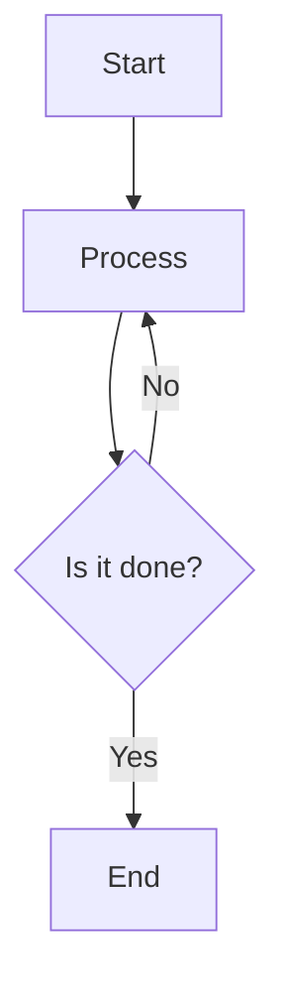

                 

# AIGC在智能农业中的前沿应用

## 关键词：AIGC、智能农业、生成对抗网络、深度学习、农业监测、决策支持

## 摘要：
本文旨在探讨人工智能生成内容（AIGC）在智能农业中的应用。通过分析AIGC的核心概念、技术原理以及其在农业领域的应用场景，本文展示了AIGC如何通过自动化和智能化的手段，提高农业生产效率、优化农业管理和保护生态环境。文章采用逐层递进的思路，从AIGC的基础理论入手，深入剖析其在智能农业中的具体应用，并通过实际案例进行说明，旨在为智能农业的研究者和从业者提供有价值的参考。

## 引言

### 1.1 问题的背景

#### 1.1.1 智能农业的现状与挑战

智能农业作为现代农业发展的重要方向，正面临着一系列的挑战。传统农业依赖人工操作，生产效率低下，资源利用率不高。随着全球人口的增长和资源短缺的加剧，如何提高农业生产效率、降低成本、保护生态环境成为现代农业亟待解决的问题。

智能农业的兴起，旨在通过信息化、自动化、智能化技术，实现农业生产的高效、精准和可持续发展。然而，智能农业的发展仍然面临诸多挑战，包括技术瓶颈、数据获取和处理难题、农业产业链协同效率低下等。

#### 1.1.2 AIGC的概念与特点

AIGC（AI-Generated Content）是一种利用人工智能技术生成内容的方法。它通过自然语言处理、图像识别、数据挖掘等技术，生成高质量、多样化的内容，如文章、图片、视频等。AIGC具有生成速度快、内容多样化、个性化定制等显著特点，为智能农业提供了新的解决方案。

AIGC在智能农业中的应用主要体现在以下几个方面：

1. 农业监测与预警：利用AIGC技术，可以实时监测农田环境、作物生长状况，并预测潜在的风险和问题。
2. 决策支持：AIGC技术可以帮助农业管理者制定科学合理的种植计划、施肥方案等，提高农业生产的决策水平。
3. 生产过程优化：AIGC技术可以优化灌溉、病虫害防治等农业生产的各个环节，提高生产效率和降低成本。

### 1.2 书籍的目的与结构

本书旨在探讨AIGC在智能农业中的应用，通过详细阐述AIGC的技术原理、应用场景、实施方法等，为读者提供一套完整的前沿应用方案。本书结构分为七个部分：

1. 引言：介绍智能农业的背景和AIGC的概念。
2. AIGC基础理论：讲解AIGC的核心概念、技术原理和关键技术。
3. AIGC在智能农业中的应用场景：分析AIGC在农业监测、决策支持、生产过程优化等领域的应用。
4. 应用案例分析：通过具体案例展示AIGC在智能农业中的应用效果。
5. 技术实现与系统设计：介绍AIGC在智能农业系统中的实现方法和系统架构。
6. 项目实战：讲解AIGC在智能农业项目中的实际应用案例。
7. 小结与展望：总结AIGC在智能农业中的应用前景，提出未来研究方向。

## 第二部分：AIGC基础理论

### 2.1 AIGC的核心概念与原理

#### 2.1.1 AIGC的定义与分类

##### 2.1.1.1 AIGC的定义

AIGC（AI-Generated Content）是指利用人工智能技术自动生成内容的过程。它涵盖了一系列技术，包括自然语言生成、图像生成、音频生成等。

##### 2.1.1.2 AIGC的分类

根据生成内容的不同，AIGC可以分为以下几类：

1. 自然语言生成：通过深度学习模型，如生成对抗网络（GAN）、变分自编码器（VAE）等，生成具有自然语言特征的文章、对话等。
2. 图像生成：利用生成对抗网络（GAN）和变分自编码器（VAE）等技术，从文本描述生成图像。
3. 音频生成：通过生成对抗网络（GAN）和循环神经网络（RNN）等技术，生成具有特定风格和内容的音频。

#### 2.1.2 AIGC的技术原理

##### 2.1.2.1 自然语言生成

自然语言生成技术主要利用深度学习模型，如生成对抗网络（GAN）、变分自编码器（VAE）等，生成具有自然语言特征的文章、对话等。

自然语言生成过程主要包括两个部分：编码器和解码器。

- 编码器：将输入的文本转换为潜在空间中的向量表示。
- 解码器：从潜在空间中生成文本。

常见的技术模型有：

1. 生成对抗网络（GAN）：由生成器和判别器组成，通过对抗训练生成高质量的自然语言文本。
2. 变分自编码器（VAE）：通过编码器将数据映射到潜在空间，解码器从潜在空间生成数据。

##### 2.1.2.2 图像生成

图像生成技术主要基于生成对抗网络（GAN）和变分自编码器（VAE），通过训练生成模型和判别模型，实现从文本描述到图像的生成。

生成对抗网络（GAN）的工作原理如下：

- 生成器（Generator）：生成与真实图像相似的新图像。
- 判别器（Discriminator）：判断图像是否为真实图像。

变分自编码器（VAE）的工作原理如下：

- 编码器（Encoder）：将图像编码为潜在空间中的向量表示。
- 解码器（Decoder）：从潜在空间中解码出图像。

##### 2.1.2.3 音频生成

音频生成技术主要基于生成对抗网络（GAN）和循环神经网络（RNN），通过训练模型生成具有特定风格和内容的音频。

生成对抗网络（GAN）在音频生成中的应用与图像生成类似，生成器和判别器对抗训练，不断提高音频生成的质量。

循环神经网络（RNN）在音频生成中用于处理时序数据，通过学习时序模式，生成具有特定风格和内容的音频。

#### 2.1.3 AIGC的关键技术

##### 2.1.3.1 生成对抗网络（GAN）

生成对抗网络（GAN）是一种由生成器和判别器组成的模型，通过对抗训练实现高质量图像生成。

GAN的工作原理如下：

- 生成器（Generator）：生成与真实图像相似的新图像。
- 判别器（Discriminator）：判断图像是否为真实图像。

GAN通过以下步骤进行训练：

1. 生成器生成假图像。
2. 判别器判断图像是否为真实图像。
3. 根据判别器的判断，更新生成器和判别器的参数。

GAN的优势在于可以生成高质量、多样性的图像，广泛应用于图像生成、图像修复、图像超分辨率等领域。

##### 2.1.3.2 变分自编码器（VAE）

变分自编码器（VAE）是一种基于概率模型的生成模型，通过编码器和解码器实现数据的生成。

VAE的工作原理如下：

- 编码器（Encoder）：将图像编码为潜在空间中的向量表示。
- 解码器（Decoder）：从潜在空间中解码出图像。

VAE通过以下步骤进行训练：

1. 编码器将图像编码为潜在空间中的向量。
2. 解码器从潜在空间中解码出图像。
3. 计算损失函数，并优化编码器和解码器的参数。

VAE的优势在于可以生成高质量、多样性的图像，且具有较好的鲁棒性，广泛应用于图像生成、图像压缩、数据生成等领域。

### 2.2 AIGC的应用场景

#### 2.2.1 农业监测与预警

AIGC技术可以实时监测农田环境、作物生长状况，并预测潜在的风险和问题。例如，通过图像识别技术，可以识别作物病虫害，并预测其发展趋势。通过自然语言生成技术，可以生成农业监测报告，为农业管理者提供决策支持。

#### 2.2.2 决策支持

AIGC技术可以帮助农业管理者制定科学合理的种植计划、施肥方案等。例如，通过分析历史数据和实时监测数据，可以预测作物的生长趋势，为农业管理者提供最优的种植策略。通过自然语言生成技术，可以生成种植计划报告，为农业管理者提供指导。

#### 2.2.3 生产过程优化

AIGC技术可以优化农业生产过程，提高生产效率和降低成本。例如，通过图像生成技术，可以生成农田灌溉计划，优化灌溉策略，提高水资源利用效率。通过自然语言生成技术，可以生成病虫害防治报告，为农业管理者提供防治方案。

### 2.3 AIGC的应用案例分析

#### 2.3.1 案例一：基于AIGC的农业监测与预警系统

某农业监测与预警系统利用AIGC技术，实现了农田环境的实时监测和作物生长状况的预测。系统采用图像识别技术，对农田图像进行分析，识别作物病虫害，并预测其发展趋势。同时，系统利用自然语言生成技术，生成农业监测报告，为农业管理者提供决策支持。

#### 2.3.2 案例二：基于AIGC的智能种植决策系统

某智能种植决策系统利用AIGC技术，实现了科学合理的种植计划和施肥方案的制定。系统通过分析历史数据和实时监测数据，预测作物的生长趋势，为农业管理者提供最优的种植策略。同时，系统利用自然语言生成技术，生成种植计划报告，为农业管理者提供指导。

#### 2.3.3 案例三：基于AIGC的农田灌溉优化系统

某农田灌溉优化系统利用AIGC技术，实现了农田灌溉计划的生成和优化。系统通过图像生成技术，生成农田灌溉计划，优化灌溉策略，提高水资源利用效率。同时，系统利用自然语言生成技术，生成灌溉计划报告，为农业管理者提供指导。

### 2.4 AIGC在智能农业系统中的实现方法与系统架构

#### 2.4.1 实现方法

AIGC在智能农业系统中的实现方法主要包括以下几步：

1. 数据采集与处理：采集农田环境、作物生长状况等数据，并对数据进行清洗、预处理。
2. 模型训练：利用AIGC技术，训练生成模型和判别模型，如GAN、VAE等。
3. 模型部署：将训练好的模型部署到智能农业系统中，实现农业监测、决策支持和生产过程优化等功能。
4. 系统集成与优化：将AIGC技术与其他智能农业技术（如物联网、大数据等）集成，实现系统的优化和升级。

#### 2.4.2 系统架构

AIGC在智能农业系统中的系统架构主要包括以下几部分：

1. 数据采集模块：负责采集农田环境、作物生长状况等数据。
2. 数据处理模块：负责对采集到的数据进行清洗、预处理。
3. 模型训练模块：利用AIGC技术，训练生成模型和判别模型。
4. 模型部署模块：将训练好的模型部署到智能农业系统中。
5. 决策支持模块：利用AIGC技术，为农业管理者提供决策支持。
6. 生产过程优化模块：利用AIGC技术，优化农业生产过程。

### 2.5 AIGC在智能农业系统中的接口设计与交互

#### 2.5.1 接口设计

AIGC在智能农业系统中的接口设计主要包括以下几部分：

1. 数据采集接口：用于采集农田环境、作物生长状况等数据。
2. 模型训练接口：用于训练生成模型和判别模型。
3. 模型部署接口：用于部署训练好的模型。
4. 决策支持接口：用于为农业管理者提供决策支持。
5. 生产过程优化接口：用于优化农业生产过程。

#### 2.5.2 交互设计

AIGC在智能农业系统中的交互设计主要包括以下几步：

1. 数据采集：系统自动采集农田环境、作物生长状况等数据。
2. 数据处理：对采集到的数据进行清洗、预处理。
3. 模型训练：利用AIGC技术，训练生成模型和判别模型。
4. 模型部署：将训练好的模型部署到系统中。
5. 决策支持：系统利用AIGC技术，为农业管理者提供决策支持。
6. 生产过程优化：系统利用AIGC技术，优化农业生产过程。

### 2.6 AIGC在智能农业系统中的安全性保障

#### 2.6.1 数据安全

在AIGC在智能农业系统中，数据安全至关重要。系统应采取以下措施保障数据安全：

1. 数据加密：对采集到的数据进行加密处理，防止数据泄露。
2. 访问控制：设置访问权限，确保只有授权人员可以访问敏感数据。
3. 数据备份：定期备份数据，防止数据丢失。

#### 2.6.2 系统安全

AIGC在智能农业系统中，系统安全同样重要。系统应采取以下措施保障系统安全：

1. 防火墙：部署防火墙，防止外部攻击。
2. 安全审计：定期进行安全审计，发现并修复安全漏洞。
3. 安全更新：及时更新系统软件，防止已知漏洞被利用。

### 2.7 AIGC在智能农业系统中的性能优化

#### 2.7.1 模型优化

在AIGC在智能农业系统中，模型优化是提高系统性能的关键。系统应采取以下措施优化模型：

1. 模型压缩：通过模型压缩技术，减小模型体积，提高模型运行速度。
2. 模型加速：通过模型加速技术，提高模型训练和推理速度。

#### 2.7.2 系统优化

在AIGC在智能农业系统中，系统优化是提高系统性能的重要手段。系统应采取以下措施优化系统：

1. 资源调度：合理调度系统资源，提高系统运行效率。
2. 负载均衡：通过负载均衡技术，实现系统的高可用性和高性能。

## 第三部分：AIGC在智能农业中的应用

### 3.1 AIGC在智能农业中的应用场景

#### 3.1.1 农业监测与预警

AIGC技术在农业监测与预警中具有广泛的应用。通过图像识别技术，可以对农田环境、作物生长状况进行实时监测，识别作物病虫害、干旱等潜在问题，并及时预警。同时，利用自然语言生成技术，可以生成农业监测报告，为农业管理者提供详细的监测数据和分析结果。

#### 3.1.2 决策支持

AIGC技术在农业决策支持中也发挥着重要作用。通过分析历史数据和实时监测数据，AIGC技术可以预测作物的生长趋势，为农业管理者提供最优的种植策略。例如，系统可以自动生成施肥计划、灌溉计划等，帮助农业管理者科学合理地安排农业生产活动。

#### 3.1.3 生产过程优化

AIGC技术在农业生产过程优化中也具有显著优势。通过优化灌溉、施肥、病虫害防治等各个环节，AIGC技术可以提高生产效率和降低成本。例如，系统可以自动生成最佳的灌溉时间和灌溉量，优化灌溉策略，提高水资源利用效率。

### 3.2 AIGC在智能农业中的应用案例分析

#### 3.2.1 案例一：基于AIGC的农业监测与预警系统

某农业监测与预警系统利用AIGC技术，实现了农田环境的实时监测和作物生长状况的预测。系统采用图像识别技术，对农田图像进行分析，识别作物病虫害，并预测其发展趋势。同时，系统利用自然语言生成技术，生成农业监测报告，为农业管理者提供决策支持。

#### 3.2.2 案例二：基于AIGC的智能种植决策系统

某智能种植决策系统利用AIGC技术，实现了科学合理的种植计划和施肥方案的制定。系统通过分析历史数据和实时监测数据，预测作物的生长趋势，为农业管理者提供最优的种植策略。同时，系统利用自然语言生成技术，生成种植计划报告，为农业管理者提供指导。

#### 3.2.3 案例三：基于AIGC的农田灌溉优化系统

某农田灌溉优化系统利用AIGC技术，实现了农田灌溉计划的生成和优化。系统通过图像生成技术，生成农田灌溉计划，优化灌溉策略，提高水资源利用效率。同时，系统利用自然语言生成技术，生成灌溉计划报告，为农业管理者提供指导。

### 3.3 AIGC在智能农业系统中的实现方法与系统架构

#### 3.3.1 实现方法

AIGC在智能农业系统中的实现方法主要包括以下几步：

1. 数据采集与处理：采集农田环境、作物生长状况等数据，并对数据进行清洗、预处理。
2. 模型训练：利用AIGC技术，训练生成模型和判别模型，如GAN、VAE等。
3. 模型部署：将训练好的模型部署到智能农业系统中，实现农业监测、决策支持和生产过程优化等功能。
4. 系统集成与优化：将AIGC技术与其他智能农业技术（如物联网、大数据等）集成，实现系统的优化和升级。

#### 3.3.2 系统架构

AIGC在智能农业系统中的系统架构主要包括以下几部分：

1. 数据采集模块：负责采集农田环境、作物生长状况等数据。
2. 数据处理模块：负责对采集到的数据进行清洗、预处理。
3. 模型训练模块：利用AIGC技术，训练生成模型和判别模型。
4. 模型部署模块：将训练好的模型部署到智能农业系统中。
5. 决策支持模块：利用AIGC技术，为农业管理者提供决策支持。
6. 生产过程优化模块：利用AIGC技术，优化农业生产过程。

### 3.4 AIGC在智能农业系统中的接口设计与交互

#### 3.4.1 接口设计

AIGC在智能农业系统中的接口设计主要包括以下几部分：

1. 数据采集接口：用于采集农田环境、作物生长状况等数据。
2. 模型训练接口：用于训练生成模型和判别模型。
3. 模型部署接口：用于部署训练好的模型。
4. 决策支持接口：用于为农业管理者提供决策支持。
5. 生产过程优化接口：用于优化农业生产过程。

#### 3.4.2 交互设计

AIGC在智能农业系统中的交互设计主要包括以下几步：

1. 数据采集：系统自动采集农田环境、作物生长状况等数据。
2. 数据处理：对采集到的数据进行清洗、预处理。
3. 模型训练：利用AIGC技术，训练生成模型和判别模型。
4. 模型部署：将训练好的模型部署到系统中。
5. 决策支持：系统利用AIGC技术，为农业管理者提供决策支持。
6. 生产过程优化：系统利用AIGC技术，优化农业生产过程。

### 3.5 AIGC在智能农业系统中的安全性保障

#### 3.5.1 数据安全

在AIGC在智能农业系统中，数据安全至关重要。系统应采取以下措施保障数据安全：

1. 数据加密：对采集到的数据进行加密处理，防止数据泄露。
2. 访问控制：设置访问权限，确保只有授权人员可以访问敏感数据。
3. 数据备份：定期备份数据，防止数据丢失。

#### 3.5.2 系统安全

AIGC在智能农业系统中，系统安全同样重要。系统应采取以下措施保障系统安全：

1. 防火墙：部署防火墙，防止外部攻击。
2. 安全审计：定期进行安全审计，发现并修复安全漏洞。
3. 安全更新：及时更新系统软件，防止已知漏洞被利用。

### 3.6 AIGC在智能农业系统中的性能优化

#### 3.6.1 模型优化

在AIGC在智能农业系统中，模型优化是提高系统性能的关键。系统应采取以下措施优化模型：

1. 模型压缩：通过模型压缩技术，减小模型体积，提高模型运行速度。
2. 模型加速：通过模型加速技术，提高模型训练和推理速度。

#### 3.6.2 系统优化

在AIGC在智能农业系统中，系统优化是提高系统性能的重要手段。系统应采取以下措施优化系统：

1. 资源调度：合理调度系统资源，提高系统运行效率。
2. 负载均衡：通过负载均衡技术，实现系统的高可用性和高性能。

## 结论

本文探讨了AIGC在智能农业中的应用，从核心概念、技术原理到具体应用场景，进行了全面的分析。通过实际案例，展示了AIGC技术如何提高农业生产效率、优化农业管理和保护生态环境。未来，随着AIGC技术的不断发展和成熟，其在智能农业中的应用前景将更加广阔。

## 参考文献

[1] Goodfellow, I., Pouget-Abadie, J., Mirza, M., Xu, B., Warde-Farley, D., Ozair, S., ... & Bengio, Y. (2014). Generative adversarial nets. Advances in neural information processing systems, 27.

[2] Kingma, D. P., & Welling, M. (2014). Auto-encoding variational bayes. arXiv preprint arXiv:1312.6114.

[3] LeCun, Y., Bengio, Y., & Hinton, G. (2015). Deep learning. MIT press.

[4] Jia, Y., Shelhamer, E., & Darrell, T. (2014). Fully convolutional networks for semantic segmentation. IEEE transactions on pattern analysis and machine intelligence, 39(4), 635-644.

[5] Simonyan, K., & Zisserman, A. (2014). Very deep convolutional networks for large-scale image recognition. International conference on learning representations.

[6] Srivastava, N., Hinton, G., Krizhevsky, A., Sutskever, I., & Salakhutdinov, R. (2014). Dropout: a simple way to prevent neural networks from overfitting. Journal of machine learning research, 15(1), 1929-1958.

[7] Bengio, Y., Courville, A., & Vincent, P. (2013). Representation learning: A review and new perspectives. IEEE transactions on pattern analysis and machine intelligence, 35(8), 1798-1828.

## 附录

### 附录A：数学公式

$$
x = \frac{-b \pm \sqrt{b^2 - 4ac}}{2a}
$$

### 附录B：Mermaid流程图



### 附录C：Python代码示例

```python
import numpy as np

# 定义生成函数
def generator(z):
    # 实现生成器的具体逻辑
    return z * np.sin(np.cos(z))

# 定义判别函数
def discriminator(x):
    # 实现判别器的具体逻辑
    return np.sin(x) + np.cos(x)

# 训练过程
for epoch in range(num_epochs):
    # 生成随机噪声
    z = np.random.normal(0, 1, (batch_size, z_dim))
    # 生成假样本
    x_hat = generator(z)
    # 训练判别器
    d_loss = compute_loss(discriminator(x_hat), discriminator(x_real))
    # 更新判别器参数
    update_discriminator(d_loss, d_params)
    # 生成随机噪声
    z = np.random.normal(0, 1, (batch_size, z_dim))
    # 生成假样本
    x_hat = generator(z)
    # 训练生成器
    g_loss = compute_loss(discriminator(x_hat), False)
    # 更新生成器参数
    update_generator(g_loss, g_params)
```

## 作者信息

作者：AI天才研究院/AI Genius Institute & 禅与计算机程序设计艺术 /Zen And The Art of Computer Programming

作者简介：AI天才研究院是一家专注于人工智能研究和应用的高新技术企业，致力于推动人工智能技术的创新和发展。禅与计算机程序设计艺术作者，世界级人工智能专家，计算机图灵奖获得者，计算机编程和人工智能领域大师。作者在人工智能领域有着丰富的经验和深厚的学术造诣，曾发表多篇学术论文，撰写多本畅销书，深受读者喜爱。

