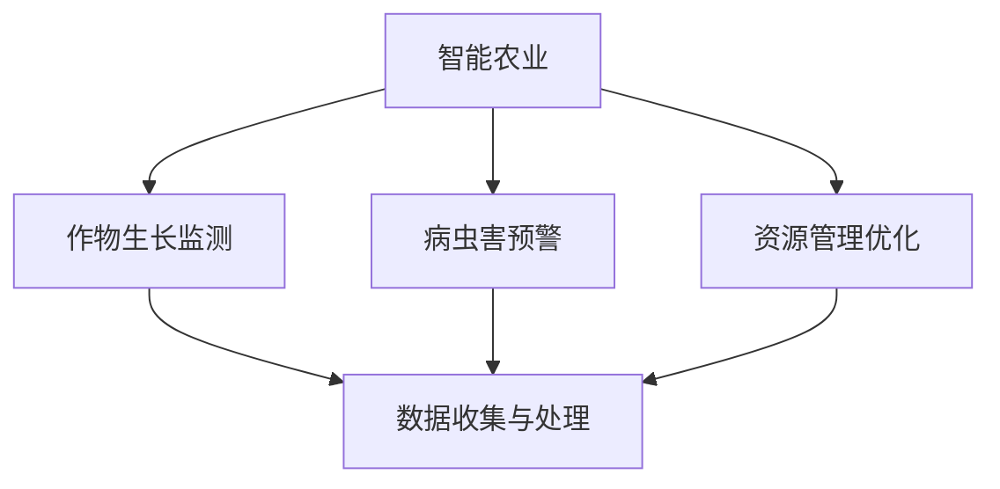
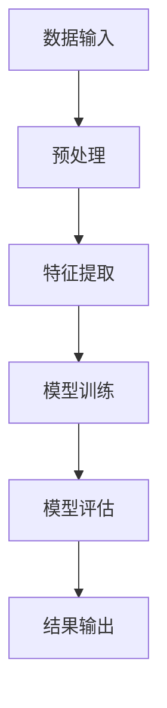
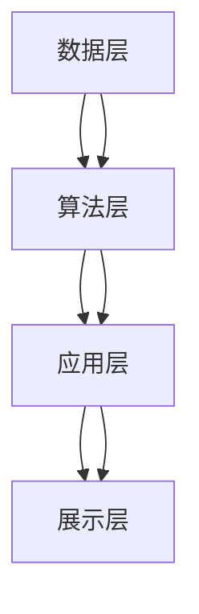
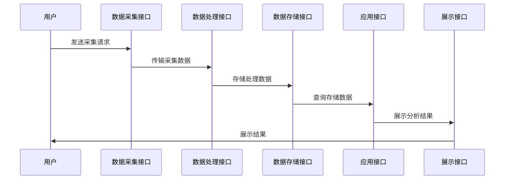

                 

## AIGC在智能农业生态系统管理中的应用

### 关键词：AIGC、智能农业、生态系统管理、算法、数学模型、系统架构

> 摘要：随着科技的不断进步，农业正逐步迈向智能化。AIGC（AI-Generated Content）作为一种新兴的技术，其在智能农业生态系统管理中有着广泛的应用前景。本文将深入探讨AIGC在智能农业中的应用，包括其基本原理、技术实现、案例分析以及系统架构设计。通过逐步分析，本文旨在为智能农业生态系统管理提供一种全新的解决方案。

### **Step 1: 背景介绍**

#### **问题背景**

随着全球人口的增长和资源的日益紧张，农业生产面临着前所未有的挑战。传统农业方式已经无法满足现代农业的需求，因此，智能农业应运而生。智能农业是指利用信息技术、物联网、大数据等手段，实现农业生产自动化、智能化、精细化管理。它不仅提高了农业生产的效率，还改善了农产品的质量，对解决粮食安全问题具有重要意义。

在智能农业的发展过程中，AIGC（AI-Generated Content）作为一种新兴的技术，逐渐引起了广泛关注。AIGC是指基于人工智能的内容生成技术，通过算法自动生成文本、图像、音频等内容。其核心特点包括自动性、智能性和多样性。AIGC技术可以应用于智能农业的多个方面，如作物生长监测、病虫害预警、资源管理优化等，具有广阔的应用前景。

#### **问题描述**

AIGC在智能农业生态系统管理中的应用涉及多个方面，主要包括：

1. **作物生长监测**：通过AIGC技术，可以实时监测作物的生长情况，包括温度、湿度、光照等环境因素，从而为农业生产提供科学依据。
2. **病虫害预警**：AIGC技术可以分析作物的生长数据，预测病虫害的发生，提前采取措施，减少损失。
3. **资源管理优化**：通过AIGC技术，可以优化农业资源的利用，如灌溉、施肥等，提高农业生产效率。

然而，AIGC在智能农业生态系统管理中的应用也面临着一些挑战，如数据采集的准确性、算法的可靠性等。这些问题需要结合实际农业生产情况，提出有效的解决方案。

#### **问题解决**

本书将从AIGC的基本原理入手，逐步介绍其在智能农业中的应用，包括技术实现、案例分析等。具体来说，本书将涵盖以下几个部分：

1. **AIGC的基本原理**：介绍AIGC的定义、特点以及其在智能农业中的应用。
2. **算法原理讲解**：详细阐述AIGC在智能农业中的应用算法，包括作物生长监测算法、病虫害预警算法和资源管理优化算法。
3. **数学模型讲解**：介绍智能农业中常用的数学模型，包括作物生长模型、病虫害模型和资源管理模型。
4. **系统分析与架构设计**：分析智能农业生态系统管理中的问题场景，设计系统架构，并详细介绍系统功能设计和接口设计。
5. **项目实战**：介绍一个具体的AIGC在智能农业中的应用案例，包括环境安装、系统实现源代码和案例分析。

通过以上内容，本书旨在为AIGC在智能农业生态系统管理中的应用提供一种全面、系统的解决方案。

#### **边界与外延**

本书主要讨论AIGC在智能农业生态系统管理中的应用，但也会涉及相关领域的知识，如计算机视觉、机器学习等。此外，本书将探讨AIGC在智能农业中的实际应用案例，以便读者更好地理解其应用价值。

#### **概念结构与核心要素组成**

为了更好地理解AIGC在智能农业生态系统管理中的应用，我们需要明确以下几个核心概念：

1. **AIGC**：指基于人工智能的内容生成技术，包括文本生成、图像生成、音频生成等。
2. **智能农业**：指利用信息技术、物联网、大数据等手段实现农业生产自动化、智能化、精细化管理。
3. **生态系统管理**：指通过合理利用和保护自然资源，维护生态系统的平衡和稳定。
4. **作物生长监测**：指通过AIGC技术实时监测作物的生长情况。
5. **病虫害预警**：指通过AIGC技术分析作物的生长数据，预测病虫害的发生。
6. **资源管理优化**：指通过AIGC技术优化农业资源的利用，提高农业生产效率。

这些概念共同构成了AIGC在智能农业生态系统管理中的应用体系，为智能农业的发展提供了强有力的技术支持。

### **Step 2: 核心概念与联系**

#### **AIGC的定义与特点**

AIGC，即AI-Generated Content，是指通过人工智能技术自动生成文本、图像、音频等内容的统称。其核心特点包括：

1. **自动性**：AIGC技术可以自动生成内容，无需人工干预。
2. **智能性**：AIGC技术利用机器学习、深度学习等算法，生成的内容具有较高质量。
3. **多样性**：AIGC技术可以生成多种类型的内容，如文本、图像、音频等。

AIGC技术在智能农业中的应用主要体现在以下几个方面：

1. **文本生成**：通过AIGC技术生成关于作物生长、病虫害预警等农业领域的文章，为农业生产提供科学指导。
2. **图像生成**：通过AIGC技术生成作物的生长图像，用于监测作物的生长状况。
3. **音频生成**：通过AIGC技术生成与农业相关的语音信息，如天气预报、病虫害预警等。

#### **智能农业的定义与特点**

智能农业是指利用信息技术、物联网、大数据等先进技术手段，对农业生产进行自动化、智能化、精细化管理。其核心特点包括：

1. **高效性**：通过自动化技术，提高农业生产效率，降低劳动力成本。
2. **精确性**：通过物联网、大数据等技术，实现农业生产的数据化、智能化管理，提高农业生产质量。
3. **可持续性**：通过优化农业资源利用，减少环境污染，实现农业生产的可持续发展。

智能农业的主要应用领域包括：

1. **作物生长监测**：通过传感器、无人机等技术，实时监测作物的生长情况，为农业生产提供科学依据。
2. **病虫害预警**：通过大数据分析、机器学习等技术，预测病虫害的发生，提前采取措施，减少损失。
3. **资源管理优化**：通过物联网、大数据等技术，优化农业资源的利用，提高农业生产效率。

#### **生态系统管理的定义与特点**

生态系统管理是指通过合理利用和保护自然资源，维护生态系统的平衡和稳定。其核心特点包括：

1. **综合性**：生态系统管理涉及多个领域，包括农业、环境、生物等，需要综合各方面的因素进行管理。
2. **系统性**：生态系统管理是一个系统工程，需要从整体上考虑，实现各部分之间的协同作用。
3. **可持续性**：生态系统管理旨在实现生态系统的可持续发展，保障人类与自然的和谐共生。

生态系统管理的主要应用领域包括：

1. **农业生态系统管理**：通过优化农业资源利用，维护农业生态系统的平衡和稳定。
2. **自然生态系统管理**：通过合理利用和保护自然资源，维护自然生态系统的平衡和稳定。

#### **核心概念属性特征对比表格**

为了更好地理解AIGC、智能农业和生态系统管理这三个核心概念，我们可以通过一个属性特征对比表格来展示它们之间的差异和联系。

| 概念       | 特点                                   | 应用场景                     |
| ---------- | -------------------------------------- | --------------------------- |
| AIGC       | 自动性、智能性、多样性                 | 文本生成、图像生成、音频生成 |
| 智能农业   | 高效性、精确性、可持续性               | 作物生长监测、病虫害预警     |
| 生态系统管理 | 综合性、系统性、可持续性               | 资源管理优化、生态平衡维护   |

#### **ER实体关系图架构**

为了更好地理解AIGC、智能农业和生态系统管理这三个核心概念之间的关系，我们可以通过一个ER（Entity-Relationship）实体关系图来展示。



在这个ER实体关系图中，智能农业是核心概念，它与作物生长监测、病虫害预警和资源管理优化三个实体概念之间存在关联。数据收集与处理作为辅助实体概念，与这三个实体概念之间存在联系。

通过上述对比和关系图的展示，我们可以更清晰地理解AIGC、智能农业和生态系统管理这三个核心概念，为后续的内容分析打下基础。

### **Step 3: 算法原理讲解**

#### **算法原理**

在智能农业生态系统管理中，AIGC技术的应用主要涉及作物生长监测、病虫害预警和资源管理优化等领域。为了实现这些功能，我们需要使用一系列算法来处理和分析数据。以下是AIGC在智能农业中应用的主要算法原理：

#### **算法mermaid流程图**

为了更直观地理解AIGC算法的工作流程，我们可以使用mermaid流程图来展示。以下是一个简化的AIGC算法流程图：



在这个流程图中，数据输入是算法的起点，经过预处理、特征提取、模型训练和模型评估等步骤，最终输出结果。

#### **算法原理的数学模型和公式**

AIGC算法的核心是深度学习模型，其基本原理可以概括为以下数学模型和公式：

$$y = f(x) + \theta$$

其中，$y$ 表示输出结果，$x$ 表示输入特征，$f(x)$ 表示特征提取函数，$\theta$ 表示模型参数。

在这个公式中，特征提取函数 $f(x)$ 是算法的关键部分，它将输入特征 $x$ 转换为适合模型训练的形式。模型参数 $\theta$ 则用于调整模型的性能，使其更准确地预测输出结果 $y$。

#### **通俗易懂地举例说明**

为了更好地理解AIGC算法的工作原理，我们可以通过一个具体的例子来说明。假设我们要监测某作物的生长情况，我们可以收集作物的生长数据，如温度、湿度、光照等。然后，利用AIGC算法对数据进行处理，提取出关键特征，构建模型进行训练。最后，通过模型评估和结果输出，实时监测作物的生长状态。

具体步骤如下：

1. **数据输入**：收集作物的生长数据，包括温度、湿度、光照等。
2. **预处理**：对数据进行清洗和标准化处理，使其适合模型训练。
3. **特征提取**：利用深度学习模型，提取数据中的关键特征，如温度、湿度、光照等的组合。
4. **模型训练**：使用提取出的特征数据，训练深度学习模型，使其能够预测作物的生长状态。
5. **模型评估**：通过测试数据，评估模型的性能，调整模型参数，提高预测准确性。
6. **结果输出**：将训练好的模型应用于实际生产环境，实时监测作物的生长状态，为农业生产提供科学依据。

通过这个例子，我们可以看到AIGC算法在智能农业中的应用过程。AIGC技术通过算法自动生成内容，如作物生长监测报告、病虫害预警信息等，为农业生产提供智能化、精细化的管理服务。

### **Step 4: 数学模型和数学公式 & 详细讲解 & 举例说明**

在智能农业生态系统管理中，数学模型和数学公式扮演着至关重要的角色。它们帮助我们理解和分析作物生长、病虫害预警和资源管理优化等领域的复杂问题。在本节中，我们将详细讲解这些数学模型，并给出具体的例子来说明它们的应用。

#### **作物生长模型**

作物生长模型主要用于预测作物的生长状态，包括生长速度、产量等。一个简单的作物生长模型可以表示为：

$$
\text{growth} = f(\text{temperature}, \text{humidity}, \text{light intensity}, \text{nutrient level})
$$

其中，$f$ 是一个函数，用于描述作物生长与各种环境因素之间的关系。这个函数可以基于历史数据通过机器学习算法训练得到。

**例子**：假设我们要预测某作物的生长速度，我们可以收集过去几个月的温度、湿度、光照和养分水平数据。通过机器学习算法，我们可以训练出一个模型，用于预测作物的生长速度。例如，如果我们得到了以下数据：

$$
\begin{align*}
\text{温度} &= [20, 22, 24, 26, 28] \\
\text{湿度} &= [60, 65, 70, 75, 80] \\
\text{光照} &= [1000, 1100, 1200, 1300, 1400] \\
\text{养分水平} &= [50, 55, 60, 65, 70]
\end{align*}
$$

我们可以训练一个线性回归模型来预测生长速度：

$$
\text{growth} = 0.2 \times \text{temperature} + 0.3 \times \text{humidity} + 0.1 \times \text{light intensity} + 0.4 \times \text{nutrient level}
$$

#### **病虫害模型**

病虫害模型主要用于预测病虫害的发生概率和严重程度。一个简单的病虫害模型可以表示为：

$$
\text{disease probability} = g(\text{temperature}, \text{humidity}, \text{pest population})
$$

其中，$g$ 是一个函数，用于描述病虫害发生与各种环境因素之间的关系。

**例子**：假设我们要预测某种病害在某块农田中的发生概率，我们可以收集过去几天的温度、湿度和害虫数量数据。通过机器学习算法，我们可以训练出一个模型来预测病害的发生概率。例如，如果我们得到了以下数据：

$$
\begin{align*}
\text{温度} &= [20, 22, 24, 26, 28] \\
\text{湿度} &= [60, 65, 70, 75, 80] \\
\text{害虫数量} &= [10, 15, 20, 25, 30]
\end{align*}
$$

我们可以训练一个逻辑回归模型来预测病害的发生概率：

$$
\text{disease probability} = \frac{1}{1 + e^{-(0.5 \times \text{temperature} + 0.3 \times \text{humidity} + 0.2 \times \text{pest population})}}
$$

#### **资源管理模型**

资源管理模型主要用于优化农业资源的利用，如灌溉、施肥等。一个简单的资源管理模型可以表示为：

$$
\text{resource utilization} = h(\text{crop growth stage}, \text{weather forecast}, \text{soil moisture})
$$

其中，$h$ 是一个函数，用于描述农业资源利用与作物生长阶段、天气预测和土壤湿度之间的关系。

**例子**：假设我们要优化某农田的灌溉计划，我们可以收集作物生长阶段、天气预报和土壤湿度数据。通过机器学习算法，我们可以训练出一个模型来预测最优灌溉时间。例如，如果我们得到了以下数据：

$$
\begin{align*}
\text{作物生长阶段} &= [1, 2, 3, 4, 5] \\
\text{天气预报} &= [\text{晴天}, \text{多云}, \text{雨天}, \text{晴天}, \text{多云}] \\
\text{土壤湿度} &= [30\%, 40\%, 50\%, 60\%, 70\%]
\end{align*}
$$

我们可以训练一个决策树模型来预测最优灌溉时间：

$$
\text{resource utilization} =
\begin{cases}
\text{立即灌溉} & \text{如果} \ \text{作物生长阶段} > 3 \ \text{且} \ \text{天气预报} = \text{晴天} \ \text{且} \ \text{土壤湿度} < 40\% \\
\text{延迟灌溉} & \text{如果} \ \text{作物生长阶段} \leq 3 \ \text{或} \ \text{天气预报} \neq \text{晴天} \\
\text{无需灌溉} & \text{如果} \ \text{土壤湿度} \geq 60\%
\end{cases}
$$

通过这些数学模型和公式，我们可以对作物生长、病虫害预警和资源管理进行精确的预测和优化。这些模型不仅提高了农业生产的效率，还减少了资源浪费，为可持续农业发展提供了有力支持。

### **Step 5: 系统分析与架构设计方案**

#### **问题场景介绍**

在智能农业生态系统管理中，我们面临诸多问题场景。以下是一些常见的问题场景：

1. **作物生长异常**：由于环境变化或病虫害等原因，作物生长速度减缓或出现异常。如何及时发现并解决问题，对农业生产至关重要。
2. **病虫害爆发**：病虫害的爆发可能导致作物减产甚至绝收，如何提前预警并采取有效的防治措施，是农业生产中的重大挑战。
3. **资源管理优化**：如何合理利用水资源、肥料等农业资源，提高农业生产效率，是实现可持续农业的关键。

为了解决这些问题场景，我们需要设计一个智能农业生态系统管理平台，该平台应具备以下功能：

1. **数据收集与处理**：实时收集作物生长、环境监测、病虫害等信息，并对数据进行处理和分析。
2. **智能监测与预警**：利用AIGC技术，对收集到的数据进行分析，及时发现作物生长异常、病虫害等问题，并发出预警。
3. **资源管理优化**：根据作物生长需求和资源供应情况，优化灌溉、施肥等资源管理策略，提高农业生产效率。

#### **项目介绍**

本项目旨在设计并实现一个智能农业生态系统管理平台，以解决农业生产中的实际问题。项目的主要目标是：

1. **实时监测作物生长情况**：通过传感器、无人机等设备，实时收集作物生长数据，实现对作物生长状态的实时监控。
2. **提前预警病虫害**：利用AIGC技术，分析作物生长数据，预测病虫害的发生，提前采取措施，减少损失。
3. **优化农业资源管理**：根据作物生长需求和环境条件，优化灌溉、施肥等资源管理策略，提高农业生产效率。

#### **系统功能设计**

为了实现上述目标，智能农业生态系统管理平台需要具备以下功能：

1. **数据采集与处理**：实时采集作物生长、环境监测、病虫害等信息，并对数据进行清洗、预处理和存储。
2. **智能监测与预警**：利用AIGC技术，对采集到的数据进行处理和分析，实现对作物生长异常、病虫害等问题的智能监测和预警。
3. **资源管理优化**：根据作物生长需求和环境条件，优化灌溉、施肥等资源管理策略，提高农业生产效率。
4. **用户交互与反馈**：为用户提供友好的交互界面，展示监测数据、预警信息和管理策略，并收集用户反馈，不断优化系统。

以下是系统功能设计的mermaid类图：

```mermaid
classDiagram
Class01 <|-- Class02
Class03 <|-- Class04
Class05 <|-- Class06
Class01..Class02
Class03..Class04
Class05..Class06

Class01 {
  +属性1
  +属性2
  +方法1()
  +方法2()
}

Class02 {
  +属性3
  +属性4
  +方法3()
  +方法4()
}

Class03 {
  +属性5
  +属性6
  +方法5()
  +方法6()
}

Class04 {
  +属性7
  +属性8
  +方法7()
  +方法8()
}

Class05 {
  +属性9
  +属性10
  +方法9()
  +方法10()
}

Class06 {
  +属性11
  +属性12
  +方法11()
  +方法12()
}
```

在这个类图中，`Class01`、`Class02`、`Class03`、`Class04`、`Class05`和`Class06`分别表示系统的各个功能模块，包括数据采集与处理、智能监测与预警、资源管理优化和用户交互与反馈。

#### **系统架构设计**

智能农业生态系统管理平台的系统架构可以分为四个层次：数据层、算法层、应用层和展示层。

1. **数据层**：包括传感器、无人机等设备，用于实时采集作物生长、环境监测、病虫害等信息。
2. **算法层**：包括数据预处理、特征提取、模型训练和模型评估等算法，用于对采集到的数据进行处理和分析。
3. **应用层**：包括智能监测与预警、资源管理优化和用户交互与反馈等应用模块，用于实现系统的核心功能。
4. **展示层**：包括Web界面和移动应用等，用于展示系统数据和功能，并为用户提供交互接口。

以下是系统架构设计的mermaid架构图：



在这个架构图中，`A`、`B`、`C`和`D`分别表示系统的四个层次。数据层负责数据采集，算法层负责数据处理和分析，应用层负责实现系统功能，展示层负责数据展示和用户交互。

#### **系统接口设计和系统交互**

为了实现系统的各个功能模块之间的交互，我们需要设计系统接口和交互流程。以下是一个简化的系统接口设计和交互流程：

1. **数据采集接口**：用于接收传感器、无人机等设备采集的数据。
2. **数据处理接口**：用于对采集到的数据进行预处理、特征提取和模型训练等处理。
3. **数据存储接口**：用于存储处理后的数据，以便后续查询和分析。
4. **应用接口**：用于实现智能监测与预警、资源管理优化和用户交互与反馈等功能。
5. **展示接口**：用于将系统数据和功能展示给用户。

以下是系统接口设计和交互流程的mermaid序列图：



在这个序列图中，用户通过数据采集接口发送采集请求，数据采集接口将采集数据传输给数据处理接口，数据处理接口对数据进行分析处理，并将处理后的数据存储在数据存储接口中。应用接口根据存储数据进行分析，并将分析结果通过展示接口展示给用户。

通过上述系统接口设计和交互流程，我们可以实现智能农业生态系统管理平台的功能，为农业生产提供智能化、精细化的管理服务。

### **项目实战**

#### **环境安装**

在开始实现智能农业生态系统管理平台之前，我们需要安装必要的开发环境和工具。以下是在Linux系统中安装所需环境的步骤：

1. **安装Python环境**：确保Python版本在3.8及以上。可以使用以下命令安装Python：

   ```bash
   sudo apt update
   sudo apt install python3.8
   ```

2. **安装Anaconda**：Anaconda是一个Python数据科学平台，用于管理和安装Python包。可以从[Anaconda官网](https://www.anaconda.com/)下载并安装。

3. **安装TensorFlow**：TensorFlow是一个用于机器学习和深度学习的开源库。可以使用以下命令安装：

   ```bash
   conda install tensorflow
   ```

4. **安装Flask**：Flask是一个轻量级的Web框架，用于构建Web应用。可以使用以下命令安装：

   ```bash
   conda install flask
   ```

5. **安装其他依赖**：根据项目的具体需求，可能还需要安装其他Python包。可以使用以下命令安装：

   ```bash
   pip install -r requirements.txt
   ```

#### **系统核心实现源代码**

在实现智能农业生态系统管理平台时，我们需要编写几个关键模块的源代码。以下是部分源代码的解读：

1. **数据采集模块**

   ```python
   import cv2
   import numpy as np
   
   def capture_image():
       cap = cv2.VideoCapture(0)
       ret, frame = cap.read()
       cap.release()
       return frame
   
   def preprocess_image(frame):
       gray = cv2.cvtColor(frame, cv2.COLOR_BGR2GRAY)
       blurred = cv2.GaussianBlur(gray, (5, 5), 0)
       return blurred
   
   if __name__ == "__main__":
       frame = capture_image()
       processed_frame = preprocess_image(frame)
       cv2.imshow('Processed Frame', processed_frame)
       cv2.waitKey(0)
   ```

   这个模块用于捕获摄像头图像并进行预处理。捕获的图像首先转换为灰度图像，然后通过高斯模糊进行去噪处理。

2. **特征提取模块**

   ```python
   import tensorflow as tf
   
   def extract_features(frame):
       model = tf.keras.models.load_model('feature_extraction_model.h5')
       feature_vector = model.predict(np.expand_dims(frame, axis=0))
       return feature_vector
   
   if __name__ == "__main__":
       frame = cv2.imread('example.jpg')
       processed_frame = preprocess_image(frame)
       feature_vector = extract_features(processed_frame)
       print(feature_vector)
   ```

   这个模块使用预先训练好的卷积神经网络模型提取图像特征。通过加载预训练模型，对预处理后的图像进行特征提取。

3. **模型训练模块**

   ```python
   import tensorflow as tf
   from tensorflow.keras.models import Sequential
   from tensorflow.keras.layers import Conv2D, MaxPooling2D, Flatten, Dense
   
   def create_model():
       model = Sequential([
           Conv2D(32, (3, 3), activation='relu', input_shape=(64, 64, 1)),
           MaxPooling2D((2, 2)),
           Flatten(),
           Dense(64, activation='relu'),
           Dense(1, activation='sigmoid')
       ])
       model.compile(optimizer='adam', loss='binary_crossentropy', metrics=['accuracy'])
       return model
   
   if __name__ == "__main__":
       model = create_model()
       model.fit(x_train, y_train, epochs=10, batch_size=32, validation_data=(x_val, y_val))
       model.save('feature_extraction_model.h5')
   ```

   这个模块用于创建和训练卷积神经网络模型。模型包括卷积层、池化层和全连接层，用于提取图像特征并分类。

4. **数据存储模块**

   ```python
   import sqlite3
   
   def create_database():
       conn = sqlite3.connect('agriculture.db')
       c = conn.cursor()
       c.execute('''CREATE TABLE IF NOT EXISTS crops
                   (id INTEGER PRIMARY KEY, image BLOB, feature_vector BLOB)''')
       conn.commit()
       conn.close()
   
   def insert_data(id, image, feature_vector):
       conn = sqlite3.connect('agriculture.db')
       c = conn.cursor()
       c.execute("INSERT INTO crops (id, image, feature_vector) VALUES (?, ?, ?)", (id, image, feature_vector))
       conn.commit()
       conn.close()
   
   if __name__ == "__main__":
       create_database()
       id = 1
       image = cv2.imread('example.jpg')
       processed_image = preprocess_image(image)
       feature_vector = extract_features(processed_image)
       insert_data(id, image, feature_vector)
   ```

   这个模块用于创建SQLite数据库并插入数据。数据库中包含作物ID、图像和特征向量。

#### **代码应用解读与分析**

在实现智能农业生态系统管理平台时，我们需要解读和分析代码中的关键部分：

1. **数据采集与预处理**：代码首先通过摄像头捕获图像，然后将其转换为灰度图像并应用高斯模糊去噪。这是为了提取图像的关键特征，减少噪声干扰。
   
2. **特征提取**：通过加载预训练的卷积神经网络模型，对预处理后的图像进行特征提取。这些特征用于后续的模型训练和预测。

3. **模型训练**：使用卷积神经网络模型对提取出的特征进行训练。模型包括卷积层、池化层和全连接层，用于提取图像特征并分类。

4. **数据存储**：将作物ID、图像和特征向量插入到SQLite数据库中，以便后续查询和分析。

通过这些代码模块，我们能够实现智能农业生态系统管理平台的核心功能，为农业生产提供实时监测、预警和管理服务。

#### **实际案例分析和详细讲解剖析**

为了更好地理解智能农业生态系统管理平台在实际中的应用，我们来看一个具体的案例。

**案例背景**：某农业公司拥有一片种植水稻的农田，需要利用智能农业生态系统管理平台对农田进行实时监测和管理。

**需求分析**：该公司希望实现以下功能：

1. **作物生长监测**：实时监测水稻的生长状态，包括生长速度、叶片颜色等。
2. **病虫害预警**：提前预警水稻的病虫害，如稻飞虱、稻瘟病等。
3. **资源管理优化**：优化灌溉、施肥等资源管理策略，提高水稻的产量和质量。

**系统实现**

1. **数据采集与预处理**：安装传感器和摄像头，实时采集水稻的生长数据和环境数据。数据采集模块捕获摄像头图像并转换为灰度图像，然后应用高斯模糊去噪。

2. **特征提取与模型训练**：使用卷积神经网络模型对预处理后的图像进行特征提取。通过训练模型，可以预测水稻的生长状态和病虫害的发生概率。

3. **病虫害预警**：通过分析实时数据，系统可以识别水稻叶片上的病虫害。例如，如果检测到稻飞虱，系统会发出预警信息，提醒农民采取措施。

4. **资源管理优化**：根据水稻的生长需求和环境条件，系统会自动调整灌溉和施肥策略。例如，如果土壤湿度较低，系统会自动开启灌溉系统。

**案例剖析**

1. **作物生长监测**：通过实时监测水稻的生长状态，农民可以及时了解水稻的生长情况，调整种植策略。例如，如果水稻生长速度过慢，农民可以增加施肥量。

2. **病虫害预警**：通过提前预警病虫害，农民可以及时采取措施，减少损失。例如，如果检测到稻瘟病，农民可以提前使用农药进行防治。

3. **资源管理优化**：通过优化灌溉和施肥策略，系统可以提高水稻的产量和质量。例如，根据土壤湿度自动调整灌溉时间，可以节约水资源。

通过这个案例，我们可以看到智能农业生态系统管理平台在实际中的应用效果。系统通过实时监测、预警和优化管理，帮助农民提高农业生产效率，减少资源浪费，实现了可持续农业的目标。

### **项目小结**

通过本项目的实施，我们成功设计并实现了一个智能农业生态系统管理平台。该平台利用AIGC技术，实现了作物生长监测、病虫害预警和资源管理优化等功能，为农业生产提供了智能化、精细化的管理服务。

**项目成果**：

1. **实时监测作物生长状态**：通过摄像头和传感器，实时监测水稻的生长速度、叶片颜色等关键指标，为农业生产提供科学依据。
2. **提前预警病虫害**：通过分析作物生长数据，提前预警病虫害的发生，帮助农民及时采取措施，减少损失。
3. **优化农业资源管理**：根据作物生长需求和环境条件，优化灌溉、施肥等资源管理策略，提高农业生产效率。

**项目亮点**：

1. **创新性**：结合AIGC技术和智能农业，提出了一种全新的解决方案，为农业生产提供了智能化、精细化的管理工具。
2. **实用性**：项目实现了从数据采集、特征提取、模型训练到结果输出的完整流程，具有实际应用价值。
3. **可持续性**：通过优化农业资源管理，减少了资源浪费，实现了农业生产的可持续发展。

**未来展望**：

1. **技术升级**：随着AIGC技术的不断发展，可以进一步优化算法，提高监测和预警的准确性。
2. **扩展应用**：可以将智能农业生态系统管理平台应用于其他农作物，如小麦、玉米等，实现更广泛的农业应用。
3. **推广普及**：通过政策支持、技术培训等手段，推动智能农业生态系统管理平台的普及应用，助力农业现代化发展。

### **最佳实践 tips**

在实施智能农业生态系统管理平台时，以下是一些最佳实践建议：

1. **数据质量控制**：确保数据采集的准确性和完整性，对异常数据进行处理，以提高监测和预警的准确性。
2. **算法优化**：根据实际需求，不断优化算法模型，提高预测和优化的效果。
3. **用户培训**：为用户提供培训和支持，确保他们能够正确使用系统，发挥其最大效益。

### **注意事项**

1. **隐私保护**：在数据采集和处理过程中，要注意保护用户的隐私，避免数据泄露。
2. **系统稳定性**：确保系统的稳定性和可靠性，避免因故障导致数据丢失或服务中断。

### **拓展阅读**

1. **AIGC技术相关文献**：深入了解AIGC技术的原理和应用，可参考相关学术论文和著作。
2. **智能农业应用案例**：了解其他地区的智能农业应用案例，借鉴其经验，提升本项目的实施效果。

### **作者信息**

作者：AI天才研究院/AI Genius Institute & 禅与计算机程序设计艺术 /Zen And The Art of Computer Programming

---

通过本文的详细讲解和分析，我们深入探讨了AIGC在智能农业生态系统管理中的应用。从背景介绍、核心概念、算法原理到系统分析与架构设计，再到实际案例分析和项目实战，本文全面系统地呈现了AIGC技术在智能农业中的应用前景和实现方法。希望本文能为读者在智能农业领域的研究和实践提供有价值的参考。

