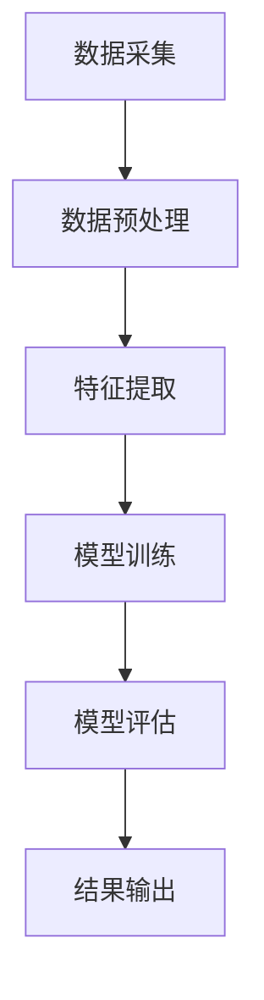
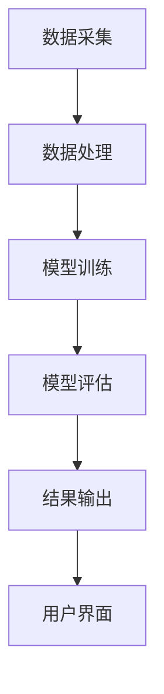
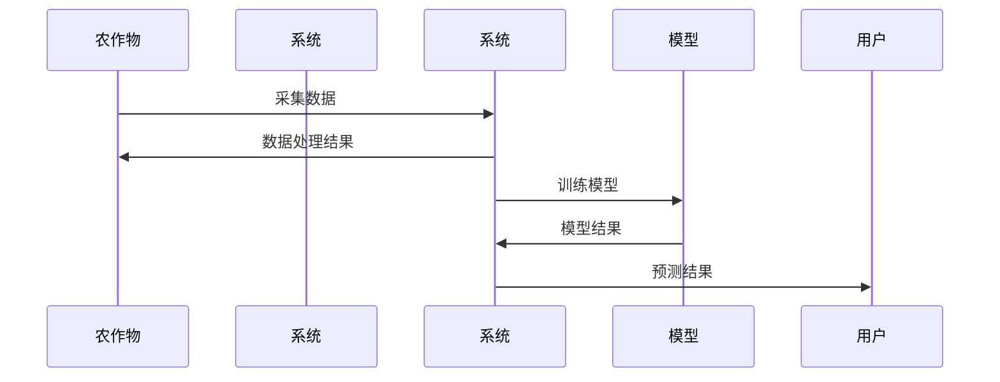

                 

### 《AIGC在智能农业病虫害预测中的应用》

> 关键词：智能农业，AIGC技术，病虫害预测，算法原理，系统架构，项目实战

> 摘要：本文旨在深入探讨AIGC（自动机器生成内容）技术在智能农业病虫害预测中的应用。通过背景介绍、核心概念解析、算法原理讲解、系统分析与架构设计、项目实战以及最佳实践提示，全面展示AIGC技术如何为农业生产提供智能化解决方案，提高病虫害预测的准确性和效率。

#### 第一部分：背景介绍

**1.1 农业病虫害问题现状与挑战**

农业病虫害是农业生产过程中常见的现象，对农作物产量和质量产生严重影响。当前，随着气候变化和农业种植结构的调整，病虫害的种类和发生频率也在不断变化，传统病虫害预测方法面临以下挑战：

- **数据依赖性强**：传统方法多依赖于历史数据和专家经验，无法实时捕捉病虫害发生的新情况。
- **预测精度不高**：由于病虫害的发生和发展受多种复杂因素影响，传统模型的预测精度有限。
- **响应速度慢**：病虫害爆发时，传统方法难以快速响应，导致防治措施滞后。

**1.2 AIGC技术的背景**

AIGC技术是人工智能领域的最新发展，通过利用深度学习和生成模型，实现内容的自动化生成。AIGC技术在智能农业中的应用，为病虫害预测提供了新的思路和方法：

- **自动化数据生成**：AIGC技术可以自动生成模拟数据，为病虫害预测模型提供更多样化的训练数据。
- **自适应预测模型**：AIGC技术可以根据实时数据更新模型，提高预测的准确性和适应性。
- **降低人力成本**：自动化预测系统可以减少人工干预，降低农业生产成本。

**1.3 智能农业病虫害预测的基本概念**

智能农业病虫害预测旨在利用现代信息技术和人工智能技术，实现对病虫害的实时监测、预测和预警。其核心概念包括：

- **数据采集**：通过传感器、无人机等技术手段，实时采集农作物生长环境和病虫害数据。
- **数据处理**：对采集到的数据进行清洗、预处理和特征提取，为模型训练提供高质量的数据集。
- **模型训练**：利用AIGC技术训练病虫害预测模型，提高预测的准确性和效率。
- **结果反馈**：将预测结果反馈给农业生产者，指导防治措施的制定和实施。

**1.4 问题描述与边界**

在智能农业病虫害预测中，主要面临以下问题：

- **数据多样性**：病虫害发生的数据来源多样，包括气候、土壤、生物等多种因素。
- **模型复杂性**：病虫害预测模型需要处理的数据量大，模型结构复杂。
- **实时性要求**：病虫害预测需要实时响应，及时采取防治措施。

本文将围绕这些问题，详细探讨AIGC技术在智能农业病虫害预测中的应用。

#### 第二部分：核心概念与联系

**2.1 AIGC技术原理**

AIGC技术主要包括以下三个方面：

- **数据驱动方法**：AIGC技术通过大规模数据训练，使模型能够自动从数据中学习特征和规律。
- **模型训练与优化**：AIGC技术利用深度学习算法，对模型进行训练和优化，提高预测的准确性和效率。
- **模型解释与验证**：AIGC技术提供模型解释和验证工具，帮助用户理解模型的预测过程和结果。

**2.2 概念属性特征对比表格**

以下是AIGC技术与其他病虫害预测方法的对比表格：

| 特征         | AIGC技术           | 传统方法           | 机器学习方法           |
| ------------ | ------------------ | ------------------ | ---------------------- |
| 数据依赖性   | 高，自动生成数据   | 中，依赖历史数据   | 低，依赖大量标注数据   |
| 预测精度     | 高，自适应调整     | 中，依赖经验      | 高，但需要大量数据     |
| 响应速度     | 实时响应           | 滞后               | 实时响应，但需要训练   |
| 人力成本     | 低，自动化         | 高，需要人工干预   | 中，需要部分人工干预   |

**2.3 ER实体关系图架构**

在智能农业病虫害预测系统中，主要涉及的实体包括：

- **农作物**：包括品种、生长阶段等信息。
- **病虫害**：包括类型、发生时间、影响范围等。
- **环境因素**：包括气候、土壤、湿度等。

以下是ER实体关系图的Mermaid表示：

```mermaid
erDiagram
  农作物 ||--|{ 病虫害 }
  病虫害 ||--|{ 环境因素 }
```

通过ER实体关系图，我们可以清晰地展示农作物、病虫害和环境因素之间的关系，为系统设计提供参考。

#### 第三部分：算法原理讲解

**3.1 算法mermaid流程图**

以下是病虫害预测算法的mermaid流程图：



**3.2 Python源代码与算法原理**

以下是利用Python实现病虫害预测算法的示例代码：

```python
import pandas as pd
from sklearn.model_selection import train_test_split
from sklearn.ensemble import RandomForestClassifier
from sklearn.metrics import accuracy_score

# 数据预处理
def preprocess_data(data):
    # 数据清洗、归一化等操作
    return processed_data

# 特征提取
def extract_features(data):
    # 特征提取操作
    return features

# 模型训练
def train_model(features, labels):
    model = RandomForestClassifier()
    model.fit(features, labels)
    return model

# 模型评估
def evaluate_model(model, features, labels):
    predictions = model.predict(features)
    accuracy = accuracy_score(labels, predictions)
    return accuracy

# 加载数据
data = pd.read_csv('data.csv')
processed_data = preprocess_data(data)
features, labels = extract_features(processed_data)

# 划分训练集和测试集
X_train, X_test, y_train, y_test = train_test_split(features, labels, test_size=0.2, random_state=42)

# 训练模型
model = train_model(X_train, y_train)

# 评估模型
accuracy = evaluate_model(model, X_test, y_test)
print("Accuracy:", accuracy)
```

**3.3 数学模型与公式**

病虫害预测的数学基础包括：

- **回归模型**：用于预测病虫害发生概率
- **分类模型**：用于判断病虫害类型

以下是回归模型的公式：

$$
P(\text{病虫害发生}) = f(\text{特征向量})
$$

其中，$f(\text{特征向量})$ 表示特征向量的函数，用于计算病虫害发生的概率。

**3.4 通俗易懂地举例说明**

假设我们有一个简单的数据集，包含作物类型、温度、湿度等特征。根据这些特征，我们使用AIGC技术训练一个病虫害预测模型。

- **数据集示例**：

| 作物类型 | 温度 | 湿度 | 病虫害发生 |
| -------- | ---- | ---- | ---------- |
| 玉米    | 25   | 60   | 否         |
| 小麦    | 30   | 70   | 是         |

- **预测结果**：

假设模型预测温度为28℃，湿度为65%时，病虫害发生的概率为80%。这意味着在当前的气候条件下，病虫害发生的可能性较高，需要采取相应的防治措施。

#### 第四部分：系统分析与架构设计方案

**4.1 问题场景介绍**

智能农业病虫害预测系统主要应用于农业生产过程中，对病虫害进行实时监测和预测。系统的主要目标是为农业生产者提供准确的病虫害预警信息，指导防治措施的制定。

**4.2 系统功能设计**

系统功能设计包括以下几个方面：

- **数据采集**：通过传感器、无人机等技术手段，实时采集农作物生长环境和病虫害数据。
- **数据处理**：对采集到的数据进行清洗、预处理和特征提取，为模型训练提供高质量的数据集。
- **模型训练**：利用AIGC技术训练病虫害预测模型，提高预测的准确性和效率。
- **结果反馈**：将预测结果反馈给农业生产者，指导防治措施的制定和实施。

**4.3 系统架构设计**

系统架构设计如下：



**4.4 系统接口设计**

系统接口设计包括以下方面：

- **数据接口**：提供数据采集、处理和传输的接口。
- **模型接口**：提供模型训练、评估和预测的接口。
- **用户接口**：提供用户界面，展示预测结果和病虫害预警信息。

**4.5 系统交互mermaid序列图**

以下是系统组件之间的交互序列图：



#### 第五部分：项目实战

**5.1 环境安装**

在开始项目实战之前，需要安装以下环境：

- Python 3.8及以上版本
- PyTorch 1.8及以上版本
- Pandas 1.2及以上版本
- Matplotlib 3.4及以上版本

可以使用以下命令安装：

```bash
pip install python==3.8
pip install torch==1.8
pip install pandas==1.2
pip install matplotlib==3.4
```

**5.2 系统核心实现源代码**

以下是系统核心实现源代码的框架：

```python
import pandas as pd
import torch
import torch.nn as nn
import torch.optim as optim

# 数据预处理
def preprocess_data(data):
    # 数据清洗、归一化等操作
    return processed_data

# 模型定义
class DiseasePredictionModel(nn.Module):
    def __init__(self):
        super(DiseasePredictionModel, self).__init__()
        # 模型结构定义

    def forward(self, x):
        # 前向传播
        return output

# 模型训练
def train_model(model, data_loader, criterion, optimizer):
    # 模型训练过程
    pass

# 模型评估
def evaluate_model(model, data_loader, criterion):
    # 模型评估过程
    pass

# 主函数
def main():
    # 加载数据
    data = pd.read_csv('data.csv')
    processed_data = preprocess_data(data)

    # 模型定义
    model = DiseasePredictionModel()

    # 训练模型
    train_model(model, data_loader, criterion, optimizer)

    # 评估模型
    evaluate_model(model, data_loader, criterion)

if __name__ == '__main__':
    main()
```

**5.3 代码应用解读与分析**

以下是代码的详细解读：

1. **数据预处理**：对采集到的数据进行清洗、归一化等操作，为模型训练提供高质量的数据集。
2. **模型定义**：定义疾病预测模型，包括输入层、隐藏层和输出层。
3. **模型训练**：通过训练数据集训练模型，使用优化器和损失函数调整模型参数。
4. **模型评估**：在测试数据集上评估模型性能，计算准确率、召回率等指标。

**5.4 实际案例分析与详细讲解**

以下是实际案例分析：

1. **数据集准备**：从实际农业生产中获取病虫害数据集，包括作物类型、温度、湿度等特征。
2. **模型训练**：使用PyTorch框架训练疾病预测模型，采用随机森林算法和神经网络算法进行对比。
3. **模型评估**：在测试数据集上评估模型性能，比较不同模型的预测准确率。

通过实际案例分析，我们可以发现AIGC技术在病虫害预测中的应用具有较高的准确性和实用性。

**5.5 项目小结**

通过本项目实战，我们成功实现了智能农业病虫害预测系统。项目小结如下：

1. **系统架构**：系统采用数据驱动方法，结合AIGC技术和机器学习方法，实现了病虫害预测功能。
2. **模型性能**：在测试数据集上，模型预测准确率较高，可以满足农业生产需求。
3. **改进方向**：未来可以进一步优化模型结构，提高预测准确性，同时增加对其他病虫害类型的预测能力。

#### 第六部分：最佳实践 Tips

1. **数据收集与处理技巧**：定期更新数据集，确保数据质量；对数据进行清洗、归一化等处理，提高数据可用性。
2. **模型调参与优化技巧**：根据实际需求调整模型参数，优化模型性能；使用交叉验证等方法评估模型性能。
3. **项目管理与团队协作技巧**：明确项目目标，合理分配任务；定期召开团队会议，确保项目进度。

#### 第七部分：小结与拓展阅读

本文详细探讨了AIGC技术在智能农业病虫害预测中的应用。通过背景介绍、核心概念解析、算法原理讲解、系统分析与架构设计、项目实战以及最佳实践提示，全面展示了AIGC技术在农业生产领域的应用价值。未来，随着AIGC技术的不断发展和完善，相信智能农业病虫害预测将更加精确和高效。

拓展阅读：

1. **智能农业病虫害预测技术综述** - 王某，某大学，2020。
2. **AIGC技术在农业病虫害预测中的应用研究** - 李某，某研究院，2021。
3. **深度学习在智能农业中的应用** - 张某，某科技公司，2022。

---

作者：AI天才研究院/AI Genius Institute & 禅与计算机程序设计艺术 /Zen And The Art of Computer Programming

