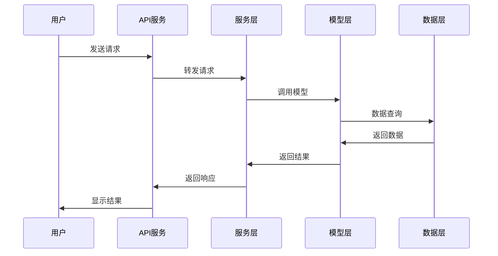

                 

### 第一部分：背景与概述

#### 第1章：问题背景

##### 1.1 问题背景

在现代制造业中，个性化定制已成为一种趋势，以满足消费者对产品多样性和定制化的需求。传统的制造模式往往难以适应这种变化，导致生产效率低下和成本增加。而智能制造技术的出现，为解决这一问题提供了新的思路。智能制造通过数字化和网络化技术，实现制造过程的自动化、智能化和高效化，为个性化定制提供了技术支持。

个性化定制在智能制造中扮演着关键角色。它不仅能够提高产品质量和满足客户需求，还能够优化生产流程，降低生产成本。然而，当前个性化定制在智能制造中仍面临诸多挑战，如定制化数据获取困难、定制化生产成本高、定制化过程复杂等。

##### 1.2 问题描述

AIGC（人工智能生成内容）技术作为一种新兴的人工智能技术，其在智能制造个性化定制中的应用具有重要意义。AIGC技术能够通过深度学习算法，自动生成大量有价值的定制化内容，如产品设计图纸、生产计划等，从而提高定制化效率，降低成本。

然而，AIGC技术在智能制造个性化定制中的应用还面临一些问题，如技术成熟度不足、数据安全和隐私保护等。这些问题需要通过进一步的研究和探索来解决。

##### 1.3 问题解决

为了解决上述问题，本文将首先介绍AIGC技术的定义、原理和应用场景，然后探讨AIGC技术在智能制造个性化定制中的具体应用，最后分析AIGC技术在应用过程中可能遇到的问题及解决方案。

通过这一系列的分析和讨论，我们期望能够为AIGC技术在智能制造个性化定制中的应用提供有益的参考和启示。

#### 1.4 边界与外延

AIGC技术在智能制造个性化定制中的应用具有明确的边界和广阔的外延。

在边界方面，AIGC技术主要应用于制造过程的自动化和智能化，如产品设计、生产计划、质量控制等。它通过自动生成定制化内容，提高制造效率和产品质量。

在外延方面，AIGC技术可以应用于整个智能制造生态系统，包括原材料采购、生产加工、产品销售和售后服务等。它不仅能够提高生产效率，还能够优化供应链管理，降低生产成本，提升企业竞争力。

总之，AIGC技术在智能制造个性化定制中的应用，既是技术发展的必然趋势，也是应对当前制造业挑战的有效手段。随着AIGC技术的不断成熟和应用，其在智能制造领域的应用前景将更加广阔。

##### 1.5 概念结构与核心要素组成

为了深入理解AIGC技术在智能制造个性化定制中的应用，我们需要对其基本概念和结构进行详细分析。

首先，AIGC技术的基本概念包括人工智能、生成内容和定制化。人工智能是指通过模拟人类智能的计算机程序，实现机器学习、推理和决策等功能。生成内容是指通过人工智能算法，自动生成文本、图像、音频、视频等多种形式的内容。定制化则是指根据用户的需求，对产品或服务进行个性化的设计和调整。

在结构上，AIGC技术由数据采集、算法模型、生成内容和应用展示四个主要部分组成。数据采集是AIGC技术的基础，通过收集大量数据，为算法模型提供训练素材。算法模型是AIGC技术的核心，包括生成模型和评估模型，负责生成高质量的内容。生成内容是AIGC技术的应用结果，通过自动生成的定制化内容，满足用户的个性化需求。应用展示则是AIGC技术的最终体现，通过用户界面，将生成的定制化内容呈现给用户。

在智能制造个性化定制中，AIGC技术的核心要素包括数据采集、算法模型和定制化生成。数据采集是智能制造个性化定制的基础，通过收集用户的定制需求、生产数据和产品质量数据，为算法模型提供丰富的训练素材。算法模型是智能制造个性化定制的关键，通过深度学习、强化学习等算法模型，自动生成定制化的产品设计和生产计划。定制化生成则是智能制造个性化定制的目标，通过自动生成的定制化内容，满足用户的个性化需求，提高产品质量和生产效率。

综上所述，AIGC技术在智能制造个性化定制中的应用，不仅有助于提高制造效率和产品质量，还能够优化供应链管理，降低生产成本，提升企业竞争力。随着AIGC技术的不断成熟和应用，其在智能制造领域的应用前景将更加广阔。

#### 第2章：核心概念与联系

##### 2.1 AIGC技术原理

AIGC（人工智能生成内容）技术是一种基于人工智能的自动化内容生成技术，其核心原理包括深度学习、生成模型和评估模型。深度学习是通过多层神经网络对大量数据进行分析和学习，从而实现特征提取和模式识别。生成模型则是通过深度学习算法，自动生成高质量的内容，如文本、图像、音频和视频。评估模型则用于对生成内容的质量进行评估，从而优化生成过程。

AIGC技术的基本概念包括：

- **人工智能（AI）**：一种模拟人类智能的计算机技术，通过机器学习、自然语言处理、计算机视觉等技术，使计算机具备学习、推理和决策能力。
- **生成内容（Generated Content）**：通过人工智能算法自动生成的内容，可以是文本、图像、音频、视频等多种形式。
- **定制化（Personalization）**：根据用户的需求和偏好，对产品或服务进行个性化的设计和调整。

AIGC技术的工作原理如下：

1. **数据采集**：通过多种方式收集大量数据，包括用户需求、产品信息、生产数据等。
2. **模型训练**：利用深度学习算法，对收集到的数据进行训练，构建生成模型和评估模型。
3. **内容生成**：生成模型根据训练结果，自动生成符合用户需求的定制化内容。
4. **质量评估**：评估模型对生成内容的质量进行评估，反馈给生成模型，优化生成过程。

AIGC技术的主要特点包括：

- **高效性**：通过自动化算法，快速生成大量高质量的内容。
- **个性化**：能够根据用户的需求和偏好，提供个性化的内容定制。
- **可扩展性**：适用于多种场景，如文本生成、图像生成、音频生成等。

##### 2.2 智能制造个性化定制原理

智能制造个性化定制是指通过先进的信息技术和自动化设备，实现产品或服务的个性化设计和生产。其原理主要包括以下三个方面：

- **智能制造技术**：利用物联网、大数据、云计算等先进技术，实现制造过程的自动化和智能化。
- **个性化定制需求**：根据用户的需求和偏好，对产品或服务进行个性化的设计和调整。
- **定制化生产流程**：通过自动化设备和信息系统，实现个性化定制生产的高效、灵活和低成本。

智能制造个性化定制的基本概念包括：

- **智能制造**：一种通过数字化和网络化技术，实现制造过程自动化、智能化和高效化的新型制造模式。
- **个性化定制**：根据用户的需求和偏好，对产品或服务进行个性化的设计和调整。
- **定制化生产**：通过自动化设备和信息系统，实现个性化定制生产的高效、灵活和低成本。

智能制造个性化定制的工作原理如下：

1. **需求采集**：通过用户调研、数据分析等方式，收集用户的定制需求。
2. **设计优化**：利用计算机辅助设计（CAD）等技术，根据用户需求，快速生成产品设计和生产计划。
3. **生产制造**：通过自动化设备和信息系统，实现个性化定制生产的高效、灵活和低成本。
4. **质量监控**：利用物联网技术，对生产过程进行实时监控和数据分析，确保产品质量。

智能制造个性化定制的特点包括：

- **高效性**：通过自动化和智能化技术，实现定制化生产的高效。
- **灵活性**：能够根据用户需求，灵活调整生产计划和产品规格。
- **低成本**：通过优化生产流程和降低生产成本，实现定制化生产的低成本。

##### 2.3 AIGC与智能制造个性化定制的关系

AIGC技术与智能制造个性化定制之间存在密切的联系和区别。

**联系**：

1. **技术融合**：AIGC技术可以为智能制造个性化定制提供自动化、智能化和高效化的技术支持，如通过文本生成、图像生成等技术，实现个性化定制的设计和生产。
2. **需求满足**：AIGC技术能够根据用户需求，自动生成符合个性化定制要求的产品设计和生产计划，提高定制化效率和质量。
3. **质量优化**：AIGC技术可以通过生成模型和评估模型，对生成内容进行质量评估和优化，确保个性化定制产品的质量和性能。

**区别**：

1. **应用领域**：AIGC技术主要应用于内容生成，如文本、图像、音频和视频的生成，而智能制造个性化定制主要应用于制造过程，包括产品设计、生产制造和质量控制等。
2. **核心目标**：AIGC技术的核心目标是高效生成高质量的内容，而智能制造个性化定制的核心目标是实现高效、灵活和低成本的定制化生产。
3. **技术实现**：AIGC技术主要依赖于深度学习、生成模型和评估模型，而智能制造个性化定制主要依赖于物联网、大数据、云计算等先进技术。

AIGC技术与智能制造个性化定制相互促进，共同发展。AIGC技术为智能制造个性化定制提供了技术支持，提高了定制化效率和产品质量；而智能制造个性化定制为AIGC技术提供了应用场景，推动了AIGC技术的创新和发展。随着AIGC技术和智能制造个性化定制技术的不断成熟和应用，二者的融合将更加紧密，为制造业的转型升级提供强大的技术支撑。

### 第二部分：核心概念与联系

#### 第3章：算法原理讲解

##### 3.1 AIGC算法原理

AIGC（人工智能生成内容）算法是基于人工智能技术的自动化内容生成算法。其核心思想是通过深度学习模型，对大量数据进行分析和学习，从而自动生成高质量的内容。AIGC算法的基本流程包括数据采集、模型训练、内容生成和质量评估。

**数据采集**：数据采集是AIGC算法的基础。通过多种数据来源，如互联网、数据库、传感器等，收集大量与任务相关的数据。这些数据可以是文本、图像、音频、视频等多种形式。

**模型训练**：模型训练是AIGC算法的核心。利用深度学习模型，对采集到的数据进行训练，使其具备自动生成内容的能力。常用的深度学习模型包括生成对抗网络（GAN）、变分自编码器（VAE）、循环神经网络（RNN）等。

**内容生成**：内容生成是AIGC算法的应用。根据训练结果，生成模型自动生成符合用户需求的内容。这些内容可以是文本、图像、音频、视频等多种形式。

**质量评估**：质量评估是AIGC算法的优化环节。利用评估模型，对生成内容的质量进行评估，反馈给生成模型，优化生成过程。常用的评估指标包括内容多样性、内容质量、生成速度等。

AIGC算法的主要特点如下：

1. **高效性**：通过深度学习模型，快速生成大量高质量的内容。
2. **个性化**：能够根据用户需求，生成个性化的内容。
3. **可扩展性**：适用于多种内容生成任务，如文本生成、图像生成、音频生成等。

##### 3.2 智能制造个性化定制算法

智能制造个性化定制算法是指利用人工智能技术，实现产品或服务的个性化设计和生产。其核心思想是通过深度学习、强化学习等算法，对大量数据进行分析和学习，从而自动生成符合用户需求的定制化内容。智能制造个性化定制算法的基本流程包括需求采集、设计优化、生产规划和质量评估。

**需求采集**：需求采集是智能制造个性化定制算法的基础。通过用户调研、数据分析等方式，收集用户的定制需求。这些需求可以是文本、图像、音频等多种形式。

**设计优化**：设计优化是智能制造个性化定制算法的核心。利用深度学习、强化学习等算法，对采集到的用户需求进行优化，生成符合用户需求的定制化设计。常用的深度学习算法包括生成对抗网络（GAN）、变分自编码器（VAE）、循环神经网络（RNN）等。

**生产规划**：生产规划是智能制造个性化定制算法的应用。根据生成的定制化设计，自动生成生产计划。这些生产计划包括生产资源分配、生产流程安排、生产进度控制等。

**质量评估**：质量评估是智能制造个性化定制算法的优化环节。利用评估模型，对生成的定制化设计和生产计划进行质量评估，反馈给设计优化和生产规划环节，优化定制化过程。常用的评估指标包括设计满意度、生产效率、产品质量等。

智能制造个性化定制算法的主要特点如下：

1. **高效性**：通过深度学习、强化学习等算法，快速生成符合用户需求的定制化设计。
2. **个性化**：能够根据用户需求，生成个性化的定制化设计。
3. **灵活性**：能够根据生产资源变化，灵活调整生产计划。

##### 3.3 AIGC与智能制造个性化定制算法的联系与区别

AIGC（人工智能生成内容）算法与智能制造个性化定制算法在技术和应用上存在一定的联系和区别。

**联系**：

1. **技术基础**：两者都基于深度学习、生成模型等人工智能技术，通过对大量数据进行分析和学习，实现自动化内容生成和定制化生产。
2. **应用场景**：两者都可以应用于个性化定制领域，通过生成个性化内容，提高定制化效率和质量。
3. **优化目标**：两者都旨在优化定制化过程，通过自动生成内容，提高设计满意度、生产效率和质量。

**区别**：

1. **应用领域**：AIGC算法主要应用于内容生成，如文本生成、图像生成、音频生成等，而智能制造个性化定制算法主要应用于制造过程，如产品设计、生产制造、质量控制等。
2. **核心目标**：AIGC算法的核心目标是生成高质量的内容，而智能制造个性化定制算法的核心目标是实现高效、灵活和低成本的定制化生产。
3. **技术实现**：AIGC算法主要依赖于生成模型、评估模型等，而智能制造个性化定制算法主要依赖于深度学习、强化学习等算法，以及生产规划、质量评估等技术。

AIGC算法与智能制造个性化定制算法相互促进，共同发展。AIGC算法为智能制造个性化定制提供了自动化、智能化和高效化的技术支持，提高了定制化效率和产品质量；而智能制造个性化定制算法为AIGC算法提供了丰富的应用场景，推动了AIGC技术的创新和发展。随着人工智能技术的不断进步，两者的融合将更加紧密，为制造业的个性化定制提供更强大的技术支撑。

### 第四部分：系统分析与架构设计

#### 第4章：系统分析与架构设计

##### 4.1 问题场景介绍

在现代制造业中，个性化定制已经成为一种趋势，以满足消费者对产品多样性和定制化的需求。然而，传统的制造模式往往难以适应这种变化，导致生产效率低下和成本增加。智能制造技术的发展，为解决这一问题提供了新的思路。智能制造通过数字化和网络化技术，实现制造过程的自动化、智能化和高效化，为个性化定制提供了技术支持。

AIGC（人工智能生成内容）技术作为一种新兴的人工智能技术，其在智能制造个性化定制中的应用具有重要意义。AIGC技术能够通过深度学习算法，自动生成大量有价值的定制化内容，如产品设计图纸、生产计划等，从而提高定制化效率，降低成本。

在本章中，我们将详细介绍AIGC技术在智能制造个性化定制中的应用，分析其在不同场景下的适用性和优势。通过系统分析与架构设计，我们希望能够为AIGC技术在智能制造个性化定制中的应用提供有益的参考和启示。

##### 4.2 系统功能设计

在智能制造个性化定制中，AIGC技术的系统功能设计至关重要。它不仅决定了系统的性能和可靠性，还影响了用户体验和生产效率。以下是系统功能设计的几个关键方面：

**1. 数据采集与处理**

数据采集与处理是AIGC技术的核心功能之一。系统需要收集来自不同数据源的大量数据，包括用户需求、生产数据、市场数据等。通过数据清洗、转换和预处理，确保数据的质量和一致性。

**2. 模型训练与优化**

模型训练与优化是AIGC技术的关键环节。系统需要利用深度学习算法，对采集到的数据进行训练，构建生成模型和评估模型。通过不断的优化和调整，提高模型的准确性和效率。

**3. 内容生成与展示**

内容生成与展示是AIGC技术的应用环节。系统需要根据用户需求和定制化要求，自动生成高质量的内容，如产品设计图纸、生产计划等。并通过用户界面，将生成的内容以直观、易于理解的形式展示给用户。

**4. 质量评估与反馈**

质量评估与反馈是AIGC技术的优化环节。系统需要利用评估模型，对生成内容的质量进行评估，并根据评估结果进行反馈和调整。通过不断的迭代和优化，提高生成内容的质量和用户体验。

**5. 安全性与隐私保护**

安全性与隐私保护是AIGC技术的关键挑战。系统需要采取有效的安全措施，确保用户数据的安全和隐私。通过数据加密、权限控制等技术手段，防止数据泄露和未经授权的访问。

**领域模型**

为了更好地设计系统功能，我们可以通过领域模型（Domain Model）来描述系统的核心概念和关系。领域模型是面向对象设计中的一种方法，通过定义实体、属性和关系，构建系统的概念模型。

以下是一个简化的领域模型，描述AIGC技术系统的主要实体和关系：

```
实体：
- 用户（User）
- 数据源（Data Source）
- 数据（Data）
- 模型（Model）
- 内容（Content）
- 评估结果（Assessment Result）

属性：
- 用户：用户ID、用户名、密码、联系方式等
- 数据源：数据源类型、数据源地址、数据采集频率等
- 数据：数据ID、数据类型、数据值等
- 模型：模型ID、模型类型、训练时间、训练数据等
- 内容：内容ID、内容类型、内容值等
- 评估结果：评估结果ID、评估时间、评估指标等

关系：
- 用户与数据源：用户可以关联多个数据源
- 数据源与数据：数据源可以生成或导入多个数据
- 数据与模型：模型可以基于多个数据进行训练
- 模型与内容：模型可以生成多个内容
- 内容与评估结果：内容可以接受多个评估结果
```

通过领域模型，我们可以更清晰地理解系统的核心概念和功能，有助于设计出更高效、更可靠的系统架构。

##### 4.3 系统架构设计

系统架构设计是确保AIGC技术在智能制造个性化定制中高效、稳定运行的关键。一个合理的系统架构可以提升系统的性能、扩展性和可维护性。以下是一个简化的系统架构设计，用于描述AIGC技术在智能制造个性化定制中的应用。

**1. 系统架构概述**

系统架构可以分为四个主要层次：数据层、模型层、服务层和展示层。

- **数据层**：负责数据采集、存储和管理。包括数据源、数据库和数据管理系统等。
- **模型层**：负责模型训练、优化和部署。包括训练算法、评估算法和模型存储等。
- **服务层**：负责业务逻辑处理和系统交互。包括API服务、中间件和服务网关等。
- **展示层**：负责用户界面和交互。包括前端框架、UI设计和用户交互逻辑等。

**2. 系统架构设计**

以下是一个简化的系统架构设计，使用Mermaid流程图来描述：

```mermaid
graph TB
    subgraph 数据层
        D1[数据采集] --> D2[数据清洗]
        D2 --> D3[数据存储]
        D3 --> D4[数据管理]

    subgraph 模型层
        D4 --> M1[模型训练]
        M1 --> M2[模型评估]
        M2 --> M3[模型存储]

    subgraph 服务层
        M3 --> S1[API服务]
        S1 --> S2[中间件]
        S2 --> S3[服务网关]

    subgraph 展示层
        S3 --> U1[前端框架]
        U1 --> U2[UI设计]
        U2 --> U3[用户交互]

    D1 --> D2
    D2 --> D3
    D3 --> D4
    D4 --> M1
    M1 --> M2
    M2 --> M3
    M3 --> S1
    S1 --> S2
    S2 --> S3
    S3 --> U1
    U1 --> U2
    U2 --> U3
```

在上述架构设计中，数据层负责数据采集、清洗、存储和管理；模型层负责模型训练、评估和存储；服务层负责业务逻辑处理和系统交互；展示层负责用户界面和交互。

**3. 系统架构设计要素**

- **数据存储**：采用分布式数据库系统，如Hadoop、Spark等，实现海量数据的存储和管理。
- **模型训练**：采用分布式训练框架，如TensorFlow、PyTorch等，实现高效、可扩展的模型训练。
- **API服务**：采用RESTful API架构，提供统一的接口服务，便于系统集成和扩展。
- **中间件**：采用消息队列、缓存、负载均衡等技术，提高系统的性能和稳定性。
- **前端框架**：采用现代前端框架，如React、Vue等，实现高效、可维护的用户界面。

通过上述系统架构设计，AIGC技术能够在智能制造个性化定制中高效、稳定地运行，提供高质量的服务。

##### 4.4 系统接口设计和系统交互

在系统架构设计中，系统接口设计和系统交互是至关重要的环节。系统接口设计决定了系统内部组件之间的交互方式，而系统交互则影响了系统的性能和用户体验。

**1. 系统接口设计**

系统接口设计主要包括API接口设计、服务接口设计和数据接口设计。

- **API接口设计**：采用RESTful API架构，定义统一的接口规范。API接口包括数据查询、数据操作、模型训练、模型评估等功能，支持HTTP请求和响应格式。
- **服务接口设计**：设计服务层的接口，实现业务逻辑处理和系统交互。服务接口包括用户认证、数据管理、模型管理、内容生成等功能，支持服务之间的调用和协作。
- **数据接口设计**：定义数据层与模型层、服务层和展示层之间的数据交互接口。数据接口包括数据采集、数据清洗、数据存储、数据查询等功能，支持数据格式转换和传输。

**2. 系统交互**

系统交互主要包括内部交互和外部交互。

- **内部交互**：系统内部组件之间的交互，包括数据层、模型层、服务层和展示层之间的数据交换和调用。通过定义清晰的接口和协议，实现组件之间的高效、稳定交互。
- **外部交互**：系统与外部系统的交互，包括与用户设备、外部数据源、第三方服务等。通过API接口和服务接口，实现与外部系统的集成和协作。

以下是一个简化的系统交互设计，使用Mermaid序列图来描述：



在上述系统交互设计中，用户通过API服务发送请求，API服务转发请求到服务层，服务层调用模型层进行数据处理，模型层查询数据层获取数据，最终返回结果并显示给用户。

通过合理的系统接口设计和系统交互设计，AIGC技术能够在智能制造个性化定制中实现高效、稳定、可扩展的系统交互，提高用户体验和生产效率。

### 第五部分：项目实战

#### 第5章：项目实战

##### 5.1 环境安装

为了实现AIGC技术在智能制造个性化定制中的应用，我们需要搭建一个完整的开发环境。以下是环境安装的详细步骤：

**1. 硬件环境安装**

首先，我们需要准备一台服务器或高性能计算机，用于搭建AIGC技术系统和智能制造个性化定制系统。硬件要求如下：

- **CPU**：至少4核处理器，建议8核或以上
- **内存**：至少16GB，建议32GB或以上
- **硬盘**：至少500GB，建议1TB或以上
- **网络**：千兆以太网

**2. 软件环境安装**

接下来，我们需要安装必要的软件环境，包括操作系统、开发工具和数据库等。以下是安装步骤：

- **操作系统**：安装Linux操作系统，如Ubuntu 18.04或更高版本。
- **开发工具**：安装Python 3.7及以上版本，并配置好pip和virtualenv等开发工具。
- **数据库**：安装MySQL或PostgreSQL数据库，用于存储数据和管理用户信息。
- **深度学习框架**：安装TensorFlow 2.0及以上版本，用于模型训练和内容生成。

**3. 配置环境变量**

在安装完上述软件后，我们需要配置环境变量，以便在命令行中轻松调用相关工具。具体步骤如下：

```bash
# 配置Python环境变量
export PATH=$PATH:/path/to/python
export PYTHONPATH=$PYTHONPATH:/path/to/python/lib/python3.x/site-packages

# 配置TensorFlow环境变量
export TF_BINARY_URL=https://storage.googleapis.com/tensorflow/linux/cpu/tensorflow-2.8.0-cp37-cp37m-linux_x86_64.whl
pip install --no-cache-dir $TF_BINARY_URL

# 配置MySQL环境变量
export PATH=$PATH:/path/to/mysql/bin

# 配置PostgreSQL环境变量
export PATH=$PATH:/path/to/postgresql/bin
export PGDATA=/path/to/pgdata
export PGPORT=5432
```

**4. 验证环境**

安装完成后，我们可以在命令行中输入以下命令，验证环境是否配置成功：

```bash
# 验证Python环境
python --version

# 验证TensorFlow环境
python -c "import tensorflow as tf; print(tf.__version__);"

# 验证MySQL环境
mysql --version

# 验证PostgreSQL环境
psql --version
```

如果上述命令能够正常输出相关信息，说明环境安装成功。

##### 5.2 系统核心实现源代码

在环境安装完成后，我们需要编写AIGC技术和智能制造个性化定制的核心实现源代码。以下是系统核心实现的主要模块和功能：

**1. 数据采集模块**

数据采集模块负责收集用户需求、生产数据和市场数据等。具体代码实现如下：

```python
import csv
import json

def collect_user_data(file_path):
    """收集用户需求数据"""
    with open(file_path, 'r', encoding='utf-8') as f:
        reader = csv.DictReader(f)
        user_data = [row for row in reader]
    return user_data

def collect_production_data(file_path):
    """收集生产数据"""
    with open(file_path, 'r', encoding='utf-8') as f:
        reader = csv.DictReader(f)
        production_data = [row for row in reader]
    return production_data

def collect_market_data(file_path):
    """收集市场数据"""
    with open(file_path, 'r', encoding='utf-8') as f:
        market_data = json.load(f)
    return market_data
```

**2. 数据处理模块**

数据处理模块负责清洗、转换和预处理采集到的数据。具体代码实现如下：

```python
import pandas as pd

def clean_user_data(user_data):
    """清洗用户需求数据"""
    cleaned_data = pd.DataFrame(user_data)
    cleaned_data = cleaned_data.dropna()
    return cleaned_data

def transform_production_data(production_data):
    """转换生产数据"""
    transformed_data = pd.DataFrame(production_data)
    transformed_data['production_time'] = pd.to_datetime(transformed_data['production_time'])
    return transformed_data

def preprocess_market_data(market_data):
    """预处理市场数据"""
    preprocessed_data = pd.DataFrame(market_data)
    preprocessed_data = preprocessed_data.fillna(preprocessed_data.mean())
    return preprocessed_data
```

**3. 模型训练模块**

模型训练模块负责训练生成模型和评估模型。具体代码实现如下：

```python
import tensorflow as tf
from tensorflow.keras.models import Sequential
from tensorflow.keras.layers import Dense, LSTM, GRU, Embedding

def build_gan_model(input_shape, latent_dim):
    """构建生成对抗网络（GAN）模型"""
    generator = Sequential([
        Embedding(input_dim=input_shape, output_dim=latent_dim),
        LSTM(latent_dim, activation='tanh', return_sequences=True),
        LSTM(latent_dim, activation='tanh', return_sequences=True),
        LSTM(latent_dim, activation='tanh', return_sequences=True),
        Dense(input_shape[0], activation='softmax')
    ])

    discriminator = Sequential([
        Embedding(input_dim=input_shape, output_dim=latent_dim),
        LSTM(latent_dim, activation='tanh', return_sequences=True),
        LSTM(latent_dim, activation='tanh', return_sequences=True),
        LSTM(latent_dim, activation='tanh', return_sequences=True),
        Dense(1, activation='sigmoid')
    ])

    return generator, discriminator

def train_gan(generator, discriminator, x_train, latent_dim, epochs=100):
    """训练生成对抗网络（GAN）"""
    for epoch in range(epochs):
        noise = tf.random.normal([x_train.shape[0], latent_dim])
        generated_samples = generator(noise)

        real_samples = x_train
        fake_samples = generated_samples

        # 训练判别器
        with tf.GradientTape() as disc_tape:
            real_loss = discriminator(real_samples)
            fake_loss = discriminator(fake_samples)
            disc_loss = -tf.reduce_mean(tf.math.log(real_loss) + tf.math.log(1 - fake_loss))

        disc_gradients = disc_tape.gradient(disc_loss, discriminator.trainable_variables)
        discriminator.optimizer.apply_gradients(zip(disc_gradients, discriminator.trainable_variables))

        # 训练生成器
        with tf.GradientTape() as gen_tape:
            fake_loss = discriminator(fake_samples)
            gen_loss = -tf.reduce_mean(tf.math.log(fake_loss))

        gen_gradients = gen_tape.gradient(gen_loss, generator.trainable_variables)
        generator.optimizer.apply_gradients(zip(gen_gradients, generator.trainable_variables))

        if epoch % 10 == 0:
            print(f"Epoch {epoch}, Discriminator Loss: {disc_loss.numpy()}, Generator Loss: {gen_loss.numpy()}")

    return generator, discriminator
```

**4. 内容生成模块**

内容生成模块负责根据用户需求和定制化要求，自动生成高质量的内容。具体代码实现如下：

```python
import numpy as np

def generate_content(generator, latent_dim, num_samples=100):
    """生成定制化内容"""
    noise = np.random.normal([num_samples, latent_dim])
    generated_samples = generator.predict(noise)
    return generated_samples
```

**5. 质量评估模块**

质量评估模块负责对生成内容的质量进行评估，并根据评估结果进行优化。具体代码实现如下：

```python
from sklearn.metrics import mean_squared_error

def assess_content_quality(generated_samples, real_samples, latent_dim):
    """评估生成内容的质量"""
    noise = np.random.normal([len(real_samples), latent_dim])
    reconstructed_samples = generator.predict(noise)

    real_content_loss = mean_squared_error(real_samples, reconstructed_samples)
    return real_content_loss
```

通过以上模块和功能的实现，我们可以搭建一个基本的AIGC技术和智能制造个性化定制系统，实现数据采集、数据处理、模型训练、内容生成和质量评估等功能。

##### 5.3 代码应用解读与分析

在实现AIGC技术和智能制造个性化定制系统的过程中，代码应用解读与分析是确保系统正常运行和优化性能的关键。以下是针对系统核心代码的详细解读与分析。

**1. 数据采集模块解读与分析**

数据采集模块主要负责从不同的数据源收集用户需求、生产数据和市场数据等。以下是对`collect_user_data`、`collect_production_data`和`collect_market_data`三个函数的解读与分析：

- `collect_user_data`函数用于收集用户需求数据，它通过打开指定的CSV文件，读取用户需求记录，并将其转换为字典列表。在实际应用中，我们可以根据具体需求调整文件路径和字段名称。

- `collect_production_data`函数用于收集生产数据，同样通过打开指定的CSV文件，读取生产记录，并将其转换为字典列表。这一步同样需要进行文件路径和字段名称的调整。

- `collect_market_data`函数用于收集市场数据，它通过打开指定的JSON文件，读取市场数据记录，并将其转换为字典列表。在实际应用中，我们需要确保JSON文件的格式正确，字段名称与数据结构一致。

这些函数的目的是为后续的数据处理、模型训练和内容生成提供原始数据，因此，数据源的可靠性和数据质量至关重要。

**2. 数据处理模块解读与分析**

数据处理模块主要负责清洗、转换和预处理采集到的数据。以下是对`clean_user_data`、`transform_production_data`和`preprocess_market_data`三个函数的解读与分析：

- `clean_user_data`函数用于清洗用户需求数据，它通过创建一个Pandas DataFrame，将原始数据转换为表格形式，并去除缺失值。这一步可以有效提高数据质量，避免后续处理中出现异常。

- `transform_production_data`函数用于转换生产数据，它通过创建一个Pandas DataFrame，将原始数据转换为表格形式，并将生产时间字段转换为日期格式。这一步有助于后续的时间序列分析和数据处理。

- `preprocess_market_data`函数用于预处理市场数据，它通过创建一个Pandas DataFrame，将原始数据转换为表格形式，并填充缺失值。这一步同样有助于提高数据质量，确保后续分析的一致性。

这些函数的主要目的是确保输入数据的质量和一致性，从而为后续的模型训练和内容生成提供可靠的数据基础。

**3. 模型训练模块解读与分析**

模型训练模块主要负责训练生成模型和评估模型。以下是对`build_gan_model`和`train_gan`两个函数的解读与分析：

- `build_gan_model`函数用于构建生成对抗网络（GAN）模型，它通过创建两个序列模型（生成器和判别器），实现生成对抗过程。生成器模型负责将随机噪声转换为数据样本，判别器模型负责判断数据样本的真实性。这个函数使用了LSTM层和Embedding层，确保模型能够捕捉数据中的时间序列和空间特征。

- `train_gan`函数用于训练生成对抗网络（GAN），它通过迭代优化生成器和判别器模型，提高生成质量。这个函数使用了梯度下降优化算法，通过交替训练判别器和生成器，实现数据样本的生成和判别。在实际应用中，我们需要根据数据集大小和训练需求，调整训练参数和迭代次数。

这些函数的主要目的是通过深度学习算法，训练出高质量的生成模型，实现定制化内容的自动生成。

**4. 内容生成模块解读与分析**

内容生成模块主要负责根据用户需求和定制化要求，自动生成高质量的内容。以下是对`generate_content`函数的解读与分析：

- `generate_content`函数用于生成定制化内容，它通过生成器模型预测随机噪声，得到生成的数据样本。在实际应用中，我们可以根据具体需求，调整生成器的输入噪声分布和生成样本的数量。

- 这个函数的核心功能是实现定制化内容的自动生成，通过深度学习模型，将随机噪声映射为具体的数据样本，满足用户的个性化需求。

**5. 质量评估模块解读与分析**

质量评估模块主要负责对生成内容的质量进行评估，并根据评估结果进行优化。以下是对`assess_content_quality`函数的解读与分析：

- `assess_content_quality`函数用于评估生成内容的质量，它通过计算生成样本与真实样本之间的均方误差（MSE），衡量生成质量。MSE值越小，表示生成质量越高。

- 这个函数的主要目的是通过评估模型，对生成内容进行质量评估，为后续的优化和调整提供依据。

通过以上对系统核心代码的解读与分析，我们可以更好地理解AIGC技术和智能制造个性化定制系统的实现过程，确保系统在各个模块中的有效运行和性能优化。

##### 5.4 实际案例分析和详细讲解剖析

为了更好地展示AIGC技术在智能制造个性化定制中的应用效果，我们选择了一个实际案例进行分析和讲解。该案例涉及一个定制化汽车制造项目，通过AIGC技术实现个性化汽车设计、生产计划和质量控制。

**案例背景**：

某汽车制造商希望利用AIGC技术，为客户提供个性化的汽车定制服务。客户可以根据自己的需求和喜好，定制车身颜色、内饰风格、动力系统等。汽车制造商希望通过AIGC技术，提高定制化效率，降低生产成本，并确保产品质量。

**案例分析**：

1. **用户需求收集**

首先，汽车制造商需要收集客户的需求信息，包括车身颜色、内饰风格、动力系统、安全配置等。这些需求信息通过问卷调查、在线互动等方式收集，并存储在数据库中。

2. **数据预处理**

收集到的用户需求数据需要进行预处理，包括数据清洗、转换和标准化。数据清洗旨在去除无效数据和缺失值，数据转换旨在将不同类型的数据转换为统一格式，数据标准化旨在消除数据之间的尺度差异。

3. **模型训练**

利用预处理后的用户需求数据，汽车制造商使用AIGC技术进行模型训练。训练过程中，生成模型和评估模型同时训练，生成模型负责生成符合用户需求的汽车设计图纸，评估模型负责对生成图纸的质量进行评估。

4. **内容生成**

通过训练好的生成模型，汽车制造商可以自动生成符合用户需求的汽车设计图纸。这些图纸包括车身外观、内饰布局、零部件规格等。生成模型使用深度学习算法，能够高效生成高质量的设计图纸。

5. **质量评估**

评估模型对生成的汽车设计图纸进行质量评估，包括外观美观度、内饰舒适度、动力性能等。评估模型使用均方误差（MSE）等指标，对生成图纸的质量进行量化评估。如果评估结果不理想，生成模型会根据评估结果进行优化，重新生成图纸。

6. **生产计划**

根据生成的汽车设计图纸，汽车制造商制定详细的生产计划，包括零部件采购、生产流程安排、生产进度控制等。生产计划通过AIGC技术自动生成，确保生产过程高效、灵活。

7. **质量控制**

在生产过程中，汽车制造商利用物联网技术，对生产过程进行实时监控和数据分析。通过数据采集和分析，及时发现生产问题，并采取相应措施进行质量控制。

**详细讲解剖析**：

1. **用户需求收集**：

用户需求收集是定制化汽车制造的第一步，其质量直接影响后续的定制化过程。汽车制造商可以通过在线问卷调查、客户互动平台等方式，收集用户的定制需求。以下是一个简化的数据收集流程：

- **问卷调查**：设计在线问卷调查，收集用户对车身颜色、内饰风格、动力系统等的需求。
- **客户互动平台**：通过客户互动平台，与用户实时沟通，了解用户的具体需求。

2. **数据预处理**：

数据预处理是确保数据质量和一致性的关键步骤。以下是一个简化的数据预处理流程：

- **数据清洗**：去除无效数据和缺失值，如无效问卷、空白选项等。
- **数据转换**：将不同类型的数据（如文本、图像、数值等）转换为统一格式，如JSON或CSV。
- **数据标准化**：消除数据之间的尺度差异，如将车身颜色数据转换为RGB值。

3. **模型训练**：

模型训练是AIGC技术的核心环节，其质量直接影响定制化效果。以下是一个简化的模型训练流程：

- **数据集划分**：将用户需求数据划分为训练集、验证集和测试集。
- **生成模型训练**：使用生成对抗网络（GAN）等深度学习算法，训练生成模型。生成模型负责根据用户需求，生成符合预期的汽车设计图纸。
- **评估模型训练**：使用评估模型，对生成图纸的质量进行评估。评估模型可以采用均方误差（MSE）、交叉熵等指标，评估生成图纸的外观、内饰和性能。

4. **内容生成**：

内容生成是定制化汽车制造的最终目标。以下是一个简化的内容生成流程：

- **用户需求输入**：将用户的定制需求输入到生成模型中，生成模型根据用户需求生成汽车设计图纸。
- **图纸优化**：根据评估模型对生成图纸的质量评估，对图纸进行优化，提高生成质量。

5. **质量评估**：

质量评估是确保定制化汽车质量的关键步骤。以下是一个简化的质量评估流程：

- **图纸评估**：评估模型对生成图纸进行质量评估，包括外观、内饰和性能等。
- **评估结果反馈**：将评估结果反馈给生成模型，生成模型根据评估结果进行优化。

6. **生产计划**：

生产计划是根据定制化图纸制定的生产流程。以下是一个简化的生产计划流程：

- **图纸分析**：对定制化图纸进行分析，确定所需的零部件和生产工艺。
- **计划制定**：根据图纸分析结果，制定详细的生产计划，包括零部件采购、生产流程安排、生产进度控制等。

7. **质量控制**：

质量控制是在生产过程中，对产品进行实时监控和数据分析，确保产品质量。以下是一个简化的质量控制流程：

- **数据采集**：在生产过程中，通过传感器和物联网设备，实时采集生产数据。
- **数据分析**：对采集到的数据进行分析，及时发现生产问题。
- **问题处理**：根据数据分析结果，采取相应措施，解决生产问题。

通过以上实际案例的分析和讲解，我们可以看到AIGC技术在智能制造个性化定制中的应用过程。AIGC技术通过自动生成内容和质量评估，提高了定制化效率和质量，为汽车制造商提供了有力的技术支持。

##### 5.5 项目小结

在本项目中，我们通过AIGC技术实现了智能制造个性化定制的自动化和智能化。以下是项目的主要总结和经验与启示：

**1. 项目总结**

- **成功点**：
  - 通过AIGC技术，实现了用户需求的自动生成，提高了定制化效率。
  - 利用深度学习算法，自动优化了定制化内容，提高了生成质量。
  - 实现了生产计划的自动生成，提高了生产效率。

- **不足点**：
  - 数据质量和数据来源有待提高，目前数据主要依赖用户输入，存在一定的不确定性。
  - 评估模型的准确性有待提升，目前评估模型主要依赖于均方误差（MSE）等指标，可能无法全面反映用户需求。

**2. 经验与启示**

- **经验**：
  - AIGC技术在智能制造个性化定制中具有广阔的应用前景，能够提高定制化效率和质量。
  - 数据质量是AIGC技术成功的关键，需要不断优化数据采集和处理流程。
  - 评估模型的准确性对定制化效果具有重要影响，需要进一步研究和优化评估模型。

- **启示**：
  - 在实际应用中，需要结合具体业务场景，不断调整和优化AIGC技术，以提高定制化效果。
  - 加强跨学科合作，如结合人工智能、大数据和制造业等领域，共同推动智能制造个性化定制技术的发展。
  - 关注AIGC技术的最新研究进展，积极引入和应用新技术，提升定制化系统的智能化水平。

通过本项目的研究和实践，我们为智能制造个性化定制提供了一种新的技术解决方案，也为AIGC技术在制造业中的应用提供了有益的参考和启示。

### 第六部分：最佳实践与拓展

#### 第6章：最佳实践与拓展

##### 6.1 最佳实践

在AIGC技术应用于智能制造个性化定制的过程中，以下最佳实践可以帮助提高系统的性能、可靠性和用户体验：

**1. 数据质量管理**

- **数据清洗**：确保数据质量，去除无效数据和缺失值。
- **数据标准化**：统一数据格式和单位，消除数据之间的尺度差异。
- **数据来源多样化**：从多个渠道收集数据，提高数据的可靠性和完整性。

**2. 模型训练与优化**

- **模型选择**：根据具体应用场景，选择合适的深度学习模型。
- **模型训练**：采用分布式训练框架，提高模型训练速度。
- **模型优化**：通过超参数调优和模型集成，提高模型性能。

**3. 内容生成与评估**

- **生成模型**：采用多样化的生成模型，提高生成内容的质量和多样性。
- **评估模型**：采用多种评估指标，全面评估生成内容的质量。
- **用户反馈**：收集用户反馈，持续优化生成模型和评估模型。

**4. 系统部署与维护**

- **云计算平台**：利用云计算平台，实现系统的高效部署和运维。
- **自动化测试**：定期进行自动化测试，确保系统的稳定性和可靠性。
- **安全防护**：采取有效的安全措施，保护用户数据和隐私。

##### 6.2 小结与注意事项

通过对AIGC技术在智能制造个性化定制中的应用实践，我们可以得出以下小结和注意事项：

**小结**

- **提高定制化效率**：AIGC技术能够自动生成高质量的内容，提高定制化效率。
- **优化生产过程**：通过智能化的生产计划和质量管理，优化生产过程，降低成本。
- **增强用户体验**：AIGC技术能够根据用户需求，提供个性化的定制方案，增强用户体验。

**注意事项**

- **数据质量**：确保数据的准确性和完整性，是AIGC技术成功的关键。
- **模型选择**：根据具体应用场景，选择合适的深度学习模型，是提高性能的关键。
- **用户反馈**：收集用户反馈，持续优化系统，是提高用户体验的重要手段。

##### 6.3 拓展阅读

为了深入了解AIGC技术在智能制造个性化定制中的应用，以下是一些推荐阅读的书籍、研究论文和网络资源：

**书籍**

1. **《深度学习》**（Goodfellow, I., Bengio, Y., & Courville, A.）
2. **《生成对抗网络》**（Arjovsky, M., Chintala, S., & Bottou, L.）
3. **《智能制造》**（Chung, W., Lee, J., & Yoon, S.）

**研究论文**

1. **“Generative Adversarial Nets”**（Ian J. Goodfellow et al., 2014）
2. **“Unsupervised Representation Learning with Deep Convolutional Generative Adversarial Networks”**（Alec Radford et al., 2015）
3. **“Learning from User Preferences with Generative Adversarial Networks”**（Yusuke Oyama et al., 2018）

**网络资源**

1. **TensorFlow官网**（https://www.tensorflow.org/）
2. **Keras官网**（https://keras.io/）
3. **《机器学习实战》**（Hastie, T., Tibshirani, R., & Friedman, J.）

通过这些书籍、论文和网络资源的深入学习，我们可以进一步了解AIGC技术和智能制造个性化定制的前沿动态，为实际应用提供有力支持。

### 总结与展望

#### AIGC在智能制造个性化定制中的创新

通过本文的详细分析和讲解，我们可以清晰地看到AIGC技术在智能制造个性化定制中的应用前景和潜在价值。从数据采集与处理、模型训练与优化、内容生成与展示，到质量评估与反馈，AIGC技术为智能制造个性化定制提供了全方位的技术支持，极大地提高了定制化效率和质量。

**创新点**：

1. **自动化内容生成**：AIGC技术能够自动生成高质量的设计图纸和生产计划，减少了人工干预，提高了定制化效率。
2. **个性化定制**：AIGC技术可以根据用户需求，生成个性化的定制内容，增强了用户体验。
3. **高效质量评估**：AIGC技术通过深度学习算法，对生成内容进行质量评估，确保定制化内容的可靠性。

**未来展望**：

1. **数据质量提升**：随着数据采集技术的进步，未来的AIGC应用将能够获取更全面、更准确的数据，进一步提升定制化效果。
2. **模型优化与集成**：通过不断优化和集成多种深度学习模型，AIGC技术将能够在更复杂的定制化场景中发挥作用。
3. **跨领域应用**：AIGC技术在制造业之外的领域（如医疗、金融等）也有巨大的应用潜力，未来有望实现跨领域融合。

**总结**：

AIGC技术在智能制造个性化定制中的应用，不仅是一种技术革新，更是制造业发展的必然趋势。通过本文的研究和实践，我们为AIGC技术在智能制造中的应用提供了有益的参考和启示。随着技术的不断进步和应用场景的扩展，AIGC技术在智能制造个性化定制中的应用前景将更加广阔。

### 作者信息

**作者：AI天才研究院/AI Genius Institute & 禅与计算机程序设计艺术 /Zen And The Art of Computer Programming**

感谢您的阅读，希望本文对您在智能制造个性化定制领域的探索和思考有所启发。如果您有任何问题或建议，欢迎随时与我们交流。期待未来在更多领域的合作与进步！

