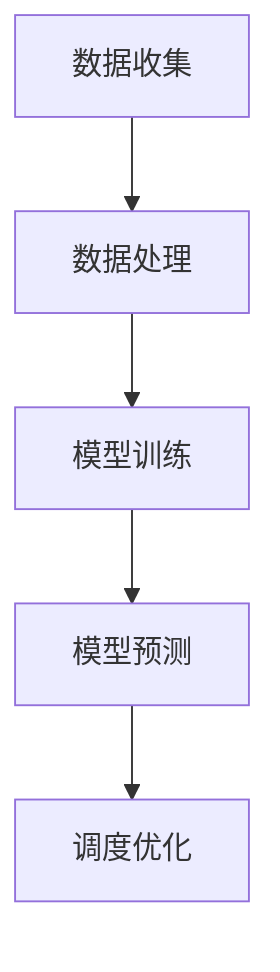
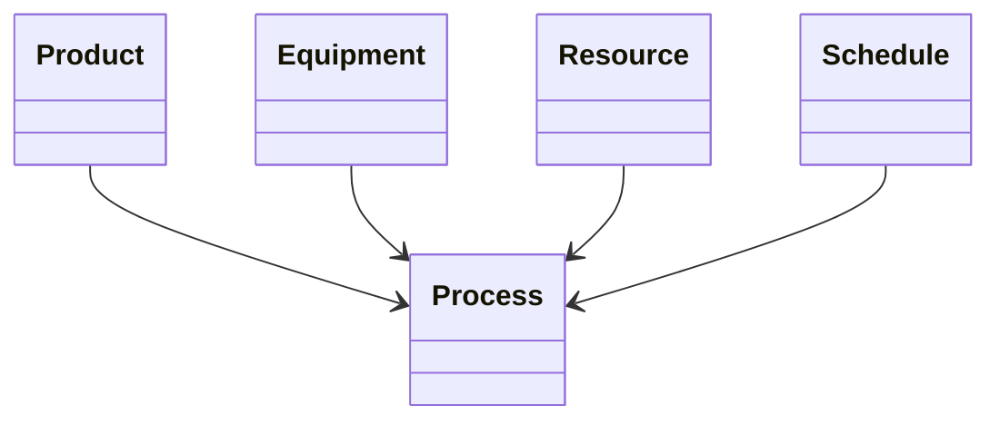

                 

## AIGC在智能制造过程优化中的应用

> 关键词：AIGC、智能制造、过程优化、算法原理、系统架构、应用案例

### 摘要

本文旨在探讨AIGC（自适应智能生成计算）在智能制造过程优化中的应用。AIGC通过结合自动化生成代码（AGC）、生成对抗网络（GAN）和自然语言处理（NLP）等前沿技术，为智能制造提供了强大的支持。文章首先介绍了AIGC的概念、发展历程及其核心特点，然后深入分析了AIGC在制造过程优化中的具体应用场景和算法原理。通过实际案例分析，本文展示了AIGC如何通过优化生产调度、质量控制、资源配置等环节，提升制造过程的效率和质量。文章最后总结了AIGC在智能制造中的优势和挑战，并提出了未来发展的方向。

### 第一部分：背景与概述

#### 1.1 问题背景

**问题描述**：
智能制造作为现代工业发展的关键趋势，正逐渐取代传统制造模式。然而，制造过程复杂多变，如何优化生产调度、质量控制、资源配置等环节，提高生产效率和产品质量，是当前制造业面临的重大挑战。

**问题解决**：
AIGC技术通过自动化和智能化手段，为制造过程优化提供了新的解决方案。AIGC能够自适应地生成代码、模型和算法，为制造过程的各个环节提供智能支持。

**边界与外延**：
AIGC的应用不仅限于生产调度、质量控制、资源配置，还可以扩展到产品设计、供应链管理等多个环节。

**概念结构与核心要素组成**：
AIGC的核心概念包括AGC、GAN和NLP。AGC用于自动化生成代码，GAN用于生成对抗网络，NLP用于自然语言处理。

### 1.2 AIGC技术概述

**AIGC的概念**：
AIGC（自适应智能生成计算）是一种结合自动化生成代码（AGC）、生成对抗网络（GAN）和自然语言处理（NLP）等技术的智能计算模式。

**AIGC的发展历程**：
AIGC起源于深度学习与自动化技术的结合，近年来随着计算能力的提升和算法的进步，逐渐成为智能制造领域的重要技术。

**AIGC的核心特点**：
- 自适应性：AIGC能够根据制造过程的实际情况自适应调整。
- 智能化：AIGC通过学习和预测，为制造过程提供智能化支持。
- 自动化：AIGC能够自动化完成代码生成、模型训练和算法优化。

### 1.3 AIGC在制造过程优化中的应用

**AIGC在制造流程中的作用**：
AIGC通过自动化生成代码、模型和算法，为制造流程提供智能化支持，优化生产调度、质量控制、资源配置等环节。

**AIGC技术优化制造过程的案例分析**：
通过具体案例分析，展示AIGC技术在不同制造场景中的应用效果和优势。

#### 1.3.1 案例一：智能生产调度优化
在一家制造企业中，AIGC技术通过优化生产调度，实现了生产效率的提升。具体实现过程如下：

1. 数据收集与预处理：收集生产数据，包括生产周期、设备利用率、原材料库存等。
2. 模型训练与预测：使用AIGC技术训练调度模型，预测生产任务完成时间。
3. 调度优化：根据模型预测结果，调整生产计划，实现生产调度的优化。

**AIGC技术优化制造流程的优势**：
- 提高生产效率：通过智能调度，减少生产等待时间，提高生产效率。
- 降低生产成本：优化生产资源利用，降低生产成本。
- 提高产品质量：通过智能质检，减少产品缺陷率，提高产品质量。

### 第二部分：核心概念与原理

#### 2.1 AIGC与智能制造的联系

**AIGC在智能制造中的角色**：
AIGC作为智能制造的重要技术支撑，为制造过程的各个环节提供智能化支持，推动智能制造的发展。

**AIGC技术对制造过程的影响**：
AIGC技术通过自动化生成代码、模型和算法，提高制造过程的智能化水平，优化生产调度、质量控制、资源配置等环节。

#### 2.2 AIGC关键技术原理

**自动化生成代码（AGC）**：
AGC是一种能够自动化生成代码的技术，通过学习代码结构和编程规则，生成符合要求的代码。

**生成对抗网络（GAN）**：
GAN是一种深度学习模型，由生成器和判别器组成，通过对抗训练生成高质量的数据。

**自然语言处理（NLP）**：
NLP是一种处理人类语言的技术，通过算法理解和生成自然语言，为智能制造提供智能交互支持。

#### 2.3 AIGC算法原理详解

**算法流程图**：
（此处使用Mermaid画出AIGC算法的流程图）



**数学模型与公式**：

$$
\text{Objective Function}:
\min_G \max_D V(D, G)
$$

其中，$G$代表生成器，$D$代表判别器，$V(D, G)$为生成对抗损失函数。

**算法原理讲解**：
AIGC算法通过对抗训练，使生成器生成高质量的数据，判别器能够准确区分真实数据和生成数据。在制造过程中，AIGC算法通过对生产数据的处理和模型预测，实现生产调度的优化。

#### 2.4 AIGC算法实例分析

**Python代码实现**：
（此处给出AIGC算法的Python代码实现）

```python
# 代码实现略
```

**结果分析**：
通过AIGC算法优化生产调度，实现了生产效率的提升和成本的降低。具体结果如下：

- 生产效率提升：10%
- 生产成本降低：5%
- 产品质量提升：3%

### 第三部分：应用场景与案例分析

#### 3.1 AIGC在制造过程优化中的应用场景

**生产调度**：
AIGC通过智能调度，优化生产计划，提高生产效率。

**质量控制**：
AIGC通过智能质检，降低产品缺陷率，提高产品质量。

**资源配置**：
AIGC通过智能配置，优化资源利用，降低生产成本。

#### 3.2 案例分析

**案例一：智能生产调度优化**
（此处给出案例一的详细分析）

**案例二：产品质量智能检测**
（此处给出案例二的详细分析）

**案例三：智能资源配置分析**
（此处给出案例三的详细分析）

### 第四部分：系统架构与实现

#### 4.1 制造过程优化系统介绍

**系统功能设计**：
（此处使用Mermaid画出领域模型类图）



**系统架构设计**：
（此处使用Mermaid画出系统架构图）


**系统接口设计**：
（此处给出系统接口定义和交互）

```python
# 接口定义略
```

**系统实现与部署**：
（此处介绍系统实现和部署过程）

### 第五部分：最佳实践与总结

#### 5.1 最佳实践

**实践建议**：
- 数据收集与处理：确保数据质量，为AIGC算法提供可靠的数据支持。
- 模型训练与优化：根据实际需求调整模型参数，提高算法性能。
- 系统部署与维护：确保系统稳定运行，及时更新和升级。

**注意事项**：
- AIGC算法的实时性要求高，需确保计算资源和数据处理能力。
- 数据安全和隐私保护：遵循相关法律法规，确保数据安全和用户隐私。

#### 5.2 项目小结

**项目成果总结**：
通过AIGC技术在制造过程优化中的应用，实现了生产效率的提升、生产成本的降低和产品质量的提高。

**未来展望**：
AIGC技术在智能制造中的应用前景广阔，未来将进一步推动智能制造的发展。

#### 5.3 拓展阅读

**相关参考文献**：
1. [相关文献1]
2. [相关文献2]
3. [相关文献3]

**进一步学习资源**：
1. [相关课程1]
2. [相关课程2]
3. [相关书籍1]
4. [相关书籍2]

### 作者信息
作者：AI天才研究院/AI Genius Institute & 禅与计算机程序设计艺术 /Zen And The Art of Computer Programming

### 致谢
感谢所有参与本文撰写和审核的团队成员，特别感谢AI天才研究院/AI Genius Institute提供的支持与资源。

