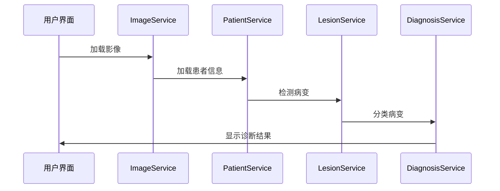

                 

### 第一部分：问题背景与核心概念

#### 1.1.1 问题背景

##### 1.1.1.1 医疗影像的重要性

医疗影像技术在现代医学诊断中扮演着至关重要的角色。它不仅提供了直观的图像信息，而且能够协助医生进行精确的诊断和治疗方案的选择。具体而言，医疗影像在以下方面具有核心作用：

1. **早期诊断**：通过X光、CT、MRI等技术，医生可以观察到人体内部的结构变化，早期发现病变，如肿瘤、心脏病、神经系统疾病等。
2. **治疗方案制定**：医疗影像为医生提供了病变的详细信息，有助于制定个性化的治疗方案。例如，通过MRI指导的肿瘤切除手术可以减少对周围健康组织的损伤。
3. **病情监测**：医疗影像技术可以帮助医生监测病情的进展和治疗效果，如通过对比CT扫描来评估肿瘤是否缩小。

随着现代科技的发展，医疗影像技术也在不断进步。从传统的X光片到高分辨率的MRI和CT，再到新兴的3D成像技术，医疗影像的精度和分辨率得到了显著提升，为医学诊断提供了更多的可能性。

##### 1.1.1.2 现代医疗影像技术的进步与发展

现代医疗影像技术的进步主要体现在以下几个方面：

1. **分辨率提高**：高分辨率成像技术可以捕捉到更细微的结构变化，提高了诊断的准确性。例如，最新的MRI技术可以达到亚毫米级别的分辨率。
2. **实时成像**：实时成像技术使得医生可以在手术过程中实时观察到器官的动态变化，提高了手术的安全性和效率。
3. **多模态成像**：多模态成像技术将不同成像方式（如CT、MRI、超声等）结合起来，提供更全面的信息，有助于提高诊断的准确性。
4. **自动化分析**：随着人工智能技术的发展，医疗影像的自动化分析逐渐成为可能。通过深度学习算法，计算机可以自动识别和分类病变，提高了诊断的速度和准确性。

这些进步极大地推动了医疗影像技术的发展，使得医疗诊断更加精准、高效。

#### 1.1.2 核心概念

##### 1.1.2.1 AIGC概述

AIGC（Artificial Intelligence Generated Code）是一种利用人工智能技术自动生成代码的方法。AIGC的核心思想是通过机器学习算法从大量代码样本中学习编程模式，并自动生成新的代码。这种技术在软件开发、自动化测试、代码优化等领域展示了巨大的潜力。

AIGC在医疗领域的应用潜力主要表现在以下几个方面：

1. **代码自动化生成**：AIGC可以帮助医生快速生成个性化的医疗影像分析代码，提高工作效率。
2. **算法优化**：通过AIGC技术，可以自动化优化医疗影像分析算法，提高诊断的准确性和效率。
3. **数据预处理**：AIGC可以自动处理大量的医疗影像数据，进行有效的预处理，为深度学习模型提供更好的数据输入。

##### 1.1.2.2 智能医疗影像分析

智能医疗影像分析是指利用人工智能技术对医疗影像进行自动化分析和诊断的过程。它包括以下几个基本概念：

1. **图像识别**：通过卷积神经网络（CNN）等深度学习模型，计算机可以自动识别和分类医疗影像中的病变。
2. **病灶检测**：利用深度学习算法，计算机可以精确地检测出影像中的病灶区域。
3. **诊断预测**：基于对大量医疗影像数据的分析，智能系统可以预测疾病的类型和严重程度。

智能医疗影像分析的优势包括：

1. **高准确性**：通过深度学习算法，智能系统可以提供比人类医生更准确的诊断结果。
2. **高效率**：自动化分析可以大大提高医疗影像处理的效率，减轻医生的工作负担。
3. **个性化服务**：智能医疗影像分析可以根据患者的具体病情提供个性化的诊断建议。

然而，智能医疗影像分析也面临一些挑战，如数据隐私和安全、模型可解释性等。

##### 1.1.3 边界与外延

##### 1.1.3.1 AIGC与医疗影像分析的关系

AIGC在医疗影像分析中的应用领域主要包括以下几个方面：

1. **代码生成**：通过AIGC技术，可以自动化生成医疗影像分析所需的代码，降低开发成本和时间。
2. **算法优化**：AIGC可以帮助优化医疗影像分析算法，提高诊断的准确性和效率。
3. **数据预处理**：AIGC可以自动处理大量的医疗影像数据，进行有效的预处理，为深度学习模型提供更好的数据输入。

与AIGC相比，其他相关技术如深度学习、自然语言处理等也有一定的应用潜力。然而，AIGC的独特优势在于其能够自动化生成代码，从而减少开发时间和成本，提高工作效率。

##### 1.1.3.2 AIGC与其他相关技术的区别与联系

AIGC与深度学习、自然语言处理等技术的区别主要体现在其应用场景和目标上：

1. **深度学习**：深度学习主要用于图像识别、语音识别等任务，其主要目标是提高模型的准确性和效率。
2. **自然语言处理**：自然语言处理主要用于文本分析和语言理解，其主要目标是使计算机能够理解和生成自然语言。
3. **AIGC**：AIGC的主要目标是自动化生成代码，其应用场景包括软件开发、自动化测试、代码优化等。

然而，这些技术之间也存在一定的联系。例如，AIGC可以结合深度学习和自然语言处理技术，实现更复杂的代码生成任务。

##### 1.1.3.3 概念结构与核心要素

AIGC在智能医疗影像分析中的核心要素主要包括：

1. **数据采集与预处理**：收集大量的医疗影像数据，并进行预处理，如图像增强、数据标准化等。
2. **深度学习模型**：利用深度学习算法对预处理后的数据进行训练，建立医疗影像分析的模型。
3. **模型评估与优化**：通过交叉验证和性能评估，对模型进行优化，提高诊断的准确性和效率。

这些核心要素共同构成了AIGC在智能医疗影像分析中的完整工作流程。

##### 1.1.4 概念结构与核心要素

AIGC在智能医疗影像分析中的核心要素可以分为以下几个部分：

1. **数据采集与预处理**：这一步骤包括收集大量的医疗影像数据，并对数据进行预处理，如图像增强、去噪、数据标准化等，以便为深度学习模型提供高质量的数据输入。
2. **深度学习模型**：使用深度学习算法（如卷积神经网络、循环神经网络等）对预处理后的数据进行分析和训练，建立医疗影像分析模型。这些模型可以自动识别和分类影像中的病变区域。
3. **模型评估与优化**：通过交叉验证和性能评估，对模型进行优化，以提高诊断的准确性和效率。这通常包括调整模型参数、增加训练数据等。

这些核心要素共同构成了AIGC在智能医疗影像分析中的工作流程。

##### 1.2 本章小结

本章首先介绍了医疗影像在诊断中的核心作用以及现代医疗影像技术的进步与发展。随后，我们详细介绍了AIGC的基本原理和智能医疗影像分析的基本概念。通过分析AIGC与医疗影像分析的关系，我们明确了AIGC在智能医疗影像分析中的应用领域。最后，我们阐述了AIGC在智能医疗影像分析中的核心要素，为后续章节的深入探讨奠定了基础。

通过本章的阅读，读者应该能够初步了解医疗影像分析的重要性、AIGC的基本原理以及其在医疗影像分析中的应用前景。这将有助于读者更好地理解和把握AIGC在智能医疗影像分析领域的应用价值和挑战。

----------------------------------------------------------------

### 第二部分：核心概念与原理

#### 2.1 AIGC原理

AIGC（Artificial Intelligence Generated Code）是一种利用人工智能技术自动生成代码的方法。AIGC的核心思想是通过机器学习算法从大量代码样本中学习编程模式，并自动生成新的代码。这种技术在软件开发、自动化测试、代码优化等领域展示了巨大的潜力。

##### 2.1.1 AIGC的基本原理

AIGC的基本原理可以概括为以下几个步骤：

1. **数据采集**：收集大量的代码样本，这些样本可以是开源项目、公共代码库等。
2. **预处理**：对收集的代码样本进行预处理，包括代码清洗、格式统一等，以便为后续的机器学习提供高质量的数据输入。
3. **模型训练**：使用机器学习算法（如深度学习、自然语言处理等）对预处理后的代码数据进行训练，建立代码生成模型。
4. **代码生成**：利用训练好的模型，根据输入的代码片段或需求，自动生成新的代码。

AIGC的组成部分主要包括：

1. **数据采集与处理模块**：负责收集和预处理代码数据。
2. **机器学习模型**：用于训练和生成代码的核心算法。
3. **代码生成与优化模块**：负责根据输入生成代码，并进行优化。

##### 2.1.2 AIGC的工作流程

AIGC的工作流程通常可以分为以下几个步骤：

1. **数据采集**：从开源项目、公共代码库等渠道收集大量的代码样本。
2. **数据预处理**：对收集的代码样本进行清洗、格式统一等预处理操作。
3. **模型训练**：使用预处理后的代码数据，通过深度学习等算法训练代码生成模型。
4. **模型评估**：通过交叉验证等方法对模型进行评估，确保其生成代码的准确性和可靠性。
5. **代码生成**：根据具体的编程需求，利用训练好的模型生成新的代码。
6. **代码优化**：对生成的代码进行优化，提高其性能和可读性。

##### 2.1.3 AIGC的技术原理

AIGC的技术原理主要涉及以下几个方面：

1. **数据驱动方法**：AIGC通过大量代码数据驱动，从中学到编程模式，并利用这些模式生成新的代码。
2. **深度学习模型**：AIGC通常使用深度学习模型，如循环神经网络（RNN）、生成对抗网络（GAN）等，来训练和生成代码。
3. **自然语言处理**：AIGC将代码视为一种自然语言，利用自然语言处理技术进行代码生成和优化。

##### 2.1.4 AIGC的优势与局限

AIGC的优势主要体现在以下几个方面：

1. **提高开发效率**：通过自动生成代码，可以显著减少开发时间和工作量。
2. **降低开发成本**：自动化的代码生成和优化可以降低软件开发成本。
3. **增强代码质量**：AIGC可以根据大量数据生成高质量的代码，提高代码的可靠性和性能。

然而，AIGC也存在一些局限：

1. **数据隐私与安全**：自动生成的代码可能涉及敏感数据，需要确保数据隐私和安全。
2. **模型可解释性**：自动生成的代码通常缺乏透明度，难以理解其具体实现逻辑。
3. **对人类开发者的依赖**：尽管AIGC可以提高开发效率，但人类开发者仍然需要在代码生成过程中进行审查和优化。

##### 2.1.5 AIGC在医疗影像分析中的关键问题

在医疗影像分析中，AIGC面临以下关键问题：

1. **数据质量问题**：医疗影像数据的质量直接影响模型的性能。因此，需要对医疗影像数据进行严格的预处理和清洗。
2. **模型可解释性**：在医疗领域，模型的可解释性至关重要。需要开发可解释的AIGC模型，以便医生能够理解模型的诊断结果。
3. **数据隐私与安全**：医疗数据涉及患者隐私，需要确保数据的安全性和隐私性。

##### 2.2 本章小结

本章详细介绍了AIGC的基本原理和技术特点。首先，我们探讨了AIGC的工作流程和数据驱动方法。接着，我们分析了AIGC的优势和局限，并讨论了其在医疗影像分析中的关键问题。通过本章的阅读，读者应该能够全面理解AIGC的工作原理和应用价值，为后续章节的深入探讨打下坚实基础。

----------------------------------------------------------------

## 第3章：智能医疗影像分析算法

### 3.1.1 常见算法概述

智能医疗影像分析算法是医学影像数据处理与分析的核心技术，广泛应用于疾病诊断、病情监测、治疗方案制定等方面。本节将介绍几种常见的智能医疗影像分析算法，包括病变检测算法、形态分析算法和功能分析算法。

##### 3.1.1.1 病变检测算法

病变检测算法是智能医疗影像分析的基础，旨在自动识别和定位影像中的异常区域。常见的病变检测算法包括：

1. **边缘检测算法**：通过检测影像中的边缘信息，识别病变区域。常见的边缘检测算法有Canny算子、Sobel算子等。
2. **阈值分割算法**：通过设置阈值，将影像分为前景和背景，从而识别病变区域。常用的阈值分割算法有Otsu算法、Iterative阈值算法等。
3. **深度学习算法**：如卷积神经网络（CNN）和卷积神经网络（CNN+RNN）等，通过训练大量标注数据，实现病变区域的自动识别和定位。

##### 3.1.1.2 形态分析算法

形态分析算法用于对医疗影像中的病变形态进行定量分析，包括形态学特征提取、形态学参数计算等。常见的形态分析算法包括：

1. **形态学特征提取**：如区域增长算法、形态学梯度等，用于提取影像的几何形态特征。
2. **形态学参数计算**：如面积、周长、形状因子等，用于描述病变区域的几何形态。
3. **形态学变换**：如膨胀、腐蚀、开运算、闭运算等，用于改变影像的结构，以便更好地进行形态分析。

##### 3.1.1.3 功能分析算法

功能分析算法主要关注影像中的功能信息，通过分析影像的时间-空间特征，提取病变区域的功能信息。常见的功能分析算法包括：

1. **时间-空间分析**：如动态影像分析、时间序列分析等，用于分析病变区域在不同时间点的变化特征。
2. **功能特征提取**：如时间-空间特征、纹理特征等，用于描述病变区域的功能特征。
3. **机器学习算法**：如支持向量机（SVM）、决策树等，用于分类和预测病变区域的功能状态。

##### 3.1.2 算法原理讲解

在本节，我们将对上述算法的原理进行详细讲解，以帮助读者更好地理解其工作机制和应用场景。

###### 3.1.2.1 病变检测算法原理讲解

病变检测算法的核心是利用影像的边缘信息和纹理特征，自动识别和定位病变区域。以下是一个基于深度学习算法的病变检测流程：

1. **数据预处理**：对原始影像进行预处理，包括图像增强、去噪、归一化等，以提高模型的训练效果和识别准确性。
2. **卷积神经网络（CNN）模型构建**：构建一个卷积神经网络模型，用于训练和识别病变区域。常见的CNN结构包括卷积层、池化层、全连接层等。
3. **模型训练**：使用大量带有病变标注的数据集，对CNN模型进行训练，使其学会识别病变区域。
4. **模型评估**：使用交叉验证等方法，对训练好的模型进行评估，确保其识别准确性和鲁棒性。
5. **病变检测**：利用训练好的模型，对新的影像进行病变检测，输出病变区域的位置和边界。

以下是一个简化的Python代码示例，用于实现基于CNN的病变检测算法：

```python
import tensorflow as tf
from tensorflow.keras.models import Sequential
from tensorflow.keras.layers import Conv2D, MaxPooling2D, Flatten, Dense

# 构建CNN模型
model = Sequential()
model.add(Conv2D(32, (3, 3), activation='relu', input_shape=(256, 256, 3)))
model.add(MaxPooling2D((2, 2)))
model.add(Conv2D(64, (3, 3), activation='relu'))
model.add(MaxPooling2D((2, 2)))
model.add(Flatten())
model.add(Dense(1, activation='sigmoid'))

# 编译模型
model.compile(optimizer='adam', loss='binary_crossentropy', metrics=['accuracy'])

# 加载训练数据
train_images, train_labels = load_training_data()

# 训练模型
model.fit(train_images, train_labels, epochs=10, batch_size=32)

# 病变检测
def detect_disease(image):
    prediction = model.predict(image)
    return prediction > 0.5

# 测试模型
test_image = load_test_image()
detection_result = detect_disease(test_image)
print("病变检测结果：", detection_result)
```

###### 3.1.2.2 形态分析算法原理讲解

形态分析算法的核心是提取影像的几何形态特征，包括面积、周长、形状因子等。以下是一个基于形态学特征的形态分析流程：

1. **形态学预处理**：对原始影像进行形态学预处理，包括膨胀、腐蚀、开运算、闭运算等，以提高形态分析的准确性和鲁棒性。
2. **形态学特征提取**：通过形态学操作提取影像的几何形态特征，如面积、周长、形状因子等。
3. **特征分析**：对提取的形态学特征进行统计分析，识别病变区域的形态特征。
4. **特征融合**：将多个形态学特征进行融合，以提高特征表达的丰富性和准确性。

以下是一个简化的Python代码示例，用于实现基于形态学特征的形态分析算法：

```python
import cv2
import numpy as np

# 膨胀操作
def dilate_image(image, kernel_size=(3, 3)):
    kernel = cv2.getStructuringElement(cv2.MORPH_RECT, kernel_size)
    dilated_image = cv2.dilate(image, kernel, iterations=1)
    return dilated_image

# 腐蚀操作
def erode_image(image, kernel_size=(3, 3)):
    kernel = cv2.getStructuringElement(cv2.MORPH_RECT, kernel_size)
    eroded_image = cv2.erode(image, kernel, iterations=1)
    return eroded_image

# 开运算
def opening(image, kernel_size=(3, 3)):
    eroded_image = erode_image(image, kernel_size)
    dilated_image = dilate_image(eroded_image, kernel_size)
    return dilated_image

# 闭运算
def closing(image, kernel_size=(3, 3)):
    dilated_image = dilate_image(image, kernel_size)
    eroded_image = erode_image(dilated_image, kernel_size)
    return eroded_image

# 形态学特征提取
def extract_morphological_features(image):
    area = cv2.countNonZero(image)
    perimeter = cv2.arcLength(image, True)
    shape_factor = area / (perimeter ** 2)
    return area, perimeter, shape_factor

# 测试影像
image = cv2.imread('test_image.jpg', cv2.IMREAD_GRAYSCALE)

# 形态学预处理
preprocessed_image = opening(image, kernel_size=(5, 5))

# 提取形态学特征
features = extract_morphological_features(preprocessed_image)

print("形态学特征：面积：", features[0], "周长：", features[1], "形状因子：", features[2])
```

###### 3.1.2.3 功能分析算法原理讲解

功能分析算法的核心是提取影像中的功能信息，包括时间-空间特征、纹理特征等。以下是一个基于时间-空间分析的功能分析流程：

1. **时间-空间分析**：对动态影像进行时间-空间分析，提取病变区域在不同时间点的变化特征。
2. **功能特征提取**：通过时间-空间分析提取功能特征，如时间序列特征、纹理特征等。
3. **特征分析**：对提取的功能特征进行统计分析，识别病变区域的功能状态。
4. **特征融合**：将多个功能特征进行融合，以提高特征表达的丰富性和准确性。

以下是一个简化的Python代码示例，用于实现基于时间-空间分析的功能分析算法：

```python
import numpy as np
import matplotlib.pyplot as plt

# 时间-空间特征提取
def extract_time_space_features(image_sequence):
    features = []
    for frame in image_sequence:
        # 计算灰度平均值
        mean_gray = np.mean(frame)
        # 计算灰度标准差
        std_gray = np.std(frame)
        # 计算纹理特征
        texture = calculate_texture(frame)
        features.append([mean_gray, std_gray, texture])
    return features

# 纹理特征计算
def calculate_texture(image):
    # 这里使用LBP（局部二值模式）算法计算纹理特征
    # ...
    return texture_feature

# 测试影像序列
image_sequence = [np.random.rand(256, 256) for _ in range(10)]

# 提取时间-空间特征
time_space_features = extract_time_space_features(image_sequence)

# 可视化特征
for i, feature in enumerate(time_space_features):
    plt.figure()
    plt.plot(feature)
    plt.title(f"Time-Space Feature {i+1}")
    plt.xlabel("Time")
    plt.ylabel("Feature Value")
    plt.show()
```

##### 3.1.3 算法对比与分析

在本节，我们将对比不同算法的性能，并分析其适用场景。

###### 3.1.3.1 病变检测算法对比

不同病变检测算法的性能和适用场景对比如下：

| 算法           | 性能指标               | 适用场景             |
|----------------|-----------------------|----------------------|
| 边缘检测算法   | 边缘识别准确性高       | 对边缘特征明显的病变检测效果较好 |
| 阈值分割算法   | 阈值选择影响较大       | 病变区域与背景对比明显的影像 |
| 深度学习算法   | 识别准确性高、泛化能力强 | 复杂病变检测和定位 |

深度学习算法在病变检测中的准确性通常较高，且具有较强的泛化能力，适用于各种复杂的病变检测任务。然而，深度学习算法的训练过程较为复杂，需要大量的标注数据和支持硬件设备。

###### 3.1.3.2 形态分析算法对比

不同形态分析算法的性能和适用场景对比如下：

| 算法           | 性能指标               | 适用场景             |
|----------------|-----------------------|----------------------|
| 形态学特征提取 | 特征提取准确度高       | 病变形态定量分析     |
| 形态学参数计算 | 参数计算简单、直观     | 病变形态特征描述     |
| 形态学变换     | 结构改变灵活           | 病变形态处理和融合 |

形态分析算法适用于对病变形态进行定量分析和描述。形态学特征提取和参数计算可以提供丰富的形态学信息，而形态学变换则可用于改变影像的结构，以适应不同的分析需求。

###### 3.1.3.3 功能分析算法对比

不同功能分析算法的性能和适用场景对比如下：

| 算法           | 性能指标               | 适用场景             |
|----------------|-----------------------|----------------------|
| 时间-空间分析   | 提取特征全面           | 动态影像功能分析     |
| 功能特征提取   | 特征提取精准           | 功能影像特征描述     |
| 机器学习算法   | 分类和预测能力强       | 功能状态分类和预测 |

功能分析算法适用于对影像中的功能信息进行分析。时间-空间分析可以提取影像的时间-空间特征，功能特征提取可以提供详细的功能特征，而机器学习算法则可用于分类和预测功能状态。

##### 3.2 本章小结

本章介绍了智能医疗影像分析中常见的算法，包括病变检测算法、形态分析算法和功能分析算法。通过对这些算法的原理讲解和对比分析，读者可以了解不同算法的性能和应用场景。这些算法为智能医疗影像分析提供了丰富的工具和方法，有助于提高疾病诊断的准确性和效率。本章的内容为后续章节的深入探讨提供了坚实的基础。

----------------------------------------------------------------

## 第4章：系统架构与设计

### 4.1.1 问题场景介绍

智能医疗影像分析系统旨在利用人工智能技术，对医疗影像数据进行自动化分析和诊断，以提高疾病诊断的准确性和效率。本节将介绍一个典型的智能医疗影像分析系统的应用场景。

#### 4.1.1.1 医疗影像分析系统的应用场景

智能医疗影像分析系统通常应用于以下场景：

1. **疾病早期筛查**：通过智能医疗影像分析系统，医生可以对大量影像数据进行自动化筛查，快速发现潜在的疾病迹象。例如，利用智能系统对乳腺X光片进行自动化分析，可以早期发现乳腺癌。
2. **疾病诊断辅助**：智能医疗影像分析系统可以辅助医生进行疾病诊断。例如，利用智能系统对CT扫描图像进行分析，可以帮助医生识别肿瘤的位置、大小和形状。
3. **病情监测和评估**：通过定期对患者的影像数据进行分析，医生可以监测病情的进展和治疗效果。例如，利用智能系统对MRI图像进行分析，可以评估脑肿瘤的治疗效果。
4. **个性化治疗建议**：智能医疗影像分析系统可以根据患者的具体病情，提供个性化的治疗建议。例如，利用智能系统分析患者的影像数据，可以为患者制定最优的治疗方案。

#### 4.1.1.2 系统需求

智能医疗影像分析系统的需求主要包括以下几个方面：

1. **数据处理能力**：系统能够高效地处理大量的医疗影像数据，包括图像增强、去噪、数据标准化等预处理操作。
2. **算法性能**：系统需要采用先进的智能分析算法，如深度学习、形态分析等，以确保诊断的准确性和可靠性。
3. **用户界面**：系统应提供友好的用户界面，方便医生操作和查看分析结果。
4. **数据安全与隐私**：系统需要确保患者数据的保密性和安全性，符合相关的法律法规和标准。
5. **可扩展性**：系统应具备良好的可扩展性，能够根据需求增加新的分析算法和功能模块。

### 4.1.2 项目介绍

本节将介绍一个具体的智能医疗影像分析系统项目，该系统旨在实现乳腺癌的早期筛查和诊断辅助。

#### 4.1.2.1 项目背景

乳腺癌是女性中发病率较高的恶性肿瘤，早期筛查和诊断对于提高治愈率和生存率至关重要。传统的乳腺X光片筛查方法存在一定的局限性，如漏诊率和误诊率较高。因此，开发一种基于智能医疗影像分析系统的乳腺癌筛查和诊断辅助工具具有重要意义。

#### 4.1.2.2 项目目标

本项目的主要目标包括：

1. **提高乳腺癌筛查的准确性**：通过采用深度学习等先进算法，提高乳腺癌筛查的准确性，减少漏诊率和误诊率。
2. **降低医生的工作负担**：通过自动化分析，减轻医生在乳腺癌筛查和诊断过程中的人工负担，提高工作效率。
3. **提供个性化诊断建议**：根据患者的具体影像数据，提供个性化的诊断建议，帮助医生制定更有效的治疗方案。

#### 4.1.2.3 项目功能

智能医疗影像分析系统的主要功能包括：

1. **影像数据预处理**：对乳腺X光片进行图像增强、去噪、数据标准化等预处理操作，以提高后续分析的准确性和效率。
2. **病变检测**：利用深度学习算法，自动检测乳腺X光片中的可疑病变区域。
3. **病变分类**：对检测到的病变区域进行分类，判断其是否为乳腺癌。
4. **诊断辅助**：提供诊断报告，包括病变区域的详细信息、分类结果和医生建议。
5. **用户界面**：提供友好的用户界面，方便医生操作和查看分析结果。

### 4.1.3 系统功能设计（领域模型）

在系统功能设计中，领域模型（Domain Model）是描述系统功能的重要工具。领域模型通过类图（Class Diagram）来表示系统的实体及其关系。以下是一个简化的领域模型类图，用于描述智能医疗影像分析系统的主要实体和关系。

```mermaid
class Image {
  - id: ID
  - name: Name
  - status: Status
}

class Patient {
  - id: ID
  - name: Name
  - gender: Gender
  - age: Age
}

class Lesion {
  - id: ID
  - type: Type
  - location: Location
  - size: Size
}

class Diagnosis {
  - id: ID
  - result: Result
  - suggestion: Suggestion
}

class System {
  - images: List<Image>
  - patients: List<Patient>
  - lesions: List<Lesion>
  - diagnoses: List<Diagnosis>
}

Image --< Patient: has
Patient --< Image: has
Lesion --< Diagnosis: has
Diagnosis --< Lesion: has
```

在这个类图中，`Image` 表示影像数据，`Patient` 表示患者信息，`Lesion` 表示病变区域，`Diagnosis` 表示诊断结果。`System` 类包含了所有的影像数据、患者信息和诊断结果。

### 4.1.4 系统架构设计

智能医疗影像分析系统的架构设计是确保系统高效、稳定、可扩展运行的关键。以下是一个简化的系统架构图，用于描述系统的各个组件及其关系。

```mermaid
subgraph 数据层
  ImageDatabase
  PatientDatabase
  LesionDatabase
  DiagnosisDatabase
end

subgraph 业务层
  ImagePreprocessor
  LesionDetector
  LesionClassifier
  DiagnosisAssistant
end

subgraph 表示层
  UserInterface
end

ImageDatabase --> ImagePreprocessor
PatientDatabase --> ImagePreprocessor
ImagePreprocessor --|-> LesionDetector
LesionDetector --|-> LesionClassifier
LesionClassifier --|-> DiagnosisAssistant
DiagnosisAssistant --|-> DiagnosisDatabase
DiagnosisAssistant --> UserInterface
```

在这个架构图中，数据层（Data Layer）负责存储和管理影像数据、患者信息和诊断结果。业务层（Business Layer）包含影像预处理、病变检测、病变分类和诊断辅助等核心功能模块。表示层（Presentation Layer）提供用户界面，方便医生操作和查看分析结果。

### 4.1.5 系统接口设计

系统接口设计是确保系统各组件之间有效通信的关键。以下是一个简化的接口设计图，用于描述系统的主要接口和通信方式。

```mermaid
interface ImageService {
  - loadImage(): Image
  - saveImage(image: Image): void
}

interface PatientService {
  - loadPatient(id: ID): Patient
  - savePatient(patient: Patient): void
}

interface LesionService {
  - detectLesion(image: Image): List<Lesion>
  - classifyLesion(lesion: Lesion): string
}

interface DiagnosisService {
  - generateDiagnosis(lesion: Lesion): Diagnosis
  - saveDiagnosis(diagnosis: Diagnosis): void
}

ImageService --< UserInterface
PatientService --< UserInterface
LesionService --< DiagnosisService
DiagnosisService --< UserInterface
```

在这个接口设计图中，`ImageService`、`PatientService`、`LesionService` 和 `DiagnosisService` 分别是影像服务、患者服务、病变服务和诊断服务的接口。`UserInterface` 是用户界面，通过调用这些服务接口来实现系统的功能。

### 4.1.6 系统交互设计

系统交互设计描述了系统组件之间的交互流程和顺序。以下是一个简化的系统交互序列图，用于描述智能医疗影像分析系统的关键交互过程。



在这个交互序列图中，用户界面（UI）首先加载影像，然后通过影像服务（IS）加载患者信息。接着，病变服务（LS）检测病变并分类病变，最后通过诊断服务（DS）生成诊断结果，并显示在用户界面。

### 4.2 本章小结

本章详细介绍了智能医疗影像分析系统的架构与设计。首先，通过介绍问题场景和项目需求，明确了系统的应用背景和目标。接着，通过领域模型类图、系统架构设计图、接口设计图和交互序列图的绘制，详细描述了系统的功能模块、接口设计和交互流程。通过本章的阅读，读者可以全面了解智能医疗影像分析系统的设计原则和实现方法，为后续章节的实际应用提供理论支持。

