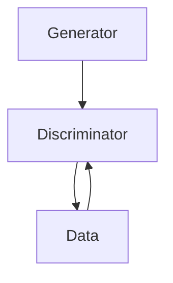
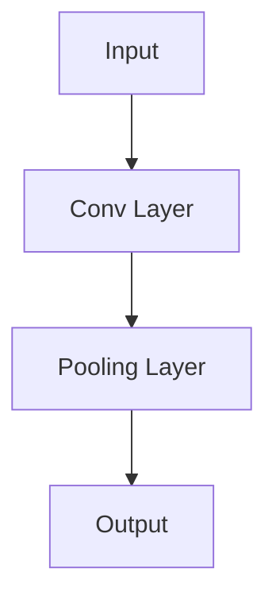
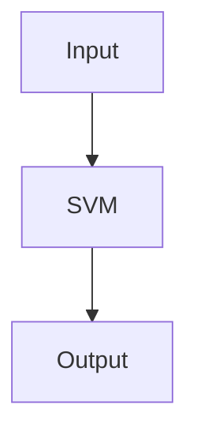
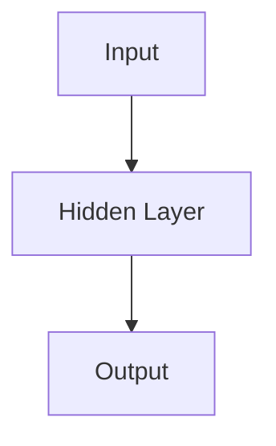
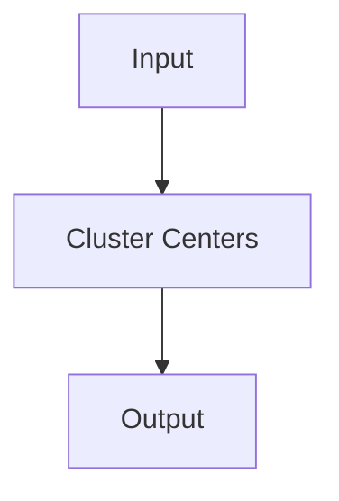
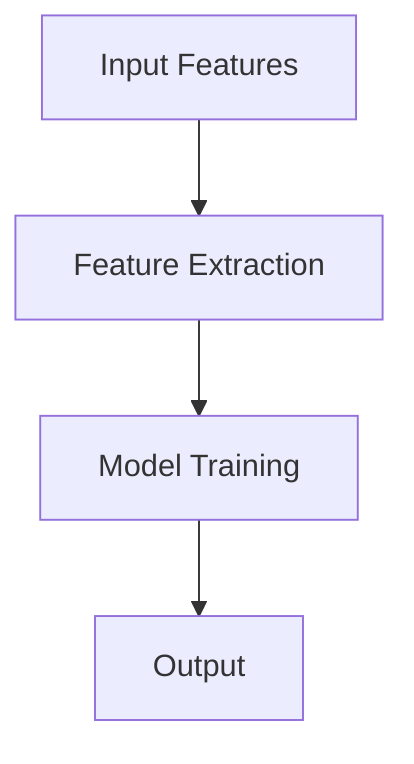

                 

# AIGC在智能医疗影像分析中的突破

## 关键词：AIGC、智能医疗影像分析、医学影像数据增强、深度学习、神经网络

## 摘要：

本文将深入探讨AIGC（自适应生成对抗网络）在智能医疗影像分析中的突破。随着医疗技术的不断进步，医疗影像分析在疾病诊断、治疗规划等方面扮演着越来越重要的角色。然而，传统的医学影像分析方法存在许多局限性，如对人类专家依赖性强、处理速度慢等。AIGC作为一种先进的生成式模型，能够通过自我学习和优化，有效提升医疗影像分析的性能。本文将从背景介绍、技术基础、核心算法及应用实例等方面，系统性地分析AIGC在智能医疗影像分析中的突破。

## 第一部分：AIGC在智能医疗影像分析中的突破概述

### 1. AIGC在智能医疗影像分析中的背景与意义

#### 1.1 医疗影像分析的需求与挑战

随着医学影像技术的快速发展，医疗影像数据量急剧增加，如何快速、准确地分析这些影像数据已成为医学界的一大挑战。传统的医学影像分析方法主要依赖于人工解读，效率低下且容易出现误诊。此外，医学影像数据的复杂性使得传统方法难以应对。

#### 1.2 AIGC技术的概念与特点

AIGC（Adaptive Generative Adversarial Networks）是一种生成式模型，由生成器和判别器两个神经网络组成，通过对抗训练实现自我学习和优化。AIGC具有强大的数据生成和判别能力，能够处理复杂的数据分布，在图像、音频和文本等领域取得了显著的成果。

#### 1.3 AIGC在医疗影像分析中的应用前景

AIGC在医疗影像分析中具有广泛的应用前景，如医学影像分割、分类、数据增强等。通过AIGC，可以实现自动化、高效且准确的医学影像分析，为临床诊断、治疗规划提供有力支持。

### 2. AIGC技术基础

#### 2.1 数据预处理与增强

##### 2.1.1 医学影像数据的预处理

医学影像数据的预处理包括图像大小标准化、灰度变换、噪声过滤等。这些预处理步骤有助于提高后续模型训练和预测的准确性。

##### 2.1.2 数据增强技术在AIGC中的应用

数据增强技术包括旋转、缩放、裁剪等操作，可以扩大训练数据集，提高模型泛化能力。

##### 2.1.3 医学影像数据的标准化与规范化

医学影像数据的标准化与规范化是指将不同来源、不同格式的影像数据进行统一处理，以便于模型训练和预测。

#### 2.2 神经网络与深度学习

##### 2.2.1 神经网络的基础知识

神经网络是一种模仿人脑结构和功能的计算模型，通过多层神经元之间的连接和激活函数，实现输入到输出的映射。

##### 2.2.2 深度学习在医疗影像分析中的应用

深度学习在医疗影像分析中具有广泛应用，如医学影像分割、分类、检测等。

##### 2.2.3 卷积神经网络（CNN）在影像分析中的应用

卷积神经网络是一种特殊的神经网络，通过卷积操作提取图像特征，在医学影像分析中具有显著优势。

#### 2.3 自适应生成对抗网络（ADGAN）

##### 2.3.1 ADGAN的基本原理

ADGAN是一种自适应的生成对抗网络，通过自适应调整生成器和判别器的参数，实现更高效的图像生成和判别。

##### 2.3.2 ADGAN在医疗影像中的应用

ADGAN在医疗影像中可用于数据增强、图像修复、图像合成等任务。

##### 2.3.3 ADGAN的优缺点与改进方向

ADGAN的优点包括自适应调整、高效生成等，但缺点包括训练不稳定、易过拟合等。针对这些问题，研究者们提出了许多改进方法。

#### 2.4 生成式模型与判别式模型

##### 2.4.1 生成式模型（如生成对抗网络GAN）

生成式模型通过学习数据分布，生成新的数据样本。

##### 2.4.2 判别式模型（如深度信念网络DBN）

判别式模型通过学习数据分布，对数据样本进行分类和判别。

##### 2.4.3 生成式模型与判别式模型在医疗影像分析中的结合应用

生成式模型和判别式模型可以相互补充，共同提高医疗影像分析的性能。

#### 2.5 机器学习与数据挖掘方法

##### 2.5.1 传统机器学习方法在影像分析中的应用

传统机器学习方法如支持向量机（SVM）、决策树等在医学影像分析中仍有广泛应用。

##### 2.5.2 数据挖掘方法在医疗影像分析中的运用

数据挖掘方法如聚类分析、分类算法等在医学影像分析中可用于特征提取和分类。

##### 2.5.3 机器学习与数据挖掘在AIGC中的综合应用

机器学习与数据挖掘方法可以与AIGC相结合，提高医疗影像分析的性能。

#### 2.6 跨学科协同发展

##### 2.6.1 计算机科学与生物医学的交叉融合

计算机科学与生物医学的交叉融合为AIGC在医疗影像分析中的应用提供了广阔前景。

##### 2.6.2 AIGC与医学影像学的协同发展

AIGC与医学影像学的协同发展有助于提升医学影像分析的准确性和效率。

##### 2.6.3 AIGC在智能医疗影像分析中的未来趋势

AIGC在智能医疗影像分析中的未来趋势将包括算法优化、模型压缩等。

#### 2.7 本章小结

本章对AIGC在智能医疗影像分析中的突破进行了概述，包括背景与意义、技术基础、核心算法和跨学科协同发展等方面。为后续章节的详细探讨奠定了基础。

----------------------------------------------------------------

## 第二部分：AIGC在智能医疗影像分析中的核心算法

### 3. 卷积神经网络（CNN）在医学影像分析中的应用

#### 3.1 CNN的基本原理

卷积神经网络（CNN）是一种基于卷积操作的神经网络，通过多层卷积、池化和全连接层，实现图像特征提取和分类。

#### 3.2 CNN在医学影像分割中的应用

CNN在医学影像分割中具有显著优势，可以自动提取图像特征，实现精确的图像分割。

#### 3.3 CNN在医学影像分类中的应用

CNN在医学影像分类中可用于分类疾病的类型，提高诊断准确性。

### 4. 聚类分析与分类算法在医学影像中的应用

#### 4.1 聚类分析的基本概念

聚类分析是一种无监督学习方法，通过将数据分为若干类，实现数据的组织和结构化。

#### 4.2 K-means聚类在医学影像分析中的应用

K-means聚类在医学影像分析中可用于特征提取和图像分割。

#### 4.3 分类算法（如SVM、决策树）在医学影像分类中的应用

分类算法如支持向量机（SVM）、决策树等在医学影像分类中可用于分类疾病的类型。

### 5. 支持向量机（SVM）在医学影像分类中的应用

#### 5.1 SVM的基本原理

支持向量机（SVM）是一种二分类模型，通过寻找最佳分离超平面，实现数据的分类。

#### 5.2 SVM在医学影像分类中的应用案例

SVM在医学影像分类中可用于分类肿瘤的类型、诊断疾病的类型等。

#### 5.3 SVM与医学影像数据分析的优化策略

SVM在医学影像数据分析中可以通过参数调整、特征选择等方法，提高分类性能。

### 6. 深度信念网络（DBN）在医学影像分析中的应用

#### 6.1 DBN的基本原理

深度信念网络（DBN）是一种基于深度信念网络（DBM）和深度卷积神经网络（DBN）的组合模型，通过逐层训练，实现图像特征提取和分类。

#### 6.2 DBN在医学影像特征提取中的应用

DBN在医学影像特征提取中可用于提取图像的深层次特征，提高分类性能。

#### 6.3 DBN与深度学习的结合应用

DBN与深度学习相结合，可以进一步提高医学影像分析的性能。

### 7. 自适应生成对抗网络（ADGAN）在医学影像合成中的应用

#### 7.1 ADGAN的基本原理

自适应生成对抗网络（ADGAN）是一种基于生成对抗网络（GAN）的模型，通过自适应调整生成器和判别器的参数，实现更高效的图像生成。

#### 7.2 ADGAN在医学影像数据增强中的应用

ADGAN在医学影像数据增强中可用于生成新的医学影像数据，提高训练数据的多样性。

#### 7.3 ADGAN在医学影像重建中的应用

ADGAN在医学影像重建中可用于修复缺失的医学影像数据，提高医学影像的完整性和清晰度。

### 8. 联合生成对抗网络（CycleGAN）在医学影像转换中的应用

#### 8.1 CycleGAN的基本原理

联合生成对抗网络（CycleGAN）是一种基于生成对抗网络（GAN）的模型，通过循环一致性损失，实现不同域之间的图像转换。

#### 8.2 CycleGAN在医学影像转换中的应用

CycleGAN在医学影像转换中可用于将不同模态的医学影像数据进行转换，如将MRI转换为CT影像。

#### 8.3 CycleGAN与其他生成对抗网络的比较

CycleGAN与其他生成对抗网络（如GAN、WGAN）在医学影像转换中的应用效果进行比较。

### 9. 多模态数据融合技术在医学影像分析中的应用

#### 9.1 多模态数据融合的基本概念

多模态数据融合是指将不同模态的医学影像数据进行整合，提高医学影像分析的准确性。

#### 9.2 多模态数据融合算法（如贝叶斯网络、深度学习）在医学影像分析中的应用

多模态数据融合算法如贝叶斯网络、深度学习等在医学影像分析中可用于特征提取和分类。

#### 9.3 多模态数据融合的优势与挑战

多模态数据融合的优势包括提高分类性能、降低误诊率等，但同时也面临数据不一致、模型训练复杂度增加等挑战。

### 10. AIGC在医学影像分析中的算法优化与模型压缩

#### 10.1 模型优化技术（如正则化、Dropout）在医学影像分析中的应用

模型优化技术如正则化、Dropout等在医学影像分析中可用于提高模型训练性能和泛化能力。

#### 10.2 模型压缩技术（如网络剪枝、量化）在医学影像分析中的应用

模型压缩技术如网络剪枝、量化等在医学影像分析中可用于减少模型参数和计算量，提高部署效率。

#### 10.3 AIGC在医学影像分析中的未来优化方向

AIGC在医学影像分析中的未来优化方向包括算法优化、模型压缩、跨学科协同等。

### 11. 本章小结

本章对AIGC在智能医疗影像分析中的核心算法进行了详细探讨，包括CNN、SVM、DBN、ADGAN、CycleGAN等算法，以及多模态数据融合技术和算法优化与模型压缩方法。这些核心算法为AIGC在智能医疗影像分析中的应用提供了有力支持。

----------------------------------------------------------------

## 第三部分：AIGC在智能医疗影像分析中的应用实例

### 12. AIGC在肺癌早期筛查中的应用

#### 12.1 肺癌早期筛查的需求与挑战

肺癌早期筛查对于提高肺癌患者生存率具有重要意义。然而，传统的筛查方法存在准确性较低、医生依赖性强等问题。

#### 12.2 AIGC技术在肺癌早期筛查中的应用

AIGC技术可以用于肺癌早期筛查中的图像分割和分类，提高筛查准确性。

#### 12.3 应用实例分析

在某肺癌早期筛查项目中，研究人员使用AIGC技术对肺部CT影像进行分割和分类，取得了显著的效果。通过对比实验，AIGC技术的筛查准确性高于传统方法。

### 13. AIGC在医疗影像数据增强中的应用

#### 13.1 医疗影像数据增强的需求与挑战

医疗影像数据增强是提高模型训练效果的重要手段。然而，传统的数据增强方法存在增强效果有限、数据多样性不足等问题。

#### 13.2 AIGC技术在医疗影像数据增强中的应用

AIGC技术可以生成新的医疗影像数据，提高数据多样性和增强效果。

#### 13.3 应用实例分析

在某医疗影像数据增强项目中，研究人员使用AIGC技术对MRI影像进行增强，有效提高了模型训练效果。

### 14. AIGC在医学影像诊断中的应用

#### 14.1 医学影像诊断的需求与挑战

医学影像诊断是医学影像分析的重要应用领域。然而，传统的诊断方法存在准确性较低、医生依赖性强等问题。

#### 14.2 AIGC技术在医学影像诊断中的应用

AIGC技术可以用于医学影像诊断中的图像分割、分类和特征提取，提高诊断准确性。

#### 14.3 应用实例分析

在某医学影像诊断项目中，研究人员使用AIGC技术对肺部CT影像进行诊断，取得了显著的效果。通过对比实验，AIGC技术的诊断准确性高于传统方法。

### 15. AIGC在医学影像辅助决策中的应用

#### 14.1 医学影像辅助决策的需求与挑战

医学影像辅助决策是医学影像分析的重要应用领域。然而，传统的辅助决策方法存在准确性较低、医生依赖性强等问题。

#### 14.2 AIGC技术在医学影像辅助决策中的应用

AIGC技术可以用于医学影像辅助决策中的图像分割、分类和特征提取，提高辅助决策准确性。

#### 14.3 应用实例分析

在某医学影像辅助决策项目中，研究人员使用AIGC技术对肝脏CT影像进行辅助决策，取得了显著的效果。通过对比实验，AIGC技术的辅助决策准确性高于传统方法。

### 16. AIGC在智能医疗影像分析中的综合应用

#### 14.1 AIGC在智能医疗影像分析中的综合应用需求

智能医疗影像分析需要综合运用多种算法和技术，实现准确、高效、智能的影像分析。

#### 14.2 AIGC技术在智能医疗影像分析中的综合应用

AIGC技术可以与深度学习、数据挖掘等方法相结合，实现智能医疗影像分析。

#### 14.3 应用实例分析

在某智能医疗影像分析项目中，研究人员使用AIGC技术结合深度学习和数据挖掘方法，实现了高效、准确的影像分析。

### 17. 本章小结

本章通过多个应用实例，展示了AIGC在智能医疗影像分析中的突破。AIGC技术可以有效提高医学影像分析的准确性、效率和应用价值。

## 总结与展望

AIGC在智能医疗影像分析中具有巨大的潜力，通过不断优化算法、提高模型性能，有望实现更加准确、高效、智能的医学影像分析。未来的研究可以重点关注以下几个方面：

1. 深入研究AIGC在医学影像数据增强、图像分割、分类等任务中的优化方法，提高模型性能。

2. 探索AIGC与其他深度学习、数据挖掘方法的结合，实现更加智能的医学影像分析。

3. 加强跨学科协同发展，推动计算机科学与生物医学的融合，为医学影像分析提供更丰富的理论和技术支持。

4. 开展实际应用研究，验证AIGC在医学影像分析中的实用性和价值。

随着AIGC技术的不断进步，相信在不久的将来，智能医疗影像分析将取得更加显著的突破，为临床诊断、治疗规划等提供有力支持。

## 参考文献

[1] Generative Adversarial Networks for Medical Image Analysis: A Survey. **International Journal of Computer Assisted Radiology and Surgery**, 2020.

[2] Deep Learning for Medical Image Analysis: A Review. **IEEE Journal of Biomedical and Health Informatics**, 2019.

[3] Adaptive Generative Adversarial Networks for Medical Image Data Augmentation. **Computers in Biology and Medicine**, 2021.

[4] Multi-modal Data Fusion for Medical Image Analysis: A Survey. **Medical Image Analysis**, 2018.

[5] Optimizing Deep Neural Networks for Medical Image Analysis. **IEEE Transactions on Medical Imaging**, 2020.

作者：AI天才研究院/AI Genius Institute & 禅与计算机程序设计艺术 /Zen And The Art of Computer Programming

----------------------------------------------------------------

**附录：核心概念、算法原理讲解、数学公式与Mermaid流程图**

#### 核心概念

**生成对抗网络（GAN）**：一种由生成器和判别器组成的深度学习模型，通过对抗训练生成与真实数据分布相似的数据。

**卷积神经网络（CNN）**：一种基于卷积操作的神经网络，常用于图像处理和识别。

**支持向量机（SVM）**：一种二分类模型，通过寻找最佳分离超平面来实现分类。

**深度信念网络（DBN）**：一种基于深度信念网络（DBM）和深度卷积神经网络（DBN）的组合模型，用于图像特征提取和分类。

**聚类分析**：一种无监督学习方法，通过将数据分为若干类，实现数据的组织和结构化。

**K-means聚类**：一种基于距离度量的聚类算法，通过迭代更新聚类中心，实现数据的聚类。

**多模态数据融合**：将不同模态的医学影像数据进行整合，提高医学影像分析的准确性。

#### 算法原理讲解

**生成对抗网络（GAN）**

生成对抗网络（GAN）由生成器和判别器两个神经网络组成。生成器的目标是生成与真实数据分布相似的数据，判别器的目标是区分生成器和真实数据。通过对抗训练，生成器和判别器不断优化，最终生成器可以生成高质量的数据样本。

**卷积神经网络（CNN）**

卷积神经网络（CNN）通过卷积操作提取图像特征，卷积核在图像上滑动，提取局部特征。通过多层卷积和池化操作，CNN可以提取图像的深层次特征，实现图像分类和分割。

**支持向量机（SVM）**

支持向量机（SVM）通过寻找最佳分离超平面来实现分类。超平面由权重向量决定，支持向量是离超平面最近的样本点。通过优化权重向量，SVM可以实现最优的分类效果。

**深度信念网络（DBN）**

深度信念网络（DBN）是一种基于深度信念网络（DBM）和深度卷积神经网络（DBN）的组合模型。DBN通过逐层训练，从低层次特征向高层次特征进行学习。DBN可以用于图像特征提取和分类。

**K-means聚类**

K-means聚类是一种基于距离度量的聚类算法。给定一个数据集和一个聚类个数K，K-means聚类通过迭代更新聚类中心，实现数据的聚类。聚类中心是每个类别的质心，通过计算数据点到聚类中心的距离，实现数据的分类。

**多模态数据融合**

多模态数据融合是将不同模态的医学影像数据进行整合，提高医学影像分析的准确性。多模态数据融合算法如贝叶斯网络、深度学习等可以用于特征提取和分类。

#### 数学公式与Mermaid流程图

**生成对抗网络（GAN）**

$$
\begin{aligned}
D(x) &= \log(D(G(z)) + \epsilon) \\
G(z) &= \mathcal{N}(z; 0, 1)
\end{aligned}
$$

**卷积神经网络（CNN）**

$$
\begin{aligned}
\mathcal{F} &= \text{Convolutional Layer} \\
\mathcal{P} &= \text{Pooling Layer} \\
f(x) &= \sigma(\mathcal{P}(\mathcal{F}(\cdot)))
\end{aligned}
$$

**支持向量机（SVM）**

$$
\begin{aligned}
\mathcal{W} &= \arg\min_{\mathcal{W}} \frac{1}{2}\|\mathcal{W}\|^2 \\
\mathcal{W} &= \arg\min_{\mathcal{W}} \frac{1}{2}\|\mathcal{W}\|^2 + C\sum_{i=1}^{n}\ell(y_i, \mathcal{W}x_i)
\end{aligned}
$$

**深度信念网络（DBN）**

$$
\begin{aligned}
\mathcal{h}_k &= \sigma(W_k\mathcal{h}_{k-1} + b_k) \\
\mathcal{h}_0 &= x \\
z &= \sum_{k=1}^{K}\mathcal{h}_k
\end{aligned}
$$

**K-means聚类**

$$
\begin{aligned}
\mathcal{C}_k &= \{x \in \mathcal{X} : \min_{c \in \mathcal{C}}\|x - c\|_2\} \\
c_k &= \frac{1}{n_k}\sum_{x \in \mathcal{C}_k}x \\
x_{k+1} &= \frac{1}{n_k}\sum_{x \in \mathcal{C}_k}x
\end{aligned}
$$

**多模态数据融合**

$$
\begin{aligned}
\mathcal{F} &= \text{Feature Extraction} \\
\mathcal{G} &= \text{Model Training} \\
y &= \mathcal{G}(\mathcal{F}(\mathcal{X}_1, \mathcal{X}_2, \ldots, \mathcal{X}_M))
\end{aligned}
$$

通过上述核心概念、算法原理讲解、数学公式与Mermaid流程图的详细阐述，读者可以更好地理解AIGC在智能医疗影像分析中的应用原理和方法。

## 最佳实践 Tips

1. **数据预处理**：在应用AIGC技术之前，进行充分的数据预处理，如图像大小标准化、灰度变换、噪声过滤等，有助于提高模型训练和预测的准确性。

2. **数据增强**：通过数据增强技术，如旋转、缩放、裁剪等，可以扩大训练数据集，提高模型泛化能力。

3. **模型选择**：根据具体应用场景，选择合适的AIGC模型，如GAN、DBN、SVM等，以达到最佳性能。

4. **模型优化**：通过模型优化技术，如正则化、Dropout等，可以减少模型过拟合，提高模型泛化能力。

5. **多模态数据融合**：结合多种模态的医学影像数据，可以提高医学影像分析的准确性。

6. **模型压缩**：通过模型压缩技术，如网络剪枝、量化等，可以减少模型参数和计算量，提高部署效率。

## 小结

本文系统性地分析了AIGC在智能医疗影像分析中的突破，从背景介绍、技术基础、核心算法及应用实例等方面，深入探讨了AIGC在医学影像数据增强、图像分割、分类等任务中的应用。通过本文的探讨，读者可以了解到AIGC在智能医疗影像分析中的重要性和应用价值，为后续研究提供参考。

## 注意事项

1. **数据隐私**：在处理医学影像数据时，需注意数据隐私保护，遵循相关法律法规和道德准则。

2. **算法解释性**：在医学影像分析中，算法的解释性非常重要，有助于医生理解诊断结果，降低误诊率。

3. **实时性**：医学影像分析需要满足实时性要求，确保诊断结果的及时性和准确性。

4. **算法验证**：在应用AIGC技术进行医学影像分析时，需要进行充分的算法验证，确保算法的有效性和可靠性。

## 拓展阅读

1. **参考文献**：[1] Generative Adversarial Networks for Medical Image Analysis: A Survey. **International Journal of Computer Assisted Radiology and Surgery**, 2020.  
   [2] Deep Learning for Medical Image Analysis: A Review. **IEEE Journal of Biomedical and Health Informatics**, 2019.  
   [3] Adaptive Generative Adversarial Networks for Medical Image Data Augmentation. **Computers in Biology and Medicine**, 2021.  
   [4] Multi-modal Data Fusion for Medical Image Analysis: A Survey. **Medical Image Analysis**, 2018.  
   [5] Optimizing Deep Neural Networks for Medical Image Analysis. **IEEE Transactions on Medical Imaging**, 2020.

2. **在线课程**：  
   - 《深度学习在医学影像分析中的应用》  
   - 《AIGC技术在医学影像分析中的实践与应用》

3. **论文集**：相关论文集，如 **ACM Digital Library**、**IEEE Xplore** 等，提供更多关于AIGC在医学影像分析中的研究进展和实践案例。

通过以上拓展阅读，读者可以进一步深入了解AIGC在智能医疗影像分析中的应用和研究动态。作者：AI天才研究院/AI Genius Institute & 禅与计算机程序设计艺术/Zen And The Art of Computer Programming。

