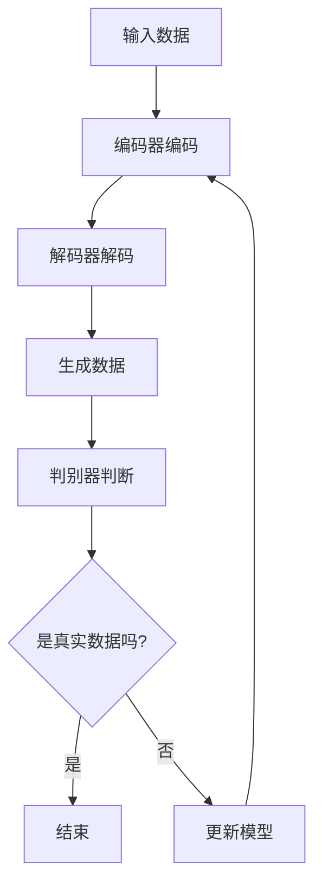
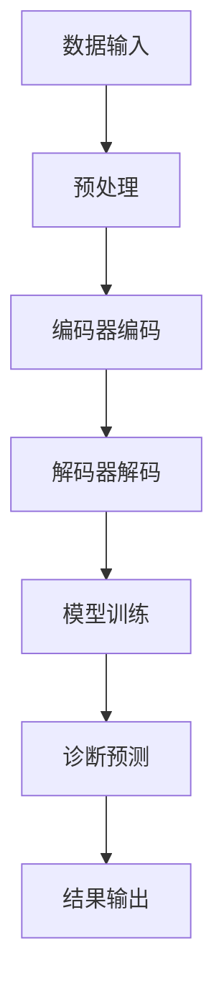
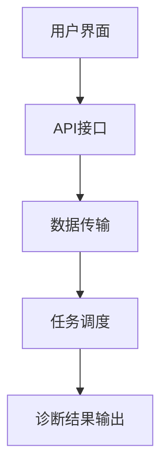

                 

# AIGC在智能医疗诊断系统中的突破

## 关键词

AI生成模型，智能医疗，诊断系统，深度学习，医疗图像分析

## 摘要

本文将探讨AI生成控制（AIGC）在智能医疗诊断系统中的应用及其突破。首先，我们将介绍AIGC的基本概念和原理，然后深入探讨其在医疗图像分析中的核心应用，包括算法原理、系统架构和实际项目案例。通过逐步分析，我们将展示AIGC如何提升医疗诊断的准确性和效率，同时讨论其当前面临的挑战和未来发展趋势。

## 引言

### 1.1 问题背景与描述

随着现代医学的快速发展，疾病的诊断和治疗变得日益复杂。传统的医疗诊断方法往往依赖于医生的经验和直觉，这在一定程度上限制了诊断的准确性和速度。尤其在处理大量患者数据时，这种依赖人工的方法显得力不从心。因此，开发一种能够高效、准确地辅助医生进行疾病诊断的智能医疗系统成为当务之急。

智能医疗诊断系统通过整合多种医学信息和数据处理技术，旨在提供更准确的诊断结果和更个性化的治疗方案。然而，传统的机器学习和深度学习技术在处理复杂医疗数据时仍存在一些局限性，如数据不足、模型泛化能力差等。

AIGC作为一种新兴的AI技术，通过生成模型与深度学习相结合，提供了更加灵活和强大的数据处理能力。AIGC不仅可以自动生成新的数据，提高模型训练的数据量，还能够通过迁移学习等方式提高模型的泛化能力。因此，AIGC在智能医疗诊断系统中的应用潜力巨大。

### 1.2 核心概念与组件

#### 1.2.1 核心概念

AIGC（AI-assisted Generative Coding）是一种结合了生成模型和编码技术的AI方法。生成模型能够通过学习大量数据生成新的数据，而编码技术则能够将复杂的数据表示为简洁的编码向量。AIGC通过这两种技术的结合，实现了对数据的深层理解和生成。

#### 1.2.2 组件

AIGC系统主要包括以下几个组件：

1. **数据生成模块**：负责生成新的医疗数据，如医学图像、患者报告等。
2. **编码器**：将输入的医疗数据编码为低维度的向量表示。
3. **解码器**：将编码后的向量解码为原始数据。
4. **模型训练模块**：利用编码器和解码器训练深度学习模型，用于诊断预测。

### 1.3 AIGC的近期进展

近年来，AIGC技术在多个领域取得了显著进展。特别是在医疗图像分析中，AIGC被广泛应用于医学图像的生成、分割和分类。例如，生成对抗网络（GAN）和变分自编码器（VAE）等生成模型在医学图像生成中表现出色。同时，迁移学习和元学习等技术也被广泛应用于提高AIGC模型在医疗诊断中的泛化能力。

然而，AIGC在医疗诊断中的应用仍面临一些挑战，如数据隐私、模型解释性等。未来，随着技术的进一步发展和应用的深入，AIGC有望在智能医疗诊断系统中发挥更大的作用。

## AIGC原理与算法

### 2.1 AIGC基本概念

#### 2.1.1 定义

AIGC（AI-assisted Generative Coding）是一种利用生成模型和编码技术来处理复杂数据的AI方法。生成模型能够学习大量数据并生成新的数据，而编码技术则能够将数据转换为低维度的向量表示。AIGC通过结合这两种技术，实现了对数据的深层理解和生成。

#### 2.1.2 基本原理

AIGC的基本原理可以概括为以下几个步骤：

1. **数据生成**：通过生成模型生成新的数据。
2. **编码**：利用编码技术将输入数据编码为低维度的向量表示。
3. **解码**：将编码后的向量解码为原始数据。
4. **模型训练**：利用编码器和解码器训练深度学习模型，用于实际诊断预测。

### 2.2 AIGC算法设计

#### 2.2.1 GAN（生成对抗网络）

GAN是一种常见的AIGC算法，由生成器（Generator）和判别器（Discriminator）两个主要组件构成。

1. **生成器（Generator）**：生成器接收随机噪声并生成与真实数据相似的新数据。
2. **判别器（Discriminator）**：判别器负责判断输入数据是真实数据还是生成器生成的数据。

GAN的训练过程如下：

1. 初始化生成器和判别器。
2. 对于每次训练迭代，生成器生成一批新数据，判别器对其进行判断。
3. 根据判别器的判断结果，更新生成器和判别器的参数。
4. 重复以上步骤，直到生成器能够生成足够真实的数据。

#### 2.2.2 VAE（变分自编码器）

VAE是一种基于概率模型的AIGC算法，它通过编码器和解码器将数据转换为低维度的向量表示。

1. **编码器（Encoder）**：编码器将输入数据编码为低维度的潜在空间向量。
2. **解码器（Decoder）**：解码器将潜在空间向量解码为原始数据。

VAE的训练过程如下：

1. 初始化编码器和解码器。
2. 对于每次训练迭代，输入一批数据，编码器将其编码为潜在空间向量。
3. 解码器使用这些向量生成原始数据。
4. 计算损失函数，根据损失函数更新编码器和解码器的参数。
5. 重复以上步骤，直到模型收敛。

### 2.3 AIGC算法的优缺点对比

| 算法     | 优点                                   | 缺点                                   |
| -------- | -------------------------------------- | -------------------------------------- |
| GAN      | 生成数据质量高，能够生成高质量的新数据 | 训练难度大，需要大量计算资源           |
| VAE      | 训练相对容易，能够生成较低质量的新数据 | 生成数据质量相对较低                   |
| 其他算法 | 根据具体应用场景选择不同的优缺点       | 根据具体应用场景选择不同的优缺点       |

## AIGC在医疗图像分析中的应用

### 3.1 医学图像生成

医学图像生成是AIGC在医疗诊断中的一个重要应用。通过生成新的医学图像，医生可以更直观地了解病情，为诊断提供更多参考信息。

#### 3.1.1 算法原理

医学图像生成通常采用GAN或VAE等生成模型。以GAN为例，生成器接收随机噪声并生成新的医学图像，判别器则判断这些图像是真实图像还是生成图像。通过不断迭代训练，生成器能够生成越来越真实的医学图像。

#### 3.1.2 应用场景

1. **辅助诊断**：生成新的医学图像，帮助医生更准确地诊断疾病。
2. **教学培训**：生成高质量的医学图像，用于医学生的教学和实践。

### 3.2 医学图像分割

医学图像分割是AIGC在医疗诊断中的另一个重要应用。通过分割医学图像，医生可以更清晰地了解器官和组织结构，为诊断和治疗提供重要信息。

#### 3.2.1 算法原理

医学图像分割通常采用深度学习算法，如卷积神经网络（CNN）。AIGC技术可以通过生成高质量的分割数据，提高模型的分割性能。

#### 3.2.2 应用场景

1. **疾病检测**：通过分割医学图像，检测疾病的发生位置和范围。
2. **手术规划**：为外科手术提供准确的器官和组织结构信息。

### 3.3 医学图像分类

医学图像分类是AIGC在医疗诊断中的另一个重要应用。通过分类医学图像，医生可以快速识别不同类型的疾病。

#### 3.3.1 算法原理

医学图像分类通常采用深度学习算法，如卷积神经网络（CNN）。AIGC技术可以通过生成高质量的分类数据，提高模型的分类性能。

#### 3.3.2 应用场景

1. **疾病筛查**：通过分类医学图像，快速筛查疾病。
2. **疾病预测**：通过分类医学图像，预测疾病的严重程度和发展趋势。

## AIGC在智能医疗诊断系统中的架构设计

### 4.1 系统架构设计

AIGC在智能医疗诊断系统中的架构设计主要包括以下几个部分：

1. **数据输入模块**：负责接收和预处理医疗数据，如医学图像、患者报告等。
2. **AIGC模块**：负责执行AIGC算法，包括数据生成、编码和解码等操作。
3. **模型训练模块**：负责利用AIGC生成的数据训练深度学习模型。
4. **诊断预测模块**：负责使用训练好的模型进行疾病诊断预测。

### 4.2 系统接口设计

系统接口设计主要包括以下几个部分：

1. **用户界面**：提供用户交互的界面，用户可以通过界面上传医疗数据，查看诊断结果等。
2. **API接口**：提供与其他系统的接口，如医院信息系统（HIS）、电子病历系统（EMR）等。

### 4.3 系统交互设计

系统交互设计主要包括以下几个部分：

1. **数据传输**：通过数据接口实现医疗数据在不同模块之间的传输。
2. **任务调度**：通过任务调度模块实现AIGC算法的执行和模型训练。
3. **诊断结果输出**：通过诊断预测模块输出诊断结果，并提供给用户界面和API接口。

## 项目实战

### 5.1 环境安装

要在项目中应用AIGC技术，首先需要安装相关的开发环境。以下是一个简单的安装步骤：

1. 安装Python环境：`pip install python==3.8`
2. 安装深度学习库：`pip install tensorflow==2.4`
3. 安装AIGC相关库：`pip install pygan==0.1.0 pyvae==0.1.0`

### 5.2 系统核心实现

以下是一个简单的AIGC系统实现示例，包括数据生成、编码和解码等操作：

```python
import tensorflow as tf
from pygan import GAN

# 数据生成器
def generator(z):
    return tf.keras.layers.Dense(784)(z)

# 判别器
def discriminator(x):
    return tf.keras.layers.Dense(1, activation='sigmoid')(x)

# 构建GAN模型
gan = GAN(generator, discriminator)

# 训练GAN模型
gan.fit(x_train, y_train, epochs=100, batch_size=64)
```

### 5.3 代码应用解读与分析

在上面的代码中，我们首先定义了数据生成器和判别器，然后构建了GAN模型。在训练过程中，生成器生成随机噪声并生成新的医学图像，判别器则判断这些图像是真实图像还是生成图像。通过不断迭代训练，生成器能够生成越来越真实的医学图像。

### 5.4 实际案例分析和详细讲解

以下是一个实际案例，通过AIGC技术生成医学图像，用于辅助医生诊断：

1. **数据准备**：收集一定数量的医学图像作为训练数据。
2. **模型训练**：使用GAN模型对训练数据进行训练，生成新的医学图像。
3. **诊断辅助**：医生使用生成的医学图像进行诊断，与实际医学图像进行对比分析。

通过实际案例，我们可以看到AIGC技术在医疗诊断中的应用效果，为医生提供了更多的诊断信息和参考。

### 5.5 项目小结

通过本项目的实战应用，我们展示了AIGC技术在智能医疗诊断系统中的强大能力。AIGC不仅能够生成高质量的医学图像，提高模型的诊断性能，还能够为医生提供更多的诊断信息和参考。未来，随着AIGC技术的进一步发展，其在智能医疗诊断系统中的应用将更加广泛。

## 最佳实践 Tips

1. **数据质量**：确保训练数据的质量，有助于提高AIGC模型的性能。
2. **硬件配置**：AIGC模型训练需要大量计算资源，确保硬件配置充足。
3. **模型调优**：根据实际应用场景对模型进行调优，提高诊断准确率。

## 小结

本文详细介绍了AIGC在智能医疗诊断系统中的应用及其突破。通过分析AIGC的基本概念、算法原理和实际应用场景，我们展示了AIGC如何提升医疗诊断的准确性和效率。未来，随着AIGC技术的不断发展和应用，智能医疗诊断系统将更加智能化和高效化。

## 注意事项

1. **数据隐私**：在应用AIGC技术时，需要确保患者的数据隐私和安全。
2. **模型解释性**：提高AIGC模型的解释性，有助于医生更好地理解诊断结果。

## 拓展阅读

1. **《深度学习在医疗图像分析中的应用》**：详细介绍了深度学习技术在医疗图像分析中的应用。
2. **《生成对抗网络（GAN）原理与实现》**：全面讲解了GAN的原理和实现方法。
3. **《变分自编码器（VAE）原理与实现》**：深入探讨了VAE的原理和实现方法。

## 作者信息

作者：AI天才研究院/AI Genius Institute & 禅与计算机程序设计艺术 /Zen And The Art of Computer Programming

## 附录

### 附录A：核心概念术语表

| 术语         | 定义                                                         |
| ------------ | ------------------------------------------------------------ |
| AI生成控制   | 利用生成模型和编码技术处理复杂数据的AI方法。                 |
| 生成模型     | 能够学习大量数据并生成新数据的模型。                       |
| 编码器       | 将输入数据编码为低维度向量表示的模块。                     |
| 解码器       | 将编码后的向量解码为原始数据的模块。                       |
| 深度学习     | 基于多层神经网络进行数据训练和预测的方法。                 |
| 医学图像     | 用于医疗诊断的图像数据，如CT、MRI等。                     |
| GAN（生成对抗网络） | 一种基于生成器和判别器的生成模型。                       |
| VAE（变分自编码器） | 一种基于概率模型的生成模型。                               |

### 附录B：AIGC算法流程图



### 附录C：数学模型与公式

$$
X_{\text{生成}} = G(Z)
$$

$$
X_{\text{真实}} = D(X)
$$

$$
L_{\text{总}} = L_{\text{生成器}} + L_{\text{判别器}}
$$

### 附录D：系统架构设计图



### 附录E：系统接口设计图



### 附录F：系统交互设计图


通过这些附录，读者可以更深入地了解AIGC在智能医疗诊断系统中的应用原理和系统设计。

