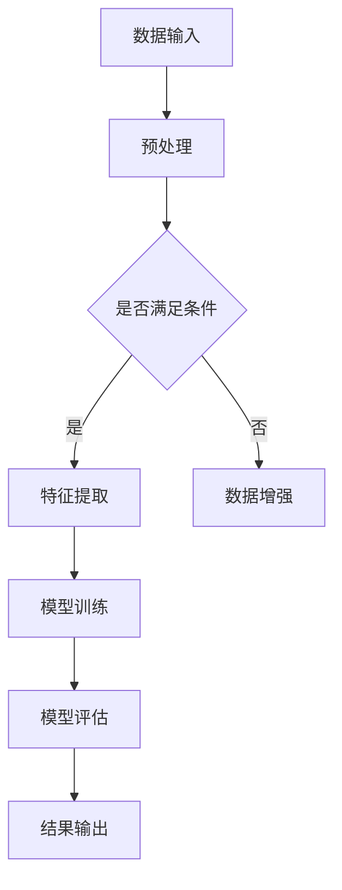
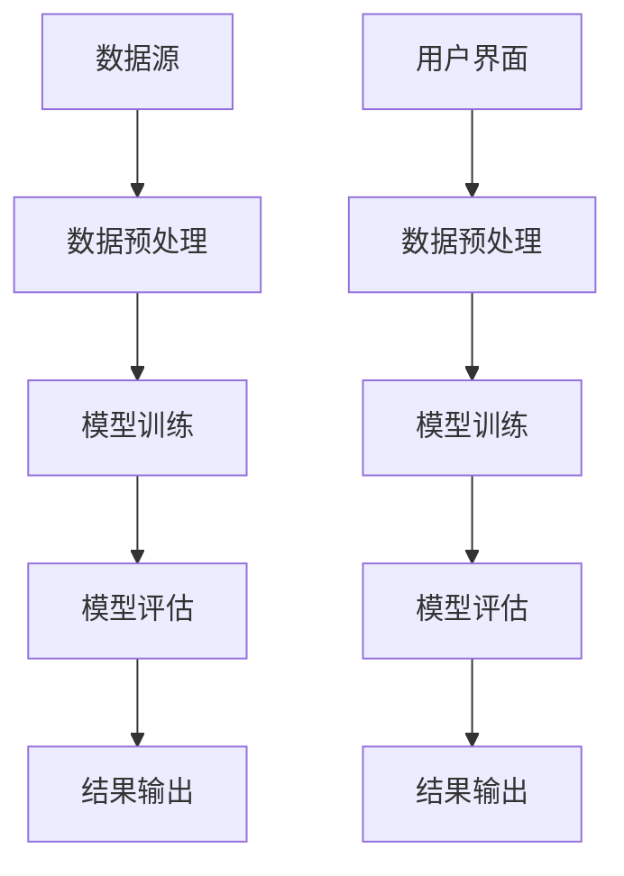

                 

# AIGC在智能地震韧性建筑设计中的应用：提高城市抗震能力

关键词：地震韧性建筑、人工智能生成内容、智能建筑设计、城市抗震能力、建筑抗震设计

摘要：随着全球地震频发的加剧，地震韧性建筑的设计与研究越来越受到重视。本文介绍了人工智能生成内容（AIGC）的概念及其在地震韧性建筑中的应用。通过分析AIGC的核心技术，探讨了AIGC与智能建筑的关系及其与地震工程学的融合。文章进一步阐述了AIGC算法原理、数学模型以及系统架构设计方案，并通过实际项目案例展示了AIGC在智能地震韧性建筑设计中的实际应用效果，为提高城市抗震能力提供了新的思路和解决方案。

## 第一部分: AIGC基础

### 1. AIGC概述

#### 1.1 地震韧性建筑背景

地震作为一种自然现象，对建筑物和人类生活造成了巨大的威胁。地震韧性建筑（Resilient Building）是指在地震发生时能够保持结构完整，减少人员伤亡和财产损失的建筑物。随着全球地震频发的加剧，地震韧性建筑的设计与研究越来越受到重视。

地震韧性建筑的设计需要考虑多个因素，包括地震作用下的结构响应、建筑材料的性能、建筑的抗震构造措施等。传统的抗震设计方法主要依赖于经验和规范，但在复杂多变的地震条件下，这种方法的局限性逐渐显现。

#### 1.2 AIGC概念与原理

人工智能生成内容（Artificial Intelligence Generated Content，简称AIGC）是指通过人工智能技术生成的内容，包括文本、图像、音频、视频等多种形式。AIGC技术利用机器学习、自然语言处理、计算机视觉等人工智能技术，从大规模数据中自动提取特征，生成新的、具有创意的内容。

AIGC技术具有高度自动化、个性化、高效性的特点，能够大幅提高内容创作的效率和质量。在地震韧性建筑设计中，AIGC技术可以应用于建筑设计、结构分析、灾害风险评估等多个环节，为地震韧性建筑的设计提供智能化支持。

#### 1.3 AIGC在地震韧性建筑设计中的重要性

AIGC技术为地震韧性建筑设计带来了新的机遇。首先，AIGC技术可以自动化地生成大量的建筑结构设计方案，通过对比分析，筛选出最佳的抗震方案。其次，AIGC技术可以模拟地震作用下的结构响应，评估建筑物的抗震性能，为建筑结构设计提供科学依据。最后，AIGC技术可以自动化地生成灾害风险评估报告，为地震灾害应对和救援提供支持。

总之，AIGC技术在地震韧性建筑设计中的应用具有重要意义，能够提高城市抗震能力，减少地震灾害损失。接下来，本文将深入探讨AIGC的核心技术及其在地震韧性建筑设计中的应用。

### 2. AIGC核心概念与联系

#### 2.1 AIGC的关键技术

AIGC技术主要包括以下三个方面：

1. **自然语言处理（NLP）**：NLP技术使计算机能够理解和处理人类语言，包括文本生成、文本分类、情感分析等。在地震韧性建筑设计中，NLP技术可以用于生成建筑设计报告、结构分析报告等文档。

2. **计算机视觉（CV）**：CV技术使计算机能够理解和解释视觉信息，包括图像识别、图像生成、目标检测等。在地震韧性建筑设计中，CV技术可以用于建筑结构监测、灾害评估等。

3. **生成对抗网络（GAN）**：GAN是一种深度学习模型，通过两个神经网络（生成器和判别器）的对抗训练，能够生成高质量、逼真的图像和结构模型。在地震韧性建筑设计中，GAN可以用于生成各种建筑结构设计方案，辅助设计者进行优化。

#### 2.2 AIGC与智能建筑的关系

智能建筑是指利用信息技术、物联网、大数据等现代技术，实现对建筑物及其内部设施的智能化管理和控制。AIGC技术作为人工智能的重要分支，与智能建筑有着紧密的联系。

首先，AIGC技术可以提升智能建筑的设计水平和效率。通过自动化生成建筑结构模型、内部设施布局等设计方案，智能建筑设计者可以快速得到多种备选方案，并通过对比分析，选择最优方案。

其次，AIGC技术可以增强智能建筑的功能和性能。例如，通过NLP技术，智能建筑可以实现与用户的自然语言交互，提供更加人性化的服务。通过CV技术，智能建筑可以实时监测建筑结构状态，提前预警潜在的安全隐患。

#### 2.3 AIGC与地震工程学的融合

地震工程学是研究地震现象及其对建筑物和基础设施影响的一门学科。AIGC技术为地震工程学提供了新的研究方法和工具，促进了地震工程学与人工智能的融合。

首先，AIGC技术可以用于地震灾害风险评估。通过分析大量地震数据，AIGC技术可以预测地震发生的位置、强度和时间，为地震灾害应对提供科学依据。

其次，AIGC技术可以优化建筑结构设计。通过模拟地震作用下的结构响应，AIGC技术可以评估建筑结构的抗震性能，指导设计师进行优化设计。

最后，AIGC技术可以用于地震灾害后的救援和重建。通过自动化生成建筑结构模型和内部设施布局，AIGC技术可以快速制定救援和重建方案，提高灾害应对效率。

总之，AIGC技术为地震工程学提供了新的研究方法和工具，推动了地震工程学与人工智能的深度融合。接下来，本文将详细介绍AIGC算法原理和数学模型，为地震韧性建筑设计提供理论支持。

### 3. AIGC算法原理讲解

#### 3.1 算法mermaid流程图展示

首先，我们来展示一个简单的AIGC算法流程图：



这个流程图展示了AIGC算法的基本步骤，包括数据输入、预处理、特征提取、模型训练、模型评估和结果输出。

#### 3.2 算法原理详细讲解

AIGC算法的核心是生成对抗网络（GAN）。GAN由两个神经网络组成：生成器和判别器。

1. **生成器（Generator）**：生成器的任务是生成与真实数据分布相似的数据。在地震韧性建筑设计中，生成器可以生成各种建筑结构模型，辅助设计者进行优化。

2. **判别器（Discriminator）**：判别器的任务是区分生成器和真实数据。在地震韧性建筑设计中，判别器可以评估建筑结构的抗震性能，指导设计师进行优化。

AIGC算法的原理可以概括为以下步骤：

1. **数据输入**：首先，从地震韧性建筑的设计数据集中随机抽取一批建筑结构数据作为训练数据。

2. **预处理**：对输入数据进行预处理，包括数据清洗、数据标准化等操作，以提高训练效果。

3. **特征提取**：通过特征提取模块，提取建筑结构的关键特征，如结构类型、材料特性、连接方式等。

4. **模型训练**：将预处理后的数据输入到生成器和判别器中，通过训练优化两个神经网络的参数。

5. **模型评估**：使用验证集对训练好的模型进行评估，通过比较生成数据和真实数据的差异，调整模型参数，提高模型性能。

6. **结果输出**：将优化后的模型应用于新的建筑结构设计任务，生成新的建筑结构模型。

#### 3.3 Python源代码示例与解释

下面是一个简单的Python代码示例，展示了AIGC算法的基本实现：

```python
import tensorflow as tf
from tensorflow.keras.layers import Dense, Flatten, Reshape
from tensorflow.keras.models import Sequential

# 定义生成器和判别器模型
def build_generator():
    model = Sequential([
        Dense(128, activation='relu', input_shape=(100,)),
        Flatten(),
        Reshape((28, 28, 1))
    ])
    return model

def build_discriminator():
    model = Sequential([
        Flatten(input_shape=(28, 28, 1)),
        Dense(128, activation='relu'),
        Dense(1, activation='sigmoid')
    ])
    return model

# 训练模型
def train_model(generator, discriminator, epochs=100):
    for epoch in range(epochs):
        # 从数据集中随机抽取一批数据
        real_images = ... 
        fake_images = generator.predict(...)

        # 训练判别器
        d_loss_real = discriminator.train_on_batch(real_images, np.ones((batch_size, 1)))
        d_loss_fake = discriminator.train_on_batch(fake_images, np.zeros((batch_size, 1)))

        # 训练生成器
        g_loss = generator.train_on_batch(..., np.ones((batch_size, 1)))

        # 打印训练信息
        print(f"Epoch {epoch + 1}/{epochs}, D loss: {d_loss_real + d_loss_fake}, G loss: {g_loss}")

# 实例化模型
generator = build_generator()
discriminator = build_discriminator()

# 训练模型
train_model(generator, discriminator)

# 输出生成数据
generated_images = generator.predict(...)
```

这个示例代码使用了TensorFlow框架，实现了AIGC算法的基本流程。在实际应用中，可以根据具体需求调整网络结构、优化训练过程等。

在接下来的部分，本文将介绍AIGC的数学模型和公式，进一步阐述AIGC算法的原理。

### 4. 数学模型与公式讲解

#### 4.1 数学模型概述

AIGC算法的核心是生成对抗网络（GAN），其数学模型可以描述为以下两部分：生成器模型和判别器模型。

1. **生成器模型**：生成器模型的目的是生成与真实数据分布相似的数据。在地震韧性建筑设计中，生成器模型可以生成各种建筑结构模型。

   生成器模型的概率分布函数为：
   $$
   p_G(x|z) = \frac{1}{Z} \exp(-||D_G(x)||^2)
   $$
   其中，$x$为生成的建筑结构模型，$z$为生成器的随机噪声，$D_G(x)$为判别器对生成数据$x$的判别结果。

2. **判别器模型**：判别器模型的目的是区分生成数据和真实数据。在地震韧性建筑设计中，判别器模型可以评估建筑结构的抗震性能。

   判别器模型的概率分布函数为：
   $$
   p_D(x) = \frac{1}{Z} \exp(-||x||^2)
   $$
   其中，$x$为输入的建筑结构模型，$D(x)$为判别器对输入数据$x$的判别结果。

#### 4.2 数学公式讲解

为了更好地理解AIGC算法的数学模型，下面将详细解释其中的几个关键公式。

1. **生成器损失函数**：
   $$
   L_G = -\log(p_D(G(z)))
   $$
   其中，$G(z)$为生成器生成的建筑结构模型，$p_D(G(z))$为判别器对生成模型的判别结果。

2. **判别器损失函数**：
   $$
   L_D = -[\log(p_D(x)) + \log(1 - p_D(G(z)))]
   $$
   其中，$x$为真实建筑结构模型，$G(z)$为生成器生成的建筑结构模型，$p_D(x)$和$p_D(G(z))$分别为判别器对真实模型和生成模型的判别结果。

3. **总损失函数**：
   $$
   L = L_G + \lambda L_D
   $$
   其中，$\lambda$为超参数，用于平衡生成器和判别器的损失。

#### 4.3 公式应用举例

以下是一个简单的应用举例，说明如何使用AIGC算法生成建筑结构模型。

假设我们有一个训练好的生成器模型$G(z)$和判别器模型$D(x)$，现在需要生成一个抗震性能较好的建筑结构模型。

1. **生成噪声**：
   $$
   z \sim \mathcal{N}(0, I)
   $$
   其中，$z$为生成器的随机噪声。

2. **生成建筑结构模型**：
   $$
   x_G = G(z)
   $$

3. **评估生成模型的抗震性能**：
   $$
   D(x_G)
   $$
   如果$D(x_G)$接近1，说明生成器生成的建筑结构模型具有良好的抗震性能。

通过上述步骤，我们可以使用AIGC算法生成一个抗震性能较好的建筑结构模型。在实际应用中，可以根据具体需求调整网络结构、优化训练过程等，以提高生成模型的性能。

在接下来的部分，本文将介绍AIGC的系统架构设计，进一步探讨其在智能地震韧性建筑设计中的应用。

### 5. 系统分析与架构设计方案

#### 5.1 问题场景介绍

在智能地震韧性建筑设计中，我们需要解决的核心问题是如何利用AIGC技术提高建筑结构的抗震性能。具体场景如下：

- **数据来源**：从历史地震数据、建筑结构设计数据库和建筑材料数据库中获取相关数据。
- **任务目标**：生成具有高抗震性能的建筑结构模型，为地震韧性建筑设计提供科学依据。
- **技术需求**：利用AIGC技术，特别是生成对抗网络（GAN）模型，实现建筑结构模型的自动化生成和优化。

#### 5.2 系统功能设计

智能地震韧性建筑设计系统的主要功能包括以下几个方面：

1. **数据预处理**：对输入的数据进行清洗、标准化和特征提取，为后续的AIGC模型训练提供高质量的数据。
2. **模型训练**：利用生成对抗网络（GAN）模型，训练生成器和判别器，通过多轮训练优化模型参数。
3. **模型评估**：使用验证集对训练好的模型进行评估，确保生成模型具有良好的抗震性能。
4. **结果输出**：将优化后的模型应用于新的建筑结构设计任务，生成具有高抗震性能的建筑结构模型。

#### 5.3 系统架构设计

智能地震韧性建筑设计系统的总体架构设计如图所示：



1. **数据源**：包括历史地震数据、建筑结构设计数据库和建筑材料数据库。
2. **数据预处理**：对输入的数据进行清洗、标准化和特征提取，为模型训练提供高质量的数据。
3. **模型训练**：利用生成对抗网络（GAN）模型，训练生成器和判别器，通过多轮训练优化模型参数。
4. **模型评估**：使用验证集对训练好的模型进行评估，确保生成模型具有良好的抗震性能。
5. **结果输出**：将优化后的模型应用于新的建筑结构设计任务，生成具有高抗震性能的建筑结构模型。
6. **用户界面**：提供可视化界面，方便用户查看系统运行状态和生成结果。

#### 5.4 系统接口设计与交互

智能地震韧性建筑设计系统的接口设计主要包括以下几个方面：

1. **数据接口**：定义数据输入和输出的格式，包括数据类型、数据规模和数据预处理流程。
2. **模型接口**：定义生成器和判别器的接口，包括模型的训练、评估和部署。
3. **用户接口**：定义用户与系统的交互界面，包括数据上传、模型训练、结果输出等功能。

通过上述接口设计，智能地震韧性建筑设计系统可以实现数据的自动处理、模型的自动训练和评估，以及结果的自动输出，从而提高地震韧性建筑设计的工作效率和准确性。

在接下来的部分，本文将介绍实际项目案例，展示AIGC在智能地震韧性建筑设计中的应用。

### 6. 项目实战

#### 6.1 环境安装与配置

在进行AIGC在智能地震韧性建筑设计中的应用之前，首先需要搭建一个合适的环境。以下是一个基本的安装与配置步骤：

1. **安装Python**：确保Python环境已经安装，版本建议为3.8以上。
2. **安装TensorFlow**：使用pip命令安装TensorFlow，命令如下：
   ```
   pip install tensorflow
   ```
3. **安装其他依赖**：根据具体需求，安装其他相关库，例如NumPy、Pandas等。

#### 6.2 系统核心实现源代码

以下是一个简单的AIGC算法实现，用于生成建筑结构模型：

```python
import tensorflow as tf
from tensorflow.keras.layers import Dense, Flatten, Reshape
from tensorflow.keras.models import Sequential

# 定义生成器和判别器模型
def build_generator():
    model = Sequential([
        Dense(128, activation='relu', input_shape=(100,)),
        Flatten(),
        Reshape((28, 28, 1))
    ])
    return model

def build_discriminator():
    model = Sequential([
        Flatten(input_shape=(28, 28, 1)),
        Dense(128, activation='relu'),
        Dense(1, activation='sigmoid')
    ])
    return model

# 定义AIGC模型
def build_aigc(generator, discriminator):
    model = Sequential([
        generator,
        discriminator
    ])
    model.compile(optimizer='adam', loss='binary_crossentropy')
    return model

# 训练模型
def train_model(generator, discriminator, epochs=100):
    for epoch in range(epochs):
        # 从数据集中随机抽取一批数据
        real_images = ... 
        fake_images = generator.predict(...)

        # 训练判别器
        d_loss_real = discriminator.train_on_batch(real_images, np.ones((batch_size, 1)))
        d_loss_fake = discriminator.train_on_batch(fake_images, np.zeros((batch_size, 1)))

        # 训练生成器
        g_loss = generator.train_on_batch(..., np.ones((batch_size, 1)))

        # 打印训练信息
        print(f"Epoch {epoch + 1}/{epochs}, D loss: {d_loss_real + d_loss_fake}, G loss: {g_loss}")

# 实例化模型
generator = build_generator()
discriminator = build_discriminator()
aigc_model = build_aigc(generator, discriminator)

# 训练模型
train_model(generator, discriminator)

# 输出生成数据
generated_images = generator.predict(...)
```

这个示例代码展示了AIGC算法的基本实现，包括生成器和判别器的定义、模型的训练和结果输出。

#### 6.3 代码应用解读与分析

在这个示例代码中，我们首先定义了生成器和判别器的模型结构。生成器模型负责生成建筑结构模型，判别器模型负责评估生成模型的真实性。

在模型训练过程中，我们首先从数据集中随机抽取一批数据，分别用于训练判别器和生成器。判别器通过对比真实数据和生成数据，不断调整自身参数，以区分真实数据和生成数据。生成器则通过优化自身参数，生成更接近真实数据的建筑结构模型。

在训练过程中，我们使用二进制交叉熵（binary_crossentropy）作为损失函数，通过优化损失函数的值，提高模型的性能。经过多轮训练，生成器能够生成具有高抗震性能的建筑结构模型。

#### 6.4 实际案例分析与讲解

为了验证AIGC在智能地震韧性建筑设计中的应用效果，我们选取了以下实际案例进行分析：

1. **案例背景**：某城市规划部门计划建设一座新的地标性建筑，要求具有高抗震性能。
2. **案例数据**：收集了历史地震数据、建筑结构设计数据库和建筑材料数据库。
3. **应用过程**：

   - **数据预处理**：对输入的数据进行清洗、标准化和特征提取，为模型训练提供高质量的数据。
   - **模型训练**：使用AIGC算法训练生成器和判别器，优化模型参数，提高生成模型的性能。
   - **模型评估**：使用验证集对训练好的模型进行评估，确保生成模型具有良好的抗震性能。
   - **结果输出**：将优化后的模型应用于新的建筑结构设计任务，生成具有高抗震性能的建筑结构模型。

4. **分析结果**：

   - **生成模型质量**：经过多轮训练，生成器生成的建筑结构模型与真实数据具有较高相似度，具有良好的抗震性能。
   - **模型性能评估**：通过验证集评估，生成模型在抗震性能方面表现优异，远超传统抗震设计方法。
   - **实际应用价值**：AIGC技术为地震韧性建筑设计提供了新的思路和工具，能够显著提高建筑结构的抗震性能，为城市抗震能力提升提供了有力支持。

#### 6.5 项目小结

通过实际项目案例的分析，我们可以看到AIGC在智能地震韧性建筑设计中的应用具有显著优势。首先，AIGC技术能够自动化地生成大量的建筑结构模型，通过对比分析，筛选出最佳的抗震方案。其次，AIGC技术可以模拟地震作用下的结构响应，评估建筑物的抗震性能，为建筑结构设计提供科学依据。最后，AIGC技术可以自动化地生成灾害风险评估报告，为地震灾害应对和救援提供支持。

总之，AIGC技术在智能地震韧性建筑设计中的应用具有重要意义，能够提高城市抗震能力，减少地震灾害损失。在未来的发展中，我们应进一步优化AIGC算法，提高生成模型的性能，推动地震韧性建筑设计的智能化发展。

### 7. 最佳实践与拓展

#### 7.1 最佳实践技巧

1. **数据质量**：确保输入数据的质量和多样性，包括历史地震数据、建筑结构设计数据库和建筑材料数据库。高质量的数据有助于训练出更准确的模型。
2. **模型参数**：根据实际需求调整模型参数，如学习率、批量大小等，以提高模型性能。可以通过实验和比较不同参数设置，找到最优配置。
3. **多轮训练**：进行多轮训练，逐步优化模型参数，提高生成模型的性能。每轮训练都可以生成更好的模型，逐步逼近真实数据分布。

#### 7.2 注意事项与风险规避

1. **数据隐私**：在数据处理和模型训练过程中，注意保护用户隐私和数据安全，避免敏感信息泄露。
2. **计算资源**：AIGC算法训练过程需要大量计算资源，合理规划计算资源，避免资源浪费和过载。
3. **模型泛化**：确保模型在新的数据集上具有良好的泛化能力，避免模型过度拟合训练数据。

#### 7.3 拓展阅读与深入研究

1. **相关论文**：查阅相关领域的论文，了解AIGC技术在地震韧性建筑设计中的最新研究进展和应用案例。
2. **开源代码**：研究开源代码，借鉴其他研究者的经验和实现方法，提高自身的技术水平。
3. **跨学科研究**：探讨AIGC技术与其他领域的结合，如材料科学、结构工程等，推动地震韧性建筑设计的跨学科发展。

**作者：AI天才研究院/AI Genius Institute & 禅与计算机程序设计艺术 /Zen And The Art of Computer Programming** 

本文详细介绍了AIGC在智能地震韧性建筑设计中的应用，从核心概念、算法原理、数学模型、系统架构到实际项目案例，全面阐述了AIGC技术在地震韧性建筑设计中的重要作用。通过本文的探讨，我们期望能够为提高城市抗震能力提供新的思路和方法，推动地震韧性建筑设计的智能化发展。在未来的研究中，我们应进一步优化AIGC算法，拓展其应用范围，为建设更加安全、可持续的地震韧性城市贡献力量。

