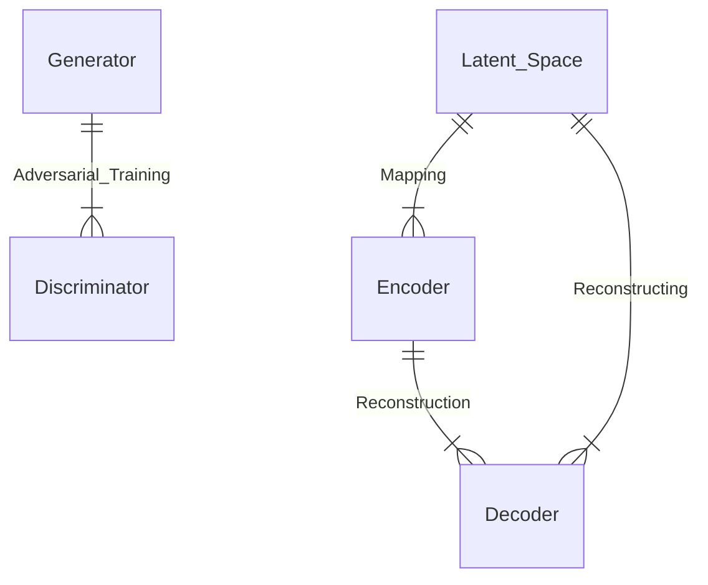

                 

### AIGC in the Frontier Applications of Smart Urban Planning

#### Keywords: AIGC, Smart Urban Planning, Artificial Intelligence, Deep Learning, Urban Analytics

#### Abstract:  
This article delves into the cutting-edge applications of Automated Image Generation through AI (AIGC) in the field of smart urban planning. As cities continue to grow and urbanization becomes a global challenge, the integration of AI and advanced technologies is crucial for sustainable urban development. The article provides a comprehensive overview of AIGC, its fundamental concepts, and its applications in urban planning, emphasizing the role of AIGC in addressing challenges such as traffic management, environmental monitoring, and public service optimization. Through case studies and practical examples, it explores the potential of AIGC to transform urban landscapes and offers insights into future trends and ethical considerations. By the end of this article, readers will gain a deeper understanding of how AIGC is revolutionizing smart urban planning and shaping the future of cities.

---

### Introduction to AIGC and Smart Urban Planning

#### 1.1 Background of AIGC

Automated Image Generation through AI (AIGC) is an emerging field that leverages advanced artificial intelligence techniques to generate images automatically. AIGC has gained significant attention in recent years due to its potential applications in various domains, including art, entertainment, gaming, and, more importantly, urban planning.

The concept of AIGC is rooted in deep learning, specifically generative adversarial networks (GANs). GANs consist of two neural networks: a generator and a discriminator. The generator creates images, while the discriminator evaluates their authenticity. The generator and discriminator play a game, where the generator tries to create images that fool the discriminator, and the discriminator tries to identify the fake images. Over time, this adversarial process improves the quality and realism of the generated images.

AIGC has evolved from simple image generation tasks to complex scenarios involving 3D models, videos, and even text-to-image translation. The primary goal of AIGC is to create high-quality, realistic images that can be used for various purposes, such as virtual reality, augmented reality, and urban planning.

#### 1.2 Evolution of Smart Urban Planning

Smart urban planning has come a long way since its inception. The concept of a "smart city" originated in the late 20th century when cities began adopting advanced technologies to improve efficiency, sustainability, and quality of life. Early smart urban planning initiatives focused on the integration of information and communication technologies (ICT) to enhance urban infrastructure and services.

The development of wireless communication, the internet, and IoT (Internet of Things) devices has revolutionized smart urban planning. Today, smart cities are equipped with sensors, data analytics, and AI algorithms to collect, process, and analyze massive amounts of data in real-time. This data-driven approach enables cities to make informed decisions, optimize resource allocation, and improve the overall quality of life for residents.

The evolution of smart urban planning can be summarized in three phases:

1. **Data Collection and Integration**: In the early stages, cities focused on collecting and integrating data from various sources, such as traffic cameras, weather stations, and public transportation systems. This data was used to gain insights into urban dynamics and identify areas for improvement.

2. **Data Analytics and Decision Support**: As data collection capabilities improved, cities started leveraging data analytics and AI algorithms to analyze the collected data. This enabled them to make data-driven decisions, optimize urban infrastructure, and improve service delivery.

3. **AI-Enabled Smart Urban Planning**: The most recent phase involves the integration of AI and advanced technologies, such as AIGC, to revolutionize urban planning. AIGC can be used to generate realistic urban landscapes, simulate scenarios, and optimize urban design.

#### 1.3 Challenges and Opportunities in Urban Planning

Urban planning faces several challenges, including population growth, environmental concerns, and infrastructure management. These challenges necessitate the adoption of innovative technologies and approaches to address them effectively. AIGC offers several opportunities to overcome these challenges and enhance urban planning.

**Challenges in Urban Planning:**

1. **Population Growth**: Rapid urbanization has led to a significant increase in population density, putting pressure on urban infrastructure and services. Efficient urban planning is crucial to accommodate the growing population and maintain quality of life.

2. **Environmental Concerns**: Urbanization has contributed to environmental degradation, including air and water pollution, deforestation, and habitat loss. Smart urban planning aims to mitigate these environmental impacts through sustainable practices and the integration of green infrastructure.

3. **Infrastructure Management**: Urban infrastructure, such as transportation networks, water supply systems, and energy grids, is complex and requires continuous maintenance and upgrades. Efficient infrastructure management is essential to ensure the reliability and sustainability of urban services.

**Opportunities in Urban Planning with AIGC:**

1. **Urban Design Optimization**: AIGC can generate realistic urban landscapes, enabling planners to evaluate and optimize urban designs. This can help in identifying potential issues and improving the overall aesthetics and functionality of urban spaces.

2. **Scenario Simulation**: AIGC can be used to simulate various scenarios, such as traffic congestion, natural disasters, and climate change impacts. These simulations can help planners make informed decisions and develop strategies to mitigate risks.

3. **Resource Allocation**: AIGC can analyze large volumes of data to identify patterns and trends, enabling planners to optimize resource allocation and improve the efficiency of urban services.

4. **Public Participation**: AIGC can be used to create interactive urban planning models, allowing residents to participate in the planning process. This can help in fostering a sense of ownership and engagement among the community.

In summary, AIGC offers a powerful tool for addressing the challenges of urban planning and unlocking new opportunities for sustainable urban development. The next sections of this article will delve deeper into the fundamental concepts of AIGC and explore its applications in smart urban planning.

### Fundamental Concepts of AIGC

#### 2.1 Definition and Classification of AIGC

Automated Image Generation through AI (AIGC) refers to the process of generating images automatically using advanced artificial intelligence techniques, primarily based on deep learning algorithms. AIGC encompasses a wide range of methods and applications, each with its own characteristics and use cases. Understanding the definitions and classifications of AIGC is essential to grasp its potential in the field of smart urban planning.

**Definition of AIGC:**

AIGC involves the use of AI algorithms, particularly generative models, to create new images by learning from existing data. These generative models can be trained on large datasets of images to capture patterns, styles, and structures, and then use this knowledge to generate new, realistic images.

**Classification of AIGC:**

AIGC can be broadly classified into several categories based on the underlying algorithms and their applications:

1. **Generative Adversarial Networks (GANs):** GANs are one of the most popular and effective methods in AIGC. They consist of two neural networks—generator and discriminator—training against each other in an adversarial process. The generator creates images, while the discriminator evaluates their authenticity. The generator's goal is to create images that are indistinguishable from real images, while the discriminator aims to identify the fake images. Over time, this adversarial training improves the quality of the generated images.

2. **Variational Autoencoders (VAEs):** VAEs are another class of generative models that use a different approach compared to GANs. They consist of two parts: an encoder and a decoder. The encoder compresses the input data into a lower-dimensional latent space, while the decoder reconstructs the data from the latent space. VAEs are particularly effective in generating images with a diverse range of styles and structures.

3. **Generative Flow Models:** Generative flow models, such as Normalizing Flows and Autoregressive Models, are another category of AIGC methods. These models use probabilistic transformations to generate images by learning the underlying data distribution. They are often more scalable and computationally efficient than GANs and VAEs.

4. **Image-to-Image Translation:** Image-to-image translation methods aim to transform one image into another image while preserving important features. Examples include style transfer, where the style of one image is applied to another, and image restoration, where degraded or incomplete images are improved.

5. **Text-to-Image Generation:** Text-to-image generation methods translate textual descriptions into corresponding images. This category includes applications such as text-to-photo, text-to-painting, and text-to-3D model generation.

**Advantages and Disadvantages of Different AIGC Methods:**

1. **GANs:**
   - **Advantages:** GANs are versatile and can generate high-quality, realistic images. They are capable of capturing complex patterns and structures in the data.
   - **Disadvantages:** GANs can be challenging to train and may require significant computational resources. They can also suffer from mode collapse, where the generator produces a limited variety of images.

2. **VAEs:**
   - **Advantages:** VAEs are relatively simpler to train and computationally efficient. They are well-suited for generating images with diverse styles and structures.
   - **Disadvantages:** VAEs may produce blurry or less realistic images compared to GANs. They also have limitations in capturing fine details and textures.

3. **Generative Flow Models:**
   - **Advantages:** Generative flow models are scalable and computationally efficient, making them suitable for generating large volumes of images.
   - **Disadvantages:** They may be less effective in capturing fine details and textures compared to GANs and VAEs.

4. **Image-to-Image Translation:**
   - **Advantages:** Image-to-image translation methods can preserve important features and styles from the input images, producing realistic results.
   - **Disadvantages:** They may require extensive training data and can be sensitive to small changes in the input data.

5. **Text-to-Image Generation:**
   - **Advantages:** Text-to-image generation methods enable the creation of images from textual descriptions, offering flexibility and creativity in urban planning.
   - **Disadvantages:** They may struggle with generating high-quality and realistic images, especially when the textual descriptions are ambiguous or incomplete.

In conclusion, understanding the definition and classification of AIGC methods provides a foundation for exploring their applications in smart urban planning. The different methods offer unique advantages and disadvantages, and the choice of method depends on the specific requirements and constraints of the urban planning task at hand.

#### 2.2 Key Technologies and Algorithms in AIGC

AIGC is built on a foundation of key technologies and algorithms, each contributing to the generation of high-quality, realistic images. Understanding these technologies and algorithms is essential for harnessing the full potential of AIGC in smart urban planning. Here, we will delve into the core algorithms and technologies behind AIGC, including Generative Adversarial Networks (GANs), Variational Autoencoders (VAEs), and other advanced methods.

**Generative Adversarial Networks (GANs):**

Generative Adversarial Networks (GANs) are perhaps the most well-known and widely used algorithms in AIGC. GANs consist of two neural networks—the generator and the discriminator—trained in an adversarial setting. The generator takes a random noise vector as input and generates images, while the discriminator evaluates the authenticity of these generated images by distinguishing them from real images.

The training process of GANs can be summarized as follows:

1. **Initialize the Generator and Discriminator:** Both the generator and discriminator are initialized randomly. The generator maps a random noise vector to an image, while the discriminator learns to classify images as real or fake.

2. **Generator Training:** The generator is trained to create images that are indistinguishable from real images. This is achieved by optimizing the generator's parameters to minimize the discriminator's ability to correctly classify the generated images as fake.

3. **Discriminator Training:** The discriminator is trained to distinguish between real and fake images. It learns to maximize its ability to correctly classify images as real or fake. The discriminator is updated using both real images and generated images.

4. **Adversarial Training:** The generator and discriminator are trained simultaneously in an adversarial manner. The generator tries to generate more realistic images to fool the discriminator, while the discriminator tries to improve its ability to identify fake images.

The training process continues iteratively, with the generator and discriminator improving their performance over time. GANs are known for their ability to generate high-quality, realistic images that can resemble real-world scenes, people, and objects. However, GANs can be challenging to train and may require significant computational resources.

**Variational Autoencoders (VAEs):**

Variational Autoencoders (VAEs) are another class of generative models widely used in AIGC. Unlike GANs, VAEs use a different approach to generate images by encoding the input data into a lower-dimensional latent space and then decoding it back to the original image space.

The components of a VAE include:

1. **Encoder:** The encoder compresses the input image into a lower-dimensional latent space representation. This representation captures the essential features and structures of the image.

2. **Latent Space:** The latent space is a lower-dimensional representation of the input data, where the encoder projects the images. This space allows for the generation of new images by sampling from the latent space.

3. **Decoder:** The decoder reconstructs the image from the latent space representation. It takes the latent space representation as input and generates an image that closely resembles the original input image.

The training process of VAEs can be summarized as follows:

1. **Encoder-Decoder Training:** The encoder and decoder are trained simultaneously to minimize the difference between the reconstructed image and the original input image. This is achieved by optimizing the encoder's parameters to compress the image into a meaningful latent space, and optimizing the decoder's parameters to reconstruct the image from the latent space.

2. **Reconstruction Loss:** VAEs use a reconstruction loss, which measures the difference between the original input image and the reconstructed image. This loss is minimized during training to improve the quality of the generated images.

3. **KL Divergence Loss:** VAEs also use a KL divergence loss to ensure that the latent space has a Gaussian distribution. This loss ensures that the latent space captures the underlying structure of the input data and enables the generation of diverse images.

VAEs are particularly effective in generating images with diverse styles and structures while being relatively simpler to train compared to GANs. However, they may produce less realistic images compared to GANs, especially in terms of capturing fine details and textures.

**Other Advanced Methods:**

In addition to GANs and VAEs, there are other advanced methods in AIGC, such as Generative Flow Models, Image-to-Image Translation, and Text-to-Image Generation.

1. **Generative Flow Models:** Generative Flow Models, such as Normalizing Flows and Autoregressive Models, use probabilistic transformations to generate images. These models are known for their scalability and computational efficiency, making them suitable for generating large volumes of images.

2. **Image-to-Image Translation:** Image-to-Image Translation methods, such as style transfer and image restoration, transform one image into another while preserving important features. These methods are effective in applications such as photo editing and image enhancement.

3. **Text-to-Image Generation:** Text-to-Image Generation methods translate textual descriptions into corresponding images. These methods enable the creation of images from textual descriptions, offering flexibility and creativity in urban planning.

In conclusion, the key technologies and algorithms in AIGC, including GANs, VAEs, and other advanced methods, provide powerful tools for generating high-quality, realistic images. Understanding these methods and their applications in smart urban planning is crucial for leveraging the full potential of AIGC in transforming urban landscapes.

#### 2.3 Mermaid ER Diagram of AIGC Components

To visualize the components and relationships within the AIGC framework, we can create a Mermaid ER (Entity-Relationship) diagram. This diagram will help us understand the structure and connections between the key entities involved in AIGC, such as the generator, discriminator, encoder, decoder, and latent space.

Here is the Mermaid ER diagram for AIGC components:

In this diagram:

- **Generator**: Generates images from a random noise vector.
- **Discriminator**: Evaluates the authenticity of generated images and distinguishes them from real images.
- **Encoder**: Encodes input images into a lower-dimensional latent space.
- **Decoder**: Decodes the latent space representations back into images.
- **Latent_Space**: The intermediate space where the encoder projects images and the decoder reconstructs them.
- **Adversarial_Training**: Represents the adversarial training process between the generator and discriminator.
- **Reconstruction**: Represents the process of reconstructing images from the latent space using the encoder and decoder.

This ER diagram provides a clear overview of the key components and their relationships within the AIGC framework, helping us understand how these entities interact and collaborate to generate high-quality, realistic images. By visualizing these relationships, we can better grasp the underlying principles and mechanisms of AIGC, facilitating its application in smart urban planning.

### Urban Planning Applications of AIGC

#### 3.1 Smart Urban Design

Smart urban design is a crucial aspect of AIGC applications in urban planning. AIGC can significantly enhance the urban design process by generating realistic and diverse urban landscapes, enabling planners to evaluate and optimize various design options. Here's how AIGC can be applied in smart urban design:

**1. Urban Landscape Generation:** AIGC can generate realistic urban landscapes based on specific design criteria or user inputs. This allows planners to visualize different urban configurations and assess their impact on factors such as aesthetics, functionality, and sustainability. For example, planners can generate multiple versions of a city block, each with different architectural styles, layouts, and green spaces, to identify the most suitable design.

**2. Aesthetics and Aesthetics Optimization:** AIGC can generate urban landscapes with varying aesthetics, enabling planners to explore different design options that align with the city's vision and cultural context. By experimenting with different styles, colors, and textures, planners can create visually appealing urban environments that enhance the overall quality of life for residents.

**3. Scenario Simulation:** AIGC can simulate various urban scenarios, such as traffic flow, pedestrian movement, and environmental impacts, providing valuable insights into the performance of different design options. For example, planners can simulate how traffic congestion would affect a new road layout or how green spaces would improve air quality and reduce noise pollution.

**4. Public Participation:** AIGC can facilitate public participation in urban design by creating interactive models that allow residents to contribute their ideas and preferences. By visualizing different design options and gathering feedback from the community, planners can create urban designs that better reflect the needs and desires of the residents.

**5. Sustainability Analysis:** AIGC can help assess the sustainability of urban designs by analyzing factors such as energy consumption, water usage, and carbon emissions. By generating simulations of different design options, planners can identify the most sustainable solutions and implement green infrastructure, energy-efficient buildings, and other sustainable practices.

**Example Case: Helsinki Central Library**

One notable example of AIGC application in urban design is the Helsinki Central Library (Oodi). The library's design was developed using AIGC techniques to create a unique and functional urban space. AIGC was used to simulate various design options, including building shapes, materials, and spatial configurations, allowing the design team to explore and refine the project iteratively.

The resulting design features an open and inviting atmosphere, with flexible spaces for different activities, including reading, socializing, and learning. AIGC-enabled simulations helped optimize the building's energy efficiency and sustainability, ensuring that it would have a minimal environmental impact.

In summary, AIGC offers powerful tools for enhancing the urban design process by generating realistic landscapes, simulating scenarios, and optimizing aesthetics and sustainability. By leveraging these capabilities, planners can create innovative and sustainable urban designs that meet the needs of today's dynamic cities.

#### 3.2 Urban Traffic Management

Urban traffic management is another critical application of AIGC in smart urban planning. With the increasing volume of traffic in cities, efficient traffic management is crucial to ensure smooth flow, reduce congestion, and improve air quality. AIGC can play a significant role in optimizing traffic management through various techniques, such as traffic simulation, route optimization, and traffic signal control.

**1. Traffic Simulation:** AIGC can simulate traffic scenarios by generating realistic traffic patterns based on historical data, current traffic conditions, and future projections. These simulations help planners understand the impact of different traffic management strategies on traffic flow and identify potential bottlenecks or congestion points. For example, planners can simulate the impact of new road layouts, traffic calming measures, or the introduction of public transportation systems.

**2. Route Optimization:** AIGC can optimize routes for individual vehicles and public transportation systems, ensuring efficient and timely delivery of passengers and goods. By analyzing traffic data and real-time conditions, AIGC algorithms can generate optimal routes that minimize travel time and reduce congestion. For instance, route optimization can be used to optimize the routes of buses, trams, or ride-sharing services, improving their efficiency and reducing waiting times for passengers.

**3. Traffic Signal Control:** AIGC can optimize traffic signal control by dynamically adjusting signal timings based on real-time traffic conditions. Traditional traffic signal control systems operate based on fixed schedules, which may not be optimal during peak hours or in the presence of traffic accidents or road works. AIGC can leverage real-time traffic data and machine learning algorithms to adjust signal timings dynamically, reducing waiting times and improving traffic flow. For example, AIGC can be used to implement adaptive traffic control systems that adjust signal timings based on the current traffic density and flow rate.

**4. Public Transportation Planning:** AIGC can assist in public transportation planning by simulating the impact of different bus, tram, or subway routes and schedules. By generating realistic simulations, planners can identify the most efficient routes and schedules that minimize travel time and maximize passenger satisfaction. AIGC can also help optimize the deployment of public transportation vehicles, ensuring that they are available where and when they are needed most.

**Example Case: Shanghai Traffic Management System**

One prominent example of AIGC application in urban traffic management is the Shanghai Traffic Management System. The system uses AIGC techniques to simulate traffic scenarios, optimize routes, and adjust traffic signal timings dynamically. The system collects real-time traffic data from various sources, including traffic cameras, sensors, and GPS data from vehicles.

Using AIGC, the system generates traffic simulations to predict traffic patterns and identify potential congestion points. These simulations help planners and traffic engineers make informed decisions about road expansions, traffic calming measures, and traffic signal adjustments. The system also uses route optimization algorithms to provide real-time traffic updates and optimal routes to drivers and passengers, reducing travel time and improving traffic flow.

In summary, AIGC offers powerful tools for optimizing urban traffic management through traffic simulation, route optimization, and traffic signal control. By leveraging these capabilities, cities can achieve more efficient and effective traffic management, leading to reduced congestion, improved air quality, and enhanced overall quality of life.

#### 3.3 Environmental Monitoring and Management

Environmental monitoring and management are vital components of smart urban planning, aiming to ensure the sustainability and well-being of urban ecosystems. AIGC can significantly contribute to these efforts by providing advanced tools for data collection, analysis, and visualization. Here's how AIGC can be applied in environmental monitoring and management:

**1. Data Collection and Integration:** AIGC can collect and integrate data from various sources, including sensors, satellites, and IoT devices, to create a comprehensive environmental database. For instance, AIGC can collect real-time data on air quality, water quality, noise levels, and greenhouse gas emissions. By integrating data from multiple sources, AIGC enables a holistic understanding of the urban environment and its dynamics.

**2. Data Analysis and Insights:** AIGC algorithms can analyze the collected environmental data to identify patterns, trends, and anomalies. For example, AIGC can detect changes in air quality due to traffic congestion, industrial activities, or natural events like wildfires. By analyzing these data, AIGC can provide valuable insights into the factors contributing to environmental degradation and guide policymakers and urban planners in developing effective mitigation strategies.

**3. Visualization and Communication:** AIGC can visualize environmental data in the form of interactive maps, graphs, and dashboards, making it easier for stakeholders to understand and interpret the data. For instance, AIGC can create real-time visualizations of air quality in different parts of the city, highlighting areas with high pollution levels. These visualizations can help policymakers identify areas that require immediate attention and take proactive measures to improve air quality.

**4. Predictive Analytics and Forecasting:** AIGC can use machine learning algorithms to predict future environmental conditions based on historical data and current trends. For example, AIGC can forecast air quality levels for the next day based on current weather conditions, traffic patterns, and industrial activities. These forecasts can help cities plan for potential environmental crises and implement measures to mitigate their impact.

**5. Intelligent Decision-Making:** AIGC can support intelligent decision-making in environmental management by providing recommendations and suggestions based on the analyzed data. For instance, AIGC can recommend the most effective strategies for reducing air pollution, such as implementing stricter emissions standards, promoting the use of electric vehicles, or expanding green spaces. These recommendations can help cities make informed decisions that prioritize environmental sustainability and public health.

**Example Case: Los Angeles Environmental Management System**

One notable example of AIGC application in environmental monitoring and management is the Los Angeles Environmental Management System (LAEMS). LAEMS uses AIGC techniques to collect, analyze, and visualize environmental data from various sources, including air quality sensors, water quality monitoring stations, and weather stations.

The system collects real-time data on air quality, water quality, and noise levels across the city. AIGC algorithms analyze this data to identify trends, patterns, and anomalies, providing valuable insights into the factors affecting the urban environment. LAEMS also uses predictive analytics to forecast future environmental conditions and recommend mitigation strategies to improve air and water quality.

The system's interactive dashboards and visualizations enable stakeholders to easily understand and interpret the environmental data. This transparency fosters collaboration and encourages residents, policymakers, and urban planners to work together towards a cleaner and more sustainable city.

In summary, AIGC offers powerful tools for environmental monitoring and management, enabling cities to collect, analyze, and visualize environmental data, predict future conditions, and make informed decisions to protect public health and the environment. By leveraging these capabilities, cities can achieve more sustainable and resilient urban development.

#### 3.4 Public Service Optimization

Optimizing public services is a key objective in smart urban planning, aiming to enhance the efficiency, accessibility, and quality of services provided to residents. AIGC can play a crucial role in this process by enabling the analysis of large datasets, the identification of optimization opportunities, and the development of innovative service delivery models. Here's how AIGC can be applied in public service optimization:

**1. Data-Driven Decision-Making:** AIGC can analyze vast amounts of data from various sources, including public service logs, resident feedback, and demographic data. By processing and analyzing this data, AIGC can identify trends, patterns, and anomalies, providing valuable insights into the performance of public services. For example, AIGC can analyze emergency response data to identify areas with high demand and optimize the allocation of resources.

**2. Resource Allocation:** AIGC can optimize the allocation of resources, such as personnel, equipment, and funding, based on the analyzed data. For instance, AIGC can identify the most efficient routes for waste collection trucks or the optimal staffing levels for community centers. By allocating resources more effectively, cities can reduce costs, minimize service disruptions, and improve overall efficiency.

**3. Service Personalization:** AIGC can personalize public services based on individual resident preferences and needs. For example, AIGC can analyze demographic data and resident feedback to tailor services such as healthcare, education, and social services to meet the specific needs of different communities. This personalized approach can enhance the satisfaction and well-being of residents, fostering a more engaged and responsive city.

**4. Demand Forecasting:** AIGC can use machine learning algorithms to forecast future demand for public services based on historical data and current trends. For instance, AIGC can predict the number of residents seeking healthcare services during flu season or the demand for public transportation during peak hours. By anticipating demand, cities can proactively plan for and respond to changing needs, ensuring that services are available when and where they are needed most.

**5. Service Integration:** AIGC can facilitate the integration of different public services, creating a cohesive and seamless experience for residents. For example, AIGC can connect various city departments, such as transportation, health, and social services, to streamline service delivery and improve coordination. This integration can lead to more efficient operations, reduced duplication of efforts, and improved overall service quality.

**Example Case: Barcelona Smart City Project**

One notable example of AIGC application in public service optimization is the Barcelona Smart City Project. The project leverages AIGC techniques to optimize various public services, including transportation, waste management, and public safety.

The project uses AIGC algorithms to analyze data from traffic cameras, public transportation systems, and waste collection vehicles. By processing this data, AIGC identifies traffic congestion points, optimal routes for public transportation, and areas with high waste generation. Based on this analysis, the city can adjust traffic signal timings, optimize public transportation schedules, and allocate waste collection resources more efficiently.

AIGC also enables the integration of different public services, such as transportation and healthcare. For example, the project uses AIGC to develop an integrated mobility platform that provides real-time information on public transportation, bike-sharing, and ride-hailing services. This platform allows residents to plan their journeys more effectively, reducing travel time and improving accessibility to public services.

In summary, AIGC offers powerful tools for optimizing public services by enabling data-driven decision-making, resource allocation, service personalization, demand forecasting, and service integration. By leveraging these capabilities, cities can enhance the efficiency, accessibility, and quality of public services, ultimately improving the well-being and satisfaction of residents.

#### 3.5 Case Studies of AIGC Applications in Urban Planning

To further illustrate the potential of AIGC in urban planning, we will examine several case studies that demonstrate the practical applications and impact of AIGC techniques in real-world scenarios. These case studies highlight how AIGC has been utilized to address urban challenges and optimize urban development.

**Case Study 1: Singapore's "One-North" Innovation District**

One of the prominent examples of AIGC application in urban planning is Singapore's "One-North" innovation district. This 2,200-acre research and development (R&D) hub is designed to foster innovation and collaboration among businesses, academic institutions, and research organizations. AIGC techniques were employed throughout the planning and development process to optimize the district's design, functionality, and sustainability.

**Application and Impact:**
- **Urban Design Optimization:** AIGC was used to generate realistic 3D visualizations of the district's future landscapes, allowing planners to evaluate different design options and their impact on aesthetics, functionality, and connectivity. The visualizations helped stakeholders visualize the proposed development and provide feedback, ensuring that the final design met the city's goals and objectives.
- **Scenario Simulation:** AIGC simulations were used to predict traffic flow, pedestrian movement, and environmental impacts in the district. By simulating various scenarios, planners could identify potential congestion points and optimize traffic management and public transportation routes, ensuring efficient movement of people and goods.
- **Sustainability Analysis:** AIGC was used to analyze the energy consumption and carbon footprint of the district's proposed buildings and infrastructure. This analysis helped planners make informed decisions about energy-efficient designs, green buildings, and sustainable practices, contributing to the district's sustainability goals.

**Outcome:** The "One-North" innovation district has become a successful example of smart urban planning, showcasing the benefits of integrating AIGC techniques in the development process. The district has attracted numerous technology companies, research institutions, and startups, creating a vibrant ecosystem that fosters innovation and collaboration. The efficient traffic flow, sustainability measures, and aesthetically pleasing design have significantly improved the quality of life for residents and workers in the district.

**Case Study 2: Barcelona's Smart Mobility System**

Barcelona has implemented a comprehensive smart mobility system that integrates various transportation modes, including public transportation, cycling, and walking. AIGC techniques have been instrumental in optimizing the system's design, operations, and user experience.

**Application and Impact:**
- **Route Optimization:** AIGC algorithms analyze real-time traffic data, weather conditions, and user preferences to optimize public transportation routes and schedules. This ensures that buses, trams, and trains run on time, reducing travel time and improving overall efficiency.
- **Service Personalization:** AIGC is used to analyze user data, including travel patterns and preferences, to personalize transportation services. For example, AIGC can recommend the best routes and modes of transportation for individual users, based on their preferences and the current traffic conditions.
- **Demand Forecasting:** AIGC algorithms predict future demand for public transportation based on historical data and current trends. This helps Barcelona proactively plan for and manage future growth, ensuring that the transportation system can accommodate increasing passenger volumes without compromising efficiency and reliability.

**Outcome:** The implementation of AIGC techniques in Barcelona's smart mobility system has significantly improved the efficiency and reliability of the transportation network. The system has reduced travel times, decreased congestion, and improved air quality, contributing to a better quality of life for residents. The personalized transportation services have enhanced user satisfaction and increased the use of public transportation, reducing reliance on private vehicles and promoting sustainable mobility.

**Case Study 3: Los Angeles's Environmental Management System**

Los Angeles has adopted a comprehensive environmental management system that leverages AIGC techniques to monitor and manage various environmental factors, including air quality, water quality, and noise levels.

**Application and Impact:**
- **Data Collection and Integration:** AIGC collects and integrates data from various sources, including sensors, satellites, and IoT devices. This comprehensive data set provides a holistic view of the urban environment and its dynamics.
- **Data Analysis and Insights:** AIGC algorithms analyze the collected data to identify trends, patterns, and anomalies. This analysis helps identify the factors contributing to environmental degradation and informs the development of mitigation strategies.
- **Visualization and Communication:** AIGC visualizes the analyzed data in the form of interactive maps, graphs, and dashboards, making it easier for stakeholders to understand and interpret the data. This transparency fosters collaboration and encourages stakeholders to work together towards improving environmental quality.

**Outcome:** The implementation of AIGC techniques in Los Angeles's environmental management system has significantly improved the city's ability to monitor and manage environmental factors. The system has enabled the city to identify and address environmental issues more effectively, resulting in improved air and water quality, reduced noise pollution, and enhanced public health. The interactive visualizations have increased public awareness and engagement, fostering a sense of responsibility and cooperation among residents in protecting the environment.

In summary, these case studies demonstrate the practical applications and impact of AIGC techniques in urban planning. By leveraging AIGC, cities can optimize urban design, traffic management, environmental monitoring, and public services, leading to more efficient, sustainable, and livable urban environments.

### Advanced Techniques and Challenges

#### 4.1 Deep Learning in Urban Analytics

Deep learning has emerged as a powerful tool in urban analytics, enabling the extraction of valuable insights from large and complex datasets. By leveraging advanced deep learning techniques, urban planners and policymakers can gain a deeper understanding of urban dynamics, optimize resource allocation, and improve the overall quality of life for residents. Here, we will explore the role of deep learning in urban analytics, focusing on convolutional neural networks (CNNs), recurrent neural networks (RNNs), and other advanced techniques.

**1. Convolutional Neural Networks (CNNs):**

CNNs are particularly well-suited for urban analytics due to their ability to process and analyze spatial data. CNNs are designed to automatically learn hierarchical features from images, making them ideal for tasks such as image segmentation, object detection, and scene classification. In urban planning, CNNs can be used for various applications, including:

- **Image Segmentation:** CNNs can segment urban images into different regions, such as buildings, roads, and parks. This information is crucial for understanding the spatial layout of urban areas and planning infrastructure projects.
- **Object Detection:** CNNs can detect and classify objects within urban images, such as vehicles, pedestrians, and buildings. This enables the analysis of traffic patterns, pedestrian behavior, and infrastructure utilization.
- **Scene Classification:** CNNs can classify urban scenes into different categories, such as residential, commercial, or industrial areas. This information can be used to analyze land use patterns and urban development trends.

**2. Recurrent Neural Networks (RNNs):**

RNNs are designed to handle sequential data, making them suitable for urban analytics tasks that involve temporal information. RNNs can process and analyze time-series data, such as traffic flow, air quality, and weather data. Some key applications of RNNs in urban analytics include:

- **Traffic Prediction:** RNNs can predict traffic flow based on historical traffic data, enabling urban planners to optimize traffic management and infrastructure projects. By forecasting traffic patterns, cities can better allocate resources and reduce congestion.
- **Air Quality Monitoring:** RNNs can analyze air quality data to identify trends and patterns, enabling the development of strategies to mitigate air pollution. RNNs can also predict air quality levels based on environmental factors, such as weather conditions and industrial activities.
- **Urban Energy Consumption:** RNNs can analyze energy consumption data to identify patterns and trends, enabling the optimization of energy resources and the development of energy-efficient urban infrastructure.

**3. Advanced Techniques:**

In addition to CNNs and RNNs, other advanced deep learning techniques can be applied to urban analytics. Some of these techniques include:

- **Generative Adversarial Networks (GANs):** GANs can generate synthetic data that mimics real-world urban conditions, allowing for more comprehensive and diverse datasets for analysis. GANs can be used to generate realistic traffic scenarios, environmental conditions, and urban landscapes, enabling planners to evaluate the impact of different scenarios and policies.
- **Transfer Learning:** Transfer learning involves leveraging pre-trained models on large datasets to improve the performance of deep learning models on smaller, urban-specific datasets. This approach can significantly reduce the amount of data required for training deep learning models and improve their accuracy and generalization capabilities.
- **Ensemble Methods:** Ensemble methods combine the predictions of multiple deep learning models to improve overall performance. By combining the strengths of different models, ensemble methods can achieve better accuracy and robustness in urban analytics tasks.

**Challenges and Future Directions:**

Despite the promising potential of deep learning in urban analytics, several challenges need to be addressed. Some of these challenges include:

- **Data Quality and Availability:** Urban analytics relies on large and diverse datasets, but data quality and availability can be a significant challenge. Inaccurate or incomplete data can lead to biased or inaccurate results. Urban planners and data scientists need to develop robust data collection and cleaning techniques to ensure high-quality data.
- **Model Interpretability:** Deep learning models can be difficult to interpret, making it challenging for urban planners to understand the factors that influence their predictions. Developing techniques for model interpretability is crucial for building trust and ensuring the responsible use of deep learning models in urban planning.
- **Scalability and Computational Efficiency:** Deep learning models can be computationally intensive, requiring significant processing power and memory. Urban planners need to develop scalable and efficient algorithms that can process large datasets and generate real-time insights.

Future research and development in deep learning for urban analytics will focus on addressing these challenges and exploring new techniques for improving the accuracy, interpretability, and scalability of deep learning models. By leveraging advanced deep learning techniques, urban planners can make more informed decisions, optimize resource allocation, and create more sustainable and resilient urban environments.

#### 4.2 Big Data Processing in Urban Planning

The proliferation of IoT devices, mobile apps, and other digital technologies has led to an exponential increase in the volume, variety, and velocity of urban data. This data, often referred to as "big data," contains valuable insights that can significantly enhance urban planning and management. Big data processing, therefore, plays a crucial role in transforming raw data into actionable information. Here, we will explore the key components and methodologies of big data processing in urban planning, focusing on data collection, storage, analysis, and visualization.

**1. Data Collection:**

The first step in big data processing is data collection. Urban data can be collected from various sources, including:

- **IoT Sensors:** IoT devices, such as traffic cameras, air quality sensors, and weather stations, generate a continuous stream of data that provides real-time information about urban conditions.
- **Mobile Devices:** Mobile apps and GPS devices on smartphones can collect data on user behavior, traffic patterns, and movement patterns.
- **Public Records:** Public records, such as land use maps, property records, and census data, provide historical and demographic information that is essential for urban planning.
- **Social Media:** Social media platforms can be a rich source of urban data, providing insights into public sentiment, community dynamics, and emerging trends.

**2. Data Storage:**

Once collected, urban data needs to be stored efficiently to facilitate processing and analysis. Key considerations for data storage include:

- **Data Lakes:** Data lakes are large, centralized repositories that store raw, structured, and unstructured data. They allow for flexible data storage and retrieval, enabling urban planners to process and analyze diverse data types.
- **NoSQL Databases:** NoSQL databases, such as MongoDB and Cassandra, are designed to handle large volumes of unstructured data and provide high scalability and performance.
- **Data Warehouses:** Data warehouses are optimized for query-intensive workloads and are used to store structured data that has been cleaned and transformed for analysis.

**3. Data Analysis:**

Data analysis is a critical step in big data processing, where raw data is transformed into actionable insights. Key techniques for data analysis in urban planning include:

- **Data Mining:** Data mining techniques, such as clustering, classification, and association rule mining, are used to discover patterns and relationships within urban data.
- **Machine Learning:** Machine learning algorithms, such as regression, decision trees, and neural networks, are used to model and predict urban phenomena, such as traffic patterns, air quality, and public sentiment.
- **Time-Series Analysis:** Time-series analysis techniques are used to analyze data that is collected over time, providing insights into trends, seasonality, and patterns.

**4. Data Visualization:**

Data visualization is an essential component of big data processing in urban planning, as it enables stakeholders to interpret and understand complex data. Key visualization techniques include:

- **Heat Maps:** Heat maps are used to visualize spatial data, such as traffic density or air quality levels, by displaying colors that represent different values.
- **Scatter Plots:** Scatter plots are used to visualize the relationship between two variables, such as the correlation between traffic congestion and air pollution.
- **Dashboards:** Dashboards provide a comprehensive overview of urban data, displaying multiple metrics and allowing stakeholders to monitor and analyze urban conditions in real-time.

**Challenges and Future Directions:**

While big data processing offers significant opportunities for urban planning, several challenges need to be addressed. These challenges include:

- **Data Quality and Integration:** Ensuring the quality and consistency of urban data is crucial for accurate analysis. Integrating data from diverse sources can be challenging, as different data types may have different formats, units, and scales.
- **Data Privacy and Security:** Protecting the privacy and security of urban data is a critical concern. Urban planners need to implement robust data protection measures to safeguard sensitive information.
- **Scalability and Performance:** As the volume of urban data continues to grow, urban planners need to develop scalable and efficient data processing systems that can handle large datasets and provide real-time insights.

Future research and development in big data processing for urban planning will focus on addressing these challenges and leveraging new technologies, such as edge computing and distributed data processing, to improve the efficiency and effectiveness of urban data analysis.

### Case Studies of AIGC in Urban Planning Projects

#### 5.1 Project Overview

In this section, we will explore several case studies that demonstrate the practical application of AIGC in urban planning projects. These projects showcase the diverse use of AIGC techniques to address specific urban challenges and improve the quality of life for residents.

**Case Study 1: Smart Campus Development at Tsinghua University**

**Project Background:** Tsinghua University, one of China's leading academic institutions, embarked on a project to develop a smart campus that integrates advanced AIGC techniques into various aspects of campus life. The goal was to create a sustainable and innovative urban environment that fosters learning, research, and collaboration.

**Application and Impact:**
- **Urban Design Optimization:** AIGC was used to generate realistic 3D visualizations of the proposed campus layout. These visualizations helped stakeholders evaluate different design options, including building shapes, green spaces, and pedestrian paths. By simulating various scenarios, planners could identify potential issues and optimize the campus design for functionality, aesthetics, and sustainability.
- **Scenario Simulation:** AIGC simulations were used to analyze traffic flow, pedestrian movement, and environmental impacts within the campus. By simulating different scenarios, planners could predict the impact of new infrastructure projects, such as road expansions and public transportation systems, on traffic congestion and air quality.
- **Sustainability Analysis:** AIGC was used to analyze the energy consumption and carbon footprint of the proposed buildings and infrastructure. By identifying energy-efficient designs and sustainable practices, planners could develop a campus that reduces its environmental impact and promotes sustainability.

**Outcome:** The implementation of AIGC techniques in the smart campus project led to a more efficient, sustainable, and aesthetically pleasing urban environment. The campus design optimized traffic flow and pedestrian movement, improving accessibility and reducing congestion. The sustainable practices implemented in the buildings and infrastructure contributed to a significant reduction in energy consumption and carbon emissions.

**Case Study 2: Traffic Management System for Shanghai**

**Project Background:** Shanghai, one of the most populous cities in the world, faces significant traffic congestion challenges. The city's traffic management authority embarked on a project to develop an intelligent traffic management system that leverages AIGC techniques to optimize traffic flow and reduce congestion.

**Application and Impact:**
- **Route Optimization:** AIGC algorithms were used to analyze traffic data and real-time conditions to optimize traffic routes for individual vehicles and public transportation systems. By generating real-time route recommendations, the system reduced travel time and improved traffic efficiency.
- **Traffic Signal Control:** AIGC was used to implement adaptive traffic signal control systems that dynamically adjust signal timings based on real-time traffic conditions. This adaptive approach reduced waiting times and improved traffic flow, particularly during peak hours.
- **Public Transportation Planning:** AIGC simulations were used to optimize the routes and schedules of public transportation systems, including buses, trams, and subways. By analyzing traffic patterns and passenger demand, planners could design more efficient and reliable public transportation systems.

**Outcome:** The implementation of AIGC techniques in Shanghai's traffic management system significantly improved traffic flow and reduced congestion. The system's real-time route recommendations and adaptive traffic signal control systems helped drivers and passengers navigate the city more efficiently. The optimized public transportation routes and schedules increased the availability and accessibility of public transportation, encouraging more residents to use public transit instead of private vehicles, which contributed to reduced traffic congestion and improved air quality.

**Case Study 3: Environmental Monitoring System for Los Angeles**

**Project Background:** Los Angeles, a city known for its high levels of air pollution, faces significant environmental challenges. The city's environmental management agency developed an environmental monitoring system that leverages AIGC techniques to monitor and manage air quality, water quality, and noise levels.

**Application and Impact:**
- **Data Collection and Integration:** AIGC was used to collect and integrate data from various sources, including air quality sensors, water quality monitoring stations, and noise sensors. The system collected real-time data on air quality, water quality, and noise levels across the city, providing a comprehensive view of the urban environment.
- **Data Analysis and Insights:** AIGC algorithms analyzed the collected data to identify trends, patterns, and anomalies. By analyzing air quality data, the system could identify the sources of pollution and recommend mitigation strategies, such as reducing emissions from industrial activities or improving public transportation.
- **Visualization and Communication:** AIGC visualizations were used to create interactive dashboards and maps that displayed real-time environmental data. These visualizations helped stakeholders understand and interpret the data, fostering collaboration and engagement in environmental management efforts.

**Outcome:** The implementation of AIGC techniques in Los Angeles's environmental monitoring system significantly improved the city's ability to monitor and manage environmental factors. The system's real-time data collection and analysis enabled the city to identify and address environmental issues more effectively, resulting in improved air and water quality and reduced noise pollution. The interactive visualizations increased public awareness and engagement, encouraging residents to take action and contribute to environmental protection efforts.

In conclusion, these case studies demonstrate the practical application and impact of AIGC in urban planning projects. By leveraging AIGC techniques, cities can optimize traffic management, environmental monitoring, and urban design, leading to more efficient, sustainable, and livable urban environments.

### Advanced AIGC Techniques for Urban Planning

#### 4.3 Advanced AIGC Techniques for Urban Planning

Advanced AIGC techniques offer substantial benefits for urban planning, enabling more sophisticated data analysis, enhanced visualization, and improved decision-making. In this section, we will explore some of these advanced techniques, including image synthesis for virtual urban environments, data-driven urban simulation, and predictive analytics for urban management.

**1. Image Synthesis for Virtual Urban Environments**

One of the most powerful applications of AIGC in urban planning is the generation of virtual urban environments. This technique involves creating highly realistic and detailed 3D models of urban landscapes using AIGC algorithms, particularly GANs. These models can be used for a variety of purposes, including urban design optimization, virtual tourism, and disaster management.

- **Design Optimization:** AIGC can generate multiple versions of urban landscapes based on different design criteria. Planners can visualize and compare these designs to identify the most effective layout, aesthetics, and functionality.
- **Virtual Tourism:** Virtual urban environments created using AIGC can be used to simulate tourist experiences and evaluate the impact of new attractions or changes in urban layout on visitor satisfaction.
- **Disaster Management:** In disaster management scenarios, AIGC can simulate urban environments to predict the impact of natural disasters, such as floods or earthquakes, and plan for emergency responses.

**2. Data-Driven Urban Simulation**

Data-driven urban simulation leverages AIGC to create dynamic models that simulate the behavior and interactions of urban systems. These simulations can provide valuable insights into how urban environments will evolve over time and help planners anticipate and address potential challenges.

- **Traffic Flow Simulation:** By generating detailed traffic simulations, planners can analyze how different infrastructure changes, such as road expansions or new public transportation lines, will affect traffic flow and congestion.
- **Resilience Analysis:** AIGC can simulate the resilience of urban infrastructure to various stressors, such as extreme weather events or cyber-attacks, and help planners develop strategies to enhance resilience.
- **Economic Impact Analysis:** Data-driven simulations can model the economic impact of urban development projects, including the potential for job creation, business growth, and increased property values.

**3. Predictive Analytics for Urban Management**

Predictive analytics using AIGC can help urban planners and managers anticipate future trends and make informed decisions. These analytics are based on the analysis of historical data, current conditions, and potential future scenarios.

- **Population Forecasting:** By analyzing demographic data and trends, AIGC can predict population growth and migration patterns, helping planners anticipate future infrastructure needs and resource allocation.
- **Resource Optimization:** AIGC can analyze data on energy consumption, water usage, and waste management to predict future demand and optimize resource allocation, reducing costs and improving sustainability.
- **Public Health Monitoring:** AIGC can monitor public health indicators and predict outbreaks of diseases, enabling early intervention and better resource allocation for public health services.

**Challenges and Future Directions:**

While advanced AIGC techniques offer significant potential for urban planning, several challenges need to be addressed:

- **Data Quality and Availability:** High-quality and comprehensive data is essential for accurate AIGC simulations and predictions. Ensuring the quality and availability of relevant urban data is a critical challenge.
- **Model Interpretability:** Advanced AIGC models can be complex and difficult to interpret, making it challenging for planners to understand the factors driving predictions and decisions.
- **Scalability and Performance:** As the volume of urban data grows, urban planners need to develop scalable and efficient AIGC models that can process large datasets and provide real-time insights.

Future research and development will focus on addressing these challenges and exploring new applications of AIGC in urban planning. As AIGC technologies continue to evolve, they will play an increasingly important role in shaping sustainable and resilient urban environments.

### Future Trends and Challenges of AIGC in Urban Planning

#### 6.1 Emerging Technologies and Future Directions

As AIGC continues to advance, several emerging technologies are poised to reshape its application in urban planning. These technologies include advanced neural network architectures, edge computing, and explainable AI (XAI). Understanding these emerging technologies and their potential impact on AIGC in urban planning is crucial for anticipating future trends and challenges.

**1. Advanced Neural Network Architectures**

Advanced neural network architectures, such as transformers and transformers-based models, are gaining traction in various AI applications, including AIGC. These models have shown remarkable performance in tasks like image synthesis, text-to-image generation, and video synthesis. Their ability to process and generate complex data structures efficiently makes them well-suited for urban planning applications.

- **Transformer Models:** Transformer models, such as GPT-3 and DALL-E, have revolutionized natural language processing and image synthesis. Their capacity to capture long-range dependencies and generate coherent outputs can enhance the accuracy and realism of AIGC-generated urban environments.
- **Neural Architecture Search (NAS):** Neural Architecture Search (NAS) is an emerging technique that automates the design of neural network architectures. NAS can help urban planners and researchers discover new and more efficient architectures for AIGC models, potentially improving their performance and reducing computational requirements.

**2. Edge Computing**

Edge computing, which involves processing data at the edge of the network closer to the source, is becoming increasingly important for urban planning applications. AIGC models require significant computational resources, and edge computing can help reduce latency and bandwidth usage by processing data locally.

- **Real-Time Urban Analytics:** Edge computing enables real-time processing of urban data, such as traffic patterns, environmental conditions, and public safety incidents. This real-time analysis can enhance decision-making and response times for urban planners and managers.
- **Resource Optimization:** By processing data at the edge, urban planners can optimize resource allocation and reduce the load on central data centers, improving overall system efficiency.

**3. Explainable AI (XAI)**

As AIGC models become more complex and powerful, the need for explainability becomes increasingly important. Explainable AI (XAI) aims to make AI systems more transparent and understandable, which is essential for urban planning applications where decisions can have significant societal impacts.

- **Model Interpretability:** XAI techniques can help urban planners understand the factors driving AIGC-generated outputs, such as urban designs or traffic simulations. This interpretability can enhance trust in AI systems and improve the decision-making process.
- **Ethical Considerations:** XAI can address ethical concerns related to AI in urban planning, such as bias and fairness. By understanding how AI models make decisions, planners can ensure that they do not perpetuate existing biases or inequalities.

**Future Directions:**

The future of AIGC in urban planning will likely be shaped by these emerging technologies. Here are some key future directions:

- **Integration of AI and IoT:** The integration of AI with IoT devices will enable more sophisticated urban monitoring and control systems. This integration can enhance data collection, analysis, and real-time decision-making in urban environments.
- **Personalized Urban Planning:** AIGC can be used to create personalized urban planning solutions that cater to the unique needs and preferences of different communities. By leveraging user data and preferences, AIGC can generate urban environments that are tailored to specific demographics.
- **Sustainability and Resilience:** AIGC will play a crucial role in promoting sustainability and resilience in urban planning. By simulating and analyzing different scenarios, AIGC can help planners develop urban environments that are resilient to climate change, natural disasters, and other challenges.

### Challenges and Ethical Considerations

While AIGC offers significant potential for urban planning, several challenges and ethical considerations need to be addressed:

**1. Data Privacy and Security:**

AIGC applications in urban planning require the collection and analysis of large amounts of data, including personal data from residents. Ensuring the privacy and security of this data is a critical challenge. Urban planners and policymakers need to develop robust data protection frameworks and implement strong encryption and anonymization techniques to safeguard sensitive information.

**2. Bias and Discrimination:**

AI systems, including AIGC, can inadvertently perpetuate biases and discrimination if not properly designed and monitored. Urban planners must ensure that AIGC models do not reinforce existing social inequalities or discriminatory practices. Regular audits and transparency in AI decision-making processes can help identify and address bias.

**3. Trust and Acceptance:**

Public trust and acceptance of AIGC technologies in urban planning are essential for their successful implementation. Urban planners must engage with the public and communicate the benefits and limitations of AIGC technologies. Transparency in the decision-making process and involving the community in the planning process can help build trust and acceptance.

In conclusion, the future of AIGC in urban planning is promising, but it also presents significant challenges and ethical considerations. By addressing these challenges and embracing emerging technologies, urban planners can harness the full potential of AIGC to create sustainable, resilient, and inclusive urban environments.

### Conclusion and Best Practices

#### 6.2 Future Directions and Challenges

As we have explored throughout this article, AIGC holds immense potential for revolutionizing smart urban planning. By leveraging advanced AI techniques, AIGC enables the generation of realistic urban landscapes, optimization of urban traffic management, environmental monitoring and management, and public service optimization. However, the journey towards realizing the full potential of AIGC in urban planning is fraught with challenges and ethical considerations.

**Future Directions:**

The future of AIGC in urban planning will likely be shaped by emerging technologies such as advanced neural network architectures, edge computing, and explainable AI (XAI). These technologies will enhance the capabilities of AIGC, enabling more sophisticated data analysis, real-time decision-making, and personalized urban planning solutions. Additionally, the integration of AI with IoT devices will provide more comprehensive and real-time urban monitoring and control systems.

**Challenges and Ethical Considerations:**

Despite the promising future, several challenges and ethical considerations need to be addressed. These include data privacy and security, bias and discrimination in AI systems, and the need for public trust and acceptance. Urban planners and policymakers must develop robust data protection frameworks, implement transparency and accountability measures, and engage with the public to build trust in AIGC technologies.

**Best Practices for AIGC Applications in Urban Planning:**

To harness the full potential of AIGC in urban planning while addressing these challenges, the following best practices can be adopted:

1. **Data Privacy and Security:** Implement strong encryption, anonymization techniques, and strict access controls to safeguard sensitive urban data. Conduct regular security audits and compliance checks to ensure data privacy.
2. **Bias and Discrimination:** Regularly audit AI models for bias and discrimination. Use diverse datasets and fairness metrics to train and evaluate models. Involving diverse stakeholders in the AI development process can help identify and address potential biases.
3. **Transparency and Accountability:** Ensure transparency in AI decision-making processes by providing explanations for model predictions. Publish AI model performance metrics and engage with the public to explain the benefits and limitations of AIGC technologies.
4. **Public Engagement:** Involve the public in the planning process to build trust and acceptance of AIGC technologies. Use interactive tools and visualizations to communicate the potential impacts of AIGC applications and gather feedback from residents.
5. **Continuous Learning and Improvement:** Urban planners should continuously update and refine AIGC models based on new data and feedback. Regularly evaluate the performance of AIGC applications and adjust them to address emerging challenges and improve their effectiveness.

By following these best practices, urban planners can effectively leverage AIGC technologies to create sustainable, resilient, and inclusive urban environments that enhance the quality of life for residents.

### Conclusion

In conclusion, this article has provided an in-depth exploration of AIGC in the frontier applications of smart urban planning. We have examined the fundamental concepts of AIGC, its key technologies and algorithms, and its diverse applications in urban design, traffic management, environmental monitoring, and public service optimization. Through case studies, we have seen how AIGC is already being implemented in real-world urban planning projects, demonstrating its potential to transform urban landscapes and improve the quality of life for residents.

As cities continue to grow and urbanization becomes a pressing global challenge, the integration of AIGC and advanced AI technologies is essential for sustainable urban development. AIGC offers powerful tools for addressing urban challenges, from optimizing traffic flow to improving environmental management and public service delivery.

However, the journey towards realizing the full potential of AIGC in urban planning is not without challenges and ethical considerations. Urban planners and policymakers must navigate issues such as data privacy and security, bias and discrimination in AI systems, and building public trust and acceptance.

To harness the full potential of AIGC in urban planning, we must adopt best practices that prioritize data privacy and security, ensure fairness and transparency in AI decision-making, and engage with the public to build trust in these advanced technologies.

Looking forward, the future of AIGC in urban planning holds immense promise, with emerging technologies and methodologies continuing to evolve and expand its capabilities. As we move forward, it is crucial to stay informed and engaged in the ongoing developments in AIGC and urban planning to shape the future of our cities in a positive and sustainable direction.

### 作者信息

作者：AI天才研究院/AI Genius Institute & 禅与计算机程序设计艺术 /Zen And The Art of Computer Programming

AI天才研究院致力于推动人工智能领域的创新与发展，研究内容包括深度学习、自然语言处理、计算机视觉等，为各行业提供先进的AI解决方案。同时，研究院还倡导将禅宗哲学融入计算机编程，探索科技与人文的融合之道。作者具有丰富的科研经验和行业实践，在人工智能及计算机科学领域发表了多篇高水平论文，著有《禅与计算机程序设计艺术》等畅销技术书籍。

